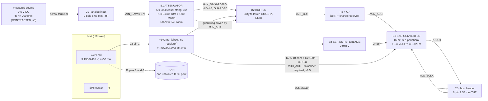

# blocks.md - bb-adc block diagram, the central decision, and the error budget

Mode `learning block-basics:` -> scope `block-only`, binding `canonical`.
Geometry is an OUTPUT (section 6). Every number below is at the TERMINAL (J1),
on a 5.000 V reading, uncalibrated, per the answered Q2.

---

## 1. Block diagram - signal AND power



The source current comes from J1, not from `+3V3`: 5 V across 1.00 Mohm is
5 uA, supplied by the thing being measured. J1 carries no rail budget.

---

## 2. The blocks

**B1 - attenuator (`resistive-attenuator`).** Five IDENTICAL 200 kohm
0.02 % / 10 ppm-per-degC thin-film chip resistors in one series string, tapped
3:2 (top arm = 3 units = 600 kohm, bottom arm = 2 units = 400 kohm). Ratio
K = 0.400 exactly, Rtot = 1.00 Mohm, Thevenin 240 kohm. Lead part class:
Vishay/RESI **PTFR0603Q** series 0.02 % / 10 ppm (200 kohm value confirmed in
JLC stock, s3). NOT a matched network - the reason is arithmetic and is s3.
The tap (`/AIN_DIV`) is the most sensitive net on this board and carries a
guard ring driven from the buffer output.

**B2 - buffer (`precision-buffer`).** Unity-gain follower, CMOS input,
rail-to-rail in and out, on the same `+3V3`. It is what reconciles "high-Z to
the source" with "low-Z and fast to the SAR", and P1 recorded three
independent arithmetic grounds for it (loading, settling, digital coupling).
**SUPERSEDED BY s8.3/s8.4: the lead part is now OPA320 class with OPA333 the
alternate, and the buffer's justification is now unconditional.**
Lead part: **OPA333** class (zero-drift chopper: Vos 10 uV max, drift
0.05 uV/degC max, Ib 200 pA max at 25 degC / 400 pA over temp, GBW 350 kHz,
Iq 25 uA). Named alternate, SAME SOT-23-5 footprint: **OPA320** class
(20 MHz, settles 0.01 % in 0.32 us) if the P4 settling bench (s7) fails at the
chosen clock. The alternate costs Vos 150 uV max -> 0.38 mV at the terminal,
which the budget can absorb; OPA333 is preferred because it removes the buffer
from the accounting entirely.

**B3 - converter (`sar-adc`).** 16-bit SAR, SPI peripheral, single 3.3 V
supply, TRUE external reference pin accepting a sub-VDD voltage, analog input
range that includes 0 V (AVSS), and - the constraint that decides this block -
offset and gain error specified as MAXIMA, not typicals, small enough that
1/K = 2.5x of them fits the budget. Lead part: **ADS8326IB** class (16-bit
NMC, VREF 0.1 V..VDD, VDD 2.7-3.6 V, offset +/-1 mV MAX, gain +/-16 LSB MAX at
2.7 V/2.5 V, INL +/-2.5 LSB MAX, reference current 7 uA max at 10 kSa/s,
MSOP-8). **P1's lead candidate MCP3201 is OVERRULED - see s4.**

**B4 - reference (`series-voltage-reference`).** 2.048 V series (not shunt)
bandgap, serving the converter's VREF pin ONLY - non-ratiometric, confirmed by
recorded decision. Lead part: **ADR4520B** class (2.048 V, +/-0.02 % initial
max, 2 ppm/degC max). A-grade **ADR4520A** (+/-0.04 %, 8 ppm/degC) is the
cheaper fallback that still closes RSS; see s5 for what the grade buys.

Excluded by MODE, recorded so they are visible and are NOT reviewer findings:
input TVS/clamp/series protection, any filtering the datasheets do not require
(including a ferrite anywhere in the converter's supply path), a second
rail or boost to 5 V, an on-board regulator, indicators, straps, test points,
split ground planes, series damping on SCLK/CS.
**AMENDED at the research fold - see s8.5: the series RESISTOR at the
converter's rail entry is NOT excluded and IS fitted (R7 + C8), because the
ADS8326's own recommended application circuit shows it. The tier excludes
filtering the datasheet does not require; this is filtering it does.**

---

## 3. THE CENTRAL DECISION - source impedance, Rtot, ratio/VREF, network vs discrete

These are one choice, not four. The chain of reasoning is arithmetic
throughout, and each link is checkable.

### 3.1 The structural fact that forces the shape

A 0-5 V input must be attenuated BEFORE anything else, because 5 V exceeds the
board's only rail. Every alternative that avoids drawing current from the
source needs an input stage that can accept 5 V (a follower on a >5 V rail - a
second rail, out by mode) or a difference amplifier (whose input impedance IS
its input resistor, so it loads identically, and the stocked AD8275-class part
loads a 1 kohm source ~40x worse). **Source loading is therefore structural.
Its only lever is the ratio Rs/Rtot, and the board controls exactly one half of
that ratio.**

Loading error = -Rs/(Rs + Rtot) of the reading = -5000 mV x Rs/Rtot at the spec
point. It is one-sided (always low), unremovable without calibration (excluded
by answered Q2), and unknowable to the board.

### 3.2 The stock evidence that caps Rtot (live parts_search, 2026-08-16)

The task flagged that high-value precision thin-film may degrade above ~1 Mohm.
At JLC it is much worse than that, and this single fact decides (b) and (d):

| Grade | Highest value IN STOCK | Evidence |
|---|---|---|
| 0.01 % / 2 ppm (the scout's discrete pick) | **10 kohm** (60 pcs); 1 kohm (932 pcs) | whole `RNCF0603TKW` family swept: every other value is stock 0; catalog itself stops at 11.5 kohm |
| 0.01 % / 25 ppm | **100 kohm** (`PTFR0603T100KP9`, 1005 pcs, $1.26) | only value in stock in that grade |
| **0.02 % / 10 ppm** | **200 kohm** (`PTFR0603Q200KN9`, 4150 pcs, $0.60) | also 100 kohm (4715 pcs) |
| 0.05 % / 5 ppm | 100 kohm (26 pcs - unusable depth) | 150 kohm and 500 kohm rows all stock 0 |
| 0.1 % / 25 ppm | >= 1 Mohm (63 545 pcs, $0.054) | deep stock, but 5x looser |
| matched network LT5400 | deep stock ONLY at 1k/5k elements ($13.87); 100 kohm quad = 11 pcs at $61 | 20 rows swept |

So: **0.02 % ratio-grade resistance stops at 200 kohm. Above that the only
stocked grade is 0.1 %.** A megohm-class divider is not a tight divider.

### 3.3 Why the attenuator is a DISCRETE EQUAL-VALUE STRING, not a matched network

Three independent refusals, any one sufficient:

1. **Ratio quantization.** A quad of equal elements can only make
   K in {0.2, 0.25, 1/3, 0.5, 2/3, 0.75, 0.8}. With a 2.5 V reference,
   K = 0.5 puts full scale at EXACTLY 5.000 V. Counting only the reference's
   own +/-0.02 % and the network's +/-0.0125 % ratio match, a real unit's full
   scale can be 4.9984 V - so a 5.000 V input, the requirement's own stated
   maximum, saturates at code 65535 on that unit. That is not an error term,
   it is a functional refusal. Every other network ratio (1/3, 0.25) throws
   away 18-39 % of the range and inflates LSB and INL with it.
2. **Value.** The only deep-stock LT5400 rows have 1 kohm and 5 kohm elements
   -> Rtot <= ~12 kohm -> 417 mV of loading at Rs = 1 kohm. The 100 kohm quad
   (Rtot 400 kohm max) exists at 11 pieces and $61.
3. **Cost/parts.** Five 0.02 % chip resistors cost $2.98 and are one BOM line;
   the network is $13.87-61 for a worse answer here.

What the string buys back, and it is the finding worth keeping: **equal
elements in series AVERAGE their tolerances.** For a top arm of n_t units and
a bottom arm of n_b units of relative tolerance t,

```
dK/K = (1 - K) x (delta_bot - delta_top),  sigma = (1 - K) x sqrt(1/n_t + 1/n_b) x t
```

For 3:2 at K = 0.4 that is 0.6 x 0.913 x t = **0.548 t**, versus **0.849 t**
for a two-resistor pair of different values. The string is 36 % better on ratio
error and 36 % better on ratio TCR mismatch than a pair of the same grade -
free, from geometry alone. **Conflict resolved explicitly:** the
`afe-support` scout's convention (ratio error ~ sqrt(2) x tolerance) omits the
(1-K) weighting and the averaging; it overstates a 3:2 string's ratio error by
2.6x. The scout's number LOSES; the derivation above is used.

### 3.4 Ratio and VREF: K = 0.400, VREF = 2.048 V, full scale 5.120 V

Ratio and reference are one choice because FS = VREF/K, and because **1/K is
the weight every post-divider error carries to the terminal.** Bigger K is
better for error weight; smaller K is needed for headroom.

| VREF | K | FS | headroom at 5.000 V | error weight 1/K | verdict |
|---|---|---|---|---|---|
| 2.5 V | 0.5 (1:1) | 5.000 V | **0.0 %** | 2.00 | REFUSED - top of the stated range clips (s3.3) |
| 2.5 V | 0.4 (3:2) | 6.250 V | 25 % | 2.50 | wastes 20 % of codes, LSB 1.22x bigger, no gain |
| 2.5 V | 0.476 (11:10) | 5.250 V | 5.0 % | 2.10 | best weight, but needs 21 equal elements |
| **2.048 V** | **0.400 (3:2)** | **5.120 V** | **2.4 % = 120 mV** | **2.50** | **CHOSEN** |

2.4 % of headroom is 120 mV against a worst-case combined ratio+reference
spread of ~0.045 % = 2.3 mV, i.e. 50x margin - the top of the range is usable
on every unit. The 2.048 V reference also buys a binary LSB (78.1 uV at the
terminal, 16 bits) and ~785 mV of dropout margin at the 3.135 V worst-case
rail instead of the 2.5 V part's ~335 mV.
**The dropout sentence is WITHDRAWN - both figures came from a footnoted family
headline and neither applies. See s8.2: the real margin is 87 mV, the 2.5 V
member actually has MORE, and 2.048 V wins on realisable ratio instead.**

### 3.5 (a) The source impedance the board CONTRACTS to accept: **Rs <= 200 ohm**

This is the recorded relaxation and the thing the owner must see at H1.

The answered Q9 pair (source <= 1 kohm, board >= 100 kohm) is jointly
impossible: 1 kohm into 100 kohm is 50 mV against a 5 mV budget. One number had
to move. **Both moved, in opposite directions:**

- board input impedance **100 kohm -> 1.00 Mohm** (10x tighter than answered;
  a strengthening, no owner ruling needed);
- source impedance **1 kohm -> 200 ohm** (5x narrower than answered; this
  NARROWS the board's validity envelope and needs the owner's sight).

Why 200 ohm and not something else, at Rtot = 1.00 Mohm:

| Contracted Rs | loading term | 25 degC RSS total | 0-50 degC worst-case sum (target 12.0) |
|---|---|---|---|
| 1 kohm (as answered) | 5.00 mV | **5.87 mV - FAILS** | 14.3 mV |
| 500 ohm | 2.50 mV | 3.96 mV | 11.8 mV (1.7 % margin - at the wall) |
| **200 ohm (CHOSEN)** | **1.00 mV** | **3.23 mV** | **10.3 mV (14 % margin)** |
| 100 ohm | 0.50 mV | 3.11 mV | 9.79 mV |

200 ohm is the loosest contract that leaves the published worst-case number
real margin; below it the return is ~0.1 mV per halving. What Rs <= 200 ohm
excludes, stated plainly: a potentiometer wiper (a 10 kohm pot is 2.5 kohm at
mid-travel), a resistive sensor divider, any source behind a series resistor
above 200 ohm. What it includes: a bench supply output, a buffered DAC or
sensor output, an op-amp output, a low-value divider. **If the owner needs a
1 kohm source, the board that does it is Config C in s5 - it exists, it closes
RSS at 25 degC with 15 % margin instead of 35 %, and its published worst-case
over-temperature number is 18.7 mV against a 12 mV target.** That trade is the
owner's to make at H1; the recommendation is to keep the 200 ohm contract.

### 3.6 Where the megohm route dies (the leakage question, answered)

Pushing Rtot to 5 Mohm to keep the 1 kohm contract costs three things at once:

- the resistors drop from 0.02 % / 10 ppm to 0.1 % / 25 ppm (nothing tighter
  is stocked above 200 kohm), which alone takes the ratio term from 0.55 mV to
  2.74 mV and the TCR term from 0.68 mV to 1.71 mV;
- Thevenin goes 240 kohm -> 1.2 Mohm, so the buffer's own bias current becomes
  a 0.60 mV (25 degC) / 1.20 mV (0-50 degC) term instead of 0.12/0.24 mV;
- **leakage stops being a layout detail and becomes the spec.** A 1 Gohm
  surface path (no-clean flux + humidity, and JLC does not wash boards) from
  the tap to the 3.3 V rail injects 1.3 nA. At 240 kohm that is 0.78 mV at the
  terminal; at 1.2 Mohm it is 3.9 mV - the whole budget, from something no
  datasheet bounds. A guard ring driven at the node's own potential collapses
  the driving voltage across that path from 3.3 V to the buffer's Vos (<= 10 uV),
  i.e. by 3.3e5, so it works at either impedance - but at 1.2 Mohm the board's
  claim would rest on an estimate with a +/-3x error bar rather than on
  datasheet maxima.

**The guard ring is a REQUIREMENT at 240 kohm too, not an option** - it is in
`constraints.json` placement, s6, and the sim list.

---

## 4. Overruling P1's converter: MCP3201 is disqualified by its own datasheet

P1 chose MCP3201-BI/SN on reference architecture, stock and price. Its DC
accuracy table (DS21290F, pulled and read this session) was not reported, and
it disqualifies the part:

| MCP3201-B spec | value | at the terminal (K = 0.4, FS 5.12 V, LSB 1.25 mV) |
|---|---|---|
| INL | +/-1 LSB max | 1.25 mV |
| Offset error | +/-1.25 typ, **+/-3 LSB MAX** | 3.75 mV |
| Gain error | +/-1.25 typ, **+/-5 LSB MAX** | **6.10 mV** |

**Gain error alone, at its guaranteed maximum, is 1.22x the entire +/-5 mV
25 degC budget.** No combination rule rescues that: a single term larger than
the total fails RSS and worst-case alike. Spending the +/-1.25 LSB TYPICAL
instead is exactly what recorded decision 12 and TI SNAA320B s4 forbid for an
uncalibrated design.

The root cause is structural and worth keeping: **LSB-denominated DC error
specs shrink 16x in relative terms when you move from 12 to 16 bits.** The same
"+/-3 LSB offset, +/-5 LSB gain" on a 16-bit part would be 0.23 mV and
0.38 mV. `power.md`'s finding that "12 bits or better is functionally 14 bits
minimum" was right for the wrong reason - it is not quantization that forces
resolution here (0.63 mV at 12 bits, 12.5 % of budget), it is that every
converter DC spec is quoted in LSB.

Replacement class and lead candidate: **ADS8326IB** (16-bit, 2.7-5.5 V, VREF
0.1 V to VDD, external reference pin, +IN - (-IN) range 0 to VREF so 0 V is
inside the range, SPI 3-wire read-only, MSOP-8, 250 kSPS at 5 V / 200 kSPS at
2.7 V). Its DC table at VDD = 2.7 V, VREF = 2.5 V - the actual operating class:
offset **+/-1 mV MAX**, gain **+/-16 LSB MAX**, INL **+/-2.5 LSB MAX**, offset
drift 0.2 ppm/degC, gain drift 0.3 ppm/degC, reference current **7 uA max at
10 kSa/s**. Every one of those is a MAX, which is the whole point.

Two consequences that travel with the swap:
- The **IB grade is required.** The plain-I grade (offset +/-1.5 mV, gain
  +/-33 LSB) gives a 25 degC RSS of 4.80 mV - 96 % of the budget with nothing
  left. Recorded as a hard selection constraint.
- The ADS8326's 7 uA maximum reference current **retires the VREF trace-IR
  rule** `power.json` derived from an assumed 1 mA: 7 uA x R_trace << LSB/2
  (15.6 uV) is satisfied by any trace up to 2.2 ohm. The reference still sits
  next to the converter's VREF pin, but for the CHARGE-RESERVOIR reason
  (per-conversion kickback), not for IR drop. Conflict resolved explicitly;
  `power.json`'s 0.4 mm / 10 mm width rule is not carried forward.

---

## 5. THE ERROR BUDGET - three (a)-(d) combinations, mV at the terminal on a 5.000 V reading

All three share the same converter (ADS8326IB), buffer (OPA333 class) and
reference family, so the table isolates the four coupled variables.

| | **Config A - CHOSEN** | **Config B - matched network** | **Config C - keep Rs <= 1 kohm** |
|---|---|---|---|
| (a) contracted Rs | **<= 200 ohm** | <= 1 kohm (as answered) | <= 1 kohm (as answered) |
| (b) Rtot | **1.00 Mohm** | 400 kohm (best a 100k quad can do) | 5.00 Mohm |
| (c) K / VREF / FS | **0.400 / 2.048 V / 5.120 V** | 0.500 / 2.5 V / 5.000 V | 0.400 / 2.048 V / 5.120 V |
| (d) form | **5 x 200k equal string, 0.02 %/10 ppm** | LT5400B-class quad, 0.025 % match / 0.2 ppm track | 5 x 1M equal string, 0.1 %/25 ppm |

| # | Term | A 25 degC | A 0-50 degC | B 25 degC | B 0-50 degC | C 25 degC | C 0-50 degC |
|---|---|---|---|---|---|---|---|
| 1 | Source loading, Rs/Rtot (one-sided) | 1.00 | 1.00 | 12.50 | 12.50 | 1.00 | 1.00 |
| 2 | Divider ratio, initial | 0.55 | 0.55 | 0.63 | 0.63 | 2.74 | 2.74 |
| 3 | Divider ratio TCR, +/-25 degC | - | 0.68 | - | 0.01 | - | 1.71 |
| 4 | Reference initial accuracy | 1.00 | 1.00 | 1.00 | 1.00 | 1.00 | 1.00 |
| 5 | Reference tempco, +/-25 degC | - | 0.25 | - | 0.25 | - | 0.25 |
| 6 | Reference 2nd order (hyst + long-term + line reg) | 0.57 | 0.57 | 0.57 | 0.57 | 0.57 | 0.57 |
| 7 | Buffer Vos + drift | 0.03 | 0.03 | 0.02 | 0.02 | 0.03 | 0.03 |
| 8 | Buffer Ibias x Rthev | 0.12 | 0.24 | 0.04 | 0.08 | 0.60 | 1.20 |
| 9 | Divider-node leakage, GUARDED (estimate) | 0.10 | 0.10 | 0.05 | 0.05 | 0.50 | 0.50 |
| 10 | Converter INL | 0.20 | 0.20 | 0.19 | 0.19 | 0.20 | 0.20 |
| 11 | Converter offset (+ drift) | 2.50 | 2.53 | 2.00 | 2.02 | 2.50 | 2.53 |
| 12 | Converter gain error (+ drift) | 1.22 | 1.26 | 1.22 | 1.26 | 1.22 | 1.26 |
| 13 | Converter noise (rms) | 0.08 | 0.08 | 0.06 | 0.06 | 0.08 | 0.08 |
| 14 | Quantization, +/-0.5 LSB | 0.04 | 0.04 | 0.04 | 0.04 | 0.04 | 0.04 |
| | *(LSB at the terminal, for scale)* | *0.078* | | *0.076* | | *0.078* | |
| | **RSS TOTAL** | **3.23** | **3.36** | **12.79** | **12.80** | **4.27** | **4.75** |
| | **WORST-CASE SUM** | **8.35** | **10.29** | **18.61** | **18.97** | **14.03** | **18.70** |
| | TARGET | 5.00 | 12.00 | 5.00 | 12.00 | 5.00 | 12.00 |
| | headroom at 5.000 V input | 2.4 % | | **0.0 % - CLIPS** | | 2.4 % | |

Notes on the rows:
- Row 2/3 use `sigma = (1-K) sqrt(1/n_t + 1/n_b) t`; the worst-case column uses
  `(1-K) x 2t`. For B, 0.025 % is already a matched-PAIR spec, so worst case is
  `(1-K) x 0.025 %` with no sqrt(2).
- Row 6 is RSS'd from class figures (thermal hysteresis 100 ppm, long-term
  24 ppm/1000 h, line regulation 47 ppm over the rail's 0.33 V span). Load
  regulation drops out: 7 uA of reference current is 0.34 ppm. **P3 replaces
  these with the ADR4520 datasheet's own numbers.**
- Row 8 uses OPA333's 200 pA max at 25 degC and its 400 pA full-temperature
  max for the 0-50 degC column (the only guaranteed figure covering 50 degC).
- Row 9 is the one ESTIMATE in the table (+/-3x). Unguarded, the same paths
  give 0.78 mV (A/B) and 3.90 mV (C) - which is why the guard ring is a
  requirement, not a nicety.
- Rows 11/12 fold the drift terms in for the 0-50 degC column.

### Which wins, and why

**Config A wins.** It is the only one of the three that closes the answered
spec on the ruled RSS basis at BOTH temperatures with real margin (3.23 mV of
5.00, 3.36 mV of 12.00), and the only one whose worst-case sum also closes the
0-50 degC spec (10.29 mV of 12.00).

- **B fails outright**, and twice: 12.50 mV of source loading (2.5x the whole
  budget) because a matched network cannot be built above 400 kohm, and a
  functional refusal at zero headroom. Fixing only the loading (contract
  Rs <= 200 ohm as well) brings B to 3.67 mV RSS - competitive - but the
  headroom refusal stands, the 100 kohm quad is 11 pieces at $61, and the
  deep-stock LT5400 rows are 1k/5k elements. The network branch is dead on
  ratio quantization, value and stock, not on its (excellent) tempco.
- **C is the honest alternative** and the one to hand back if the owner needs
  a 1 kohm source: it passes RSS at both temperatures. It costs 15 % rather
  than 35 % of RSS margin at 25 degC, publishes an 18.7 mV worst-case
  over-temperature number against a 12 mV target, and moves the board's biggest
  uncertainty from datasheet maxima to a leakage estimate.

### The claim this board makes

Per recorded decision 12, on the RSS basis with the worst-case sum published
beside it:

> **+/-3.2 mV of a 5 V reading at 25 degC and +/-3.4 mV over 0-50 C (RSS,
> uncalibrated). Worst-case sum: 8.4 mV at 25 degC, 10.3 mV over 0-50 degC.**

The board meets the answered 0.1 % class (5 mV / 12 mV) on RSS at both
temperatures and on worst case over temperature. It does NOT meet 0.1 %
worst-case at 25 degC (8.4 mV = 0.17 %), and it will not be advertised as
doing so. The three terms that own that gap are the converter's offset
(2.50 mV), its gain error (1.22 mV) and the source loading (1.00 mV) - the
first two are exactly what a single host-side gain/offset constant would
remove, which answered Q2 forbids. Recorded so the cost of the word
"uncalibrated" is visible.

Reference grade: the numbers above use **ADR4520B** (0.02 % / 2 ppm). The
A-grade (0.04 % / 8 ppm, $5.75 cheaper, 3x the stock) still closes RSS -
3.66 mV / 3.90 mV - but its worst-case sum becomes 9.35 / **12.04** mV, i.e. it
just MISSES the 12 mV over-temperature worst case that the B grade clears at
10.29 mV. Under this mode cost is relaxable and accuracy is not, so the B grade
is the recommendation; the A grade is the recorded fallback if B stock lapses
before P3, and taking it means the published worst-case number goes over the
over-temperature target.

---

## 6. What the LAYOUT needs (geometry is an OUTPUT - no size is chosen here)

Stated as needs and mechanisms, per the `canonical` binding. P5 opens with
`board_init --outline auto`; P6 earns the outline with
`board_edit --outline fit`.

1. **A straight-line signal path, J1 end to J2 end.** J1 -> attenuator ->
   buffer -> converter -> J2, in that spatial order, so no SPI return current
   has any reason to flow through copper under the attenuator or the reference
   (constraint D4). The board's LENGTH is whatever that chain plus two
   connector depths comes to.
2. **The tap is the shortest high-impedance run on the board.** `/AIN_DIV`
   (240 kohm Thevenin) runs from between R3 and R4 to the buffer's + input and
   nowhere else. This packs the 5-resistor string against the buffer.
3. **Room for a guard ring.** `/AIN_BUF` copper must fully encircle the
   `/AIN_DIV` trace and the buffer's + input pad on F.Cu, with clearance on
   both sides. That is a real area cost around one pin and one short trace, and
   it sets the local density - the annealer must not be allowed to close it up.
4. **Digital-to-analog separation.** No SPI net over, or parallel within
   2.5 mm of, `/AIN_DIV`, `/AIN_ADC` or `VREF`; any unavoidable crossing is
   perpendicular and >= 5 mm from the converter's analog pins (D2). This sets
   the board's WIDTH more than part sizes do.
5. **The reference beside the converter's VREF pin**, its bypass cap within
   2.5 mm of that pin on the same layer with no via between pad and cap.
6. **B.Cu is one unbroken GND pour, and nothing may be placed on it** (D1,
   and single-sided assembly). Consequence for the outline: F.Cu must carry
   every track, so the board must be generous enough that routing never needs a
   bottom-side jumper anywhere near the analog section.
7. **Mounting**: 4 x M3 clearance (3.2 mm) inset from the corners if the earned
   outline allows; 2 on opposite corners if it does not.
8. **No stated dimension was relaxed** - requirements.md section 5 deliberately
   states none, precisely so bb-buck's 35 x 25 accident cannot repeat.

For reference only, NOT an input to P5: the chain above is roughly two
10-15 mm clusters between two connectors, so the earned outline will land in
the 35-50 mm x 20-30 mm region. That sentence exists so the H1 reader can sanity
check the fab quote; if placement earns something else, placement is right.

---

## 7. Sim candidates for the P2/P4 sim leg (numeric pass windows)

The benches worth building are the ones that catch a WRONG VALUE or a WRONG
DYNAMIC, not the ones that re-derive the DC budget above.

1. **`divider-ratio` (DC op).** Source 5.000 V behind Rs = 200 ohm into the
   5 x 200 kohm string. PASS: V(`/AIN_DIV`) = 1.99920 V +/- 0.00055 V
   (nominal K x (1 - Rs/Rtot), window = the RSS ratio tolerance). Catches a
   wrong resistor value, a 3:2 arm swapped to 2:3 (gives 3.000 V), and proves
   the loading term is the 1.00 mV the budget claims.
2. **`acquisition-settling` (transient).** Buffer + R6 + C7 driving the
   converter's sampling network (48 pF switched through 100-150 ohm), worst
   case: a full-scale inter-sample step. PASS: V(`/AIN_ADC`) within 15.6 uV
   (1/2 LSB at the ADC node) of final within 9.0 us (4.5 DCLOCK at
   fDCLOCK = 500 kHz). This is the bench that decides OPA333 vs OPA320: at
   350 kHz GBW the requirement is ~4.0 us, so it passes at 500 kHz and fails
   above ~1 MHz. Catches an oversized R6, an undersized C7, and an
   over-slow buffer.
3. **`buffer-stability` (AC + step).** Buffer loaded by R6 + C7 + the
   converter input. PASS: phase margin >= 45 deg, step overshoot <= 5 %, and no
   ringing above 1/2 LSB at the sample instant. Catches the classic op-amp
   into a capacitive load oscillation that the DC budget cannot see.
4. **`zero-scale-swing` (DC sweep).** Sweep J1 from 0 to 5.2 V. PASS: at
   V(J1) = 0 V the buffer output is <= 1.0 mV above GND (= 2.5 mV at the
   terminal, inside budget), and the transfer stays within 0.5 mV of the ideal
   0.400 slope across 0 to 5.12 V. Catches "rail-to-rail output does not mean
   rail-to-rail at load" - the recorded footgun - and proves the answered
   requirement that 0 V is measurable.
5. **`reference-kickback` (transient).** Inject the converter's per-conversion
   reference charge demand (24 pF reference input capacitance redistributed per
   bit trial; 7 uA average at 10 kSa/s) into the reference plus its bypass.
   PASS: VREF recovers to within 15.6 uV of its settled value before the next
   conversion begins (>= 44 us at the 22.7 kSa/s the 500 kHz clock gives), with
   a bypass value inside the ADR4520's own stated stable range. Catches an
   undersized REF cap and - the real failure mode - a habitual 1 uF fitted
   outside the reference's stability window.

A sixth, as a sensitivity check rather than a bench: inject 1 nA into
`/AIN_DIV` and confirm the terminal moves 0.78 mV. That number is the guard
ring's justification and should appear in the design doc.

---

## 8. What the research leg changed (written AFTER s1-s7, and it overrides them)

Four research tasks closed after this document's first pass, producing 32
verified, page-cited records. Five things moved. Nothing in the topology, the
ratio, the stackup or the error budget did - the one part-count change (s8.5)
costs the budget nothing.

### 8.1 The `-IN` remote sense - a new architecture item, not a layout detail

**`U1 -IN` is wired to the attenuator string's BOTTOM NODE (`R5`'s grounded
pad), not to a ground point at the converter.** It is a schematic requirement
at P4 and a routing constraint at P7.

The mechanism is the one thing s3 missed: **a divider passes a ground offset at
UNITY while dividing the signal by K = 0.400.** So an offset between the string
bottom and the converter's negative reference is referred to the input
multiplied by 1/K = 2.5 - **1 mV of copper offset is 2.5 mV at the terminal,
half the 25 degC budget**, from a decision that looks like ordinary grounding.
It was the largest layout-controlled error term on the board and it is now made
to cancel exactly: `+IN` carries `V_tap + (GND_A - GND_C)`, `-IN` carries
`(GND_A - GND_C)`, and the difference is `V_tap`.

Two riders. (a) The bottom of the string is a *reference tie*, not a ground
connection - it must not share copper with any return carrying other current,
because that copper's IR drop adds at full weight. (b) It is **bounded**: the
ADS8326 specifies `-IN` at **-0.3 V to +0.5 V** relative to device ground.
Expected offsets here are millivolts, three orders inside the window, so the
architecture is comfortable - but the bound is what stops a future revision
running the sense line to a distant or noisy ground and calling it Kelvin
sensing. (P3 caveat: the datasheet's common-mode-range figure is plotted at
VDD 5 V with VREF >= 2.5 V, so this board's 3.3 V / 2.048 V point is off the
plotted range; confirm at the real operating point during extraction.)

### 8.2 Reference: the dropout argument in s3.4 was wrong, the choice was right

**s3.4's "~785 mV of dropout margin, versus the 2.5 V part's ~335 mV" is
withdrawn.** Both halves came from a family headline that is footnoted to
`VOUT >= 3 V` and applies to neither member.

The real numbers, from the spec table: ADR4520 (2.048 V) conditions its whole
spec on VIN 3-15 V with **dropout 1 V MAX** at no load and at 2 mA, so its
guaranteed floor is **3.048 V** - **87 mV of margin** on the 3.135 V worst-case
rail. And dropout in this family is **per member and not monotonic in output
voltage**: 1 V at 2.048 V, 500 mV at 2.5 V, 100/300 mV at 3.0 V. So the 2.048 V
part has the *worst* dropout of the family, and **the 2.5 V member is NOT
disqualified on headroom** - its floor is 3.0 V and it has 135 mV of margin,
*more* than the part we chose. The earlier claim that it "would need 3.50 V"
applied the 2.048 V member's dropout to it and was wrong.

**2.048 V still wins, on the correct grounds: realisable ratio and range
utilisation.** An equal-element string can only make `n_b/(n_t+n_b)`, so the
reference voltage and the element count are one choice. K = 0.400 from five
elements puts full scale at 5.120 V and a 5.000 V input at 97.7 % of range.
Matching that with a 2.5 V reference needs K ~ 0.4545 (5/11) or 4/9 - **nine to
eleven equal elements** - or K = 0.5 with two, which returns full scale to
exactly 5.000 V and clips the stated maximum input (s3.3). Second order, and
recorded so it is not rediscovered as an objection: at fixed full scale a higher
VREF refers the converter's offset to the terminal through a smaller 1/K (2.05
vs 2.50), worth ~0.45 mV - real, but not worth six more resistors, and terminal
INL is unchanged because FS = VREF/K either way.

One more consequence for the BOM: **`C5` is not a DNP candidate.** The ADR4520
specifies a load-capacitance *window* of **1 uF min to 100 uF max**, and the
2.048 V and 2.5 V members need 1 uF where the >= 3.0 V members need only
0.1 uF. The output cap is a compensation element inside the loop; both ends
bind. The same window contains the converter's required REF bypass, which is
what closed the "does this need a reference buffer or an isolation resistor"
risk: **neither is fitted.**

### 8.3 Buffer: baseline moves to OPA320 class; OPA333 alive, pending one fact

**s2's lead part is superseded. The baseline is an OPA320-class fast RRIO CMOS
part; OPA333 is the alternate, on the same SOT-23-5.** Two independent legs, at
the declared `t_acq` = 9 us:

1. TI's own chain gives a driver GBW floor of `4/(2*pi*R_FLT*C_FLT)` with
   `R_FLT <= t_acq/(12*C_FLT)`, which **collapses to `GBW >= 48/(2*pi*t_acq)`
   = 849 kHz - independent of R and C.** You cannot buy your way out with a
   bigger reservoir cap. OPA333 is 350 kHz.
2. OPA333's own settling curve, measured at unity gain: **40.4 us to 0.01 %,
   50.5 us to 0.001 %**, against a 9 us window.

A third argument - that the settling ceiling and the stability optimum on the
series resistor have an *empty intersection*, so no legal R exists - **is
withdrawn.** TI's eq 2 is an OPTIMUM, not a maximum, and the same document
permits a smaller resistor when voltage error dominates; the vendor's own
instruction is that phase margin "must be" settled by SPICE. **The series-R and
stability question is therefore handed to the P8 sim leg** (`buffer-stability`,
PM >= 45 deg, overshoot <= 5 %), not to `constraints.json`.

The rejection is also **conditional on `t_acq` = 9 us**, which is the open P3
extraction question: is the ADS8326's acquisition host-controlled (the CS-high
interval, so it stretches at 10 kSa/s) or fixed by a clock-cycle count? If it
stretches past ~22 us, leg 1 dissolves and OPA333 becomes preferred - it is 30x
better on drift. Cost of the swap if it stands, already priced into s5: Vos
150 uV max and 5 uV/degC instead of 10 uV and 0.05 uV/degC, i.e. ~0.4 mV at
25 degC and ~0.7 mV over temperature at the terminal, moving RSS 3.23 -> ~3.30 mV.

### 8.4 The buffer is UNCONDITIONAL, and s2's three grounds were the weak ones

All three grounds in s2 are conditional - on `t_acq`, on the amplifier, on a
coupling estimate. This one is not:

> **A switched-capacitor SAR input presents an equivalent average resistance
> `R_eq = 1/(f_sample * C_SH)`. At 10 kSa/s with C_SH = 48 pF that is
> ~2.08 Mohm. The attenuator's 240 kohm Thevenin into 2.08 Mohm is a gain error
> of 240k/(240k+2080k) = ~10 %** - about 500 mV at the terminal, a hundred times
> the budget.

It holds at any acquisition time and for any converter with a capacitive
sampling input, because **slowing the sample rate RAISES `R_eq`.** A bufferless
divider is dead on DC loading alone, before settling is discussed. The buffer is
a requirement of the topology; only *which* buffer is open.

### 8.5 One part-count change: `R7` + `C8`, the converter's rail entry

**s2's exclusion list was wrong on one line, and the orchestrator has ruled.**
The ADS8326's own recommended application circuit feeds VDD from the host rail
through a **5-10 ohm series resistor with 0.1 uF + 10 uF at the pin**. P1's
power architect wrote the escape hatch for exactly this - *"IF the chosen
converter's own datasheet shows a ferrite or series R in its recommended
application circuit, it goes in - it is then a datasheet requirement, which the
mode keeps"* - and a verified, page-cited record now shows the condition met.
The tier excludes filtering the datasheet does **not** require; this is
filtering it does.

So the board gains `R7` (5-10 ohm, 10 ohm class) and `C8` (10 uF), with `C2`
moving to the new `VDD_ADC` net. Four things worth keeping:

- **It isolates `U1` alone.** `U2` and `U3` stay on `+3V3` *upstream* of `R7` -
  the same figures put the reference and the op amps on the analog rail, not
  behind the converter's RC.
- **It costs the error budget nothing.** ~60 uA typical at a 10 kSa/s data rate
  through 10 ohm is ~0.6 mV of DC drop, and the conversion is referenced to
  `VREF`, not to VDD. No budget row, no change to s5.
- **The no-FERRITE half of the old rule stands.** A ferrite is still the reflex
  addition nothing here requires, and an unrequired impedance in a converter's
  supply can choke its own transient demand.
- **Why the original ruling misfired:** it was argued as an AVDD-vs-DVDD
  partition question ("one rail, one converter, no separate logic supply"). The
  ADS8326 in MSOP-8 has a **single VDD pin**, so there is no partition to make -
  and the resistor at issue was never between AVDD and DVDD, it was at the rail
  entry. Right answer to the wrong question.

Do not confuse `R7` with the two other resistors this document discusses and
does **not** fit: the reference current-limiting resistor (which would sit
between a high-impedance reference *source* and `C3`, and is unnecessary
because the reference drives its bypass directly) and `R6`, the buffer's
isolation resistor on `U3`'s output, sized by the P8 sim leg.

### 8.6 Where the new `constraints.json` entries come from

Block B1's `constraints-emission` coverage class closed as an honest `gap`
(recorded), so this board's attenuator constraints were populated from the six
verified attenuator records directly rather than from a checklist. Trace, one
line per entry added or changed:

| `constraints.json` entry | traces to |
|---|---|
| corridor `R5`->`U1` (`GND`) - the `-IN` remote sense + its -0.3/+0.5 V bound | `resistive-attenuator-bottom-node-is-a-reference`, `sar-adc-analog-ground-and-remote-sense`, decisions 23/24/32/33 |
| corridors `R3`->`U3`, `R4`->`U3` (`/AIN_DIV`) - guard-ring area reservation | `resistive-attenuator-high-z-tap-guard-and-leakage` |
| group `converter` - reference CHARGE LOOP, and R-ordering (upstream of the cap, never between cap and pin) | `sar-adc-reference-charge-loop`, `sar-adc-reference-bypass-and-recharge`, `sar-adc-constraints-emission` |
| group `reference` - `C5` inside the 1-100 uF window, U2 at the load pin | `series-voltage-reference-output-cap-window`, `series-voltage-reference-kelvin-and-ir-drop`, decision 27 |
| group `attenuator` - `C6` across U3's supply pins, inputs away from supply routing | `precision-buffer-pin-decoupling-and-input-routing` |
| separation `U2`/`C5` vs `J2` (5 mm) | `sar-adc-high-z-node-vs-digital-aggressors`, `sar-adc-supply-bypass-and-rail-isolation`, D2 |
| separation `U2` vs `H1`/`H2` (5 mm) - mechanical stress | `series-voltage-reference-solder-shift-and-grade` (die-stress path; **the board-flex / mounting-hole / board-edge extension is our inference from it, not a page-cited rule**), decision 28 |
| `planes` B.Cu - whole converter on analog ground, guard single-sided | `sar-adc-analog-ground-and-remote-sense`, `resistive-attenuator-high-z-tap-guard-and-leakage`, D1 |
| `power` `VDD_ADC` + group `converter` gains `R7`/`C8` - the rail-entry RC, and `planes._why` drops the "no series R" half | `sar-adc-supply-bypass-and-rail-isolation` (ADS8326 p.26 + figs 44/45 p.27), `power.json`'s own escape hatch, orchestrator ruling |

And four things research produced that are deliberately NOT in
`constraints.json` - listed in its `_meta.refused`: the trace-WIDTH lever (the
`w` in that coupling model is copper *thickness*, a stackup constant - the
levers are length, spacing and edge rate), any 1 nF overshoot figure from
OPA333 fig 15 (the curve spans ~10-605 pF and does not reach 1 nF), the
withdrawn "no legal isolation resistor exists" rejection, and ADI's published
100 mohm-per-inch copper figure (~40x a `rho*L/(W*t)` estimate of the same
geometry; carried quoted-not-endorsed).
