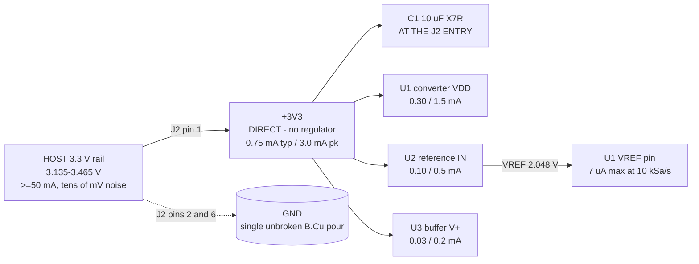

# power_tree.md - bb-adc rails, budgets and the decoupling that is EARNED

Lifted from `research/power.json` and reconciled against the final block
choices (16-bit ADS8326-class converter, ADR4520B-class 2.048 V reference,
OPA333-class buffer, 1.00 Mohm attenuator). Three numbers changed; each change
is called out.

## 1. Rail tree

| Rail | Vin | Topology | Typ | Peak | Declared | Dissipation |
|---|---|---|---|---|---|---|
| `+3V3` | host, via J2 | **direct** (no regulator) | 0.75 mA | 3.0 mA | **11 mA** | 36 mW ceiling, ~2.5 mW typ |
| `VREF` | `+3V3` | series voltage reference, 2.048 V | 7 uA | 50 uA | **1 mA** | ~1 mW in U2 |
| `GND` | - | B.Cu return pour | 0.75 mA | 3.0 mA | 11 mA | in the above |

| Consumer | Typ | Peak | Basis |
|---|---|---|---|
| U1 VDD (converter) | 0.30 mA | 1.5 mA | ADS8326-class: 10 mW at 5 V / 250 kSPS, 0.2 mW at 2.7 V / 10 kHz. At 3.3 V and <= 22 kSa/s this is well under 0.3 mA; the peak covers SPI drive current |
| U2 (reference Iq + its load) | 0.10 mA | 0.5 mA | ADR45xx-class Iq ~0.9 mA max in the family; 0.1 mA typ is the low-load figure. The REF-pin load itself is only 7 uA |
| U3 (buffer) | 0.025 mA | 0.2 mA | OPA333 Iq 17-25 uA. The named alternate OPA320 is 1.45 mA, which the declared 11 mA still absorbs |
| attenuator | 0 | 0 | **5 uA, and it comes from J1** - 5 V across 1.00 Mohm, supplied by the measured source, not by the rail |
| bias / leakage / decoupling | 0.05 mA | 0.5 mA | allowance |
| **sum** | **0.48 mA** | **2.7 mA** | declared 11 mA keeps ~4x headroom over the peak and 4.5x under the host's stated 50 mA |

**Changes from `research/power.json`, each with its reason.** (i) U1's typical
current drops from 0.6 mA to 0.30 mA - the class estimate assumed a delta-sigma
or a PGA-equipped part; the chosen SAR is a micropower one. (ii) The declared
11 mA is KEPT unchanged despite the lower estimate, because the named alternate
buffer (OPA320, 1.45 mA) must fit without re-declaring. (iii) The VREF rail's
current falls from 1 mA to 7 uA max - the converter's own spec - which retires
the VREF trace-IR width rule; see s3.

Nothing on this board sequences anything: one rail cannot violate an ordering
constraint against itself. No supervisor, no soft start, no discharge - and the
mode excludes them anyway. Inrush is 10 uF to 3.3 V = 54 uJ.

## 2. Thermal: `thermal_constraints` is EMPTY, deliberately

36 mW at the declared ceiling, ~2.5 mW typical. The largest single dissipation
is the reference at ~1 mW: in SOIC-8 that is a fraction of a degree of
self-heat, i.e. single-digit ppm on a 2 ppm/degC part. No exposed pad, no via
array, no heatsink, no airflow requirement, nothing within 500x of the 0.5 W
flag threshold. Temperature still binds this design - as reference tempco and
resistor TCR tracking in the error budget - but not as a cooling problem.

One thermal effect that WAS checked and does not apply: divider self-heating.
25 V^2 / 1.00 Mohm = 25 uW across five parts, 5 uW each. Recording the negative
result so it is not re-raised.

## 3. Decoupling and reference bypass - what is required and why

Everything here is either arithmetic or a datasheet requirement. Nothing is
reflex, because reflex filtering is what the scope tier excludes.

| Where | What | Why |
|---|---|---|
| `+3V3` at the J2 entry (C1) | 1-10 uF X7R, **10 uF preferred** | The host feeds this board through ~0.5-1 uH of lead and header. A 1 mA step in 100 ns across 1 uH is `L di/dt` = 10 mV on the rail; the same step into a 10 uF local reservoir is `dQ/C` = 10 uV - ~600x better, one part. The same cap gives ~30-45 dB at 1 MHz, taking 30 mVpp of host ripple to ~1 mVpp at the board |
| converter VDD pin (C2) | 100 nF X7R 0402/0603, <= 2 mm from the pin, own via to the pour | ADI MT-031: low-inductance ceramic 0.01-0.1 uF, mounted as close to the converter as possible. This cap IS the SPI drivers' current loop (D3) |
| converter VREF pin (C3) | per the ADS8326 datasheet's recommended circuit; **P3 reads it**, floor 100 nF X7R, <= 2.5 mm from the pin, SAME layer, no via between pad and cap | A SAR redistributes charge onto its reference every bit trial. The cap is the reservoir; the reference IC cannot supply that transient |
| reference IN pin (C4) | 100 nF X7R (or the ADR4520 datasheet's value) | It is the reference's only HF rejection above its own loop bandwidth |
| reference OUT pin (C5) | **ONLY what the ADR4520 datasheet allows - read it, do not assume** | Some reference families require an output cap inside a specified range and oscillate outside it; others are stable with any load. Fitting a habitual 1 uF is a real, recorded failure mode. C5 may end up DNP |
| buffer V+ pin (C6) | 100 nF X7R, <= 2 mm from the pin | one cap per supply pin, never shared |
| converter analog input (C7 + R6) | R6 20-100 ohm, C7 1-2.2 nF **C0G/NP0** | C7 is the charge reservoir for the sampling transient; R6 isolates the buffer's output stage from a switched capacitive load so the loop stays stable. **C0G/NP0, not X7R**: X7R's voltage coefficient and dielectric absorption are settling errors at 16 bits. Final values come from sim bench 2 and 3 |

**No ferrite and no series resistor between the converter's supply pins.** Both
pins are one net fed from one host rail through a connector; there is no
separate logic supply here, so ADI MT-031's ferrite recommendation (written for
a converter whose digital side runs off a different rail) does not apply, and an
inserted impedance sits exactly where the datasheet assumes a low one. It is
also "filtering the datasheet does not require", which the scope tier excludes.
The mode and the engineering agree. ESCAPE HATCH, unchanged: if the chosen
converter's own datasheet shows one in its recommended application circuit, it
goes in - P3 applies that test.

## 4. What the reference needs from a 3.135 V rail

- **Headroom.** A 2.048 V output leaves 1.09 V of raw headroom (VIN - VOUT) at
  the 3.135 V worst-case rail, i.e. **787 mV above the family's ~300 mV
  dropout** - against 335 mV for a 2.5 V part, roughly 2.3x better.
  **RISK, and the sharpest one on this board:** the LCSC catalog lists
  the ADR45xx family's supply range as **3 V to 15 V**, which if it is a
  datasheet minimum rather than a family-wide convenience leaves only 135 mV of
  margin at 3.135 V. ADI's own datasheet could not be reached this session
  (analog.com times out from this environment and LCSC mirrors only a
  placeholder for ADI parts - the same gap `research/afe-support.md` hit).
  **P3 MUST confirm `Vin_min <= 3.035 V` from the real datasheet before this
  part is committed.** If it cannot, the fallbacks in order are: MAX6070AAUT21
  class (2.048 V, 0.04 %, VIN_min 2.7 V - check stock, the B-grade row at
  0.08 % does NOT meet the budget), or a 2.048 V part from any family that
  specifies below 3.0 V at 0.05 % / 10 ppm or better.
- **DC rail rejection is a non-issue with the right class of part.** Line
  regulation of ~290 uV/V max over the rail's 0.33 V span is 47 ppm on 2.048 V
  = 0.23 mV at a 5 V reading, 4.7 % of the 25 degC budget. The same rail
  tolerance costs 250 mV if the converter references the rail directly. **One
  three-terminal part turns a 250 mV error into a 0.23 mV error** - that
  comparison is the argument for this whole architecture, and it is why
  ratiometric operation was rejected by a factor of 50, not marginally.
- **HF rejection is done by the decoupling, not by the IC.** A series
  reference's PSRR is a loop-gain effect: strong at DC, largely gone by the SPI
  clock's fundamental. That is what C4 and C1 buy.
- **Load regulation drops out of the budget.** At 7 uA of reference current
  (the converter's own max at 10 kSa/s), 100 uV/mA is 0.7 uV = 0.34 ppm.
- **VREF trace IR: RETIRED as a rule.** `power.json` derived
  "`>= 0.4 mm wide, <= 10 mm long`" from an assumed 1 mA of reference current.
  At the real 7 uA, keeping `I x R_trace` well under LSB/2 (15.6 uV) allows
  R_trace up to 2.2 ohm - satisfied by any track this board could draw. The
  reference still sits adjacent to the converter's VREF pin, but for the
  charge-reservoir reason above, not for IR drop. Recorded so the retired rule
  does not reappear as a P7 finding.

## 5. Power-up

Turn-on settling for a series reference of this class is ~120 us to 0.1 %, and
0.1 % of 2.048 V is 2 mV = the whole 25 degC budget, so the datasheet's own
settling spec is not the number that matters: reaching ~10 ppm takes ~1.7x
longer on a single-pole tail, and an output cap stretches it further.

**Requirement on the host, recorded not built: wait >= 10 ms after `+3V3`
before trusting a conversion.** That is >= 50x the worst case in this class and
invisible to any host.

The one real ordering hazard is hot-plugging J2 while the host drives SCLK/CS -
current then flows through the converter's input clamps into an unpowered rail.
Rail and signals arrive on the same connector, so the exposure is a single
mating event; the mode excludes series/clamp mitigation and answered Q5 accepted
the no-protection consequence. Recorded, not proposed.

## 6. Digital return - D1 to D5 carried forward verbatim, and why they still bind

A CMOS output slewing into ~15 pF of trace, header and host input draws
~10 mA edges. Those edges are **correlated with the conversion instant by
construction**, so they alias to DC and do not average out over samples. That,
not broadband noise, is what the following buys. All five survive the converter
change unchanged; D2's arithmetic gets easier because the node it protects is
240 kohm rather than 600 kohm, and the buffer's ~1-10 ohm closed-loop output
absorbs the injected charge in nanoseconds either way.

- **D1.** Every SPI net on F.Cu only; the B.Cu pour stays unbroken beneath the
  entire analog section (J1, all five divider elements, the buffer, `/AIN_ADC`,
  `VREF`, the reference, the converter's analog pins). No B.Cu track, slot or
  keepout may cross that region. On two layers a bottom-side jumper IS a cut in
  the return plane; if one is unavoidable it sits outside that region and runs
  perpendicular to the analog return direction.
- **D2.** No SPI net over, or parallel within 2.5 mm of, `/AIN_DIV`,
  `/AIN_ADC` or `VREF`. Unavoidable crossings perpendicular and >= 5 mm from
  the converter's analog pins.
- **D3.** The converter's VDD decoupling cap IS the SPI drivers' current loop:
  cap within 2 mm of the pin, ground via within 1 mm of its pad, loop area
  <= 20 mm^2.
- **D4.** Analog at the J1 end, digital at the J2 end; the converter sits
  nearer J2's digital pins than the analog nodes do, so no SPI return has a
  reason to flow under the divider or the reference. J2 pin order
  `+3V3, GND, /CS, /SCLK, /DOUT, GND` keeps ground adjacent to the digital
  group at both ends of it.
- **D5.** Host-side, recorded not built: do not clock SPI during the
  sampling/conversion window - read the previous result between conversions.
  Free, and it removes the one coupling path that aliases to DC.

**One refinement considered and REJECTED with its number.** The chosen
converter has a pseudo-differential input, so its `-IN` could Kelvin-sense the
divider's own ground instead of tying to the pour, cancelling any IR drop
between the two. The drop it would cancel is ~10 mA of transient SPI return
through ~2.5 mohm of pour = 25 uV at the ADC node = 62 uV at the terminal,
which is 1.2 % of the budget. Not worth a second ground net and the
short-at-one-pad construction it needs. `-IN` ties to `GND` at the converter,
with its own via to the pour. Recorded so it is not re-proposed - and note that
the 62 uV figure is only that small BECAUSE D3 keeps the digital loop small.

## 7. Excluded by mode - visible, and NOT reviewer findings

Second rail; boost to 5 V; LDO or any regulator; pi filter or ferrite at the J2
entry; ferrite or series R between the converter's supply pins; TVS, clamp or
series protection on J1; series damping resistors on SCLK/CS; supply supervisor
or sequencer; split ground planes; test points beyond the block's own need;
conformal coating.

Not excluded, not proposed: a 25 degC single-point gain/offset calibration in
the host would remove ~3.7 mV of the 8.35 mV worst-case sum at a stroke -
almost exactly the converter's own offset and gain terms. Answered Q2 specifies
uncalibrated, so the board is designed uncalibrated. Recorded so the owner can
see what that word costs.
