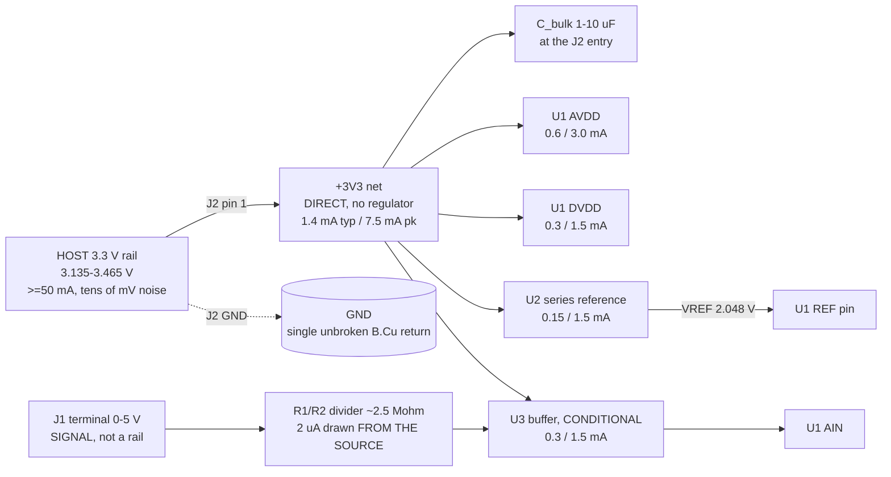

# power.md - bb-adc rail tree, and the analog supply / reference architecture

P1 research-power-architect, 2026-08-16. Inputs: `requirements.md` (whole file; the s9
ANSWERED table binding) + `reference/constraints_schema.md`. Siblings ran in parallel,
so **every number is a requirement on a part parameter, never a part choice**;
machine-readable form with each figure's basis in `power.json`. The rail tree is s1 and
it is short, honestly - s2-s8 are the content: here the supply and the reference ARE the
measurement.

---

## 1. Rail tree - one rail, `direct`, no regulator

| Rail | Vin | Topology | Typ | Peak | Declared | Dissipation |
|---|---|---|---|---|---|---|
| `+3V3` | host, via J2 | **direct** (no regulator) | 1.4 mA | 7.5 mA | **11 mA** | 36 mW ceiling, ~5 mW typ |
| `VREF` | `+3V3` | series reference, 2.048 V nom | 0.05 mA | 0.5 mA | 1 mA | ~3 mW in U2 |
| `GND` | - | B.Cu return pour | 1.4 mA | 7.5 mA | 11 mA | in the above |

Consumers - **all ESTIMATES BY CLASS, no part chosen**:

| Consumer | Typ | Peak | Basis |
|---|---|---|---|
| U1 AVDD | 0.6 mA | 3.0 mA | low-power SPI delta-sigma / 16-bit SAR at <=10 kSa/s is 0.2-1.5 mA; 3.0 mA covers input buffer + PGA enabled |
| U1 DVDD | 0.3 mA | 1.5 mA | `I = C x V x f`: 15 pF of trace+header+host input at 3.3 V toggling at 5 MHz (10 MHz SCLK) = 0.25 mA per active line. SPI activity IS this term |
| U2 reference | 0.15 mA | 1.5 mA | Iq 42-50 uA (CMOS series ref, SBVS032) to ~1 mA for a low-noise grade, plus the REF-pin load: ~50 uA delta-sigma, 0.1-0.5 mA SAR |
| U3 buffer (conditional, s7) | 0.3 mA | 1.5 mA | precision CMOS RRIO amp, 60 uA micropower to 1.5 mA fast/low-noise |
| bias, leakage, decoupling | 0.05 mA | 0.5 mA | allowance, not a measurement |
| **sum** | **1.40 mA** | **7.5 mA** | declared 11 mA = peak x ~1.4 |

- **The attenuator's current comes from J1, not from `+3V3`** - 5 V across 2.5 Mohm is
  2 uA, supplied by the measured source. J1 carries no rail budget.
- 11 mA against the host's >=50 mA: 4.5x margin. Nothing here is near a limit.
- 36 mW whole-board. **No part exceeds 0.5 W, so `thermal_constraints` is empty -
  deliberately.** Largest single dissipation is the reference at ~3 mW: in SOT-23 at
  theta-JA 336 degC/W (SBVS032) that is 1.1 degC of self-heat = 11 ppm at 10 ppm/degC =
  0.05 mV of a 5 V reading. Checked because at 0.01 % class it would not be negligible.
- `block-only` excludes a second rail. Section 3 confirms none is needed: a 2.048-2.5 V
  series reference is in regulation from 3.135 V with >=0.585 V to spare.

---

## 2. Ratiometric vs external reference - a clean negative result

Reference the converter to the `+3V3` host rail and the rail's error becomes a gain
error on every reading: `dR/R = -dVREF/VREF` [SNAA320B s3.3: "Line regulation error
directly gets translated into gain error"].

| Case | Reference error | At a 5 V reading | vs the +/-5 mV budget |
|---|---|---|---|
| Host rail, stated +/-5 % (answered Q7) | +/-165 mV | **+/-250 mV** | **50x over** |
| Host rail, optimistic +/-1 % | +/-33 mV | +/-50 mV | 10x over |
| Host rail, +/-0.5 % (better than any host rail) | +/-16.5 mV | +/-25 mV | 5x over |
| What would be needed | **+/-0.05 % = +/-1.65 mV** | +/-2.5 mV (half the budget) | - |

**Verdict: ratiometric cannot meet the requirement, and misses by 50x, not marginally.**
The 0-50 degC budget (+/-12 mV) fails by 21x on the same arithmetic. Nothing about it is
recoverable by layout, filtering or averaging - it is a DC gain term.

**Why that is not an unfair dismissal.** Ratiometric measurement cancels exactly when the
*source* is excited by the same rail that references the converter (bridge, pot across
AVDD, ratiometric sensor). Here the source is an independent external voltage (answered
Q1/Q9), so there is nothing to cancel. Structural, not a preference.

**So the board needs a reference of its own.** Two implementations qualify; the mode
prefers the one with fewer parts:

1. **The converter's internal reference - only if** its datasheet gives **MAX** (not
   typical) limits of <=0.05 % initial and <=10 ppm/degC over 0-50 degC. [SNAA320B s4:
   internal references "often lack maximum worst case values", so "calculating the worst
   case gain error of the system is difficult".] An uncalibrated design cannot spend a
   typical value: "typ 0.05 %, max unspecified" is a **fail** however good it looks.
2. **An external series reference**, 2.048 V preferred, 3-pin SOT-23 class.

A selection test, not a preference. Stated as such in `power.json`.

---

## 3. What the reference needs from a 3.135 V rail

**Dropout: not a constraint with the right class of part.** A CMOS series reference
specifies minimum supply as `VREF + 0.001 V` unloaded at 25 degC and `VREF + 0.05 V`
over -40 to +125 degC, dropout 1 mV typ / 50 mV max (SBVS032). Against the 3.135 V
worst case that is **1.037 V of margin at 2.048 V and 0.585 V at 2.5 V**; the 3.0 V
floor in Q7 clears both. REQUIREMENT: chosen part's `Vin_min <= 3.035 V` at its actual
load over 0-50 degC.

**2.048 V recommended over 2.5 V** - because of the attenuator, not the dropout. At
2.048 V the divider ratio is `K = 0.4` (3:2 arms, e.g. 1.5 M / 1.0 M), terminal full
scale is 5.12 V, and 5.000 V reads at 97.7 % of scale: 2.3 % of headroom for free, plus
a binary 31.25 uV LSB at 16 bits. A 2.5 V reference with equal arms (`K = 0.5`, the best
possible match and tracking) puts 5.000 V at exactly 100.0 % of scale with no headroom;
at `K = 0.4` it wastes 20 % of the range. Tradeoff: 2.5 V buys 1.7 dB of signal against
the converter's noise floor. At 0.1 % class the headroom is worth more.

**Does the host's rail error pass through the reference? At DC, essentially no.** Line
regulation is 110 uV/V typ / **290 uV/V max** (REF3020, SBVS032). Over the rail's full
0.33 V span: **95.7 uV on 2.048 V = 47 ppm = 0.23 mV at a 5 V reading**, 4.7 % of the
25 degC budget. The same rail error cost 250 mV ratiometrically. **One 3-pin part turns
a 250 mV error into a 0.23 mV error** - that comparison is the argument of this document.

**At the SPI clock's harmonics the reference rejects little - the decoupling does the
work.** PSRR is a loop-gain effect: strong at DC and LF, largely gone by 1-10 MHz. TI
states the remedy in the same terms [SNAA320B s6.3: series references have strong PSRR
"especially with bypass and load capacitors... A large supply decoupling capacitor helps
to improve the PSRR performance in case of noisy supply"]. Hence:

- **Bulk 1-10 uF X7R at J2's 3V3 pin (10 uF preferred) - earned by arithmetic.** The
  host feeds this board through ~0.5-1 uH of lead + header. A 1 mA step in 100 ns across
  1 uH is `L di/dt` = **10 mV on the rail**; with a 10 uF local reservoir the same step
  is `dQ/C` = 0.1 nC / 10 uF = **10 uV** (+ ~5 uV of ESR): ~600x better, one part. The
  same cap gives ~30-45 dB at 1 MHz (`Z_C ~ 20 mohm` mounted vs `Z_L ~ 3-6 ohm` of
  lead), taking 30 mVpp of host ripple to ~1 mVpp at the board.
- **100 nF (or the datasheet's value) at the reference IN pin.** SBVS032 recommends
  0.47 uF for its family; the chosen part's number wins.
- **The reference OUT cap is a datasheet question with a wrong answer available.** The
  REF30xx "does not require a load capacitor, and is stable with any capacitive load"
  (SBVS032); other families **require** one inside a specified range and oscillate
  outside it. Never fit a habitual 1 uF - read the part.
- **A cap at the converter's REF pin, close to the pin** [SNAA320B s7: "a capacitor must
  be placed very near to reference pin of SAR ADC"; a SAR redistributes charge on every
  bit trial, 600 uA peaks in their 12-bit example].

**Two DC error terms this path creates** (both budgeted in s7):

- *Load regulation* 3 uV/mA typ / **100 uV/mA max** (SBVS032) - at 1 mA of REF-pin
  current, 49 ppm = 0.24 mV at 5 V. It is a gain error, and it is why a converter with a
  small steady reference current (delta-sigma, buffered ref input) beats one with a large
  dynamic draw.
- *Reference trace IR drop*, which adds directly to that [SNAA320B s7: "Max voltage drop
  across trace must be much less than LSB/2"]. `LSB/2` = 15.6 uV at 16 bits, so with
  `I_ref <= 1 mA`, **R_trace <= 15 mohm = >=0.4 mm wide and <=10 mm long** in 1 oz copper
  (0.49 mohm/square -> 25 squares -> 12 mohm). `rules_gen` cannot derive that from 1 mA,
  so it is written into `power.json` as an explicit rule for P2.

---

## 4. AVDD and DVDD on one rail - no ferrite, no series resistor

**Verdict: tie them, decouple each pin, add nothing between them.** The reflex addition
is a ferrite (or small series R) between AVDD and DVDD. Here that is *filtering the
datasheet does not require*, which the scope tier excludes - and the engineering agrees
with the mode:

- Both pins are one net, fed from one host rail through a connector. An inserted
  impedance sits exactly where the datasheet assumes a low one. TI's data-converter
  applications position is to advise against it, because the ferrite can choke the
  converter's instantaneous current demand, e.g. at startup, offering a ~5 ohm series R
  plus decoupling as the alternative *if* filtering is genuinely needed (TI E2E,
  ADS1261-Q1 thread - forum-grade, consistent with the datasheets).
- The classic ferrite-in-VD recommendation [ADI MT-031 Fig. 5] is for the case where VD
  is a **different** supply: "Some of the newer, high speed ICs may have their analog
  circuits powered by +5 V, but the digital interface powered by +3 V to interface to 3 V
  logic. In this case... it is also advisable to connect a ferrite bead in series with
  the power trace that connects the pin to the +3 V digital logic supply." Not this
  board: there is no digital logic supply here, one rail and one converter.
- **Escape hatch:** if the chosen converter's own datasheet shows a ferrite or series R
  in its recommended application circuit, it goes in - it is then a datasheet
  requirement, which the mode keeps. P3 applies that test.

Required instead:

1. **One HF ceramic per supply pin** - 100 nF X7R 0402/0603, **<=2 mm from the pin**, own
   via to the pour. Not one cap shared by two pins. [MT-031: "low inductance ceramic
   types, typically between 0.01 uF and 0.1 uF", "mounted as close to the converter as
   possible to minimize parasitic inductance".]
2. **One bulk 1-10 uF at the rail entry** (s3 arithmetic), not at the converter.
3. **AGND and DGND, if the part has both, joined at the device** to the single return
   pour, minimum lead length. MT-031, verbatim: "the AGND and DGND pins should be joined
   together externally to the analog ground plane with minimum lead lengths";
   "connecting DGND to the digital ground plane applies VNOISE across the AGND and DGND
   pins and invites disaster!"; "The name 'DGND' on an IC tells us that this pin connects
   to the digital ground of the IC. This does not imply that this pin must be connected
   to the digital ground of the system."
4. **Do not split the return pour.** MT-031 offers the split-plane star for a
   single-board converter, but its premise is that the digital currents have their own
   supply and their own destination. Here every return - analog and digital - leaves
   through the same GND pin of J2, so a split would lengthen one path, not separate two
   systems. Single-sided assembly (requirements s7) reserves the whole bottom for the
   unbroken pour, so this costs nothing.

---

## 5. Digital return current from SPI - the constraint P6/P7 must honour

**Magnitude:** a CMOS output slewing 1 V/ns into 10 pF draws 10 mA [MT-031 Eq. 2]. MISO
drives the host input + trace + header (~15 pF); SCLK/CS/MOSI are driven *by* the host
into the converter's input capacitance. So ~**10 mA edges at 1-10 MHz** must get from the
converter to J2's GND pin, sharing a return system with a node of up to 600 kohm.

**Why MHz activity can become a DC error at all:** anything **correlated with the
conversion instant aliases to DC** and does not average out over samples. SCLK is
correlated with conversion by construction. That, not broadband noise, is what the
following buys.

- **D1. Every SPI net on F.Cu only; B.Cu stays unbroken beneath the entire analog
  section** (J1, both divider arms, buffer, AIN, VREF, reference, converter analog pins).
  No B.Cu track, slot or keepout may cross the region bounded by J1's pins, the divider
  and the converter's AIN/AGND pins. On 2 layers a bottom-side jumper IS a cut in the
  return plane; if unavoidable it sits outside that region, perpendicular to the analog
  return direction.
- **D2. No SPI net over, or parallel within 2.5 mm of, AIN / VREF / the divider
  mid-node**; unavoidable crossings perpendicular and >=5 mm from the analog pins.
  Order of magnitude: edge-coupled traces on 1.6 mm FR4 at 2.5 mm couple ~0.02-0.05
  pF/cm, so a 3.3 V edge over a 10 mm parallel run injects ~100 fC. Into an **unbuffered**
  600 kohm node with ~20 pF of local capacitance that is **~5 mV at AIN decaying over
  ~12 us** - comparable to the sample period. Into a buffer's ~1-10 ohm closed-loop
  output the same charge settles in nanoseconds. **Third independent argument for the
  buffer (s7).**
- **D3. The converter's DVDD cap IS the SPI drivers' current loop:** cap within 2 mm of
  the pin, ground via within 1 mm of its pad, loop <=20 mm^2 [MT-031 Fig. 5: the
  transient digital currents "flow in the small loop from VD through the decoupling
  capacitor and to DGND... will therefore not appear on the external analog ground
  plane"].
- **D4. Geometry: analog at the J1 end, digital at the J2 end.** The converter sits
  nearer J2's digital pins than the analog nodes do, so no SPI return has a reason to
  flow under the divider or the reference. Keep the answered J2 pin order (3V3, GND,
  then the SPI group) - GND is already adjacent to the digital pins.
- **D5. Host-side, recorded not built:** where the converter permits, do not clock SPI
  during the sampling/conversion window; read the previous result between conversions.
  Free, and it removes the one coupling path that aliases to DC.

---

## 6. Power-up and sequencing - nothing on this board sequences anything

- **Sequencing: none required, and one rail is the reason.** Two-supply converters carry
  AVDD-vs-DVDD ordering and delta limits; a single net cannot violate an ordering
  constraint against itself. No supervisor, no delay, no soft start - mode-excluded too.
- **Reference settling before the first valid conversion.** Turn-on settling for this
  class is **120 us to 0.1 % at CL = 0** (SBVS032). Two cautions: (a) 0.1 % of 2.048 V is
  2 mV = 1000 ppm = the *entire* 25 degC budget, so the datasheet's own settling spec is
  not the number that matters - reaching ~10 ppm takes ~1.67x longer on a single-pole
  tail, ~200 us; (b) an output cap stretches it (1 uF at a few hundred uA is
  milliseconds). **Requirement: the host waits >=10 ms after +3V3 before trusting a
  conversion** - >=50x the worst case, invisible to any host. If the converter offers
  offset/gain self-calibration, run it after that wait (s7: it is free error budget).
- **Inrush: none to manage.** 10 uF charged to 3.3 V is 54 uJ.
- **The one real ordering hazard is hot-plugging J2** while the host drives SCLK/CS -
  current then flows through the converter's clamps into an unpowered rail. Rail and
  signals arrive on the same connector, so exposure is a single mating event; the mode
  excludes series/clamp mitigation and answered Q5 accepted the no-protection
  consequence. Recorded, not proposed.

---

## 7. Does the budget close? - the cross-check that constrains the other agents

ppm of a 5 V reading (1000 ppm = 5 mV = the 25 degC budget; 2400 ppm = 12 mV over
0-50 degC). Reference terms assume a 0.05 % / 10 ppm-per-degC grade; drift uses the box
method over the full 50 degC span [SNAA320B Table 3-2].

| Term | 25 degC | adds over 0-50 degC | Source |
|---|---|---|---|
| Reference initial accuracy (incl. solder shift) | 500 | - | 0.05 % grade; SNAA320B s3.1 - solder shift is real and often unspecified |
| Reference tempco | - | 500 | 10 ppm/degC x 50 degC |
| Reference thermal hysteresis | 100 | - | SBVS032: 25 typ / 100 max ppm |
| Reference long-term drift | 24 | - | SBVS032: 24 ppm / 1000 h |
| Reference line regulation (rail span) | 47 | - | s3 |
| Reference load regulation + trace IR | 49 | - | s3 |
| Attenuator ratio error | 500 | - | 0.05 % ratio-matched network required |
| Attenuator TCR tracking | - | 250 | 5 ppm/degC tracking x 50 degC |
| Converter gain error, uncalibrated | 500 | 250 | selection requirement |
| Source loading `Rs/(R1+R2)` | 400 | - | Rs <= 1 kohm into 2.5 Mohm; one-sided |
| **RSS** | **~960** | **~1140 total** | **4.8 mV at 25 degC / 5.7 mV over temp** |
| **Worst-case sum** | **~2120** | **~3120 total** | 10.6 mV / 15.6 mV |

Findings that bind the other agents:

1. **The 25 degC spec is the hard one.** Terms grow ~1.5x from 25 degC to 0-50 degC while
   the allowance grows 2.4x. Design to +/-5 mV and the temperature spec follows.
2. **It closes RSS and fails worst-case-sum.** SNAA320B s4 states the accepted position:
   "In the real world, the error is between the worst-case and RSS method of results but
   closer to the RSS result." Recorded as a P2/H1 decision, not smoothed over: at 0.1 %
   class, uncalibrated, with three ~500 ppm terms, no arrangement of real parts closes
   worst-case. The lever, if the owner wants it, is a 0.02 %-class reference plus a
   0.02 % divider network.
3. **Prefer a converter with internal offset/gain self-calibration.** It removes the
   500 ppm converter-gain term and the offset term for free (it calibrates against VREF,
   so it cannot remove the reference's own error). RSS falls to ~820 ppm = 4.1 mV.
4. **"12 bits or better" is functionally "14 bits minimum".** At 12 bits the terminal LSB
   is 1.25 mV, so quantisation alone (+/-0.5 LSB = 625 uV) is 12.5 % of the budget; at 16
   bits it is 78 uV, 1.6 %.
5. **The buffer (U3) is required, on three independent grounds**, each arithmetic:
   - *Source loading.* A divider puts the source resistance in series with its top arm:
     error `= -Rs/(Rs+R1+R2)`. At the answered `Rs <= 1 kohm`, a 250 kohm divider gives
     **-3990 ppm = -19.9 mV** (4x the whole budget); 1 Mohm gives -5.0 mV; **2.5 Mohm
     gives -2.0 mV (400 ppm)**; 5 Mohm gives -1.0 mV. So the divider must be
     **2.5-5 Mohm**, not the 100 kohm-class part answered Q9's "board >= 100 kohm"
     permits. (P2 option: designing the ratio for a nominal `Rs` of 500 ohm halves the
     residual to +/-200 ppm.)
   - *Converter input current and settling.* 2.5 Mohm at `K = 0.4` presents **600 kohm
     Thevenin**. For bias-current error under 250 ppm the converter's own input current
     must be **<=800 pA at 50 degC** - true of some CMOS delta-sigma inputs, false of most
     PGA inputs (nA class), false of any unbuffered switched-cap SAR, which also needs
     `Rth x Cs` = 12 us of settling per acquisition against a ~1 us window.
   - *Digital coupling.* D2: ~5 mV of injected step on an unbuffered 600 kohm node.

   **Not a mode violation.** `block-only` excludes "any second IC the block does not need
   in order to work"; this one it needs to work **at the stated accuracy**, which the mode
   explicitly does not relax. P2 records it as support with this arithmetic, and H1
   should see it. If P3 finds a converter that faces a 2.5 Mohm divider directly, the
   buffer comes off the board.
6. **Converter input range must include 0 V (AVSS).** Many delta-sigma parts with an input
   buffer or PGA require the input to stay 100-200 mV above AVSS; such a part **cannot
   measure a 0 V input on a single 3.3 V rail** and would need a negative rail - a second
   rail and a mode boundary. Fully avoidable by selection (buffer-bypass mode, or a
   specified range that includes AGND), so it is a hard part requirement, not an
   escalation. Same for U3: RRIO with output within ~1 mV of ground at the converter's
   near-zero input load. That residual ~1 mV floor at a 0 V input is an offset, inside
   budget, and the spec point is at 5 V.

---

## 8. What is deliberately NOT here, and what is open

Excluded by mode, recorded so they are visible and are **not** findings for a reviewer:
second rail, boost to 5 V, LDO or any regulator, rail pi-filter or ferrite at the J2
entry, ferrite/series-R between AVDD and DVDD, TVS/clamp/series protection on J1, supply
supervisor or sequencer, split ground plane, test points beyond the block's own need.

Not excluded, not proposed: a 25 degC single-point gain calibration in the host would
remove ~500-700 ppm at a stroke [SNAA320B s5] and make this budget comfortable. Answered
Q2 says uncalibrated, so the board is designed uncalibrated. Recorded so the owner can
see what that word costs.

Safety flags (role rule): mains none; battery/charging none; >3 A none (11 mA); >30 V
none (5 V max). Nothing new to escalate. The one live safety item - the Q1 source
envelope - is already scheduled for H1 re-confirmation by requirements s9, not re-asked
here.

---

## Sources

- TI **SNAA320B**, *Voltage Reference Selection and Design Tips For Data Converters*,
  Nov 2019 rev. Jan 2024 - https://www.ti.com/lit/an/snaa320b/snaa320b.pdf - s3.1 solder
  shift, s3.3 line regulation as gain error, s4 internal references lack max limits +
  worst-case vs RSS, s5 calibration, s6.1 flicker, s6.3 PSRR, s7 reference driving
  capability and the LSB/2 trace-drop rule, Table 3-2 tempco-to-percent.
- TI **SBVS032**, *REF3012/3020/3025/3033/3040 CMOS voltage reference*, Mar 2002 -
  https://www.ti.com/product/REF3020 - dropout 1/50 mV, supply min VREF+0.001 V (25 degC)
  / VREF+0.05 V (over temp), line reg 110/290 uV/V, load reg 3/100 uV/mA, thermal
  hysteresis 25/100 ppm, long-term 24 ppm/1000 h, noise 28 uVpp and 65 uVrms at 2.048 V,
  turn-on 120 us to 0.1 %, theta-JA 336 degC/W, "does not require a load capacitor...
  stable with any capacitive load". **A class exemplar of what a series reference
  specifies - its 0.2 % / 50 ppm-per-degC grade does NOT meet this board.**
- ADI **MT-031 Rev. A**, *Grounding Data Converters and Solving the Mystery of AGND and
  DGND* - https://www.analog.com/media/en/training-seminars/tutorials/mt-031.pdf -
  AGND/DGND joined at the device, DGND not to a system digital ground, VD ferrite only
  for a separate logic supply, decoupling 0.01-0.1 uF close to the pin, Eq. 2 10 mA edge
  current, the local VD-cap-DGND loop.
- TI E2E, *ADS1261-Q1: Need for ferrite bead on AVDD* - https://e2e.ti.com/support/data-converters-group/data-converters/f/data-converters-forum/1308544/ -
  **forum-grade**, used only to corroborate the datasheet-level position that a ferrite
  between supplies can choke the converter's transient current demand.
