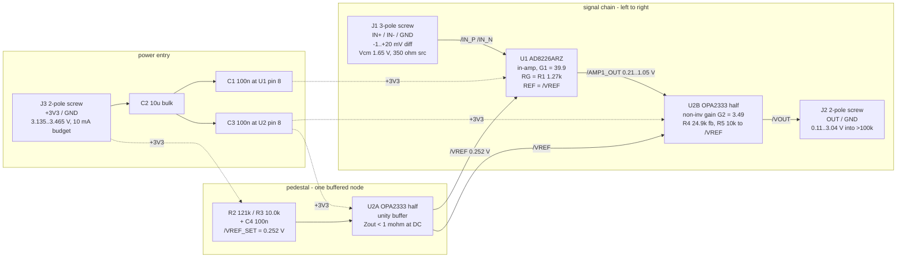

# bb-amp - block architecture (P2)

Mode `learning block-basics:` -> scope `block-only`, binding `canonical`.
Geometry is an OUTPUT: no board size is chosen here (see "What the layout
needs"). Part names are MPN / part class only - LCSC codes are P3's job.

Every AD8226 number below was read this session from the Analog Devices
AD8226 data sheet (Rev. C, 28 pp; Rev. D differs only in Table 4) - Table 3
(single supply, +VS = 2.7 V), the THEORY OF OPERATION / INPUT VOLTAGE RANGE
section (Equation 1..3 + Table 8), Figure 26 and Figure 59. OPA333/OPA2333
numbers are from TI SBOS351E section 6.6. The two P1 fragments are cited
where they win and named where they lose.

---

## 1. Block diagram - signal and power



GND is one net: J1 pole 3 (sensor return / cable shield), J2 pole 2, J3
pole 2 and the whole B.Cu pour are the same node.

---

## 2. The design point (this is the answer to "what gain, what pedestal")

Endpoints fixed by requirements 9a: Q5 input range -1 mV..+20 mV (+25 mV
overload, graceful clip), Q6 output window with a positive pedestal, Q9 flat
within 1 % at 1 kHz, Q10 rail 3.3 V +-5 %.

```
Vout = Vped + G_total * Vdiff      Vped = 0.252 V      G_total = 139.2 V/V
Vout(-1 mV) = 0.113 V     Vout(0) = 0.252 V     Vout(+20 mV) = 3.037 V
Vout(+25 mV) = 3.73 V demanded -> clips at (V+) - 0.05 V, recovers
```

Split as `G_total = G1 * G2 = 39.90 * 3.49`:

| stage | what sets it | value |
|---|---|---|
| G1 (U1 AD8226) | `G = 1 + 49.4k/RG`, RG = R1 = 1.27 k | 39.90 |
| G2 (U2B) | `G = 1 + R4/R5`, 24.9 k / 10.0 k | 3.49 |
| Vped | R2/R3 divider off +3V3, buffered by U2A | 0.252 V |

The stage-2 gain resistor R5 returns to **/VREF, not to ground**. That one
wire makes the algebra exact:

```
Vout1 = Vref + G1*Vdiff                       (U1, REF = Vref)
Vout  = Vout1 + (Vout1 - Vref)*R4/R5 = Vref + G1*G2*Vdiff
```

so the pedestal at the output is *exactly* Vref (no matched network, no
second reference node), and a shift of Vref appears at U1's REF and at the
stage-2 return with opposite sign - the reference's own drift and noise
cancel to first order and survive only as the gain-1 pedestal term.

**Why these three numbers and not the ones in my task brief** - each is
forced by a data sheet limit, derived in section 4:

- G1 = 39.9, not 100 (scout) and not 147 (owner sketch): AD8226 Equation 2
  caps the amplified differential swing at the internal gain-stage nodes.
- Vped = 0.252 V, not the "about 0.1 V" of Q6: the -1 mV worst case needs
  `G_total * 1 mV = 0.139 V` of room below zero scale, plus the output
  floor.
- G_total = 139.2, not the brief's nominal 165: `Vped + G*20 mV` must stay
  under the output ceiling **at the -5 % rail** (3.135 V - 0.07 V = 3.065 V),
  not just at 3.3 V.

---

## 3. Blocks

**B1 - input interface (J1).** 3-pole 5.08 mm screw terminal, IN+ / IN- /
GND, top side, hand-soldered. The third pole is not a convenience: it is the
input-bias-current return path both cited data sheets require
(refdesign D12; INA333 s8.2.2.5 "without a bias current path, the inputs
float to a potential that exceeds the common-mode range ... and the
amplifiers will saturate"). The 350 ohm bridge gives each input a ~175 ohm
DC path to that pole, so no 10 Mohm bleeders are added. Cable shield lands
on the same pole. No series R, no RC, no TVS: AD8226 inputs are protected to
+-40 V beyond the rails internally and the source is inherently current
limited (refdesign D13/D14) - and protection/filtering are out of scope at
`block-only`. Part class: 3-way 5.08 mm pluggable or fixed terminal block,
24-16 AWG; P3 picks the code and records whether it is THT (hand-solder) or
SMD (JLC-placeable).

**B2 - instrumentation amplifier (U1, AD8226ARZ, SOIC-8, A grade).** The
only part in the P1 sweep that clears the 3.3 V supply floor *and* the
bandwidth target: 2.2 V to 36 V single supply, -3 dB = 20 kHz at G = 100 and
160 kHz at G = 10 (Table 3), CMRR >= 106 dB min at G = 10 / 120 dB at
G = 100, 22 nV/rtHz input noise, 400 uA max quiescent. Gain is one resistor
(`G = 1 + 49.4k/RG`) - a single-resistor gain law is worth real money here
against the two-resistor ratio law of an ICF part (refdesign E3: "two 1 %
resistors can cause approximately 2 % maximum gain error at high gains").
It runs at G1 = 39.90 with its REF pin on the buffered 0.252 V node.
Support components its data sheet requires at this operating point, and
nothing else: R1 (RG) across pins 2-3, C1 100 nF at pin 8 plus the shared
C2 10 uF bulk (Figure 61).

**B3 - reference / pedestal (R2, R3, C4, U2A).** 121 k / 10.0 k off +3V3
gives 0.2519 V, bypassed by C4 100 nF (corner 172 Hz on the 9.24 k Thevenin),
buffered by one half of U2. The buffer is **not optional and not a scope
extra**: AD8226 Figure 59 draws a bare divider into REF, crosses it out and
marks "INCORRECT"; the text is quantitative - "source impedance to the REF
terminal should be kept below 2 ohm ... additional impedance ... results in
amplification of the signal connected to the positive input ... by
`2(50k + Rref)/(100k + Rref)` ... this uneven amplification degrades CMRR".
A 9.24 k Thevenin there would give a common-mode gain error of ~8.5 % - a
CMRR of about 21 dB, i.e. the block's entire reason for existing, destroyed.
Part class: precision zero-drift RRIO CMOS op-amp, OPA333/OPA2333 class
(OPA2333AIDR dual, SOIC-8): Vos 10 uV max, drift 0.05 uV/degC max, 1.8-5.5 V,
RRIO, 17 uA/channel, GBW 350 kHz.

**B4 - output gain stage (U2B, R4, R5).** The second half of the same dual.
Non-inverting, G2 = 3.49, gain resistor returned to /VREF (section 2). It
does three jobs at once: it recovers the gain that Equation 2 forbids in
stage 1, it injects the pedestal exactly, and it is the part that actually
swings rail-to-rail (30 mV typ / 50 mV max from either rail at RL = 10 k,
70 mV over temperature) - which the AD8226's own output stage
(0.10 V / VS - 0.10 V guaranteed) cannot do. Its own precision is
irrelevant: 10 uV offset / 0.05 uV/degC referred to the board input is
0.25 uV / 0.0013 uV/degC after division by G1 (refdesign D11 / SBOA356's
`Vosi + Voso/G` convention). C3 100 nF at pin 8.

**B5 - output interface (J2).** 2-pole 5.08 mm screw terminal, OUT / GND.
Also the block's measurement point, so no separate test point is added
(scope: test points excluded except the block's own measurement need). Load
is >= 100 k and <= 1 nF (Q8); the OPA2333 drives that with no isolation
resistor - a series R would be conditioning the data sheet does not require
here, and would add a divider error into a 100 k load.

**B6 - power entry (J3, C2).** 2-pole 5.08 mm screw terminal, +3V3 / GND,
plus the 10 uF bulk of AD8226 Figure 61. No regulator, no protection, no
second rail (all excluded at `block-only`). Budget and margins in
`power_tree.md`.

---

## 4. The four rulings

### Ruling 1 - the scout's grounded-REF topology is BROKEN. The owner's arithmetic holds.

`research/inamp.md` section B recommends AD8226 at G1 ~ 100 with **REF tied
to ground**, the pedestal injected downstream, "no REF buffer needed at
all". That is wrong twice over, and the first error is exactly the one the
owner computed.

Data sheet, Table 3, OUTPUT: `Output Swing, RL = 10 kohm to 1.35 V,
TA = -40 degC to +125 degC: 0.1 V min ... +VS - 0.1 V max`. On a 0 V rail
the guaranteed floor is +0.10 V. With REF = 0 V and G1 = 100:

| Vdiff | stage-1 output wanted | reality |
|---|---|---|
| -1 mV | -0.100 V | below 0 V, hard saturation |
| 0 mV | 0.000 V | 100 mV below the guaranteed floor |
| +1 mV | +0.100 V | exactly at the floor, nonlinear |
| +2 mV | +0.200 V | first linear point |

The bottom 2 mV of a 20 mV span - 10 % of full scale and the whole -1 mV
worst case of Q5 - dies in FIRST-stage saturation, and no downstream
pedestal can recover information stage 1 already clipped. **The scout loses
on its own cited part's output-swing row.** A positive REF is unavoidable;
and because the AD8226 is a classic 3-op-amp part, that REF must be driven
below 2 ohm (Reference Terminal section, Figure 59), so the buffer is
unavoidable too. The scout's structural argument for the split - "the second
IC pays for itself because REF can then be grounded" - therefore evaporates.
The split survives, but for a completely different reason (Ruling 2).

Second error, same section: G1 = 100 also violates the input-voltage-range
boundary. See Ruling 2.

### Ruling 2 - single-stage LOSES, and so does the scout's G1 = 100. The split is forced by the diamond, not by REF.

This is the ruling that changes the board. The AD8226 data sheet's INPUT
VOLTAGE RANGE section gives the diamond plot as three closed-form
inequalities (Rev. C p.20, Equation 1 to 3), with the constants in Table 8:

```
(1)  Vcm - |(Vdiff)(G)/2|  >  -Vs + V_-LIMIT
(2)  Vcm + |(Vdiff)(G)/2|  <  +Vs - V_+LIMIT
(3)  [ (Vdiff)(G)/2 + Vcm + Vref ] / 2  <  +Vs - V_REF_LIMIT

Table 8:  -40 degC: -0.55 / 0.80 / 1.30 V
          +25 degC: -0.35 / 0.70 / 1.15 V
          +85 degC: -0.15 / 0.65 / 1.05 V
```

Mechanism (same section): "internal nodes between the first and second
stages ... experience a combination of a gained signal, a common-mode signal,
and a diode drop. This combined signal can be limited by the voltage
supplies even when the individual input and output signals are not limited."
The equations reproduce the published diamonds: at VS = +2.7 V, G = 100,
VREF = 0 (Figure 12) they predict Vcm_max = 1.99 V at Vout = 0.02 V and
Vout_max = 2.4 V at Vcm = 0.8 V; the figure is annotated (0.02, 2.0) and
(2.4, 0.8). The model is validated before it is used.

**Equation 2 is binding here, and it is brutal at mid-rail common mode.**
Vcm = 1.65 V is fixed by the sensor (Q1: 3.3 V excitation, shared ground) -
it is not ours to move. Interpolating V+LIMIT over the 0-50 degC bench range
gives 0.739 V at 0 degC (worst) and 0.679 V at 50 degC:

| case | Vs | Vcm | max allowed `G*Vdiff` | max G at 20 mV FS |
|---|---|---|---|---|
| nominal, 25 degC | 3.30 | 1.65 | 1.90 V | 95 |
| nominal, 0 degC | 3.30 | 1.65 | 1.82 V | 91 |
| rail -5 %, 0 degC | 3.135 | 1.65 | 1.49 V | 75 |
| rail -5 %, excitation +5 %, 0 degC | 3.135 | 1.7325 | 1.33 V | 66 |

The owner's option (2) - AD8226 alone at G = 147 - wants 2.94 V of amplified
differential swing. It exceeds the boundary by 1.6x **in the most favourable
corner**, so it does not work at all: the internal nodes saturate long before
the output reaches 3.19 V. The scout's G1 = 100 wants 2.00 V and is over the
line at 0 degC even at the nominal rail. Both LOSE. This is the "classic
3.3 V killer" the task asked about, and it is decisive rather than marginal.

The data sheet prescribes the remedy in the same section: "if the application
requirements exceed the boundaries, one solution is to apply less gain with
the AD8226, and then apply additional gain later in the signal chain." Adding
its "designing with a few hundred millivolts extra margin is recommended ...
internal transistors begin to saturate, which can affect frequency and
linearity performance":

```
G1 = 39.90 (RG = 1.27 k):  node = Vcm + G1*Vdiff/2
  20 mV FS, nominal, 0 degC : 2.049 V vs 2.561 V limit -> 512 mV margin
  20 mV FS, worst corner    : 2.132 V vs 2.396 V limit -> 264 mV margin
  25 mV overload, worst     : 2.232 V vs 2.396 V limit -> 164 mV margin
Equation 3 at the worst corner: 1.241 V vs 1.927 V limit -> not binding
Equation 1: 1.15 V vs -0.27 V limit -> not binding
```

So: **two stages, G1 ~ 40 and G2 ~ 3.5.** The IC count is 2 either way (the
REF buffer was already mandatory), and the second gain stage costs two
resistors. It also fixes the output-swing problem for free, since the RRIO
CMOS op-amp, not the in-amp, is what faces the rails.

Alternatives considered and rejected:
- **AD8237 (ICF, high-Z REF, true rail-to-rail)** would dodge both the
  diamond and the buffer. Rejected: at the ~40x front-end gain this
  architecture needs, its closed-loop bandwidth (~25 kHz on the 1 MHz
  BW-strap setting) sits at its own ~27 kHz chop clock, which is exactly the
  condition its data sheet warns produces ~100 uV RTI clock ripple
  (refdesign E6) - 20x this board's whole error budget; plus 2x the price,
  1/5 the stock, a two-resistor gain law and a strap that is silently 5x
  wrong if mis-wired (refdesign L7).
- **AD8227** (pin-compatible, named by the AD8226 data sheet as the other
  escape from the boundary). Not scouted at P1 - no verified stock, price,
  bandwidth-at-gain or Equation-1..3 equivalents. Left in OPEN as the one
  thing that could collapse this to a single gain stage.

### Ruling 3 - the scout OVERSTATED the drift spec, the owner's two-term correction is right, and the board still MISSES the 5 uV budget. Accepted and quantified.

The scout's table says AD8226 drift is "0.5-2 uV/C max (B/A grade)". The
data sheet (Table 3, VOLTAGE OFFSET) says something different:

```
Total offset voltage: VOS = VOSI + (VOSO/G)
Input Offset  VOSI  average TC, -40..+125 degC:  0.5 typ / 2 max  (A grade)
                                                  0.5 typ / 1 max  (B grade)
Output Offset VOSO  average TC, -40..+125 degC:  2   typ / 10 max (A grade)
                                                  1   typ / 5 max  (B grade)
```

0.5 uV/degC is the TYPICAL of *both* grades, not the B-grade max; 2 uV/degC
is the A-grade max. The owner's structural point is correct and is the data
sheet's own equation. For AD8226ARZ (A grade) at G1 = 39.9:

```
RTI offset drift = VOSI_TC + VOSO_TC/G1
  typ : 0.5 + 2/39.9  = 0.550 uV/degC
  max : 2   + 10/39.9 = 2.251 uV/degC
```

The output term is 9 % / 11 % of the total, so the diamond-forced drop
from G = 147 to G1 = 39.9 costs only ~9 % of drift performance (2.251 vs
2.068 uV/degC) - the split is nearly free in this budget.

**Does the board meet the ~5 uV RTI budget of Q7 over 0-50 degC after
downstream zero+span calibration? No. Quantified, calibration at 25 degC,
worst excursion +-25 degC:**

| term | typ | A-grade max | mechanism |
|---|---|---|---|
| in-amp offset drift | 13.8 uV | 56.3 uV | (VOSI_TC + VOSO_TC/G1) x 25 degC |
| gain drift at FULL SCALE | ~30 uV | 87 uV | AD8226 -100 ppm/degC max (G>1) + RG 25 ppm + R4/R5 mismatch 50 ppm, x 25 degC x 20 mV |
| pedestal drift (R2/R3 TCR mismatch 25 ppm/degC) | 1.1 uV | 2.3 uV | dVped/G_total |
| CMRR vs rail-induced Vcm move (+-82 mV at >=106 dB) | 0.4 uV | 0.4 uV | static 1.65 V term calibrates out |
| noise, 0.1 Hz..1 kHz rms | 0.9 uV | 1.0 uV | 22.2 nV/rtHz RTI |
| **offset-like total (RSS)** | **13.9 uV** | **56.4 uV** | **2.8x .. 11.3x over the 5 uV budget** |
| **plus full-scale gain drift** | +30 uV | +87 uV | 12 .. 35 LSB of 4096 |

The honest restatement of Q7: 5 uV RTI on a 20 mV full scale over a 25 degC
excursion is **10 ppm of full scale per degC**. That is a laboratory-grade
temperature-coefficient target, not a "12-bit" one, and nothing in the
3.3 V-capable candidate set reaches it.

**The choice the task set out, and the ruling: (a) accept and record.**
Option (b) - INA333 at low gain plus a zero-drift second stage - was
evaluated with the workspace's own cited numbers and does not buy the spec:

- INA333 at G1 = 40 has 350 kHz/40 = 8.75 kHz of bandwidth (refdesign D8
  tabulates 35 kHz at G = 10, 3.5 kHz at G = 100). That is 1.25x the required
  7 kHz corner, against a spec with no minimum, versus 6.4x for the AD8226
  chain. It spends the whole bandwidth margin.
- It improves the offset term to roughly 5-6 uV over 25 degC (0.1 uV/degC
  typ input drift plus its output term at G = 40) - i.e. at best it lands
  ON the budget, typical only.
- It does NOT touch the term that is actually largest at full scale: INA333's
  own gain drift is +-50 ppm/degC max plus the external RG (refdesign E3),
  so ~37 uV RTI at full scale over 25 degC remains. Still 7x over.
- It costs a level-shift / summing network (matched pair) that the chosen
  architecture does not need, on a board whose purpose is to teach the
  fundamental circuit clearly.

Buying 2.5x on one term while another term stays 7x over, at the cost of the
bandwidth margin and of extra matched passives, is not an engineering win. It
is a more complicated board that misses the same spec. **Ruling: keep the
AD8226 chain, record the miss above, and record what would actually close
it** - a temperature-compensated (2-point over temperature) downstream
calibration, or a >=5 V rail with a chopper front end and a matched-network
gain set. Both are outside this board's stated rail and scope.

### Ruling 4 - the scout's three open items, plus the diamond

**4a. BW-at-gain was interpolated; confirmed against the curve.** Figure 26
(Gain vs. Frequency, 2.7 V single supply) shows the G = 1 / 10 / 100 / 1000
family as clean single-pole rolloffs with no peaking, and the -3 dB points
sit on the tabulated 1500 / 160 / 20 / 2 kHz. The G = 10 -> 100 decade is
1.6 -> 2.0 MHz of gain-bandwidth, so log-log interpolation is sound and
mildly conservative. At G1 = 39.9 the corner is ~45 kHz (GBW ~1.8 MHz).
The curve shape also validates the requirements' single-pole premise behind
"1 % droop at 1 kHz -> 7 kHz corner". Chain: 45 kHz (U1) cascaded with
350 kHz/3.49 = 100 kHz (U2B) -> f-3dB ~ 41 kHz, droop at 1 kHz ~ 0.03 %
against a 1 % budget. Slew is a non-issue: full-scale 1 kHz sine needs
0.009 V/us of the OPA2333's 0.16 V/us.

**4b. The discrete 3-op-amp family stays dead - but the scout's reasoning
was the wrong test.** The scout computed a *static* CMRR requirement
(Vcm/CMRR <= 2 uV -> >= 118 dB) and found 0.01 % resistors 44 dB short. The
static term is a fixed offset at a fixed 1.65 V common mode, and Q7 says zero
and span are calibrated downstream - so it calibrates out. The term that does
NOT calibrate out is the resistor network's CMRR **drift**:

```
error_RTI = Vcm x d(ratio mismatch)/dT x dT
  0.1 % thin film, uncorrelated 25 ppm/degC TCRs (50 ppm/degC mismatch):
    1.65 V x 50e-6 x 25 degC = 2.06 mV RTI of drift   (412x the budget)
  matched-pair network, 5 ppm/degC ratio TCR:
    1.65 V x  5e-6 x 25 degC = 0.21 mV RTI of drift   (41x the budget)
```

Three orders of magnitude, not a tuning problem, and no op-amp fixes it.
The monolithic alternative is laser-trimmed and characterised: AD8226 CMRR
vs temperature is 0.2 to -0.35 ppm/degC representative (Figure 32, G = 1),
i.e. <= 14 uV RTI over the same excursion at G = 1 and better at gain.
**Family C dropped, verdict confirmed, mechanism restated.**

**4c. The output window moves to 0.10 / 3.20 V - recorded as a decision, and
it is not the binding limit anyway.** Q6 assumed 0.05 V / 3.25 V. The AD8226
guarantees 0.10 V / (VS - 0.10 V) (Table 3, RL = 10 k to 1.35 V, -40 to
+125 degC), which is tighter. But in this architecture the board output is
the OPA2333's, specified at 30 mV typ / 50 mV max from either rail
(70 mV over temperature, RL = 10 k; better into the >= 100 k load of Q8) -
so the *board* window is ~0.07 / 3.23 V at the nominal rail. The declared,
conservative window is **0.10 V to 3.20 V**; the design lands at 0.113 V and
3.037 V, and the 3.037 V ceiling is set not by the swing spec but by the
-5 % rail corner (3.135 - 0.07 = 3.065 V). The AD8226's own 0.10 V floor
still binds stage 1, and that is what forced Ruling 1.

**4d. The diamond plot at the real operating point - the check neither agent
closed.** Done in Ruling 2 with the data sheet's own Equation 1 to 3 and
Table 8 (Rev. C p.20), cross-validated against Figure 12 (VS = +2.7 V,
G = 100) and Figure 13 (VS = +5 V, G = 100). **At the design point
(Vs = 3.135..3.465 V, Vcm = 1.65..1.73 V, Vref = 0.252 V, G1 = 39.9,
Vdiff <= 25 mV) all three inequalities hold with >= 164 mV of margin in the
worst corner and >= 264 mV at full scale**, meeting the data sheet's "a few
hundred millivolts extra margin" recommendation. At the gains either P1 agent
proposed, Equation 2 fails outright.

---

## 5. What the layout needs (geometry is an OUTPUT - no size is chosen)

P5 opens `board_init --outline auto`; P6 places to this list and then earns
the outline with `board_edit --outline fit`. What the placement must satisfy:

1. **A straight left-to-right chain**: J1 -> U1 -> U2 -> J2, with J3 on a
   third edge. Three screw terminals on three different edges is the only
   hard shape driver; each 5.08 mm terminal is ~10-16 mm of edge plus wire
   entry clearance in front of it.
2. **The input pair short, parallel and symmetric** from J1 to U1 pins 1 and
   4, over unbroken ground, nothing between them (constraints `corridors`
   J1->U1). Mechanism, not habit: refdesign L1/L3 - "when one input path has
   a frequency response that is different from the other", common mode
   converts to differential and CMRR over frequency collapses. Same copper
   width, same length, same via count on both.
3. **R1 (RG) directly across U1 pins 2-3**, parasitics matched on both pins
   (refdesign L2, AD8226 Layout section: parasitic capacitance at the
   gain-setting pins affects CMRR over frequency).
4. **C1 and C3 within ~2 mm of pin 8** of U1 and U2 with their own ground
   via at the pad (AD8226 Figure 61); C2 (10 uF) near J3.
5. **The reference cluster (R2, R3, C4, U2A) adjacent to U1 pin 6**, and C4
   on the *divider* node - never a capacitor directly on the buffer output
   (a follower into a capacitive load peaks).
6. **B.Cu is one unbroken GND pour under the whole chain**, no split and no
   slot beneath the input pair or under U1; the pour is the reference that
   makes item 2 true. All parts on F.Cu (single-sided assembly, and the back
   stays whole).
7. Nothing dissipates: total board power is 2.3 mW, so no copper area, via
   field or spacing is thermally driven. The outline is set by the three
   terminals and the chain, and by nothing else.

---

## 6. Simulation benches for P8 (sim-analyst authors these; windows are the gate)

All at TA = 25 degC unless stated, RL = 100 k, Vcm = 1.65 V.

| id | bench | pass window |
|---|---|---|
| B1 | DC transfer, sweep Vdiff -1..+25 mV, Vs = 3.3 V | Vout(0) = 0.252 V in [0.235, 0.270]; Vout(20 mV) = 3.037 V in [2.95, 3.12]; Vout(-1 mV) = 0.113 V in [0.095, 0.135] and > 0.07 V; best-fit slope 0..20 mV = 139.2 V/V in [135, 144]; INL <= 0.05 % FS (<= 1.5 mV at the output); Vout(25 mV) clipped in [3.15, 3.30] and monotonic (no fold-back) |
| B2 | stage-1 headroom / diamond: sweep Vcm 1.40..1.95 V at Vdiff = 20 mV, Vs = 3.135 V | Vout within 0.5 % of 3.037 V for Vcm in [1.45, 1.80]. NOTE: vendor macromodels often do not reproduce the Node 1 / Node 2 saturation of Equation 1..3 - if the model shows no boundary at all, the bench is advisory and the hand calculation (>= 264 mV margin at FS, worst corner) stands |
| B3 | AC magnitude, 1 Hz..1 MHz | droop at 1 kHz <= 1 % of the DC gain (design 0.03 %); f-3dB >= 20 kHz (design 41 kHz); peaking <= 0.5 dB anywhere |
| B4 | transient: 0 -> 20 mV step (1 us edge), then 25 mV overload for 1 ms | settle to 0.1 % within 150 us (design ~30 us); overshoot <= 5 %; recovery from overload to 0.1 % within 300 us with no polarity inversion |
| B5 | noise, RTI | 0.1 Hz..1 kHz <= 1.3 uVrms (design 0.88); 0.1 Hz..41 kHz <= 6.5 uVrms (design 4.97) - the second window is what an unfiltered reader sees, and is why Q7's budget needs a ~1 kHz band-limited reader |
| B6 | rail sensitivity: sweep Vs 3.135..3.465 V | at Vdiff = 0: dVout/dVs <= 0.09 V/V (design 0.0763 = the divider ratio); at Vdiff = 20 mV and Vs = 3.135 V: Vout >= 3.02 V (no clip) |
| B7 | supply current, Vs = 3.465 V, Vdiff = 20 mV | total <= 1.5 mA (design 0.65 mA); hard cap 10 mA (Q10) |
| B8 | CMRR: sweep Vcm 1.55..1.75 V at Vdiff = 0 | \|dVout\| <= 0.3 mV (>= 100 dB effective RTI). Macromodel CMRR fidelity is poor in general - treat a pass as necessary, not sufficient |

---

## 7. Decisions for the orchestrator to log

| decision | value | why |
|---|---|---|
| topology | classic 3-op-amp in-amp + non-inverting second stage, gain split 39.9 x 3.49 | AD8226 Equation 2 caps `G*Vdiff` at 1.33 V in the worst corner; the data sheet's own remedy is less gain in the in-amp plus gain later |
| REF drive | buffered 0.252 V node (U2A), shared by U1 REF and the stage-2 gain return | Figure 59 "INCORRECT"/2 ohm rule; the shared node makes the pedestal exact and cancels reference drift to first order |
| lead parts | U1 AD8226ARZ (SOIC-8, A grade), U2 OPA2333AIDR class (SOIC-8 dual) | only 3.3 V-capable in-amp clearing supply + bandwidth; dual op-amp does buffer and gain in one package |
| total gain | 139.2 V/V (brief nominal was 165) | `Vped + G*20 mV` must fit under the -5 % rail ceiling of 3.065 V |
| pedestal | 0.252 V (Q6 sketch said ~0.1 V) | -1 mV worst case needs 0.139 V below zero scale plus the output floor |
| usable output window | 0.10 V .. 3.20 V declared (Q6 assumed 0.05 / 3.25) | AD8226 guaranteed swing is 0.1 V from each rail; the board output stage is better but the conservative window is what later phases check against |
| accuracy | 5 uV RTI budget NOT met: 13.9 uV typ / 56.4 uV max offset drift, +30..87 uV gain drift at FS | recorded, not dropped; no 3.3 V part meets 10 ppm/degC of full scale |
| rejected: AD8237 (ICF) | chop clock ~27 kHz vs ~25 kHz closed-loop BW at G1 = 40 -> ~100 uV RTI ripple risk; 2x price, 1/5 stock, ratio-pair gain, BW strap footgun |
| rejected: discrete 3-op-amp | CMRR drift 0.21..2.06 mV RTI over 25 degC (SBOA582 Eq.7 with real resistor TCRs) - 41x to 412x the budget |
| rejected: single-stage AD8226 at G = 147 | Equation 2 violated by 1.6x in the most favourable corner |
| rejected: AD8226 at G1 = 100 (scout) | Equation 2 violated at 0 degC even at the nominal rail; grounded REF also clips the bottom 2 mV |
| stackup / layers | JLC2313_1.6, 2 layers | see `stackup.md` |
| board size | NOT chosen - geometry is an output at `canonical` | P6 earns it with `board_edit --outline fit` |
