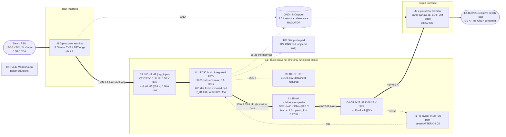

# blocks.md - bb-buck block architecture

P2 architect. Inputs: `requirements.md` (s1-s9, answers A1-A4 binding),
`research/power.{md,json}`, `research/buck-regulator.{md,json}`,
`reference/stackups.yaml`, `reference/constraints_schema.md`,
`reference/build-modes.md`.

**BUILD MODE: ultra-bare-bones.** Scope is ONE block (the buck), ONE input
interface, ONE output interface, one switch-node probe pad plus its ground
pad (A4), mounting holes, and nothing else. Every part below is either the
block's active part, a support component its datasheet requires at the stated
operating point, an interface, or something the fab/bench needs. There is no
protection, no filter, no indicator, no second rail, no spare footprint.
The mode binds SCOPE only - it does not thin `constraints.json`.

---

## 1. Block diagram - power flow (solid) and sense/measure flow (dashed)

---

## 2. Blocks

### B1 - synchronous buck converter (the block under study)

**Lead candidate part class: 36 V-class SYNCHRONOUS integrated-FET buck,
3 A-class current rating, exposed-pad SOIC-8-EP / HSOIC-8 (PowerPAD),
fixed 400 kHz, INTERNALLY compensated, peak-current-mode control.**
Lead MPN: **LMR33630ADDAR** (TI SIMPLE SWITCHER family), the component
scout's rank 1. No LCSC code appears anywhere in this package - part codes
are P3's job (S14).

Why this part class wins on the numbers already in the research:
- **Synchronous is a P1 conclusion with arithmetic behind it** (power.md s2):
  async costs +0.42 W (+33 %) of board heat at 30 V / 2 A and adds a second
  0.66-0.77 W hot spot whose junction lands ~126 C against a 125 C diode
  rating. At D = 0.167 the free-wheel element conducts 83 % of every cycle,
  which is the diode's worst case and the sync FET's mild one.
- **3 A-class, not a marginal 2 A part.** The board's whole thermal case
  rests on `P_U1 <= 0.95 W` at 30 V / 2 A. A typical 2 A-class 36 V part sits
  near `Rds_LS 130 mOhm` -> 1.19 W -> `check_thermal` errors on 2 layers. A
  3 A-class part sits at 42-80 mOhm. Rank on `Rds_LS`, NOT on
  `Rds_HS + Rds_LS`: at D = 0.167 the LS FET conducts 5x longer, so LS
  conduction (426 mW) is 3x the HS term (142 mW).
- **A1 headroom lives in the part**: abs-max Vin >= 36 V class against the
  30 V hard operating maximum. No TVS, no clamp - the mode excludes them and
  A2 (no live hot-plug) removes the lead-inductance ring that would demand
  one.
- **400 kHz clears the min-on-time corner.** `t_on(30 V) = 417 ns` at
  400 kHz against a 75/108 ns nominal/max spec on the lead part - roughly 4x
  margin. This is a FULL-LOAD constraint, not a light-load curiosity: in CCM
  `t_on = D/fsw` depends on line only, so a violation at 30 V pulse-skips at
  every load and blows A3's 50 mV ripple across the board.
- **Internally compensated** = no COMP pin, no RC network, no loop math to
  carry into P3/P4. That is 2-3 fewer parts than every asynchronous candidate
  in the scout's list and it suits the mode.
- **0 A load is inside the datasheet's own recommended operating range**
  (0-3 A), which is what A3 needs: the +/-3 % / 50 mV window is binding at NO
  load, and a burst/PFM part typically shows 50-100 mVpp there and fails.

Open on the part, for P3: confirm off the datasheet (a) `Rds_LS` and the real
`P_U1` at 30 V / 2 A - **this is what fixes the layer count, see
`stackup.md`**; (b) that 15 uH and the 26-30 uF effective Cout sit inside the
part's internal-compensation L/C window (an internally compensated part
assumes a range; that table is a hard input, not a suggestion); (c) the FB
reference tolerance over temperature; (d) the BST cap value/rating; (e) the
exposed-pad dimensions, which set how many 0.3 mm thermal vias physically fit.

### Input interface - J1 + input capacitor bank

J1 is a **2-pole 5.08 mm through-hole screw terminal**, >= 300 V / >= 10 A
class, on the LEFT board edge with the wire opening facing off-board and
`+` / `-` on silk. The terminal is never the limiting element: worst-case
continuous input current is 0.62 A at the 18 V low-line corner.

The input bank is part of the block, not a filter: **C2, C3 = 2 x 10 uF 1210
50 V X7R** (>= 9 uF effective at 24 V bias, >= 1.0 A rms at 400 kHz -
the bank carries 0.90 A rms) plus **C1 = 100 nF at the VIN pin**, which must
be tagged `role: reg_input` in `decoupling.json` or `check_decoupling` errors
`reg_input_no_hf`. 50 V rating and X7R are both hard: the board surface
reaches 85-90 C and X5R's 85 C limit is exceeded. Ceramic-only Cin is safe
**because of A2** (supply ramps from zero), not in general - no aluminium
bulk, no damping element.

### Power inductor - L1

**15 uH, shielded or composite, 10 x 10 to 12.5 x 12.5 mm class.** L is
frequency-COUPLED: at the chosen 400 kHz, 15 uH gives `dI = 0.694 A` (35 %
of 2 A), `I_L,pk 2.35 A`, `I_L,rms 2.01 A`. Requirements: `DCR <= 40 mOhm at
20 C` (~52 mOhm hot, 0.211 W; <= 30 mOhm preferred and worth ~2 C of board),
`Irms(40 C rise) >= 2.5 A`, rated `>= 125 C`, and **`Isat >= 1.3 x the
part's MAXIMUM HS current limit at 100 C`** - for a 3 A-class part whose
limit is specified 3.85-5.05 A that is **~6.6 A**, not 1.3 x the 2.35 A peak.
That rule (`buck-inductor-selection`: Isat beats the CURRENT LIMIT, not the
load) is what makes this a 10-12.5 mm part and therefore a driver of the
outline. It also needs >= 40 mm^2 of pad copper per terminal and a GND void
under the body.

### Output capacitor bank + output interface - J2

**C4, C5 = 2 x 22 uF 1206 25 V X7R** (>= 20 uF effective at 5 V bias after
DC-bias derating; 26-30 uF actual). Steady-state ripple at the 30 V corner is
**10.4 mV** of the 50 mV budget - the other ~37 mV is switch-node ringing and
ESL, which is spent by LAYOUT, not by capacitance. J2 is the SAME terminal
part as J1 for BOM consolidation, on the BOTTOM edge (a different edge from
J1, per requirements s5), silk-labelled `5V OUT` so the two cannot be
confused - the board has no reverse-polarity protection by mode, so silk is
the only defence.

### Feedback divider - R1, R2

The lead part is an ADJUSTABLE-output device (1.00 V FB reference), so a
two-resistor divider from +5V to GND exists and its tolerance is inside A3's
budget. Requirement: **0.1 % / 25 ppm-per-C, same family**, sense point AFTER
the output caps, divider at the FB pin, FB route short and away from /SW and
L1. See `power_tree.md` s5 for why 0.1 % rather than P1's 0.5 % floor. If P3
finds a stocked FIXED 5 V synchronous 36 V-class part, this sub-block and its
two parts disappear - that is strictly better and is allowed.

### Measurement - TP1, TP2 (A4, owner ruling)

Exactly one switch-node probe pad (TP1) plus one adjacent GND pad (TP2).
TP1 must live INSIDE the SW copper that already exists, not on a spur, so it
adds no area to the noisiest node; TP2 drops straight to the B.Cu GND pour
beneath. Nothing else: VIN, +5V and GND are reachable at the terminals.

### Mechanical - H1..H4

4 x M3 clearance holes (3.2 mm) inset 3.5 mm from the corners with 6.5 mm
washer keepouts, so the bare board sits on bench standoffs. In mode scope
("what the bench needs to hold it"); nothing else mechanical exists.

---

## 3. Explicitly NOT on this board

Excluded **by mode**, i.e. a SCOPE decision and never a finding for a
reviewer, and never a knowledge record saying these are unnecessary in
general: input TVS/clamp, reverse-polarity FET or diode, fuse, pi/EMI input
filter, UVLO divider, OVP/OCP beyond what lives inside the IC, output LC
filter beyond the datasheet's, LED or any indicator, EN/config strap, spare
or DNP footprints, snubber (footprint included), second rail, MCU, enclosure
features.

Excluded on **engineering** grounds, with the number that did it (these ARE
legitimate knowledge, unlike the list above): asynchronous rectification
(+0.42 W, second 0.77 W hot spot), LDO ((24-5) x 2 = 38 W), controller +
external FETs (1-2 points at 10 W for two FETs and a gate network),
fsw >= 1 MHz (1.58 W at 1 MHz vs 1.20 W at 400 kHz, and t_on collapses to
167 ns), a preload resistor for light-load ripple (mode-excluded; the fix has
to be part selection), aluminium bulk Cin (A2 removes the requirement).

---

## 4. What P4 must produce from this file

The canonical net names are fixed in `sheets.md` s2 and repeated in
`constraints.json`: **`+VIN`, `/SW`, `+5V`, `GND`, `/FB`, `/BST`**. Power
symbols export BARE names; a root-sheet local label exports with ONE leading
slash. A net spelled differently in the schematic silently unhooks its
`constraints.json` entry - `netlist_audit.py` catches it as `missing_net`
(error) at P4, and that is the intended safety net, not review.
