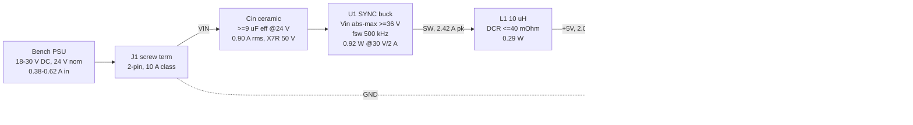

# power.md - bb-buck rail tree, topology call, budgets, thermal

P1 research-power-architect. Inputs: `requirements.md` (s3/s4/s5 + answers A1-A4,
binding), `reference/build-modes.md`, `constraints_schema.md`, the buck knowledge records.
Component-scout ran in parallel, so every number is a **requirement on a part parameter**,
never a part choice. Enumerated requirements, layout notes and rejections are
machine-readable in `power.json`; this file is the reasoning. Scope held: ONE rail
(`+5V`) from ONE input (`VIN`) - no second rail, no input filter, no protection. s1 is
degenerate by design; the value is s2-s7.

---

## 1. Rail tree - and the honest statement that there is nothing to itemise

| Rail | Vin | Topology | Current | Consumers | Diss (worst, 30 V) |
|---|---|---|---|---|---|
| `VIN` | 18-30 V bench PSU | direct (terminal + Cin) | 0.62 A DC avg @18 V; **1.06 A rms** in the Cin->U1 hot loop | U1 only; Cin carries 0.90 A rms | 0.03 W (terminal + copper) |
| `+5V` | `VIN` | **synchronous buck** | 2.0 A max cont. (2.6 A design ceiling) | external resistive load 2.0 A; Cout 0.24 A rms | **1.29 W** (U1 0.92 + L1 0.29 + rest 0.08) |
| `GND` | - | B.Cu pour | 2.0 A return | all | in the above |

**There is no on-board consumer to itemise, and inventing one would be dishonest.**
requirements.md s3 STATES a resistive bench load of up to 2 A at 5 V behind J2 and records
the 0 A floor as the conservative reading of "up to 2 A". No MCU, no LED, no second rail -
excluded by mode. The rail budget IS the stated 2 A, plus the two currents the converter's
own passives carry (Cin 0.90 A rms, Cout 0.24 A rms), derived below. Design ceiling
`2.0 x 1.3 = 2.6 A` per the +30% rule. Input current is a RESULT, not an input:
`I_in = (10 W + P_loss)/Vin` = **0.62 A @18 V, 0.47 A @24 V, 0.38 A @30 V**, confirming
requirements.md's 0.36-0.63 A sizing guess.

---

## 2. Synchronous vs asynchronous - the call, with both sets of numbers

Design point for both: `fsw 500 kHz`, `L 10 uH`, `Iout 2 A`, Rds x1.4 to Tj ~110 C, DCR
x1.30 to ~100 C. Sync model: `Rds_HS 150 / Rds_LS 90 mOhm @25 C`, `tr+tf 15 ns`,
`Qg 5 nC`, `Coss 60 pF`, `t_dead 15 ns`, `Iq 0.6 mA`. Async model: `Rds_HS 200 mOhm`,
same edges, plus a 40-60 V / 3 A Schottky (`Vf 0.47 V @2 A hot`, `Cj 150 pF`).

| Vin | SYNC loss | eff | **P_U1** | ASYNC loss | eff | **P_U1 / P_D1** |
|---|---|---|---|---|---|---|
| 18 V | 1.174 W | 89.5 % | 0.823 W | 1.550 W | 86.6 % | 0.537 / **0.662 W** |
| 24 V | 1.227 W | 89.1 % | 0.869 W | 1.625 W | 86.0 % | 0.536 / **0.730 W** |
| **30 V** | **1.289 W** | **88.6 %** | **0.924 W** | **1.710 W** | **85.4 %** | 0.573 / **0.771 W** |

Dominant lines at 30 V / 2 A (mW): sync - LS conduction 426, switching 225, L DCR 211,
HS conduction 142, core 80, gate 75, copper+terminals 71. Async - **diode conduction
771**, switching 225, L DCR 211, HS conduction 204, core 80, diode Cj 68, copper 71.

**Worst corner is HIGH line (30 V) for both** - the opposite of the usual low-line case,
and easy to get backwards. Input current is only 0.38-0.62 A so input-side `I^2R` is
negligible; what grows with Vin is switching loss (`~Vin`) and the LS/diode conduction
time (`1-D` rises 0.72 -> 0.83).

**RECOMMENDATION: SYNCHRONOUS.** Three reasons, in order of weight:

1. **Total heat, not efficiency points.** Async adds **+0.42 W (+33 %)** at the worst
   corner. The whole outline is the heatsink here (s7), so that lands on every part:
   +13 C of board surface on a 1064 mm^2 outline.
2. **Async creates a SECOND hot spot with nowhere to go.** The diode burns 0.66-0.77 W.
   Ladder for an SMB Schottky: board surface 104 C + ~8 C local non-uniformity +
   `0.77 W x ~18 C/W` junction-to-pad = **Tj ~126 C**, at or past the 125 C rating of most
   SMA/SMB parts, with reverse leakage (1-3 mA at 30 V, 126 C) adding positive feedback.
   `check_thermal` would NOT catch this - it gives each part its own 14.3 mm reach circle
   and models no interaction between two hot spots sharing one pour. Review-enforced.
3. **The low duty cycle is the diode's worst case**: it conducts `1-D = 0.83` of every
   cycle at 30 V. A sync LS FET at 126 mOhm hot drops 0.25 V at 2 A against 0.47 V - not
   marginally better, half the loss.

Async's only win - a cooler IC (0.57 vs 0.92 W) - is not worth 0.42 W more board heat
plus a 0.77 W diode. It would be right if no stocked part existed at this corner
(`buck-selection-ladder` rung 2); at 30 V / 2 A that is not the case. LDO is arithmetic,
not a choice: `(24-5) x 2 = 38 W`. Controller + external FETs (rung 3) buys ~1-2 points
for two FETs, a gate/sense network and area - not at 10 W, and contrary to the mode.

**Selection rule for component-scout: rank on `Rds_LS`, NOT on `Rds_HS + Rds_LS`.** At
`D = 0.167` the LS FET conducts 5x longer, so LS conduction is 3x the HS term.

**Part limits to hold `P_U1 <= 0.95 W` at 30 V / 2 A.** The ceiling is the P8 screen, not
my ladder: `check_thermal` gives 73.8 C/W on 2 layers at a saturated pour, so `dt_c = 70`
errors above `70/73.8 = 0.948 W`. The physical ladder (s7) would allow ~1.1 W; the gate
is the gate. Limits: **`Rds_LS <= 85 mOhm @25 C`**, `Rds_HS <= 200 mOhm`,
**`(tr+tf) x fsw <= 0.0075`** (15 ns at 500 kHz), `Qg <= 5 nC`, `Iq <= 1 mA`,
`t_on,min <= 130 ns`, `Tj_max = 150 C`. Those give 0.947 W.

**Consequence, the sharpest thing in this fragment: this needs a 3 A-class part, not a
marginal 2 A part.** Typical 2 A-class parts at this voltage sit near `Rds_LS 130 mOhm`
-> `P_U1 = 1.19 W` -> 88 C rise on 2 layers -> `check_thermal` errors, `Tj ~138 C`.
Typical 3 A-class parts sit at `Rds_LS 42-80 mOhm`. **A 2 A-class part is not
disqualified - it FORCES 4 layers** (1.19 W x 51.1 C/W = 61 C rise, `Tj ~111 C`). That is
the layer decision in one line, and it is a PART consequence, not a layout one.

---

## 3. Switching frequency band - set by min on-time at 30 V, capped by heat

In CCM `t_on = D/fsw` depends on the LINE only, **not on the load**. A min-on-time
violation at 30 V is therefore a FULL-LOAD failure, not a light-load curiosity: the part
pulse-skips at every load and the 50 mV ripple spec (A3) fails across the board.

`D(30 V) = 0.167` ideal (~0.18 with drops). `t_on(30 V)` = 476 ns @350 k, **333 ns
@500 k**, 278 ns @600 k, 167 ns @1.0 M, 119 ns @1.4 M. Requiring
`t_on(30 V) >= 2.5 x t_on,min` caps fsw at 1.03 MHz for a 70 ns part, 720 kHz at 100 ns,
**550 kHz at 130 ns**, 480 kHz at 150 ns.

Heat caps the top independently - board loss at 30 V / 2 A: **1.29 W @500 k/10 uH**,
1.40 W @700 k/10 uH, 1.58 W @1.0 M/6.8 uH, 1.93 W @1.4 M/4.7 uH. Past ~600 kHz the
switching+gate terms eat the whole s7 thermal margin. Below ~350 kHz, sane ripple needs
`L >= 17 uH`, whose DCR in a 7x7 package (~4 mOhm/uH) costs more than the switching loss
it saves.

**RECOMMEND `fsw = 500 kHz` (band 350-600 kHz); part requirement `t_on,min <= 130 ns`.**
Fallback 400 kHz / 15 uH is within 3 % on loss if a candidate's min on-time forces it.
Do NOT take a 1-2 MHz part here because its passives are smaller.

---

## 4. Inductor, ripple, and the currents everything else is sized from

`dI = Vout(Vin-Vout)/(Vin x L x fsw)`, largest at high line.

| Vin | D | dI pk-pk @10 uH | r = dI/Iout | `I_L,pk` @2 A | `I_L,rms` @2 A | `I_Cin,rms` @2 A |
|---|---|---|---|---|---|---|
| 18 V | 0.278 | 0.722 A | 36 % | 2.36 A | 2.011 A | **0.903 A** |
| 24 V | 0.208 | 0.792 A | 40 % | 2.40 A | 2.013 A | 0.819 A |
| 30 V | 0.167 | **0.833 A** | **42 %** | **2.42 A** | 2.014 A | 0.752 A |

**L = 10 uH, standard, 7x7 mm class.** `r = 42 %` at high line is inside the normal
30-50 % window. Bigger L does not pay in this package: DCR scales ~4 mOhm/uH at constant
size, so 15 uH adds ~93 mW of `I^2R` and removes only ~25 mW of core loss.

From `buck-inductor-selection`: **`Isat >= 1.3 x the part's MAX HS current limit at
100 C`** (typically `>= 4.5 A` for a 2-3 A-class part) - not `1.3 x` the 2.42 A peak; the
current limit is the sizing number. **`DCR <= 40 mOhm @20 C`** (~52 mOhm hot, 0.211 W);
the record's `< 30 mOhm` A-class target is preferred and worth ~53 mW (~2 C of board) if
a 10x10 part fits the honest outline - 40 mOhm is the waiver, with the math here.
`Irms(40 C rise) >= 2.5 A`, rated `>= 125 C` (board is 85-95 C), shielded/composite.

**`I_Cin,rms` peaks at 0.903 A at LOW line** (`sqrt(D(1-D))` grows toward D = 0.5, never
reached here). Requirement: ceramic bank **>= 1.0 A rms at 500 kHz, >= 50 V, X7R** -
e.g. 2 x 10 uF 1210 50 V, derating to ~9-10 uF at 24 V bias for 59-85 mVpp of input
ripple. Plus a **100 nF HF ceramic at the VIN pin** tagged `role: reg_input` in
`decoupling.json` - `check_decoupling` errors (`reg_input_no_hf`) without an HF ceramic
<= 1 uF within 7.5 mm of the pin.

**No upstream inrush rule applies.** `buck-upstream-inrush-limit` is bounded to
`source_kind in [usb, usb-pd, poe]`; this is `dc-input`, and A2 (no live hot-plug)
removes the lead-inductance ring. Nothing caps Cin from upstream and no damping bulk is
fitted. Ceramic-only Cin is safe here *because of A2*, not in general.

---

## 5. Output capacitance, ripple and the +/-3 % budget

Steady-state ripple `= dI/(8 fsw C) + dI x ESR`, worst at 30 V (`dI = 0.833 A`):
10 uF eff -> 20.8 + 2.5 = 23.3 mVpp; **20 uF eff -> 10.4 + 2.5 = 12.9 mVpp**;
26 uF eff -> 8.0 + 2.5 = 10.5 mVpp.

**Requirement: `C_out >= 20 uF EFFECTIVE at 5 V DC bias`** - implement as **2 x 22 uF
X7R 1206 25 V** (~13-15 uF each after DC-bias derating -> 26-30 uF), and confirm the
total sits inside the chosen part's datasheet C/ESR window: internal compensation assumes
it, and an external-compensation part means re-deriving the network, not copying the
table row (`buck-bst-fb-output-caps`).

**The 50 mV target is a LAYOUT requirement more than a capacitance requirement.** The
fundamental is ~13 mV; the other ~37 mV of budget is switch-node ringing coupled into the
output and ESL spikes. Hot-loop area, the Cout ground return and the A4 probe pad's extra
SW copper are what spend it.

**`+/-3 % DC` budget.** Contributors: FB reference over temp (+/-1.0-1.5 %), divider
tolerance, load reg (~0.5 %), line reg (~0.2 %), ripple half-amplitude (~0.5 %). The
worst-case SUM with 1 % divider resistors is ~3.7 % and does **not** close; RSS gives
1.95 % and does. Therefore: **prefer a FIXED 5 V part** - it removes the divider term and
two parts, which the mode likes - and watch the FB trap (`buck-bst-fb-output-caps`): fixed
family members tie FB straight to the output sense point, so do not copy the adjustable
variant's divider out of the shared datasheet figure. If adjustable: **0.5 % resistors,
same family, TCR <= 100 ppm/C** (the divider sits on an 85-95 C board), FB reference
**<= +/-1.5 % over temperature**, sense point AFTER the output caps, FB routed away from
SW and L. If the candidate is a **COT part with Type-3 ripple injection**, add the
`+Vramp_pkpk/2` term (`cot-ripple-injection-raises-vout`): the loop regulates the FB
VALLEY, so `Vout = (1+Rt/Rb)(VREF + Vramp/2)` - **+3 % on an LM5017, enough to blow 5.15 V
on its own.** Solve the divider against the union of both corners.

Transient note, not a spec: disconnecting a 2 A resistive load overshoots
`sqrt(Vout^2 + L I^2/C) - Vout = 151 mV` for a few tens of microseconds (less with the
loop responding). A3 is a DC window; this is normal, and is called out so a bring-up
scope shot is not mistaken for a regulation failure.

---

## 6. Light load and no load - the requirement most likely to be missed

The board must be safe and stable with nothing on J2 (requirements s3). Forced-CCM sweep
at 30 V (500 kHz, 10 uH): **0 A -> 0.245 W, 8.2 mA in**; 0.1 A -> 0.248 W, 66.8 %;
0.5 A -> 0.313 W, 88.9 %; 1 A -> 0.533 W, 90.4 %; 2 A -> 1.289 W, 88.6 %.

- **Forced CCM at 0 A is safe and boring**: 0.15-0.25 W continuous, ~8 C of board rise,
  fixed frequency, ripple still ~13 mV -> A3 holds at every load. No VIN pump-up: net
  power flow stays positive (losses) and the intra-cycle reverse current is absorbed by
  Cin. A load-release dump back to the source is ~20 uJ = 0.09 V on Cin - nothing for a
  bench supply that cannot sink.
- **PFM / burst / skip mode is the risk.** Light-load ripple in burst is set by the
  hysteretic window, typically 1-2 % of Vout = **50-100 mVpp at 5 V**, which **violates
  A3's <= 50 mV across the full 0-2 A range**. Burst repetition also lands in the audible
  band at very light load and makes the ceramics sing on a bench.
- The usual fix is blocked: a preload resistor is "conditioning the datasheet does not
  require" and is OUT by mode. **The fix has to be selection.**

**REQUIREMENT (P1 -> P3): a forced-CCM part, or a MODE/FCCM pin strappable to CCM, or a
PFM part whose datasheet shows `<= 50 mVpp` light-load ripple at 5 V with a comparable
Cout.** If no JLC-stocked 36 V-class candidate satisfies any of the three, that becomes an
owner question - see OPEN.

Sequencing/EN/soft-start: single rail, **no sequencing requirement**. Read the EN pin's
own behaviour before adding parts (`buck-en-softstart-sequencing`) - most parts in this
class auto-start off an internal pull-up, so EN ties to VIN or floats and **no UVLO
divider is fitted** (mode-excluded, and a bench supply has no cable-droop motorboating
case: 0.62 A over 2 m of lead is ~0.1 V). Internal soft-start makes Cout inrush
`C Vout/tss` = 65 mA at 26 uF / 2 ms - invisible to the source, and A2 means the supply
ramps from zero so there is no inrush event at all.

---

## 7. Thermal - and the honest answer on 2 vs 4 layers

Worst case **1.29 W board / 0.92 W in U1 at 30 V, 2 A, 50 C ambient**, natural
convection, no enclosure, single-sided assembly (B.Cu clear of SMT = free radiator).

**The board IS the heatsink, and it is near-isothermal even on 2 layers.** Spreading
length `lambda = sqrt(k t / 2h)` = **26 mm on 2 x 1 oz** (32 mm on 4 layers) against a
board half-dimension of 12-19 mm, so the whole outline participates and the correct model
is whole-board, not a local patch. Flat-plate convection + radiation (`h_conv ~7.4`,
`h_rad ~7.9 W/m^2K`, eps 0.9, both faces, 0.85 shadowing):

| outline | area | `R_ba` | rise @1.29 W | surface | rise @1.71 W (async) |
|---|---|---|---|---|---|
| 35 x 25 | 875 mm^2 | 39 C/W | 50 C | 100 C | 63 C -> 113 C |
| **38 x 28** | **1064 mm^2** | **34 C/W** | **43 C** | **93 C** | 54 C -> 104 C |
| 40 x 30 | 1200 mm^2 | 31 C/W | 40 C | 90 C | 49 C -> 99 C |

Junction ladder `Tj = 50 + board rise + ~5 C local + P_IC (theta_JC,bot + R_via)`. Via
path (0.3 mm drill, 25 um plating, `buck-thermal-via-and-via-current`): one via
F.Cu->B.Cu through 1.6 mm = **192 K/W**, so 16 vias = 14.1 and 25 vias = 9.1 K/W; through
0.30 mm prepreg to In1 on 4 layers, 36 K/W each -> 16 vias = **2.7 K/W**. Result:
**2L/38x28/16 vias -> Tj 115 C**; 2L/38x28/25 vias -> 111 C; 2L/40x30/25 vias -> 107 C;
4L/38x28/16 vias -> ~104 C. The repo `check_thermal` screen agrees within ~10 %: a
saturated 645 mm^2 pour gives **73.8 C/W on 2L** (0.92 W -> 68 C rise) and **51.1 C/W on
4L** (-> 47 C rise).

**VERDICT: 2 layers is honestly enough, conditionally.** All five must hold:
1. **Synchronous** (async's 1.71 W / 0.77 W diode does not fit on 2 layers at any size).
2. **`P_U1 <= 0.95 W` at 30 V / 2 A** - i.e. `Rds_LS <= 85 mOhm`, i.e. **a 3 A-class
   part**. The condition most likely to fail.
3. **Outline >= ~1000 mm^2** (e.g. 38 x 28 mm) with an **unbroken B.Cu GND pour, no split
   within 14.3 mm of U1**. Single-sided assembly already reserves the bottom.
4. **>= 16 thermal vias** (target 20-25 counting a ring in the surrounding F.Cu GND
   island), 0.3 mm drill, 1.0-1.2 mm pitch, under the exposed pad. On 2 layers the array
   IS the heat path - 8 vias instead of 16 costs ~10 C of junction.
5. **`Tj_max = 150 C` part** (the class norm). A 125 C part fails: `dt_c` drops to 55 and
   neither the screen nor the ladder passes.

**Escalate to 4 layers** if any of: the part is 125 C rated; **`P_U1 > 0.95 W`** (a 2
A-class part at `Rds_LS 130 mOhm` gives 1.19 W and lands here); the honest outline falls
below ~900 mm^2; or P8 `check_thermal` errors. The screen passes 0.92 W by only 2 C, so
this is a live trigger, not a formality: **the layer count follows the part, and P3 must
re-run this arithmetic with the chosen part's real Rds before P5 fixes the stackup.**

**What 4 layers actually buys, so P2 does not over-buy it:** it does NOT meaningfully
lower `R_ba` - board-to-ambient is set by AREA and h, and the board is already isothermal
at 2 layers. It lowers the LOCAL junction-to-board path by ~11 K/W (0.30 mm prepreg to
In1 vs 1.6 mm to B.Cu), worth **~11 C of Tj**. **Board AREA buys more than layers here:**
875 -> 1200 mm^2 is worth ~10 C at the same power, for free. The mode's "smallest HONEST
outline" therefore has a numeric floor on this board - honest means **>= ~1000 mm^2**,
because the outline is the radiator.

Consequences of an 85-95 C board surface: **all MLCCs X7R (125 C) minimum - X5R (85 C) is
not acceptable anywhere**; L1 rated `>= 125 C`; no aluminium electrolytic fitted or
needed. `L1` at 0.29 W is below the 0.5 W threshold in `buck-constraints-emission`, so it
gets **no** `thermal` entry - recorded here with the number so the omission is visible,
not silent. It still wants `>= 40 mm^2` of pad copper each.

---

## 8. Emitted constraints (see `power.json`)

`power` entries use **`dt_c = 10`, not 20**: IPC-2152's rise is above the LOCAL board
temperature, which s7 puts at 85-95 C; a 20 C rise would run copper at 105-115 C. The
10 C widths route fine on a `>= 1000 mm^2` outline.

| net | `current_a` | why that number | 1 oz outer @ dT=10 |
|---|---|---|---|
| `VIN` | **1.1 A** | hot-loop **rms** at low line (`sqrt(D) x I_L,rms` = 1.06 A), NOT the 0.62 A DC average - sizing on the average under-sizes the Cin->U1 segment by 1.7x | 0.56 mm |
| `SW` | 2.6 A | `I_L,pk` 2.42 A / rms 2.01 A; `pdn:false` (nothing decouples it - width-only entry) | 1.52 mm |
| `+5V` | 2.6 A | 2.0 A stated load x 1.3; also covers the 2.01 A rms L->Cout segment | 1.52 mm |
| `GND` | 2.6 A | return; `plane_fed:true` (B.Cu pour) so via/track findings downgrade to advisory but **pour necks stay ERROR at 2.6 A** | 1.52 mm neck |

`via_amps: 0.4` on `VIN`/`SW`/`+5V` rather than the 0.5 default, matching the ROHM
measured table (0.3 mm via = 0.4 A). It costs nothing: single-sided assembly keeps all
three on F.Cu with **zero layer transitions by design**, and GND is plane-fed.

`thermal`: one entry, `U1 @ 0.92 W, dt_c 70, min_vias 16`. **`dt_c = 70` encodes
`Tj_max 150 - 50 C ambient - 30 C margin` and is therefore a REQUIREMENT ON THE PART, not
a knob.** Note the via warning will not fire (`dt_c/power_w = 76 > 73.8`), so the array is
review-enforced - a clean `check_thermal` is not proof it exists.

`blocks` carries the eight `operating_point` dims a buck block needs to reach `covered`
(U14): `vin_v 30, vout_v 5, iout_a 2, fsw_khz 500, pdiss_w 1.3, board_layers 2,
switching_kind hard, rectifier_kind sync, integration_kind integrated-fet, source_kind
dc-input`. `control_kind` is deliberately absent - unknown until the part is chosen, so
`cot-ripple-injection-raises-vout` correctly stays provisional. `blocks`, `layout_notes`,
`part_requirements`, `layer_decision` and `rejected` go beyond the literal fragment
contract because `buck-constraints-emission` requires the block to emit them and this is
where the operating point is known. P2 lifts `blocks` verbatim.

---

## 8b. Cross-check against component-scout's candidates (arrived after s2-s7)

`research/buck-regulator.json` landed while this was being written. It does not change any
conclusion, and two couplings are worth stating before P2 acts:

- **Rank 1 (LMR33630ADDAR) is the shape s2 demands**: synchronous, **3 A-class**,
  exposed-pad SOIC-8-EP, 38 V abs-max, internally compensated, **400 kHz** - inside the
  350-600 kHz band. P3 must confirm `Rds_LS <= 85 mOhm` and `t_on,min <= 130 ns` off the
  datasheet; the scout's "~3.9x min-on-time margin at 400 kHz" implies ~107 ns, which
  clears.
- **If a 400 kHz part is chosen, `L = 15 uH`, not 10 uH.** My L is fsw-coupled: 10 uH at
  400 kHz gives `dI = 1.042 A (52 %)`; 15 uH gives 0.694 A (35 %), `I_L,pk 2.35 A`,
  `I_Cin,rms` unchanged at 0.90 A, output ripple ~10 mV at 26 uF. 400 kHz also **helps**
  thermally - `P_U1` drops 0.924 -> 0.854 W, widening the 0.95 W screen margin.
- **Ranks 2, 3 and 4 are all ASYNCHRONOUS** (AOZ1284PI, TPS54560B, TPS54360B). s2 rejects
  that topology here with numbers. If rank 1 falls through, async is not a drop-in: re-run
  the loss budget (+0.42 W board), add a `thermal` entry for D1 (~0.77 W), and expect the
  layer decision to flip to 4. Do not treat ranks 2-4 as equivalent fallbacks.
- Rank 5 (XL1509) is independently excluded by s5's budget: `+/-4 %` guaranteed accuracy
  alone exceeds A3's `+/-3 %`. The scout reached the same conclusion separately.

---

## 9. Assumptions and limits

- s2's part parameters model a **typical 36 V-class integrated sync buck**, not a part;
  every conclusion is a limit P3 must meet. `+/-30 %` on the switching-loss line, `+/-40 %`
  on core loss (anchored, not a vendor curve).
- `R_ba` is textbook flat-plate convection + radiation: `+/-30 %`. The repo `check_thermal`
  model independently gives 73.8 C/W on 2L against the ladder's ~70 C/W effective - the two
  agree, which is why the whole-board number is trusted.
- `D = Vout/Vin` ideal is used for ripple; real D is 5-8 % higher with drops, which
  *relaxes* the s3 min-on-time margin (conservative as written).
- Net names are this fragment's proposal; **P2 must reconcile `power.json` to the final
  netlist names before P5.**
- Not decided here (component-scout / part-sourcer / P3): the actual IC, inductor and
  capacitor part numbers; exact Cin/Cout counts; FB divider values; the BST cap value
  (100 nF is the family default - required, not optional, on integrated-FET parts).
- No safety flag is raised. requirements.md s8 closes mains / battery / motor / RF /
  >3 A / >30 V on STATED facts, and the 2.42 A worst-case instantaneous current leaves the
  >3 A threshold untouched.

Sources: `requirements.md` s3-s5/s8/s9(A1-A4); `reference/build-modes.md`;
`reference/constraints_schema.md`; knowledge records buck-{selection-ladder,
inductor-selection, thermal-via-and-via-current, freewheel-diode-snubber-placement,
bst-fb-output-caps, en-softstart-sequencing, upstream-inrush-limit, constraints-emission}
+ cot-ripple-injection-raises-vout; `scripts/check_current.py` (IPC-2152 table + dT
scaling) and `scripts/check_thermal.py` (theta_JA-vs-area, 645 mm^2 / 14.3 mm reach);
`boards/sbuck-5v3a/research/power.md` (method precedent, different V/I corner).
