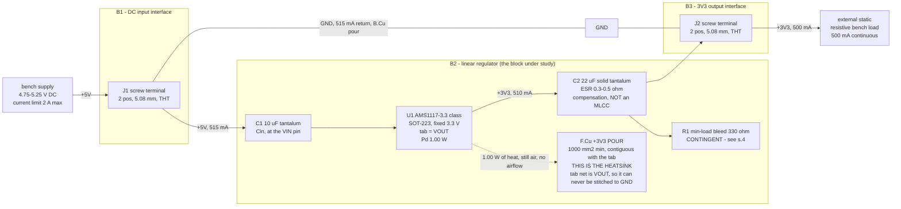

# bb-ldo - block architecture (P2)

Mode: `learning block-basics:` -> target **block-basics**, scope **block-only**,
binding **canonical** (geometry is an OUTPUT). Inputs: `requirements.md` (owner
answers 1-9 + the frozen design point), `research/linear-regulator.*`,
`research/refdesign-linear-regulator.*`, `research/power.*`.

Three blocks, six parts (one contingent), one rail. Every engineering decision
on this board is the same decision: **how much copper the tab of a 1 W linear
regulator gets, on a 2-layer board where that copper is the OUTPUT net.**

## 1. Block diagram - signal and power flow

No signal nets exist. There is no enable strap, no feedback divider (fixed
part), no status output, no test point: the two screw terminals ARE the
measurement interface (requirements s.2).

## 2. B1 - DC input interface

**Lead part class:** 2-position 5.08 mm pitch through-hole screw terminal
block, 0.2-2.5 mm2 wire, JLC catalog (owner answer 8). An SMT-mount equivalent
at the same pitch and wire range is preferred if one exists at P3, because
this board's only other assembly step is SMT; a THT part is hand soldered
after PCBA and that is a packaging detail the mode relaxes.

Carries `+5V` and `GND` at 515 mA - a non-event electrically (0.26 mm of
1 oz copper covers it at dT 10 C). Its real constraints are mechanical: it
owns a board edge, its wire entry faces outboard, and a screwdriver needs
vertical access, so nothing tall stands beside it. **No protection sits behind
it** (no reverse-polarity device, no fuse, no TVS) - a `block-only` scope
exclusion the owner accepted explicitly (answer 3), with the source bounded at
2 A (answer 2). Reviewers must not report its absence.

## 3. B2 - the linear regulator (all of the engineering)

**Lead part: AMS1117-3.3 in SOT-223** (JLC Basic; P3 owns the order code and
must pin the exact manufacturer - see the clone risk below). Fixed 3.3 V
output, bipolar-NPN pass device, standard dropout (1.3 V max at 0.8 A against
1.45 V of worst-case headroom), **tab = VOUT**, Tj(max) 125 C steady state.

Chosen for the one property that decides this board: its datasheet carries a
**copper-area -> theta_JA table measured on 1/16 inch FR-4 at 1 oz**, i.e. on
this board's own physical class, and TI's LM1117 sweep (same package, same
copper weight, top-side-only column) corroborates it within ~1 C/W. That table
is what sizes the outline.

**Rejected: MCP1825S-3302E/DB (SOT-223).** Better on paper in every electrical
dimension - 210 mV typ dropout measured at exactly 500 mA, +/-2.5% max
accuracy, explicitly ceramic-stable, 62 C/W. It loses on the only axis that
matters here: **that 62 C/W is measured on a JEDEC 4-layer test board with
internal planes, and this is a 2-layer board.** There is no applicable curve to
size copper against, so its headline number cannot be spent. (Also rejected:
AP7361C-33E-13, 110 C/W at minimum pad with no copper-scaling data -> Tj 157 C,
past its own 150 C max; MIC29300-3.3WU-TR, no theta_JA published for TO-263 at
all; HT7533-1, 100 mA rated against a 500 mA load.)

**Support parts, all datasheet-required (so all in scope at `block-only`):**

- **C2 = 22 uF solid tantalum on the output.** The datasheet's own words:
  "addition of 22uF solid TANTALUM on the output will ensure stability for all
  operating conditions". This part is compensated for an ESR WINDOW; a bare
  low-ESR MLCC (< 0.05 ohm) sits under the window and is the classic 1117-class
  oscillation trap. **Two constraints for P3 that are easy to get wrong:**
  (a) target ESR **0.3-0.5 ohm at 100 kHz** - see the conflict resolved in s.6;
  (b) **MnO2 solid tantalum, NOT a polymer tantalum** - a polymer part is a
  tantalum by name with ceramic-class ESR (tens of mohm), which walks straight
  back into the trap the tantalum was chosen to avoid. Voltage rating >= 10 V
  (3x derating on 3.3 V; tantalums want 2x minimum).
- **C1 = 10 uF tantalum at the VIN pin, short lead** (datasheet p.5; every
  source in the reference-design note agrees). Rating >= 10 V (2x on 5.25 V).
- **No 0.1 uF HF ceramic.** That recommendation belongs to MIC29302A's
  datasheet (high-AC-impedance source), not to this part's; `block-only` admits
  exactly the support the CHOSEN part's datasheet requires. Recorded so its
  absence is not read as an omission.
- `decoupling.json` must NOT tag C1/C2 `"role": "reg_input"`. That role is for
  a SWITCHING regulator's VIN and makes `check_decoupling` demand an HF ceramic
  within 7.5 mm. A linear regulator has no switch node.

**The pour is a component of this block.** The F.Cu `+3V3` pour contiguous with
the tab is not decoration and not a routing artifact: at 1.00 W and Ta 50 C the
part needs theta_JA <= 65 C/W to hold Tj at 115 C, and the only lever that buys
it is top-side copper AREA on the OUTPUT net. 1000 mm2 -> 65 C/W (vendor Table
1, the zero-backside-copper row); 645 mm2 -> 66 C/W (TI, top-only column);
490 mm2 -> 69; 342 mm2 -> 75; bare pad -> 136-150. Below ~650 mm2 the curve
climbs steeply, and at the datasheet's headline minimum-copper 90 C/W the part
reaches Tj ~140 C and **fails outright**. See `power_tree.md` s.3-4 for the
full chain.

**Accuracy, ruled at P1 and carried here unchanged:** the board's +/-3% spec
(3.20-3.40 V) is met as the part's guaranteed over-temperature output window
(3.201-3.399 V boldface). A strict worst-case ARITHMETIC stack of line and load
regulation on top of that reaches ~+/-4.1%; that is accepted for a bench block
driving a static resistive load with no accuracy-critical consumer, and the
+/-3% figure was itself a P0 offered default, not an owner-originated spec.

**Risk to carry forward: clone variance.** "AMS1117" is a part number used by
many fabs with non-identical dies (the retrieved datasheet is branded Slkor,
not Advanced Monolithic Systems). The thermal table above is that vendor's.
P3 pins the exact manufacturer in the BOM; the design keeps 10 C of margin
partly to absorb this.

## 4. R1 - minimum-load bleed (DELIBERATELY UNRESOLVED)

The datasheet specs a minimum load of 3 mA typ / **10 mA max** and applies it
to all variants; TI's LM1117 specs a minimum load only on the ADJ variant and
none on the fixed ones. Same class, different claim - and this board's bench
load can legitimately sit at zero. **P2 does not rule this.** The current
budget carries 10 mA (and the dissipation corner carries its 0.02 W) so that
fitting the part later cannot invalidate the thermal design; whether the
resistor is populated is a P3 call that needs the page citation for the FIXED
variant. If fitted: 330 ohm, 33 mW, 0603. If not: the `+3V3` budget drops to
500 mA and the copper floor relaxes toward 645 mm2.

## 5. B3 - 3V3 output interface

Same part class as B1 (2 pos, 5.08 mm, THT), opposite board edge. Carries
`+3V3` at 500 mA to the external load. **DFM consequence of the thermal
design:** its `+3V3` pin lands in a large solid-connected pour (see
`stackup.md` s.4), so hand soldering it needs a hot iron with real thermal
mass. That is the price of not thermal-relieving the tab, and it is the right
trade on this board - flagged for P9's assembly note, not a reason to change
the pour.

## 6. Conflicts between research fragments, resolved

1. **Output-cap ESR ceiling: 0.5 ohm (AMS1117's own text) vs 22 ohm (TI
   LM1117's window).** The chosen part's own datasheet WINS on the ceiling:
   target <= 0.5 ohm. LM1117 loses the ceiling but supplies what AMS omits -
   a LOWER bound (0.3 ohm), which is the physically load-bearing half (a
   ceramic at 0.05 ohm oscillates). Merged target: **0.3-0.5 ohm at 100 kHz.**
   If no orderable 22 uF part lands in that window, the honest fallback is a
   part slightly ABOVE 0.5 ohm (still inside the corroborated 0.3-22 ohm
   family window), never one below 0.3. P3 settles it with a real part's ESR
   spec - see OPEN.
2. **theta_JA source: vendor Table 1 (65 C/W at 1000 mm2, zero backside) vs
   the headline single number (90 C/W, unqualified) vs the clone datasheet's
   150 C/W abs-max row.** Table 1 wins for SIZING because it is a measured
   copper sweep on 1/16 inch FR-4 at 1 oz; the single numbers lose because
   neither states a copper area, and an unqualified theta_JA is a worst case,
   not a design target. Cross-checked against a second vendor's independent
   sweep of the same package (agrees within ~1 C/W).
3. **Which Table 1 row.** The `1000 mm2 top / 0 backside` row wins over the
   better-looking rows (60 C/W and 55 C/W) because those lean on 1000-2500 mm2
   of *backside* copper whose electrical connection the datasheet never states.
   With a VOUT tab a via connection to a backside GND plane is impossible, so
   those rows may be measuring something this board cannot reproduce. Rows
   1/4/5 stay unusable until someone reads the actual Table 1 note (research
   gap 2, carried).
4. **Bottom-side copper as a substitute for top-side area: rejected.** TI's
   sweep measures via-fed bottom-only copper ~20% WORSE per unit area than the
   same copper on top (79 vs 66 C/W at 645 mm2), and a 50/50 split (70 C/W) is
   worse than putting it all on top (66 C/W). B.Cu is a supplement (and the
   thing that carries `check_thermal`'s credited area to its cap), never a
   replacement for growing the top pour.
5. **2 oz copper: rejected, not deferred.** No source quantifies 2 oz for
   SOT-223 (TI's 2 oz sweep is TO-252, which confounds package with weight),
   and the repo's own gate model keys on layer count only. Area is the earned
   lever; weight is not. Kept as the cheapest fallback if P8's waiver evidence
   ever needs strengthening.
6. **Design point 0.975 W (P0/requirements) vs 1.00 W (P1 power).** 1.00 W
   wins: it is 0.975 W plus a quantified (if assumed) quiescent term, and it
   tightens the required theta_JA from 66 to 65 C/W. Designing to the looser
   number would spend margin that has not been earned.

## 7. Geometry the layout NEEDS (an OUTPUT - no dimension is chosen here)

The owner stated no dimension and the binding is `canonical`, so **nothing was
relaxed and nothing lost**: there is no stated size for the design to beat.
What the layout needs, and why:

- **>= 1000 mm2 of contiguous F.Cu `+3V3` copper touching the tab pad.** This
  is the radiator; it is the 65 C/W row. 645 mm2 is the absolute floor (66 C/W,
  and only reachable if the bleed is dropped and Iq confirms at 5 mA);
  1500-2500 mm2 is preferred and buys 5-10 C of free margin.
- **U1's centroid roughly centred, >= ~14 mm clear of every board edge.**
  `check_thermal` credits `+3V3` copper only within a 14.3 mm radius disc of
  the part - that radius is `sqrt(645 / pi)`, derived from its 645 mm2
  saturation cap (verified in the checker source). A part near an edge has a
  disc that is partly off-board and can never fill it.
- **Two screw terminals on OPPOSITE edges** (input left, output right), wire
  entry outboard, screwdriver access clear above. This is also what keeps U1
  in the middle.
- **C1 within a few mm of the VIN pin, C2 at VOUT**, both inside the pour.
- Consequence: the earned outline lands somewhere around **35-45 mm a side**
  (roughly 1400-2000 mm2 of board to carry 1000+ mm2 of pour after pads,
  the `+5V` trace and clearances eat into it). **That is an EXPECTATION for
  P5/P6, not a cap** - `board_edit --outline fit` decides.

**The one way this design fails silently, stated for P5/P6.** The pour is
created at P7 (`planes_gen`), AFTER `board_edit --outline fit` has already
sized the board. If P6 packs six parts tight and fit shrinks the outline to
the part bounding box plus a small margin, there is no room left for 1000 mm2
of copper and the thermal design evaporates without any gate saying so
(`check_thermal` will be red either way - see `power_tree.md` s.5). Verified in
`board_edit.py`: `fit` sizes to the bounding box of footprint courtyards,
copper items and **keepout rule areas** plus `--margin` - a zone is NOT
content, so the pour cannot argue for its own space. Two levers, in order of
preference: (1) place for the thermal spread and choose `--margin` so the
finished board carries the pour area above; (2) if that reads as arbitrary,
drop a rule area over the intended radiator before fitting, since a rule area
IS content. Either way the board is allowed to be mostly copper - that is what
it is FOR.

## 8. Excluded by scope tier (`block-only`) - absence is not a finding

Protection of every kind (reverse polarity, OVP, fusing, TVS), filtering
beyond the datasheet's own caps, indicators, test points, config/enable
straps, any second rail, mounting holes and every other mechanical or
enclosure feature. Thermal is excluded by no tier and is fully in scope.

## 9. Decisions for the orchestrator to log

1. **Stackup JLC2313_1.6, 2 layers, 1.6 mm, 1 oz, HASL.** Layer count driven
   by: three nets, no controlled impedance anywhere (JLC sells no
   impedance-controlled 2-layer product at all - the question does not arise),
   and exactly two pour surfaces needed (F.Cu `+3V3` heatsink, B.Cu GND
   return). 1.6 mm specifically because both thermal sweeps this design is
   sized against were measured on 1/16 inch (1.59 mm) FR-4.
2. **4 layers rejected:** on a tab-on-top package the extra copper is buried
   0.5 oz reachable only through vias - measurably worse per unit area than
   the same copper on F.Cu, with no convection surface of its own - at ~2.5x
   the bare-board price. More layers do not buy tab-area.
3. **2 oz copper (JLC2313_1.6_2oz) rejected:** no source quantifies 2 oz for
   this package; the gate model keys on layer count only. Held as a fallback.
4. **Lead part AMS1117-3.3 SOT-223** for board-class-applicable thermal data
   (copper sweep on 1/16 inch FR-4 at 1 oz), corroborated by a second vendor.
5. **MCP1825S-3302E/DB rejected** despite better dropout, accuracy and
   ceramic stability: its only theta_JA figure is measured on a JEDEC 4-layer
   board and this board is 2-layer, so there is no applicable curve to size
   copper against.
6. **Cout is a 22 uF MnO2 solid tantalum, ESR 0.3-0.5 ohm - never a bare MLCC,
   never a polymer tantalum.** Datasheet stability requirement, in scope at
   `block-only`. Cin 10 uF tantalum.
7. **`dt_c` stays at the honest 65** in constraints.json even though
   `check_thermal` cannot pass it on 2 layers (its model floors at 73.8 C/W).
   The P8 finding is to be waived with the two vendor copper sweeps as
   evidence; the number is not softened to make a gate green.
8. **Single flat schematic sheet** (`sheets.md`) - six parts, one rail.
9. **No geometry was relaxed:** the owner stated no dimension, the binding is
   `canonical`, and P2 chose no outline. What the layout needs is in s.7.
10. **F.Cu pour uses `connect: solid`** (no thermal relief) so the tab's only
    heat path is not necked down by relief spokes; the cost is a harder hand
    solder at J2.
