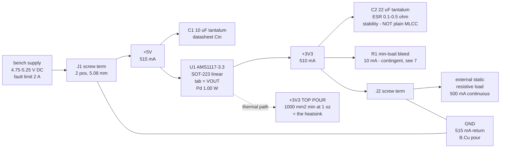

# power - rail architecture (bb-ldo, P1)

One source, one rail, one consumer. The architecture is trivial and stays that
way; the engineering is entirely in the thermal constraint (section 4-6).

Inputs: `requirements.md` (owner answers 1-9, design point frozen at P0),
`research/linear-regulator.md` (scout, AMS1117 Table 1),
`research/refdesign-linear-regulator.md` (TI LM1117 copper sweep, ESR window,
tab identity). Part ruled by the orchestrator: **AMS1117-3.3, SOT-223, LCSC
C6186** (JLC Basic), tab = VOUT.

## 1. Rail tree



## 2. Rails, topology, budget

| rail | vin | topology | budget | dissipation | tradeoff (one line) |
|---|---|---|---|---|---|
| `+5V` | J1, bench supply 4.75-5.25 V | direct (no conversion) | 515 mA | 0 W | it is the input node; nothing to trade |
| `+3V3` | `+5V` | linear series regulator (schema token `ldo`; AMS1117 is standard-dropout, ~1.3 V, not a true LDO) | 510 mA | **1.00 W in U1** | owner chose linear: zero switching noise and a 4-part BOM, paid for at ~63% efficiency and 1 W of heat the board must radiate |
| `GND` | - | return | 515 mA | - | single return, B.Cu pour |

**Current, per consumer (no bare totals):**

| rail | consumer | current | basis |
|---|---|---|---|
| `+3V3` | J2 -> external static resistive load | 500 mA | owner-stated, continuous 100% duty (requirements answer 6) |
| `+3V3` | R1 min-load bleed (contingent, section 7) | 10 mA | AMS1117 min load 3 mA typ / **10 mA max**, all variants (refdesign s.4) |
| `+3V3` | **budget** | **510 mA** | |
| `+5V` | U1 pass current (= `+3V3` budget) | 510 mA | series pass device, 1:1 |
| `+5V` | U1 ground/quiescent current | 5 mA | **ASSUMED** - implied by requirements s.3 ("~505 mA input at 500 mA out"). AMS1117's own Iq spec is NOT in the P1 fragments; see section 9 |
| `+5V` | **budget** | **515 mA** | |
| `GND` | return of the above | 515 mA | |

**No 30% headroom applied, deliberately.** 500 mA is an owner-stated hard
maximum for an external load, not an estimate of unknown consumers, and the
thermal design point is frozen in `requirements.md`. Padding it would inflate
the copper requirement on a board whose whole point is that copper area is
earned from a real number.

Input power at full load: 2.70 W at high line (5.25 V x 515 mA), 2.58 W
nominal. Output 1.65 W. Efficiency 61% (high line) to 64% (nominal) - a
property of the chosen topology, not a spec to meet.

**Trace sizing** (what `rules_gen`/`check_current` derive from the entries in
section 8): 0.515 A at dT = 10 C on 1 oz outer copper needs 0.26 mm; any sane
routing width clears it by 2-4x. Via ampacity default 0.5 A/via -> 2 vias per
layer transition on either rail. Current is a non-event on this board;
declared so the gates have the numbers, not because anything is tight.

## 3. Dissipation build-up (U1)

| term | arithmetic | W |
|---|---|---|
| pass-device conduction, high line, load only | (5.25 - 3.3) x 0.500 | 0.975 |
| quiescent / ground current | 5.25 x 0.005 (ASSUMED Iq) | 0.026 |
| **design point (frozen, = `power_w`)** | | **1.00** |
| + min-load bleed, if fitted | (5.25 - 3.3) x 0.010 | +0.020 |
| + Iq at a 10 mA max instead of 5 mA typ | 5.25 x 0.005 | +0.026 |
| + Vout at its -3% corner (3.20 V) | (0.500+0.010) x (3.30-3.20) | +0.051 |
| **stacked worst-case corner** | | **~1.10** |

At the required 65 C/W (section 4): Tj = 115 C at the design point (10 C
margin), Tj = 121 C at the stacked corner (4 C margin). The 125 C steady-state
limit is never crossed as long as theta_JA <= 65 C/W. Flagged for the thermal
list: 1.00 W is 2x the ~0.5 W threshold - this is the board's only hot spot.

## 4. Copper area for theta_JA <= 65 C/W (the deliverable)

Target chain: Ta 50 C, Tj target 115 C -> allowed rise 65 C -> at 1.00 W,
**theta_JA <= 65 C/W** (the orchestrator's 66 C/W was computed at 0.975 W;
adding the quantified quiescent term tightens it by 1.7 C/W).

**Row used: AMS1117 datasheet Table 1 (1/16" FR-4, 1 oz Cu), the
`1000 mm2 top / 0 mm2 backside / 1000 mm2 board` row = 65 C/W.**

Why that row and not a cheaper one: it is the only row that assumes **zero
backside copper**, so it is the only row whose validity does not depend on
what the table's backside plane is connected to - the exact thing this board
cannot reproduce (section 5). It is a direct table row, not an interpolation.

Independent cross-check, same package and same copper weight, from the
refdesign note (TI LM1117 SNOS412Q Table 9-2, SOT-223, 1 oz, **top-side copper
only** - our arrangement exactly):

| top copper | theta_JA |
|---|---|
| 342 mm2 (0.53 in2) | 75 C/W |
| 490 mm2 (0.76 in2) | 69 C/W |
| 645 mm2 (1.0 in2) | 66 C/W |

Two vendors, two independent sweeps, agreeing within ~1 C/W: the 65-66 C/W
knee sits in the **645-1000 mm2** band of top-side copper, and below it the
curve climbs steeply (490 mm2 already costs 4 C/W).

**Requirement emitted:** `+3V3` (tab) copper on F.Cu, contiguous with U1's tab
pad: **>= 1000 mm2 required**, 645 mm2 is the absolute floor (only reachable
if the bleed is dropped and Iq confirms at 5 mA), **1500-2500 mm2 preferred**
if the earned outline allows it - AMS1117's best rows (1000 top + 1000 back =
60 C/W; 2500/2500 = 55 C/W) buy another 5-10 C of margin for free copper.

**Confidence:** HIGH on the 1000 mm2 -> 65 C/W reading (direct row, no
interpolation, no backside dependency, corroborated by a second vendor).
LOW on any row that leans on backside copper (see section 5). Both sweeps are
for the *package*, not for the specific AMS1117 die on JLC's reel - the
counterfeit/clone variance flagged in refdesign s.4 applies.

**Outline consequence (this is the mechanism the board exists to teach):**
1000 mm2 of contiguous top pour plus two screw terminals, two caps and their
clearances puts the earned outline in the neighbourhood of 35-45 mm on a side.
That is an expectation for P5/P6, **not a cap** - the binding is `canonical`
and `board_edit --outline fit` decides.

**2 oz copper:** no source in these fragments quantifies 2 oz for SOT-223
(TI's 2 oz sweep is for TO-252, which confounds package with weight;
MIC29302A's "2 oz + 100 mm2" criterion is a different die and package), and
`check_thermal`'s model keys on layer count only - 2 oz changes its answer by
exactly nothing. Do not spend it: hold 1 oz and >= 1000 mm2.

## 5. The 2-layer complication: the tab is VOUT

**The AMS1117 SOT-223 tab is VOUT, not GND** - confirmed twice in the
fragments (scout md pinout; refdesign s.3 citing TI's "Tab is VOUT" pinout
figures for the same family). So the top-side heatsink pour is a `+3V3` pour.

- It **cannot** be stitched with thermal vias to a bottom-side GND pour: they
  are different nets. Vias into GND would short the rail.
- A bottom **GND** pour can still: carry the 515 mA DC return (milliohms),
  add board-level convection surface, and couple to the top pour through the
  1.6 mm FR-4 dielectric (k ~ 0.3 W/m.K against copper's 385 - real but weak).
  It **cannot** act as a via-fed second spreader for the tab, and
  `check_thermal` credits **zero** of it (the check counts copper on the
  thermal net only).
- Upper bound on what a stitched bottom layer would buy, from TI's sweep:
  bottom-only via-fed copper is ~20% WORSE than the same area on top
  (79 vs 66 C/W at 645 mm2), and a 50/50 top+bottom split (70 C/W) is worse
  than putting it all on top (66 C/W). Bottom copper is a supplement, never a
  substitute for top-side area.

**Recommended arrangement (A):** B.Cu is a GND pour everywhere EXCEPT a
`+3V3` island directly under U1's tab, stitched to the top pour with >= 12
vias. Cost, stated plainly: a hole in the GND return pour under U1. On this
board GND carries 515 mA of DC between two screw terminals with no high-speed
content and no switch node, so the return detour around a ~15 x 15 mm island
costs milliohms and nothing else - the usual return-path objection does not
apply here. Second cost: the island is a 3.3 V surface on the solder side
(same hot-to-touch advisory as the top pour; both are under mask).

Arrangement (A) is also what the gate rewards: `check_thermal` sums the
thermal net's copper across **all** copper layers within a 14.3 mm radius of
the part, and the top pour alone cannot fill that 645 mm2 disc (U1's own pads,
the `+5V` trace and clearances eat into it - expect 400-550 mm2 of top pour
inside the disc). The bottom island is what carries the credited area to the
model's cap.

**Ambiguity, flagged as a P2 research gap rather than guessed:** AMS1117's
headline text describes the table's backside copper as a *"backside ground
plane"*, but the excerpt in the scout's note does not state whether that plane
is via-connected to the tab pad, nor what net the table's top-side copper sits
on. For a tab = VOUT part a via connection to a ground plane is impossible,
which *suggests* the table's backside coupling is through-dielectric only -
but that is an inference from the pinout, not a sentence in the datasheet.
**Do not design to Table 1's rows 1/4/5 (the ones that lean on 2500 mm2 of
backside copper) until P2 reads the actual Table 1 note.** Row 2 (0 backside)
is immune to the question, which is why section 4 uses it.

## 6. What `check_thermal` will actually say (read before P6)

`check_thermal`'s 2-layer model is `theta = 55 + 119 * exp(-A/350)` with the
credited area **capped at 645 mm2** - a floor of **73.8 C/W** no matter how
much copper the board earns. The vendor sweeps put the same package at
65-66 C/W over the same 645-1000 mm2 and keep improving to 55 C/W at
2500 mm2, where the model has stopped counting.

Consequence, at the emitted `dt_c = 65`: rise floor = 1.00 W x 73.8 = 73.8 C
> 65 C, so **check_thermal reports a `thermal_area` ERROR at P8 for any
layout**, plus a `thermal_vias` warning if fewer than `min_vias` `+3V3` vias
sit within ~5 mm of U1's centroid. This is a model limitation, not a design
defect, and it is surfaced now rather than discovered at P8. See OPEN.

`min_vias` is set explicitly to **12**. The gate's own default here would be
~34 (pad-hull area / 1.21 mm2), which no SOT-223 tab region can physically
hold; 12 is a 3x4 array at ~1.3 mm pitch in the pour immediately around the
tab pad, inside the ~5 mm radius the gate counts. **Keep the vias out of the
tab pad itself** - JLC's standard process leaves them unfilled and via-in-pad
wicks solder out of the joint that IS the thermal path.

## 7. Capacitors - a datasheet requirement, in scope at block-only

- **Output: 22 uF solid tantalum** (AMS datasheet: "addition of 22uF solid
  TANTALUM on the output will ensure stability for all operating conditions").
  The clone datasheet's text gives 10 uF Ta / 50 uF Al with **ESR <= 0.5 ohm**;
  TI's LM1117, same class, gives an ESR **window of 0.3-22 ohm**. A plain
  low-ESR MLCC (< 0.05 ohm) sits below that window - the classic all-ceramic
  oscillation trap for 1117-class bipolar parts. **Specify a solid tantalum
  (or Al electrolytic >= 50 uF), never a bare X7R.** Landing ESR ~0.1-0.5 ohm
  satisfies both statements.
- **Input: 10 uF tantalum at the VIN pin**, short lead (AMS1117 p.5; every
  source in the refdesign note says the same).
- **No extra 0.1 uF HF ceramic.** That recommendation belongs to MIC29302A's
  datasheet (high-AC-impedance source), not AMS1117's; `block-only` admits
  exactly the support parts *the chosen part's* datasheet requires. Flagged,
  not taken - a one-part call P2 may overturn.
- `decoupling.json`: do **not** tag these with `"role": "reg_input"`. That
  role exists for switching regulators' VIN and makes `check_decoupling`
  demand an HF ceramic within 7.5 mm; a linear regulator has no switch node.
- `check_pdn`: both rails carry a >= 1 uF bulk cap, so no bulk warning. `GND`
  must carry `"pdn": false` or `check_pdn` errors "power rail GND has no
  decoupling" - it inventories every entry in `power`.

## 8. Constraint entries emitted (see `power.json`)

```jsonc
"power": [
  {"net": "+5V",  "current_a": 0.515, "dt_c": 10},
  {"net": "+3V3", "current_a": 0.510, "dt_c": 10, "plane_fed": true},
  {"net": "GND",  "current_a": 0.515, "dt_c": 10, "plane_fed": true,
   "pdn": false}
],
"thermal": [
  {"ref": "U1", "net": "+3V3", "power_w": 1.0, "dt_c": 65, "min_vias": 12}
]
```

`"plane_fed": true` on `+3V3` is doing real work: it makes `check_current`
error `plane_missing` if the `+3V3` pour is ever absent. The thermal design
*is* that pour, so the rail's own gate now enforces its existence, which
`check_thermal` alone cannot do.

**Handoff to P2 (cannot be authored at P1):** declare
`planes: [{"layer": "F.Cu", "net": "+3V3", "region": ...},
{"layer": "B.Cu", "net": "+3V3", "region": ...}]` once a placement exists.
Region coordinates do not exist yet - the outline is an OUTPUT under the
`canonical` binding. P7 also needs the B.Cu GND pour and the B.Cu `+3V3`
island to coexist (zone priority), and `stitch_vias` to place the 12 vias in
the pour, not in the pad.

## 9. Scope, sequencing, gaps

- **Not designed, by scope tier** (`block-only`, requirements s.1): no
  protection, no filtering beyond the datasheet's own caps, no indicator, no
  test point, no config/enable strap, no second rail. Their absence is not a
  finding.
- **Sequencing / inrush:** one rail, always on - nothing to sequence. Inrush
  is the charge of C1 (10 uF) + C2 (22 uF) at power-on, bounded by the bench
  supply's own 2 A limit (owner answer 2); no soft-start requirement, no
  power-good, no consumer that cares.
- **Gap 1 - AMS1117 quiescent/ground current is not in the P1 fragments.**
  The 5 mA used here is inferred from requirements.md s.3's "~505 mA input".
  If it is really 10 mA max, Pd rises to 1.03 W and the required theta_JA
  tightens to 63 C/W. P3 should read it off the datasheet when it pins the
  exact manufacturer.
- **Gap 2 - what Table 1's backside copper is connected to** (section 5). P2
  research trigger.
- **Gap 3 - AMS1117 dropout at 500 mA is not tabulated** (scout: only the
  0.8-1.0 A point is guaranteed, 1.3 V max). Budget to 1.3 V against 1.45 V
  of worst-case headroom: it fits, with 0.15 V to spare, and the real 500 mA
  dropout is well below it. Not a power-architecture risk, recorded because
  it is the other number the 4.75 V corner depends on.
