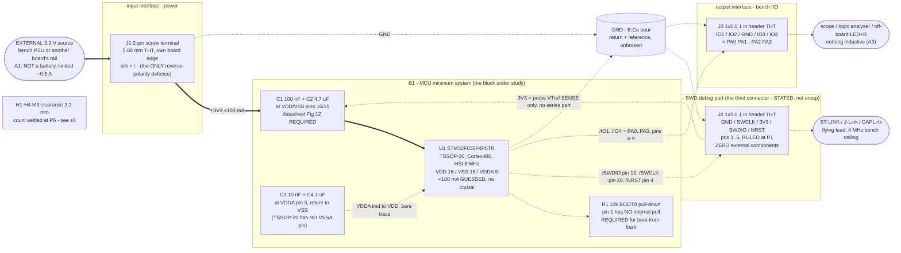

# blocks.md - bb-mcu block architecture

P2 architect. Inputs: `requirements.md` (s1-s9; the ANSWERS block and the
DELEGATION block are binding), `research/mcu.{md,json}`,
`research/refdesign-mcu.{md,json}`, `research/interface-swd.{md,json}`,
`state.json` `decisions[]` (P0/P1 rulings - not re-opened here),
`reference/stackups.yaml`, `reference/constraints_schema.md`,
`reference/build-modes.md`.

**BUILD MODE: `learning block-basics:`** - target `block-basics`, scope tier
`block-only`, binding `canonical`, no stage under study. Scope is ONE block
(the MCU), its datasheet-required support, three stated connectors, mounting,
and nothing else. **Geometry is an OUTPUT** - no dimension appears anywhere in
this package (see s6 and `stackup.md` s4). The mode binds SCOPE only; it does
not thin `constraints.json`, whose `blocks[]` + `operating_point` stay complete
because the P2-exit coverage check and knowledge retrieval read them.

**Nine electrical parts. One IC, four capacitors, one resistor, three
connectors.** Every one is either the block's active part, a support component
the datasheet REQUIRES, a stated interface, or what the bench needs to hold the
board.

---

## 1. Block diagram - power (solid) and signal (dashed)

---

## 2. Blocks

### B1 - MCU minimum system (the block under study)

**Lead part: `STM32F030F4P6TR`** - STMicroelectronics, TSSOP-20, ARM Cortex-M0,
16 KB flash / 4 KB RAM, 48 MHz ceiling from the internal 8 MHz HSI. RULED at
P1 (`state.json`, 2026-08-16); the runners-up (STM32C011F4P6, PY32F030F28P6TU,
CH32V003F4P6, STM32G031F4P6) are rejected with reasons in that decision and are
not re-opened. **No LCSC code appears anywhere in this package - part codes are
P3's job.**

What the datasheet REQUIRES around it, and nothing else (all citations in
`research/refdesign-mcu.md`):

| Ref | Part | Why it is REQUIRED | Attaches |
|---|---|---|---|
| `C1` | 100 nF ceramic, X7R | DS Fig 12 caption: "each power supply pair ... **must** be decoupled with filtering ceramic capacitors". AN4325 Table 4 *Mandatory components*. TSSOP-20 has exactly one VDD/VSS pair, so the per-pair set applies once. | VDD (16) / VSS (15) |
| `C2` | 4.7 uF ceramic | Same figure's bulk cap; AN4325 C6 "Used for VDD" | `+3V3` / `GND` at U1 |
| `C3` | 10 nF ceramic | Same figure, VDDA branch; AN4325 C3 | VDDA (5) / `GND` |
| `C4` | 1 uF ceramic | Same figure, VDDA branch; AN4325 C5 | VDDA (5) / `GND` |
| `R1` | 10 k, 5 % is fine | BOOT0 (pin 1) has **no internal pull** (DS Table 11 pin-type legend defines type "B" with no pull language, in the same legend that gives "RST" an "embedded weak pull-up"). A pin hardware-sampled on the 4th SYSCLK edge after reset, before any software runs, has an undefined level if left floating. Value is ST's own (AN4325 R2). | BOOT0 (1) -> `GND` |

**VDDA is tied to VDD by a bare trace** - the CONNECTION is required (DS 3.5.1
"VDDA ... must be always greater or equal to VDD and must be provided first";
AN4325 1.1 "when a single supply is used, VDDA must be externally connected to
VDD"), and tying them makes the sequencing requirement true by construction:
one net, zero delta, simultaneous arrival. The **filter** on that connection is
RECOMMENDED only - ST's own reference schematic (AN4325 Fig 9) draws a bare
trace - and is excluded by the scope tier. There is no VSSA pin on TSSOP-20
(DS Table 11 shows "-"), so C3/C4 return to the shared `GND` net. That is a
package fact, not a design gap.

**Excluded, each for a stated reason** (SCOPE decisions - never reviewer
findings, per `build-modes.md`):

- **VDDA filter network** (ferrite/pi): RECOMMENDED, not required. Tier
  excludes filtering the datasheet does not require.
- **NRST 100 nF capacitor**: AN4325 files it under *Optional components*, "for
  RESET button", and this board has no reset button. NRST's permanent internal
  pull-up (25/40/55 k, DS Table 49) plus the die's own glitch filter (rejects
  <= 100 ns, guarantees reset >= 300 ns) is already a complete reset circuit.
  Diverges from this repo's `stm32-blinky` (which fitted C9) - P1 decision,
  accepted risk, recorded so bring-up can judge it.
- **Series resistors on SWDIO/SWCLK**: a CONSIDERED REJECTION of real vendor
  recommendations (Raspberry Pi 100R, Lauterbach 47R, SEGGER 47R). Never
  defend this with "no source asks for it" - three do. Grounds in s3 and in the
  P1 decision.
- **Pull-ups/pull-downs on SWDIO/SWCLK**: AN4325 4.3.3 - "having embedded
  pull-up and pull-down resistors removes the need to add external resistors".
- **Tie-offs on the 9 unused pins** (PF0, PF1, PA4-PA7, PB1, PA9, PA10):
  AN4325 5.6 motivates them by EMC and current consumption, never by
  correctness. RECOMMENDED, so excluded. This does NOT extend to BOOT0, which
  is sampled before software can act - kept deliberately separate.
- Everything in `requirements.md` s1: protection of every kind, indicators,
  buttons, test points, config straps, a second rail, mechanical features.

### B2 - SWD debug port (a block, not a connector line-item)

**J2 is declared as its own `blocks[]` entry (topology `swd-debug-port`).** The
coverage machinery derives interface slots only from `diff_pairs[].base`, and
SWD is single-ended, so the honest way to get the debug port covered is to
declare it as the functional block it is - not to invent a fake differential
pair, which would inject an unbuildable impedance requirement into P5 and P7.
Its knowledge (pull requirements, reversal-safe pin order, header conventions,
VTref direction) is reusable on ANY MCU board regardless of family, which is
exactly what this seeding run exists to produce. P2 decision, recorded.

**Pin order, positions 1 to 5: `GND / SWCLK / 3V3 / SWDIO / NRST`.** RULED at
P1 and NOT re-opened here. The mechanism, restated so P4/P6 do not "tidy" it:
on an unkeyed 5-way shell a 180-degree reversal maps position `i` to position
`6-i`, so position 3 maps to itself. **3V3 at the centre is the unique
arrangement in which a reversed probe lands its high-Z VTref INPUT on the
board's rail** instead of landing a probe OUTPUT there. GND and NRST take the
ends, so a reversed probe ground clamps reset (benign and obvious at the bench)
rather than a data line, and GND stays adjacent to SWCLK per ARM's
return-next-to-clock convention.

**The 3V3 pin is a SENSE input, not a rail.** ST calls it `T_VCC`, "Input for
STLINK-V3SET" (UM2448 Table 6); SEGGER: VTref "must not have a series
resistor" (UM08001 13.5). Wire it straight to `+3V3`. Sourced current: J-Link
BASE/PLUS < 25 uA, EDU Mini < 170 uA - 0.17 % of this board's budget, so it
gets no entry of its own in the power tree. **No probe in this class can
back-power the board through J2**: the only documented target-supply pin in any
of them is pin 19 of a 20-pin header, and J2 has no such pin. The bench rule
"power from J1 only" survives as procedure hygiene, not as a documented
back-drive path.

**NRST on the header is the right call and ST says so** (AN4325 6.1.4). With no
reset button on this board, J2's NRST is the board's ONLY reset control and its
only recovery path: without it the tools silently fall back to a software
system reset, which cannot recover a part whose firmware has released the SWD
pins. `stm32-blinky` already paid for that omission and recorded it.

**SWD adds ZERO components.** That is the useful result of the interface
research, not an oversight.

---

## 3. What SWD binds on layout: NOTHING

No controlled impedance, no differential pair, no length matching, no series
termination, no return-path rule. `high_speed` is absent from
`constraints.json` and `diff_pairs` is OMITTED (see `sheets.md` s4). The
arithmetic, from the interface research:

- Fastest edge the part can produce on any GPIO: **5 ns** (DS Table 48,
  OSPEEDR = 11, CL = 30 pF) - and that is the real reset default for PA13
  (GPIOA_OSPEEDR reset 0x0C00 0000). SWCLK is a target INPUT; its edge belongs
  to the probe.
- Reflections on an unterminated 40 mm FR-4 trace settle in ~1.5 ns
  (3 round trips at ~6 ps/mm).
- SWD samples mid-bit-cell: **125 ns** away at ST-LINK/V2's 4 MHz ceiling,
  **20.8 ns** at STLINK-V3's 24 MHz. Margin 80x, still 14x at 24 MHz.
- Skew: 30 mm of mismatch is 0.18 ns, i.e. 0.14 % of a half-bit.
- And there is nothing to match TO: JLC sells **no** impedance-controlled
  2-layer stackup (`stackups.yaml` records the live probe returning zero
  templates for `stencilLayer=2` at both copper weights). A 50 ohm
  single-ended target on this stack needs a ~2.7 mm trace.

The `<= 50 mm` trace bound, "run over the B.Cu pour where convenient" and
"keep SWCLK clear" all remain **ADVISORY** and live in `constraints.json`
`notes` - never as enforced constraints. Declaring these nets in `high_speed`
would only manufacture `corridor_void` findings that are unfixable by
construction on 2 layers (LEARNINGS 2026-07-30 `[check_return_path][stackup]`:
"declaring a net can only ever raise the finding count").

**Trap for later phases**: do not import AN5967 14.4.5's "50 ohm +/- 10 %,
traces <= 25 mm" - that is the ETM parallel trace port, not SWD. And do not
cite ARM DUI0499 anywhere: the interface research flagged it as never actually
fetched.

---

## 4. Pin assignment - the four GPIO, and why these four

**`IO1 = PA0` (pin 6), `IO2 = PA1` (7), `IO3 = PA2` (8), `IO4 = PA3` (9).**

A3 made this a pure LAYOUT criterion: the four GPIO are plain digital I/O with
no alternate-function requirement, so the only question is which four give the
cleanest escape from a TSSOP-20 on 2 layers. The criterion applied: **reach one
board edge without crossing the debug signals, the supply traces or the
decoupling caps' ground vias, and without forcing a bottom-side route that
would cut the B.Cu pour.**

The package geometry that decides it (DS Figure 8; TSSOP-20, 0.65 mm pitch,
pins 1-10 down one side, 11-20 up the other, pin 1 opposite pin 20):

| Package region | Pins | Carries |
|---|---|---|
| **one END** (both faces, ~2 mm span) | 1, 2, 3, 4 / 20, 19, 18, 17 | BOOT0(1), NRST(4), **SWDIO(19), SWCLK(20)** |
| middle of face A | 5 | VDDA + C3/C4 |
| middle of face B | 15, 16 | VSS/VDD + C1/C2 |
| **far half of face A** | 6, 7, 8, 9, 10 | **PA0, PA1, PA2, PA3**, PA4 |
| far half of face B | 11-14 | PA5-PA7, PB1 (unused) |

Both research fragments flagged "J2 cannot take all its MCU-side signals off
one FACE". **It does not need to - they share one END.** BOOT0(1), NRST(4),
SWDIO(19) and SWCLK(20) all sit within ~2 mm of the pin-1 end of the package,
so a J2 placed off that end takes all three debug signals with no crossing, and
R1 sits in the same window on BOOT0. The four GPIO then escape from the
diagonally opposite region (far half of face A) toward their own edge.

Tie-breakers behind PA0-PA3 specifically, over the equally-adjacent PA5/PA6/
PA7/PB1 (pins 11-14):

1. **One port, consecutive bits.** PA0-PA3 is a single-register access for
   whoever writes firmware against this board later. PA5-PA7 + PB1 straddles
   two ports.
2. **Maximum distance from SWCLK**, which carries the fastest edge on the
   board and is the only aggressor of note (Lauterbach: a spike on SWCLK
   "will most likely cause communication to fail"). Face A far half is the
   farthest region of the package from pin 20.
3. PA5-PB1 would put the GPIO escape on the same face as VDD/VSS and their
   caps AND on the same face as the SWD pins.

Any alternate-function capability these pins happen to carry is a bonus, never
relied on: A3 removed the requirement and this run's research did not verify
the AF map, so no claim is made here.

**One congestion point, flagged for P6/P7, not solved here:** C3/C4 sit at
VDDA (pin 5), on the same face the four GPIO escape past. Placing them toward
the pin-1 end of pin 5's escape keeps the far half of that face clear. This is
the only place on the board where two things want the same copper.

**PA13/PA14 must NOT also be routed to J3.** They can be released to GPIO in
software, but J2 needs them as SWD permanently, and routing them to both
headers is a pin conflict.

---

## 5. Silk is load-bearing on this board

Not decoration - it is the only thing standing between a correct board and a
destructive plug:

- **J2**: unkeyed. Label all five pins by name, with the text OUTSIDE the
  connector body footprint, plus a pin-1 marker that survives assembly.
  `stm32-blinky` promised silk-labelled pins in its architecture and SHIPPED
  WITHOUT THEM, and its lone square pin-1 pad ends up under the header body -
  the exact failure this board must not repeat. Note the naming: ST never says
  "VTREF" on its own connectors, so silk the pin `3V3`.
- **J3**: same treatment, five labels (`IO1 IO2 GND IO3 IO4`).
- **J1**: `+` and `-` (or `+3V3` / `GND`). There is no reverse-polarity
  protection by mode, so this marking is the entire defence against a swapped
  supply.

---

## 6. What the layout NEEDS - stated instead of a size

**No dimension is stated anywhere in this package, and none may be introduced
later.** The brief states no size, so nothing was relaxed at P2 - there is no
stated value to lose. `board_init --outline auto` at P5, place at P6,
`board_edit --outline fit` earns the outline, then route. Any dimension that
appears at a later checkpoint is a preference that LOSES to the earned layout,
and the loss gets recorded as a `state.py decision`.

What the placement is actually spending, in order of claim:

1. **Three through-hole connectors on three different board edges**, each with
   its opening facing OFF-BOARD (`requirements.md` s5; power apart from the two
   signal headers so bench wiring and the probe do not cross the board). J1 is
   a 5.08 mm 2-pole terminal - a deep body plus wire-entry clearance. J2 and J3
   are 1x5 0.1 in headers - 12.7 mm of pin span each plus end clearance, and
   the mated plug stands ~10 mm proud. This sets a PERIMETER floor, and it is
   the largest single driver on the board.
2. **Decoupling tight to the supply pins.** DS Fig 12 caution: caps "must be
   placed as close as possible to ... the appropriate pins"; AN4325 Fig 8 puts
   a supply via and a ground via straddling each cap, tight to the pin. C1/C2
   against pins 15/16, C3/C4 against pin 5, all on the top face, each ground
   dropping straight to the B.Cu pour through its own via.
3. **R1 in the pin-1 window**, keeping the hardware-sampled BOOT0 node short.
4. **Mounting.** Four M3 clearance holes (3.2 mm) inset from the corners, with
   washer keepouts. **This is the one item that can make the earned board
   BIGGER than the electronics need** - four holes plus washer clearance claim
   real corner area. `requirements.md` s5 sanctions dropping to two on opposite
   corners if the earned outline cannot hold four; that call belongs to P6,
   with the outcome recorded.
5. **SWDIO/SWCLK <= 50 mm** (advisory) - trivially met at any honest size.
6. **An unbroken B.Cu GND pour** under the package and the debug traces, which
   on 2 layers means: do not route on the bottom under the MCU. Single-sided
   assembly (mode default) reserves the whole bottom face for it.

Not driving the outline: heat (nothing here dissipates - see `power_tree.md`
s4), current (0.1 A needs no copper anyone can draw by hand), impedance
(nothing is a transmission line), and any stated number (there is none).
Deliberately no planning figure is offered: on this board a number would be an
anchor with nothing behind it.

---

## 7. Cost picture for H1

**BOM, per board, at qty 5.** Only the MCU price is researched
(`parts_search.py`, live, LCSC C89040 at **$0.9628**); everything else is a
part-CLASS estimate and P3 will replace it with real numbers.

| Item | Qty | Each (est.) | Note |
|---|---|---|---|
| U1 STM32F030F4P6TR | 1 | **$0.96** | researched, live; JLC Extended (no Basic MCU meets the must-haves - normal, and `stm32-blinky` set the precedent) |
| C1-C4 ceramics | 4 | ~$0.02 | JLC Basic X7R |
| R1 10 k | 1 | ~$0.01 | JLC Basic |
| J1 screw terminal 5.08 mm 2P | 1 | ~$0.15 | class estimate |
| J2, J3 1x5 0.1 in headers | 2 | ~$0.05 | class estimate |
| **BOM total** | 9 | **~$1.30** | dominated by the MCU |

**Fab class: the cheapest standard tier JLC sells** - 2 layers, 1.6 mm, 1 oz
HASL, soldermask, no controlled impedance, no blind/buried vias, min drill
0.3 mm, geometry well inside the standard 5/5 mil class. The board area is
deliberately UNKNOWN at this point, but it cannot approach the 100 x 100 mm
ceiling of JLC's headline price tier, so the PCB is at the floor price for a
5-piece order whatever the placement earns.

**At quantity 5 the order is dominated by fixed fees, not by the BOM**: PCBA
setup plus stencil plus shipping run several times the ~$6.50 of parts for the
whole build. `order_quote` does the real numbers at P10 - **and this board
stops at P9 by mode, so P10 never runs. This is the only cost picture this
board gets**, and it is an estimate, which is the honest thing to tell the
human at H1.

---

## 8. Simulation candidates: NONE

Stated rather than left blank. There is no analog content on this board: no
amplifier, no filter, no regulator, no oscillator network, no feedback loop,
no transmission line - and therefore no numeric pass window a simulation could
test. The one dynamic quantity that exists is the SWD edge, and s3 already
closes it analytically with three orders of magnitude of margin; simulating it
would restate arithmetic, not test a design. `gate-sim` is a clean no-op.
