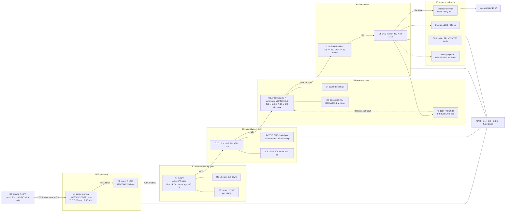

# buck-5v3a - block architecture

P2 merge of `requirements.md` (section 10 binding), `research/power.{md,json}`,
`research/regulator.json`, `research/powerpath.json`, `research/refdesign-buck.{md,json}`.
Machine twin: `architecture/constraints.json`. Decisions/rejections: `decisions.md`.

**Part names below are MPN or part-class only. No LCSC codes - P3 owns those.**

## 0. Headline

One rail, one function, six blocks, 25 placed parts, **one flat schematic sheet**.
The whole engineering argument is thermal, and it now runs on the REAL part
instead of a part class:

| | power.json (part class) | THIS DOC (AP63356QZV-7, DS41948) |
|---|---|---|
| RDS(on) HS/LS typ @25 C | 45 / 20 mohm (assumed filter <= 90) | **74 / 40 mohm** (datasheet) |
| P_IC at the 7 V corner | 0.63 W | **0.88 W** |
| Board loss / efficiency at 7 V | 1.20 W / 92.6 % | **1.48 W / 91.0 %** |
| theta_JA used | 51 C/W (4L) | **51 C/W (4L)** - unchanged, see `stackup.md` s2 |
| Rise at 50 C ambient, 4L | 41 C | **45 C** (machine-run, `check_thermal`) |
| Verdict | 4L required | **4L required; AP63356Q is the shortlist's only survivor** |

## 1. Block diagram - signal and power flow

## 2. Blocks, one paragraph each

### B1 - input entry (J1, F1)

Field wiring lands on a **2-pin 5.08 mm THT screw terminal, WJ500V-5.08-2P class**
(the KF128-5.08-2P-AA is the confirmed-dimension second source). Both were read off
vendor drawings by the powerpath scout: **10 A / 300 V on the UL number** (the LCSC
parametric field reports the looser IEC number - do not cite it), body 10.0 mm deep
and **14.07 mm tall against A8's 15 mm cap - 0.93 mm of margin**. That margin is the
tightest mechanical number on the board and is called out again in `stackup.md` s5.
The fuse is a **4 A 1206 one-shot, 1206T4A63V class**, picked from the shortlist for
the *highest* melting I2t (4.145 A^2s) because A5 asks for time-lag behaviour and no
1206 part in the sweep advertises a true slow-blow curve; JFC1206-1400FS is the
deeper-stocked alternate at 1.73 A^2s. F1 sits next to J1 in the coolest corner of
the board, far from U1 - see `power_tree.md` s5 for why that placement is doing real
work against the SMD-fuse derating problem.

### B2 - reverse-polarity gate (Q1, R6, D3)

A **series P-channel MOSFET in the high side** (A4, binding): source on
`/VIN_FUSED`, drain on `+VIN`, gate pulled toward GND, zener clamping Vgs. Lead part
**AO4407A class in SO-8** - 14.7 mohm specified **at Vgs = -4.5 V**, which is the
figure that matters because at the 7 V corner the gate only has 7 V to work with;
that is **81 mW at 2.35 A**, inside A4's 100 mW target. AOD403 (TO-252/DPAK, 11.5
mohm at -4.5 V, 64 mW) is the alternate and wins on loss but costs ~35 mm^2 more
board area on a size-capped outline. **R6 = 10 kohm, not the 100-330 ohm the
reference-design agent quoted from an app note** - see `decisions.md` D6: at 18 V in
with a 15 V clamp, 220 ohm burns 0.25 W continuously, which is 17 % of this board's
entire loss budget, and the failure mode (a technician swapping screw-terminal wires
on a current-limited bench supply) is a millisecond event that 10 kohm x ~2 nF
(~20 us) turns off with three orders of magnitude to spare. D3 is a **12-15 V zener**,
load-bearing rather than optional: the input TVS clamps at 32.4 V, above any of these
FETs' Vgs(max) (AO4407A +/-20 V, AOD403 +/-25 V), so without D3 a surge puts the clamp
voltage across the gate oxide. P3 must confirm Vz <= Vgs(max) - 5 V for the FET it
actually buys.

### B3 - input clamp and bulk (D2, C1, C2, C3)

**SMBJ20A class TVS on `+VIN`, after the P-FET** so a reversed supply does not short
it. 20 V standoff is the smallest step that will not conduct at the 18 V steady-state
maximum; its 32.4 V clamp is above the ~30 V aim but **below U1's 35 V DC absolute
maximum** (DS41948) with 2.6 V to spare, and far below the 40 V/400 ms transient
allowance - so the pairing closes. The bulk is **2 x 10 uF 50 V X7R 1210 plus a
100 nF 50 V 0603 at the VIN pin**. Three independent reasons the 50 V/X7R
specification is not negotiable: DC-bias derating (a 25 V part keeps ~50 % at 12 V, a
50 V part ~75 %), the ~90 C board hotspot (**X5R stops at 85 C - the Basic-tier
25 V X5R part in `research/powerpath.json` is DISQUALIFIED for the input**), and the
hot-plug ring (~1 uH of supply lead into ~13 uF rings to ~2x the step, i.e. ~36 V
from an 18 V plug-in - which is precisely what D2 exists to catch). Worst-case Cin
RMS ripple is **1.51 A at Vin = 10 V, inside the operating window**, not at either
end. No aluminium electrolytic anywhere on this board.

### B4 - regulator core (U1, C4, R1-R4)

**Diodes AP63356QZV-7**, integrated-FET synchronous buck, VDFN-13 3.0 x 2.0 mm with
wettable flanks and MSL1. 3.8-32 V operating / 35 V DC absolute max / 40 V for
400 ms; 3.5 A rated; 450 kHz typ; hiccup current limit (HS peak 5.0 A typ, 4.0 A
**min**) plus 170 C thermal shutdown; internal 4 ms soft-start, no SS pin; EN
self-starts on an internal 1.5 uA pull-up. **PWM-only** - see `decisions.md` D3 for
why the PFM sibling AP63357QZV-7 loses. The family is **adjustable-only** (the LCSC
"Fixed" attribute is a scrape artifact, closed by the reference-design agent against
the ordering table), so `/FB` is set by **R1 = 158k / R2 = 30.1k, 0.5 % or better**
- 158k rather than the datasheet table's 157k because it centres the nominal on
5.000 V instead of 4.987 V, and 0.5 % rather than 1 % because 1 % resistors stack
+/-1.68 % on the reference's +/-1 % and leave nothing against A3's +/-3 % window.
`COMP` is tied to GND (internal compensation, no external R/C network). C4 is the
required 100 nF bootstrap cap. R3/R4 form an **EN/UVLO divider at ~6.2 V rising /
~5.3 V falling** so the converter never operates below its 7 V specification on a
slow ramp - two resistors that directly protect the thermally marginal fuse; tying
EN to `+VIN` is the documented fallback if P4 finds the Eq.1-2 hysteresis math
unsatisfiable (`decisions.md` D7).

### B5 - output filter (L1, C5, C6)

**L1 = 6.8 uH, Isat >= 6 A, DCR <= 30 mohm, shielded composite, 125 C rated.** The
value is not a preference: at 450 kHz the peak inductor current at the 18 V corner is
**3.59 A against a 4.0 A MINIMUM high-side current limit - 11 % margin**, and the
4.7 uH part the powerpath scout shortlisted (it swept 4.7 uH for a 500 kHz assumption
and 2.2/3.3 uH for 1 MHz) gives **3.85 A, i.e. 4 % margin, which is a current-limit
trip at high line**. **No 6.8 uH candidate exists anywhere in `research/raw/` - P3
must run a fresh sweep** (`decisions.md` D8). Cout is **2 x 22 uF 25 V X7R 1210**
(~30 uF effective after 5 V DC bias): modelled output ripple **13 mV pk-pk at the
worst corner against a 50 mV budget**, i.e. ripple is settled with ~4x margin, and
the value sits inside DS41948 Table 1's stated internal-compensation window. C7
(100 uF polymer at J2) is **reserved, not fitted** - it is the hedge for the unknown
external load transient, which is H1 open question 1.

### B6 - output, indication, test access (J2, D1, R5, TP1-3)

**J2 is the same terminal family as J1** for BOM consolidation, on the opposite board
edge with wire entry facing outward, silk-labelled distinctly (`VIN 7-18V` vs
`5V 3A`) so the two cannot be confused in the field. **D1 = green LED on +5V with
R5 = 1 kohm** (1.9 mA - plainly visible on a modern green part and 6 mW of heat this
board does not need to add). **TP1 on `+VIN`, TP2 on `+5V`, TP3 on `GND`** - TP1 is
deliberately on the protected rail rather than the raw terminal, because that is the
node whose ripple and droop actually tell you something about the converter. No
power-good output and no external enable, per A6.

## 3. What the schematic must NOT do

- Do not copy an adjustable-family FB divider onto a fixed-output part or vice versa
  (buck.md s4 FB trap). This family has no fixed SKU - the divider is required.
- Do not route `/FB` past `/SW` or L1; sense at the Cout node, not at the inductor
  (DS41948 Figure 47).
- Do not put any SMT part on B.Cu (A11) - see `constraints.json` `placement.keepouts`.
- Do not fit an aluminium electrolytic: a 105 C/2000 h part at a ~90 C board
  temperature has ~5.7 kh of life.
