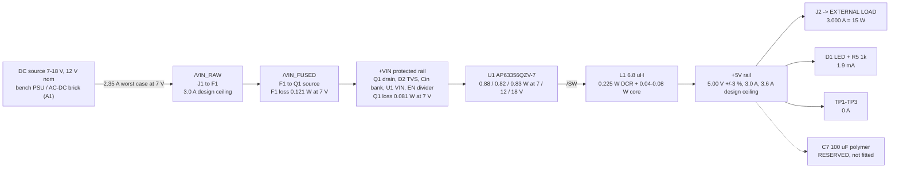

# buck-5v3a - power tree and loss budget

Rails, budgets and the re-derived loss model. Numbers here supersede
`research/power.md` s3 wherever they differ - `research/power.md` modelled a part
CLASS that the shortlist does not contain (see s2). Thermal verdict and the
theta_JA conflict: `stackup.md` s2. Machine twin: `constraints.json`.

## 1. Rail tree

There is nothing else to budget: the load is external and hard-bounded at 3.000 A
(stated, closed by A2), the LED is 1.9 mA, the FB divider is 27 uA, the EN divider is
113 uA at 12 V, and U1's own non-switching bias is 258 uA. **Everything below is
about what the board turns into heat.**

## 2. CONFLICT RESOLVED - the loss model ran against a part class that does not exist

`research/power.md` and `research/regulator.json` were produced in parallel. The
power model was built on a **45 / 20 mohm** exemplar (Diodes AP64500 class) and then
published a selection filter, *"RDS(on)_HS + RDS(on)_LS <= 90 mohm typ at 25 C"*.
**Every part on the regulator shortlist fails that filter.** The lead part's real
numbers, read out of the datasheet during this merge:

> **Diodes AP63356Q/AP63357Q, DS41948 Rev.1-2, Electrical Characteristics p.5:
> R_DS(ON)1 (high side) = 74 mohm typ, R_DS(ON)2 (low side) = 40 mohm typ**, at
> Tj = 25 C, VIN = 12 V. **No maximum is published for either.** Figure 5
> (RDS(on) vs temperature) reads ~90 / 46 mohm at 100 C against ~72 / 38 mohm at
> 25 C, i.e. x1.25 (HS) and x1.21 (LS) - applied to the table typ values gives
> **92 / 48 mohm at a ~105 C junction**, which is what the model below uses.
> Also confirmed on the same page: fsw 450 kHz typ (400-500), t_ON_MIN 100 ns,
> HS peak current limit **4.0 A min / 5.0 A typ / 6.0 A max**, LS valley limit
> 3.2 / 4.2 / 5.2 A, VFB 0.800 V +/-1 %, tSS 4 ms, TSD 170 C.

**Who lost, and why.** The **90 mohm filter loses** - it was a *derived* criterion
(the RDS(on) that makes a 0.63 W IC land at 105 C junction), not a requirement, and
it was derived before anyone had looked at what LCSC actually stocks. Deleting it
does not weaken the design because the thing it was protecting - junction temperature
- is checked directly, with the real numbers, in `stackup.md` s2. **The datasheet's
74/40 mohm wins on every derived number**: P_IC, efficiency, input current and
junction temperature are all re-derived below. `research/power.md` s3's loss table
and its 92.6/93.6/93.6 % efficiency figures are **superseded**; its method,
its Cin/Cout/inductor reasoning and its layout prescriptions all stand.

## 3. Loss breakdown at 3 A out (re-derived, this document is the source of record)

Model inputs, all stated so they can be challenged:

- **RDS(on)** 92 / 48 mohm at ~105 C (derivation above).
  `P_cond = (Io^2 + dI^2/12) x [D x R_HS + (1-D) x R_LS]`.
- **Switching** `0.5 x Vin x Io x (tr+tf) x fsw`, tr+tf = 15 ns at 450 kHz. **DS41948
  publishes no tr/tf** - this is a class estimate and is the single softest number in
  the table (it is worth 0.07-0.18 W).
- **Gate charge + Coss + dead time + IQ = 0.09 W flat**, carried over from
  `research/power.md`. IQ alone is 258 uA x Vin = 1.8-4.6 mW.
- **L1** DCR 25 mohm budget (DS41948 s10 wants < 30 mohm), core loss 0.04/0.06/0.08 W.
  **F1** 22 mohm cold. **Q1** 14.7 mohm at Vgs = -4.5 V. **Cin** ~4 mohm bank ESR.
- **Copper + screw-terminal contacts** ~8 mohm in / ~9 mohm out, **at 1 oz** - kept
  deliberately at the 1 oz figure although the board is 2 oz, so the budget is
  conservative by ~0.06 W.

| Loss term | 7 V in | 12 V in | 18 V in |
|---|---|---|---|
| U1 conduction | 0.721 W | 0.606 W | 0.553 W |
| U1 switching | 0.071 W | 0.121 W | 0.182 W |
| U1 gate/IQ/misc | 0.090 W | 0.090 W | 0.090 W |
| **U1 subtotal (the thermal number)** | **0.881 W** | **0.818 W** | **0.825 W** |
| L1 DCR | 0.225 W | 0.227 W | 0.228 W |
| L1 core | 0.040 W | 0.060 W | 0.080 W |
| F1 + Q1 + input copper | 0.248 W | 0.082 W | 0.036 W |
| Output copper + contacts | 0.081 W | 0.081 W | 0.081 W |
| Cin ESR | 0.007 W | 0.009 W | 0.007 W |
| **BOARD TOTAL** | **1.483 W** | **1.277 W** | **1.258 W** |
| Input current | **2.35 A** | 1.36 A | 0.90 A |
| Efficiency | **91.0 %** | 92.2 % | 92.3 % |

Reading of the table:

- **Low line is the worst corner**, for two reasons that compound: duty is 0.71 so
  the loss parks in the high-side FET, and input current is 2.6x the high-line value
  so the fuse and P-FET losses triple. This is why every thermal number in this
  package is quoted at 7 V.
- U1's own dissipation is nearly flat across the line range (0.82-0.88 W) because
  conduction and switching trade off. **The board loss, not the IC loss, is what
  makes low line worst** - but it is the IC loss that sets junction temperature.
- Everything outside U1 sums to **0.37-0.60 W**. That is not noise: it raises the
  local air and board temperature that U1 sits in, which `check_thermal` does not
  model. See `stackup.md` s2.4.
- Efficiency is 91.0-92.3 % against the requirements' 90-93 % sizing guess - the
  guess was right; the input-current sizing that came out of it (>= 2.5 A) stands
  with margin over the real 2.35 A.

## 4. Operating points and the numbers that size parts

At 3 A out, L = 6.8 uH, fsw = 450 kHz:

| Vin | D | Inductor ripple | Peak I_L | Margin to the 4.0 A MIN current limit | Cin I_rms |
|---|---|---|---|---|---|
| 7 V | 0.714 | 0.47 A (16 %) | 3.23 A | 24 % | 1.36 A |
| **10 V** | 0.500 | 0.82 A (27 %) | 3.41 A | 17 % | **1.51 A (max)** |
| 12 V | 0.417 | 0.95 A (32 %) | 3.48 A | 15 % | 1.49 A |
| 18 V | 0.278 | 1.18 A (39 %) | **3.59 A** | **11 %** | 1.36 A |

- **Cin RMS ripple peaks at 1.51 A at Vin = 10 V - inside the window**, because
  I_rms maximises at D = 0.5, not at either end. Requirement on Cin: **>= 1.5 A RMS
  at 450 kHz at 100 C, X7R, 50 V**. Self-heating is trivial (1.5^2 x 4 mohm = 9 mW);
  the traps are dielectric class, DC-bias derating and the hot-plug ring, all in
  `blocks.md` B3. Input ripple with ~13 uF effective: **128 mV at the D = 0.5 worst
  case**.
- **Output ripple: 13 mV pk-pk modelled at the 18 V corner** with 2 x 22 uF X7R
  (~30 uF effective after 5 V DC bias, ~2 mohm ESR), against A3's 50 mV budget.
  Expect 15-25 mV measured at 20 MHz bandwidth. Ripple is settled; it is **not** what
  sizes Cout.
- **What could size Cout is the load transient**, and the load is external and
  unspecified. A 0 -> 3 A step against ~30 uF and a ~40 kHz loop dips the rail
  ~300-350 mV (6-7 %). A3 says *DC accuracy*, so the steady-state reading is
  defensible and **this board is designed to that default**: C7 is a reserved refdes
  and ~40 mm^2 of reserved area beside J2, **not fitted**. H1 open question 1 asks
  the human to confirm; a "fit it" answer costs one 100 uF polymer and no re-layout.
- **Inrush is a non-issue**: 4 ms internal soft-start into 30 uF draws 38 mA. A large
  *external* load capacitance (>1000 uF) can trip the hiccup limit into retry, which
  is correct behaviour, not a fault.

## 5. The fuse, and why placement is part of its rating

A5 fixes a ~4 A one-shot SMD fuse, and `research/power.md` open item 2 flags that
SMD fuses derate ~30 % at 85-95 C, leaving ~2.8 A effective against 2.35 A of
worst-case operating current. **This board designs to the stated 4 A default** and
attacks the derating from two directions instead of relaxing a binding answer:

1. **F1 sits next to J1, at the cool end of the board** - `constraints.json` puts a
   15 mm centroid separation between F1 and U1. The 85-95 C figure is the temperature
   *under the regulator*; at the input terminal, 12+ mm away with two solid GND
   planes spreading heat, the local rise is a few degrees, not 40.
2. **The EN/UVLO divider stops the converter below ~5.3 V**, so the board can never
   sit in a deep-low-line, high-input-current state that a slow ramp or a sagging
   supply would otherwise create.

The 5 A alternative goes to the human at H1 (open question 2) - it needs an explicit
yes because it relaxes A5. If the answer is yes, it is a one-line BOM change with no
schematic, footprint or layout impact (same 1206 land).

## 6. What the later phases carry

- `power` constraints (see `constraints.json`): `/VIN_RAW`, `/VIN_FUSED`, `+VIN` at
  **3.0 A dT 10**; `/SW` at **3.6 A dT 20**; `+5V` at **3.6 A dT 10**; `GND` at
  3.6 A `plane_fed`. At the chosen 2 oz outer copper those are **0.90 mm**,
  **0.78 mm** and **1.16 mm** of required width respectively (IPC-2152, computed with
  the repo's own `check_current.required_width_mm`) - versus 1.80 / 1.56 / 2.31 mm at
  1 oz. Halving the switch-node width is a containment win, not just a routing one.
- **`/SW`, `+5V` and `+VIN` must have ZERO vias.** `check_current`'s via rule is
  net-wide: one via on a 3.6 A / 0.5 A-per-via net demands 8 vias in that cluster
  (LEARNINGS 2026-07-28, 2026-07-29). All three nets are F.Cu-only pours or wide
  tracks; a via-free pour is also exempt from the pour-neck test.
- `thermal`: **U1 at 0.95 W, dt_c 55, min_vias 12** - derivation and the machine-run
  verification in `stackup.md` s2.3.
- P6/P7 must add `check_current` `overrides` for the D1 LED tap on `+5V`
  (~0.05 A within a ~6 mm radius) and for any thin test-point stub, once positions
  exist - otherwise every 0.25 mm branch reads as an undersized 3.6 A track.
