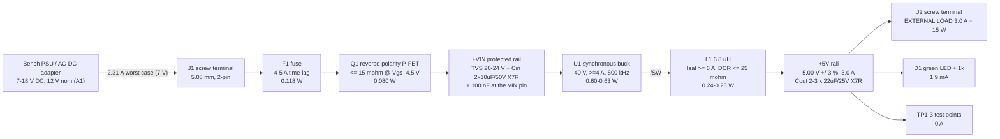

# Power architecture - buck-5v3a

P1 research fragment, `research-power-architect`. Source of record:
`requirements.md` (section 10 "Answers" is binding). Machine twin:
`research/power.json`.

This board **is** the power stage. The rail tree is one line long; the
engineering is the energy and thermal budget, which is what this document is.
No part numbers here - component classes only (part-sourcer owns parts).

> **CORRECTION NOTICE (2026-08-09, P2 revisit).** Section 4 of this document was
> written on a FALSE PREMISE: that U1 has an exposed thermal pad with a 3x3 via
> array under it. `reports/u1-land-ruling.md` refuted that with vendor evidence -
> the AP63356QZV-7 (V-DFN3020-13/SWP) has **9 lands and NO exposed pad**; the heat
> exits are the **VIN land and the GND land**. Section 4 has been rewritten
> accordingly and the old text is preserved inline, struck through as SUPERSEDED,
> so the removed assumption is visible rather than silently gone. The full
> recomputation is `reports/thermal-recheck.md`. Sections 1-3 and 5-9 are
> unaffected by the EP question, but note that section 3's loss table was already
> superseded at P2 by `architecture/power_tree.md` s3 (real 74/40 mohm RDS(on):
> U1 = 0.881 W, board = 1.483 W at the 7 V corner).

## 0. Headline

1. **4 layers are kept, but the deciding number is no longer junction
   temperature.** (CORRECTED 2026-08-09.) At the **7 V low-line corner** the gate
   model gives T_j = **95 C on 4L** and 115 C on 2L, but a first-principles
   recomputation puts the real 4L-vs-2L gap at only **~3 C** on a 2 oz-outer
   board - the 0.5 oz inner planes are just 18 % of the board's copper. Four
   layers now stand on the **unbroken In1 GND return plane under the hot loop**
   (DS41948 layout rule 6 + buck.md s3) and on the P8 gate, not on T_j.
   `reports/thermal-recheck.md` s6.
   *(Superseded text: "4 layers are required ... Recommended part class: T_j ~ 91 C
   on 4L, ~109 C on 2L. Mainstream 3 A-class part: ~121 C on 4L, ~152 C on 2L
   (over the 150 C absolute max). Only 4L + low-RDS(on) leaves margin." - the
   <= 90 mohm part filter was deleted at P2 for rejecting the whole real
   shortlist; the real part is 74/40 mohm and passes.)*
2. **The regulator's RDS(on) is a thermal decision, not a cost decision.**
   `RDS(on)_HS + RDS(on)_LS <= 90 mohm typ @25 C` is the selection filter; it is
   worth ~0.55 W and ~30 C of junction temperature against the 95/66 mohm parts.
3. **Efficiency 92.6 / 93.6 / 93.6 %** at 7 / 12 / 18 V in, 3 A out. Board loss
   **1.20 / 1.03 / 1.03 W**. Input power 16.0-16.2 W, input current **2.31 A**
   worst case.
4. **Input-cap RMS ripple peaks at 1.51 A at Vin = 10 V - inside the window**,
   not at either end (I_rms maximises at D = 0.5). Ceramics must be **X7R**: the
   board's own hotspot is ~90 C and X5R stops at 85 C.
5. **Output ripple is a non-problem** (~10 mV modelled vs a 50 mV budget). The
   real output-cap question is the load transient of an unknown external load.
6. **The 4 A fuse (A5) is thermally marginal**: SMD fuses derate ~30 % at
   85-95 C, giving ~2.8 A effective against 2.31 A operating. 5 A time-lag
   recommended - see OPEN 2.

## 1. Rail tree

There are no on-board consumers worth budgeting: the load is external
(3.000 A, stated + bounded by A2), the power LED is 1.9 mA, and the regulator's
own bias is 24 uA. Everything below is about what the board turns into heat.

## 2. Topology and operating points

| Item | Choice | Tradeoff (one line) |
|---|---|---|
| Conversion | Integrated-FET **synchronous** buck | Required by spec; also the only topology that fits the thermal budget - an async catch diode would add ~1.0 W at low line (0.5 V x 3 A x (1-D)). |
| Switching freq | **400-600 kHz** (design at 500 kHz) | Lower f = less switching loss and a smaller thermal problem; higher f = smaller L. At 500 kHz t_on at 18 V is 556 ns, far above the 75-108 ns minimum on-time; an MHz-class part would trade the 18 V corner and ~0.2 W of heat for board area we do not need to save. |
| Reverse polarity | Series **P-FET** (A4) | 0.080 W vs ~1.1 W for a Schottky; costs 2 extra parts (gate resistor + zener). Settled by A4. |
| Fuse | SMD **time-lag**, input side (A5) | One-shot; protects against a shorted FET/cap, not against output overload (the regulator's hiccup limit does that). |
| Output regulation | **Fixed 5 V** part preferred over adjustable | A fixed part meets A3's +/-3 % on its own (class reference: -1.5/+1.5 % over 7-36 V, 1 A to max load). An adjustable part stacks divider tolerance on a +/-1.5 % reference - needs 0.5 % resistors to stay inside. buck.md s4 FB trap applies. |

Operating points at 3 A out (D = Vout/Vin, L = 6.8 uH, f = 500 kHz):

| Vin | D | Inductor ripple | Peak I_L | Input current |
|---|---|---|---|---|
| 7 V | 0.714 | 0.42 A (14 %) | 3.21 A | 2.31 A |
| 12 V | 0.417 | 0.86 A (29 %) | 3.43 A | 1.34 A |
| 18 V | 0.278 | 1.06 A (35 %) | 3.53 A | 0.89 A |

Duty and input current agree with the P0 digest of the sibling run
(`boards/sbuck-5v3a/log/P0-digest.md`: D = 0.71/0.42/0.28, Iin = 2.44/1.42/0.95
at an 88 % efficiency floor) - that run assumed a worse efficiency, which is
why its input currents are ~6 % higher.

## 3. Loss breakdown at the three line corners (3 A out)

Model inputs, all stated so they can be challenged:

- **RDS(on)** 45 mohm HS / 20 mohm LS typ @25 C (Diodes AP64500 class, DS41979),
  scaled **x1.35** for a ~110 C junction (+0.4 %/C, class typical).
  P_cond = Io^2 x [D x R_HS + (1-D) x R_LS]; the ripple term (dI^2/12) adds <1 %.
- **Switching** 0.5 x Vin x Io x (tr+tf) x f with tr+tf = 15 ns at 500 kHz.
- **Gate + IQ + dead-time + Coss + unmodelled** = 0.09 W flat. Dead-time loss is
  tiny for this class (LMR33630 SNVSAN3F: t_D = 2 ns -> ~4 mW).
- **Inductor** DCR 22 mohm; core loss estimated at 0.04/0.06/0.08 W (rises with
  ripple). **Fuse** 22 mohm cold. **P-FET** 15 mohm. **Cin** ~4 mohm bank ESR.
- **Copper + screw-terminal contacts**: ~8 mohm in the input path, ~9 mohm in the
  output path + GND return (2 mohm/contact, 1 oz pours at the widths of s7).

| Loss term | 7 V in | 12 V in | 18 V in |
|---|---|---|---|
| Regulator conduction | 0.461 W | 0.370 W | 0.328 W |
| Regulator switching | 0.079 W | 0.135 W | 0.203 W |
| Regulator gate/IQ/misc | 0.090 W | 0.090 W | 0.090 W |
| **Regulator subtotal** | **0.630 W** | **0.595 W** | **0.621 W** |
| Inductor DCR | 0.198 W | 0.199 W | 0.200 W |
| Inductor core | 0.040 W | 0.060 W | 0.080 W |
| Reverse-polarity P-FET | 0.080 W | 0.027 W | 0.012 W |
| Fuse | 0.118 W | 0.039 W | 0.017 W |
| Cin ESR (1.36/1.48/1.34 A rms) | 0.007 W | 0.009 W | 0.007 W |
| Cout ESR | ~0 W | ~0 W | ~0 W |
| Copper + terminal contacts | 0.127 W | 0.098 W | 0.090 W |
| **BOARD TOTAL** | **1.200 W** | **1.028 W** | **1.027 W** |
| Pin / efficiency | 16.20 W / **92.6 %** | 16.03 W / **93.6 %** | 16.03 W / **93.6 %** |

Reading of the table:

- **Low line is the worst corner.** Conduction loss scales with D (0.46 W into
  the FETs at 7 V) and input current is 2.6x the high-line value, which triples
  the P-FET and fuse loss.
- Switching loss triples from 7 V to 18 V while conduction falls by as much, so
  the regulator's own dissipation is nearly flat (0.60-0.63 W). The *board* loss,
  not the IC loss, is what makes low line the worst thermal case.
- Everything outside the regulator sums to 0.41-0.57 W - not noise: it raises the
  local ambient the regulator sits in (s4).
- Substituting a mainstream 95/66 mohm 3 A-class part makes the regulator
  subtotal **1.21 / 1.15 / 1.15 W** and efficiency ~88-89 % - the difference
  between passing and failing the thermal case.

## 4. Thermal: junction temperature at 50 C ambient, no airflow

**REWRITTEN 2026-08-09 (P2 revisit).** The version below is the corrected
analysis for a part with **no exposed pad**. The original s4.1-4.4 is preserved
verbatim at the end of this section under "SUPERSEDED s4 (EP assumption)".
Full working: `reports/thermal-recheck.md`.

### 4.1 theta_JA - three figures, and the ruling between them

| Source | Value | Standing |
|---|---|---|
| DS41948 p.4, Note 6 (FR-4, four-layer, 2 oz copper, minimum recommended pad layout) | **25 C/W** | Correct for Note 6's board; **unreachable on ours**. Optimistic bound only. |
| Repo `check_thermal.py`, >= 4 copper layers, pour saturated | **51.1 C/W** | **The design and gate number.** |
| First-principles recomputation (thermal-recheck.md s3), 12 vias | **~36 C/W** (32-41 over h = 20-40 W/m^2K) | Best physical estimate. Not a gate input. |
| Repo model, 2 copper layers, pour saturated | 73.8 C/W | A **1 oz** 2-layer calibration (`MODEL_2L` docstring) applied to a 2 oz board - pessimistic by ~2x, see s4.3. |

**Ruling: 51.1 C/W.** Not by preference - by construction. `check_thermal`
derives theta_JA from the board (heatsink-net copper within a 14.3 mm reach,
capped at 645 mm^2, plus a boolean layer count), so any 4-layer build with GND
planes saturates and scores **exactly 51.1 C/W**. `constraints.json` carries
only `power_w`, `dt_c`, `net` and `min_vias`; it cannot move theta.

The datasheet's 25 C/W is rejected as a design input because Note 6's board is a
JEDEC-class 2s2p coupon - 5806-8710 mm^2 with **1 oz inner planes** - against our
2000 mm^2 with 0.5 oz inners. The dominant difference is **board area, not copper
weight**: the same first-principles model that gives ~36 C/W on our board
reproduces **24.6-26.3 C/W** on the JEDEC geometry, and swapping only the inner
copper there moves it ~2 C/W.

51.1 C/W is ~1.4x the best estimate, and that pessimism is load-bearing: running
the first-principles model with the *other* 0.60 W of board loss also injected
gives an effective **44-58 C/W** at U1's junction, which brackets 51.1.
**Therefore the separate "+10 C for neighbour heating" allowance (old s4.2, and
`architecture/stackup.md` s2.4) is DOUBLE COUNTING and is retired.** T_j at the
7 V corner is ~95 C, not ~105 C.

### 4.2 Junction temperature at the worst corner

P_IC = **0.881 W** at 7 V in / 3 A out / 50 C ambient (`power_tree.md` s3, real
RDS(on) 92/48 mohm at ~105 C). Constraint value 0.95 W adds ~8 % for the
unpublished RDS(on) spread and tr/tf.

| Basis | theta_JA | T_j at 50 C ambient |
|---|---|---|
| **Gate (`check_thermal`, 4L), 0.881 W** | 51.1 | **95.0 C** |
| Gate, 0.95 W (the constraint) | 51.1 | 98.6 C |
| First-principles, h = 30, 12 vias, incl. the other 0.60 W | 43.9 eff | **88.7 C** |
| First-principles, h = 20, 12 vias, incl. the other 0.60 W | 58.0 eff | **101.1 C** |
| Same board on 2 layers, gate | 73.8 | 115.1 C |

Against the part's own limits: **TJ 150 C recommended operating max -> 55 C of
margin; TJ 170 C absolute max -> 75 C.** The 105 C figure is a SOFT design target
(H1-d), not a filter, and it is met with 10 C. Nothing here is close.

Sensitivity: DS41948 publishes **no maximum RDS(on)**. At 1.3x typ, P_IC goes to
~1.10 W -> 56.2 C rise -> **T_j ~106 C**: still 44 C under the recommended max,
but it would trip the P8 gate at `dt_c` 55. That is the intended behaviour.

### 4.3 Why 4 layers - the honest version

The two mechanisms claimed in the old s4.3 do not survive contact with the real
part and the real stackup:

1. **"Via path length."** There is no exposed pad, so there is no EP via array.
   Vias in the GND pour are worth ~**5 C/W in total** (0 -> 12 vias: 46.1 ->
   40.8 C/W at h = 20), and the first four buy most of it. The old "9 vias =
   2.4 C/W vs 19.6 C/W, ~11 C free" arithmetic compared a via bundle against
   nothing, ignoring that the 2 oz top pour couples into In1 through 0.43 mm of
   prepreg over its whole area in parallel with the vias.
2. **"Spreader area."** With 2 oz outers the board is already near-isothermal at
   two layers: the two 0.5 oz inner planes add 0.030 mm of copper against
   0.140 mm on the outers - **18 % more lateral sheet conductance**, not double.

Recomputed 4L-vs-2L gap: **~3.3 C/W, i.e. ~3 C of junction temperature** (40.8 vs
44.1 C/W at h = 20). A 2-layer build would sit at T_j ~92-104 C, inside the part's
150 C recommended max. **The junction temperature does not require four layers.**

**Four layers are kept anyway, for reasons the EP refutation does not touch:**
the solid, unbroken In1 GND return directly under the Cin -> VIN -> GND loop of a
450 kHz / 3.6 A-peak converter (buck.md s3; DS41948 layout rule 6 asks for GND on
the 2nd and 3rd layers by name), and the fact that a 2-layer build fails
`check_thermal` by construction. The **2 oz outer** choice is now more important
than P2 thought, not less: outer copper is 82 % of this board's lateral spreading
and it is the layer the die actually touches.

Stackup unchanged: **4 layers, JLC04162H-7628A, 2 oz outer / 0.5 oz inner**;
F.Cu components + hot loop + /SW + pours, **In1 = solid GND**, **In2 = GND again**,
B.Cu = GND pour clear of SMT (A11).

### 4.4 Copper and via prescription for U1 (no exposed pad)

The heat exits are the **GND land** (pad 8, 1.500 x 0.750 mm) and the **VIN land**
(pad 1, same size) - DS41948 p.25 rules 7-8 and Figure 47. Full rationale and the
review checklist are in `reports/thermal-recheck.md` s8.

- **>= 12 GND vias, 0.55 mm pad / 0.30 mm drill, through (F.Cu -> B.Cu)** so each
  picks up In1, In2 and B.Cu. Not the 0.45/0.20 rule-class minimum: a 0.30 barrel
  is 50.9 C/W to In1 against 79.9 C/W for a 0.20 barrel.
- **>= 8 of them within 2.0 mm of the GND land edge**, all 12 within **4.0 mm of
  the U1 centroid**, as a ~1.0 mm-pitch field in the top GND pour immediately
  outboard of the land (not below 0.85 mm pitch - 0.55 mm pads at 0.1016 mm
  clearance need 0.65 mm, and the pour must stay connected between them).
- **NO via-in-pad on the GND land.** Two in-pad vias are worth ~0.2 C/W and would
  put open 0.30 mm holes in the part's only thermal and mechanical joint. Allowed
  only if resin-plug-and-cap (JLC POFV) is separately ordered at P10; not
  recommended. Rules 7/8 say "around" the pins, and at 0.88 W that reading wins.
- **>= 60 mm^2 of contiguous F.Cu `+VIN` pour joined to the VIN land**, over
  unbroken In1 GND. This substitutes for rule 8: the board has **no VIN plane**
  (rule 6 puts GND on In1 and In2, and that outranks rule 8 on a single-rail
  converter), so the VIN land's only exit is lateral 2 oz copper then 0.4284 mm of
  prepreg into In1. `+VIN` stays **via-free** (check_current's net-wide via rule).
- **>= 200 mm^2 of contiguous F.Cu GND pour joined to the GND land.**
- **In1/In2 solid GND, unbroken under U1 and the whole hot loop**; no signal, no
  `+5V`, no split within **6 mm** of the U1 centroid. B.Cu GND pour under U1.
- Keep **L1 8 mm from U1** and **F1 15 mm** (already in `constraints.json`); fuse
  ratings derate ~30 % hot.
- **No aluminium electrolytic anywhere.** The board runs 75-87 C (recomputed;
  the old "~90 C" figure was pessimistic but drew the same conclusions). X5R's
  85 C ceiling is still disqualifying and the fuse still derates.
- Bench verification: DS41948 publishes **no psi_JT**, so `T_j = T_top + psi_JT x P`
  cannot be run as written. Use a case-top thermocouple plus theta_JC = 5 C/W as
  an upper bound on the die-to-case delta (+4.4 C at 0.881 W).
- **No gate tests any of the above.** `check_thermal` returns the identical
  51.1 C/W / 48.6 C result on a board stripped of every thermal via AND the entire
  top GND pour (machine-verified, thermal-recheck.md s4). P6/P7 review is the only
  enforcement.

---

### SUPERSEDED s4 (EP assumption) - kept for audit

*Everything between here and section 5 was written assuming an exposed pad with a
3x3 via array. It is WRONG about the mechanism and about the 4L-vs-2L margin; its
gate numbers (51.1 / 73.8 C/W) happen to be unchanged. Do not design from it.*

#### 4.1 theta_JA - what number, and where it comes from

| Source | Value | Condition |
|---|---|---|
| TI LMR33630 SNVSAN3F thermal table, HSOIC-8/DDA | **42.9 C/W** | JESD51-7, simulated **4-layer JEDEC board** (76.2 x 114.3 mm). TI states verbatim that this value "can not be used for design purposes". |
| same table | RthetaJC(bot) **4.3 C/W**, psi_JT **4.3 C/W**, RthetaJB 13.6 C/W | useful for bench verification, see 4.4 |
| repo `check_thermal.py` calibrated model, >= 4 copper layers, pour saturated (>= 645 mm^2 within a 14.3 mm radius) | **51.1 C/W** | 4-layer, planes; ~19 % worse than the JEDEC board, consistent with our board being 4.4x smaller |
| same model, 2 layers, pour saturated | **73.9 C/W** | 1 oz, bottom pour |

I use the repo model's **51 C/W (4L)** and **74 C/W (2L)** as the design
numbers - they are the ones P8 will apply, and they are the pessimistic side of
the JEDEC anchor, which is correct for a 50 x 40 mm board. Every number in this
section carries the model's stated +/-30 %.

#### 4.2 Junction temperature, both stackups, both part classes

T_j = 50 C ambient + P_IC x theta_JA + ~10 C for neighbour heating (the other
0.40-0.57 W of board loss raises the local air/board the regulator sees; theta_JA
assumes the rest of the board is at ambient, which it is not).

| Case | P_IC (7 V corner) | 2 layers | 4 layers |
|---|---|---|---|
| Recommended class (45/20 mohm) | 0.63 W | 96.6 + 12 = **~109 C** | 82.1 + 9 = **~91 C** |
| Mainstream 3 A class (95/66 mohm) | 1.21 W | 139.5 + 12 = **~152 C** | 111.7 + 9 = **~121 C** |

Against the targets: requirements s3 assumes a **105 C** derated hotspot; the
class absolute maximum is **150 C** with thermal shutdown at ~165 C, and TI
notes that operating above **125 C** "degrades the lifetime of the device".

- 2L + mainstream part: **fails outright** (over absolute max).
- 2L + best part: 109 C - over the 105 C target, under the 125 C knee, and with
  no margin for the RDS(on) max spec (~1.7x typ), which alone passes 125 C.
- 4L + mainstream part: 121 C - at the lifetime knee, no margin.
- **4L + <= 90 mohm class: ~91 C, 14 C under the target.** Recommended.

As ambient headroom, the more useful form: the recommended design runs at
**T_j = T_amb + 41 C** and hits the 125 C knee at an **83 C** ambient (33 C of
overshoot, or room for an enclosure). The mainstream part runs at **T_amb +
71 C** and hits 125 C at **54 C** ambient - no margin against the 50 C spec.

#### 4.3 Why 4 layers wins - two independent mechanisms

1. **Via path length.** The exposed pad's thermal vias only have to reach In1 at
   ~0.21 mm depth on a JLC 1.6 mm 4-layer stackup. A 0.3 mm drill, 25 um plated
   via has a barrel cross-section of 0.0236 mm^2, so R = L/(k x A) =
   **22 C/W to In1** vs **176 C/W** for the full 1.6 mm to B.Cu on a 2-layer
   board. Nine vias: **2.4 C/W vs 19.6 C/W**. That is ~11 C of junction
   temperature at 0.63 W, free.
2. **Spreader area.** Two full-area inner planes roughly double the copper inside
   the ~14 mm radius that actually participates (the model's `REACH_MM`), and
   they are unbroken - unlike a 2-layer bottom pour that is also the return path
   and gets cut by the output routing.

Recommended stackup: **4 layers, 1 oz outer / 0.5 oz inner (JLC standard
1.6 mm)**. F.Cu components + hot loop + /SW + the +5V pour; **In1 = solid GND**
(unbroken under U1 and the entire Cin->VIN->GND loop); **In2 = GND again, not
+5V** (the +5V rail travels ~15 mm and needs no plane; a second GND plane is
worth more as thermal mass); B.Cu = GND pour, clear of SMT parts per A11.

#### 4.4 Copper and via prescription for U1

- Exposed-pad land >= EP size, with a **3x3 array of 0.3 mm vias at 1.0 mm
  pitch** (tented on B.Cu; epoxy-filled via-in-pad is not needed at 0.6 W).
- **>= 200 mm^2 of contiguous F.Cu GND pour** joined to that land, plus **>= 3
  more GND vias** in it, for **>= 12 GND vias within 4 mm** of the part.
- In1/In2 GND solid under the part; do not let a signal or the +5V pour cut them.
- Total GND copper within a 14.3 mm radius must exceed 645 mm^2 summed over
  layers - two inner planes satisfy this on their own, so the constraint really
  binds the *top* pour and the via array.
- Keep **L1 >= 5 mm from U1** (0.24-0.28 W, its own hot spot) and put **F1 in the
  coolest corner** near J1 - fuse ratings derate ~30 % at 90 C.
- **No aluminium electrolytic anywhere.** At a ~90 C board temperature a 105 C
  2000 h part lasts ~5.7 kh. Cin/Cout are all-ceramic; any added bulk is polymer.
- Bench verification recipe: measure the case top and use **T_j = T_top +
  psi_JT x P** (4.3 C/W x 0.63 W = +2.7 C) rather than trusting theta_JA.

## 5. Input capacitor - RMS ripple requirement

I_rms(Cin) = sqrt( D x (Io^2 + dI^2/12) - (D x Io)^2 ), maximal at **D = 0.5**,
i.e. **Vin = 10 V, inside the operating window** - not at 7 V or 18 V.

| Vin | 7 V | **10 V** | 12 V | 18 V |
|---|---|---|---|---|
| I_rms | 1.36 A | **1.51 A** | 1.48 A | 1.34 A |

(The sibling P0 digest independently derived 1.50 A at Vin = 10 V.)

Requirement: **>= 1.5 A RMS at 500 kHz at 100 C**, X7R or better. The RMS rating
itself is easy for ceramics (1.5^2 x 4 mohm = 9 mW of self-heating); the traps
are the other three:

- **Temperature class**: the board hotspot is ~90 C. **X5R (85 C) is
  disqualified**; use X7R (125 C) or X6S.
- **Voltage rating**: 50 V, for two reasons. DC-bias derating (a 25 V 10 uF 1210
  keeps ~50 % at 12 V; a 50 V part keeps ~75 %), and the hot-plug ring below.
- **Hot-plug ring**: ~1 uH of supply lead against ~13 uF of low-ESR ceramic is a
  0.28 ohm characteristic impedance and rings to ~2x the step - **~36 V from an
  18 V plug-in**. Hence a **20-24 V standoff TVS on +VIN** (after the P-FET, so a
  reverse connection does not short it) clamping <= 33 V, and 40 V-rated silicon.

Sizing: **2 x 10 uF 50 V X7R 1210 + 100 nF 50 V 0603 at the VIN pin**
(~13 uF effective) gives 115 mV of input ripple at the D = 0.5 worst case. Leave
an unpopulated footprint pair for the optional input filter A7 asks room for.

## 6. Output capacitor - 50 mV pk-pk and the transient question

dV_pp = dI x ESR + dI / (8 x f x C). Worst dI = 1.06 A at the 18 V corner.

With **2 x 22 uF 25 V X7R 1210** (~30 uF effective after 5 V DC bias, ~2 mohm):
8.9 mV capacitive + 2.1 mV ESR = **~11 mV** modelled, ~15-25 mV measured at
20 MHz. **Against a 50 mV budget that is settled with 2x margin** - ripple is not
what sizes Cout here. Confirm the value sits inside the chosen part's stated
C/ESR stability window (buck.md s4); internal compensation assumes it.

What does size Cout is the **load transient**, and the load is external and
unspecified. A 0 -> 3 A step against 30-40 uF and a ~40 kHz loop dips the rail
~**300-340 mV (6-7 %)**, outside A3's +/-3 % window if that window is read
dynamically. A3 says "DC accuracy", so the steady-state reading is defensible -
the cheap hedge is one **100 uF polymer at J2** (135 uF total -> ~88 mV, 1.8 %),
which also damps the load cable. See OPEN 1.

Inrush is a non-issue the other way: 66 uF through a ~4 ms internal soft-start
draws 82 mA. A large *external* load capacitance is the risk - >1000 uF needs
>1.25 A of extra charging current and can trip the limit into hiccup retry,
which is correct behaviour, not a fault.

## 7. Inductor, protection chain, sequencing

- **L1: 6.8 uH +/-20 %, Isat >= 6 A, DCR <= 25 mohm, shielded composite, 125 C.**
  Isat must beat the part's **peak current limit** (4.5-5.5 A class), not the 3 A
  load (buck.md s2). 6.8 uH holds ripple to 35 % at 18 V; 4.7 uH would need
  ~700 kHz to match, buying nothing and costing switching loss. DCR is real
  money: 22 mohm = 0.20 W = 20 % of the loss budget.
- **Q1 P-FET: RDS(on) <= 15 mohm specified AT Vgs = -4.5 V.** The non-obvious
  one - at the 7 V corner the gate only has 7 V, so a part characterised at -10 V
  may not be in that state. Vds >= -40 V (hot-plug ring), Id >= 6 A, exposed-pad
  SO-8/DFN. Gate: 100 kohm + a 12-15 V zener to hold Vgs inside its -20 V limit
  at 18 V in; optional 10-100 nF gate cap = hot-plug soft-start. Loss 0.080 W at
  2.31 A, inside A4's 100 mW target.
- **F1: time-lag (slow-blow)** so Cin inrush does not open it; 4 A per A5 but see
  OPEN 2; cold resistance <= 25 mohm (0.118 W at low line). Output short and
  overload are handled by the regulator's hiccup limit + thermal shutdown (A5) -
  the fuse only covers a shorted FET or cap.
- **Sequencing: none** (single rail). EN can tie to +VIN (class parts
  auto-start); a 2-resistor EN divider at a ~6.3 V rising threshold is worth
  fitting so the converter does not try to run below its 7 V spec on a slow ramp.

## 8. What the later phases must carry (see power.json)

- `power_constraints`: /VIN, /VIN_F, +VIN at 3.0 A dT 10 (1.80 mm at 1 oz outer -
  the same width carries the fuse's 4 A non-blow current at ~19 C rise); /SW at
  3.5 A dT 20 (1.51 mm, deliberately narrower to keep the switch node small);
  +5V at 3.5 A dT 10 (2.23 mm, = peak inductor current); GND at 3.5 A
  `plane_fed`, declared explicitly so pour necks are errors and not the advisory
  findings the derived-return synthesis would produce.
- **/SW and +5V must have ZERO vias.** check_current's via rule is net-wide: one
  via on a 3.5 A net demands 7 vias in that cluster (LEARNINGS 2026-07-28); a
  via-free pour is also exempt from the pour-neck test. F.Cu only, both nets.
- `thermal_constraints` (CORRECTED 2026-08-09; the live values are in
  `architecture/constraints.json`, which supersedes this fragment): U1 at
  **0.95 W** (0.881 W modelled with the real 92/48 mohm hot RDS(on) + ~8 %),
  `dt_c` **55** (the SOFT 105 C junction target at 50 C ambient - the BINDING
  limit is the part's own 150 C recommended max, i.e. `dt_c` 100), `min_vias`
  **12 in and around the GND LAND - there is no exposed pad**. The old claim that
  this entry "encodes the stackup decision" is withdrawn: 2 layers fail the gate,
  but the real 4L-vs-2L junction-temperature gap is ~3 C (s4.3).
  *(Superseded: "U1 at 0.8 W (0.63 W modelled + 27 % RDS(on) spread) ... 40.9 C
  rise on 4 layers vs 59.1 C on 2 layers".)*
- P6/P7 must add `overrides` for the D1 LED tap and thin test-point stubs once
  placement exists, or every 0.25 mm branch reads as an undersized 3.5 A track.

## 9. OPEN

1. **Load transient profile of the external load** - step size and rate. Ripple
   is met with 2x margin, but a 0 -> 3 A step dips the rail ~300 mV (6 %). Either
   confirm A3's +/-3 % is a DC/line-load-regulation spec only (as written), or
   accept one 100 uF polymer at J2 as the hedge.
2. **Fuse rating: 4 A (A5) or 5 A?** At the 85-95 C local board temperature a 4 A
   SMD fuse derates to ~2.8 A against 2.31 A of worst-case operating current -
   22 % margin, with nuisance-opening risk at the 7 V corner. 5 A time-lag is the
   engineering recommendation; it needs an explicit yes because it relaxes a
   binding answer.
3. ~~**Is <= 105 C junction a hard part-selection filter?**~~ **CLOSED by H1-d
   (2026-08-08): 105 C is a SOFT design target; the binding limit is the part's
   own maximum (TJ 150 C recommended, 170 C absolute).** The <= 90 mohm RDS(on)
   filter this item was defending was deleted at P2 - it rejected the whole real
   shortlist. The chosen AP63356QZV-7 (74/40 mohm typ) lands at T_j 95 C, 55 C
   under the recommended max. See `reports/thermal-recheck.md` s5, s7.
4. **h (combined convection + radiation) is the widest uncertainty left in the
   thermal case**, not the copper: 20 vs 40 W/m^2K moves theta_JA from 40.8 to
   28.3 C/W. Nothing turns on it - every case passes the part's limits - but no
   claim tighter than "T_j is 79-101 C at the 7 V corner" is supportable
   pre-bench.

## Sources

- TI **LMR33630** SNVSAN3F (Nov 2020) - thermal table (RthetaJA 42.9 C/W DDA per
  JESD51-7 on a 4-layer JEDEC board, RthetaJC(bot) 4.3, psi_JT 4.3), RDS(on) DDA
  95/66 mohm typ (160/110 max), fsw 400 kHz "A", t_ON_MIN 75 ns, D_MAX 98 %,
  I_SC 4.5 A typ, t_SS 4 ms, dead time 2 ns, T_SD 165 C, Vout +/-1.5 % at 5 V,
  and the note that operating above 125 C degrades lifetime.
- Diodes **AP64500** (DS41979) - 3.8-40 V, 5 A, SO-8EP sync buck, 45/20 mohm,
  100 kHz-2.2 MHz programmable, 25 uA IQ in PFM. Low-RDS(on) class exemplar; its
  thermal table was NOT read (vendor PDF returns 403) - only the 4-layer/2 oz
  test condition from the summary page.
- Repo `check_thermal.py` calibrated theta_JA model (JEDEC JESD51 / TI SLOA122
  anchors) and `check_current.py` IPC-2152 width table.
- House reference `.claude/skills/ai-ee/reference/topologies/buck.md` (s2 Isat
  rule, s3 hot loop, s4 FB trap and Cout window, s5 SW containment).
- `boards/sbuck-5v3a/log/P0-digest.md` - independent cross-check of D, Iin and
  the 1.50 A Cin ripple peak at Vin = 10 V.
