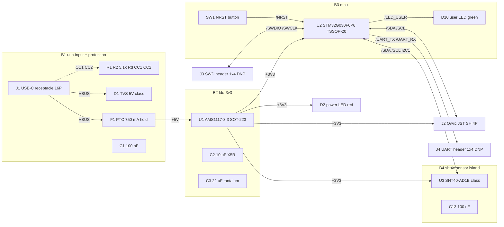

# blocks - g0-sense architecture (P2)

USB-C powered temperature/humidity sensor node. 2-layer, single-sided SMD
assembly (JLC economy PCBA), two unpopulated THT headers. Parts named by
MPN/part-class only; LCSC codes shown are copied from research/*.json (per
research, P3 to confirm) - never from memory.

## Block diagram (signal + power)

## Canonical net names (the schematic MUST produce these)

Global power nets (power symbols, bare names): `VBUS` (connector side of the
PTC), `+5V` (protected node after the PTC), `+3V3`, `GND`. Signal nets
(labels; final netlist form carries the sheet path, e.g. `/main/SDA`):
`CC1`, `CC2` (power sheet); `SDA`, `SCL`, `SWDIO`, `SWCLK`, `UART_TX`,
`UART_RX` (MCU-perspective: UART_TX = MCU transmit = header TX pin), `NRST`,
`LED_USER` (main sheet). D+/D-/SBU1/SBU2 are left UNCONNECTED - they never
become nets. There are NO high-speed nets and NO differential pairs on this
board.

## B1 - usb-input + protection (power sheet)

USB-C receptacle, power only. Lead part: TYPE-C-31-M-12 class 16-pin
receptacle (per research C165948, P3 to confirm) - SMT signal pads with 4
plated THT shield legs; verified on jlcpcb.com as Assembly Process = SMT,
supported in the Economic tier (orchestrator decision). The THT shield legs
are accepted as plated mechanical pegs: shield/GND is also carried on the SMD
GND signal pads, so cold legs do not orphan the shield net (P3 re-verifies
against the exact pinout). Land ALL 4 VBUS and ALL 4 GND contacts ganged;
shield ties directly to GND at the connector with its own vias into the B.Cu
GND pour. CC handling: TWO independent 5.1 kOhm 1% resistors, R1 CC1-to-GND
and R2 CC2-to-GND - never shared, never in series with anything (Pi-4
audio-accessory failure otherwise). D+/D- and SBU float by design.
Entitlement: CC-blind sink = default USB power, budget <= 500 mA.

Protection order on VBUS, connector outward-in: J1 -> D1 (TVS, shunt) ->
F1 (PTC, series) -> +5V. Lead TVS: SMF5.0A (SOD-123, standoff 5.0 V, VBR
6.4 V min, Vc 9.2 V, 200 W) - sub-6 V clamping is NOT required (orchestrator
decision: nothing on VBUS is 6 V-rated; LDO Vin abs max 15 V, caps 16 V+,
PTC 16 V). SMAJ5.0A (SMA, 400 W) is the same-family alternate if area
allows; protection.md's SMA default LOSES to board area here - identical
electricals, and 200 W 10/1000 us is ample for an indoor USB port. Lead PTC:
BSMD0805-075-16V class (750 mA hold / 1.5 A trip / 16 V / 70 mOhm; per
research C976303, P3 to confirm); the rank-1 1206 twin LOSES on Ri (90 vs
70 mOhm eats more LDO dropout margin) and footprint. NO series
reverse-polarity element (orchestrator decision: compliant Type-C cable
cannot reverse polarity; a Schottky's 125-190 mV would consume the entire
AMS1117 dropout margin at the 4.75 V corner). The unidirectional TVS + PTC
already crowbar a genuine bench miswire.

Capacitance vs the Type-C 10 uF attach limit (TC2.0 Table 4-3), resolved by
research/power.md and BINDING for P3/P4/P6: ahead of the PTC, on VBUS at the
connector, ONLY C1 = 100 nF lives. The 10 uF bulk (C2) lives AFTER the PTC
at the LDO VIN pin, on +5V. Total effective at the receptacle ~6-8 uF
(DC-bias derated) + 0.1 uF < 10 uF. Any larger bulk (C3 22 uF) lives on
+3V3 behind the LDO where the limit does not apply.

## B2 - ldo-3v3 (power sheet)

Lead part: AMS1117-3.3, SOT-223, JLC Basic (orchestrator decision; per
research C6186, P3 to confirm). Governing thermal design point is the
brief's literal >= 300 mA rated case: P = (5.0 - 3.3) x 0.3 = 0.51 W at
40 C ambient - NOT the ~150 mA realistic load (the Qwiic port is user-facing
and unfenced; the 750 mA PTC does not protect the LDO from a 300-500 mA
overload). SOT-223 tab = VOUT: heat spreader is a TOP-side +3V3 pour of
~600-1000 mm^2 tied to the tab (B.Cu stays GND - no back-side spreading, no
thermal vias demanded). That yields theta-JA ~60-70 C/W -> Tj ~71-76 C
rated case, <= ~115 C even at 500 mA entitlement abuse; even footprint-only
copper (90 C/W) holds 86 C. Caps per datasheet: C2 = 10 uF X5R at VIN
(+5V); C3 = 22 uF TANTALUM-CLASS on +3V3 - the AMS1117 datasheet explicitly
requires >= 22 uF solid tantalum for stability; a plain low-ESR ceramic is
NOT the datasheet's endorsed path (orchestrator decision; P3 line item).
Dropout arithmetic (research/power.md s7): regulates at every honest corner
(4.75 V source min leaves +0.11 V at max-dropout); the stacked-pessimistic
4.5 V-at-board corner sags gracefully to ~3.16 V, inside every consumer's
range. Iq 5-11 mA is irrelevant (no battery). Rejected: AP2112K (Tj ~134 C
at rated case, no copper fixes a SOT-23-5), RT9013 clone (0.51 W > its own
300 mW Pd rating), TLV70233 (0.51 W > TI's own ~425 mW allowable at 40 C).

## B3 - mcu (main sheet)

Lead part: STM32G030F6P6, TSSOP-20 (brief-named; per research C724040, P3 to
confirm; pin-compatible fallback STM32G031F8P6). Internal HSI16, no crystal.
VDD/VDDA bonded on pin 4, VSS/VSSA on pin 5, no separate VREF+ ->
decoupling is ONE pair: C10 = 100 nF + C11 = 4.7 uF tight to pins 4/5.
NRST (pin 6): internal pull-up; C12 = 100 nF + SW1 momentary button to GND -
exactly ST's recommended network, do NOT oversize the cap. SW1 lead part:
TS-1187A-B-A-B class 5.1x5.1 mm JLC Basic (orchestrator decision; per
research C318884, P3 to confirm) - placement analysis accepts it: it sits
mid-board next to the MCU where 5.1 mm costs nothing; NOT overruled. BOOT0:
R13 = 10 kOhm pull-down on PA14 (pin 19, shared with SWCLK), POPULATED.
REVISED at the P2 coverage exit: the earlier "no strap needed" reasoning
rested on the factory option bytes (nBOOT_SEL=1, nBOOT0=1) making the pin
ignored, and a fresh second reader REFUTED that record - the only source for
it is a community.st.com forum page, and RM0454/AN2606 cannot be acquired
(st.com times out from this container). So the board is made correct under
EITHER option-byte state instead of relying on one: the pull-down holds
BOOT0 = 0 at reset, which boots main flash whatever nBOOT_SEL says. It costs
one 0402 and loads SWCLK with 330 uA, negligible against any debugger's
push-pull driver, and pulls the same direction as the datasheet-confirmed
internal pull-down on PA14 in debug mode. UART bootloader entry, if ever
wanted, is still a pure option-byte rewrite over SWD; the UART header on
PA2/PA3 is already the bootloader's own USART pins.

Canonical pin map (sanity-checked against the DS12991 Table 12 transcription
in research/refdesign-stm32g030-minimal.md - adopted unchanged, no conflicts,
9 of 20 pins used):
pin 4 VDD/VDDA, pin 5 VSS/VSSA, pin 6 NRST, pin 9 PA2 = USART2_TX ->
/UART_TX, pin 10 PA3 = USART2_RX -> /UART_RX, pin 12 PA5 = user LED GPIO ->
/LED_USER, pin 16 PA9 = I2C1_SCL -> /SCL, pin 17 PA10 = I2C1_SDA -> /SDA,
pin 18 PA13 = SWDIO, pin 19 PA14 = SWCLK / BOOT0 (10k pull-down R13). SWDIO/SWCLK
need no external resistors (silicon pulls at reset). PA9/PA10 are FT_f:
5 V-tolerant, Fm+-capable, open-drain in I2C AF - correct for the shared
Qwiic bus. User LED D10: green 0603 KT-0603G class (orchestrator decision;
per research C12624, P3 to confirm), R12 = 220 Ohm -> 0.9-3.2 mA over the
2.6-3.1 V Vf bin spread (design point ~2 mA; green at >= 1 mA is clearly
visible; the thin headroom is accepted and flagged for P3 value check).

## B4 - sht4x sensor island (main sheet)

Lead part: SHT40-AD1B-R2 class, DFN-4 1.5x1.5 mm, I2C addr 0x44 (per
research C2909890, P3 to confirm). C13 = 100 nF tight to VDD/GND. Die pad
NOT soldered, per Sensirion. Thermal isolation is the load-bearing layout
requirement (copper conduction is the dominant self-heating path; 1 C error
-> ~5 %RH error at high RH): sensor on its own copper island at the board
edge OPPOSITE the LDO/MCU end, >= 8 mm from U1 and U2 body outlines
(constraints.placement.separation - checker-testable), NO copper pour under
or through the island (P7: void both F.Cu and B.Cu pours there), the four
connecting traces (VDD/GND/SDA/SCL) necked to fab-minimum width, and a
milled U-slot around the island's inboard sides where the outline allows
(P6 earns the geometry). Aperture faces up, open air on 2-3 sides; nothing
tall over it. Heater (75 mA peak, <= 10 % duty) IS budgeted in the rail
tree (orchestrator decision). VDD slew <= 20 V/ms at power-up: verify the
AMS1117 startup ramp at P3/P4 (current-limit worst case computes ~68 V/ms
into 22 uF but real bandgap-limited startup is slower - open verify item).
ASSEMBLY RULE FOR P9/P10 (Sensirion FORBIDS board wash): no-clean paste,
NO post-assembly board wash, no vapor-phase reflow, no hand rework of the
sensor - must land verbatim in the fab/assembly notes and JLC order remarks.

## I2C bus + Qwiic (main sheet)

One I2C bus (I2C1, /SDA + /SCL) shared by U3 and J2. Pull-ups R10 = R11 =
1.5 kOhm to +3V3, placed ONCE on this board near the MCU (the I2C host),
sized for on-board bus + ~0.5 m Qwiic cable leg + one downstream device.
REVISED at the P2 coverage exit from the 2.2 kOhm the P1 fragment proposed:
a fresh second reader refuted that value against its own budget. UM10204
Eq 1 at tr = 300 ns (Fast mode) gives Rp(max) = 354 / Cb[pF] kOhm, so the
ceiling is 2.36 k at 150 pF but only 1.77 k at 200 pF - 2.2 k needs
Cb <= 161 pF and misses the rise time over most of the declared budget.
1.5 kOhm holds the ceiling out to 236 pF and clears both floors (967 Ohm
from UM10204 Table 10 at 3.3 V / 3 mA sink, 390 Ohm from SHT4x Table 4).
Value independently recomputed by a second reader before adoption. The SHT4x datasheet's 10 k typical LOSES: it
assumes no cable budget and fails the rise-time ceiling once the Qwiic leg
loads the bus (research/refdesign-sht4x.md arithmetic). J2 lead part:
SM04B-SRSS-TB class JST SH 1.0 mm 4P horizontal (per research C160404, P3 to
confirm) - genuine JST wins over the 5x-cheaper clones because the exact
KiCad footprint ships in the library and the per-run cost delta (~$0.85
across 5 boards) is noise; P3 may swap to a clone only with a dimension
check. Qwiic pinout: GND, 3V3, SDA, SCL per the standard. Downstream
reserve: 100 mA on +3V3 (orchestrator decision).

## Headers + indicators

J3 SWD 1x4 0.1 in THT, DNP (plated holes only, hand-soldered by owner):
pin 1 GND, pin 2 3V3, pin 3 SWDIO, pin 4 SWCLK (requirements' ASSUMED order
made canonical; no vendor 4-pin standard exists - silk-mark pin 1). J4 UART
1x4 0.1 in THT, DNP: pin 1 GND, pin 2 3V3, pin 3 TX (MCU transmit), pin 4
RX (MCU receive). Same GND-at-pin-1 convention on both, silk-labeled per
pin. Lead DNP BOM reference: PZ2.54 1x4 class (per research C32713270).
D2 power LED: red 0603 KT-0603R class JLC Basic (orchestrator decision; per
research C2286, P3 to confirm) on +3V3 (indicates the rail the logic runs
on - power.md s8 recommendation adopted), R3 = 620 Ohm -> 1.5-2.4 mA over
the Vf bin spread. Mounting: four M2 holes H1-H4, CONDITIONAL (see
constraints/decisions for the concrete "hurting" test P6 applies).
