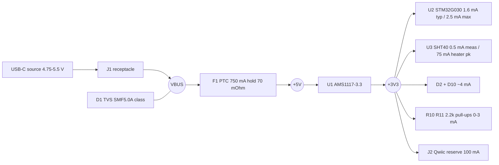

# power tree - g0-sense (P2, reconciled)

Lifted from research/power.json + power.md and reconciled against the final
block choices (AMS1117-3.3 / SMF5.0A / BSMD0805-075 class / green user LED).
No changes of substance were needed - the P1 power fragment already assumed
the recommended parts; numbers below are the binding set.

## Rails

Net semantics: `VBUS` = connector side of the PTC (D1 TVS + C1 100 nF live
here, nothing else); `+5V` = protected node after the PTC (U1 VIN + C2 10 uF
live here); `+3V3` = regulated rail (C3 22 uF tantalum + all consumers);
`GND` single ground, deliberately NOT declared as a power entry.

## +3V3 budget (every number cited in research/power.md s2)

| Consumer | Typ | Peak |
|---|---|---|
| U2 STM32G030F6P6, HSI16 Range 1 | 1.6 mA | 2.5 mA |
| U3 SHT40 (no heater) | ~0 (2.4 uA avg) | 0.5 mA |
| U3 heater (<= 10 % duty, firmware-optional, BUDGETED) | 0 | 75 mA |
| D2 + D10 LEDs at ~2 mA design point | 4 mA | 4 mA |
| I2C pull-ups 2x 2.2k | ~0 | 3 mA |
| Qwiic downstream reserve (owner decision) | 100 mA | 100 mA |
| Sum | ~106 mA | 185 mA |
| +30 % headroom -> design current | | 240 mA |

Declared rail current: 0.30 A (the brief's LDO floor, >= the 0.24 A design
point - free copper margin).

## VBUS draw vs the CC-blind 500 mA entitlement

Worst steady case (heater + meas + Qwiic + LEDs + bus low + AMS1117 Iq max
11 mA): 196 mA = 39 % of entitlement. Design point 251 mA = 50 %. Fits with
>= 2x margin at every corner. Total input power ~0.98 W true peak.

## Copper sizing (constraints.json `power`, IPC-2152 via check_current)

| Net | current_a | dt_c | 1 oz width | Why |
|---|---|---|---|---|
| VBUS | 1.5 | 10 | 0.80 mm | PTC trip dwell: fault current traverses J1->F1 for seconds before trip |
| +5V | 1.5 | 10 | 0.80 mm | same fault current traverses F1->U1 |
| +3V3 | 0.3 | 10 | ~0.16 mm | LDO rating floor; routed wider for free |

GND is not listed (canon: a GND power entry demands full-budget vias in
every GND cluster); the B.Cu GND pour carries the return.

## Thermal (constraints.json `thermal`)

U1: 0.51 W governing rated case (300 mA sustained, Vin 5.0 V, 40 C ambient),
net +3V3 (SOT-223 tab = VOUT), dt_c 45 -> Tj <= ~85 C target. Copper need:
tie the tab into ~600-1000 mm^2 of TOP-side +3V3 pour (reaches ~60-70 C/W).
B.Cu stays GND; no back-side spreading, no min_vias demand. Realistic-load
case 0.26 W and entitlement-abuse case ~0.83 W (Tj <= ~115 C, still
regulating) bracket it. Transient heater peak (0.31 W, <= 10 % duty) is
bounded by the DC rows.

## Capacitor placement rule (Type-C 10 uF attach limit - BINDING)

- VBUS (ahead of PTC, at connector): C1 = 100 nF ONLY.
- +5V (after PTC, tight to U1 VIN): C2 = 10 uF X5R (effective 6-8 uF).
- +3V3 (after LDO): C3 = 22 uF tantalum-class (datasheet stability
  requirement) + all point-of-load 100 nF / 4.7 uF caps.
- Total effective at receptacle ~6-8 uF + 0.1 uF < 10 uF: compliant.

## Dropout chain (worst honest corner)

VBUS 4.75 V (source min) - PTC 17-43 mV - AMS1117 max dropout (1.3 V held
from the 0.8 A column, conservative at our 0.24 A): margin +0.11 V at the
stacked max corner, +0.31 V typ. Interlock honored: NO series reverse
element anywhere in the chain (its drop would erase this margin).

## Sequencing / inrush

Single rail, no sequencing consumers. Attach inrush: <= ~8 uF effective
through cable + PTC, inside any compliant source's soft-start; PTC (1.5 A
trip, seconds dwell) cannot trip on it. Verify at P3/P4: SHT4x VDD slew
<= 20 V/ms vs AMS1117 startup ramp (open item, carried in decisions.md).
