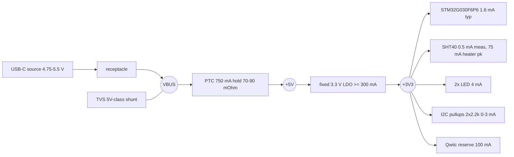

# power - rail tree and budgets (g0-sense)

P1 power-architect fragment, 2026-08-27. Inputs: `requirements.md` plus the
P1 fragments `ldo`, `protection`, `connectors`, `mcu-sensor`,
`interface-usbc-power-sink`, `refdesign-sht4x`, `refdesign-stm32g030-minimal`.
Machine-readable half: `power.json`. Every current below is traced to a
fragment or the datasheet it cites; no bare totals.

Hard inputs designed inside (not re-litigated): CC-blind sink -> legal VBUS
entitlement <= 500 mA total (interface-usbc-power-sink rows 4/5); 100 mA
reserved for downstream Qwiic devices (recorded owner-delegated decision,
requirements.md OQ2); indoor 0-40 C ambient (recorded decision).

## 1. Rail tree

Net naming: `VBUS` = connector side of the PTC (TVS + 100 nF live here);
`+5V` = protected node after the PTC (LDO input + its 10 uF live here);
`+3V3` = regulated rail; `GND` single ground. GND is deliberately NOT a
power entry (canon: full-budget via demands in every GND cluster otherwise).

## 2. +3V3 consumer budget (every number cited)

| Consumer | Typ | Peak | Source |
|---|---|---|---|
| STM32G030F6P6, HSI16 Range 1, flash | 1.6 mA | 2.5 mA (85 C max col) | DS12991 Rev3 Table 25 via `mcu-sensor.md` s1 |
| SHT40 (no heater) | 2.4 uA avg @1 meas/s | 0.5 mA (measuring) | SHT4x DS Table 3 via `mcu-sensor.md` s2 |
| SHT40 heater (firmware-optional) | 0 (<=10% duty by DS rule) | 75 mA | SHT4x DS s4.9 via `refdesign-sht4x.md` s6 |
| LEDs: user + power, 2 mA design each | 4 mA | 4 mA | KT-0603 family Vf/Iv via `connectors.md` s5; 2 mA is this fragment's design point (red ~30-45 mcd @2 mA = clearly visible) |
| I2C pull-ups 2x 2.2k (SDA, SCL) | ~0 (bus idles high) | 3 mA (both lines low; 3.3/2.2k = 1.5 mA each) | pull-up value from `refdesign-sht4x.md` s2 |
| Qwiic external devices (reserve) | 100 mA | 100 mA | owner-delegated decision (requirements.md OQ2) |
| **Sum** | **~106 mA** (Qwiic fully drawn; ~6 mA with nothing plugged in) | **185 mA** | |
| **+30% headroom -> design current** | | **240 mA** | fits under the brief's >= 300 mA LDO floor |

**Heater decision: BUDGETED (75 mA peak).** Rationale: (a) heater pulses are
Sensirion's own documented creep-mitigation mechanism and `refdesign-sht4x`
explicitly warns the rail must ride the transient without brownout; (b) it
costs nothing - with it the peak is 185 mA, still inside the 300 mA LDO floor
and 2.5x inside the VBUS entitlement; (c) leaving it out would turn a pure
firmware feature into a hardware ECO. It is <= 10% duty, so it moves the peak
budget, not the sustained thermal point.

## 3. VBUS budget vs the 500 mA entitlement

VBUS draw = +3V3 load + LDO ground current. With the recommended AMS1117
(Iq 5 mA typ / 11 mA max, `ldo.md`):

| Case | +3V3 load | VBUS draw | Margin to 500 mA |
|---|---|---|---|
| Idle, no Qwiic | ~6 mA | ~11-17 mA | ~97% |
| Typical loaded (Qwiic reserve fully drawn) | ~106 mA | ~111-117 mA | ~77% |
| True peak (heater + meas + Qwiic + LEDs + bus low) | 185 mA | **196 mA (max Iq)** | **304 mA (61%)** |
| Design point (30% headroom) | 240 mA | 251 mA | 249 mA (~50%) |

The tree fits the CC-blind 500 mA entitlement with >= 50% margin even at the
headroom-inflated design point. Total input power: 0.98 W at true peak,
~0.56 W typical loaded, ~0.06 W idle. (A low-Iq LDO would shave 5-11 mA off
every row - immaterial on an always-USB-powered board with no battery.)

## 4. Topology table

| Rail | Vin | Topology | Design I | Dissipation | One-line tradeoff |
|---|---|---|---|---|---|
| VBUS | USB-C source | direct (TVS shunt at connector) | 0.20 A steady; copper sized 1.5 A dt10 (PTC trip dwell, `interface-usbc-power-sink` s3) | TVS leakage ~0 | protection order connector -> TVS -> PTC is canon; no series reverse element (see s7) |
| +5V | VBUS via PTC | direct (series PTC 750 mA hold) | same as VBUS | I^2R = 0.185^2 x 0.09 = **3 mW** | 750 mA hold clears the 1.2-1.5x margin rules (`protection.md` s2); its 70-90 mOhm costs only 17-43 mV of LDO headroom |
| +3V3 | +5V | **LDO** (fixed 3.3 V) | 0.24 A (0.3 A floor per brief) | 0.26 W realistic / **0.51 W rated case** / 0.83 W entitlement abuse | LDO not buck: at <= 1 W and 5->3.3 V a buck saves ~0.3 W but adds an inductor + Extended IC + switching noise next to an analog RH sensor - not worth it at this power level |

## 5. LDO thermal - the governing design point (this fragment's call)

**Call: the governing point for PART SELECTION is the brief's literal
">= 300 mA rated" case = 0.51 W sustained at 40 C ambient - not the realistic
~150 mA / 0.26 W case.** Reasons: (1) the Qwiic port is user-facing and
unfenced - nothing but documentation enforces the 100 mA reserve, and the PTC
(750 mA hold) does not protect the LDO from a 300-500 mA overload; (2) this is
a product-scope board ordered as-is, so the rail must actually deliver its
nameplate without cooking; (3) the realistic case remains the normal-operation
point and is reported alongside. Vin = 5.0 V nominal, dV = 1.7 V.

Tj at 40 C ambient (theta-JA from `ldo.md`, datasheet-cited there):

| Case | P | AMS1117-3.3 SOT-223 (90 C/W min-Cu / 60 C/W w/ pour) | AP2112K-3.3 SOT-23-5 (184 C/W) |
|---|---|---|---|
| Realistic loaded ~150 mA (conservative envelope over the 106 mA sum; matches `ldo.md`) | 0.26 W | Tj **63 C** min-Cu / 56 C pour | Tj **87 C** - fine |
| Brief-rated 300 mA sustained | 0.51 W | Tj **86 C** min-Cu / **71 C** pour (vs 125 C max, 165 C shutdown) | Tj **134 C** - 16 C under the 150 C abs max, above the ~125 C reliability ceiling |
| 500 mA entitlement abuse (Qwiic reserve violated; PTC never trips) | ~0.83 W | Tj **115 C** min-Cu / **90 C** pour - survives, keeps regulating (limit 0.9 A min) | Tj ~**193 C** calc - rides thermal shutdown, rail cycles |

Transient peak 185 mA (0.31 W, heater <= 10% duty) is bounded by the two DC
rows and needs no separate case.

Copper area on this 2-layer board:
- **AMS1117**: tab = VOUT, so the heat spreader is a top-side **+3V3** pour
  (B.Cu belongs to the GND pour - do not chase back-side spreading). Even
  footprint-minimum copper (90 C/W) holds Tj = 86 C at the rated case; tie
  the tab into **~600-1000 mm^2** of top +3V3 pour to reach ~60-70 C/W ->
  Tj = 71-76 C rated, <= ~100-115 C even in the abuse case. The datasheet's
  2500 mm^2 point is unreachable (whole board is ~875 mm^2 at the soft
  35x25 mm target) and unnecessary.
- **AP2112K**: no copper area fixes it. Holding Tj <= 125 C at 0.51 W needs
  theta-JA <= 167 C/W; the package has no exposed pad, so copper barely moves
  its 184 C/W (theta-JC-top 96 C/W needs a heatsink, not pour). RT9013
  (Pd rating 300 mW) and TLV70233 (TI's own ~425 mW allowable at 40 C) are
  below 510 mW on their own datasheets (`ldo.md`).

**Recommendation to the architect: AMS1117-3.3 in SOT-223 (JLC Basic,
C6186-class).** It is the only candidate that meets the 300 mA rated point at
40 C on a 2-layer board and the only one that degrades gracefully (stays
< 125 C, keeps regulating) if a user overloads the Qwiic port to the full
port entitlement. Price paid: 5-11 mA Iq (irrelevant here - no battery),
1.1-1.3 V dropout (analyzed in s7 - workable with one interlock), and the
datasheet-mandated >= 22 uF TANTALUM output cap (P3 line item, `ldo.md`
risk 2). The AP2112K path is only defensible if the architect instead accepts
"realistic 150 mA governs + the Qwiic port is documented 100 mA max" - and
then a hungry Qwiic chain produces a thermal-shutdown brownout loop instead
of a warm regulator. On a product-scope board, take the AMS1117.

Dissipation 0.51 W > 0.5 W -> flagged in `thermal_constraints` (net +3V3,
the tab's net).

## 6. Input capacitance vs the Type-C 10 uF attach limit

Binding number: <= 10 uF effective between VBUS and GND at the receptacle
when unattached (TC2.0 Table 4-3 via `interface-usbc-power-sink` row 6). The
PTC's 70-90 mOhm does NOT decouple downstream capacitance at attach
timescales, so everything on both sides of the PTC counts.

Plan (both constraints hold simultaneously):
- On `VBUS` (before the PTC, at the connector): TVS + **100 nF** only.
- On `+5V` (after the PTC, tight to the LDO VIN pin): **one 10 uF nominal
  X5R** = the LDO input cap. Effective ~6-8 uF at 5 V DC bias.
- Total effective at the receptacle: ~6-8 uF + 0.1 uF < 10 uF. Compliant.
- AMS1117 has no stability-critical Cin spec (`ldo.md`); its bulk-cap
  requirement (>= 22 uF tantalum) is on **+3V3**, after the LDO, where the
  attach limit does not apply. AP2112K would need only 1 uF in/out.

So the bulk cap lives AFTER the PTC at the LDO input (10 uF), and the only
capacitance ahead of the PTC is the 100 nF HF bypass at the connector.

## 7. Dropout budget end-to-end (load-bearing arithmetic)

Series chain: VBUS at receptacle -> PTC (70-90 mOhm initial; hold 2x = 180
mOhm as an aged/post-trip allowance) -> LDO. TVS is shunt (no drop). PTC drop
at the 240 mA design point: 17-22 mV initial, <= 43 mV aged.

| Corner | V at LDO input | AMS1117 needs (3.3 + dropout; 1.1 typ / 1.3 V max held from the 0.8 A spec - conservative, our current is 3x lower) | AP2112K needs (3.3 + 0.2 V max @300 mA) |
|---|---|---|---|
| VBUS 5.00 V nominal | 4.96 V | 4.4 typ / 4.6 max -> **regulates, 0.36-0.56 V margin** | 3.5 -> 1.46 V margin |
| VBUS 4.75 V (Type-C source min at its receptacle) | 4.71 V | 4.4 typ / 4.6 max -> **regulates; +0.31 V typ, +0.11 V at the max-dropout corner** | 3.5 -> +1.21 V |
| VBUS 4.50 V at the board (adds ~0.25 V cable IR allowance at 0.5 A; ours is ~half that at <= 0.25 A, so this is pessimistic) | 4.46 V | typ +0.06 V; **max-dropout corner enters dropout: Vout sags to ~4.46 - 1.3 = 3.16 V** | 3.5 -> +0.96 V, full regulation |

Consequence of the 4.5 V/max-dropout corner with AMS1117: graceful sag to
~3.16 V, inside every consumer's supply range (STM32G030 2.0-3.6 V, DS12991
via `mcu-sensor.md`; SHT4x 1.08-3.6 V, DS Table 3 via `mcu-sensor.md`; LEDs
dim slightly; Qwiic 3.3 V-class devices typically fine to ~3.1 V). No
instability - dropout on this topology is pass-through. Verdict: **AMS1117
still regulates at every honest corner (4.75 V source min); the stacked
pessimistic corner degrades gracefully.** AP2112K is immune but fails s5.

**Interlock (binding on P2/P3): choosing AMS1117 forecloses any series
reverse-polarity Schottky.** Its ~125-190 mV drop at our load
(`protection.md` s3) would consume the entire 110 mV worst-case margin at
4.75 V. `protection.md` already rates dedicated reverse protection low-value
here (a compliant Type-C cable cannot swap VBUS/GND; the unidirectional TVS +
PTC crowbar a genuine bench miswire) - so: **no series element**. Recorded as
a decision, not an omission.

## 8. Inrush and sequencing

- Single regulated rail; no consumer has sequencing requirements (MCU NRST
  has an internal pull-up, BOOT0 is option-byte handled per
  `refdesign-stm32g030-minimal`). Nothing cares about rail order.
- Attach inrush: source charges <= ~8 uF effective through cable + PTC -
  inside any compliant source's soft-start; LDO current limit (0.9-1.5 A
  AMS1117) charges the 22 uF output tantalum in << 1 ms; PTC (Itrip 1.5 A,
  seconds-scale dwell) cannot trip on that. VBUS/+5V copper is already sized
  0.8 mm for the 1.5 A PTC dwell (`interface-usbc-power-sink` s3).
- **Verify at P3/P4**: SHT4x VDD slew limit <= 20 V/ms at power-up
  (`refdesign-sht4x` s6). A worst-case current-limit ramp of 1.5 A into
  ~22 uF computes to ~68 V/ms, but real AMS1117 startup is soft-start/
  bandgap-limited and slower; confirm the chosen LDO's startup ramp, and if
  thin, more +3V3 bulk slows it for free.
- Power LED recommendation: put it on +3V3 (indicates the rail the logic
  actually runs on); budgeted there in s2. Moving it to VBUS shifts 2 mA
  upstream and changes nothing material - architect's call stands.

## 9. Hand-off summary for P2/P3

- Rail design currents: +3V3 = 0.24 A design (0.30 A declared, the brief's
  LDO floor - free copper margin); VBUS/+5V = 1.5 A dt10 fault sizing.
- LDO: AMS1117-3.3 SOT-223 recommended; governing point 300 mA/0.51 W @40 C;
  needs ~600-1000 mm^2 top +3V3 pour on the tab; 22 uF tantalum on +3V3;
  10 uF X5R on +5V at VIN; 100 nF at the connector on VBUS.
- No series reverse element (dropout interlock, s7).
- Safety flags: none apply (no mains, no battery, < 3 A - requirements s8).
