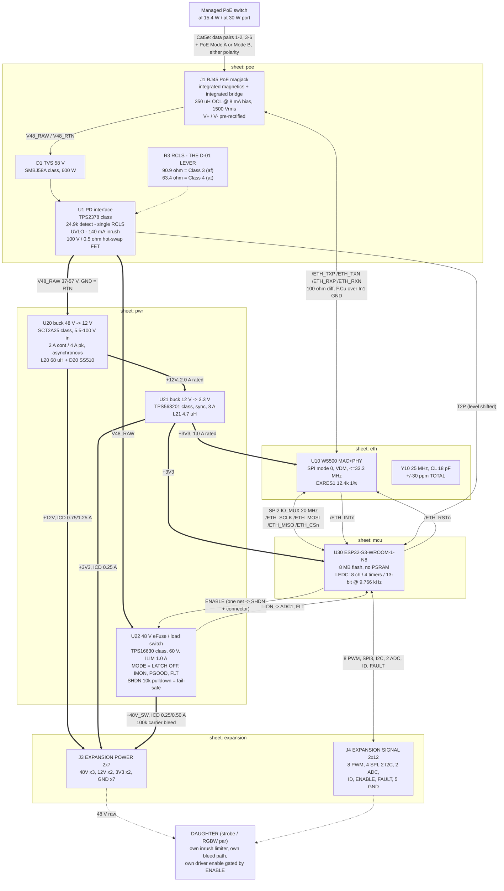

# LUM-CAR-A - block architecture

P2 deliverable. Inputs: `architecture/requirements.md` + all eight `research/*` fragments.
Parts are named by **MPN / part class only**. LCSC codes appear nowhere in this package - P3
`parts_search` owns codes, and a from-memory code once resolved to the wrong part (S14).

Board class: **4 layer**, `JLC04161H-3313`, 100 x 80 mm. See `stackup.md`.

---

## 0. One-line summary of what changed vs the brief

| Brief said | Architecture says | Why |
|---|---|---|
| PD front end per Skyworks Si3402-B / AN956 | **TPS2378-class PD interface + separate 100 V buck** | Si3402-B/-C and Si3404 are IEEE 802.3 **Type 1 only**; no resistor reaches Class 4, so D-01's "resistor change, no respin" is impossible with them |
| "~10 W regulated available" (AN956) | **re-derived: 8.6-9.3 W (af) / 18.7-20.0 W (at) to the daughter** | the AN956 figure describes a part this board cannot use, and it is an isolated-flyback number |
| carrier overhead 1.5 W | **2.4 W (af) / 3.7 W (at)** | the brief's chain double-counted regulator loss and omitted the bridge; see `power_tree.md` s2 |
| 48 V raw "2 A continuous, 3 A capability" | **contact 5.4 A / hardware limit 1.0 A / sustained 0.25 A (af), 0.50 A (at)** | 2 A at 48 V is 96 W on a 12.95-25.5 W supply. Three different numbers, all real |
| 15 mm board-to-board standoff | **11.0 mm** | no stocked 2.54 mm header/socket pair reaches 15 mm; see `connector-icd.md` s6 |
| single expansion connector | **split 2x7 power + 2x12 signal** | free mechanical keying; a one-position mis-seat lands 48 V on 12 V/GND instead of on an ESP32-S3 GPIO |

---

## 1. Block diagram - signal and power

Nothing on this board is isolated: the whole PCB, the expansion connector, the daughter and its
LED wiring float at PoE potential (see s3.9 and `decisions.md` D-A5).

---

## 2. Blocks

### 2.1 `J1` - RJ45 with integrated magnetics and integrated PoE rectifier (sheet `poe`)

Lead candidate: **HanRun HY931147C** (THT, right-angle, shielded, tab-down; integrated bridge out
to V+ / V-; yellow + green LEDs; 350 uH min OCL at 8 mA DC bias; 1500 Vrms). Footprint-compatible
second source: **HanRun HR861153C** (same 10 + 4 pin pattern, same V+ / V- on the same positions,
2250 VDC isolation).

Rejected: **HR911105A and every other high-stock HanRun jack** - parametrically `Non-PoE`, no
centre taps on package pins, nowhere to take PD power from. **HR871150C** (raw four centre taps)
rejected twice over: its published rating is *350 mA per centre tap, 17.5 W when using 2 centre
taps*, and a PSE energises exactly one mode (2 taps), so it is an **802.3af-only** part and cannot
serve D-01; and 209 pcs of stock is 14 boards with zero spares.

Choosing the integrated-bridge jack has three architectural consequences worth stating:
1. **There are no external bridges** and no `POE_TAP_*` nets on the board. The 48 V domain enters
   on two pins instead of four, which removes the hardest creepage region (48 V within millimetres
   of the MDI pads) and about 550 mm2 of PD front-end area.
2. **The bridge Vf is no longer a design variable.** ~1.4 V of drop at the at operating point
   (~0.84 W) is dissipated *inside a plastic connector body with no heatsink path*, in a sealed box
   whose internal air is already 56-69 C.
3. **No LCSC PoE magjack publishes an 802.3at (600 mA) tap rating.** Build 1 (af, 350 mA) is
   explicitly covered by all three HanRun datasheets. **The at upgrade therefore acquires a
   magjack-qualification dependency** - see `decisions.md` OPEN-A.

### 2.2 `U1` - PD interface (sheet `poe`)

Lead candidate: **TI TPS2378** (SO-8 PowerPAD). Second source **TPS2379** - pins 1-7 identical,
only pin 8 differs (APD vs GATE); this board is PoE-only so pin 8 stays unconnected and either
part builds on one footprint.

Why this part and not the alternatives:
- **Single class resistor.** TPS2372/TPS2373 use two (RCLSA + RCLSB), which turns D-01's
  single-part upgrade into a two-part change.
- **Native 2-event / Type 2 classification.** That is silicon, not a resistor - it is the thing
  that makes D-01 real.
- Integrated 100 V / 0.5 ohm hot-swap FET, 140 mA inrush limit, 1 A operating current limit,
  foldback if V(RTN-VSS) exceeds ~12.3 V for 800 us, OTSD, auto-retry.

`R1`/`R2` split the 24.9 k detection resistor into two halves with the tap brought out, so
grounding the tap disables the PD *and* spoils the detection signature - the clean hardware
PD-disable. `R3` (RCLS) is a standalone, silkscreened 0603 pad pair: **90.9 ohm = Class 3 for build
1, 63.4 ohm = Class 4 for the at upgrade.** Class 3 rather than Class 0 because both allocate
12.95 W but only Class 3 declares the real demand to a managed switch's budgeting.

`D1` is a 58 V TVS (SMBJ58A class, 600 W) across V48_RAW / V48_RTN, mandatory per both TI and
Microchip. 600 W not 400 W: the SMAJ58A's 4.3 A I_PP is *below* the 4.65 A a 1 kV class-2 surge
delivers into one shorted line. Plus a 0.1 uF / 100 V X7R VDD-VSS bypass (the standard's 50-120 nF
window). Carrier bulk `C2`/`C4` = 2 x 22 uF / 100 V = 44 uF - an order of magnitude under the
~180 uF 802.3 port-capacitance ceiling.

**Do not** wire any sleep or power-save function to DEN or APD: forcing the hot-swap off that way
kills DC MPS and the PSE removes power.

### 2.3 `U20` - 48 V -> 12 V converter (sheet `pwr`)

Lead candidate: **SCT2A25** (ESOP-8, 5.5-100 V in / 110 V abs max, 2 A continuous / 4 A peak, COT
300 kHz, asynchronous). With `L20` 68 uH and `D20` SS510-class 100 V Schottky.

Chosen over the alternatives because it is the **only shortlisted part that carries the 802.3at
case at a 100 V rating**: 1.9x margin on the 57 V worst case, against the 5 % a 60 V TPS54360
would have. LM5164 (synchronous, cleaner) tops out at 1 A = 12 W, which covers af and fails at -
and D-01 forbids a respin at the upgrade. LM5146 (100 V synchronous controller + 2 FETs) is the
escape hatch if the thermal review pushes back; reserve it mentally, not on the board.

Note that **the catch diode dissipates more than the IC** (~0.54 W vs ~0.43 W at the at operating
point). Placement must not treat U20 as "the hot part" and starve D20 of copper.

**Requirement placed on P3, not a prediction:** the 48->12 block (U20 + L20 + D20 + caps) must
dissipate **<= 1.25 W** at the at operating point with the ICD's +12V ceiling. If the selected part
exceeds it, change the part or lower the ICD +12V ceiling - **do not raise `dt_c`.**

### 2.4 `U21` - 12 V -> 3.3 V converter (sheet `pwr`)

Lead candidate: **TPS563201** (SOT-23-THIN-6, 4.5-17 V, 3 A synchronous, 580 kHz, EN pin).

An LDO is **disqualified, not merely inefficient**: (12 - 3.3) x 0.7 A = 6.1 W, four times the
entire carrier-overhead allocation, in a sealed box. Non-synchronous costs ~0.3 W more than
synchronous at this duty (the catch diode conducts 72 % of the period at D = 0.275). The only JLC
Basic candidate, TPS5430, is non-synchronous and is rejected on that 0.3 W, not on price.

12 V sits at 71 % of the 17 V ceiling - check against 12 V rail transients at P3.

### 2.5 `U22` - 48 V load switch to the expansion connector (sheet `pwr`)

Lead candidate: **TI TPS16630** (HTSSOP-20 PowerPAD, 4.5-60 V op / 67 V abs, ILIM adjustable
0.6-6 A +/-7 %, adjustable UVLO *and* OVP, dV/dT inrush ramp, latch-or-retry MODE, PGOOD, open-drain
FLT, and an analogue **IMON** current monitor). Fallback if placement forces the gate onto the
rectified input rather than downstream of the PD hot-swap: **LM5069 + a 100 V N-FET** (80 V op /
100 V abs, SOA-aware power limiting via the PWR pin).

Configuration that is not optional:
- **ILIM set to 1.0 A**, `MODE` open = **latch off**. Latch, not auto-retry: auto-retry into a
  daughter that browns out the rail produces a restart oscillation.
- **10 k pull-down on SHDN.** The datasheet's SHDN open-circuit voltage is 2.48-3.3 V with a 10 uA
  source, so an unconnected SHDN floats **HIGH and the device powers up ON**. The pull-down *is*
  the CAR-REQ-08 fail-safe and must be called out on the schematic.
- One ESP32-S3 GPIO drives **SHDN and the connector ENABLE pin as one net**, so the 48 V rail and
  the daughter's global enable cannot disagree.
- `IMON` -> an ADC1 pin. This closes the loop on the firmware average-energy governor, which is
  otherwise an open-loop model protecting a 12.95 W supply from a load that can ask for 96 W.

This switch does **five** jobs, and the fifth is why it is a compliance part rather than a
convenience part:
1. CAR-REQ-14 survivability against a shorted or mis-seated daughter;
2. the hardware half of the CAR-REQ-08 fail-safe chain;
3. de-energises the 48 V connector pins whenever firmware is not running (with `R70`, a 100 k
   carrier-side bleed);
4. bounds the cap-bank charge current to the ICD figure rather than the connector rating;
5. **802.3 compliance.** The standard caps PD port capacitance at ~180 uF; the strobe daughter
   holds ~2800 uF, 15x that. Charged at the PD's own 140 mA inrush limit, 2800 uF to 48 V takes
   ~960 ms - more than 10x the 80 ms operational-current window and outside any PSE start-up
   template. **The switch must be OFF through detection, classification, inrush and the 80 ms
   window, and may only close after firmware asserts ENABLE.**

### 2.6 `U10` + `Y10` - Ethernet controller and reference (sheet `eth`)

Lead candidate: **WIZnet W5500** (LQFP-48). `Y10` is a **25 MHz, CL 18 pF, AT-cut fundamental**
crystal - and the selection number is the **total** budget, not the initial tolerance: IEEE 802.3
clause 25 requires the transmit clock within 125 MHz +/-50 ppm, and initial (+/-30 ppm) + temperature
+ ageing + load-cap error has to fit inside that. **Specify +/-30 ppm or better over the operating
range**, load caps 27 pF C0G (CL 18 pF, Cstray ~4 pF), expect to trim on the first prototype.

Facts that must survive into P4: 12.4 k 1 % on EXRES1 (sets the MDI drive amplitude); 4.7 uF on
TOCAP; 10 nF on 1V2O; RSVD pin 23 to GND; PMODE[2:0] left NC (internal pull-ups give 111 =
all-capable auto-negotiation); RSTn low >= 500 us. **Variable Length Data Mode is mandatory** (the
host drives SCSn) - Fixed Length Data Mode ties SCSn to GND and forfeits bus sharing.

**Gate-5 number: the W5500's guaranteed SPI clock is 33.3 MHz, not 80 MHz.** The datasheet's 80 MHz
is explicitly "theoretical design speed"; the footnote gives 33.3 MHz as the tested, guaranteed
figure. Rev A runs **20 MHz** (80/4) with 40 % margin, on the SPI2 IO_MUX pins so the 26 MHz
GPIO-matrix ceiling does not apply. 60 fps of small UDP packets needs tens of microseconds of SPI
per 16.7 ms frame - speed is not the constraint here, margin is.

**Single-source risk: HIGH and unmitigable by design.** One orderable part number, no pin-compatible
alternate anywhere (W6100 is pin-compatible with the W5100S, not the W5500; W5100S-L has a
different pinout *and* register map). A second source means a different chip and different
firmware. Mitigation is procurement: buy the W5500s with the board order.

`D10` is a 4-channel low-capacitance TVS array (**<= 1 pF per line**) on the PHY side of the
magnetics, fitted not DNP. A general-purpose 20-50 pF array visibly degrades the 10 dB return-loss
floor.

### 2.7 `U30` - MCU (sheet `mcu`)

Lead candidate: **Espressif ESP32-S3-WROOM-1-N8** (8 MB quad flash, **no PSRAM**), pre-certified
module. **Q7 should close as "module"** - the bare-chip saving is $0.16/unit against an external
flash or $1.28/unit with the 8 MB-embedded chip, i.e. **$2 to $18 across the entire build**, and it
buys 2.4 GHz RF layout, a pi-match, antenna tuning, 80 MHz quad-SPI flash routing, modular
certification risk, and a QFN-56-EP in place of a part JLC places routinely. The saving does not
exist.

The **-N8 SKU is frozen by this architecture**, not merely preferred: GPIO35/36/37 are used, and
they are wired to the octal PSRAM on -N8R8 / -N16R8V. Compatible alternates that keep those pins
free: **-N4** (4 MB flash - tight against Ethernet OTA's two app partitions), **-N8R2**, **-N16R2**
(quad PSRAM, which uses the flash lines, not IO35-37). **-N16R8V is additionally excluded** because
its 1.8 V VDD_SPI puts GPIO47/48 at 1.8 V, and this design uses both. Ambient rating is another
reason to stay off the R8 parts: -40..+85 C on -N8 versus -40..+65 C on -N16R8, in a sealed box
whose internal air reaches 56-69 C.

`-N8` ambient +85 C vs a computed internal air of 56 C (af) / 69 C (at) is **16 C of margin at the
at operating point** - thin, and a second reason the at upgrade wants enclosure vents.

### 2.8 `J3` / `J4` - expansion connectors (sheet `expansion`)

Lead candidates: **CONNFLY DS1021-2x7SF11-B** (14 pos) and **DS1021-2x12SF11-B** (24 pos) on the
carrier, mating **DS1023-2*7SF11** and **DS1023-2*12SF11** sockets on the daughter. 2.54 mm THT,
gold, 250 V (male) / 600 V (socket) rated working voltage, 3 A per contact.

Full pin map, current arithmetic, creepage scheme and mating geometry: **`connector-icd.md`**.
The one line worth repeating here: **every fine-pitch mezzanine family JLC stocks below 1.27 mm
pitch is rated 50 or 60 V** (Hirose FX10 50 V, Molex 55560 50 V, Panasonic AXK 60 V, TE 50 V, HCTL
SHD 50 V) and therefore fails or grazes the 57 V worst case. The only fine-pitch part that passes
on voltage is Samtec QTH/QSH at 175 V, rejected on cost ($15 per mated pair = half the $30/board
target). **The fine-pitch route is closed**, and that is what pushes the answer to 2.54 mm.

---

## 3. Schematic sign-off gate artifacts (draft, for H1)

The brief lists four gates at schematic sign-off. All four are drafted here so H1 can see them.

### 3.1 Gate 2 - power budget, both columns

See `power_tree.md` s2 for the full loss chain. Headline:

| | 802.3af (build 1, Class 3) | 802.3at (upgrade, Class 4) |
|---|---|---|
| PD input limit | 12.95 W | 25.50 W |
| Design point (headroom held back) | 11.00 W (**15 % headroom**) | 22.40 W (**12 % headroom**) |
| PD input voltage / max DC current | 37-57 V / 350 mA | 42.5-57 V / 600 mA |
| Class resistor `R3` | **90.9 ohm** | **63.4 ohm** (one 0603, no respin) |
| Front-end loss (magjack DCR + internal bridge + hot-swap FET) | -0.51 W | -1.18 W |
| Carrier quiescent on the 48 V domain | -0.05 W | -0.05 W |
| **at the V48_RAW node** | **10.44 W** | **21.17 W** |
| carrier +3V3 silicon (0.236 A) referred to V48_RAW | -0.96 W | -0.96 W |
| daughter +3V3 (ICD 0.25 A) referred to V48_RAW | -1.02 W | -1.02 W |
| **available for daughter +12V / +48V_SW** | **8.46 W** | **19.19 W** |
| **Delivered to the daughter, worst case (all on +12V)** | **8.61 W** | **18.70 W** |
| **Delivered to the daughter, best case (all on +48V_SW)** | **9.28 W** | **20.00 W** |
| Brief's binding allocation (D-01) | 8.5 W | 18.5 W | 
| **Carrier overhead (input - delivered), worst case** | **2.39 W** | **3.70 W** |

**D-01's 8.5 W / 18.5 W allocation is met with margin on both columns**, and the "+48 V is free
watts" effect is worth **0.67 W (af) / 1.30 W (at)** - which is the second, independent argument
for D-02 and belongs in the ICD as guidance to daughter designers.

Conflicts resolved to build this table are itemised in `decisions.md` (D-A1 the disqualified PD
part, D-A3 the carrier overhead, D-A6 the +12V ceiling).

### 3.2 Gate 3 - PWM channel / timer / frequency allocation

ESP32-S3 LEDC ceiling: **8 channels, 4 timers, low-speed mode only, 14-bit max**. Channels sharing
a timer share **frequency and resolution** (CAR-REQ-11). Maximum resolution at a given frequency is
`floor(log2(80 MHz / f))`, so:

| Resolution | Max frequency | Note |
|---|---|---|
| 14-bit | 4.883 kHz | rejected - camera-banding risk at ~5 kHz |
| **13-bit** | **9.766 kHz** | **carrier default.** 8192 levels, satisfies SYS-REQ-04 with gamma, above the rolling-shutter band |
| 11-bit | 39.06 kHz | for a strobe wanting a short minimum pulse |
| 14-bit | 1.0 kHz | for a daughter whose driver cannot take 10 kHz (CAR-REQ-12) |

**Allocation, designed to satisfy D-04 either way:**

| Timer | Channels | Connector pins | Default | Owner |
|---|---|---|---|---|
| **LEDC timer 0** | ch 0-3 | **PWM0-3** | 13-bit @ 9.766 kHz | light-engine **group A** |
| **LEDC timer 1** | ch 4-7 | **PWM4-7** | 13-bit @ 9.766 kHz, independently retunable | light-engine **group B** |
| LEDC timer 2 | - | - | **unallocated** | reserved: a third frequency domain (CAR-REQ-12) |
| LEDC timer 3 | - | - | **unallocated** | reserved |

Per planned daughter:

| Daughter | D-04 answer | Channels used | Timer | Frequency / resolution |
|---|---|---|---|---|
| **RGBW par** | n/a | PWM0=R, PWM1=G, PWM2=B, PWM3=W | timer 0 | 13-bit @ 9.766 kHz |
| **Strobe** | **white-only** | PWM4 = strobe | timer 1 | free to run 11-bit @ 39.06 kHz for a shorter minimum pulse |
| **Strobe** | **RGBW** | PWM4=R, PWM5=G, PWM6=B, PWM7=W | timer 1 | 13-bit @ 9.766 kHz |

**Neither answer to D-04 moves a pin or a timer.** That is the point of the 4/4 split: the strobe
run can decide colour without touching the carrier or the ICD.

Firmware rules that fall out and must be written down now:
- Duty must clamp to `2^n - 1` (8191 at 13-bit); writing 8192 wraps to 0.
- `ledc_set_fade_with_time` is available on low-speed channels and is the mechanism for both
  SYS-REQ smooth transitions and the 500 ms watchdog fade-to-zero.
- 1-25 Hz strobe, ~20 Hz wobble and 50-200 ms accent flashes are **envelopes generated locally**
  from carrier timers, not from the 60 fps packet stream. The PWM carrier stays at ~10 kHz.
- **The ESP32-S3 must never enter light- or deep-sleep.** Board draw would fall below the 10 mA DC
  MPS floor and the PSE drops the port. See `power_tree.md` s6.

### 3.3 Gate 4 - ENABLE fail-safe analysis

**Topology.** One GPIO (`GPIO36`) drives one net, `ENABLE`, which reaches both `U22`.SHDN and
`J4` pin 23. A single **10 k pull-down to GND** on that net is the fail-safe. `GPIO36` is chosen
because it is in the GPIO35-48 band, which the ESP32-S3 datasheet's power-up glitch table does
**not** list - unlike GPIO1-20, where 60 us glitches occur at power-up. Polarity is **active
HIGH**, so a low-level glitch anywhere on the chain is a no-op.

| State | GPIO36 | ENABLE net | 48 V load switch | Daughter | Verdict |
|---|---|---|---|---|---|
| Power-up, before +3V3 POR | high-Z (chip unpowered) | 0 V via 10 k | OFF (SHDN low beats the 10 uA internal source) | drivers gated off; its own 100 k pull-down agrees | **safe** |
| MCU held in reset (EN low) | high-Z | 0 V | OFF | off | **safe** |
| Boot, before firmware asserts | high-Z until the GPIO is configured | 0 V | OFF | off | **safe** - and the PWM pins' 60 us glitches are gated by ENABLE |
| Normal run | driven high | 3.3 V | ON, ILIM 1.0 A | enabled | intended |
| **Mid OTA download** | still driven | 3.3 V | ON | running | light stays on; ESP-IDF writes the inactive partition, the app keeps running |
| **OTA reboot / serial flash** | EN toggles -> high-Z | 0 V | **OFF** | off, bank bleeds | **safe.** The pull-down is passive, so ENABLE cannot survive a reboot |
| **Brownout** | BOD resets the chip -> high-Z | 0 V | OFF | off | **safe, two independent mechanisms** - the passive pull-down, plus U22's own programmable UVLO |
| **Brownout recovery** | - | - | OFF, then re-enabled after boot + ID read | re-inrushes at the ICD limit | no oscillation: `MODE` = latch-off means a *fault* requires a deliberate SHDN cycle |
| **Firmware crash / task watchdog** | reset -> high-Z | 0 V | OFF | off | **safe** |
| **UDP watchdog (2 s no packet)** | still driven | 3.3 V | ON | 500 ms fade to zero in firmware | deliberate: graceful, instantly recoverable, does not drop the rail |
| **Connector mis-seated one position** | driven | lands on J4 pin 21 (ADC1) or off the end | - | daughter's ENABLE input unconnected -> its own 100 k pull-down de-asserts | **safe** |
| Daughter solder bridge ENABLE-to-3V3 | - | - | carrier switch still under carrier control | daughter self-enables | **not preventable at the carrier** - the ICD requires the daughter's driver enable to be gated by its own logic as well |

Direction of travel is uniform: **every failure de-energises.** +3V3 sags or the MCU resets -> GPIO
high-Z -> pull-down -> U22 opens -> `R70` (100 k) bleeds the carrier side and the daughter's own
CAR-REQ-17 bleed path discharges its bank.

### 3.4 Gate 5 - ESP32-S3 pin legality and the W5500 SPI clock

SPI clock: **20 MHz**, inside the W5500's guaranteed 33.3 MHz with 40 % margin, on SPI2 IO_MUX pins
(s2.6). Pin map and legality proof: **s4 below.**

---

## 4. ESP32-S3-WROOM-1-N8 pin map (gate 5, half two)

### 4.1 The exclusion list, and why each pin is excluded

| Pins | Class | Disposition |
|---|---|---|
| **GPIO0** | strapping, boot mode (weak pull-up, 1 = SPI boot) | **reserved** for the BOOT line on the recovery header `J2` |
| **GPIO45** | strapping, VDD_SPI voltage. Pulled high at reset = 1.8 V flash rail = **the module does not boot** | **not used** |
| **GPIO46** | strapping, boot + ROM print (weak pull-down) | **not used** |
| **GPIO3** | strapping, JTAG source, **floating, no internal pull** | **not used** (available only to a permanently-driven output) |
| **GPIO19, GPIO20** | USB D-/D+, default-connected to the USB Serial/JTAG controller; power-up glitch windows of 3.2 ms and 2.0 ms | **not used** |
| **GPIO43, GPIO44** | UART0 TXD0/RXD0, ROM console | **reserved** for the recovery header `J2` |
| GPIO26-32 | SPI flash / PSRAM on the bare chip | **not on the module** - internal. Listed because gate 5 names them |
| GPIO33, GPIO34 | not brought out on WROOM-1 | n/a |
| GPIO35, 36, 37 | octal PSRAM on -N8R8 / -N16R8V only | **USED** - this freezes the SKU to a non-octal-PSRAM part (s2.7) |
| GPIO47, 48 | 1.8 V on -N16R8V only | **USED** - -N16R8V is already excluded |
| GPIO11-20 | ADC2 - cannot be used as analogue with Wi-Fi active | used as **digital only**. All four analogue functions are on ADC1 (GPIO1-10) |
| GPIO39-42 | JTAG MTCK/MTDO/MTDI/MTMS | **USED** for the daughter SPI. Hardware JTAG is forfeited; the Q9 default recovery path is UART, not JTAG |

### 4.2 The map

| # | Net | GPIO | Function / IO_MUX | Legality |
|---|---|---|---|---|
| 1 | `/ADC0` (J4-20) | **1** | ADC1_CH0 | not strapping/USB/flash; ADC1 so Wi-Fi-safe |
| 2 | `/ADC1` (J4-21) | **2** | ADC1_CH1 | " |
| 3 | `/PWM0` | **4** | LEDC ch0, timer 0 | " (60 us power-up glitch - gated by ENABLE) |
| 4 | `/PWM1` | **5** | LEDC ch1, timer 0 | " |
| 5 | `/PWM2` | **6** | LEDC ch2, timer 0 | " |
| 6 | `/PWM3` | **7** | LEDC ch3, timer 0 | " |
| 7 | `/IMON` | **8** | ADC1_CH7 - U22 current monitor | " |
| 8 | `/ID_ADC` (J4-22) | **9** | ADC1_CH8 - daughter ID divider | " |
| 9 | `/ETH_CSn` | **10** | **FSPICS0 (IO_MUX)** | " - needs a 10 k pull-up, see below |
| 10 | `/ETH_MOSI` | **11** | **FSPID (IO_MUX)** | " |
| 11 | `/ETH_SCLK` | **12** | **FSPICLK (IO_MUX)** | " |
| 12 | `/ETH_MISO` | **13** | **FSPIQ (IO_MUX)** | " |
| 13 | `/ETH_INTn` | **14** | FSPIWP, unused in 4-wire SPI | " |
| 14 | `/PWM4` | **15** | LEDC ch4, timer 1 | " |
| 15 | `/PWM5` | **16** | LEDC ch5, timer 1 | " |
| 16 | `/I2C_SCL` | **17** | I2C master | " |
| 17 | `/I2C_SDA` | **18** | I2C master | " |
| 18 | `/ETH_RSTn` | **21** | plain GPIO, no ADC, no power-up glitch | " |
| 19 | `/PWM6` | **35** | LEDC ch6, timer 1 | free on non-octal-PSRAM SKUs; **no power-up glitch** |
| 20 | **`/ENABLE`** | **36** | -> U22 SHDN **and** J4-23 | **no power-up glitch** - this is why ENABLE lives here |
| 21 | `/FAULT` | **37** | input, open-drain, wire-OR of J4-24 and U22 FLT | no glitch |
| 22 | `/PWM7` | **38** | LEDC ch7, timer 1 | no glitch |
| 23 | `/DSPI_SCK` | **39** | SPI3 via the GPIO matrix (<= 26 MHz) | forfeits JTAG MTCK |
| 24 | `/DSPI_MOSI` | **40** | SPI3 | forfeits MTDO |
| 25 | `/DSPI_MISO` | **41** | SPI3 | forfeits MTDI |
| 26 | `/DSPI_CSn` | **42** | SPI3 | forfeits MTMS |
| 27 | `/T2P` | **47** | Type-2 PSE detected, via U1's level-shift network | legal once -N16R8V is excluded |
| 28 | `/STATUS` | **48** | firmware heartbeat / commissioning LED `D30` | " |
| - | BOOT | 0 | `J2` pin, 10 k pull-up | strapping - reserved, never a signal |
| - | TXD0 / RXD0 | 43 / 44 | `J2` pins | reserved |
| - | EN | (EN pad) | `J2` pin + 10 k / 1 uF RC | reset |

**28 of the 28 legal GPIOs are assigned.** GPIO3 is the only pin left and it is usable only by a
permanently-driven output. **The WROOM-1 GPIO budget is exhausted** - any new carrier function needs
an I2C GPIO expander (the I2C bus is already routed to the connector, so that is a BOM change, not
a respin). This is a real finding for H1, not a footnote.

Two schematic details that follow from the pin choice:
- **GPIO10 has a 60 us low-level glitch at power-up and low = W5500 selected.** Fit a 10 k pull-up
  from `/ETH_CSn` to +3V3. The W5500's own SCSn pull-up is 50-112 k - present, but weak, and it
  cannot fight an actively driven glitch.
- **`/ETH_RSTn` fails safe** (W5500 RSTn has an internal pull-up, so a floating MCU pin leaves the
  PHY *out* of reset) - add an explicit 10 k pull-up anyway so the behaviour is not a
  datasheet-footnote dependency.

### 4.3 Why the daughter SPI is a separate bus

`SPI2` (IO_MUX, 20 MHz) is the W5500's alone. `SPI3` (GPIO matrix, capped ~26 MHz) goes to the
connector. That costs 3 GPIOs on a board whose GPIO budget is exactly exhausted, and it is still
right: sharing would put a 20 MHz Ethernet clock on a 2.54 mm THT connector into an unknown
daughter, and any daughter device that hangs the bus would take down **the control path**. 26 MHz
is ample for an EEPROM and an LED driver.

---

## 5. Layout sign-off gates (declared now, checked at P8)

Carried from the research fragments so they are not lost between P2 and P8.

1. **PD front-end power flow is point-to-point and contiguous:** J1 -> TVS + 0.1 uF -> U1. No
   signal of any kind crosses that zone - it is effectively a routing keepout for MDI, SPI and PWM.
2. **0.60 mm outer-layer clearance around every 48 V net, board-wide** (IPC-2221B B2, 51-100 V band;
   TI independently recommends 0.635 mm VSS-to-VDD). Not just at the connector.
   **`rules_gen` does not read `voltages`** (grep-verified), so nothing makes the P7 router honour
   this - a named `.kicad_dru` clearance rule keyed on `A.NetName` must be added at P5. See
   `decisions.md` TRAP-1.
3. **MDI:** zero vias, both pairs on F.Cu referenced to a continuous In1 GND, <= 25 mm routed,
   >= 0.508 mm TX-to-RX with GND between, >= 7.5 mm from any digital signal, no stubs.
4. **Crystal:** Y10 + both load caps as one group, XI/XO <= 5 mm, solid GND land on F.Cu under the
   crystal stitched to In1, no traces under or beside the group, >= 7.5 mm from the MDI and on the
   far side of U10 from J1.
5. **DC-DC:** compact switching loop; D20 gets its own copper (it dissipates more than U20); U20's
   exposed pad to In1 GND with >= 9 vias; the whole block >= 25 mm from J1/U10/Y10 and >= 20 mm
   from U30.
6. **Thermal review against CAR-REQ-18:** see `connector-icd.md` s8 (the hot zone is an ICD keepout,
   because in a stacked mezzanine an in-plane separation rule on the carrier alone cannot answer a
   vertical stack).
7. **Antenna:** 10 x 22 mm no-copper-on-any-layer keepout at the right edge (s7 of `stackup.md`),
   dense GND vias in the board copper *adjacent to* but not under it.
8. **Resistor package on the 48 V domain: 0805 or larger.** 0402/0603 parts are typically 50-75 V
   working. This bites bleed resistors, UVLO/OVP dividers and any 48 V sense divider. The detection
   resistor is exempt (U1 disconnects it above ~12.8 V).

---

## 6. Cost picture for checkpoint 1

Per assembled carrier at **qty 14** (Q15 default = 12 fixtures + 2 spares), USD, from the live
JLCPCB prices in the research fragments:

| Line | $/board |
|---|---|
| ESP32-S3-WROOM-1-N8 | 4.64 |
| W5500 | 2.38 |
| PoE magjack | 2.15 |
| PD interface + 48->12 buck + 48 V eFuse + 12->3.3 buck | 4.62 |
| Inductors, Schottky, TVS, crystal, MDI TVS array | 0.70 |
| Expansion connectors (carrier side, both) + recovery header | 0.27 |
| ~70 passives incl. 100 V ceramics, LEDs, headers | 2.80 |
| **BOM subtotal** | **17.56** |
| PCB, 4-layer 100 x 80, HASL, qty ~15 | ~3.50 |
| THT surcharge ($3.50 one-off + $0.0173 x ~62 joints) | ~1.32 |
| Extended feeder fees (~10 Extended part numbers) + SMT setup, amortised over 14 | ~2.70 |
| SMT placement | ~0.60 |
| **Total per assembled carrier** | **~$26 - 32** |

Against Q15's provisional **<= $30** target: **at the target, with no room.** Two things the human
should see:
- **$9.27 of it is four parts** (module, W5500, magjack, crystal) = 31 % of the target before the PD
  front end exists. There is no cheaper credible substitute for any of the four.
- **12 carriers at ~$30 is ~$360 of a $500-1000 programme budget** that also has to cover the
  daughters, the enclosures and the managed PoE switch. Either the budget or the fixture count
  needs revisiting - this is a programme finding, not a board finding.
- **No JLC Basic part exists** for the module, the W5500, the magjack, the PD interface, either
  converter, the eFuse or the connectors. Section 7's "prefer Basic/Standard" is unachievable on
  this board at any sane performance point; at 14 units the extra setup cost is a few dollars total
  and must not drive part choice.
