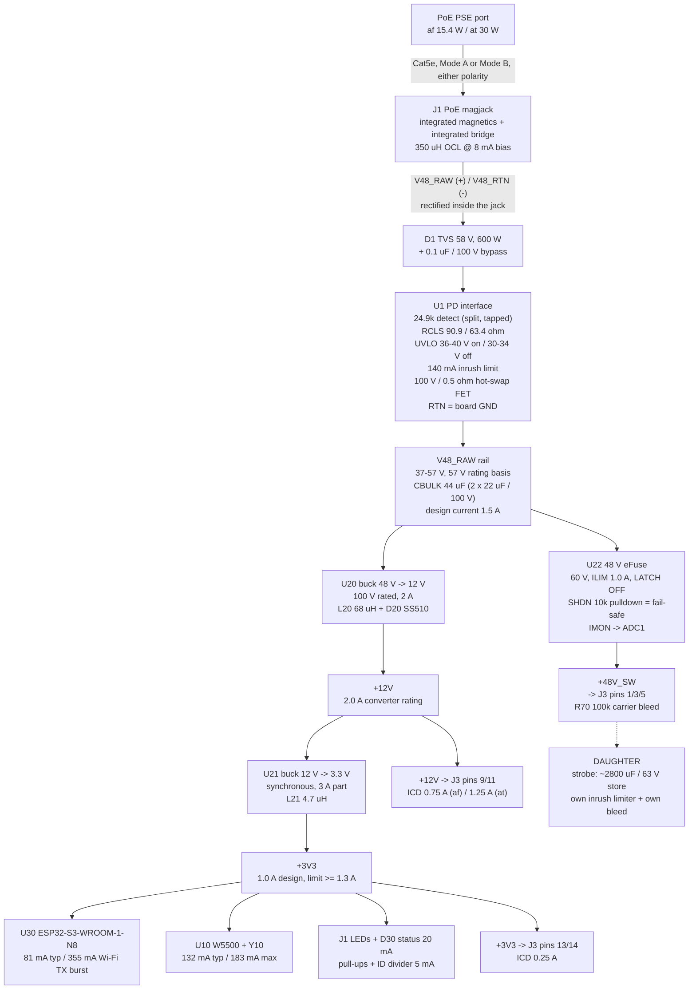

# LUM-CAR-A - power tree

P2 deliverable. Reconciled against the final block choices in `blocks.md`. Where this file and
`research/power.json` disagree, this file wins and `decisions.md` says why.

Net names below are the **canonical** names of `sheets.md` s1 and `constraints.json`.

---

## 1. Rail tree

**Three rails only** (D-02). **No 5 V rail** - nothing on the carrier needs one and it would add a
fourth conversion loss to a 10 W budget.

**The chain 48 -> 12 -> 3.3 is mandated by D-02 and is also the better engineering answer.** A direct
48 -> 3.3 buck runs at 6.9 % duty; at 500 kHz that is a 138 ns on-time, at or below the minimum
on-time of most parts, and it would need a second >= 60 V-rated converter.

**There is only one positive 48 V node upstream of the eFuse.** The TPS2378-class part switches the
*return* (RTN to VSS), not the positive rail, so `VPOE` and `+48V` from `research/power.json`
collapse into a single net, `V48_RAW`. `V48_RTN` is the raw negative and is a separate net that sits
up to 57 V **below** board GND when the hot-swap is off - which is why `constraints.json` declares
it at **-57 V** (see s5).

---

## 2. Power budget - both columns (gate 2 deliverable)

Arithmetic at the **low-line corner** (worst case for current, hence for loss): af PD input 37 V,
at PD input 42.5 V. Efficiencies are the selected parts' own: 48->12 **92 % (af) / 93 % (at)**,
12->3.3 **88 %**.

| Stage | 802.3af - build 1 (Class 3) | 802.3at - upgrade (Class 4) |
|---|---|---|
| PSE port output | >= 15.4 W | >= 30 W |
| Guaranteed at the PD input, 100 m Cat5e | **12.95 W** | **25.50 W** |
| **Design point (headroom deliberately held back)** | **11.00 W (15.0 %)** | **22.40 W (12.2 %)** |
| PD input voltage window / standard max DC current | 37-57 V / 350 mA | 42.5-57 V / 600 mA |
| Design-point PD input current at low line | 0.297 A | 0.527 A |
| Class programmed - **one 0603 resistor, R3** | Class 3, **90.9 ohm** | Class 4, **63.4 ohm** |
| - magjack PoE-path DCR (~0.7 ohm) | -0.06 W | -0.19 W |
| - integrated bridge, 2 diodes conduct, ~1.4 V | -0.40 W | -0.84 W |
| - hot-swap FET, 0.5 ohm | -0.04 W | -0.14 W |
| - carrier 48 V-domain quiescent (U1 bias, U22 Iq, R70 bleed) | -0.05 W | -0.05 W |
| **available at the V48_RAW node** | **10.44 W** | **21.17 W** |
| - carrier +3V3 silicon 0.236 A = 0.78 W, referred through both bucks | -0.96 W | -0.96 W |
| - daughter +3V3, ICD 0.25 A = 0.83 W, referred through both bucks | -1.02 W | -1.02 W |
| **available for the daughter on +12V and/or +48V_SW** | **8.46 W** | **19.19 W** |
| **Delivered to the daughter - worst case, everything on +12V** | **8.61 W** | **18.70 W** |
| **Delivered to the daughter - best case, everything on +48V_SW** | **9.28 W** | **20.00 W** |
| D-01's binding allocation | 8.5 W | 18.5 W |
| **Margin against the allocation** | **+0.11 to +0.78 W** | **+0.20 to +1.50 W** |
| **Carrier overhead (input - delivered), worst case** | **2.39 W** | **3.70 W** |
| **Carrier overhead, best case (daughter on 48 V)** | 1.72 W | 2.40 W |
| Headroom against the class limit, unused | 1.95 W | 3.10 W |

Both current figures sit inside the standard's 350 mA / 600 mA PD limits, so **the class limit binds
on power, not on current.**

### 2.1 Why the brief's numbers are not used

**"~10 W regulated available" (requirements 3.2) is discarded.** It is quoted from Skyworks AN956
about the Si3402-B - a **Type 1-only** part this board cannot use (D-01), and the figure describes
an isolated flyback at ~77 % end-to-end. Chaining "10 W regulated, minus 1.5 W overhead" then adds
regulator loss a **second** time. The table above replaces the whole chain with one loss budget
built from the selected parts.

**Carrier overhead: 2.4 W (af) / 3.7 W (at), not 1.5 W.** Three sources had three numbers; they
measure different things:

| Source | Number | What it actually measures |
|---|---|---|
| brief `00` s5.1 | 1.5 W | intended as "ESP32-S3 + W5500 + magnetics + regulator losses" - but omits the input bridge (0.40-0.84 W) and double-counts the converter |
| `research/mcu-net` | 0.70-0.76 W | **+3V3 silicon only** (ESP32-S3 modem-sleep + W5500 at 100M + LEDs). Not overhead - it is one term inside it |
| `research/power` | 2.44 / 3.75 W | the full input-minus-delivered figure. Independently reproduced above as 2.39 / 3.70 W |

**Adopted: 2.4 W (af) / 3.7 W (at)** in the budget table and in the ICD. The +3V3 silicon term is
**0.78 W** (mcu-net's 0.70-0.76 W of silicon plus 20 mA of LEDs and 5 mA of pull-ups/divider - the
two agree to within 3 %). The brief's 1.5 W is ~60 % low and must not be carried into any daughter
budget. All of these remain **judgement figures until measured on the first prototype**, as the
brief itself flags.

### 2.2 If Q5 flips to an isolated flyback

The first stage drops from ~92 % to ~80 %. At af the same 8.5 W out then needs 12.36 W of PD input:
**0.59 W of margin, 4.6 %** - which is not a margin. And there is **no 12 V-secondary PoE flyback
transformer in the JLCPCB catalogue** (the only stocked family has a 5 V / 2.2 A secondary), so the
isolated path also breaks the section 7 single-order PCBA assumption. **Q5's real cost is not the
~$2 of BOM; it is a transformer qualification task with no in-catalog answer plus ~1.5 W of
delivered power.** Recommendation: confirm non-isolated.

---

## 3. Sustain versus survive

The single most misread part of this board's spec. **Per-rail hardware ceilings and the total
sustained envelope are different numbers and both are real.**

| Rail | Must SUSTAIN (set by PoE, shared across all rails) | Must SURVIVE (set by hardware, per rail) |
|---|---|---|
| `+48V_SW` | **0.25 A (af) / 0.50 A (at)**, and only if the other rails are near idle | 1.0 A eFuse limit, latch-off; a dead short or mis-seat is a fault the switch owns, not the PD front end (CAR-REQ-14). Connector pins carry 5.4 A |
| `+12V` | **0.75 A (af) / 1.25 A (at)** - the at figure is set by U20's thermal budget, not by the connector (s4.2) | 2.0 A converter rating with hiccup/latching OCP. Connector pins carry 3.6 A |
| `+3V3` | **0.25 A** daughter + 0.236 A carrier = 0.49 A | 1.0 A converter, current limit >= 1.3 A; 1.21 A ms-scale peak (Wi-Fi TX + W5500 TX + daughter) served by local bulk, not by the converter. Connector pins carry 3.6 A |
| **Total, all rails** | **8.5 W (af) / 18.5 W (at)** | - |

The per-rail ceilings **do not add up to the total** and are not meant to: 0.25 A x 48 V + 0.75 A x
12 V + 0.25 A x 3.3 V = 21.6 W against an 8.5 W af envelope. They are individual ceilings; the total
is what binds.

Four nested enforcement mechanisms, outermost last - **only the first is graceful:**
firmware's average-energy governor (closed-loop on `/IMON`) -> the carrier's per-rail current limits
-> the PD controller's own 1 A limit and foldback -> the PSE's overload timer (~50-75 ms, after
which the port drops and the fixture goes dark until it re-detects).

### 3.1 Strobe arithmetic, for the ICD and the daughter runs

2800 uF over the D-02 48 -> 40 V window stores **0.99 J** (matches the brief's "1 J"); a full
0 -> 48 V charge is **3.23 J**.

| Question | af | at |
|---|---|---|
| Max full-window (48 -> 40 V) flash rate the rail can sustain | 8.6 Hz | 18.8 Hz |
| Energy per flash at SYS-REQ-03's 25 Hz ceiling | 0.34 J | 0.74 J |
| Bank droop per flash at 25 Hz | 48 -> 45.4 V | 48 -> 42.1 V |
| Cold-start charge time at the ICD sustained limit | **0.54 s** @ 0.25 A | **0.27 s** @ 0.50 A |

SYS-REQ-03's 1-25 Hz range is reachable on af, at reduced per-flash energy above ~8.6 Hz. That is a
governor policy question for the strobe run, not a carrier hardware limit - but the carrier must be
the thing that **cannot be talked out of the limit**, which is why the load switch is a hardware
part and not a firmware convention.

### 3.2 Steering the headroom - free watts on +48V_SW

Delivering the same power on `+48V_SW` instead of `+12V` skips the 48->12 conversion entirely.
Worth **0.67 W (af) / 1.30 W (at)** of delivered power, and it removes the board's only real hot
spot. **The ICD says this explicitly so daughter designers know where the cheap watts are.**

---

## 4. Per-rail consumers, topology and the numbers behind the ICD limits

### 4.1 `V48_RAW` / `V48_RTN` - the rectified PoE domain, 37-57 V

| Consumer | typ | peak | basis |
|---|---|---|---|
| U1 PD front end (detect / class / hot-swap) | 0.297 A af, 0.527 A at | 0.350 A af, 0.600 A at | the design point above; the peaks are the standard's PD limits |
| classification event | - | 0.040 A @ <= 20 V, < 75 ms | 802.3 class-current window, into U1 |
| U20 buck input | 0.19 A af / 0.44 A at | 0.47 A | s2 chain |
| U22 -> `+48V_SW` -> daughter | 0.25 A af / 0.50 A at (ICD) | **1.0 A** (eFuse limit) | cap-bank charge; s3 |
| `R70` bleed 100 k on `+48V_SW` | 0.5 mA | 0.5 mA | 23 mW; de-energises the connector pins when ENABLE is low |
| **`V48_RAW` net design current** | - | **1.5 A** | buck at max plus the eFuse at its limit, briefly, off CBULK |

Topology: **no board-level rectification** - the magjack's integrated bridge does it (blocks.md
s2.1). The 1.4 V bridge drop is real but not on the board and not selectable.

**CBULK = 44 uF (2 x 22 uF / 100 V ceramic).** Bounded above by the ~180 uF 802.3 port-capacitance
window and by the part's own limit; bounded below by the 5 uF the AC-MPS impedance requirement
needs. Prefer ceramic or aluminium-polymer over aluminium electrolytic **everywhere on this board**:
a 105 C electrolytic at 56-69 C internal air is the shortest-lived part on the board, and
electrolytic life halves per 10 C.

### 4.2 `+12V` - regulated daughter rail

| Consumer | typ | peak | basis |
|---|---|---|---|
| U21 12->3.3 input | 0.074 A | 0.34 A | 0.78 W out / 88 % |
| daughter `+12V` (ICD) | 0.75 A af / **1.25 A at** | 2.0 A (converter rating) | see below |
| **rail design** | | **2.0 A** | converter rating; the PD budget, not the converter, is what actually binds |

**Where the 1.25 A at-limit comes from.** At 1.25 A of daughter draw plus the carrier's own 0.074 A
branch, U20 delivers 15.9 W and dissipates **1.19 W** at 93 %. Its `check_thermal` budget is 1.25 W.
Push the daughter to 1.55 A (the whole at envelope on 12 V) and U20 dissipates 1.41 W, which at the
model's best-case 51.1 C/W floor on 4 layers is a 72 C rise against a `dt_c` of 70 - it fails.
**So the +12V at-ceiling is a thermal number, and the correct response is the ICD line, not a bigger
`dt_c`.** Anything above 1.25 A at the at operating point must be taken on `+48V_SW`, which is where
the free watts are anyway (s3.2).

Topology: **non-isolated synchronous-rectifier-free (asynchronous) buck, input rated >= 80 V.** An
LDO here would dissipate (48 - 12) x 1.3 = 47 W, so it is a buck or nothing.

**Input rating >= 80 V, not the >= 60 V of CAR-REQ-02.** 60 V against a 57 V worst case is 5 %
margin, before any PoE transient, hot-plug ring or PSE turn-on overshoot, on a rail whose own
controller is rated 100 V and behind a TVS that clamps in the 90 V region. The selected part is
100 V / 110 V abs. This is a recommendation on top of CAR-REQ-02, not a re-opening of it.

**Part exclusions restated as a correction, not an open question:** **LM2596** (40 V) and
**LMR33630** (3.8-36 V) cannot be used anywhere on the PD rail. Also excluded on margin:
TPS54360/TPS54560 (60 V), LM5160 (65 V), MP4560 (55 V), SCT2432 (40 V). Excluded on current:
LM5017 (0.6 A = 7.2 W, below even the af budget).

### 4.3 `+3V3` - carrier logic and daughter logic/sense

| Consumer | typ | peak | basis |
|---|---|---|---|
| U30 ESP32-S3-WROOM-1-N8 | 81 mA | **500 mA** | modem-sleep 240 MHz dual-core with peripheral clocks on = 81.3 mA; Wi-Fi TX 802.11b at +20.5 dBm = 355 mA; **the module datasheet independently requires a supply able to deliver >= 500 mA** |
| U10 W5500 | 132 mA | 183 mA | 100M link-up + transmitting. **Includes** the 100BASE-TX line drive, so the magnetics are not a separate line item |
| Y10 + load caps | < 1 mA | < 1 mA | oscillator drive is inside the W5500 figure |
| status LEDs: 2 in the magjack + D30 | 18 mA | 18 mA | ~6 mA each; two driven from W5500 open-drain LED outputs, one from GPIO48 |
| I2C + FAULT pull-ups, ID divider, ENABLE pull-down | 5 mA | 5 mA | 2 x 4k7 + 10k + 10k + divider |
| **carrier subtotal** | **236 mA = 0.78 W** | **706 mA** | |
| daughter `+3V3` (ICD) | **250 mA = 0.83 W** | 250 mA | see below |
| **rail design** | **486 mA** | **956 mA (ms)** | converter rated 1.0 A, current limit >= 1.3 A |

**Why 0.25 A and not Q6's 0.5 A.** 0.5 A of 3.3 V is 1.65 W - **19 % of the entire af light-engine
budget spent on daughter *logic and sense***. A strobe or par daughter's logic is a few tens of mA.
The converter is still rated 1.0 A, so raising the ICD figure later is a **documentation change, not
a hardware one**. Recorded as a deliberate deviation from the Q6 default in `decisions.md` D-A4.

Topology: **synchronous buck from +12V.** Noise: the two sensitive loads are the W5500's 100BASE-TX
line driver and the ESP32-S3 radio; neither needs its own rail (the W5500 regulates its own 1.2 V
core internally), so the answer is a ferrite bead plus local bulk on each, not a fourth regulator.
What must be kept away from Y10 and the differential pairs is U20's switching node.

**`GND` is deliberately absent from `constraints.json.power`.** It is a plane, not a routed net, and
declaring it would make `check_current` demand IPC width on every short GND stub and 5 vias in every
GND cluster. The requirement is structural instead: a continuous In1 GND plane under the whole power
path, and >= 7 connector pins carrying the aggregate return (`connector-icd.md` s4).

---

## 5. Voltage, creepage and derating

- **Rating basis is 57 V** on `V48_RAW`, `V48_RTN` and `+48V_SW`.
> **P3 REVISION:** the board-wide HV clearance requirement is now **0.635 mm**, not 0.60 mm -
> the TPS2378 datasheet's layout section exceeds IPC and governs. The 0.60 mm figures below
> remain accurate as descriptions of what `check_creepage.py` itself demands; a 0.635 mm layout
> passes that checker by construction. See connector-icd.md s5.1 (rev A2).

- `check_creepage` applies IPC-2221B: 51-100 V -> **0.60 mm on outer layers, 0.10 mm on inner**. All
  three nets are > 30 V from **every** other net on the board including GND, so **0.60 mm outer
  clearance applies board-wide around the 48 V copper**, not just at the connector. Budget for it in
  placement, not in a fix pass. TI independently recommends 0.635 mm between VSS and VDD.
- The 0.10 mm inner figure is below JLC's minimum (0.127 mm at 1 oz), so on In1/In2 the **fab
  minimum dominates and the HV requirement is free**.
- **Do not claim the 0.13 mm coated column.** It needs a permanent polymer coating; JLC's standard
  LPI soldermask is not qualified as one, and decisively, `check_creepage.py` implements only the
  uncoated columns - a layout designed to 0.13 mm fails P8 with no waiver mechanism in `gate.py`.
- **`V48_RTN` is declared at -57 V.** `check_creepage` works on the *difference* between declared
  voltages and treats unlisted nets as 0 V. Board GND is the *switched* negative (the hot-swap FET's
  drain), which the datasheet specifies as sitting 0 to 57 V **above** the raw negative. Declaring
  the raw negative as -57 makes the checker demand 0.60 mm between it and GND - which is exactly the
  hot-swap FET's drain-to-source spacing and the whole detection/classification network. Declaring
  it as 0 would silently skip all of that. Side effect, deliberate and harmless: `V48_RAW` to
  `V48_RTN` then reads as 114 V, giving the same 0.60 mm outer and 0.20 mm inner - still below the
  fab minimum.
- **Functional insulation only.** 57 V DC is below the IEC 62368-1 **ES1** limit of 60 V DC, so no
  basic/supplementary/reinforced safeguard is required between the 48 V domain and anything a person
  could touch. IPC-2221B Table 6-1 governs, and IPC-2221 does not separate creepage from clearance -
  0.60 mm covers both. **If** an isolated flyback is ever chosen, the barrier number is a completely
  different **2.0 mm** and must not be confused with the 0.60 mm functional figure.
- **Component working voltage, not just spacing:** any resistor across the 48 V domain must be
  **0805 or larger** (0402/0603 are typically 50-75 V working) or split into two in series;
  capacitors on the port must be 100 V rated.

---

## 6. Sequencing, inrush and MPS

1. **Detect** - 24.9 k +/-1 % across the port, split into two halves with the tap brought out (a
   grounded tap disables the PD *and* spoils the signature - the clean hardware PD-disable). Note
   the internal bridge sits in series with the detection path and its incremental resistance at the
   few-hundred-microamp detection current may be hundreds of ohms; **P3/P4 may need to trim RDEN
   upward** rather than porting 24.9 k blindly.
2. **Classify** - `R3` = 90.9 ohm (Class 3) for build 1. Class 3 rather than Class 0: both allocate
   12.95 W, but Class 3 declares the real demand to a managed switch's budgeting and makes the
   af->at delta a clean single step 90.9 -> 63.4.
3. **UVLO** - turn on ~36-40 V, turn off ~30-34 V with hysteresis.
4. **Inrush** - U1 limits to 140 mA typ while charging CBULK. Carrier bulk is 44 uF, an order of
   magnitude under the ~180 uF port ceiling. **The daughter's 2800 uF must not be on the rail here.**
   At 140 mA it would take ~960 ms, more than 10x the standard's 80 ms operational-current window.
   Keeping it off is U22's first job and it is a **compliance** requirement, not just CAR-REQ-14.
5. **+12V soft-start, then +3V3 soft-start.** The order is inherent to the chain; no sequencer.
6. **+3V3 POR -> U30 boots. `ENABLE` stays low**, held by a carrier-side 10 k pull-down - *not* by
   the MCU, whose GPIO is high-Z in reset (CAR-REQ-08).
7. **Firmware asserts ENABLE** after boot and after reading the daughter ID -> U22 closes with a
   limited dV/dt -> the daughter's own inrush limiter charges its bank at <= the ICD limit
   (0.54 s af / 0.27 s at from cold).
8. **Governor active** before the first strobe command is honoured.

**Inrush ownership must be assigned to exactly one side.** CAR-REQ-14 puts inrush limiting on the
daughter, but U22 is in series with it. If both ramp, two soft-starts fight, the eFuse rides thermal
regulation and can trip its own fault timer on every plug-in. **Decision: the daughter owns the
ramp** (it holds the capacitance); U22's dV/dt cap is sized *fast* and its current limit sits
**above** the daughter's inrush level. The daughter must size its limiter against the **PD's
operating current limit**, not against the connector rating - sizing it against the connector is the
classic way to trip U1's 800 us foldback deglitch and brown out the whole board.

**Maintain Power Signature.** 802.3 requires >= 10 mA DC (or a 10 mA pulse of >= 75 ms every 325 ms)
plus an AC impedance below 26.3 kohm || 0.05 uF. The AC half is satisfied by CBULK. The DC half:
the worst case is **the daughter dark**, where the board draws only its own +3V3 silicon (0.78 W)
referred through both bucks, plus the front-end and quiescent losses at that current - about
**1.1 W = 23 mA at 48 V, 2.3x the 10 mA floor.** Present whenever U30 and U10 are running, which is
why the following two firmware rules are hard rules and not advice:
- **The ESP32-S3 must never enter light- or deep-sleep** (240 uA / 7 uA). On this board, sleep drops
  the port.
- **Never wire any power-save function to DEN or APD.** Forcing the hot-swap off that way kills DC
  MPS and the PSE removes power.
The selected PD interface has **no automatic MPS** - the parts that do (TPS2372/73, TPS2373x) cost
D-01 its single class resistor. The trade is deliberate: one firmware rule instead of a two-resistor
upgrade.

---

## 7. Dissipation and the thermal argument

### 7.1 Per element, at the ICD's rail ceilings

| Element | af (build 1) | at (upgrade) | declared in `constraints.json`? |
|---|---|---|---|
| J1 internal bridge (2 diodes) | 0.40 W | **0.84 W** | **no** - inside the connector body, no board thermal path. See OPEN-A |
| U20 buck IC (conduction + switching) | 0.20 W | **0.43 W** | **yes** - 0.55 W, dt_c 60, min_vias 9, net GND |
| D20 catch diode | 0.26 W | **0.54 W** | **no** - its thermal tab is the SW node, and a via field on a switch node is an EMI defect. **Layout requirement instead: >= 100 mm2 of F.Cu on the cathode.** |
| L20 68 uH DCR | 0.08 W | 0.17 W | no |
| U21 12->3.3 buck | 0.22 W | 0.22 W | no - below the flag |
| U10 W5500 | 0.44 W | 0.44 W | **no** - a 48-LQFP has no exposed pad, so a `min_vias` demand is unsatisfiable and would fail P8 for no engineering reason. A copper pour under it is a layout note |
| U30 module | 0.27 W | 0.27 W | no |
| U1 PD front end, steady | 0.04 W | 0.14 W | no |
| U1 during classification | 0.8 W for < 75 ms | same | transient - SOA, not theta_JA |
| U22 eFuse, steady | 0.008 W | 0.03 W | no |
| **U22 into a shorted daughter** | **48 W at the 1.0 A limit** | same | **SOA + latch-off, mandatory.** Not a theta_JA problem |
| **total on the board** | **~1.9 W** | **~3.0 W** | |

### 7.2 Enclosure, on Q13's provisional answer (0-40 C, sealed, natural convection)

| | af build 1 | at upgrade |
|---|---|---|
| carrier dissipation | 2.4 W | 3.7 W |
| daughter driver loss (~15 % of delivered) | ~1.3 W | ~2.8 W |
| total inside the enclosure | ~3.7 W | ~6.5 W |
| internal air rise, 110 x 90 x 45 mm plastic box (0.038 m2, h ~ 6 W/m2K) | ~16 C | ~29 C |
| **internal air at 40 C ambient** | **~56 C** | **~69 C** |

**Findings.**
- Build 1 (af) is comfortable in a sealed box on any reasonable part.
- **The at upgrade is marginal in a sealed box at 40 C ambient.** 69 C internal air leaves the
  -N8 module (rated to +85 C ambient) 16 C of margin and puts the aluminium-electrolytic question
  beyond argument. The fix is not a board change - it is **enclosure vents, a larger box, or a
  confirmed ambient below ~30 C**. At a realistic basement ambient of 25 C the at case closes.
- **D-01 survives either way**: the upgrade is still a resistor change on the *board*. It acquires
  two documented **non-board** dependencies - enclosure ventilation (this section) and magjack
  qualification (`blocks.md` s2.1). Both must be written down now, not discovered on the bench.
- The board must nevertheless be **laid out for the at dissipation** - copper, vias, separation - or
  the layout becomes the thing that pins the design to Type 1.

### 7.3 CAR-REQ-18, with no airflow

Q13's default removes airflow, so CAR-REQ-18 must be answered by **separation**. In a stacked
mezzanine the daughter's drivers sit *vertically over* the carrier, so an in-plane rule on the
carrier alone cannot answer it. The real answer is an **ICD keepout**: the DC-DC block goes in one
corner of the shared footprint, that region is declared a **hot zone** in `connector-icd.md` s8, and
every daughter keeps its LED drivers **and its aluminium electrolytics** out of the matching region.
`constraints.json.placement.separation` carries the in-plane half (DC-DC >= 25 mm from the magjack,
crystal and W5500; >= 20 mm from the module), which buys noise margin as much as thermal margin.

---

## 8. Recommendation beyond the brief: carrier-side rail current sense

The average-energy governor is specified as an open-loop energy model in firmware. It is the only
graceful mechanism protecting a 12.95 W supply from a daughter that can ask for 96 W, and as
specified it has **no feedback**.

The selected 48 V eFuse has an **`IMON` analogue current-monitor output** built in. Routing it to
`GPIO8` (ADC1_CH7) closes the loop for **zero extra parts** - the connector's two ADC pins are
already spoken for by daughter-side sensing, so this needed its own MCU pin and got one.

Adopted. Not a requirement in any brief; it is the cheapest insurance on the board against a PSE
port trip mid-show.
