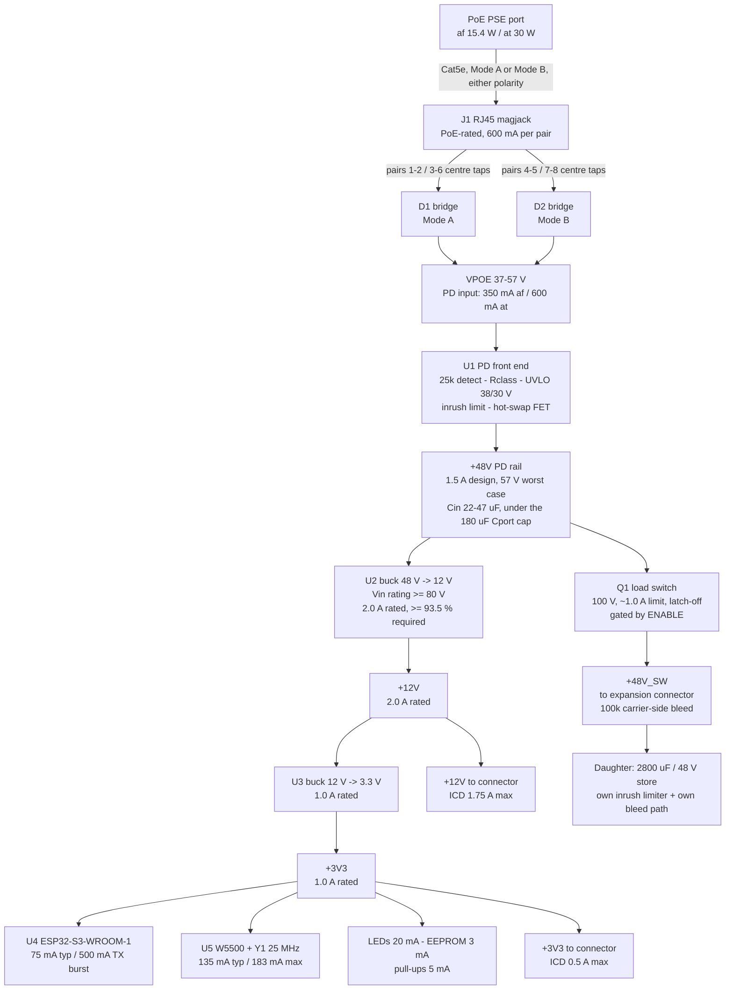

# Power architecture - LUMINA carrier (LUM-CAR-A)

P1 research fragment, `research-power-architect`. Source of record:
`architecture/requirements.md` (sections 0, 2.1, 3, 4, 8, 9) and the briefs it quotes.
Machine-readable twin: `research/power.json`.

Scope: rails, topology, current budgets, dissipation, sequencing. **Not** part numbers
(component-scout / part-sourcer own those) and not schematics.

Net names below are the proposed convention. They are **not final** - re-key every
`power.json` entry against the P4 netlist before merging into `constraints.json`.

---

## 0. Headline

1. **The budget closes on af and on at, with 12-16 % PD-input margin, and 8.5 W / 18.5 W
   to the light engine survives unchanged.** But the brief's intermediate "~10 W regulated
   available, minus 1.5 W carrier overhead" double-counts regulator loss. Replace it with a
   single computed overhead: **2.44 W (af) / 3.75 W (at)** worst case. The 1.5 W allocation
   is ~40 % low; the 8.5 W figure is still right because the AN956 10 W number was
   conservative for a non-isolated buck.
2. **Taking daughter power on +48V_SW instead of +12V is worth 1.5 W at the at operating
   point** (no conversion loss) **and removes the board's only real hot spot.** This is a
   second, independent argument for D-02 and belongs in the ICD as guidance to daughters.
3. **The 48 V -> 12 V converter is the whole thermal problem.** At the at operating point
   with everything on 12 V it dissipates 1.35-1.94 W in a sealed, unventilated box whose
   internal air is already ~65-69 C at 40 C ambient. Build 1 (af, ~1.07 W) is comfortable;
   the at upgrade is marginal. Consequence for D-01: the upgrade stays a **board** resistor
   change, but it acquires an **enclosure** dependency (vents). Say so in the design doc
   rather than discovering it on the bench.
4. **Three components can silently pin the design to Type 1** and must be watched as
   carefully as the class resistor: (a) the PD controller must natively do 2-event / Type 2
   classification - an af-only controller breaks the resistor-only upgrade; (b) the magjack
   must be PoE-rated for 600 mA/pair, not a data-only or af-only part; (c) the 48->12
   converter and its copper must be laid out for the at dissipation even though build 1
   never produces it.
5. **The provisional "48 V raw 2 A continuous / 3 A capability" is not a rail spec.** 2 A at
   48 V is 96 W on a 25.5 W supply. It is a *connector pin* rating (fine, cheap, keep it).
   The rail's hardware limit should be **1.0 A** and the ICD's sustained limit **0.25 A (af)
   / 0.5 A (at)**. See OPEN 1.
6. **IEEE 802.3 caps PD port capacitance at ~180 uF.** The daughter's 2800 uF bank is 15x
   that. The 48 V load switch is therefore a *compliance* requirement, not only the
   CAR-REQ-14 protection feature: it must be OFF through PD power-up and inrush, and only
   close after firmware asserts ENABLE.

---

## 1. Rail tree

Three rails only, per D-02. **No 5 V rail** - nothing on the carrier needs one, and adding
one would add a fourth conversion loss to a 10 W budget.

---

## 2. Power budget - both columns (gate 2 / D-01 deliverable input)

Design operating point = deliver the brief's full light-engine allocation, with the daughter
taking it on **+12V** (worst case for the carrier; see section 3 for the +48V_SW case).

| Stage | 802.3af - build 1 | 802.3at - upgrade |
|---|---|---|
| PSE port output | >= 15.4 W | >= 30 W |
| Guaranteed at PD input (100 m Cat5e) | **12.95 W** | **25.5 W** |
| PD input voltage / standard max current | 37-57 V / 350 mA | 42.5-57 V / 600 mA |
| Class programmed (resistor only) | Class 3 | Class 4 |
| - magjack PoE-path DCR (~0.7 ohm) | -0.03 W | -0.14 W |
| - input bridge, one of two conducts, 2 x Vf | -0.19 W | -0.40 W |
| - hot-swap FET + sense resistor | -0.04 W | -0.16 W |
| **at the +48V node** | **10.68 W** | **21.55 W** |
| - 48->12 buck loss (90 % af / 91 % at) | -1.07 W | -1.94 W |
| **at the +12V rail** | **9.61 W = 0.801 A** | **19.61 W = 1.634 A** |
| - 12->3.3 buck loss (88 %) | -0.33 W | -0.33 W |
| **at the +3V3 rail** | **2.43 W = 0.736 A** | **2.43 W = 0.736 A** |
| - carrier silicon on +3V3 (section 4) | -0.78 W (236 mA) | -0.78 W (236 mA) |
| **Delivered at the expansion connector** | **8.50 W** | **18.50 W** |
| ... of which +3V3 (Q6 provisional) | 1.65 W = 0.50 A | 1.65 W = 0.50 A |
| ... of which +12V and/or +48V_SW | 6.85 W | 16.85 W |
| **PD input actually consumed** | **10.94 W** | **22.25 W** |
| PD input current at V_min / at 48 V | 0.296 A @ 37 V / 0.228 A | 0.524 A @ 42.5 V / 0.464 A |
| **Headroom against the class limit** | **2.01 W (15.5 %)** | **3.25 W (12.7 %)** |
| **Carrier overhead (input - delivered)** | **2.44 W** | **3.75 W** |

Both current figures sit inside the standard's 350 mA / 600 mA PD limits with margin, so the
class limit binds on power, not on current.

**Reconciliation with the brief.** `00` section 5.1 chains "12.95 W in -> ~10 W regulated
available -> minus 1.5 W overhead -> 8.5 W out". The 10 W AN956 number already absorbs the
front end *and* the first conversion stage (77 % overall, typical of an **isolated flyback**);
the 1.5 W then adds regulator loss a second time. With the provisional non-isolated buck the
chain above reaches 8.5 W delivered from 10.94 W input - 84 % end-to-end, 2.01 W to spare.
Recommendation: drop the 10 W intermediate figure, keep 8.5 W / 18.5 W as the binding
allocation, and restate the carrier overhead as **2.44 W (af) / 3.75 W (at)** pending
prototype measurement. Both remain judgement figures until measured (`00` section 5.1).

**If Q5 flips to an isolated flyback** (80 % on the first stage instead of 90 %): the af
column needs 12.36 W of PD input for the same 8.5 W out - **0.59 W of margin, 4.6 %.** That
does not close with any confidence. Either the light-engine budget drops to ~7 W or build 1
goes to at. Q5 is therefore worth ~1.5 W of delivered power on af; see OPEN 2.

---

## 3. Sustain vs survive

This is the distinction the brief flags in `00` section 5.2 and it is the single most
misread part of this board's spec. **Per-rail hardware ceilings and the total sustained
envelope are different numbers and both are real.**

| Rail | Must SUSTAIN (set by PoE, shared across all rails) | Must SURVIVE (set by hardware, per rail) |
|---|---|---|
| `+48V_SW` | af 0.25 A / at 0.5 A, and only if the other rails are idle | 1.0 A load-switch limit; dead short or mis-seat -> current limit + latch-off, no damage to the PD front end (CAR-REQ-14); connector pins rated 2-3 A per Q6 |
| `+12V` | af 0.80 A / at 1.63 A total, of which 0.23 A is the carrier's own 3.3 V branch | 2.0 A converter rating with hiccup/latching OCP; a shorted daughter must fold back, not damage the stage |
| `+3V3` | 0.736 A (0.236 A carrier + 0.50 A daughter) | 1.0 A converter, current limit >= 1.3 A; 1.21 A ms-scale peak (Wi-Fi TX + W5500 TX + daughter) served by local bulk, not by the converter |
| **Total to the daughter** | **8.5 W (af) / 18.5 W (at)** across all three rails combined | -- |

The total envelope is enforced by three nested mechanisms, outermost last:
firmware's average-energy governor -> the carrier's per-rail current limits -> the PD
controller's own limit -> the PSE's overload timer (~50-75 ms, after which the port drops
and the fixture goes dark until it re-detects). **Only the first is graceful.** Everything
above the governor is a failure mode, which is why a carrier-side current monitor is worth
its BOM cost (section 8).

**Strobe arithmetic, for the ICD and the daughter runs.** 2800 uF over the D-02 48 -> 40 V
window stores 0.99 J (matches the brief's "1 J"); a full 0 -> 48 V charge is 3.23 J.

| Question | af | at |
|---|---|---|
| Max full-window (48->40 V) flash rate the rail can sustain | 8.6 Hz | 18.8 Hz |
| Energy per flash at the SYS-REQ-03 ceiling of 25 Hz | 0.34 J | 0.74 J |
| Bank droop per flash at 25 Hz | 48 -> 45.4 V | 48 -> 42.1 V |
| Cold-start charge time at the ICD limit | 0.54 s @ 0.25 A | 0.27 s @ 0.5 A |

So SYS-REQ-03's 1-25 Hz range is reachable on af, at reduced per-flash energy above ~8.6 Hz.
That is a governor policy question for the strobe run, not a carrier hardware limit - but the
carrier must be the thing that *cannot* be talked out of the limit, hence the load switch.

**Steering the at headroom.** Same 18.5 W delivered, but taken on `+48V_SW` instead of
`+12V`: PD input falls from 22.25 W to 20.71 W (**1.54 W saved**, 18.8 % headroom instead of
12.7 %) and the 48->12 stage's loss falls from 1.94 W to 0.45 W - the hot spot disappears.
Recommend the ICD state this explicitly so daughter designers know where the cheap watts are.

---

## 4. Per-rail consumers and topology

### 4.1 `VPOE` - rectified PoE input, 37-57 V

| Consumer | typ | peak | basis |
|---|---|---|---|
| PD front end U1 (detect / class / hot-swap) | 0.228 A af, 0.464 A at | 0.350 A af, 0.600 A at | IEEE 802.3 Type 1 / Type 2 PD maximum input current; the typ figures are this budget's operating point |
| classification event | -- | 0.040 A @ <= 20 V, < 75 ms | 802.3 class-current window; transient, into U1 |

Topology: **two diode bridges, one per PoE mode, outputs paralleled.** Mandatory for
802.3 compliance (Mode A / Mode B, either polarity) - not a design choice. Tradeoff: a
low-Vf bridge (Vf <= 0.5 V at 0.6 A) costs a few cents more than standard silicon and buys
0.36 W at the at operating point plus one fewer part needing a copper pour.

Only one bridge conducts at a time, but which one is the installer's cable and the switch's
mode - so **both** bridges need the same copper.

### 4.2 `+48V` / `+48V_SW` - PD rail and its switched pass-through

| Consumer | typ | peak | basis |
|---|---|---|---|
| U2, 48->12 buck input | 0.222 A af / 0.449 A at | 0.470 A | section 2 chain |
| Q1 load switch -> `+48V_SW` -> daughter | 0.25 A af / 0.50 A at (ICD limit) | 1.0 A (switch limit) | cap-bank charge current; see section 3 |
| `+48V` net worst case | -- | **1.5 A** | buck at max + switch at its limit, briefly, off the local bulk cap |
| carrier bleed 100k on `+48V_SW` | 0.5 mA | 0.5 mA | 23 mW; de-energises the connector pins when ENABLE is low |

Topology: **direct switched pass-through, no regulation.** The only topology that can present
48 V, zero conversion loss, and the entire reason D-02 collapses the strobe bank from
~33 000 uF to ~2800 uF. Costs: a 100 V-rated load switch, a fuse or equivalent behind it in
case the FET fails short, and 0.6 mm creepage everywhere the net goes (section 6).

The load switch does four jobs, and it is worth being explicit that it is not optional:
1. keeps the daughter's 2800 uF outside the ~180 uF 802.3 Cport window during PD power-up;
2. CAR-REQ-14 survivability against a shorted or mis-seated daughter;
3. the hardware half of the fail-safe ENABLE chain (CAR-REQ-08);
4. de-energises the 48 V connector pins whenever firmware is not running.

### 4.3 `+12V` - regulated daughter rail

| Consumer | typ | peak | basis |
|---|---|---|---|
| U3, 12->3.3 buck input | 0.231 A | 0.34 A | 2.43 W out / 88 % = 2.76 W |
| daughter `+12V` (ICD limit) | 1.75 A | 1.75 A | 2.0 A converter rating less the 0.23 A carrier branch |
| **rail design** | | **2.0 A** | at-case realistic max is 1.634 A; the PD current limit, not the converter, is what actually binds |

Topology: **non-isolated synchronous buck, Vin rating >= 80 V** (not 60 V - see section 6).
Tradeoff: an LDO here would dissipate (48-12) x 1.63 = 59 W, so this is a buck or nothing;
the real choice is buck vs isolated flyback and that is Q5, worth ~10 points of efficiency
and ~1.5 W of delivered power (section 2).

### 4.4 `+3V3` - carrier logic and daughter logic/sense

| Consumer | typ | peak | basis |
|---|---|---|---|
| U4 ESP32-S3-WROOM-1 | 75 mA | 500 mA | datasheet: Wi-Fi TX 802.11b DSSS 1 Mbps at +21 dBm = 355 mA typ, and the module datasheet asks for a supply able to deliver >= 500 mA. Sustained budget is CPU 240 MHz dual core with the radio in modem-sleep (datasheet band 40-68 mA) plus flash access. Q8 makes the radio a debug fallback, so TX is a burst, never sustained - but it must not brown the rail out |
| U5 W5500 | 135 mA | 183 mA | datasheet 100 Mbps link-up + transmitting, 132 mA typ / 183 mA max. **Includes** the 100BASE-TX line drive into the magjack, so the magnetics are not a separate line item |
| J1 magjack, data side | 0 | 0 | passive; its PoE-path loss is counted on the 48 V side |
| Y1 25 MHz crystal + load caps | < 1 mA | < 1 mA | oscillator drive is inside the W5500 figure |
| status LEDs: 3 in the magjack + 1 board | 20 mA | 20 mA | 4 x 5 mA; driven from the W5500 open-drain LED outputs and an MCU GPIO (Q11 default) |
| ID EEPROM (24xx) | < 1 mA | 3 mA | uA standby, ~3 mA during a write |
| I2C + FAULT pull-ups, ID divider, ENABLE pull-down | 5 mA | 5 mA | 2 x 4k7 + 10k + divider |
| **carrier subtotal** | **236 mA = 0.78 W** | **712 mA** | +30 % headroom = 307 mA |
| daughter `+3V3` (Q6 provisional) | 500 mA | 500 mA | Q6 default; 1.65 W, which is 19 % of the whole af light-engine budget - see OPEN 4 |
| **rail design** | **736 mA** | **1212 mA (ms)** | converter rated 1.0 A, limit >= 1.3 A |

Topology: **buck from +12V.** An LDO would dissipate (12-3.3) x 0.736 = 6.4 W - a fifth of
the entire at budget - so it is not a candidate. Noise: the two sensitive loads are the
W5500's 100BASE-TX line driver and the ESP32-S3 radio; neither needs its own rail (the W5500
regulates its own core internally and only wants a decoupled 1V2 pin), so the answer is a
ferrite bead plus local bulk on each, not a fourth regulator. The switching node of U2 is the
thing to keep away from Y1 and the differential pairs (section 7).

The chain **48 -> 12 -> 3.3** is mandated by D-02 and is also the technically better choice: a
direct 48 -> 3.3 buck runs at 6.9 % duty, which at 500 kHz is a 138 ns on-time - at or below
the minimum on-time of many parts - and would need a second >= 60 V-rated converter.

`GND` is deliberately absent from `power_constraints`: it is a plane, not a routed net, and
declaring it would make `check_current` demand IPC width on every short GND stub. The
requirement is structural instead - a continuous plane under the whole power path, and
>= 4 connector pins (section 4.1 of the brief) carrying the ~2.4 A aggregate return.

---

## 5. Dissipation and thermal first pass

### 5.1 Per element

| Element | af (build 1) | at (upgrade) | flagged |
|---|---|---|---|
| U2, 48->12 buck | 1.07 W | **1.35 W required / 1.94 W typical part** | **YES - dominant** |
| D1 or D2, conducting bridge | 0.19 W | 0.40 W (0.76 W if standard silicon) | yes, defensively |
| U5 W5500 | 0.45 W | 0.45 W (0.60 W max) | no - see below |
| U3, 12->3.3 buck | 0.33 W | 0.33 W | no |
| U4 ESP32-S3 module | 0.25 W | 0.25 W | no |
| J1 magjack PoE path | 0.03 W | 0.14 W | no |
| U1 PD front end, steady | 0.04 W | 0.16 W | no |
| U1 during classification | 0.8 W for < 75 ms | same | transient, SOA not theta_JA |
| U1 during inrush (47 uF to 57 V) | ~0.08 J over ~50 ms | same | transient, SOA |
| Q1 load switch, steady | 0.02 W | 0.02 W | no |
| Q1 into a shorted daughter | 48 W at the 1.0 A limit | same | **SOA + latch-off < 1 ms mandatory** |

W5500 is not given a `thermal` entry on purpose: 0.45 W sustained is below the flag, its
0.60 W maximum needs 100BASE-TX saturated (a 60 fps UDP stream is nowhere near that), and a
48-LQFP has no exposed pad - a `min_vias` demand on it would be unsatisfiable and would fail
P8 for no engineering reason. A copper pour under it is a layout note, not a constraint.

### 5.2 Enclosure, with the provisional Q13 answer

Assuming Q13's default (0-40 C ambient, sealed, natural convection) and Q4a's default (LEDs
on a separate external module, so only the driver loss is inside the box):

| | af build 1 | at upgrade |
|---|---|---|
| carrier dissipation | 2.44 W | 3.75 W |
| daughter driver loss (~15 % of delivered) | ~1.3 W | ~2.8 W |
| total inside the enclosure | ~3.7 W | ~6.6 W |
| internal air rise, 110 x 90 x 45 mm plastic box (0.038 m2, h ~ 6 W/m2K) | ~16 C | ~29 C |
| **internal air at 40 C ambient** | **~56 C** | **~69 C** |
| U2 junction (repo screen, theta ~51 C/W on 4L saturated pour) | ~111 C | ~138 C |
| U2 junction (realistic, 12-via array to an inner plane, ~35 C/W) | ~93 C | ~116 C |

**Findings.**
- Build 1 (af) is comfortable in a sealed box on any reasonable part.
- The at upgrade is marginal-to-failing in a *sealed* box at 40 C ambient. The fix is not a
  board change - it is enclosure vents, a larger box, or a confirmed lower ambient. At a
  realistic basement ambient of 25 C the at case lands at ~101 C junction and closes.
- **D-01 is preserved either way**: the upgrade is still a resistor change on the *board*.
  It acquires an *enclosure* dependency, which must be written down now (OPEN 3).
- The board must nevertheless be laid out for the at dissipation - copper, vias, separation -
  or the layout becomes the thing that pins the design to Type 1.

### 5.3 The constraint declared for U2, and why it is a requirement

`thermal_constraints` declares U2 at **1.35 W, dt_c 70, min_vias 12**. That corresponds to
**93.5 % efficiency at 48 V in, 12 V / 1.63 A out**. This is a *selection requirement placed
on the scout*, not a prediction: a mediocre 60 V monolithic buck at 91 % loses 1.94 W and
**cannot pass `check_thermal` at any dt_c below 100 C on 4 layers**, because the model's
theta_JA bottoms out at ~51 C/W with a saturated pour. If the selected part exceeds 1.35 W,
change the part or change the enclosure answer - **do not quietly raise dt_c.**

**This constraint also decides the stackup.** 1.35 W at dt_c 70 passes on 4 layers
(1.35 x 51.1 = 69 C) and fails on 2 layers (1.35 x 73.9 = 100 C). Combined with the 100BASE-TX
differential pairs and the 48 V creepage burden, **4-layer is required**, not preferred.

### 5.4 CAR-REQ-18, with no airflow

Q13's default removes airflow as an option, so CAR-REQ-18 must be answered by separation. In
a stacked mezzanine (Q4 default: daughter 15 mm above) the daughter's drivers sit *vertically
over* the carrier, so an in-plane separation rule on the carrier alone does not answer it.
The real answer is an **ICD-01 keep-out**:

- put the DC-DC block (U2, its inductor, its input/output caps, Q1) in one corner of the
  board - proposal: a ~30 x 30 mm zone diagonally opposite the RJ45;
- declare that zone a **hot zone** in `architecture/connector-icd.md`, with the (x, y) region
  in the shared footprint's coordinates;
- require every daughter to keep its LED drivers **and its aluminium electrolytics** out of
  the corresponding region. Electrolytic life halves per 10 C, and internal air is already
  56-69 C.

Same reasoning applies to the carrier itself: **prefer ceramic or aluminium-polymer bulk over
aluminium electrolytic on the carrier**, since a 105 C electrolytic at 60 C internal air is
the shortest-lived part on the board.

`placement_hints.separation` in `power.json` carries the in-plane half (DC-DC away from the
magjack, crystal and ESP32 module) - that entry buys noise margin as much as thermal margin.

---

## 6. Voltage, creepage and derating

- **Rating basis is 57 V**, per requirements section 8, on `VPOE`, `+48V` and `+48V_SW`.
- `check_creepage` uses IPC-2221: 51-100 V -> **0.60 mm on outer layers, 0.10 mm on inner**.
  Every one of those three nets is > 30 V from *every* other net on the board, including
  GND and every signal, so **0.60 mm outer clearance applies board-wide around the 48 V
  copper** - not just at the connector. Budget for it in placement, not in a fix pass.
- ICD consequence: **no 48 V pin adjacent to a signal pin.** Flank `+48V_SW` pins with GND or
  with unpopulated positions. A 2.54 mm header clears 0.60 mm comfortably; a 1.27 mm one is
  where this gets tight.
- **Converter input rating: >= 80 V, not the 60 V minimum in CAR-REQ-02.** 60 V against a
  57 V worst case is 5 % margin, before any PoE transient, hot-plug ring or PSE turn-on
  overshoot. 80-100 V parts are common and the price delta is small.
- **Part exclusions restated (from `00` section 5.3, a correction and not an open question):**
  **LM2596** (40 V) and **LMR33630** (3.8-36 V) cannot be used anywhere on the PD rail.
- `voltages` entries for the magjack centre-tap nets are **missing on purpose** - those nets
  are not named until P3. They carry the full PoE common-mode voltage and P2/P3 must add
  them at 57 V.

---

## 7. Sequencing, inrush and MPS

1. **Detect** - 25.0 kohm +/-1 % signature across `VPOE`.
2. **Classify** - Rclass programmed **Class 3** for af build 1 (needs > 6.49 W, so Class 0
   would under-declare and leave the PSE budgeting blind). Upgrade = **Class 4** resistor.
   **The PD controller must natively support 2-event / Type 2 classification**, or the
   "resistor change only" upgrade path does not exist. Exact resistor values come from the
   selected controller's datasheet.
3. **UVLO** - turn-on ~38-42 V, turn-off ~30-32 V with hysteresis, per 802.3.
4. **Inrush** - PD controller limits to ~100-400 mA while charging Cin. Keep carrier bulk at
   **22-47 uF**, an order of magnitude under the ~180 uF Cport ceiling. **The daughter's
   2800 uF must not be on the rail here** - that is Q1's first job.
5. **+12V soft-start**, then **+3V3 soft-start**. The order is inherent to the chain; no
   sequencer needed.
6. **+3V3 POR -> ESP32-S3 boots. ENABLE stays low**, held by a carrier-side 10k pull-down -
   *not* by the MCU, whose GPIO is high-Z in reset (CAR-REQ-08).
7. **Firmware asserts ENABLE** after boot and after reading the daughter ID -> Q1 turns on
   with limited dV/dt -> the daughter's own inrush limiter charges the bank at <= the ICD
   limit (0.25 A af / 0.5 A at, i.e. 0.54 s / 0.27 s from cold).
8. **Governor active** before the first strobe command is honoured.

**Fail-safe direction of travel.** +3V3 sags or the MCU resets -> GPIO high-Z -> the
pull-down de-asserts ENABLE -> Q1 opens -> `+48V_SW` is bled by the carrier's 100k and the
daughter's own bleed path (CAR-REQ-17) discharges the bank. Everything fails towards
de-energised. (The full CAR-REQ-08 analysis - mid-update, brownout - is a schematic sign-off
artifact; this is only its power half.)

**Maintain Power Signature.** 802.3 requires the PD to keep drawing >= ~10 mA or the PSE may
remove power. The carrier's floor draw is ~29 mA at 48 V (silicon + converter losses), so MPS
is satisfied inherently - **provided the ESP32-S3 never enters deep sleep** (7 uA). Write that
into the firmware constraints: on this board, sleep states below modem-sleep drop the port.

---

## 8. Recommendation outside the brief: carrier-side rail current sense

The governor is currently specified as an open-loop energy model in firmware. It is the only
graceful mechanism protecting a 12.95 W supply from a daughter that can ask for 96 W, and it
has no feedback. A high-side current sense on `+48V` into a spare ESP32-S3 ADC (sense
resistor plus a small current-sense amplifier) makes it closed-loop and costs two parts. The
expansion connector's 2 ADC pins are already spoken for by daughter-side sensing (section 4.1
of the brief), so this needs its own MCU pin.

Not a requirement in any brief - offered as an architecture recommendation, cheap relative to
what it prevents (a PSE port trip mid-show).

---

## 9. Provisional assumptions

Marked provisional because the human has not confirmed them. All are carried in
`power.json.provisional_assumptions` with the same status.

| # | Assumption | Adopted? | What changes if it flips |
|---|---|---|---|
| P1 | Non-isolated buck on the PD rail; plastic enclosure; Ethernet the only external connection (Q5 default) | yes, provisionally | Isolated flyback costs ~10 points on the first stage: af margin falls from 2.01 W to 0.59 W and does not close. See OPEN 2 |
| P2 | Worst-case daughter draw 48 V 2 A cont / 3 A capability (Q6 default) | **no - corrected**, see OPEN 1 | -- |
| P3 | Worst-case daughter draw 12 V 2 A (Q6 default) | yes as the **converter rating**; ICD limit set to 1.75 A | 2 A sustained on 12 V is 24 W, above even the at envelope; it is a rating, not a load |
| P4 | Worst-case daughter draw 3.3 V 0.5 A (Q6 default) | yes | 1.65 W is 19 % of the af light-engine budget for daughter *logic*. See OPEN 4 |
| P5 | 0-40 C ambient, sealed unventilated enclosure, natural convection (Q13 default) | yes, and it is the binding thermal constraint | See section 5.2 and OPEN 3 |
| P6 | CAR-REQ-18 answered by physical separation, not airflow | yes | Section 5.4; becomes an ICD keep-out, not just a placement rule |
| P7 | Carrier overhead 1.5 W (`00` section 5.1, flagged as judgement) | **no - revised to 2.44 W af / 3.75 W at** | Section 2. The 8.5 W / 18.5 W delivered figures are unaffected |
| P8 | ESP32-S3-WROOM-1 module, radio functional but unused (Q7/Q8 defaults) | yes | A bare chip does not change the rail tree; a permanently disabled radio would let the +3V3 peak budget drop from 500 mA to ~120 mA |

---

## 10. Constraints emitted

`research/power.json` carries, for the P2 architect to merge into `constraints.json`:

- `power_constraints` -> `constraints.json["power"]` - 5 nets, widest is `+12V` at 2.0 A
  (1.100 mm on 1 oz at dT 10; 1 oz is sufficient, no 2 oz stackup needed).
- `voltage_constraints` -> `constraints.json["voltages"]` - the schema key has no slot in the
  agreed `power.json` shape, so it is carried under its own key. **Add the magjack centre-tap
  nets at 57 V once they are named.**
- `thermal_constraints` -> `constraints.json["thermal"]` - 3 entries. **Refdes are proposals.**
  `check_thermal` exits 2 on a refdes with no pads, so every entry must be re-keyed or
  deleted at P3.
- `placement_hints` -> `constraints.json["placement"]["separation"]` - same refdes caveat.

Via counts implied by `check_current` (`ceil(current_a / via_amps)` per via cluster):
`+12V` 4, `+48V` 3, `+48V_SW` 2, `+3V3` 2, `VPOE` 2.

---

## OPEN

**1. The 48 V raw rail must not be specified at 2-3 A. Recommend 1.0 A hardware, 0.25/0.5 A
in the ICD.** Q6's default reads as a rail spec; 2 A at 48 V is 96 W on a 12.95-25.5 W
supply, and 3 A of stored-energy fault current at 48 V through a mezzanine connector is a
real arc/energy hazard on hot-unplug. Split the number: keep 2-3 A as the *connector pin*
rating (CAR-REQ-13 margin, cheap), set the load-switch current limit to **1.0 A with
latch-off**, and put **0.25 A (af) / 0.5 A (at) sustained** in the ICD as the daughter's
budget. Confirm.

**2. Q5 (isolated vs non-isolated) is worth ~1.5 W of delivered power on af and needs the
answer before P2 commits.** Non-isolated closes with 15.5 % margin; isolated closes with
4.6 %, which is not a margin. Requirements section 8 already marks Q5 blocking - this
quantifies why. Recommend: **confirm non-isolated + non-conductive enclosure**, and note the
bench consequence (the whole board floats at PoE potential - an earthed scope needs an
isolated injector or a differential probe).

**3. The at upgrade needs enclosure ventilation, or a confirmed ambient below ~30 C.** In
Q13's sealed box at 40 C ambient, internal air reaches ~69 C at the at operating point and
the 48->12 converter junction lands at 116-138 C. Recommend: **vents in the enclosure as a
documented dependency of the at upgrade** (not a board respin, so D-01 survives), **or**
confirm the real basement ambient is 0-30 C, in which case the sealed box closes. Which?

**4. Is 0.5 A of 3.3 V really needed at the connector?** It is 1.65 W - 19 % of the entire
af light-engine budget - spent on daughter *logic and sense*. A strobe or par daughter's
logic is a few tens of mA. Recommend **0.25 A in the ICD** with the converter still rated
1.0 A, so raising it later is a documentation change and not a hardware one. Confirm or
override.

**5. The PD controller and the magjack must both be Type 2-capable parts, or D-01's
resistor-only upgrade is not real.** Type 2 requires 2-event physical-layer classification
(or LLDP) in the controller, and 600 mA/pair PoE rating in the magjack. This is a hard input
to component-scout, flagged here because it is a power-architecture consequence of D-01 that
the requirements do not spell out. No answer needed - it is a constraint, recorded so it
cannot be lost.
