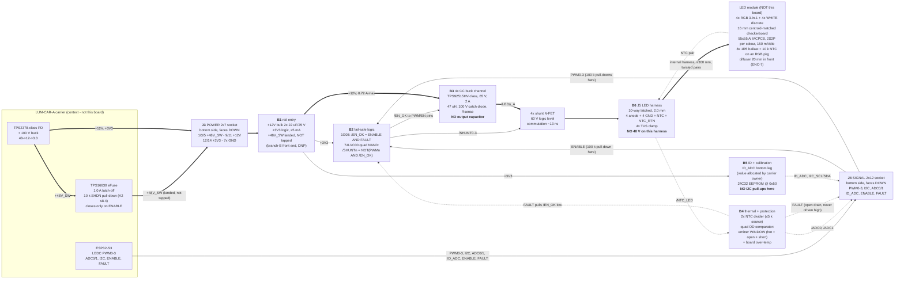

# lumina-par (LUM-PAR-A) - block diagram

RGBW par daughter for the LUMINA fixture set. Four independent constant-current
LED channels, PWM-dimmed, on the ICD-01 expansion connector. No MCU, no radio,
no external connector. The emitters are **not on this board** (B6).

Baselined on **ICD-01 rev A2** (2026-07-28): board-wide HV clearance **0.635 mm**
(was 0.60), and new s8.4 - the carrier's TPS16630 load switch carries a mandatory
10 k SHDN pull-down, so an unprogrammed, crashed, browned-out or reset carrier
presents **0 V at J3**, not 48 V.

**REVISION B - P2 delta after the H1 checkpoint (2026-07-28).** The human approved
H1 and directed four changes (`decisions.md` s0). Only one of them touches this
board's blocks: **H1-Q2 replaced the integrated RGBW 4-in-1 with an RGB 3-in-1
plus a separate white discrete**, which changes the light engine and nothing
electrical on the daughter. **The four driver channels, the four PWM lines, the
gating logic, the protection chain and the 10-way harness are all unchanged** -
see D4' below and B6.

Five architecture-level results decide everything below. Each is argued with
numbers in `decisions.md`. **D1 and D4 were H1 questions; both are now answered.**

1. **D1 (ANSWERED AT H1). The LED stage runs from `+12V`** - the project's
   standing instruction and D-02's stated purpose for that rail. **This is not
   reopened.** The three research arguments for `+48V_SW` are engaged and answered
   in `decisions.md` D1. The biggest one - "16x LED-current slew" - **does not
   survive being recomputed**: once each rail gets an inductor sized for the same
   ripple fraction, the total converter edge budget is `1/(f*k)` and **the rail
   voltage cancels out of the algebra entirely** (4.76 us on both rails at
   700 kHz / 30 %). It is moot in any case, because shunt-FET dimming means the
   converter never slews the LED current at all.
2. **D2. Dimming is done by a shunt FET across each string, not by gating the
   converter.** That is what makes PAR-REQ-01's 141 ns response budget reachable
   at all, and it is the only part of the PAR-REQ-01 fix that is this board's
   hardware. **H1-Q3 confirmed the strict gamma-2.2 reading and the carrier
   committed to PWM-domain dithering, so PAR-REQ-01 is now recorded MET** - by
   hardware plus a **named** firmware dependency that must not be silently dropped
   (`decisions.md` D12).
3. **D3 (AMENDED). The emitters live off-board on an aluminium MCPCB**, and after
   H1-Q1 that is **structural, not preferential**: the enclosure conducts emitter
   heat through the wall, and an emitter soldered to this daughter cannot reach
   the wall bridge at all. On 1.6 mm FR4 the path is 33-52 K/W and straddles or
   fails; on MCPCB it is 19-23 K/W. **The on-board fallback is dead**
   (`stackup.md` s6).
4. **D4' (SUPERSEDES D4). Per-die drive current is 150 mA (af), 2S2P per channel,
   on 4x RGB 3-in-1 + 4x white discrete = 8 packages.** Re-derived from the live
   Vf figures in `power_tree.md` s1.2. **All four channels stuck at 100 % draws
   0.717 A on `+12V`** - 95.6 % of the 0.75 A sustained ceiling, 35.9 % of the
   2.0 A OCP, 3.4x inside the PD's 0.85 A minimum current limit. The board remains
   electrically incapable of exceeding its own budget.
5. **D5. Two temperature sensors, two jobs, and no thermal foldback.** A window
   comparator on the module NTC (fail-safe against a broken harness wire) plus a
   board NTC on the hottest driver stage. Foldback is banned: it is analogue
   current dimming by another name (PAR-REQ-08) - `decisions.md` D5 resolves the
   conflict between two research fragments here.
6. **D14 (NEW). PAR-REQ-15 is now the live risk and has a buildable spec.** With
   white on its own package, white/colour shadow fringing is a real failure mode.
   The mitigation is a **centroid-matched 16 mm checkerboard on the MCPCB plus a
   specified diffuser**, with numbers and a bench test, in `stackup.md` s5.2.
   **None of it is on this board**, but it constrains the module and the enclosure
   and it costs 30-45 % of the fixture's flux.



Thick arrows are power; dotted arrows are sense/status. Everything crossing J5
is <= 6.8 V by construction on branch A (<= 13.6 V on branch B, <= 27.2 V at the
`at` operating point) - **no 48 V net reaches the harness**, which keeps the
0.635 mm clearance rule, the 100 V capacitor rule and the 0805 resistor rule off
the harness and off the module (D-T13).

---

## B1 - Power entry (sheet `power`)

**J3** is a **CONNFLY DS1023-2*7SF11** 2x7 socket (14 pos, 2.54 mm, 600 V,
3 A/contact, 8.5 mm body), **reverse-mounted on the bottom side facing down**
(ICD s7.3). Second sources on the same land pattern: HanElectricity 2541FV,
Boomele 2.54-2*7P, HCTL HC-PZ254. All JLC Extended - there is no Basic
board-to-board part in any family, which is a catalogue fact, not a selection
error.

Three rails arrive; on branch A only two are loaded.

| Net | J3 pins | Loaded on branch A? | Draw |
|---|---|---|---|
| `+12V` | 9, 11 | **yes - the LED rail** | 0.72 A max (stuck-PWM worst-Vf) |
| `+3V3` | 12, 14 | yes - logic and sense only | <= 5 mA |
| `+48V_SW` | 1, 3, 5 | **no** - landed, not tapped | 0 A |

**`+48V_SW` is landed but not tapped.** The three pins go to a named net that
terminates only at a DNP 0805 bleed footprint and one test pad. Why land it at
all rather than leave the pads floating:

- The net becomes visible to `check_creepage` at P8, so the **0.635 mm
  outer-layer clearance is enforced by the tool** rather than by hope. ICD s5.4
  makes that clearance board-wide and unconditional - the pads exist whether or
  not the board taps the rail (D-T25).
- The rail becomes measurable at bring-up without a probe on a bare pad. Any such
  test point carries the ICD s9 bench-hazard silkscreen: the whole fixture floats
  at PoE potential, and an earthed probe **breaks PD signature detection
  outright** (detection currents are a few hundred microamps).
- **CAR-REQ-17's bleed obligation is not triggered**, because no energy is stored
  on the net (no bulk capacitance, no series element). The bleed footprint is
  fitted DNP so the obligation is met the instant any 48 V bulk is added.

The ICD s5.2 land pattern already gives **0.84 mm** of pad-to-pad copper gap
against the 0.635 mm requirement (1.32x), so on branch A the HV regime costs this
board **nothing in routing area** - it is satisfied by the connector footprint
alone and never touches the driver area.

**Branch B front end, DNP** (populate only if the human overrides D1): high-side
100 V P-FET with a gate-to-drain capacitor setting dV/dt, gate pulled up to the
raw 48 V and pulled down through a series resistor from `/EN_OK`; 100 k 0805
bleed; 2x 10 uF/100 V bulk. Sizing target **<= 0.30 A inrush** - against the
TPS2378's **0.85 A minimum** current limit (E-6), not its 1.0 A typical and
emphatically not the connector's 5.4 A. dV/dt 15 V/ms gives a 3.2 ms ramp and
23 mJ of FET SOA energy, which must be checked at 56-72 C ambient, not at the
datasheet's 25 C case (E-5, L-14).

`+12V` bulk on branch A: **2x 22 uF/25 V X7R + 4x 4.7 uF/25 V local** at the
driver VIN pins. There is no inrush limiter on `+12V`: the rail is produced by
the carrier's always-on 100 V buck and is current-limited at 2.0 A by its OCP,
and the daughter's total capacitance (~40 uF nameplate, ~25 uF effective after DC
bias) charges through the carrier's own converter, not through the PD hot-swap
FET. **This is a claim to verify at P3**, because a 2.0 A step on `+12V` reflects
to ~0.55 A at 48 V (D-T25). The ENABLE gate is what bounds it: the drivers cannot
start until firmware asserts ENABLE, by which time the rails are established.

### How ICD rev A2 s8.4 changes the power-up story

A2 s8.4 guarantees `+48V_SW` = 0 V whenever the carrier is unprogrammed, crashed,
in brownout or held in reset. Consequences, both directions:

- **Branch B gets simpler.** The daughter's 48 V bulk can only ever be charged
  after firmware asserts ENABLE, so the hot-swap FET is gated purely from
  `/EN_OK` with no sequencing logic and no race against an already-live rail. The
  ICD s7.3 "48 V may arrive before or after 3.3 V" tolerance becomes a mating-order
  concern only, not an operating-mode one.
- **Branch A carries a residual asymmetry that must be stated.** `+12V` comes off
  the carrier's always-on buck and is **live whenever the fixture is powered**,
  regardless of firmware state. So on branch A, ICD s8.3's rule - *"a daughter
  must not provide any path that energises its bank from `+12V` or `+3V3` while
  `+48V_SW` is off"* - is carried **entirely by the ENABLE AND gate** (B2), with
  no hardware rail interlock behind it. On branch B the same rule is satisfied
  twice over: the gate holds the drivers off *and* the rail is hardware-guaranteed
  dead. This is the one place where A2 s8.4 makes branch B genuinely stronger, and
  it is recorded rather than glossed.

## B2 - ENABLE gating and the fail-safe logic (sheet `control`)

**J4** is a **CONNFLY DS1023-2*12SF11** 2x12 socket, same mounting rules and same
second-source set.

**No surveyed constant-current driver has an enable pin separate from its PWM
pin** (led-driver.md risk 2: TPS92515HV, LM3414HV, LM3409, AL8863, PT4115 - none
of them). The ICD's active-HIGH ENABLE therefore has to be gated in external
logic. Because dimming is done by a shunt FET (D2), the per-channel gate is a
**NAND**, not an AND - the shunt is ON when the LED is OFF:

```
  /EN_OK   = ENABLE AND FAULT                  (SN74LVC1G08, SOT-23-5)
  /SHUNTn  = NOT( PWMn AND /EN_OK )            (74LVC00A quad NAND, one SO-14)
  driver PWM/EN pins  <- /EN_OK   (all four in parallel)
```

One SO-14 covers all four channels, as required. tPD 4.1 ns is nothing against a
102.4 us period and nothing against the 141 ns pulse either.

| Condition | `/EN_OK` | `/SHUNTn` | Shunt FET | Converter | Light |
|---|---|---|---|---|---|
| ENABLE low (unmated, mis-seated, reset, brownout) | 0 | **1** | ON, string shorted | off | none |
| ENABLE high, over-temperature (FAULT low) | 0 | **1** | ON | off | none |
| ENABLE high, PWM glitching ~60 us at power-up | 0 until firmware asserts | 1 | ON | off | **no-op** |
| Normal, PWM high | 1 | 0 | off | on | LED conducts |
| `+3V3` absent | low | low | off | off (PWM/EN pin low) | none |

Supporting rules, all from ICD s8.2 and D-T27/D-T28:

- **100 kohm pull-down at the ENABLE pin**, at the connector end, **before** any
  series element. With the carrier's 10 k this is 9.09 kohm; the carrier's
  push-pull GPIO sources 0.363 mA. Note it if any further load is added.
- **100 kohm pull-down on each of PWM0-3 at J4.** An unpowered or undriven
  carrier must not float a gate input high. Four resistors; do not skip them.
- **Combinational, never latched.** No state, nothing to clear; the whole chain
  de-asserts within one carrier reset. The over-temperature detector uses wide
  hysteresis, not a latch (B4).
- **`/EN_OK` also gates the branch-B charge path** (the hot-swap FET's gate
  pulldown), satisfying "gate every output stage with ENABLE - LED driver EN pins,
  gate drivers, the cap-bank charge path" in both branches.
- **No RC filter anywhere on PWM0-3 or `/SHUNT0-3`.** The reflex 1 k + 100 pF
  network is tau = 100 ns and would swallow the pulse PAR-REQ-01 is about. If any
  network is fitted at all, **tau <= 14 ns** (e.g. 33 R + 100 pF = 3.3 ns).
  Record the constraint on the schematic.
- Shunt-FET gate resistors **150 ohm**: bounds the 74LVC00 output current to
  22 mA and gives ~30 ns edges into a <= 3 nC gate. Each gate also carries a
  100 k pull-down so an unpowered gate IC cannot leave a FET half-on.

## B3 - The four constant-current channels (sheet `drivers`)

Lead candidate: **TPS92515HVDGQR** (Texas Instruments, MSOP-10-EP, 5.5-65 V in,
2 A internal FET). It is the only part in the P1 survey that backs its dimming
claim with real timing (`tPWM` 75 ns typ / 130 ns max rise, 100/170 ns fall,
`tLEB` min on-time 75/195/275 ns) **and** specifies the shunt-FET mode this
architecture depends on ("10,000:1 Shunt PWM Dimming Range"; "Shunt FET PWM
dimming can out-perform PWM dimming", with a dedicated OFF-timer behaviour for
the shunted-output condition). **That OFF-timer behaviour is the reason this part
and not a generic buck** - see the ripple note below. The same part serves both
rails, so **the D1 branch point does not change the driver family**, only the
passives, the string wiring and the clearance regime.

Second sources: **LM3414HVMRX/NOPB** (65 V, 1 A, 400 ns min on-time - adequate
under shunt dimming, where the converter never has to reproduce the pulse) and,
on branch B only, **LM3409HVMYX/NOPB** (9-75 V, **18 V / 32 % margin** at the
57 V worst case vs TPS92515HV's 8 V / 14 %). **AL8863SP-13 is rejected on branch
B** (60 V operating against a 57 V rail is 5 % of margin, and its datasheet
contradicts itself on PWM frequency: EC table 0.1-20 kHz vs application text
"< 500 Hz"); it survives as the branch-A cost-down fallback at 2.7x less money.

Per channel: driver IC, one **47 uH** shielded inductor, one 100 V catch
Schottky, one sense resistor, one 4.7 uF/25 V input ceramic at VIN, one 100 nF
bypass, one shunt N-FET (**60 V logic-level**, not 30 V), one 150 R gate
resistor, one 100 k gate pull-down.

Four rules that are load-bearing and easy to lose:

1. **No output capacitor across the LED string.** A shunt FET dumps it every PWM
   cycle: 1 uF at 6.8 V and 9.766 kHz is 0.23 W per channel, more than ten times
   the whole logic budget. The string sees the inductor ripple directly, which is
   what a hysteretic CC buck wants anyway.
2. **The inductor is sized for ripple, not for slew.** Under shunt dimming the
   converter never has to slew the LED current - the FET does. 47 uH at ~700 kHz
   gives dI = (12 - 6.8) x 0.567 / (700 kHz x 47 uH) = **90 mA, 30 % of the
   300 mA setpoint**. Once the inductor is set this way the converter's total edge
   budget is `1/(f*k)` = 4.76 us **on either rail** (`decisions.md` D1), which is
   34x the 141 ns requirement - so no rail choice and no inductor choice reaches
   PAR-REQ-01 by gating the converter, and the shunt FET is not optional.
   Branch B needs **265 uH** for the same ripple fraction (5.6x larger, because
   `Vin - Vs` is 34.4 V instead of 5.2 V at a lower setpoint current).
3. **Verify the shunted-output ripple at bench.** While the shunt FET is on, the
   converter regulates into a near short, so its duty collapses to ~0.5 % and it
   is driven to its minimum on-time (275 ns max). At 12 V into 47 uH that is a
   70 mA charge packet - 23 % ripple - which appears in the LED current for the
   first microseconds after the shunt opens. TPS92515HV's dedicated shunted-output
   OFF-timer exists for exactly this. **P3 must extract that behaviour from the
   datasheet and P8/bring-up must measure it**; it is the one place where a
   generic buck would quietly fail PAR-REQ-08.
4. **Every channel is identical** - same part, same topology, same passive
   values, red included (spec-dimming R8). Common-mode drift cancels in the
   colour ratio; differential drift does not, and differential drift is what
   breaks PAR-REQ-06. On branch A the red string's lower Vf (4.8 V vs 6.8 V) is
   absorbed by duty cycle, not by a different circuit - which is precisely why
   **2S2P for all four channels** was chosen over red-4S / GBW-2S2P.

**Optional, recommended: a converter-idle one-shot.** A channel commanded to
exactly 0 % still burns ~0.15 W, because the converter free-runs into the shunt
FET; four idle channels are 0.6 W, 7 % of the af envelope, and this is the state
a saturated-colour wash spends most of its time in. A retriggerable RC one-shot
per channel (one 74LVC14 hex Schmitt + 4x RC + diode, ~$0.30 and 12 passives)
drops the driver's PWM/EN pin after ~1 ms with no pulses and restores it on the
next edge. It is **not** a latch of ENABLE - it is ANDed with `/EN_OK`, so ENABLE
still kills it, and it clears itself. Fit it as a populate option; the default
strap ties PWM/EN straight to `/EN_OK`.

VIN abs-max margin is thin only on branch B: **8 V (14 %) at 57 V**. Mitigations
are all layout - minimise the VIN/GND input loop, 100 V ceramics at the pins, and
a DNP SW-node RC snubber footprint. If bring-up shows SW ringing above 65 V,
LM3409HV (75 V) is the schematic-level second source.

## B4 - Thermal sensing and firmware-independent protection (sheet `thermal`)

PAR-REQ-12 asks for over-temperature shutdown **independent of firmware**. Two
sensors, two jobs (D-T18) - not two sensors for one job.

| Sensor | Where | Duties |
|---|---|---|
| **RT_LED**, 10 k B3950, on the module | **on or within a few mm of an RGB PACKAGE's thermal-pad copper** - not a white one - two harness conductors | (a) `/ADC0` to the carrier for the temperature-referenced colour correction; (b) three window-comparator channels |

**Which package the module NTC sits on is now a real choice, and it has one right
answer.** With two package types on the MCPCB there are two thermal sites. At
150 mA/die the RGB package dissipates **1.035 W** of heat and the white **0.383 W**
(`power_tree.md` s6.1) - a 2.7x difference on a shared substrate. **The sensor
goes on an RGB package**, because that is the hottest site and because the red die
it contains is the one whose junction target (100 C) and flux-vs-temperature slope
(-0.5 to -0.9 %/K) drive both the protection threshold and the colour correction.
A sensor on a white package would read ~2.7x cooler locally and would let a broken
build pass. **This costs nothing: it is one placement instruction on the module,
not a second sensor and not an eleventh harness conductor** (B6).
| **RT401**, 10 k B3950 0603, on this board | on the copper of the hottest driver stage, **outside** the DC-DC hot zone (2,46)-(36,68) | (a) `/ADC1` to the carrier; (b) board over-temperature comparator |

A sensor on the daughter cannot protect the emitters (it measures internal air
plus driver self-heating - a lagging, wrong-magnitude proxy, D-T19). A sensor on
the module cannot protect a driver inductor cooking inside the enclosure. Hence
both, and hence **RT_LED's two wires are in the harness**, which is why J5 is
10-way and not 6-way.

**One physical sensor serves both the carrier ADC and the hardware shutdown**,
and the arithmetic is what makes it legal:

- The comparator's input bias is nA-to-pA, so paralleling comparator inputs onto
  the divider node adds no meaningful load. The ICD s3.3 requirement is unchanged.
- **Divider sizing: 10 k fixed leg + 10 k NTC gives a Thevenin source impedance
  of 5.0 kohm maximum at 25 C, falling monotonically as the NTC heats.** With a
  series R at the ADC pin held to **<= 1 kohm** including any filter, the total
  stays **<= 6 kohm** at every temperature of interest, against the ICD's
  **10 kohm** ceiling (D-T16, L-11).

**But a single-threshold comparator is fail-dangerous.** In *either* divider
orientation, an open NTC or a broken harness conductor **reads as cold** and
silently disables the protection - and a wire is the most likely fault in an
off-board module. So the emitter sensor feeds a **window** detector, not a
threshold detector (D-T17, E-10). One quad open-drain comparator (LMV339 /
TLV3704 class, rail-to-rail input, <= 50 uA/channel) plus a resistor reference
ladder off `+3V3` covers all four channels. Because the ladder and the carrier's
ADC reference both derive from `+3V3`, thresholds are ratiometric and independent
of rail accuracy.

| Ch | Trips when | Provisional threshold |
|---|---|---|
| CMP1 | emitter NTC hot | **90 C** solder point, release 75 C |
| CMP2 | emitter NTC implausibly cold / **open circuit** | below ~ -20 C equivalent |
| CMP3 | emitter NTC rail-pinned / **short circuit** | above ~3.1 V at the divider node |
| CMP4 | board NTC hot | **110 C**, release 95 C |

All four open drains **wire-OR onto `FAULT`** (J4-24) - open drain, active low,
pulled up by the carrier's 10 k, **never driven high**. A local 100 k pull-up to
`+3V3` keeps the node defined when unmated. `FAULT` low pulls `/EN_OK` low
through the 1G08, so over-temperature kills every output stage through exactly
the same node ENABLE uses.

Two deliberate consequences, stated rather than discovered later:

- **The carrier's own eFuse fault is wire-OR'd onto `FAULT`, so a carrier fault
  also disables this daughter.** Benign - an eFuse latch-off means the fixture is
  already down - and it costs zero parts.
- **Hysteresis, not a latch.** ICD s8.2 forbids latching ENABLE locally;
  spec-dimming R10 forbids cycling in the 0.1-10 Hz band. A >= 15 K band against a
  heatsinked module's 30-120 s thermal time constant puts any cycle at <= 0.02 Hz -
  50x below IEEE 1789's 1-65 Hz seizure band.

**No thermal foldback anywhere.** This resolves a direct conflict between two
research fragments in favour of spec-dimming - see `decisions.md` D5. The graceful
layer is not deleted, it is moved to firmware: both NTCs reach the carrier on
ADC0/ADC1, so firmware can roll duty back long before FAULT asserts, and duty
roll-back is chromaticity-safe where current roll-back is not.

**D-T22's uncomfortable finding stands and is not fixable here.** In a sealed box
the normal emitter solder point sits only 10-20 K below any useful trip point,
making the protection a nuisance-trip generator. That is a symptom of the
enclosure (C3), not of the protection design; venting widens the band and nothing
in this circuit can.

## B5 - Board ID and calibration store (sheet `control`)

The ICD settles the "EEPROM versus divider" question: **both**, doing different
jobs.

- **`ID_ADC` bottom leg.** The carrier fits the top leg (10 k to `+3V3`); this
  board fits the bottom leg to GND plus a 100 nF settling cap. **The value is
  allocated by the carrier owner and is NOT chosen here** (ICD s3.3). This is a
  **P4 blocker** - `decisions.md` OPEN-2. Whatever the value, 10 k || Rbot is
  <= 10 k, so the ICD's source-impedance ceiling is met by construction.
- **24C32-class I2C EEPROM at 0x50**, WP to GND (writable at commissioning).
  **No daughter-side pull-ups** - the carrier fits 4.7 k and fitting a second
  pair is an ICD violation. This board owns the whole address space and the
  carrier reserves nothing, so the map is recorded here: **0x50 = EEPROM;
  0x51-0x57 reserved for its own address pins; nothing else on the bus** (the
  comparator and both NTCs are analogue, and no local PWM generator is fitted -
  see `decisions.md` D2).

**Size, not convenience, drives 24C32 over 24C02.** spec-dimming R12 requires per
channel a **gain and an offset** (a gain-only record cannot correct the on-time
offset that dominates below ~1 us), ideally plus an 8-16 point LUT over the bottom
decade. led-emitter s7 then requires the whole correction to be a **function of
measured temperature**, because red flux moves -0.5 to -0.9 %/K against
green/blue's -0.05 to -0.15 %/K and the red/GBW ratio inside one fixture changes
by roughly 2x between cold start and steady state. That is a 2-D table, not a
scalar. 256 B is tight; 4 kB is not.

## B6 - LED harness interface (sheet `led_if`)

**J5, a 10-way latched wire-to-board header, 2.0 mm pitch** (JST PH-class or
Molex PicoBlade-class). A poke-in terminal is normal on the *module* end, but the
daughter end wants a latch so a ceiling fixture cannot shed it (D-T12).

| Conductors | Net | Note |
|---|---|---|
| 4 | `/LED0_A` .. `/LED3_A` | channel anodes, 0.30 A each (branch A af) |
| 4 | `GND` | one return per channel, twisted with its anode - keeps each commutation loop tight |
| 1 | `/NTC_LED` | module NTC divider node |
| 1 | `GND` (sense) | **dedicated NTC return**, joined to GND only at the comparator reference point; must not share a conductor with LED current |

**The conductor count does NOT change with the two-package emitter set, and the
reasoning is recorded so it is not re-opened.** The obvious worry is that eight
packages instead of four, in two families, needs more wires. It does not:

- **Still four channels, so still 4 anodes + 4 returns.** The RGB 3-in-1 carries
  three independently-wired dies and the white discrete carries one - four
  colours, exactly as the 4-in-1 provided (`power_tree.md` s1.4). The extra
  packages are wired **in series/parallel within each channel on the MCPCB**
  (2S2P), which is module copper, not harness copper.
- **Still one NTC, so still 2 sensor conductors.** A second sensor on the white
  cluster would measure the *cooler* of the two sites on a shared substrate and
  would add nothing the RGB sensor does not already bound (B4).
- **So J5 stays 10-way** and `sheets.md` s1.5 is unchanged. If a reviewer proposes
  a second module NTC, the answer is B4's: two sensors already exist and they have
  two different jobs; a third would be redundancy on the site that is already the
  conservative one.

Harness rules:

- **No 48 V on this harness, ever** (D-T13). That is what keeps the 0.635 mm
  clearance rule, the 100 V capacitor rule and the 0805-minimum resistor rule off
  the harness and the module in both branches.
- **<= 300 mm, each channel's anode/return pair twisted.** The harness sits inside
  the shunt-FET commutation loop. At ~300 nH and a 6.8 V string, di/dt =
  V/L = 22.7 A/us, so 300 mA commutates in **13 ns** - comfortably inside the
  141 ns budget. A metre of untwisted flat cable is not.
- **One TVS per channel at the header**: 15 V standoff on branch A, **33 V on
  branch B** (an open-circuit CC buck drives its output toward VIN, and 48 V
  landing on a 13.6-27.2 V string at re-mate is destructive). Same SOD-123
  footprint either way - a BOM value change, not a layout change. **Live-verified
  for the selected set: the RGB 3-in-1 is 2 kV HBM per die (`R:2000V, G:2000V,
  B:2000V`) and the 6070 single-colour parts are 3 kV HBM**, all with **VR 5 V max
  and no integral ESD diode**, so a reverse-connected die is destroyed. **The
  clamp count does not change with the two-package set** - it is one TVS per
  *channel* at the header, and there are still four channels. The ams-OSRAM
  alternate (C17664282) has an integral back-to-back diode and would not need
  this, but it is a 1515 body and is not the selected part.
- Two **bare-copper thermocouple pads** next to the header for bring-up thermal
  verification, and one specified on the module next to the emitter pad (L-13).
  Both carry the ICD s9 bench-hazard silkscreen.

## The light engine (NOT this board - module BOM, recorded here for H2)

**SUPERSEDED AT H1-Q2.** The integrated RGBW 4-in-1 (`C53153006`) that P1
recommended and that D3 adopted is **withdrawn by owner decision**. It is not
re-argued here and P3 must not re-propose it.

**Selected set - both live-verified with `parts_search.py` this session:**

| Role | MPN | LCSC | Stock | $ (break used) | Dies | Published Tj max | Published Rth |
|---|---|---|---|---|---|---|---|
| RGB | XINGLIGHT **XL-HD6070RGBC-A46L-BD** | **C22434861** | **6461** | $0.3724 @30 | R + G + B, 1 W / 350 mA each | **125 C** | **NOT PUBLISHED** |
| White | XINGLIGHT **XL-HD6070UWC-A4-BD** | **C48586656** | **1790** | $0.2332 @50 | 1 white, 3 W / 700 mA, 6000-6500 K | **120 C** | **NOT PUBLISHED** |

**Arrangement: 4 RGB + 4 white = 8 packages**, on a **16.0 mm centroid-matched
checkerboard** (3 x 3 grid, RGB on the corners, white on the edge midpoints,
centre vacant) on a ~55 x 55 mm aluminium MCPCB. Each colour wired **2S2P** at
**150 mA/die** with a **1.5 ohm ballast per parallel branch**, plus the 10 k NTC on
an **RGB** package's slug copper (B4). Full geometry, tolerances and the diffuser
specification: **`stackup.md` s5.2**. Full electrical derivation: **`power_tree.md`
s1**.

**What the change bought, and what it cost - both stated, because the record must
show the trade rather than only the upside.**

| Bought | Cost |
|---|---|
| A **published 125 C Tj max** where the 4-in-1 published **none** - for the first time there is an absolute limit to design against | **PAR-REQ-15 becomes a live risk.** White is now a spatially separate source; shadow fringing and a 140-vs-120 deg beam mismatch are both real first-order defects (`stackup.md` s5.2.1) |
| **3.5x the stock depth** (6461 vs 1819) on the part with no second source | **A mandatory diffuser costing 30-45 % of the fixture's flux** and $2-5/fixture that was in no budget |
| **JLC "SMT Assembly"** class instead of the 4-in-1's "Wave Soldering" flag | **Two reels instead of one**, so the white-to-colour ratio is now uncontrolled between families (mitigated: one transaction per part number makes it a single global firmware constant, not 8 per-fixture errors) |
| Per-package heat on the binding path falls 1.42 W -> **1.035 W** at af, and 2.41 W -> **1.76 W** at `at`, which **unblocks the `at` case thermally** | 8 packages instead of 4: bigger MCPCB, **+$1.09/fixture on emitters** ($1.34 -> $2.42 at the breaks a 50-piece buy reaches), +$1-2 on the substrate |

**Honesty note carried from `power_tree.md` s6.3: under the wall-conducted
enclosure the package split is worth only about 1 K of junction temperature.** The
module's total heat is unchanged and the shared wall path dominates. The change is
justified by the published Tj, the stock and the assembly class - which is exactly
what the owner said - **not** by a thermal gain, and the H2 record should not claim
one.

**Still single-vendor.** Both parts are XINGLIGHT. The P1 catalogue sweep found no
in-stock second source for a power RGB multi-die at LCSC, and the only in-stock
white with a **published Rth** is ams-OSRAM `GW PUSRA1.EM-N2N7-XX52-1-700-R33`
(**C17664282**, live-verified: **395 stock, $0.8786**) - a **1515** body, so it
does not share the 6070 land pattern, beam or height and would need the whole
s5.2 geometry re-derived. **It is the fallback if the XINGLIGHT white's
unpublished Rth turns out to be the problem, not a co-equal candidate.**

**Sourcing rule (H1-Q4 / AMD-01), and it is now load-bearing for optics as well as
colour.** Buy all 8 fixtures' emitters plus spares in **one transaction per part
number** before P5, and record both reel/lot codes on the build sheet.
`stackup.md` s5.2.2 shows the PAR-REQ-15 arrangement needs **+/-5 % flux matching
within each family** to hold its 0.8 mm centroid tolerance - so **if the same-reel
purchase is not honoured, the fringing mitigation stops working**, not just the
fixture-to-fixture match.

**The risk is still contained at architecture level because this board's four
channels are colour-agnostic.** Four identical buck channels sized for a 2S2P
InGaN string (6.8 V max, 0.30 A) also drive a 2S2P red string (4.8 V) with no
change but duty cycle and one sense resistor. **An emitter change is a module
change, not a daughter respin** - which is precisely what H1-Q2 has just
demonstrated: the package set changed completely and **not one net, part or
constraint on this daughter moved.**

**No fifth channel on rev A.** The PWM budget is free (the connector carries 8
lines, PWM4 sits on LEDC timer 1) but the power budget is not: at the af design
point all four channels at 100 % already draw **95.6 %** of the `+12V` sustained
ceiling, so a fifth channel takes ~20 % from the other four in every mixed colour.
If amber is later wanted, led-emitter s8's **option B** (XL-HD6070YWC-A4-BD,
phosphor-converted, Vf 2.8-3.4 V = an InGaN blue die under a phosphor) is the
right one - it does **not** carry the -0.5 to -1 %/K AlInGaP penalty the
requirements doc assumed, only the white channel's -0.1 to -0.2 %/K. Adding it is
a respin (one more driver channel, one more harness conductor, and a fifth
position that would break s5.2.2's centroid symmetry and have to be re-derived).
