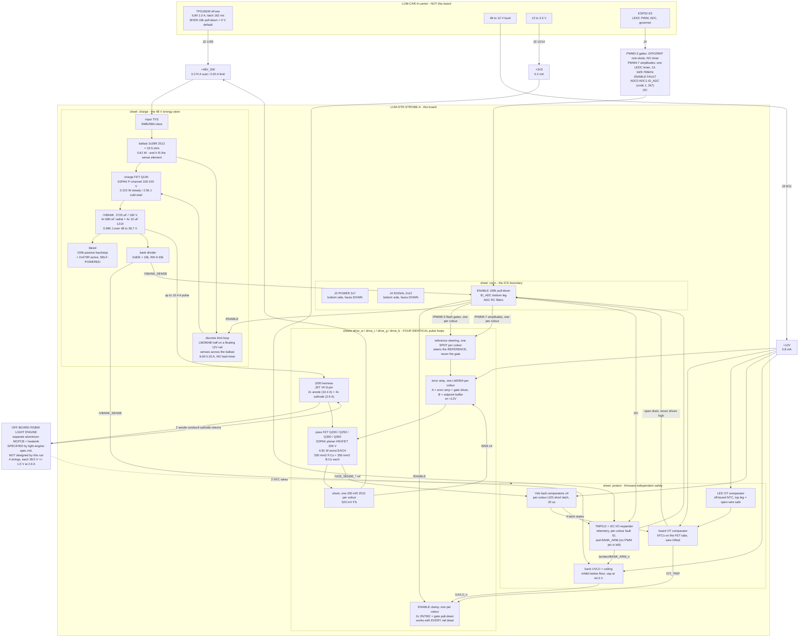

# LUM-DTR-STROBE-A - block architecture

P2 architect, 2026-07-28. Inputs: `requirements.md`, the six `research/*` fragments,
`brief/05-lumina-closed-decisions.md`, and **`boards/lumina-carrier/architecture/connector-icd.md`
rev A2** (the authoritative ICD - the DRAFT-A copy in `brief/06-connector-icd.md` is superseded).

> **REV B - H1 REVISION, 2026-07-28.** D-04 is **CLOSED as RGBW** (`requirements.md` s10.1) and
> the board is **802.3af-ONLY** (s10.3). This document is revised in place. Sections marked
> **[REV B]** changed; everything else is the rev A text and still holds. The four things the
> revision moved are: **four drive stages** (s2.3, s6), **the whole PWM allocation** (s4), **a
> per-colour sense scheme on I2C** (s2.4, s4.3), and **the drain-pour area, which turned out to
> be 3x smaller than rev A claimed** (s6.1 - the single most useful number in this revision).
> The light engine moved out of this file entirely into **`light-engine-spec.md`**.
>
> Deleted by s10.3: every 802.3at-preserving provision. **No board area and no BOM cost is spent
> on an `at` path.** `at` numbers still appear as disclosure (`power_tree.md` s8) - nothing is
> designed for them.

---

## 0. The numbers that define this board  **[REV B]**

| Quantity | Value | Set by |
|---|---|---|
| **Colour channels** | **4 - W, R, G, B**, four identical independent drive stages | D-04, closed RGBW at H1 |
| **String voltage at 2.6 A, EVERY colour** | **38.0 V +/- 1.0 V** - string length is the MCPCB's trim variable | `light-engine-spec.md` LE-05 |
| **Bank window floor** | **39.7 V** = `V_string + 1.7 V`, derived not constant; **+ ESR sag when >1 colour fires** | this document, s2 |
| **Bank normal ceiling** | **44.5 V**; **48.0 V only while `BANK_ARM` is asserted, and only transiently** (s4.4) | `power_tree.md` s6 + s10 |
| **Charge-path current limit** | **0.20 A hard limit** (not a slew limit), **[REV C] set by a discrete loop with NO fault timer** | ICD s6.6 + the af PSE class budget; `power_tree.md` s3.0 |
| **Peak current PER COLOUR** | **2.6 A**, inside every die's DC maximum, zero pulsed headroom. **Not capped, not halved** | s6.1 |
| **Peak current on `/VBANK`** | **10.4 A** when all four fire together | s6.1 - forces a pour, not a trace |
| **Drain pour per pass FET** | **>= 350 mm2 F.Cu + >= 350 mm2 B.Cu mirror within 14 mm of the package** | s6.1 - and copper past that buys NOTHING |
| **Design case** | **802.3af only.** No `at` provision anywhere | requirements s10.3 |

Everything below follows from those.

---

## 1. Block diagram - signal and power  **[REV B]**



**Zero local regulators. Zero magnetics. Five linear elements** - the charge FET and four pass
FETs - and they share one invariant burden (see `power_tree.md` s2). **The four pass FETs never
all run hot together**: the invariant fixes the total, so firing four colours divides the heat
four ways. The binding thermal case is one colour alone, which is exactly the rev A case.

---

## 2. Blocks, with the lead candidate part class for each

Part **classes and MPNs only**. No LCSC codes appear anywhere in this package: S14 recorded a
from-memory code resolving to the wrong part, and resolving codes is P3 parts_search's job.

### 2.1 conn - the ICD boundary

**J3 CONNFLY DS1023-2\*7SF11** (POWER, 14 pos) and **J4 CONNFLY DS1023-2\*12SF11** (SIGNAL,
24 pos), both **bottom side, sockets facing DOWN**, 8.5 mm bodies inside the 11.0 mm stack. Pin
maps are the ICD's s3.1/s3.2 verbatim and are not restated here. This sheet also carries the
**mandatory 100 k ENABLE pull-down**, the **`ID_ADC` bottom leg - `R_ID` = 2.7 kohm 1 %, which is
ICD rev A6 s3.4 code 1, LUM-STR-A** (`V_ID` = 0.702 V against the carrier's 10 k top leg), the two
ADC RC filters (~10 nF
at each pin - the bank divider's 9.43 k source impedance sits right at the ICD's 10 k ceiling and
SAR sampling charge wants a local reservoir), small local bulk on `+12V` (**<= 4.7 uF**, so the
error amp dies promptly on unplug rather than holding the gate up) and on `+3V3`, the five
mounting holes, and every test point. **No I2C pull-ups** - the carrier owns them.

### 2.2 charge - the 48 V energy store

**[REV C - BLOCKING-04] The hot-swap controller is DELETED. The charge limiter is a discrete linear
current-limit loop with no fault timer.** Full decision, arithmetic and the keeps/loses table are
`power_tree.md` s3.0-s3.3; the summary is:

> A hot-swap controller's fault timer integrates up in current limit and down out of it, at 10:1
> (TPS2490) or 34:1 (LM5069). Break-even duty is **9.1 %** and **2.9 %** respectively. **This board
> sits in current limit 87 % of the time by design**, so the timer reaches its threshold regardless
> of `C_TIMER` and the part latches off or drops to 0.5 %-duty restart. **No controller in this
> class omits the timer.** Root cause, named: **the design was using a fault protector as a
> charging regulator** - the same mistake ICD s6.6 warns about one level up. The fix is to build a
> charging regulator.

**As built:** `+48V_SW` -> **ballast 2 x 39 ohm 2512 in parallel (19.5 ohm)** -> **P-channel
MOSFET, 100-150 V, D2PAK/DPAK** -> `/VBANK`, with an **LM2904B half on a floating 12 V rail
(24 k + 12 V zener from `+48V_SW`)** sensing **across the ballast** and driving the gate. ENABLE
gates the loop's reference to zero through a 2N7002 level shift. Six points that make this the
right shape here:

- **The ballast IS the sense element.** At the 0.20 A limit it develops **3.9 V**, so no shunt, no
  high-side current-sense amplifier and no precision reference are needed. One part, two jobs.
- **P-channel, not N-channel.** An N-channel high-side switch needs its gate above the 48 V rail -
  a charge pump, which is the function the deleted controller was providing internally.
- **Passively OFF with every rail dead**, via a source-to-gate resistor. There is **no POR window
  at all**, because the OFF state is the unpowered state - strictly stronger than the controller's
  POR-dependent hold.
- **The ballast is free heat relocation.** Charge-path loss is `(48 - V_mean) x Q` whichever
  element limits, so moving 0.606 W of the 0.821 W into two 2512s costs nothing and **deletes the
  charge FET from the 85-90 C failing set** (`power_tree.md` s10.2). Q100 drops 0.821 -> 0.215 W.
- **SOA protection is now the NTC already in Q100's pour**, feeding `/OT_TRIP`. The fault it must
  catch is 9.6 W continuous, which cooks a D2PAK in *seconds* - a millisecond-scale integrator was
  never the right instrument, and that mismatch is what produced the defect.
- **It deletes LM5069MM-2 at $6.33** - simultaneously the most expensive part on the board, an
  Extended part, and a flagged single-source risk. Net **-$3.60/board** after the discrete parts.

**What it costs:** the P-channel **breaks P3's five-FETs-to-one-part-number consolidation**, which
now covers the four pass FETs only, adding one feeder back. **And the loop loses the controller's
programmable UVLO on `+48V_SW`** - covered by the carrier, not by this board: ICD s8.4 states the
eFuse's own 48 V-side UVLO opens below threshold, so **`+48V_SW` is never delivered brownt-out.**
If that ICD guarantee is ever withdrawn, this is the line that reopens.

Rejected alternatives are unchanged and still stand: an NTC inrush thermistor, a bare gate-RC
MOSFET and a 60 V integrated eFuse, for the reasons `protection-sense` s1 established (see s8).

**Bank: 4 x 680 uF / 100 V radial aluminium electrolytic, Ymin LKMJ class** (D18 x 25, 7.5 mm
pitch, 105 C / 10,000 h, AEC-Q200, published ripple) **+ 4 x 10 uF / 100 V X7S 1210, Murata GRM32
class**. 2720 uF total, 43.9 mohm ESR at 120 Hz, 8.7x ripple margin. **Lay out six radial
footprints and populate four** (energy-store s7): it second-sources the bank at 470 uF across four
vendors, and gives a 2720 -> 4080 uF knob with no respin. The electrolytics carry a published
ripple-current rating in the BOM per STR-REQ-08, and their vents must point away from the LED
wiring and the connectors.

**Bleed: 100 k 0805 permanent backstop + 2 x 470 ohm 2512 active path**, switched by a **150 V
N-channel SOT-223, CJT04N15 class**, whose gate is biased **up from `/VBANK`** through 1 M and a
10 V zener and pulled **down** to disarm by a 2N7002 driven from ENABLE. That polarity is the
whole point: "every rail dead" is the **ON** state, so an unplugged board is under 10 V in 4.0 s
with no rail and no firmware. An ENABLE-inverting stage powered from `+3V3` cannot invert anything
after an unplug, which is precisely the case it exists for.

**Bank divider: 2 x 82 k + 10 k, 0805**. Satisfies both halves of the HV rule at once - 0805 *and*
series-split - so each resistor sees only 26.9 V at the 57 V worst case (6.6x margin on a 150 V
working rating). Rth 9.43 k, inside the ICD's 10 k ADC limit. It feeds three consumers:
`ADC0`, the bank UVLO/ceiling comparator, and the Vds-fault comparator's reference leg.

**Input TVS: SMBJ58A class** (58 V standoff, 93.6 V clamp at 6.4 A, 600 W). Clamps below the
100 V capacitor rating with 6.4 V to spare. **No MOV-to-earth network anywhere** - the PD is
unearthed and copying one out of a reference design is a defect, not an improvement.

### 2.3 drive - the pulse loop, now **x4**  **[REV B]**

**Everything in this subsection is instantiated FOUR TIMES, once per colour, unchanged.** The
stages are electrically identical; only the string on the far end of the harness differs. The
per-stage part list is `sheets.md` s2.3; the four sheets are `drive_w`, `drive_r`, `drive_g`,
`drive_b`. Nothing about the topology changed - what changed is the count, the pour arithmetic
(s6.1) and the PWM plumbing (s4).

**Temperature grade is a hard selection rule, not a preference** (see `power_tree.md` s10):
**every active part on this board must be rated to +125 C ambient.**

> **[REV C] P3 closed this out. The substitutions the architecture now names:**
> **SPDT `SGM3157` -> `SN74LVC1G3157DCKR`** (same SC-70-6 land, $0.053 - the explicit
> P3 action item this section raised, now resolved). **Op-amp `LM2904` -> `LM2904BIDR`**
> (-40..+125 C rather than -40..+105 C, +$0.18/board). **Pass FET `IRF640NSTRLPBF`**, D2PAK
> 200 V / 18 A, -55..+175 C, one part number across all **four** pass FETs (`Q100` leaves the
> consolidation under BLOCKING-04 - it is now a P-channel, s2.2). **Drain clamp and input TVS: one
> `SMBJ58A`** across all five positions. **Harness `J200`/`J300`: CJT `A3963WV-6P` and
> `A2541WV-4P`**, VH/XH-compatible at **-40..+105 C**, which **closes** `power_tree.md` s10.5's
> "P3 must confirm a +105/+125 C housing" - no derating exception is needed.
>
> **[REV D] TWO OF THESE ARE DOCUMENTED DERATINGS, NOT +125 C PARTS - correcting rev C's claim.**
> Datasheet extraction found that the **`MCP23008`'s +125 C grade holds only at Vdd 4.5-5.5 V and
> is +85 C at the 3.3 V this board runs it at**, and that the **UMW `SN74LVC1G3157DCKR` is
> -40..+125 C but characterised only to +85 C.** **Neither was chosen *for* +125 C operation and
> the documents must not say they were.** Both are **kept as documented deratings** against the
> **56 C design-of-record ambient**, which they clear comfortably. **The board-wide +125 C rule
> therefore holds for the parts that carry real power and real protection** - the op-amps, the
> comparators, the FETs, the connectors - **and is consciously relaxed for two low-power signal
> parts.** If ICD s7.6 is ever re-issued at 85-90 C, these two are the first items to revisit;
> `power_tree.md` s10.7's finding that 56 C is *conservative* once the LED heat leaves through the
> enclosure wall is what makes the derating defensible today.

**Pass element: D2PAK planar HEXFET-5, 200 V / 18 A class, IRF640N class.** Selected on
*generation and thermal headroom*, not on Rds(on): no MOSFET on JLCPCB publishes a linear-mode SOA
characterisation, so the choice falls to planar-over-trench (lower ZTC point, less of the operating
range thermally unstable - the Spirito mechanism) plus derived thermal margin. The 200 V part is
preferred over the 100 V IRF540N class because the LED-short fault puts the full 57 V across it.
**The D2PAK beats the TO-220 here** - in a sealed box with no airflow the surface-mount conductive
path into copper (40 C/W datasheet, **51.1 C/W by the P8 model at its `a_eff` clamp - [REV B],
corrected from rev A's 47 C/W at 900 mm2**) beats the TO-220's convective path (62 C/W), inverting
the usual "THT power part is safer" instinct. **The correction narrows the margin but does not
change the answer**: 51.1 against 62 C/W is still a 17 % advantage, and the TO-220's height is
incompatible with the 30 mm ceiling once four of them are needed.

**Error amplifier: dual op-amp, LM2904 class, SOIC-8, biased from `+12V`.** The controlling
constraint is gate headroom, and it eliminates `+3V3` outright: the pass FET's source sits 0.52 V
up on the shunt and a planar HEXFET needs 5-7 V of Vgs at 2.6 A, so a 3.3 V rail delivers only
2.78 V - below the worst-case threshold - and would force a logic-level trench part, which is the
worst possible linear pass element. The Basic-shelf LM358 is **rejected on temperature grade**
(0 to +70 C against 69 C internal air), not on function. The second half of the package buffers
the setpoint at zero extra parts.

#### 2.3.1 Gate drive and loop compensation - SPECIFIED, not left to P4  **[REV D]**

**Datasheet extraction found the error amp cannot drive the gate as rev A-C drew it.** The LM2904B
is rated `CLOAD` **100 pF typ**, with phase margin specified at `CL = 20 pF, RO = 300 ohm`, and TI
gives **no** capacitive-load mitigation guidance at all. The IRF640NS is **Ciss 1160 pF typ, rising
toward ~2000 pF as Vds falls to 1 V**, with **Qg 67 nC max** - one to two orders of magnitude
beyond the op-amp's rated load. **This applies in five places: the four pass-FET error amps and the
charge loop's P-channel gate.**

**The network, per stage:**

| element | value | role |
|---|---|---|
| **`R_g`** series gate resistor | **100 ohm** | Isolates the op-amp output from `Ciss`. Puts the gate pole at `1/(2 pi x 100 x 2000p)` = **796 kHz** |
| **`R_in`** shunt sense into the inverting input | **10 kohm** | Sets the integrator's input resistance. Bias-current error: 250 nA x 10 k = 2.5 mV worst case, 4.8 % of the 52 mV 10 %-dim setpoint - acceptable, and it is a static offset that calibrates out |
| **`C_f`** feedback cap, output to inverting input | **1 nF** (drive stages) / **100 nF** (charge loop) | **Dominant-pole compensation.** Makes the stage an integrator whose crossover is set here, not by the op-amp's 1.2 MHz GBW |

**Why the capacitive load is inside the loop and cannot be isolated out of it.** The usual fix -
take feedback from the op-amp output so the load sits outside the loop - **does not apply here**:
this is a *current* loop, so the feedback path is the shunt, and the gate is the control node by
construction. **The answer is therefore to dominate-pole the loop well below the gate pole**, not
to isolate the gate.

**The arithmetic, drive stage:**

```
  gm(IRF640NS at 2.6 A)  = 6.5 S x sqrt(2.6/11)      = 3.16 S      (scaled from gfs at 11 A)
  loop constant           = gm x R_shunt = 3.16 x 0.2 = 0.63
  integrator unity gain   = 1/(2 pi x 10k x 1n)       = 15.9 kHz
  loop crossover          = 15.9 kHz x 0.63           = 10.1 kHz
  gate pole               = 796 kHz                   = 79x above crossover -> ~1 degree of phase
  1 % settling            = 4.6 / (2 pi x 10.1 kHz)   = 73 us
  gate large-signal slew  = 6 V / 0.5 V/us            = 12 us      (op-amp SR limited, not charge limited:
                                                                    30 nC at 20 mA is only 1.5 us)
  TOTAL OPTICAL EDGE      = 12 + 73                   = 85 us
```

**Against both hard requirements:**

| requirement | value | this network | margin |
|---|---|---|---|
| **STR-REQ-11**, optical rise/fall | **< 1 ms** | **85 us** | **12x** |
| Settle inside the **shortest normal pulse** (25 Hz, s4) | **2.67 ms** | 85 us = **3.2 %** of the pulse | 31x |
| Settle inside the headline flash | 8.68 ms | 1.0 % of the pulse | 102x |

**Charge loop, same shape, deliberately 6x slower:** `R_in` 10 k, **`C_f` 100 nF**, sensing across
the 19.5 ohm ballast (loop constant ~9.75), giving **crossover ~1.6 kHz and 472 us settling**. That
is correct and not a compromise - the charge loop regulates against a 2720 uF bank whose own time
constant is ~76 ms, and its fastest event is a 590 ms cold start. **A fast charge loop would buy
nothing and would only make the 48 V-domain node harder to keep quiet.**

**Gate drive headroom - confirmed, because TI's output cannot reach the rail:**

```
  op-amp output maximum      = V+ - 1.5 V = 12 - 1.5   = 10.50 V
  less the shunt (FET source sits up on it at 2.6 A)   = -0.52 V
  ---------------------------------------------------------------
  Vgs available                                        =  9.98 V

  Vgs required at 2.6 A, WORST-CASE threshold:
     Vgs(th) max 4.0 V + 2 x Id/gm = 4.0 + 2 x 2.6/3.16 = 5.65 V
  ---------------------------------------------------------------
  MARGIN                                               =  1.77x     PASSES
```

**And this is the arithmetic that retro-justifies rejecting `+3V3` for the analogue bias** (s8): a
3.3 V rail would deliver 2.78 V of Vgs against a 4.0 V *maximum threshold* - not marginal, simply
non-functional on a worst-case part.

**Shunt: 200 mohm 3 W 2512, 1 %.** 520 mV full scale, 1.35 W peak at 6.7 % duty (0.091 W average).
200 mohm rather than 50 mohm because at the STR-REQ-04 10 % dim point the setpoint is 52 mV, so an
LM2904's 7 mV worst-case offset is a 13 % error instead of 54 %. Kelvin *layout* (sense traces to
the pad ends) - no 4-terminal 2512 exists at JLC.

**Flash gating: SPDT analogue switch, `SN74LVC1G3157DCKR`, SC-70-6 [REV C].** It steers the regulator *reference*
between the filtered setpoint and GND. The 3.3 V PWM never touches the gate; steering the reference
is what gives a square optical edge without fighting the loop. No gate driver and no level shifter
are needed - the source is within 520 mV of ground, so this is a true low-side device and the
op-amp is simultaneously error amplifier and gate driver.

**ENABLE interlock: 2 x 2N7002 (JLC Basic) + a gate-source pull-down.** The interlock of record is
**passive and discrete**. An LVC gate is explicitly rejected as the safety element: LVC inputs have
clamp diodes to Vcc, and with `+3V3` dead but a live 3.3 V PWM line still driven from the carrier,
current flows into the dead rail and the output state is undefined - and the ICD refuses to
guarantee mate order in either direction.

**Drain clamp: a second SMBJ58A-class TVS drain-to-source.** Harness inductance (0.5-2 uH at 2.6 A
= 1.7-6.8 uJ) produces 13-52 V of L di/dt at a 100 ns turn-off on top of a 48 V bank. **It must be
a drain-source TVS or verified avalanche capability, NOT a freewheel diode across the string** - a
freewheel path recirculates harness current *through the LEDs* and produces exactly the decay tail
STR-REQ-01 forbids. The energy is trivial; the topology is not.

**Harness: J200, JST VH 6-pin THT, 10 A / 250 V per contact.** **[REV B]** RGBW needs
**2 anode + 4 cathode** conductors: the anode is common (`/VBANK`) and carries **up to 10.4 A**
when all four colours fire together, so it takes **two contacts in parallel** (20 A capacity,
1.9x). Each cathode carries 2.6 A into its own pass FET, a ~4x derate. The 250 V rating makes
the 0.635 mm clearance rule trivial to meet. Internal wire-to-board is permitted - the ICD only
forbids connectors that leave the enclosure. **Run each cathode alongside an anode as a tight
pair and add no capacitance at the module end.** Pinout is fixed by `light-engine-spec.md` LE-12.

Note what is deliberately absent: **no inductor, no output capacitor across the string.** Every
constant-current LED driver IC stocked at this power level is a switching buck, and its inductor
plus output capacitance is precisely the energy storage that produces a decay tail and blunts the
sub-millisecond edge. That branch is closed on topology, and independently on dimming bandwidth
(those parts specify PWM dimming at 100 Hz - 1 kHz against a 9.766 kHz carrier). The discrete
op-amp + shunt + FET loop is not a preference - it is what the catalogue and STR-REQ-01/-11 force.

### 2.4 protect - safety that does not need firmware  **[REV B]**

**Two QUAD comparators, LM2901 class, SOIC-14, both biased from `+12V`** (rev A had two duals;
four colours need four Vds sections, so the section count goes 4 -> 8 and two quads are smaller,
cheaper and fewer packages than four duals). **LM2901, not LM339 or LM393** - the latter two are
0..+70 C parts and `power_tree.md` s10 puts the internal air at up to 90 C.

| Section | Function | Output goes to |
|---|---|---|
| U400 A | **Board over-temperature.** NTCs on all five power-FET tabs in **parallel** as the bottom leg of a +12 V divider - the hottest device dominates, so one section ORs all of them. Trip ~110 C tab | `/OT_TRIP` |
| U400 B | **LED-module over-temperature.** Off-board NTC as the **top** leg, so an open harness wire pulls the node low and trips - fail-safe on a broken wire. Trip ~100 C solder point | `/OT_TRIP` |
| U400 C | **Bank UVLO.** Inhibits the drive stages below the window floor. Must **not** assert `FAULT` | `/UVLO_n` |
| U400 D | **Bank ceiling.** 44.5 V normal / 48.0 V while armed; ~1 V hysteresis | `/CHG_EN_n` |
| U401 A-D | **Vds fault (LED short), ONE SECTION PER COLOUR.** See s5 | `/OT_TRIP` (wire-OR), each latched, each also readable individually over I2C |

All outputs are **open collector**.

#### 2.4.2 Comparator hysteresis - SPECIFIED, because the datasheet offers none  **[REV D]**

**Datasheet extraction: the LM2901 publishes no hysteresis parameter and no hysteresis design
guidance at all**, and `tres` is 1.3 us. **Every comparator on this board watches a slow-moving
signal** - two thermal trips, a bank UVLO, a bank ceiling - and the four Vds detectors watch a node
that ramps. **Without external positive feedback they will chatter, and two of them (`/OT_TRIP`,
`/UVLO_n`) gate the drive stages, so chatter is not cosmetic - it is a strobe that stutters.**

**The constraint that makes this non-trivial: the outputs are open collector**, so the pull-up
resistor **participates in the hysteresis divider** and must be specified with it. (The datasheet
never uses the words "open collector"; it is established from Figure 2 plus a leakage-only `IOH`
spec plus the *absence* of any `VOH` parameter.)

**Topology, every section: positive feedback to the REFERENCE input, not the signal input.** The
reference divider's Thevenin impedance is ours to choose; the signal-side impedance is set by the
NTC network or the bank divider and is not. `R_hyst` runs from the open-collector output back to
the reference node; `R_pull` = **10 kohm to `+12V`** on every section.

```
  band  =  R_ref x [ (12 - V_ref)/(R_pull + R_hyst)  +  (V_ref - 0.25)/R_hyst ]
           where R_ref = R_a || R_b  and  V_ref = 12 x R_b/(R_a + R_b),  V_OL = 0.25 V
```

| section | `R_a` | `R_b` | `R_hyst` | `V_ref` | **band** | **in physical units** | vs `Vio` |
|---|---|---|---|---|---|---|---|
| **U400A board OT** | 56 k | 10 k | **560 k** | 1.818 V | **175 mV** | **5.0 C** of tab temperature | **12x** |
| **U400B LED-module OT** | 10 k | 10 k | **150 k** | 6.000 V | **379 mV** | **5.2 C** of solder point | **25x** |
| **U400C bank UVLO** | 22 k | 5.1 k | **820 k** | 2.258 V | **59 mV** | **1.02 V** of bank | 3.9x |
| **U400D bank ceiling** | 20 k | 5.6 k | **620 k** | 2.625 V | **82 mV** | **1.42 V** of bank | 5.5x |
| **U401A-D Vds fault, x4** | per P4's trip arithmetic | | **~1 M** | 0.45 x `/VBANK_SENSE` | ~58 mV | **5 %** of the trip threshold | ~4x |

**Sensitivities the physical-unit column is derived from** (10 k NTC, B25/85 = 3380 K):

```
  board OT:  NTC = 809 ohm at 110 C, dR/R/dT = -2.30 %/K, 2.2k top leg -> dV/dT = -35.4 mV/K
  LED OT:    NTC = 1024 ohm at 100 C, dR/R/dT = -2.43 %/K, NTC as TOP leg -> dV/dT = +72.9 mV/K
  bank:      /VBANK_SENSE = /VBANK x 10/174 = x 0.05747      -> 1 V of bank = 57.5 mV
```

**Three judgement calls worth stating rather than burying:**

1. **`Vio` is 7 mV max, 15 mV max over temperature, and it sets the smallest defensible band** -
   but `Vio` is a *static offset that shifts both thresholds together*, so it moves the trip point
   and does **not** cause chatter. That is why **the UVLO is allowed to sit at 3.9x rather than
   being widened to a nominal 4-5x**: its band costs real time (below), and buying more `Vio`
   margin would not buy any more chatter immunity.
2. **The UVLO band costs 16 ms of recovery after a full-window flash** (`2720 uF x 1.02 V /
   0.172 A`). At `f_full` = 7.6 Hz the period is 132 ms, so it fits with 8x to spare; at 25 Hz the
   bank never reaches the floor at all (sawtooth 41.97-44.5 V), so UVLO never trips. **Checked in
   both operating modes, not just one.**
3. **The four Vds sections are latched (Q400-Q403), so their band is not load-bearing** - the latch
   prevents chatter by construction. The 5 % band exists only to hand the latch one clean edge, and
   the healthy-to-faulted ratio is 0.04-0.21 against 1.00, so 5 % costs nothing.

**Reference-divider current is 1.69 mA over the four `U400` sections**, ~2.7 mA including the four
Vds references. **`+12V` housekeeping therefore goes 8.4 -> 10.4 mA**, `P_avail` 8.242 -> **8.215 W**
(-0.3 %). Too small to re-tabulate `power_tree.md` s4; recorded there in s1.2.

#### 2.4.3 Three more things the LM2901 datasheet does not give us  **[REV D]**

- **Decoupling: 100 nF X7R 0603 at each comparator's `V+` pin, plus one shared 1 uF.** The datasheet
  **publishes no decoupling guidance and no layout section**, so this is a **design decision this
  document owns** - it is "not grounded", not "not needed". A schematic agent must not be left to
  infer it.
- **Supply ceiling taken as 32 V.** The datasheet is internally inconsistent (features page 2-36 V;
  abs max "+/-18 to 36 V"; operating table 2-32 V). **This design takes the most conservative of the
  three.** It runs at 12 V, so nothing turns on it - the number is recorded so nobody later "finds"
  the 36 V figure and assumes headroom.
- **ESD is only 500 V HBM, and one comparator input reaches a connector.** The LED-module
  thermistor arrives on `J300` from an off-board loom, so `U400B`'s input is exposed to handling
  ESD the part cannot survive. **Specify: a bidirectional TVS (SMAJ12CA class) plus 10 nF to GND at
  `J300` on each thermistor line, and a 1 kohm series resistor between the divider tap and the
  comparator pin.** The series resistor must sit **after** the divider node, not in the loom - in
  the loom it would join the NTC leg and shift the trip point by ~1 kohm against a ~1 kohm bottom
  leg. After the tap it carries only 25 nA of input bias = 25 uV. **This is the same class of error
  as the gate network: a protection component in the wrong place changes a calibrated divider.**

#### 2.4.4 A consequence: `/OT_TRIP` can no longer be the same wire as `FAULT`  **[REV D]**

Specifying the hysteresis forced a local pull-up to `+12V` on every comparator output - and rev B
had `/OT_TRIP` and `FAULT` as one wire-OR node with **no local pull-up at all**, relying on the
carrier's 10 k to `+3V3`. **Those two are now incompatible: a 10 k pull-up to +12 V on a net that
also lands on the carrier's 3.3 V `FAULT` pin would forward-bias the carrier's input clamps.**

**Fix: split them.** `/OT_TRIP` is a **local `+12V` node** (10 k pull-up), which is what the four
2N7002 gate clamps want anyway - 12 V on a 2N7002 gate is well inside its 20 V `Vgs` limit. **One
additional 2N7002, `Q404`, translates `/OT_TRIP` down to `FAULT` as an open-drain output with no
pull-up**, so the carrier's 10 k still owns the net and **`FAULT` is never driven high**, exactly
as the ICD requires. Cost: one transistor and two resistors.

**[REV E] The sink-current requirement `Q404` is sized against, from ICD rev A6 s2:** a daughter
asserting `FAULT` must sink **>= 5 mA**, because **the carrier hangs its red fault LED on that net**
as well as the 10 k pull-up - the real load is ~4.3 mA, not the 0.33 mA a 10 k to 3.3 V alone would
suggest. **A comparator output driving `FAULT` directly would have been sized against the wrong
load.** `Q404` (2N7002) is 115 mA continuous with `Rds(on)` ~1.2-2 ohm, so **`VOL` at 5 mA is
~10 mV** - three orders of magnitude of margin on the sink, and its 60 V `Vds` holds off a 3.3 V
pull-up with equally little effort. **The translation stage was added for a level-shift reason and
happens to be the only thing on the board that could have met this requirement anyway.**

`/OT_TRIP` pulls **all four** pass-FET gate clamps directly, and `FAULT` through `Q404`.
`FAULT` is **never driven high** - this board fits no pull-up; the carrier's 10 k owns it, and an
open-collector output tied to a 3.3 V net is legal regardless of the comparator's own 12 V supply.
`/UVLO_n` inhibits the drive stage only; an empty bank at power-up is not a fault and must not
assert `FAULT`.

**Telemetry: TMP112 class, I2C, on `+3V3`**, plus a second off-board NTC into `ADC1` on an
independent `+3V3`-referenced leg. Two thermistors on the module cost about $0.08 and mean a
shorted telemetry wire cannot defeat the trip.

**[REV B] Second I2C device: an 8-bit I/O expander on `+3V3`.** It does two jobs that RGBW created
and that no pin is left for (s4.3).

> **[REV C] The part is `MCP23008T-E/SS` (SSOP-20, -40..+125 C, $1.49), not the PCF8574/TCA9534
> class rev B assumed - every PCF8574 and TCA9534 in stock is -40..+85 C and fails the +125 C rule.
> Its POR state is DIFFERENT and it changes the `BANK_ARM_n` fail-safe, so this is a design change,
> not a substitution.** See s2.4.1.

| Expander bit | Direction | Function |
|---|---|---|
| 0-3 | in | The four per-colour Vds-fault latch states. `FAULT` says *something* broke; these say **which colour** |
| 4 | in | Board over-temperature flag |
| 5 | in | LED-module over-temperature flag |
| 6 | **out** | **`ARM`** - the bank ceiling control that rev A carried on `PWM1`. **[REV C] Active HIGH to arm** - see s2.4.1, the polarity changed with the part |
| 7 | - | spare, no connection |

**Why this is safe to put on I2C** (and why the flash path is not): `BANK_ARM` is a slow arm, not
a per-flash gate, so bus latency is irrelevant; and every failure of the bus, the expander or
`+3V3` must land on **disarmed**, i.e. the 44.5 V ceiling, which is the lower-energy state.

#### 2.4.1 The `BANK_ARM_n` fail-safe, re-derived for the MCP23008  **[REV C]**

**Rev B's polarity was built on the PCF8574's POR state - every I/O weak-HIGH - and defined the
expander pin as `BANK_ARM_n`, active low to arm. The MCP23008 powers up with every pin configured
as an INPUT, i.e. high-Z. That is a different POR state and the rev B arrangement does not survive
it unexamined**, because a high-Z output driving a MOSFET gate leaves the gate *floating*, which is
neither on nor off.

**As re-derived:** expander `GP6` = **`ARM`, active HIGH**, driving a 2N7002 gate that carries a
**100 k gate-to-GND pull-down**; the 2N7002 drain is `/protect/BANK_ARM_n` with **100 k to `+12V`**.
The ceiling comparator reads `BANK_ARM_n`: LOW = armed (48.0 V), HIGH = disarmed (44.5 V).

| case | `GP6` | 2N7002 gate | `BANK_ARM_n` | result |
|---|---|---|---|---|
| firmware arms | driven high | high | pulled low | **armed, 48.0 V** |
| firmware disarms | driven low | low | 100 k to +12V | disarmed |
| **MCP23008 POR / after RESET** | **high-Z (input)** | **held low by the 100 k pull-down** | +12V | **disarmed** |
| **`+3V3` dead** | unpowered, high-Z | held low by the pull-down | +12V | **disarmed** |
| **I2C bus dead, expander unresponsive** | retains last written state | - | - | **holds whatever it was - see RESET** |
| **expander unpopulated (DNP)** | absent | held low | +12V | **disarmed** |
| **`+12V` dead** | - | - | no pull-up, but the ceiling comparator is also dead and the drive stages are held off by their passive gate pull-downs | safe |

**The 100 k gate pull-down is the part that makes high-Z unambiguous, and it is new in rev C.**
Without it the MCP23008's POR state would leave the arming FET's gate floating.

**The one remaining hole, and its answer: a crashed MCU leaves `GP6` latched high.** I2C simply
stops; the expander keeps driving. **Fix: tie the MCP23008's `RESET` pin to `ENABLE`.** ENABLE is
passively pulled low by the carrier's 10 k and the daughter's 100 k, so a crashed, reset, brownt-out
or unprogrammed carrier de-asserts it, which **resets the expander to all-inputs = disarmed** - and
disables the whole board anyway. **This is not "latching ENABLE locally"** (STR-REQ-21 forbids
that); it is ENABLE resetting a peripheral, which is the same direction of control ENABLE already
has over every other stage. **P4 must wire `RESET`; it must not be tied to `+3V3`.**

**[REV D] `RESET` has no internal pull-up or pull-down** - the datasheet states it "must be biased
externally". **The ENABLE tie satisfies that requirement: the pin is always driven, never floated**
(ENABLE is push-pull from the carrier and passively pulled down by the carrier's 10 k plus this
board's 100 k whenever it is not). **A floating `RESET` on this part is undefined behaviour and
would put the arming logic in an unknown state - state it explicitly so no schematic agent leaves
the pin open.**

**What is deliberately NOT on I2C: everything in STR-REQ-20's path.** The over-temperature trip,
the Vds trip, the UVLO and the gate clamps are hard-wired comparators on `+12V` driving
`/OT_TRIP` directly. With no MCU, no firmware and no bus, all of them still work. The expander
only *reads* the latches; it cannot set or clear one.

Biasing every protection element from `+12V` is the fix for `research/power.md` **OPEN-4**: with
the loop biased from `+12V`, the drive stage is *fully functional* with the daughter's `+3V3`
absent, so a `+3V3`-powered over-temperature trip would be a single point of failure of the one
protection STR-REQ-20 says must not have one. **The protection now sits on a rail no less
available than the thing it protects.** Telemetry stays on `+3V3` - if it dies, nothing unsafe
happens, and firmware sees the ADC go quiet.

---

## 3. The light engine - MOVED  **[REV B]**

**The whole of rev A's section 3 has moved to `architecture/light-engine-spec.md`** and been
re-derived for four colour channels, as `requirements.md` s10.4 directs. That file is the
deliverable: emitter selection, per-colour string topology, thermal path, connector and pinout,
written as numbered acceptance criteria `LE-01 .. LE-24` so a third party can build the MCPCB.

**Per-colour light output is in `power_tree.md` s9**, per `requirements.md` s10.1. **The rev A
10,000 lm headline is a WHITE-CHANNEL-ONLY number and must not be quoted for the fixture.**

Three facts from rev A survive unchanged and are restated in the spec rather than here:

- **No LED vendor publishes a pulse allowance at 5-200 ms**, in any colour. Cree's CLD-AP60
  declines to publish a numeric limit at all; ams-OSRAM's surge current is 10 us at 0.5 % duty;
  JNJ's and Xinglight's pulse footnotes are 100 us at 10 % duty. **A 5-200 ms pulse is thermally
  DC.** Size every string so peak current is inside each die's DC maximum and budget **zero**
  pulsed headroom. (`led-emitter.md` s1.1 + `refdesign-pulsed-led-driver.md` D9, which agree.)
- **P3's part-sourcer will NOT find the emitters, the optics or the thermistors on JLCPCB, and
  that is correct.** The array is off-board, so it is a mechanical BOM line from Digi-Key, Mouser
  or LCSC retail. JLC stocks no LED optic of any kind and no leaded/probe/ring-lug NTC at all.
- **A bought COB is not available**: the entire in-stock white COB population at JLC is three
  SKUs totalling 17 pieces, all under 13.5 W. There is no RGBW COB at all.

<details>
<summary>rev A white-only emitter analysis - superseded by light-engine-spec.md, kept for the audit trail</summary>

### 3.1 Resolving the emitter conflict (rev A, white-only)

`led-emitter.md` picked Cree XP-G2 in a 12S2P / 24-die array at ~$53/board **because no JLC-stocked
white LED is DC-rated for 2.6 A**. That constraint does not exist: the array is off-board on a
separate PCB, so it is **not a JLC PCBA line item** and can be bought from Digi-Key, Mouser or LCSC
retail. `refdesign-pulsed-led-driver.md` D9 is therefore the fragment that wins the conflict:
**select an emitter whose DC forward-current rating covers 2.6 A at the derated solder-point
temperature, and budget zero pulsed headroom.**

Both fragments agree on the fact that decides it, and it must be carried forward verbatim:
**no white-LED vendor publishes a pulse allowance at 5-200 ms.** Cree's CLD-AP60 declines to publish
a numeric limit at all and states that operating outside the published specification negates the
warranty; ams-OSRAM's "surge current" is 10 microseconds at 0.5 % duty; JNJ's and Xinglight's pulse
footnotes are 100 us at 10 % duty. A 5-200 ms pulse is **thermally DC** for a die whose time
constant is milliseconds. There is nothing to interpolate.

### 3.2 The decision

**Primary: a single series string of large multi-die emitters DC-rated >= 2.6 A. Lead candidate
class: Cree XLamp XHP70.3 in the 12 V configuration, 3 in series.**

| Property | Value | Note |
|---|---|---|
| Arrangement | **3S1P - one series string, no parallel paths** | the point of the choice |
| Per-emitter current | 2.6 A | inside the DC rating; zero pulse headroom claimed |
| Nominal Vf per emitter at 2.6 A | ~12.7 V | **estimate - the datasheet Vf on disk is 11.2-12.2 V at 1050 mA / 85 C. Vf at 2.6 A is a P3 confirm item** |
| String Vf at 2.6 A | **38.0 V nominal, 37.0 - 39.0 accepted** | s2 shows the board works across the band |
| Peak electrical | **98.8 W** for 8.68 ms | |
| Rth junction-to-solder-point | ~0.2 C/W | 32.9 W per emitter -> 6.6 C junction rise; the pulse is not the thermal problem |
| Ballast / binning needed? | **No** | there is no parallel path to imbalance |
| Emitter cost | **~$30-45 / board** (3 emitters at distributor single-qty) | estimate; the only price on disk verified live is the XP-G2 figure below |

**Why a single string is worth paying for.** Every 2.6 A arrangement built from 1.5 A-class dies is
a parallel string, and `led-emitter.md` risk 1 says so. Parallel sub-strings need either Vf-matched
binning or ballast resistors, and the arithmetic is unforgiving: an unbinned XP-G2 13S2P pair
mismatches by ~1.3 V across the string, which needs ~5 ohm of ballast per string to hold the split
inside +/-10 % - **8.45 W per string of peak ballast loss and 6.5 V of string voltage**, which
destroys the window. Single-Vf-bin ordering plus ~1 ohm per string gets it to +/-11 % at 1.7 W
peak per string, off-board. That is survivable but it is three extra ways to get the build wrong.
**One string has none of them.**

**Verified fallback, if the XHP70.3's measured Vf at 2.6 A lands outside 12.3 - 13.0 V per emitter:
Cree XP-G2, 13S2P, 26 dies at 1.30 A, 38.2 V at 2.6 A, ~$57.50/board.** Requires
**single-Vf-bin ordering plus ~1 ohm of per-string ballast on the MCPCB**. `led-emitter.md` rejected
13S only because 38.2 V "breaks the <= 38 V limit" - that limit existed to preserve headroom above a
40 V floor which s2 shows is itself a derived quantity, so 13S is now in bounds. XP-G2 remains the
only candidate whose datasheet lets P8 *prove* STR-REQ-13/-14/-15 from paper (Vf table at four
currents, Rth j-sp 1.4 C/W, relative-flux and delta-CCx/CCy vs current), which is why it stays the
documented alternate rather than being dropped.

**P3's part-sourcer will NOT find the emitter on JLCPCB. That is correct and expected.** It is a
mechanical/optical BOM line alongside the MCPCB, the heatsink and the diffuser, sourced from
Digi-Key or Mouser. The same is true of the two thermistors: JLC stocks **no leaded, probe or
ring-lug NTC at all** - its entire NTC catalogue is SMD chip thermistors and THT inrush discs.

### 3.3 Optic, and the number that decides it

**No optic on the emitters.** The room is 5 x 7 m with a 2.5 m ceiling and the fixture sits ~2.3 m
above the floor. A bare 120-degree FWHM emitter gives a half-intensity radius of 4.0 m at that
height - an ~8 m pool, wider than the room's short dimension. Every off-the-shelf TIR lens for this
package class narrows that to 10-45 degrees, i.e. a 0.4-1.9 m spot: exactly the failure STR-REQ-16
warns about. Use a **flat diffuser or a clear window in the enclosure**, which also takes the edge
off the point-source glare of a 10,000 lm flash at eye level. If more punch is ever wanted the right
class is a 60-90 degree wide/frosted TIR, from Carclo or Ledil through Mouser - **JLC stocks zero
optics of any kind**.

### 3.4 What 8.5 W looks like in that room

Scaled from `led-emitter.md` s5 to this board's numbers (6.61 W of sustained LED power, 98.8 W peak):

| | value |
|---|---|
| Peak flash | **~10,000 lm** for 8.68 ms, ~600 lux directly beneath one fixture |
| 4-6 fixtures firing together | ~1,000-1,500 lux at a floor point, against 1-20 lux room ambient |
| Time-averaged | **~720 lm per fixture**, ~40-50 lux beneath, ~130-200 lux room average with five fixtures |

**The honest framing: the peak is genuinely violent, the time-average is dim room lighting.** That
is what an 8.5 W-fed strobe should be. Pulsing costs about 30 % of the lumens the same average watts
would give run continuously (efficacy droop) - which is a lever the governor can use for
STR-REQ-07's graceful degradation, because **stretching a pulse recovers efficacy as well as
avoiding a missed beat.**

</details>

### 3.5 The heatsink flag - now corroborated by the par run, and it is the H2 headline  **[REV B]**

The ICD's 56 C (af) / 69 C (at) internal-air figures **predate this 6.6 W sustained LED load.** If
the heatsink sits inside the sealed plastic box, that box must shed ~6.6 W to outside air through
plastic and the internal air will not stay at 56 C. The only arrangement that closes is bolting the
heatsink to or through the enclosure wall so the wall is the radiator - and per ICD s9 and H1-Q5
that heatsink is at PoE potential and must remain non-user-accessible and unbonded to anything
earthed. **This is an enclosure decision, not a PCB decision.**

> **[H1 follow-up] THE ENCLOSURE DECISION HAS CLOSED, and it went the way this section asked for:
> sealed, non-metallic, NOT vented, with the LED heatsink bolted to or through the wall.** Both
> fixtures share it; the par reached it independently and **measured a sealed non-metallic box at
> 3.6-4.3 K/W internal-air-to-room.** Applying that measurement (`power_tree.md` s10.7) shows the
> box arithmetic reproduces the ICD's 56 C **exactly** in the case where the LED heat stays inside
> - and puts the internal air at **32-48 C** in the case where it leaves through the wall.
>
> **So this is no longer the largest thermal uncertainty in the fixture; it is a load-bearing
> dependency with a number on it.** It is written as `light-engine-spec.md` **LE-16** with an
> apportioned Rth budget (`solder point -> outside air <= 6.0 C/W`, of which the wall joint is
> 0.5 C/W) and a checkable joint specification, and **its acceptance test is gating**: log the
> enclosure's internal air alongside the emitter solder point, because a solder point that passes
> while the internal air climbs 30 K means the heat went into the box and the board is silently in
> the 85-90 C case.

**The par run has independently reached the same conclusion from the other side** and raised a
blocking issue against ICD s7.6: its figures are not self-consistent (69 C `at` cannot coexist
with 56 C `af`) and an independent calculation gives **89-115 C**, optimistic by 20-46 K
(`requirements.md` s10.6). **Two runs arriving at "s7.6 is too cold" from unrelated directions is
the strongest evidence in this program that it is.** The full sensitivity analysis - every
element above 0.5 W recomputed at 85 C and 90 C - is `power_tree.md` s10, and it is the item to
put in front of the human at H2. This board does **not** attempt to fix s7.6 and does not average
it with anything.

---

## 4. PWM allocation re-checked for RGBW - it closes, but ONE signal loses its pin  **[REV B]**

This is the section H1 asked to be re-worked, and the answer has two halves. **The eight-channel
allocation closes cleanly - better than rev A feared.** **What does not close is `BANK_ARM`, which
in rev A sat on `PWM1` and now has nowhere to go.** That is the real finding for H2.

### 4.1 The rules, restated exactly - **[REV E] the two-timer partition is WITHDRAWN**

> **ICD rev A6 s3.5 (NORMATIVE) supersedes the s3.3 text this section was written against.** The ICD
> now says outright that *"the previous statement that PWM0-3 sit on LEDC timer 0 and PWM4-7 on
> timer 1 is withdrawn - it was wrong for the strobe and would have mis-specified two boards."*
> **The constraint this section spent most of rev B working around no longer exists.**

What replaces it:

- **The carrier does not hard-assign timers.** Each daughter **declares its own channel -> timer ->
  frequency map in its design document**, and carrier firmware applies that map from the `ID_ADC`
  code. **s4.2 below is that declaration** - it is now a published interface artifact, not an
  internal note.
- **Hardware ceiling (not negotiable):** 8 channels, **4 timers**, low-speed mode only, **14-bit
  maximum** resolution. Channels sharing a timer share **both** frequency and resolution.
- **The GPIO/RMT one-shot flash gate is explicitly legal**: *"these pins are ordinary GPIOs and
  nothing on the carrier forces them into LEDC"*, and *"it is NOT true that all 8 channels sit at
  the default frequency."* **Route 1 of rev B s4.3 is now the ICD's own recommendation.**
- **A 14-bit / 4.883 kHz mode exists** (CR-3, granted) alongside the 13-bit / 9.766 kHz default.
  **This board declines it - s4.2.1.**
- **CR-4 granted:** carrier firmware applies a **90-degree phase stagger** across any four or more
  channels sharing a timer. **This board runs four amplitude channels on one timer, so the stagger
  applies to it** - see s4.2.2.

ICD s3.2 still shows J4 fully assigned across all 24 positions: **there is no spare signal pin**, and
that is what `BANK_ARM` still runs into (s4.4).

### 4.2 LUM-DTR-STROBE-A channel -> timer -> frequency map - **NORMATIVE DECLARATION**

**This table is the artifact ICD rev A6 s3.5 requires each daughter to publish.** Carrier firmware
applies it on reading `ID_ADC` **code 1** (s2.1). It is an interface contract, not an internal note.

| Pin | Colour | Function | **Peripheral** | **LEDC timer** | **Frequency / resolution** | Waveform |
|---|---|---|---|---|---|---|
| **PWM0** | W | `FLASH_GATE_W` | **GPIO / RMT one-shot** | **none** | n/a | 5-200 ms one-shot at 1-25 Hz |
| **PWM1** | R | `FLASH_GATE_R` | **GPIO / RMT one-shot** | **none** | n/a | as above |
| **PWM2** | G | `FLASH_GATE_G` | **GPIO / RMT one-shot** | **none** | n/a | as above |
| **PWM3** | B | `FLASH_GATE_B` | **GPIO / RMT one-shot** | **none** | n/a | as above |
| **PWM4** | W | `AMP_SET_W` | LEDC | **timer A** | **13-bit / 9.766 kHz** (the ICD default) | filtered DC setpoint |
| **PWM5** | R | `AMP_SET_R` | LEDC | **timer A** | 13-bit / 9.766 kHz | filtered DC setpoint |
| **PWM6** | G | `AMP_SET_G` | LEDC | **timer A** | 13-bit / 9.766 kHz | filtered DC setpoint |
| **PWM7** | B | `AMP_SET_B` | LEDC | **timer A** | 13-bit / 9.766 kHz | filtered DC setpoint |

**Totals: 1 LEDC timer consumed, 3 free. 4 RMT or GPIO-timer channels consumed.** Pin `n` and pin
`n+4` are the same colour.

**Rev B feared a conflict that the ICD has now dissolved.** The worry was that gates and amplitudes
would be forced onto the same timer, and that a timer re-programmed to a 1-25 Hz flash rate cannot
simultaneously carry a 9.766 kHz filtered-DC channel. **That is still true as physics** - it is why
the map above puts the gates on no timer at all - **but it is no longer a constraint imposed by the
carrier.** The strobe now uses **one** timer where rev B budgeted two, and leaves three free instead
of none. **Any remaining text elsewhere in this package that treats the two-timer partition as a
constraint is obsolete; s4.3 below is retained only as the rationale for choosing RMT.**

#### 4.2.1 The 14-bit / 4.883 kHz option - **DECLINED, with the arithmetic**

CR-3 offers 14-bit at 4.883 kHz, doubling low-end resolution. The ICD asks each daughter to
evaluate it, and STR-REQ-04's "barely visible 10-20 % slow pulse" is the case that would want it.
**This board declines. Three reasons, in the order that decides it:**

1. **Resolution is not the limiting error, and is not close to being it.** At 13-bit the setpoint
   LSB is `2.6 A / 8192` = **0.317 mA**, which at the 10 % dim point (0.26 A) is **0.12 %**. The
   LM2904B's input offset of 3 mV against the 52 mV setpoint at that point is **5.8 %**. **The
   offset dominates the resolution by 47x.** Doubling a resolution that is already 47x finer than
   the dominant error term buys nothing measurable.
2. **It doubles the setpoint ripple.** RC ripple scales as `1/f` well above cutoff, so the
   **2.6 %** of full scale at 9.766 kHz becomes **5.2 %** at 4.883 kHz - and that ripple is a real
   current modulation on the LED, not a number in a table.
3. **Restoring the ripple would break the amplitude-programming contract.** Getting back to 2.6 %
   needs the setpoint `tau` doubled to 2 ms, which takes 1 % settling from 4.6 ms to **9.2 ms** -
   against a **shortest normal pulse of 2.67 ms** (s4 at 25 Hz). The setpoint would no longer settle
   inside the flash it applies to.

**And the fourth reason, which is judgement rather than arithmetic: 4.883 kHz costs camera-flicker
margin on the one fixture in the rig most likely to be filmed.** A strobe is what phones get pointed
at. **Stay at 13-bit / 9.766 kHz.**

#### 4.2.2 CR-4 phase stagger - applies here, and it is harmless

This board runs **four** channels on one timer, so carrier firmware applies the 90-degree `hpoint`
stagger. **Effect on this board: none on the DC setpoints** (a phase offset does not change the
filtered mean), and two small benefits - the four RC filters no longer draw their charging current
simultaneously, and the residual ripple on the four setpoints is decorrelated, so the four colours'
current ripple cannot sum coherently. **Accepted as-is; no board change and nothing to design
around.**

### 4.3 The gates: three ways to produce them, ranked - **[REV E] settled by ICD rev A6**

> **Route 1 was this document's recommendation and the ICD has since adopted it as its own.** The
> table below is retained as the *rationale* for choosing RMT, not as an open question. **Route 3
> (requesting LEDC timers 2/3) is now moot in both directions**: the timers were never the scarce
> resource, and the ICD no longer hard-assigns any of them.

**A 5-200 ms one-shot at 1-25 Hz is still not a duty cycle on a 9.766 kHz carrier.** One period is
102.4 us; an 8.68 ms flash is 85 consecutive periods. Rev A had two escapes; with four colours there
are three, and they are no longer equivalent:

| # | Route | Independent flash rate per colour? | ICD change? | Cost |
|---|---|---|---|---|
| **1** | **Drive `PWM0-3` as plain GPIO / RMT one-shots** from a hardware timer or the RMT peripheral. **No LEDC timer is consumed at all** | **Yes, all four independent** | **None - and ICD rev A6 s3.5 now says so explicitly**: "these pins are ordinary GPIOs and nothing on the carrier forces them into LEDC" | zero |
| 2 | Re-program LEDC timer 0 to the flash rate. Per-channel `hpoint` gives independent phase and duty gives independent width | **No - one shared flash PERIOD.** Off-beats work (phase); different subdivisions do not | None | zero |
| 3 | Request LEDC timers 2/3 and re-point two of the gate channels at them | Three independent rates, not four | **s3.3 amendment** | zero |

**Recommendation: route 1.** It is what the signal actually *is*, it gives four genuinely
independent flash rates, and it needs nothing from the carrier owner. **Route 2 is the fallback if
the carrier's firmware framework only exposes LEDC on those pins** - and its restriction is milder
than it sounds for a strobe, where all four colours normally sit on one beat grid.

**A note worth putting to the carrier owner: requesting LEDC timers 2/3 does NOT solve anything
here.** Timers are not the scarce resource - **pins are**. Route 3 buys a third independent rate and
nothing else, and it is the only one of the three that costs an ICD revision.

### 4.4 What broke: `BANK_ARM` has no pin  **- THE H2 FINDING**

Rev A put `BANK_ARM` on `PWM1` as a static DC level. With four gates and four amplitudes, **all
eight PWM channels are consumed and J4 has no spare position.** `BANK_ARM` is not optional: it is
what releases the bank ceiling from 44.5 V to 48.0 V, and the **48.0 V ceiling is what produces the
headline 0.858 J / 8.68 ms blast of STR-REQ-01 as amended.** Dropping it would delete the headline
flash mode.

Four ways out were considered:

| Option | Cost | ICD change | Verdict |
|---|---|---|---|
| **A. I2C 8-bit I/O expander** (`MCP23008T-E/SS` at P3; rev B assumed a PCF8574/TCA9534, all of which are -40..+85 C) drives `BANK_ARM_n` and reads the four per-colour fault latches | **[REV C] +$1.49 + one 2N7002 + three resistors, ~70 mm2** | **None** | **CHOSEN.** It also answers s2.4's per-colour fault-attribution problem, which otherwise has no answer at all, and every failure mode lands on "disarmed" |
| B. Re-designate the unused `DSPI_CSn` (J4-17) as a GPIO for `BANK_ARM` | zero parts | **s3.3 amendment** - re-purposes a bus pin | Rejected as primary. Cheapest, but it spends ICD capital on a signal that an already-required I2C device carries for free, and it leaves fault attribution unsolved |
| C. Quad I2C DAC (MCP4728, +$2.66) replaces the four amplitude RCs, freeing `PWM4-7` | **+$2.66**, and it is **single-source** (Microchip only, `drive-stage.md` R4) | None | Rejected. It puts *amplitude* on I2C, so an I2C failure means **no light at all** rather than "no arming". It does save ~12 passives of area, which is the only argument for it |
| D. Delete `BANK_ARM`; fix the ceiling at 44.5 V | zero | None | **Rejected - it deletes the headline flash mode** |

**Chosen: option A.** `BANK_ARM_n` is an expander output, active LOW to arm, pulled to "disarmed"
by 100 k to `+12V` through a 2N7002 so that a dead `+3V3`, a dead bus or an unprogrammed MCU all
leave the bank at its 44.5 V ceiling. **The signal never leaves the `protect` sheet.**

### 4.5 Per-colour sense - what is measured and what is not

The 2-ADC budget (`ADC0` bank voltage, `ADC1` LED-module NTC) does not stretch to four colours and
is **not** stretched. The scheme:

| Quantity | Per colour? | How | Why |
|---|---|---|---|
| **String current** | **No** | Commanded by `AMP_SET_n`, regulated locally by the analogue loop against a 1 % shunt | The loop *is* the current control. Runtime telemetry would need four peak-hold networks (~16 parts) to buy data that a one-off bench calibration at P8 gives better |
| **Colour mixing / cast (STR-REQ-14)** | n/a | Bench-calibrated once into four firmware scale factors | Not a runtime measurement |
| **Open string (no light, no fault)** | **Yes, in firmware, free** | Fire each colour alone at low amplitude and watch `ADC0` for bank droop. **A healthy flash droops the bank; an open string does not** | This is a genuine hole the Vds comparator cannot see (an open string pulls `/LED_K` toward GND through its own divider, which *reads as healthy*). Solving it in firmware costs zero parts. Fold it into STR-REQ-06's self-test |
| **Which colour faulted** | **Yes** | Four latch states on the I2C expander | `FAULT` is a single wire-OR; without this, firmware knows something broke and nothing else |
| **Module temperature** | **No, and deliberately** | Two NTCs on the shared MCPCB: one into the `+12V` trip comparator, one into `ADC1` | The MCPCB is one thermal mass. Four thermistors would cost four more harness conductors for no decision firmware can act on differently |

**I2C rules, confirmed against ICD s3.3: 400 kHz, open drain, and the pull-ups are on the CARRIER
(4.7 k to +3V3). This daughter fits NO pull-ups.** Two devices on the bus: the TMP112 and the
expander; their addresses must not collide and both must be selectable at P3.

**STR-REQ-20 stays entirely off the bus.** The firmware-independent over-temperature shutdown is
comparator -> `/OT_TRIP` -> four gate clamps, all on `+12V`. It works with no MCU, no firmware and
no I2C. The expander can *read* the latches; it can neither set nor clear one.

### 4.6 Firmware contracts to carry into DOC-01

- **Amplitude must be programmed at least one flash period (~5 ms) before the flash it applies to.**
  The RC setpoint filter settles to 1 % in 4.6 ms - comfortably inside the 40 ms period at 25 Hz,
  but most of a full-output flash. Ripple at 9.766 kHz is 2.6 % of full scale and optically
  invisible. **This applies per colour, independently.**
- **`ENABLE` is a slow arm/disarm with a ~10 s minimum re-arm interval. It is NOT a per-flash or
  per-cue gate - `PWM0-3` are.** Each ENABLE cycle costs a 3.13 J cold start in the charge FET; at a
  1.33 s re-arm interval the mean hits the D2PAK's steady-state limit and the part cooks. The
  penalty is graduated, not a cliff - the active bleed's 2.6 s time constant means a 100 ms ENABLE
  glitch drops the bank only ~3.5 %.
- **[REV B] `BANK_ARM` is momentary, not a mode.** Arm, fire one or a few blasts, disarm. Sustained
  armed operation at 25 Hz puts 1.41 W into one pass FET, which **fails the P8 thermal gate at every
  ambient including the ICD's own 56 C** (`power_tree.md` s10). The board tolerates it as a burst
  because the D2PAK + pour time constant is 60-120 s; it does not tolerate it as a mode.
- **[REV E] The rail-power governor cap of rev B/C is WITHDRAWN as an operating constraint** - see
  `power_tree.md` s10.8. At the ICD's published 70 C ceiling every steady-state row passes with
  1.33x, so there is nothing to cap. It survives only as contingency documentation.
- **[REV E] Do NOT design against the carrier metering this board's average power.** ICD rev A6
  s6.2.1: the eFuse's `IMON` output has **no datasheet-guaranteed accuracy below 0.6 A**, and this
  rail runs at 0.25 A (af) - so the governor's feedback is good to roughly **+/-20 %** at the
  current it actually regulates. **This board does not depend on it**, for two independent reasons:
  (a) the flash schedule is *commanded*, so rail power is known feed-forward from energy x rate,
  not measured; and (b) the charge path is **hard-limited at 0.20 A in hardware**, so `P_rail` can
  never exceed 9.6 W however badly firmware mis-meters. **And the thermal protection that actually
  matters is the NTC trip, which is firmware-independent by construction (STR-REQ-20).** Treat
  `IMON` as the ICD suggests - **a guard, not a meter.**

---

## 5. The LED-short fault - decided, not deferred (**x4** in rev B)

> **[REV B]** Everything below is per colour and is instantiated four times - four comparator
> sections in one LM2901 quad, four latches, four arming RCs. Two additions: each latch state is
> also readable individually over I2C (s4.5), and the **open-string** case that this detector
> cannot see is handled in firmware by bank-droop self-test (s4.5), not by more hardware.

`drive-stage.md` **R1** is the single-fault case that has to be answered here: if the string shorts
(solder bridge, harness fault, an emitter failing short), **the current loop keeps regulating
2.6 A and the pass FET absorbs the entire rail - 125 W at 48 V, 148 W at the 57 V worst case - and
it does not self-terminate**, because the loop never enters dropout. It runs for the full commanded
on-time, up to 200 ms, and it repeats on every commanded flash: at 6.7 % duty the *mean* is ~9.9 W
against a 1.5 W steady allowance, so even if each individual pulse survives, the part cooks in
seconds.

**Decision: a Vds foldback comparator as the fast primary, plus FET thermal sensing as the slow
backstop. A maximum-on-time one-shot is rejected as the primary** - it bounds one pulse but does
nothing about the repetitive mean, which is the case that actually destroys the part.

The fault signature is unusually clean because of the topology. The pass FET's drain **is** the LED
cathode, so `V_drain = V_bank - V_string`: **1.7 to 10.0 V in healthy operation, and `V_bank` itself
- 48 V - when the string is shorted.** Expressed as a ratio it is 0.04-0.21 healthy against 1.00
faulted, so:

- **Comparator B1 compares a divided `/LED_K` against ~0.45 x the divided `/VBANK`.** Both legs come
  from identical 2 x 82 k + 10 k dividers, so the trip is **inherently ratiometric and needs no
  voltage reference at all** - two resistors set the 0.45 and that is the whole circuit. The bank
  leg is the divider that already exists for `ADC0`.
- **Response: comparator propagation (~1.3 us) plus the divider RC (~10 us) = under 20 us.** At
  148 W for 20 us the die absorbs 3 mJ, about 3 C of junction rise. The FET does not notice.
- **Arming blank.** When the FET is off the drain sits at `V_bank` through the string, which is the
  fault signature, so the comparator must be armed only ~100 us after `FLASH_GATE` asserts. One
  10 k / 10 nF RC on the arming node does it.
- **Latched, and cleared only by `ENABLE` going low.** A fault latch is not an ENABLE latch - the
  same distinction the hot-swap controller already relies on - so STR-REQ-21's "never latch ENABLE
  locally" is honoured, and firmware gets a fault it can see on `FAULT` and clear deliberately.
- **Slow backstop: an NTC in Q200's own drain pour**, ORed into the board over-temperature
  comparator. This catches anything the Vds test misses (a partial short, a degraded emitter, an
  802.3at thermal overrun) and it is the element that makes the FET's thermal margin a *measured*
  quantity rather than an assumed one.

Cost of the whole answer: **[REV B]** four comparator sections (which is why the protect sheet
went from two duals to two quads), four 2N7002 latches, five NTCs and about two dozen resistors -
**roughly $0.45/board for all four colours.** For a single-fault safety-adjacent case that is not
a decision worth agonising over.

---

## 6. RGBW - IMPLEMENTED, and the area trap it was supposed to spring  **[REV B]**

D-04 closed as RGBW. This section replaces rev A's costed delta with the built design, and it
opens with the correction that makes the whole thing fit.

### 6.1 The drain-pour arithmetic was wrong by 3x, in the design's favour

Rev A declared **1000 mm2** for the pass FET's drain pour and **645 mm2** for the charge FET's, and
concluded that four of the former "does not fit". **Both numbers were derived from the raw
`theta_JA` curve without reading what the P8 gate actually computes.** From `check_thermal.py`:

```
  A_SAT_MM2 = 645.0
  a_eff = min(A_SAT_MM2, sum over ALL copper layers of net_copper(net, layer)
                          intersected with a disc of radius sqrt(645/pi) = 14.3 mm
                          centred on the part)
  theta_JA = 45 + 95 * exp(-a_eff / 235)      (4-layer model)
```

Two clamps, both load-bearing, neither of them in rev A:

1. **`a_eff` is capped at 645 mm2.** Copper past ~1 in2 is not counted, because heat does not
   spread further than that - the model's own comment says so. **`theta_JA` can therefore never go
   below `45 + 95 exp(-645/235) =` 51.1 C/W on this board, at any pour size.**
2. **The sum is over layers.** A mirrored pour on B.Cu tied through the thermal vias counts fully.

**Consequence, and it is the most useful number in this revision:** the requirement is
**>= 350 mm2 on F.Cu plus >= 350 mm2 mirrored on B.Cu, both within 14 mm of the package, tied by
>= 12 vias.** That reaches 645 mm2 of `a_eff` and 51.1 C/W - **the model's best achievable value.**
A 1000 mm2 F.Cu pour reaches exactly the same 51.1 C/W and buys nothing the P8 gate will score.

Rev A's 1000 mm2 was therefore **2.9x larger than useful**, and the "4 x 1000 mm2 does not fit"
trap **dissolves**: four pass FETs need 4 x 350 = **1400 mm2 of F.Cu**, against rev A's single
1000 mm2. That is 400 mm2 of extra F.Cu for three extra colour channels.

**The correction cuts both ways and the bad half must be stated too.** At 51.1 C/W the allowance in
the ICD's 56 C air is `69 / 51.1 =` **1.35 W**, not the 1.47 W rev A claimed from the uncapped
curve. **Rev A's armed-25 Hz case (1.43 W) therefore does NOT pass the P8 gate**, at any copper
area. It is not a design failure - armed is a momentary blast mode, not a sustained one (s4.6) -
but rev A stated it as passing at 1.03x and that was wrong. Full arithmetic in `power_tree.md` s5
and s10.

### 6.2 Per-colour current: 2.6 A, unchanged, uncapped

The other half of the feared trap was that a single colour running alone at full current would
force a per-colour cap near 1.3 A and double the die count. **It does not, for two independent
reasons:**

- **The shared case is thermally free.** The invariant of `power_tree.md` s2 fixes total board
  dissipation regardless of how it is divided, so four colours firing together put ~0.2 W in each
  pass FET instead of 0.81 W in one. **RGBW is thermally EASIER than white-only in every mixed
  case and exactly equal in the single-colour case.**
- **The single-colour case is the rev A case, unchanged**, and per s6.1 it needs 350 mm2, not 1000.

So every stage is built for the full 2.6 A, every colour can blast alone at the headline energy,
and the die count per colour is set by the emitter's own DC rating - not by this board.

**What the four-colour case DOES cost is current on `/VBANK`: 4 x 2.6 A = 10.4 A.** Consequences,
all real:

| | number | consequence |
|---|---|---|
| `/VBANK` peak | **10.4 A** | Must be a **pour** from the bank terminals to J200, never a routed trace. Declared in `constraints.json`; IPC width for 10.4 A on 1 oz external is ~7.6 mm, which a pour clears trivially and a router-chosen trace will not |
| Harness anode | 10.4 A | **Two JST VH contacts in parallel** (20 A), and >= 18 AWG x 2 in the loom (`light-engine-spec.md` LE-13) |
| Bank ESR sag | 43.9 mR x 10.4 A = **0.46 V** | 5.5 % of the 8.3 V window. The UVLO divider sits on the bank *terminal*, so it sees the sag and the floor self-corrects - but the usable window is ~0.46 V narrower whenever all four fire |
| Bank ripple current | RMS 1.33 A (10.4 A at 1.65 % duty) | Against a bank rated ~5.9 A RMS: **4.4x margin**, down from 8.7x. Still not a constraint |
| Pulse width, all four at 2.6 A | **2.17 ms** | Same 0.990 J of bank energy consumed 4x faster. A 395 W, 2.17 ms, ~25,000 lm event - the most violent thing the fixture can do |

### 6.3 Area budget - the binding constraint of this revision

Usable area is unchanged from rev A: 8,000 mm2 less 2,328 mm2 of keepouts less 520 mm2 of
through-hole connector footprint = **5,152 mm2 on F.Cu**. **B.Cu takes copper only** - requirements
s7 fixes single-sided top SMD assembly - so the "B.Cu is nearly empty" relief buys pour area and
escape routing, never component area.

```
  usable F.Cu                                            5,152 mm2

  bank, 4 x D18 radial populated of 6 footprints         1,214
  4 x pass-FET drain pour, 350 mm2 F.Cu each             1,400   (+ 1,400 mirrored on B.Cu, free)
  charge-FET drain pour, 350 mm2 F.Cu                      350   (+ 350 on B.Cu, free)
  4 x shunt 2512 + Kelvin land                             100
  4 x drive-stage small parts (~14 parts each)             440
  charge block: hot-swap, TVS, sense, 7 passives           120
  bleed: 2 x 2512, SOT-223, 2N7002, 3 passives              90
  protect: 2 x SOIC-14 quad, TMP112, expander,
     5 NTC, ~25 R, 3 C, J300                               280
  conn block: 5 R, 5 C, 6 test points                      120
  J200 (JST VH 6-pin THT)                                   55
  H5, silkscreen-critical clearances, misc                   30
  ------------------------------------------------------------
  claimed                                                4,199 mm2  =  81 % occupancy
```

**81 % before routing channels, against rev A's 69 %** - and rev A's 69 % was itself computed with
the wrong pour sizes; corrected for s6.1 the white-only board was only **51 %**. **So the honest
statement is: RGBW costs 30 points of F.Cu occupancy, and the design fits only because the pour
correction gave 18 of them back first.**

**Verdict: it fits, with no margin.** 81 % is above the point where a placer finds a solution on
the first try, and the two inner layers are solid GND so *all* signal routing lands on F.Cu and
B.Cu. **Declared mitigations, in the order they must be reached for at P6:**

1. **Drop the two unpopulated bank footprints** (6 -> 4 D18 lands): **-400 mm2, takes occupancy to
   73 %.** Cost: the 2720 -> 4080 uF knob and the four-vendor 470 uF second source both go away.
   This is the first lever because it is pure optionality, not function.
   **[REV C] P3 sharpened what this costs: the 680 uF / 100 V D18x25 is effectively SINGLE-VENDOR
   (Ymin). The six-footprint layout is what buys the second source, and it only pays off at
   470 uF, where AISHI, SamYoung, Chengx and Lelon all stock a 7.5 mm-pitch part. So this
   mitigation and "keep the bank's second source" are not two decisions - they are ONE LEVER, and
   pulling it accepts a single-vendor bank.**
2. **Hold every drain pour at exactly 350 mm2 on F.Cu and put all further copper on B.Cu.** Free -
   B.Cu is otherwise empty and s6.1 proves the extra F.Cu was never scoring.
3. **Two LM2902-class quad op-amps in place of four LM2904 duals**: **-30 mm2** and two fewer
   packages, at the cost of breaking the "each stage is a self-contained placement group" property.
4. **0402 for passives outside the 48 V domain** (the 48 V domain is locked at 0805 minimum by
   `stackup.md` s2.4 and cannot shrink): **~-60 mm2.**
5. **Do NOT reach for the DC-DC hot zone.** It is a vertical keepout over a 1.25 W hot spot in a
   sealed box and the bank is the most lifetime-sensitive part on the board - see `power_tree.md`
   s10.5, where the 85-90 C ambient case already cuts the bank's rated life by 10x.

**If P6 still cannot place it after 1-4, the finding for H2 is that the RGBW strobe wants a larger
board than the common LUMINA 100 x 80 footprint - which is an ICD s7.1 change and a program
decision, not a layout decision.** Do not solve it by shrinking a pour below s6.1's floor.

### 6.4 What RGBW cost, per block, on this board's BOM

Replaces H1's "+$4-6" estimate with the built numbers (qty-6 break, from the research fragments):

| Block | delta | note |
|---|---|---|
| 3 x extra drive stage (pass FET + shunt + LM2904 + SPDT + 2 x 2N7002 + TVS + passives) | **+$3.60** | $1.20/stage, as rev A estimated |
| Protect: 2 x LM2901 quad SOIC-14 replacing 2 x LM2903 dual SOIC-8 | **+$0.15** | 8 sections needed, not 4 |
| I2C 8-bit I/O expander - **`MCP23008T-E/SS` [REV C]**, the PCF8574/TCA9534 class being -40..+85 C | **+$1.49** | `BANK_ARM` + per-colour fault ID (s4.4) |
| `BANK_ARM_n` fail-safe stage (2N7002 + 2 R) | **+$0.03** | |
| 3 x extra tab NTC | **+$0.06** | one per power FET |
| J200: JST VH 2-pin -> 6-pin | **+$0.05** | |
| **Board BOM total** | **+$4.24** | inside H1's +$4-6 estimate |

Board BOM goes **$14.00 -> $18.24**. See s7 for the full picture. The LED module delta is in
`light-engine-spec.md` s7.

**What RGBW did NOT cost:** no extra bank (the rail is the limit, not the store), no extra board
dissipation (the invariant), no extra pass-FET pour beyond +400 mm2, and no per-colour current cap.
**What it did cost beyond money:** every PWM channel, `BANK_ARM`'s pin, 30 points of area
occupancy, and 4x the P8 bench work including a 4-way colour-mixing criterion for STR-REQ-14.

**And the thing the human already knows and accepted: it produces no additional light.** The same
6.6 W of sustained LED power is divided into four channels whose luminous efficacies are worse than
white's - so mixed-colour operation is materially *dimmer* than the white channel alone at the same
watts. The per-colour numbers are `power_tree.md` s9.

---

## 7. Rough cost picture for checkpoint 1

Part costs at the qty-6 break, from the live JLCPCB figures in the research fragments.
`order_quote` does the real numbers at P10.

| Block | $ / board | vs rev A |
|---|---|---|
| Bank (4 x 680 uF radial + 4 x 10 uF 1210) | 6.18 | - |
| Charge path (hot-swap controller + D2PAK + sense + passives) | 3.72 | - |
| **Drive stages, x4** (pass FET + op-amp + shunt + SPDT + 2 x 2N7002 + passives, each) | **4.80** | +3.60 |
| **Protection and sense** (2 x quad comparator + TMP112 + **I2C expander** + 5 NTC + 2 TVS + dividers + bleed + ID) | **1.61** | +0.59 |
| Connectors J3 + J4 + J200 (VH-6) + J300 | ~1.65 | +0.05 |
| Misc passives, test points | ~0.30 | - |
| **BOM subtotal** | **~$18.24** | **+4.24** |
| PCB, **4-layer 100 x 80 mm at qty 5-10** | ~$3 | - |
| JLC Extended-part handling, ~16 unique Extended parts amortised over 6 boards | **~$8.00** | +0.50 |
| **Total, this board** | **~$29.25** | **+$4.75** |

**[REV C] P3's sourced figures replace the estimates above.** 39 distinct parts, 160 placements,
**17 Basic / 22 Extended**:

| | P3 as sourced | **after BLOCKING-04** | note |
|---|---|---|---|
| BOM per board at qty 6 | **$20.53** | **~$15.90** | -$6.33 LM5069, +~$1.70 discrete loop |
| Extended-part setup, ~$3 per distinct part per order over 6 boards | **~$11.00** | ~$11.00 | 22 distinct Extended; BLOCKING-04 deletes 2 feeders and adds 2 |
| PCB, 4-layer 100 x 80 at qty 5-10 | ~$3 | ~$3 | |
| **Total, this board** | **~$34.50** | **~$29.90** | |

**The +125 C rule is the single most expensive decision in this BOM after RGBW itself** - P3 costed
it at **+$4.85/board on two parts alone** (LM5069 +$3.53 over the TPS2490; MCP23008 +$1.14 over the
TCA9534), and both rejected parts are in stock, cheaper, and functionally fine at the 56 C design
of record. **BLOCKING-04 has since deleted the more expensive half of that for unrelated reasons.**
If H2 re-affirms ICD s7.6's 56 C - which `power_tree.md` s10.7 now argues is *conservative* once
the LED heat leaves through the enclosure wall - **the MCP23008 is the one part worth revisiting as
a documented derating exception.** That is a decision for the human at H2, not for this run.

**Extended-part setup is now 37 % of the board cost.** Two reductions P3 identified are available
to P4 and both change declared electrical values, so neither is a sourcing substitution: rebuilding
the divider top legs from 2 x 100 k Basic instead of 2 x 82 k (Rth 9.43 k -> 9.52 k, still inside
the ICD's 10 k, at the cost of ~17 % of `ADC0`'s resolution), and replacing the 5.36 k setpoint
resistor with 4.7 k + 680 R in series (-0.6 % current error, in the safe direction). **Together
they save ~$1.00/board and 2 feeders.**

Against open question 7's default of **$25/board at qty 6 excluding the LED module**, RGBW lands
**~17 % over budget**. That is the costed consequence the owner accepted at H1. Note also that
**the Extended-part setup fee is 27 % of the total.** There is no JLC Basic part in the bank, the
comparators, the op-amps, the hot-swap controller, any 100 V MOSFET, the I2C expander or any
board-to-board connector; only the 2N7002s and the 0805/0603 passives are Basic. That is not a
selection error, it is the shape of the catalogue at 100 V.

**Light engine, budgeted separately with the fixture:** now four colour strings, a larger MCPCB and
a 6-conductor loom - see `light-engine-spec.md` s7 for the itemised estimate
(**~$95-165 per fixture**, against ~$46-65 for the white-only baseline). The light engine remains
by far the most expensive line and is now ~5x the cost of the board that drives it.

---

## 8. What was rejected, and why - for `decisions.md`

| Rejected | Reason |
|---|---|
| Switching CC LED driver (any) | Inductor + output capacitance is the decay tail STR-REQ-01 forbids; and every stocked part specifies PWM dimming at 100 Hz - 1 kHz against a 9.766 kHz carrier |
| Shunt-FET dimming | Keeps burning bank current while the LED is dark; halves the achievable flash rate on this budget |
| Hard-switched FET + series resistor | `I = (V_bank - Vf)/R` swings 5:1 over the window - the same visible decay, produced resistively |
| NTC inrush thermistor | 1.0-9.6 A cold inrush against a 1.0 A PD limit; 0.54-0.99 W permanent burn; **5.5-12 A hot re-strike**, which on this board is not an abuse case - it is what happens every time firmware toggles ENABLE |
| Bare gate-RC soft-start MOSFET | The 0.65 s charge lands in the dead zone between the last plotted 10 ms SOA curve and the DC line on every JLC-stocked MOSFET; no vendor certifies it. **[REV D] This rejection survives the `IRF640NS` SOA finding** - that finding covers the four N-channel pass FETs, and the charge FET is now a P-channel part whose SOA is unconfirmed. Gate-RC was in any case rejected on *current limiting*, not only on SOA |
| **[REV D]** Paralleling pass FETs for thermal headroom | Now **grounded, not inferred**: the `IRF640NS` transfer curves cross at `Vgs` ~6.4 V / 24 A, so at this board's 2.6 A the tempco is **positive** - the current-hogging region. Paralleling in linear mode is unsafe without source ballast, and ballast re-introduces the dropout headroom the window is trying to save |
| 60 V integrated eFuse (TPS26600 / TPS16630 class) on the daughter | 3 V of headroom over the 57 V worst case, and no power-limit engine |
| `+3V3` bias for the analogue loop | 2.78 V of Vgs against a worst-case 4 V threshold; forces a trench part, the worst linear pass element |
| Local 48 V-derived linear bias | 2.7x the budget cost, adds a part inside the 48 V domain, and is dead for the hundreds of ms when `+48V_SW` is dead - exactly when the gate must be actively held low |
| LVC logic gate as the ENABLE interlock | Undefined output with `+3V3` dead and a live PWM line; the ICD guarantees no mate order |
| Freewheel diode across the string | Recirculates harness current through the LEDs = the forbidden decay tail |
| Paralleling the pass FET | Linear-mode paralleling is unstable without source ballast, and ballast re-introduces the dropout headroom the window is trying to save |
| Larger bank (4x, ~12,000 uF) | Does not fit (5,104 mm2 = 64 % of the board), does not change sustained rate, does not reduce dissipation, and 12,000 uF still holds full output for only 36.9 ms - not the 100-200 ms STR-REQ-01 asks for. Reaching 100 ms needs ~32,500 uF |
| Film or polymer bulk at 100 V | Film is ~100x worse volumetrically; the largest stocked 100 V polymer is 220 uF and rated only 2,000 h at 105 C |
| A bought white COB | The entire stocked white COB population is three SKUs totalling 17 pieces, all under 13.5 W |
| On-board LED array | 15-25 C/W FR4-to-still-air for a patch that size means 120-200 C of rise at 6.6 W, and there is no area for it |
| MOV-to-earth surge network | The PD is unearthed; copying one out of a reference design is a defect |
| **[REV B]** Any 802.3at provision - heatsinked or paralleled pass element, `at`-sized copper, `at` connector derating | requirements s10.3: **BLOCKING-03 accepted, this board is af-ONLY.** No area, no cost. `at` numbers survive only as disclosure in `power_tree.md` s8 |
| **[REV B]** Capping per-colour current to ~1.3 A to make four full-size pours fit | The premise was wrong - s6.1. Four pours at 350 mm2 fit, and capping would double the die count per colour for nothing |
| **[REV B]** Quad I2C DAC (MCP4728) replacing the four amplitude RC filters | Puts *amplitude* on I2C, so a bus failure means no light at all rather than no arming; single-source (Microchip only); +$2.66. Kept as the documented fallback only if area forces it - it does save ~12 passives |
| **[REV B]** Re-designating `DSPI_CSn` as a `BANK_ARM` GPIO | Zero parts and genuinely tempting, but it spends an ICD s3.3 amendment on a signal an already-required I2C device carries for free, and leaves per-colour fault attribution unsolved |
| **[REV B]** Requesting LEDC timers 2/3 from the carrier owner | **Timers are not the scarce resource - J4 pins are.** It buys a third independent flash rate and does not create the `BANK_ARM` pin. Route 1 of s4.3 gives four independent rates for nothing |
| **[REV B]** Per-colour current telemetry (4 peak-hold networks) | ~16 parts on an 81 %-occupied board to produce data a one-off P8 bench calibration gives better. The one thing it would catch that nothing else does - an open string - is caught in firmware by bank-droop self-test for free |
| **[REV B]** Four per-colour thermistors on the MCPCB | Four more harness conductors for a shared thermal mass, producing no decision firmware can act on differently |
| **[REV B]** LM339 / LM393 comparators | 0..+70 C parts. `power_tree.md` s10 puts internal air at up to 90 C. **Every active part on this board is now a +125 C part** |
| **[REV C]** Hot-swap / power-limiting controller of any kind (TPS2490, LM5069) as the charge limiter | **BLOCKING-04.** Its fault timer breaks even at 2.9-9.1 % current-limit duty; this board runs at **87 %** by design, so it latches off or auto-restarts regardless of `C_TIMER`. **No part in the class omits the timer.** Root cause: using a fault protector as a charging regulator - the same error ICD s6.6 warns about one level up |
| **[REV C]** Series ballast alone, with the limiter raised so it only engages at cold start (BLOCKING-04 route a) | The recharge sawtooth's current swing (**+/-0.045 A**) is **1.6x** the headroom between the sustained draw and the PSE-imposed limit (**0.028 A**), so the limiter re-enters regulation on every recharge at any R. Chasing it with a bigger resistor collapses the bank instead - at 45 ohm the peak finally reaches 0.20 A but the mean bank falls to 40.3 V, below the floor. **Retained inside route (b) for HEAT, not for duty** |
| **[REV C]** Letting firmware govern the recharge so the limiter is never at the limit (route c) | Makes a hardware protection function depend on firmware - exactly what STR-REQ-20/-21 and the ENABLE contract exist to prevent. Kept only as secondary comfort |
| **[REV C]** N-channel pass element for the discrete charge loop | Needs its gate driven above the 48 V rail, i.e. a charge pump - which is the function the deleted controller was providing internally. **P-channel needs none and is passively OFF by default** |
| **[REV C]** A `Vbe`-referenced two-transistor current limiter | `Vbe` drifts **1.47:1** over -20..+90 C against an allowed current window of **1.28:1**. The tempco alone consumes the entire window; the loop needs a real reference |

---

## 9. Decisions for `decisions.md` - what the orchestrator must log  **[REV B]**

| # | Decision | Status |
|---|---|---|
| D-STR-01 | **Stackup `JLC04161H-3313`, 4 layers**, In1 + In2 both solid GND, In2 deliberately NOT a `/VBANK` plane | **unchanged by RGBW.** Four drain pours do not overturn it - they strengthen driver 1 (48 V routing density) and driver 4 (the 4-layer thermal model). See `stackup.md` s1.1 |
| D-STR-02 | **Four identical drive stages**, one per colour, full 2.6 A each, no per-colour current cap | new, s6.2 |
| D-STR-03 | **Drain pour = 350 mm2 F.Cu + 350 mm2 B.Cu mirror + >= 12 vias, per power FET.** Copper past `a_eff` 645 mm2 scores nothing | new, s6.1 - **corrects rev A's 1000/645 mm2** |
| D-STR-04 | **[REV E] Gates on PWM0-3 as GPIO/RMT one-shots consuming NO LEDC timer; all four amplitudes on ONE LEDC timer at 13-bit / 9.766 kHz.** 1 timer used, 3 free. Published as the normative channel->timer->frequency map ICD rev A6 s3.5 requires. **14-bit/4.883 kHz declined** (s4.2.1) | s4.2, s4.2.1 |
| D-STR-05 | **`BANK_ARM` moves to an I2C I/O expander**, active-low, fail-safe to disarmed | new, s4.4 - **the H2 finding** |
| D-STR-06 | **Per-colour sense = fault-latch attribution only.** No per-colour current or temperature telemetry; open-string caught by bank-droop self-test | new, s4.5 |
| D-STR-07 | **Protect goes from 2 dual to 2 quad comparators**, LM2901 class, +125 C grade mandatory board-wide | new, s2.4 |
| D-STR-08 | **`/VBANK` declared at 10.4 A and routed as a pour**, not a trace | new, s6.2 |
| D-STR-09 | **802.3at provisions deleted.** af-only, no area, no cost | requirements s10.3 |
| D-STR-10 | **Light engine specified, not designed** - `light-engine-spec.md`, LE-01..LE-24 | requirements s10.4 |
| D-STR-11 | **RJ45 notch is produced by `board_init.py --cutout 6,0,30,26`** - flag tested and committed (`18613d3`), verified end-to-end on this geometry. No hand edit, no outline shrink | requirements s10.5, `stackup.md` s4 |
| D-STR-12 | **ICD s7.6 treated as provisional.** Design of record uses 56 C; the 85 C / 90 C sensitivity is derived and reported, not merged | requirements s10.6, `power_tree.md` s10 |
| D-STR-13 | **[H1 follow-up] Enclosure CLOSED: sealed, non-metallic, unvented, LED heatsink bolted to/through the wall.** Shared with the par. **The board's thermal case now depends on the wall-conduction path**, which is specified with an apportioned Rth budget and a gating acceptance test | `light-engine-spec.md` LE-16, `power_tree.md` s10.7 |
| D-STR-14 | **[H1 follow-up] Emitter selection rule: published thermal data beats optical convenience when a part is sole-source.** `Rth(j-sp)` and `Tj max` are preconditions, not preferences. RGB 3-in-1 + separate white is the credible starting topology | `light-engine-spec.md` LE-25, s3.2 |
| D-STR-15 | **[H1 follow-up] The light engine is NOT bound to LCSC stock** - it is off-board, so Digi-Key/Mouser/RS are in scope and every part carries its distributor. The par's zero-stock findings on Cree XLamp colour lines do not bind this module | `light-engine-spec.md` s0.1 |
| **D-STR-16** | **[REV C] BLOCKING-04: the hot-swap controller is DELETED.** Charge limiter rebuilt as a discrete linear loop - ballast 2 x 39R 2512 (which is also the sense element) + P-channel D2PAK + LM2904B half on a floating 12 V rail, ENABLE-gated, **no fault timer**, SOA covered by the NTC already in the pour | `power_tree.md` s3.0-s3.3 |
| **D-STR-17** | **[REV C] Charge-path dissipation re-split: 0.606 W into two 2512s, 0.215 W in the FET** (was 0.821 W all in the FET). **Deletes the charge FET from the 85-90 C failing set**; the governor cap loosens to 97 % / 85 % of budget | `power_tree.md` s3.3, s10.4 |
| **D-STR-18** | **[REV C] `BANK_ARM_n` fail-safe re-derived for the MCP23008's high-Z POR**: `ARM` becomes active HIGH, a **100 k gate pull-down** makes high-Z unambiguous, and **`RESET` ties to `ENABLE`** so a crashed MCU cannot leave the bank armed | s2.4.1 |
| **D-STR-19** | **[REV C] Bank second-source and area mitigation 1 are ONE lever**, not two - the 680 uF D18x25 is single-vendor (Ymin) and only the 6-footprint/470 uF layout buys a second source | s6.3, P3-OPEN-3 |
