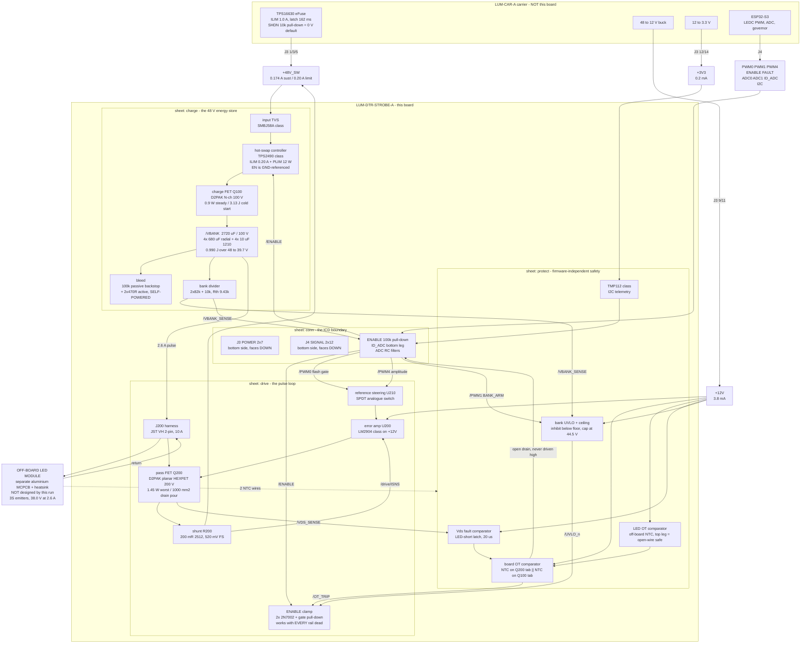

# LUM-DTR-STROBE-A - block architecture

P2 architect, 2026-07-28. Inputs: `requirements.md`, the six `research/*` fragments,
`brief/05-lumina-closed-decisions.md`, and **`boards/lumina-carrier/architecture/connector-icd.md`
rev A2** (the authoritative ICD - the DRAFT-A copy in `brief/06-connector-icd.md` is superseded).

Baseline is **WHITE-ONLY** (D-04 recommendation, pending the human's verdict at H1). The RGBW
delta is costed in section 6 but not designed.

---

## 0. The five numbers that define this board

| Quantity | Value | Set by |
|---|---|---|
| **String voltage at 2.6 A** | **38.0 V** (band 37.0 - 39.0 accepted) | this document, s3 |
| **Bank window floor** | **39.7 V** = `V_string + 1.7 V`, derived not constant | this document, s2 |
| **Bank normal ceiling** | **44.5 V**; **48.0 V only while firmware asserts BANK_ARM** | this document, s2 |
| **Charge-path current limit** | **0.20 A hard limit** (not a slew limit) | ICD s6.6 + the af PSE class budget |
| **Peak string current** | **2.6 A**, inside every die's DC maximum, zero pulsed headroom | STR-REQ-12 + refdesign D9 |

Everything below follows from those five.

---

## 1. Block diagram - signal and power

**Zero local regulators. Zero magnetics. Two linear elements** - the charge FET and the pass
FET - and they share one invariant burden (see `power_tree.md` s2).

---

## 2. Blocks, with the lead candidate part class for each

Part **classes and MPNs only**. No LCSC codes appear anywhere in this package: S14 recorded a
from-memory code resolving to the wrong part, and resolving codes is P3 parts_search's job.

### 2.1 conn - the ICD boundary

**J3 CONNFLY DS1023-2\*7SF11** (POWER, 14 pos) and **J4 CONNFLY DS1023-2\*12SF11** (SIGNAL,
24 pos), both **bottom side, sockets facing DOWN**, 8.5 mm bodies inside the 11.0 mm stack. Pin
maps are the ICD's s3.1/s3.2 verbatim and are not restated here. This sheet also carries the
**mandatory 100 k ENABLE pull-down**, the **ID_ADC bottom leg** (placeholder value; the code is
allocated by the carrier owner and must be confirmed before P8), the two ADC RC filters (~10 nF
at each pin - the bank divider's 9.43 k source impedance sits right at the ICD's 10 k ceiling and
SAR sampling charge wants a local reservoir), small local bulk on `+12V` (**<= 4.7 uF**, so the
error amp dies promptly on unplug rather than holding the gate up) and on `+3V3`, the five
mounting holes, and every test point. **No I2C pull-ups** - the carrier owns them.

### 2.2 charge - the 48 V energy store

**Hot-swap / power-limiting controller, TPS2490 class** (MSOP-10, 9-80 V), driving an external
high-side N-channel **D2PAK 100 V HEXFET, IRF540N class**. Chosen over an NTC, a bare
gate-RC MOSFET and a 60 V integrated eFuse for the reasons protection-sense s1 established; the
three properties that make it the right part *here* are (a) its **EN pin is GND-referenced with a
100 V absolute maximum**, so `ENABLE` drives it directly with no 3.3 V rail present, (b) it holds
GATE low below its own POR and UVLO, which is exactly ICD s8.3's "48 V is dead at power-up" case
for free, and (c) it has an explicit programmable current limit, which ICD s6.6 now **requires**.

**Bank: 4 x 680 uF / 100 V radial aluminium electrolytic, Ymin LKMJ class** (D18 x 25, 7.5 mm
pitch, 105 C / 10,000 h, AEC-Q200, published ripple) **+ 4 x 10 uF / 100 V X7S 1210, Murata GRM32
class**. 2720 uF total, 43.9 mohm ESR at 120 Hz, 8.7x ripple margin. **Lay out six radial
footprints and populate four** (energy-store s7): it second-sources the bank at 470 uF across four
vendors, and gives a 2720 -> 4080 uF knob with no respin. The electrolytics carry a published
ripple-current rating in the BOM per STR-REQ-08, and their vents must point away from the LED
wiring and the connectors.

**Bleed: 100 k 0805 permanent backstop + 2 x 470 ohm 2512 active path**, switched by a **150 V
N-channel SOT-223, CJT04N15 class**, whose gate is biased **up from `/VBANK`** through 1 M and a
10 V zener and pulled **down** to disarm by a 2N7002 driven from ENABLE. That polarity is the
whole point: "every rail dead" is the **ON** state, so an unplugged board is under 10 V in 4.0 s
with no rail and no firmware. An ENABLE-inverting stage powered from `+3V3` cannot invert anything
after an unplug, which is precisely the case it exists for.

**Bank divider: 2 x 82 k + 10 k, 0805**. Satisfies both halves of the HV rule at once - 0805 *and*
series-split - so each resistor sees only 26.9 V at the 57 V worst case (6.6x margin on a 150 V
working rating). Rth 9.43 k, inside the ICD's 10 k ADC limit. It feeds three consumers:
`ADC0`, the bank UVLO/ceiling comparator, and the Vds-fault comparator's reference leg.

**Input TVS: SMBJ58A class** (58 V standoff, 93.6 V clamp at 6.4 A, 600 W). Clamps below the
100 V capacitor rating with 6.4 V to spare. **No MOV-to-earth network anywhere** - the PD is
unearthed and copying one out of a reference design is a defect, not an improvement.

### 2.3 drive - the pulse loop

**Pass element: D2PAK planar HEXFET-5, 200 V / 18 A class, IRF640N class.** Selected on
*generation and thermal headroom*, not on Rds(on): no MOSFET on JLCPCB publishes a linear-mode SOA
characterisation, so the choice falls to planar-over-trench (lower ZTC point, less of the operating
range thermally unstable - the Spirito mechanism) plus derived thermal margin. The 200 V part is
preferred over the 100 V IRF540N class because the LED-short fault puts the full 57 V across it.
**The D2PAK beats the TO-220 here** - in a sealed box with no airflow the surface-mount conductive
path into copper (40 C/W datasheet, ~47 C/W by the P8 model at 900 mm2) beats the TO-220's
convective path (62 C/W), inverting the usual "THT power part is safer" instinct.

**Error amplifier: dual op-amp, LM2904 class, SOIC-8, biased from `+12V`.** The controlling
constraint is gate headroom, and it eliminates `+3V3` outright: the pass FET's source sits 0.52 V
up on the shunt and a planar HEXFET needs 5-7 V of Vgs at 2.6 A, so a 3.3 V rail delivers only
2.78 V - below the worst-case threshold - and would force a logic-level trench part, which is the
worst possible linear pass element. The Basic-shelf LM358 is **rejected on temperature grade**
(0 to +70 C against 69 C internal air), not on function. The second half of the package buffers
the setpoint at zero extra parts.

**Shunt: 200 mohm 3 W 2512, 1 %.** 520 mV full scale, 1.35 W peak at 6.7 % duty (0.091 W average).
200 mohm rather than 50 mohm because at the STR-REQ-04 10 % dim point the setpoint is 52 mV, so an
LM2904's 7 mV worst-case offset is a 13 % error instead of 54 %. Kelvin *layout* (sense traces to
the pad ends) - no 4-terminal 2512 exists at JLC.

**Flash gating: SPDT analogue switch, SGM3157 class, SC-70-6.** It steers the regulator *reference*
between the filtered setpoint and GND. The 3.3 V PWM never touches the gate; steering the reference
is what gives a square optical edge without fighting the loop. No gate driver and no level shifter
are needed - the source is within 520 mV of ground, so this is a true low-side device and the
op-amp is simultaneously error amplifier and gate driver.

**ENABLE interlock: 2 x 2N7002 (JLC Basic) + a gate-source pull-down.** The interlock of record is
**passive and discrete**. An LVC gate is explicitly rejected as the safety element: LVC inputs have
clamp diodes to Vcc, and with `+3V3` dead but a live 3.3 V PWM line still driven from the carrier,
current flows into the dead rail and the output state is undefined - and the ICD refuses to
guarantee mate order in either direction.

**Drain clamp: a second SMBJ58A-class TVS drain-to-source.** Harness inductance (0.5-2 uH at 2.6 A
= 1.7-6.8 uJ) produces 13-52 V of L di/dt at a 100 ns turn-off on top of a 48 V bank. **It must be
a drain-source TVS or verified avalanche capability, NOT a freewheel diode across the string** - a
freewheel path recirculates harness current *through the LEDs* and produces exactly the decay tail
STR-REQ-01 forbids. The energy is trivial; the topology is not.

**Harness: J200, JST VH 2-pin THT, 10 A / 250 V.** 2.6 A peak / 0.174 A average is a ~4x derate and
the 250 V rating makes the 0.635 mm clearance rule trivial to meet. Internal wire-to-board is
permitted - the ICD only forbids connectors that leave the enclosure. **Run the two conductors as a
tight pair and add no capacitance at the module end.**

Note what is deliberately absent: **no inductor, no output capacitor across the string.** Every
constant-current LED driver IC stocked at this power level is a switching buck, and its inductor
plus output capacitance is precisely the energy storage that produces a decay tail and blunts the
sub-millisecond edge. That branch is closed on topology, and independently on dimming bandwidth
(those parts specify PWM dimming at 100 Hz - 1 kHz against a 9.766 kHz carrier). The discrete
op-amp + shunt + FET loop is not a preference - it is what the catalogue and STR-REQ-01/-11 force.

### 2.4 protect - safety that does not need firmware

**Two dual comparators, LM2903 class, SOIC-8, both biased from `+12V`.** Four sections:

| Section | Function | Output goes to |
|---|---|---|
| A1 | **Board over-temperature.** NTC on Q200's tab in **parallel** with NTC on Q100's tab as the bottom leg of a +12 V divider - the hotter device dominates, so one section ORs both. Trip ~110 C tab | `/OT_TRIP` |
| A2 | **LED-module over-temperature.** Off-board NTC as the **top** leg, so an open harness wire pulls the node low and trips - fail-safe on a broken wire. Trip ~100 C solder point | `/OT_TRIP` |
| B1 | **Vds fault (LED short).** See s5 | `/OT_TRIP`, latched |
| B2 | **Bank UVLO + ceiling.** See s2 | `/UVLO_n`, charge-path EN |

All outputs are **open collector**. `/OT_TRIP` pulls the pass-FET gate clamp *and* `FAULT` low.
`FAULT` is **never driven high** - this board fits no pull-up; the carrier's 10 k owns it, and an
open-collector output tied to a 3.3 V net is legal regardless of the comparator's own 12 V supply.
`/UVLO_n` inhibits the drive stage only; an empty bank at power-up is not a fault and must not
assert `FAULT`.

**Telemetry: TMP112 class, I2C, on `+3V3`**, plus a second off-board NTC into `ADC1` on an
independent `+3V3`-referenced leg. Two thermistors on the module cost about $0.08 and mean a
shorted telemetry wire cannot defeat the trip.

Biasing every protection element from `+12V` is the fix for `research/power.md` **OPEN-4**: with
the loop biased from `+12V`, the drive stage is *fully functional* with the daughter's `+3V3`
absent, so a `+3V3`-powered over-temperature trip would be a single point of failure of the one
protection STR-REQ-20 says must not have one. **The protection now sits on a rail no less
available than the thing it protects.** Telemetry stays on `+3V3` - if it dies, nothing unsafe
happens, and firmware sees the ADC go quiet.

---

## 3. The LED module - off-board, and NOT designed by this run

**The emitter array lives on its own single-layer aluminium MCPCB bolted to a heatsink, wired back
to J200 by two conductors. That MCPCB, its heatsink and its optic are a separate deliverable which
this run does not design.** This board's entire obligation to it is: two harness conductors, two
thermistor conductors, and the numbers in this section.

### 3.1 Resolving the emitter conflict

`led-emitter.md` picked Cree XP-G2 in a 12S2P / 24-die array at ~$53/board **because no JLC-stocked
white LED is DC-rated for 2.6 A**. That constraint does not exist: the array is off-board on a
separate PCB, so it is **not a JLC PCBA line item** and can be bought from Digi-Key, Mouser or LCSC
retail. `refdesign-pulsed-led-driver.md` D9 is therefore the fragment that wins the conflict:
**select an emitter whose DC forward-current rating covers 2.6 A at the derated solder-point
temperature, and budget zero pulsed headroom.**

Both fragments agree on the fact that decides it, and it must be carried forward verbatim:
**no white-LED vendor publishes a pulse allowance at 5-200 ms.** Cree's CLD-AP60 declines to publish
a numeric limit at all and states that operating outside the published specification negates the
warranty; ams-OSRAM's "surge current" is 10 microseconds at 0.5 % duty; JNJ's and Xinglight's pulse
footnotes are 100 us at 10 % duty. A 5-200 ms pulse is **thermally DC** for a die whose time
constant is milliseconds. There is nothing to interpolate.

### 3.2 The decision

**Primary: a single series string of large multi-die emitters DC-rated >= 2.6 A. Lead candidate
class: Cree XLamp XHP70.3 in the 12 V configuration, 3 in series.**

| Property | Value | Note |
|---|---|---|
| Arrangement | **3S1P - one series string, no parallel paths** | the point of the choice |
| Per-emitter current | 2.6 A | inside the DC rating; zero pulse headroom claimed |
| Nominal Vf per emitter at 2.6 A | ~12.7 V | **estimate - the datasheet Vf on disk is 11.2-12.2 V at 1050 mA / 85 C. Vf at 2.6 A is a P3 confirm item** |
| String Vf at 2.6 A | **38.0 V nominal, 37.0 - 39.0 accepted** | s2 shows the board works across the band |
| Peak electrical | **98.8 W** for 8.68 ms | |
| Rth junction-to-solder-point | ~0.2 C/W | 32.9 W per emitter -> 6.6 C junction rise; the pulse is not the thermal problem |
| Ballast / binning needed? | **No** | there is no parallel path to imbalance |
| Emitter cost | **~$30-45 / board** (3 emitters at distributor single-qty) | estimate; the only price on disk verified live is the XP-G2 figure below |

**Why a single string is worth paying for.** Every 2.6 A arrangement built from 1.5 A-class dies is
a parallel string, and `led-emitter.md` risk 1 says so. Parallel sub-strings need either Vf-matched
binning or ballast resistors, and the arithmetic is unforgiving: an unbinned XP-G2 13S2P pair
mismatches by ~1.3 V across the string, which needs ~5 ohm of ballast per string to hold the split
inside +/-10 % - **8.45 W per string of peak ballast loss and 6.5 V of string voltage**, which
destroys the window. Single-Vf-bin ordering plus ~1 ohm per string gets it to +/-11 % at 1.7 W
peak per string, off-board. That is survivable but it is three extra ways to get the build wrong.
**One string has none of them.**

**Verified fallback, if the XHP70.3's measured Vf at 2.6 A lands outside 12.3 - 13.0 V per emitter:
Cree XP-G2, 13S2P, 26 dies at 1.30 A, 38.2 V at 2.6 A, ~$57.50/board.** Requires
**single-Vf-bin ordering plus ~1 ohm of per-string ballast on the MCPCB**. `led-emitter.md` rejected
13S only because 38.2 V "breaks the <= 38 V limit" - that limit existed to preserve headroom above a
40 V floor which s2 shows is itself a derived quantity, so 13S is now in bounds. XP-G2 remains the
only candidate whose datasheet lets P8 *prove* STR-REQ-13/-14/-15 from paper (Vf table at four
currents, Rth j-sp 1.4 C/W, relative-flux and delta-CCx/CCy vs current), which is why it stays the
documented alternate rather than being dropped.

**P3's part-sourcer will NOT find the emitter on JLCPCB. That is correct and expected.** It is a
mechanical/optical BOM line alongside the MCPCB, the heatsink and the diffuser, sourced from
Digi-Key or Mouser. The same is true of the two thermistors: JLC stocks **no leaded, probe or
ring-lug NTC at all** - its entire NTC catalogue is SMD chip thermistors and THT inrush discs.

### 3.3 Optic, and the number that decides it

**No optic on the emitters.** The room is 5 x 7 m with a 2.5 m ceiling and the fixture sits ~2.3 m
above the floor. A bare 120-degree FWHM emitter gives a half-intensity radius of 4.0 m at that
height - an ~8 m pool, wider than the room's short dimension. Every off-the-shelf TIR lens for this
package class narrows that to 10-45 degrees, i.e. a 0.4-1.9 m spot: exactly the failure STR-REQ-16
warns about. Use a **flat diffuser or a clear window in the enclosure**, which also takes the edge
off the point-source glare of a 10,000 lm flash at eye level. If more punch is ever wanted the right
class is a 60-90 degree wide/frosted TIR, from Carclo or Ledil through Mouser - **JLC stocks zero
optics of any kind**.

### 3.4 What 8.5 W looks like in that room

Scaled from `led-emitter.md` s5 to this board's numbers (6.61 W of sustained LED power, 98.8 W peak):

| | value |
|---|---|
| Peak flash | **~10,000 lm** for 8.68 ms, ~600 lux directly beneath one fixture |
| 4-6 fixtures firing together | ~1,000-1,500 lux at a floor point, against 1-20 lux room ambient |
| Time-averaged | **~720 lm per fixture**, ~40-50 lux beneath, ~130-200 lux room average with five fixtures |

**The honest framing: the peak is genuinely violent, the time-average is dim room lighting.** That
is what an 8.5 W-fed strobe should be. Pulsing costs about 30 % of the lumens the same average watts
would give run continuously (efficacy droop) - which is a lever the governor can use for
STR-REQ-07's graceful degradation, because **stretching a pulse recovers efficacy as well as
avoiding a missed beat.**

### 3.5 The heatsink flag, restated because it is outside this board and caused by it

The ICD's 56 C (af) / 69 C (at) internal-air figures **predate this 6.6 W sustained LED load.** If
the heatsink sits inside the sealed plastic box, that box must shed ~6.6 W to outside air through
plastic and the internal air will not stay at 56 C. The only arrangement that closes is bolting the
heatsink to or through the enclosure wall so the wall is the radiator - and per ICD s9 and H1-Q5
that heatsink is at PoE potential and must remain non-user-accessible and unbonded to anything
earthed. **This is an enclosure decision, not a PCB decision, and it is the largest thermal
uncertainty in the fixture.**

---

## 4. PWM channel allocation, and a firmware/ICD note worth surfacing

ICD s3.3: `PWM0-3` = LEDC **timer 0**, `PWM4-7` = LEDC **timer 1**; channels on one timer share
frequency **and** resolution; default 13-bit at 9.766 kHz.

| Pin | Timer | Function | Waveform |
|---|---|---|---|
| **PWM0** | **0** | **FLASH_GATE** | **A 5-200 ms one-shot pulse at 1-25 Hz. NOT a 9.766 kHz PWM waveform.** |
| **PWM1** | **0** | **BANK_ARM** | Static DC level: 0 % duty = normal (44.5 V ceiling), 100 % duty = armed (48 V). Frequency-agnostic |
| **PWM4** | **1** | **AMP_SET** | 13-bit at the ICD default 9.766 kHz, RC-filtered (10 k + 100 nF) and divided 6.35:1 into the regulator reference |
| PWM2, PWM3, PWM5, PWM6, PWM7 | - | **unused, no connection at the socket** | reserved for the RGBW delta |

**The flash gate cannot be expressed as a duty cycle on a 9.766 kHz carrier.** One period is
102.4 us; an 8.68 ms flash is 85 consecutive periods, not a duty setting. Two ways out, and the
choice belongs to firmware:

1. **Drive PWM0 as a plain GPIO one-shot** from a hardware timer or the RMT peripheral. This is what
   the signal actually is, and it is the recommendation.
2. **Re-program LEDC timer 0 to the flash rate** (1-25 Hz, 13-bit -> 4.9-122 us of resolution), in
   which case an 8.68 ms flash at 5 Hz is duty 0.0434 = 356 counts. That is perfectly usable.

**Option 2 is free here only because this board owns timer 0 exclusively** - PWM1 is used at 0 % or
100 % duty, where frequency is irrelevant, and PWM2/PWM3 are unconnected. **If the carrier's
firmware architecture assumes all eight LEDC channels sit at the ICD default 13-bit / 9.766 kHz,
that assumption does not hold for this daughter.** This is a firmware/ICD note, not an ICD change -
s3.3's timer partition is untouched and no daughter shares this carrier. Raise it at the checkpoint
so the firmware author is not surprised.

**Two firmware contracts to carry into DOC-01 and the carrier's firmware interface:**

- **Amplitude must be programmed at least one flash period (~5 ms) before the flash it applies to.**
  The RC setpoint filter settles to 1 % in 4.6 ms - comfortably inside the 40 ms period at 25 Hz,
  but most of a full-output flash. Ripple at 9.766 kHz is 2.6 % of full scale and optically
  invisible.
- **`ENABLE` is a slow arm/disarm with a ~10 s minimum re-arm interval. It is NOT a per-flash or
  per-cue gate - `PWM0` is.** Each ENABLE cycle costs a 3.13 J cold start in the charge FET; at a
  1.33 s re-arm interval the mean hits the D2PAK's steady-state limit and the part cooks. The
  penalty is graduated, not a cliff - the active bleed's 2.6 s time constant means a 100 ms ENABLE
  glitch drops the bank only ~3.5 %.

---

## 5. The LED-short fault - decided, not deferred

`drive-stage.md` **R1** is the single-fault case that has to be answered here: if the string shorts
(solder bridge, harness fault, an emitter failing short), **the current loop keeps regulating
2.6 A and the pass FET absorbs the entire rail - 125 W at 48 V, 148 W at the 57 V worst case - and
it does not self-terminate**, because the loop never enters dropout. It runs for the full commanded
on-time, up to 200 ms, and it repeats on every commanded flash: at 6.7 % duty the *mean* is ~9.9 W
against a 1.5 W steady allowance, so even if each individual pulse survives, the part cooks in
seconds.

**Decision: a Vds foldback comparator as the fast primary, plus FET thermal sensing as the slow
backstop. A maximum-on-time one-shot is rejected as the primary** - it bounds one pulse but does
nothing about the repetitive mean, which is the case that actually destroys the part.

The fault signature is unusually clean because of the topology. The pass FET's drain **is** the LED
cathode, so `V_drain = V_bank - V_string`: **1.7 to 10.0 V in healthy operation, and `V_bank` itself
- 48 V - when the string is shorted.** Expressed as a ratio it is 0.04-0.21 healthy against 1.00
faulted, so:

- **Comparator B1 compares a divided `/LED_K` against ~0.45 x the divided `/VBANK`.** Both legs come
  from identical 2 x 82 k + 10 k dividers, so the trip is **inherently ratiometric and needs no
  voltage reference at all** - two resistors set the 0.45 and that is the whole circuit. The bank
  leg is the divider that already exists for `ADC0`.
- **Response: comparator propagation (~1.3 us) plus the divider RC (~10 us) = under 20 us.** At
  148 W for 20 us the die absorbs 3 mJ, about 3 C of junction rise. The FET does not notice.
- **Arming blank.** When the FET is off the drain sits at `V_bank` through the string, which is the
  fault signature, so the comparator must be armed only ~100 us after `FLASH_GATE` asserts. One
  10 k / 10 nF RC on the arming node does it.
- **Latched, and cleared only by `ENABLE` going low.** A fault latch is not an ENABLE latch - the
  same distinction the hot-swap controller already relies on - so STR-REQ-21's "never latch ENABLE
  locally" is honoured, and firmware gets a fault it can see on `FAULT` and clear deliberately.
- **Slow backstop: an NTC in Q200's own drain pour**, ORed into the board over-temperature
  comparator. This catches anything the Vds test misses (a partial short, a degraded emitter, an
  802.3at thermal overrun) and it is the element that makes the FET's thermal margin a *measured*
  quantity rather than an assumed one.

Cost of the whole answer: one extra dual comparator, one 2N7002 for the latch, one NTC and about
six resistors - **roughly $0.15/board.** For a single-fault safety-adjacent case that is not a
decision worth agonising over.

---

## 6. RGBW delta - costed, not designed

If the human overturns D-04 and asks for RGBW, this is what changes. **Nothing below is designed.**

| Axis | White-only (baseline) | RGBW | Delta |
|---|---|---|---|
| Drive stages | 1 | **4** | +3 x (pass FET + shunt + half an op-amp + SPDT + clamp + setpoint RC) = **+$3.60/board** |
| PWM channels | 3 of 8 (gate, arm, amplitude) | **8 of 8** (4 gates + 4 amplitudes) or 5 with a quad I2C DAC | **Zero spare channels.** The DAC route costs +$2.66 and puts I2C traffic in the flash path |
| Sense channels | 2 ADC + I2C | 4-5 wanted | **The 2-ADC budget breaks; per-colour sense must move to I2C** (requirements s2.4 already flags this) |
| Bank | 2720 uF, shared | **2720 uF, still shared** | **No change.** The rail is the limit, not the bank |
| Total light | 6.61 W sustained | **6.61 W sustained** | **No change. RGBW does not buy more light - it divides the same light into colours** |
| Board dissipation | 1.89 W in one pass FET | **1.89 W across four** | **Thermally easier, not harder**, in the shared case - the linear loss parallelises. The worst case (one colour alone at 2.6 A) is unchanged |
| Drain pour area | 1000 mm2 | 4 x ~350 mm2 = **1400 mm2** in the shared case; 4 x 1000 mm2 if any colour may run alone at full current | **The single-colour-at-full-power case does not fit.** Closing it means capping per-colour current near 1.3 A, which doubles the die count per colour |
| LED module | 3 emitters, 1 MCPCB, 2 wires | 4 colour strings, bigger MCPCB, **5-wire harness** | **+$40-80/fixture**, 4x the emitter selection, binning and thermal work |
| Verification | one drive stage, one colour-cast criterion | four stages, plus a **4-way colour-mixing spec** for STR-REQ-14 | ~4x the P8 and bench effort |

**Bottom line: about +$4-6 on this board's BOM, +$40-80 on the LED module, all 8 PWM channels
consumed, and roughly 3-4x the placement claim for the drive stages - in exchange for percussive
coloured blasts at strobe speed, which the 6-8 RGBW pars physically cannot produce.** It does not
make the fixture brighter. **Recommendation stands: white-only.**

---

## 7. Rough cost picture for checkpoint 1

Part costs at the qty-6 break, from the live JLCPCB figures in the research fragments.
`order_quote` does the real numbers at P10.

| Block | $ / board |
|---|---|
| Bank (4 x 680 uF radial + 4 x 10 uF 1210) | 6.18 |
| Charge path (hot-swap controller + D2PAK + sense + passives) | 3.72 |
| Drive stage (pass FET + op-amp + shunt + SPDT + 2 x 2N7002 + passives) | 1.20 |
| Protection and sense (2 x comparator + TMP112 + 4 NTC + 2 TVS + dividers + bleed + ID) | 1.02 |
| Connectors J3 + J4 + J200 + J300 | ~1.60 |
| Misc passives, test points | ~0.30 |
| **BOM subtotal** | **~$14.00** |
| PCB, **4-layer 100 x 80 mm at qty 5-10** | ~$3 |
| JLC Extended-part handling, ~15 unique Extended parts amortised over 6 boards | **~$7.50** |
| **Total, this board** | **~$24.50** |

Against open question 7's default of **$25/board at qty 6 excluding the LED module**, that lands
essentially on target - but note that **the Extended-part setup fee is 30 % of it.** There is no JLC
Basic part in the bank, the comparators, the op-amp, the hot-swap controller, any 100 V MOSFET or
any board-to-board connector; only the 2N7002 and the 0805/0603 passives are Basic. That is not a
selection error, it is the shape of the catalogue at 100 V.

**Light engine, budgeted separately with the fixture:** emitters ~$30-45 + aluminium MCPCB ~$5 +
heatsink ~$8-12 + diffuser ~$3 = **~$46-65 per fixture.** The LED remains the most expensive line.

---

## 8. What was rejected, and why - for `decisions.md`

| Rejected | Reason |
|---|---|
| Switching CC LED driver (any) | Inductor + output capacitance is the decay tail STR-REQ-01 forbids; and every stocked part specifies PWM dimming at 100 Hz - 1 kHz against a 9.766 kHz carrier |
| Shunt-FET dimming | Keeps burning bank current while the LED is dark; halves the achievable flash rate on this budget |
| Hard-switched FET + series resistor | `I = (V_bank - Vf)/R` swings 5:1 over the window - the same visible decay, produced resistively |
| NTC inrush thermistor | 1.0-9.6 A cold inrush against a 1.0 A PD limit; 0.54-0.99 W permanent burn; **5.5-12 A hot re-strike**, which on this board is not an abuse case - it is what happens every time firmware toggles ENABLE |
| Bare gate-RC soft-start MOSFET | The 0.65 s charge lands in the dead zone between the last plotted 10 ms SOA curve and the DC line on every JLC-stocked MOSFET; no vendor certifies it |
| 60 V integrated eFuse (TPS26600 / TPS16630 class) on the daughter | 3 V of headroom over the 57 V worst case, and no power-limit engine |
| `+3V3` bias for the analogue loop | 2.78 V of Vgs against a worst-case 4 V threshold; forces a trench part, the worst linear pass element |
| Local 48 V-derived linear bias | 2.7x the budget cost, adds a part inside the 48 V domain, and is dead for the hundreds of ms when `+48V_SW` is dead - exactly when the gate must be actively held low |
| LVC logic gate as the ENABLE interlock | Undefined output with `+3V3` dead and a live PWM line; the ICD guarantees no mate order |
| Freewheel diode across the string | Recirculates harness current through the LEDs = the forbidden decay tail |
| Paralleling the pass FET | Linear-mode paralleling is unstable without source ballast, and ballast re-introduces the dropout headroom the window is trying to save |
| Larger bank (4x, ~12,000 uF) | Does not fit (5,104 mm2 = 64 % of the board), does not change sustained rate, does not reduce dissipation, and 12,000 uF still holds full output for only 36.9 ms - not the 100-200 ms STR-REQ-01 asks for. Reaching 100 ms needs ~32,500 uF |
| Film or polymer bulk at 100 V | Film is ~100x worse volumetrically; the largest stocked 100 V polymer is 220 uF and rated only 2,000 h at 105 C |
| A bought white COB | The entire stocked white COB population is three SKUs totalling 17 pieces, all under 13.5 W |
| On-board LED array | 15-25 C/W FR4-to-still-air for a patch that size means 120-200 C of rise at 6.6 W, and there is no area for it |
| MOV-to-earth surge network | The PD is unearthed; copying one out of a reference design is a defect |
