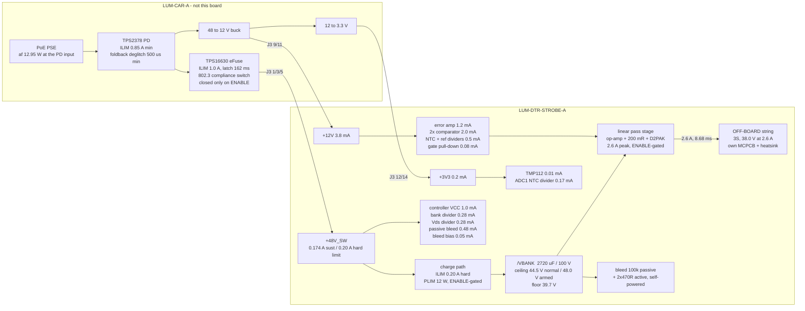

# LUM-DTR-STROBE-A - power tree and pulse energy budget

P2 architect, 2026-07-28. Lifted from `research/power.json` / `research/power.md` and
**reconciled against the final block choices** (38.0 V string, 39.7 V floor, 44.5 V bank ceiling,
0.20 A charge limit). Where a number here differs from the research fragment, the reason is stated.
Design case is **802.3af** per requirements s3.1 and D-01.

---

## 0. Six things the arithmetic decided

1. **This board needs no local regulator of any kind.** Three rails in, three rails used directly.
   The only power-conversion element is the bank charge path, and it is a current limiter, not a
   voltage converter.
2. **Board dissipation is an invariant, not a design variable:**
   `P_board = P_rail x (48 - V_string)/48 + P_housekeeping`. It does not depend on flash rate,
   flash energy, bank capacitance or bank voltage. **String voltage is the only first-order lever.**
   Taking the string to 38.0 V cuts board dissipation from 2.33 W to **1.89 W (-19 %)** and puts the
   same 0.44 W into the light.
3. **The charge path is a permanently-cycling current limiter, not a start-up element.** After every
   flash the bank sits up to 8.3 V below the rail with the charge FET fully enhanced, so the
   limiter re-enters regulation on every top-up - **~88 % of the time whenever the board is flashing
   at the sustained budget.** Neither research fragment states this and it changes how the
   controller must be configured (s3.3).
4. **The charge limit is 0.20 A, not the ICD's 0.25 A ceiling** - because 0.25 A is 12.0 W of
   instantaneous 48 V draw which, added to the carrier's 2.4 W overhead, exceeds the 12.95 W af
   class budget for longer than the PSE's 50-75 ms overload timer. 0.20 A is 9.6 W, total 12.0 W,
   permanently inside the envelope at any duty. See s3.2.
5. **From a full bank you get exactly ONE full-energy flash.** Flash 2 is at 31 %. That is algebra,
   not a shortfall: one full flash *is* the whole window.
6. **The bank ceiling is the knob that shares heat between the two linear FETs, and it is what makes
   the af thermal case comfortable.** At the 44.5 V normal ceiling both FETs sit near 0.82 W against
   a 1.47 W allowance; charging to 48 V and holding at 25 Hz puts 1.43 W in the pass FET alone.
   Identical average light either way.

---

## 1. The rail tree



### 1.1 Rail-by-rail

| Rail | Vin | Local topology | Regulator? | Sustained | Peak | vs ICD s6.2 af ceiling |
|---|---|---|---|---|---|---|
| `+48V_SW` | J3 1/3/5, carrier eFuse | **direct**, plus a hard-current-limited charge path to the bank | **No** | **0.174 A** | **0.20 A** (the limit itself) | 70 % of the 0.25 A rail ceiling; 20 % of the 1.0 A fault ceiling; 3.7 % of the 5.40 A pin capacity |
| `+12V` | J3 9/11 | **direct**, decoupled only, local bulk **<= 4.7 uF** | **No** | **3.8 mA** | 3.8 mA | **0.51 %** of the 0.75 A ceiling |
| `+3V3` | J3 12/14 | **direct**, decoupled only | **No** | **0.18 mA** | 0.18 mA | **0.07 %** of the 0.25 A ceiling |
| `/VBANK` | via the charge path | 2720 uF / 100 V store, operating 39.7 - 48.0 V | n/a | 0.174 A in | **2.6 A out** (pulse; never crosses the connector) | - |

### 1.2 Housekeeping, rail-referred to the 48 V input

`+12V` loads x1/0.90 for the carrier buck; `+3V3` loads x1/0.85 for the chain.

```
  +48V_SW  2.18 mA x 48 V                    = 104.8 mW
  +12V     3.80 mA x 12 V / 0.90             =  50.7 mW
  +3V3     0.18 mA x 3.3 V / 0.85            =   0.7 mW
  ---------------------------------------------------------
  TOTAL                                      = 156.2 mW   = 1.84 % of the 8.5 W envelope
```

**Therefore `P_avail` for the flash chain = 8.344 W (af) / 18.344 W (at).**
At 48 V that is **174 mA (af) / 382 mA (at)** - the **8.5 W total binds and the 0.25 A per-rail
ceiling never does**, exactly as ICD s6.2 says.

> **Delta vs `research/power.md`:** its housekeeping figure was 114 mW. This design adds a second
> dual comparator and its dividers on `+12V` (the OPEN-4 fix, s5) and a second 164 k / 10 k divider
> on `/LED_K` (the LED-short detector, `blocks.md` s5). +42 mW, 0.5 % of the envelope. The
> ICD s6.3 guidance to "take power on `+48V_SW`" is still fully honoured: **100 % of this board's
> actual power** comes off `+48V_SW`, and the 3.8 mA of `+12V` costs 5 mW of conversion penalty
> against the 0.67 W the guidance is about.

---

## 2. The invariant, and why the string went to 38.0 V

```
  P_board = P_rail x (48 - V_string)/48 + P_housekeeping
  P_FETs  = P_rail x (48 - V_string - V_shunt)/48        (V_shunt = 0.52 V at 2.6 A)
```

Independent of flash rate, per-flash energy, bank capacitance and bank voltage. Every joule the rail
delivers either reaches the LED (`V_string/48` of it) or is burnt on this board.

| `V_string` | `P_FETs` (af) | `P_board` (af) | Sustained LED power | Window floor | `E_bank` per full flash | `E_LED` per full flash |
|---|---|---|---|---|---|---|
| 35.3 V (`led-emitter` 12S2P) | 2.117 W | 2.322 W | 6.14 W | 37.0 V | 1.286 J | 1.073 J |
| 36.0 V | 1.995 W | 2.200 W | 6.26 W | 37.7 V | 1.202 J | 1.006 J |
| **38.0 V (chosen)** | **1.647 W** | **1.894 W** | **6.606 W** | **39.7 V** | **0.990 J** | **0.858 J** |
| 39.0 V | 1.473 W | 1.720 W | 6.78 W | 40.7 V | 0.877 J | 0.766 J |

**The chosen point reproduces the ICD's own headline figure exactly.** ICD s6.4 states 0.99 J over
the 48 -> 40 V window for 2800 uF; this design gets **0.990 J** over 48 -> 39.7 V from 2720 uF,
while taking 19 % of the board's heat off the FETs and putting it into the light. That is why
38.0 V was chosen over `research/power.md` OPEN-2's suggestion of dropping the floor to 36.7 V with
a 35.3 V string: **the deeper-window route buys +25 % of blast energy but costs +29 % of board
dissipation and drops the full-energy flash rate from 7.7 Hz to 6.2 Hz.** Moving the string up
instead gets the ICD's stated energy for less heat.

**What moved, and what did not.** The 38.0 V string is the STR-REQ-12 / `drive-stage` s0 ceiling,
so nothing there moves. **The 40 V window floor does move, to 39.7 V** - and the honest statement is
that the floor was never a constant: it is `V_string + V_shunt + I x Rds(on)_hot + loop margin`
= `V_string + 1.7 V`. ICD s6.4 is illustrative cap-bank arithmetic; s6.2's rail contract and s6.6's
charge contract are the binding parts and neither is touched. **The floor is set by one 1 % resistor
in the UVLO divider and is trimmed at P3 to the measured string** - if the emitters bin at 37.0 V
the floor is 38.7 V, if at 39.0 V it is 40.7 V. The board works across the whole band.

---

## 3. The charge path

### 3.1 Compliance with ICD s6.6 (binding)

| ICD s6.6 requirement | This design |
|---|---|
| Soft-start must be **CURRENT-limited, not merely slew-limited** | **Hard current limit at 0.20 A**, set by the controller's sense resistor. A dv/dt gate capacitor shapes the opening edge but is not the limit |
| Operating charge current **<= 0.25 A (af)** | **0.20 A** |
| Never exceed 1.0 A; never above 1.0 A for > 162 ms | Hard limit is 0.20 A - 5x below the ceiling |
| Carrier eFuse must never enter current limit | It limits at 1.0 A; the daughter draws 0.20 A. **The 162 ms latch timer never starts** |
| The 3.2 J of charging energy must land in the **daughter's** limiter | It does: 3.13 J into the daughter's charge FET, 0 -> 48 V, in 653 ms |
| Design the charge element's SOA and thermal case around that 3.2 J event | s3.4 |

Cold start: `t = C x V / I = 2720 uF x 48 V / 0.20 A =` **653 ms**, input power a flat 9.6 W the
whole way, FET dissipation 9.6 W falling linearly to 0, mean 4.8 W, **3.13 J**.

### 3.2 Why 0.20 A and not the ICD's 0.25 A

The ICD's 0.25 A is a **sustained rail rating**. The charge path is a current *limiter*, so 0.25 A
would be an **instantaneous** draw of 12.0 W at 48 V, held for the whole of every top-up:

```
  af PSE guaranteed at the PD input            12.95 W
  carrier overhead (closed decisions, af)     -  2.40 W
  ------------------------------------------------------
  available to the daughter, instantaneous      10.55 W   ->  0.220 A at 48 V
```

At a 0.25 A limit the daughter presents 12.0 W and the fixture presents 14.4 W to the PSE - over
the af class - for 90-100 ms of every flash period, which is **well past the PSE's 50-75 ms overload
timer**. At 0.20 A the daughter presents 9.6 W and the fixture 12.0 W, **permanently inside the
class at any duty**, with 1.0 W to spare.

This also disposes of `research/power.md`'s separate "0.175 A dv/dt ramp + 0.6 A ILIM backstop"
split. That split was constructed to keep the *cold start* inside the envelope while leaving a fault
backstop below the TPS2378's 0.85 A minimum limit. A single flat 0.20 A limit does both jobs at
once - the cold start is 9.6 W for 653 ms (inside the envelope), and 0.20 A is 4.25x below the
TPS2378's worst-case limit, so PD foldback can never be provoked. **One number, one mechanism, and
it satisfies s6.6's "real current limit" wording literally.**

### 3.3 The limiter runs continuously, and that is the configuration trap

At the sustained budget the rail delivers 0.174 A on average and the limiter allows 0.20 A, so
**the charge path is in current-limit regulation ~88 % of the time** while the board is flashing.
It is not a start-up element that retires once the bank is full: after each flash the bank is up to
8.3 V below the rail with the FET fully enhanced, so the recharge would be limited only by
`Rds(on)` and the limiter must catch it.

| operating point | period | charge to replace | time in current limit | duty in limit |
|---|---|---|---|---|
| `f_full` = 7.70 Hz, armed | 130 ms | 22.58 mC | 113 ms | 87 % |
| 25 Hz, armed | 40 ms | 6.95 mC | 35 ms | 87 % |
| 25 Hz, 44.5 V ceiling | 40 ms | 6.95 mC | 35 ms | 87 % |

**Consequence for P3: the hot-swap controller's fault timer must tolerate an 87 %-duty
current-limit regime indefinitely.** Programming it longer than the 653 ms cold start (which is what
`protection-sense` R9 and `research/power.md` s7.2 asked for) is **necessary but may not be
sufficient** - if the TIMER pin's discharge rate is much slower than its charge rate, a duty-cycled
limit walks the timer to a latch during normal operation. **This is the single most important
datasheet read at P3.** See OPEN-2 in `decisions.md`; the design is arranged so that it is not
load-bearing: the fault the timer exists to catch (a shorted bank, 9.6 W continuous into the charge
FET) is independently caught within seconds by the **NTC on the charge FET's own tab**, which is
already fitted and already wired into the firmware-independent over-temperature trip.

Also program `PLIM` **above** the normal peak: `V_ds x I_d` = 48 V x 0.20 A = **9.6 W** at the start
of a cold start, so a 3 W power limit as `protection-sense` suggested would take over and stretch
the start. **PLIM = 12 W.** With a 0.20 A current limit the power limit then never engages in any
case, which is the correct arrangement - the current limit is the control and the power limit is a
ceiling, not a regulator. (Do **not** use power limiting as the ramp control: with `Vds x Id = PLIM`
the *input* current rises as the cap charges, so input power grows from `PLIM` toward `6 x PLIM`.
Wrong shape for a fixed-input-power budget.)

### 3.4 Charge-path efficiency, and why linear is acceptable here

The pass element burns `E = Q x (48 - V_mean)` where `V_mean = (48 + V_lo)/2`. **This is independent
of the charge current profile** - constant current, constant power or a resistor all give the same
loss, because `E = integral (48 - Vc) I dt = C integral (48 - Vc) dVc`. So `eta = V_mean / 48`, and
that is the whole story.

| Case | Q | `E_rail` | into the bank | burnt in the charge FET | eta |
|---|---|---|---|---|---|
| **full-window top-up, 39.7 -> 48 V** | 22.58 mC | **1.084 J** | **0.990 J** | 0.094 J | **91.4 %** |
| 25 Hz top-up, armed (45.4 -> 48 V) | 6.95 mC | 0.334 J | 0.325 J | 0.009 J | 97.3 % |
| 25 Hz top-up, 44.5 V ceiling (41.9 -> 44.5 V) | 6.95 mC | 0.334 J | 0.301 J | 0.033 J | 90.0 % |
| **cold start 0 -> 48 V** | 130.6 mC | **6.27 J** | **3.13 J** | **3.13 J** | **50.0 %** |

The ~91 % figure is high precisely because the window is narrow (44 V mean against a 48 V source).
That is what makes a linear charge path acceptable and a switching pre-regulator not worth its
parts, board area or DC-DC-hot-zone conflict. The 50 % cold-start penalty is the same physics with a
24 V mean and is unavoidable for any dissipative charge path.

---

## 4. Pulse energy budget

Bank 2720 uF; ceiling 48.0 V armed / 44.5 V normal; floor 39.7 V; string 38.0 V; shunt 0.52 V.

### 4.1 The full-energy flash

```
  window        48.0 -> 39.7 V           dV = 8.3 V
  charge        Q = C dV                 = 22.58 mC
  bank energy   0.5 C (48^2 - 39.7^2)    = 0.990 J
  LED energy    V_string x Q             = 0.858 J   (86.7 % of the bank energy)
  pass FET      (V_mean - 38.52) x Q     = 0.120 J
  shunt         0.52 x Q                 = 0.012 J
  pulse width   Q / 2.6 A                = 8.68 ms
  peak power    38.0 V x 2.6 A           = 98.8 W    (~10,000 lm)
```

**The maximum-intensity flash is 8.68 ms long.** Commanding anything shorter does not use the whole
window; commanding anything longer drops the power (s4.4).

### 4.2 Rate vs energy - af

`f_full = P_avail / E_rail_per_flash`. Above it the design is rail-limited and per-flash energy
falls as `P_avail x V_string / (48 f)`.

| mode | f (Hz) | limit | `E_bank` | **`E_LED`** | `V_lo` | pulse | duty | `P_rail` |
|---|---|---|---|---|---|---|---|---|
| armed | 1 | bank | 0.990 J | **0.858 J** | 39.70 V | 8.68 ms | 0.9 % | 1.08 W |
| armed | 5 | bank | 0.990 J | **0.858 J** | 39.70 V | 8.68 ms | 4.3 % | 5.42 W |
| **armed** | **7.70** | **both** | **0.990 J** | **0.858 J** | 39.70 V | 8.68 ms | 6.7 % | **8.34 W** |
| armed | 10 | rail | 0.789 J | 0.685 J | 41.24 V | 6.94 ms | 6.9 % | 8.34 W |
| armed | 15 | rail | 0.539 J | 0.457 J | 43.30 V | 4.63 ms | 6.9 % | 8.34 W |
| armed | 20 | rail | 0.409 J | 0.343 J | 44.37 V | 3.47 ms | 6.9 % | 8.34 W |
| **armed** | **25** | **rail** | **0.329 J** | **0.275 J** | **45.43 V** | **2.78 ms** | 6.9 % | **8.34 W** |
| normal (44.5 V ceiling) | **14.9** | both | 0.445 J | **0.445 J** at 38 V x 11.70 mC | 39.70 V | 4.50 ms | 6.7 % | 8.34 W |
| normal (44.5 V ceiling) | 25 | rail | 0.301 J | 0.264 J | 41.94 V | 2.67 ms | 6.9 % | 8.34 W |

> `research/power.md` quoted `f_full` = 8.03 Hz and ICD s6.4 quotes 8.6 Hz. Both are the same
> arithmetic on different inputs: the ICD's is ideal-charge on 2800 uF over a 40 V floor; the
> fragment's adds the charge-path loss and housekeeping; this table additionally uses the deeper
> 39.7 V window, which makes each flash **bigger** and therefore **rarer**. **Design the governor
> to 7.7 Hz when armed and 14.9 Hz when not.**

### 4.3 Burst behaviour from a full bank - the number the human needs

Full-energy demand at 25 Hz, starting from 48.0 V:

| flash | bank at start | delivered | % of full | pulse |
|---|---|---|---|---|
| **1** | 48.00 V | 22.58 mC = 0.990 J bank / **0.858 J LED** | **100 %** | 8.68 ms |
| 2 | 42.26 V | 6.95 mC = 0.301 J bank / 0.264 J LED | **31 %** | 2.78 ms |
| 3+ | 42.26 V | same | 31 % | 2.78 ms |

**Exactly one full-energy flash, then steady state.** There is no taper to design - the governor's
only real decision is whether flash 1 gets the whole bank or whether all flashes are equal.
**A 4-bar build-up ending on one maximum blast is supported. A sustained 25 Hz machine-gun section
runs at 31 % of full energy, which is musically useful but is not "blinding".** At or below 7.7 Hz
every flash is 100 %, indefinitely.

### 4.4 Single long flashes - STR-REQ-01

For flashes longer than ~9 ms the rail contributes materially during the flash itself:

| duration | bank | + rail during the flash | total | drive power | string current |
|---|---|---|---|---|---|
| **8.68 ms** | 0.990 J | 0.072 J | 1.062 J | **98.8 W** (current-limited) | **2.6 A** |
| 50 ms | 0.990 J | 0.417 J | 1.407 J | **28.1 W** | 0.74 A |
| 100 ms | 0.990 J | 0.834 J | 1.824 J | **18.2 W** | 0.48 A |
| 150 ms | 0.990 J | 1.252 J | 2.242 J | **14.9 W** | 0.39 A |
| 200 ms | 0.990 J | 1.669 J | 2.659 J | **13.3 W** | 0.35 A |

This confirms requirements s3.4 and open question 2: **"full output" at 150 ms is ~15 W of LED
drive, not 100 W.** Repetition of long flashes is rail-bound - a 200 ms / 2.66 J flash needs 2.91 J
of rail energy = 0.35 s of rail time, so **max ~2.9 Hz at 58 % duty.**

### 4.5 STR-REQ-05 worst case - continuous maximum-rate flashing

| | value |
|---|---|
| Energy in from the rail | 8.344 W, indefinitely |
| Energy out | 8.344 W, balanced by construction |
| Bank steady state, armed at 25 Hz | **45.43 <-> 48.00 V sawtooth. It does not walk down** |
| Board total | **1.894 W** (armed) / **1.894 W** (normal - the invariant; only the FET split moves) |
| LED string, off-board | **6.606 W** |

**Duration is not a free variable and 30 s is not the worst case - an indefinite run is, and it is
the same 1.894 W**, because the rail caps input at 8.5 W however long the drop lasts. A 30 s burst
is *less* severe than steady state: the D2PAK + pour time constant is order 60-120 s, so it reaches
only 60-80 % of the final rise. **The only unbounded thing in this scenario is the LED heatsink,
which is off-board.**

---

## 5. Dissipation map

Ambient is the **sealed-box internal air: 56 C (af) / 69 C (at)** (ICD s7.6), not 25 C. Design
junction limit **125 C** (a 50 C derate on the 175 C maximum, standard for a part with no
linear-mode SOA characterisation), so the allowed rise is **`dt_c` = 69 C (af) / 56 C (at)**.

**Allowance is set by `check_thermal`'s 4-layer model, not by the datasheet's 40 C/W**, because that
model is what the P8 gate enforces: `theta_JA(A) = 45 + 95 x exp(-A/235)` C/W, floored at 45 C/W.

```
  drain pour  645 mm2 -> 51.1 C/W -> 1.35 W allowed at 56 C air
  drain pour  900 mm2 -> 47.1 C/W -> 1.47 W allowed
  drain pour 1200 mm2 -> 45.6 C/W -> 1.51 W allowed
  ANY area (the model floor)  45.0 C/W -> 1.53 W allowed    <- the hard ceiling
```

**Read that last line twice: no amount of copper lets a 4-layer board dissipate more than 1.53 W in
a single package at 56 C air and a 125 C junction limit.** That single fact is what forced the
44.5 V bank ceiling in s6.

The bank ESR row is carved **out** of the pass FET's share, not added to it: the bank's 0.11 V IR
sag reduces the terminal voltage the pass FET sees. Columns sum to the board total exactly.

| element | idle | af 7.7 Hz armed | **af 25 Hz armed** | **af 25 Hz normal (44.5 V)** | at 25 Hz armed | flagged |
|---|---|---|---|---|---|---|
| **pass FET Q200** (integrated over the flash, not peak) | 0 | 0.926 W | **1.425 W** | **0.817 W** | **3.134 W** | **YES** |
| **charge FET Q100** (steady state) | ~0 | 0.721 W | 0.222 W | 0.831 W | **0.489 W** | **YES** |
| charge FET Q100 (**cold-start event**) | - | **9.6 W peak / 4.8 W mean / 653 ms / 3.13 J** | | | | **YES** |
| shunt R200 (200 mR 2512) | 0 | 0.090 W | 0.090 W | 0.090 W | 0.199 W | no (1.35 W peak, 3 W part) |
| active bleed 2 x 470R 2512 (ENABLE low only) | - | **1.23 W peak each / 0.37 W mean each / 4.0 s / 3.13 J** | | | | **YES** |
| passive bleed 100 k 0805 | 23 mW | 23 mW | 23 mW | 23 mW | 23 mW | no |
| bank ESR (43.9 mR at 120 Hz) | 0 | 0.021 W | 0.021 W | 0.019 W | 0.046 W | no |
| bank divider + Vds divider (4 x 82 k + 2 x 10 k, 0805) | 26 mW | 26 mW | 26 mW | 26 mW | 26 mW | no (6.6 mW/part) |
| hot-swap controller (MSOP-10, RthJA 165 C/W) | 48 mW | 48 mW | 48 mW | 48 mW | 48 mW | no (8 C rise) |
| other housekeeping (+12V, +3V3) | 60 mW | 60 mW | 60 mW | 60 mW | 60 mW | no |
| **BOARD TOTAL** | **0.156 W** | **1.894 W** | **1.894 W** | **1.894 W** | **4.02 W** | |
| LED string (off-board) | 0 | 6.606 W | 6.606 W | 6.606 W | 14.52 W | see `blocks.md` s3.5 |

**Note the af columns are identical.** That is the invariant of s2 - only the split between the two
FETs moves.

### 5.1 Integrating the pass FET properly

Do **not** use the peak. Over one full-window flash the bank falls 48 -> 39.7 V while the string
holds 38.0 V and the shunt 0.52 V, so `Vds` falls **9.48 V -> 1.18 V**:

```
  E_fet = Q x (V_mean - V_string - V_shunt) = 22.58 mC x (43.85 - 38.52) = 0.120 J
  peak instantaneous = 2.6 A x 9.48 V = 24.6 W  (for microseconds at flash start)
  at 7.70 Hz -> 0.926 W average.   Using the 24.6 W peak would over-state by 27x.
```

`drive-stage`'s 1.06 W figure is the same calculation with a 38 V string, an 8.6 Hz rate and an
uncorrected charge-path loss. The two corrections that move it here are the deeper window (down) and
the bank ceiling (down); the 25 Hz armed case (up) is what sets the declared 1.45 W.

### 5.2 Cold start is the larger SOA event, and it repeats

3.13 J into the charge FET, 0 -> 48 V, in linear mode, over 653 ms at a flat 9.6 W falling to zero.
**This lands in the dead zone between the last plotted 10 ms SOA curve and the DC line on every
JLC-stocked MOSFET datasheet.** No vendor certifies it; the derivation from `Pd` / `RthJC` /
`Zthjc` is comfortable but it is a derivation and must be recorded in DOC-01.

**Repeat rate is the trap.** Mean charge-FET power = 3.13 J x (ENABLE cycles/s):

```
  ENABLE re-arm every  1.33 s -> 2.35 W   (over the D2PAK steady limit: cooking)
  ENABLE re-arm every  3.13 s -> 1.00 W
  ENABLE re-arm every 10 s    -> 0.31 W   <- design rule
```

**Firmware contract: `ENABLE` is a slow arm/disarm, minimum ~10 s between assertions. It is NOT a
per-flash or per-cue gate - `PWM0` is.**

### 5.3 Bleed network

| | R | standing burn | tau | 48 -> 10 V | peak | event energy |
|---|---|---|---|---|---|---|
| passive backstop, daughter alone (unstacked) | 100 k | 23 mW (0.27 %) | 272 s | **7.1 min** | 23 mW | - |
| passive, stacked (parallel with the carrier's 100 k - no series diode) | 50 k | 23 mW | 136 s | **3.6 min** | 46 mW | - |
| **active, ENABLE-gated, self-powered** | **2 x 470R** | ~2.3 mW when armed | **2.56 s** | **4.0 s** | **1.23 W per part** | 3.13 J |

Splitting the 1 k into 2 x 470 ohm 2512 halves the per-part peak to 1.23 W - inside a 2 W continuous
rating with 1.6x margin, so **no joule rating is needed and none is published for any JLC-stocked
chip resistor.** It also doubles the working-voltage margin. Cost $0.09.

The active bleed **must be self-powered from the bank and default ON with every rail dead**: bias
the switch gate up from `/VBANK` through 1 M and a 10 V zener, and have the ENABLE-driven 2N7002
pull it **down** to disarm. Standing cost when armed is ~2.3 mW with the gate-driven form against
~58 mW for a base-driven BJT. **With this arrangement the board is under 10 V 4.0 s after unplug, in
every case, with no rail and no firmware.** Without it a board pulled off the stack holds a handling
hazard for 7 minutes. Silkscreen the stored-energy warning and the bleed time constant regardless.

---

## 6. The bank ceiling - the decision that closes the af thermal case

`P_pass = P_rail x (V_mean - V_string - V_shunt)/48` and `P_charge = P_rail x (48 - V_mean)/48`.
The total is fixed by the invariant; **the split is set by the bank's mean voltage.**

| bank charged to | `V_mean` at 25 Hz | af pass | af charge | worst FET vs the 1.47 W allowance |
|---|---|---|---|---|
| 48.0 V (armed) | 46.72 V | **1.425 W** | 0.222 W | **1.03x - passes with nothing** |
| 46.0 V | 44.72 V | 1.078 W | 0.569 W | 1.36x |
| **44.5 V (chosen normal ceiling)** | **43.22 V** | **0.817 W** | **0.831 W** | **1.77x - balanced** |
| 42.0 V | 40.72 V | 0.382 W | 1.266 W | 1.16x (the charge FET now dominates) |

**Decision: regulate the bank to a 44.5 V ceiling in normal operation, and release it to 48.0 V only
while firmware asserts `BANK_ARM` (`PWM1`).** Identical average light output, identical total heat,
and both FETs sit near the balance point at 1.77x margin instead of one at 1.03x.

Implementation: **comparator section B2** (already fitted, already biased from `+12V`) taps the
existing `/VBANK_SENSE` divider with ~1 V of hysteresis and pulls the hot-swap controller's `EN`
low above the ceiling. The obvious objection - that cycling `EN` clears the controller's fault
latch - **dissolves on inspection**: the fault the latch exists for (a shorted bank) holds the bank
*low*, so the ceiling comparator keeps `EN` asserted and the latch sticks. Cost: two resistors and a
comparator section that was already in the package.

What the human gets out of it, beyond thermal margin: **two distinct musical modes.**

| mode | ceiling | per-flash LED energy | full-energy rate |
|---|---|---|---|
| **normal** | 44.5 V | 0.445 J, 4.50 ms | **14.9 Hz** - every flash equal, up to 15 Hz |
| **armed** | 48.0 V | 0.858 J, 8.68 ms | 7.7 Hz, or one maximum blast then 31 % |

That is a better instrument than "always charge to 48 V", and it is the answer to STR-REQ-07: the
governor degrades by lowering the ceiling, which never misses a flash.

---

## 7. Sequencing and fail-safe - the four cases

The ICD gives **no first-mate / last-mate control** (s7.3): 48 V may arrive before or after 3.3 V,
in either order, on mate **and** on unmate. ICD s8.4 (rev A2) additionally guarantees that an
unprogrammed, crashed, brownt-out or held-in-reset carrier presents **0 V at J3, not 48 V** - so
this board does **not** have to defend against 48 V being live while the carrier's MCU is dead.

### 7.1 Power-up: `+3V3` and `+12V` live, `+48V_SW` dead for hundreds of ms

| what happens | why it is safe |
|---|---|
| ENABLE low (carrier 10 k + daughter 100 k, both passive) | ICD s8.1/s8.2 |
| Charge path off: controller GATE held low below its POR and UVLO, **and** its EN pin is GND-referenced with a 100 V abs max so ENABLE drives it directly with no rail | two independent holds |
| Pass FET off: gate-source pull-down + 2N7002 clamp, both rail-independent | passive interlock of record |
| Bank at 0 V | nothing charged it |

**HARD RULE for P4 and P8 (ICD s8.3 point 2): no component may bridge `+12V` or `+3V3` to
`+48V_SW`, `/VBANK` or `/drive/LED_K`.** The only nets crossing the domain boundary are (a)
`ENABLE`/`PWM` into GND-referenced control inputs, and (b) the two resistive divider taps, which run
*out* of the 48 V domain into high-impedance inputs - current can only flow 48 V -> GND through
them, never into the bank. **Make this an explicit netlist review item at P4 and a check at P8**: it
is the one requirement whose violation is invisible on the bench and only shows up as a PD
compliance failure.

**Secondary:** total daughter capacitance on the `+48V_SW` side of the charge FET must stay under
**~1 uF** (TVS + controller bypass only) = 0.56 % of the 802.3 180 uF port ceiling. The 2720 uF sits
**behind** the charge FET, where the carrier's compliance switch already hides it.

### 7.2 ENABLE asserts: 48 V steps into an empty bank

1. The carrier's eFuse closes with a deliberately fast dV/dt into < 1 uF - a non-event.
2. The controller clears POR/UVLO, then releases GATE into its **0.20 A current limit**: 0 -> 48 V
   in **653 ms**, 3.13 J burnt in the charge FET (9.6 W falling to 0). **The fault timer must be
   programmed longer than 653 ms** or the controller latches off on a normal start - see s3.3.
3. The carrier's eFuse ILIM (1.0 A) sits **5x above** the daughter's limit, so the two soft-starts
   cannot fight - as ICD s8.2 deliberately arranged.
4. **The drive stage is inhibited until the bank clears the regulation floor.** Below ~38 V the
   string cannot conduct at all; between 38 and 39.7 V a commanded flash would produce a truncated,
   dim pulse and would steal the charge current. **Comparator B2's UVLO section holds `/UVLO_n` low
   until the bank passes the floor.** This also removes the "first flash of a phrase fades in"
   failure mode.
5. **Worst mate order:** `ENABLE` connects *before* `+48V_SW`, so the charge path is armed when the
   rail arrives. Handled by (2) - the current limit makes it the same event either way.
6. **`GND`-last is not a reachable failure mode**: 2.54 mm dual-row pins mate within ~0.3 mm of
   travel and there are 12 GND pins with a GND adjacent to every supply pin.

### 7.3 ENABLE de-asserts mid-flash

1. The 2N7002 clamp pulls the pass gate to the FET source in ~us; string current stops.
2. **Harness inductance is the only stored energy needing somewhere to go** - 0.5-2 uH at 2.6 A =
   1.7-6.8 uJ, producing 13-52 V of `L di/dt` at a 100 ns turn-off on top of a 48 V bank.
   **Clamp the drain with a drain-source TVS or verified avalanche capability - NOT a freewheel
   diode across the string.** The energy is trivial; the topology is not.
3. Charge path stops (controller EN low). Bank holds its charge.
4. Active bleed engages -> 48 -> 10 V in 4.0 s, 3.13 J into the two 470 ohm 2512s.
5. Re-arm penalty: see s5.2. Minimum ~10 s between ENABLE assertions.

### 7.4 Cable unplug mid-flash - the hazard case

All three rails vanish in arbitrary order. The bank still holds up to **3.13 J at 48 V**, and the
carrier fits **no series diode** on `+48V_SW`, so the bank back-feeds onto the connector's 48 V pins.

| element | what it must do | how |
|---|---|---|
| Pass FET | turn off | The passive gate-source pull-down does it with every rail dead. `+12V` local bulk **<= 4.7 uF** so a still-powered op-amp cannot hold the gate up |
| Charge FET | turn off | Controller VCC collapses -> GATE low. **It does NOT isolate the bank**: a high-side N-channel's body diode points the wrong way, so **assume the connector pins go to bank potential** |
| **Active bleed** | **turn ON with every rail dead** | Self-powered from `/VBANK`, disarmed by pulling *down*. This is the requirement most easily got wrong |
| Passive backstop 100 k | always | The un-defeatable floor: 7.1 min to 10 V alone, 3.6 min stacked |

### 7.5 The `+3V3` single-point failure - fixed

With `+12V` biasing the loop, **the drive stage is fully functional with the daughter's `+3V3`
absent**: `ENABLE` and `PWM` arrive at 3.3 V CMOS levels from the *carrier*, the setpoint divider
runs off the PWM pin to GND, and the charge path's `EN` is GND-referenced. If the over-temperature
comparator were on `+3V3`, a daughter-local loss of that rail (both pins open, a broken track, a
shorted decoupling cap) would silently disable STR-REQ-20's firmware-independent protection while
the board kept flashing.

**Fix, adopted: every protection element - both comparators, both NTC dividers and the trip
references - is biased from `+12V`.** `+3V3` carries telemetry only (TMP112 and the `ADC1` NTC leg
on an independent `+3V3`-referenced divider). Two thermistors on the module cost ~$0.08 and mean a
shorted telemetry wire cannot defeat the trip. Note what is *not* affected: a **carrier**-side 3.3 V
failure is self-safing, because `ENABLE`'s driver goes high-Z and the carrier's 10 k pull-down
de-asserts.

One consequence to record: with `+12V` dead the comparator outputs go high-Z, so `FAULT` floats
high (= "no fault") - but with `+12V` dead the drive stage is also dead, held off by the passive
gate pull-down, so the board is safe. **The protection now sits on a rail no less available than the
thing it protects**, which was the power-architecture requirement.

---

## 8. 802.3at - the upgrade does not close on this daughter

**This is a quotable finding for the human and for the carrier owner.**

D-01 says the 802.3at upgrade is "a resistor change plus a PoE+ switch, no board respin". **For the
carrier that is true. For LUM-DTR-STROBE-A it is not.** At 18.344 W the two linear FETs must
dissipate **3.62 W** between them in **69 C air**, where the allowed rise is only 56 C:

| arrangement (38.0 V string) | worst per-FET | allowance at 69 C, `theta` 47 C/W | verdict |
|---|---|---|---|
| armed (48 V), 25 Hz | **3.13 W** | 1.19 W | **fails 2.6x** |
| normal (44.5 V ceiling), 25 Hz | **1.80 W** | 1.19 W | **fails 1.5x** |
| at the model's 45 C/W floor, any copper area | - | 1.24 W | still fails |
| Tj 175 C absolute maximum | 1.80 W | 2.36 W | passes - but 175 C is the abs max, not a design limit |

**What it would take:** `theta_JA <= 33 C/W` on a 48 V-domain drain tab in still air (i.e. a real
heatsink on a live 48 V node inside a sealed plastic box), **or** a string above 42 V (outside the
window), **or** a governor cap.

**Decision: build to `af`, as requirements s3.1 already directs. Do NOT carry a heatsinked or
paralleled pass element now.** Paralleling is not a free fix either - linear-mode paralleling is
unstable without source ballast, and ballast re-introduces the dropout headroom the window is trying
to save.

**The governor cap, for the record:** with the 44.5 V ceiling engaged, `P_rail x 4.70/48 <= 1.19 W`
gives **`P_rail` <= 12.1 W** of the 18.5 W available. That is **9.6 W of LED power against af's
6.6 W - a +45 % uplift, not the +120 % the full `at` rail would give.** In the armed (48 V) regime
the cap falls to 7.0 W, i.e. **below af**, so **`at` must not be run armed.**

**This is not a blocking issue against LUM-CAR-A** - the carrier's ICD is correct and nothing this
board needs from it changes. It is a scope note against D-01: **a full `at` build of this daughter
needs an off-board or heatsinked pass element, which is a respin.** Record it in `decisions.md` and
in DOC-01, and tell the carrier owner so the "no respin" claim is not carried into the program plan
unqualified.

---

## 9. Layout consequences that come out of the power tree

| item | number | why |
|---|---|---|
| Pulse-loop nets (`/VBANK`, `/drive/LED_K`, `/drive/ISNS`) | **2.6 A declared**; RMS is only 0.68 A (af) / 1.02 A (at) | Thermally RMS binds, but the **IR-drop target binds harder**: keep total loop copper under **30 mohm** so the drop stays under 80 mV = 1 % of the window. At 1 oz that forces ~1 mm anyway |
| Bank ESR contribution | 0.11 V at 2.6 A = **1.4 %** of the 8.3 V window, 2.6 mJ/flash | 8.7x ripple margin - accounted, not a constraint |
| `+48V_SW` input stub | **1.0 A** | The daughter limits at 0.20 A, but a short on the stub *upstream* of the charge FET is bounded only by the carrier's 1.0 A eFuse |
| Every 48 V-domain net | **57 V declared** -> IPC-2221B B2 51-100 V band -> 0.60 mm floor, **0.635 mm binding** | ICD s5.1 rev A2 |
| Charge-FET gate net `/charge/CHG_GATE` | **64 V** (V_GATE-OUT is 12-16 V above VCC) - the highest-voltage net on the board | Still inside the 51-100 V band, so 0.635 mm covers it. **Do not declare the TVS clamp voltage (93.6 V) as a working voltage** - IPC-2221 spacing is for steady-state working voltage, and 100 V would demand 1.25 mm and fail the layout for no reason |
| Pulse-loop return | directly beneath the outbound conductor on In1.Cu | Vertical coupling shrinks the loop without violating the in-plane 0.635 mm; inner-layer clearance is JLC's 0.127 mm anyway, so the vertical dimension is free |
| Q200 drain pour | **>= 900 mm2, target 1000 mm2** on F.Cu, mirrored to B.Cu through >= 12 thermal vias | 1.45 W at `dt_c` 69 needs `theta_JA` <= 47.6 C/W. **Check at P5/P6, not at P8** |
| Q100 drain pour | **>= 645 mm2** | 1.00 W at `dt_c` 69 needs `theta_JA` <= 69 C/W - comfortable |
| Kelvin the shunt | sense traces to the pad ends; analogue return meets the pulse return **only at the shunt low side**; the bank divider references the same quiet point | No 4-terminal 2512 exists at JLC |
| Connector loading | `+48V_SW` 0.174 A sustained / 0.20 A peak of 5.40 A capacity (3.2 % / 3.7 %) | **The 2.6 A pulse never crosses the connector** - it comes from the bank |
