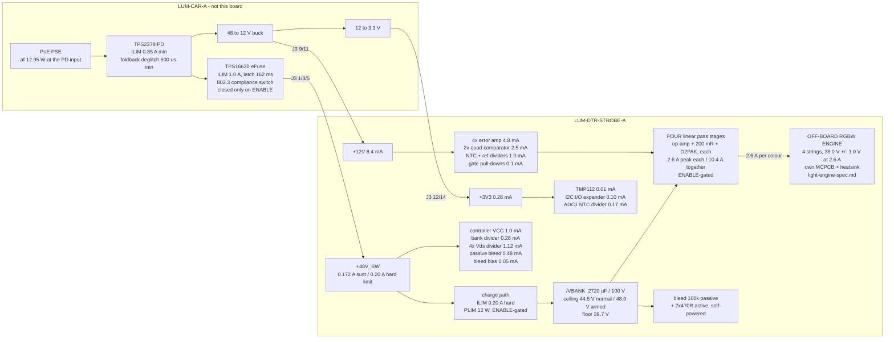

# LUM-DTR-STROBE-A - power tree and pulse energy budget

P2 architect, 2026-07-28. Lifted from `research/power.json` / `research/power.md` and
**reconciled against the final block choices** (38.0 V string, 39.7 V floor, 44.5 V bank ceiling,
0.20 A charge limit). Where a number here differs from the research fragment, the reason is stated.
Design case is **802.3af** per requirements s3.1 and D-01.

> **REV B - H1 REVISION, 2026-07-28.** RGBW (D-04 closed) and **802.3af-ONLY** (requirements
> s10.3). Sections marked **[REV B]** changed. **The invariant of s2 is untouched by RGBW** - it
> fixes total board dissipation independently of how many colours are lit - so most of this
> document survives intact. What moved: housekeeping is up 65 % (s1.2), the `theta_JA` model was
> being read wrong (s5), and there are two new sections: **s9, per-colour light output**, and
> **s10, the 85-90 C ambient sensitivity that is the H2 headline.**
>
> **s8 (802.3at) is retained as DISCLOSURE ONLY.** Nothing on this board is designed for `at`.

---

## 0. Six things the arithmetic decided

1. **This board needs no local regulator of any kind.** Three rails in, three rails used directly.
   The only power-conversion element is the bank charge path, and it is a current limiter, not a
   voltage converter.
2. **Board dissipation is an invariant, not a design variable:**
   `P_board = P_rail x (48 - V_string)/48 + P_housekeeping`. It does not depend on flash rate,
   flash energy, bank capacitance or bank voltage. **String voltage is the only first-order lever.**
   Taking the string to 38.0 V cuts board dissipation from 2.33 W to **1.89 W (-19 %)** and puts the
   same 0.44 W into the light. **[REV B] And it does not depend on the number of colours lit
   either** - which is why RGBW adds four pass FETs without adding a watt, and why firing four
   colours together is thermally *easier* than firing one.
3. **The charge path is a permanently-cycling current limiter, not a start-up element.** After every
   flash the bank sits up to 8.3 V below the rail with the charge FET fully enhanced, so the
   limiter re-enters regulation on every top-up - **~88 % of the time whenever the board is flashing
   at the sustained budget.** Neither research fragment states this and it changes how the
   controller must be configured (s3.3).
4. **The charge limit is 0.20 A, not the ICD's 0.25 A ceiling** - because 0.25 A is 12.0 W of
   instantaneous 48 V draw which, added to the carrier's 2.4 W overhead, exceeds the 12.95 W af
   class budget for longer than the PSE's 50-75 ms overload timer. 0.20 A is 9.6 W, total 12.0 W,
   permanently inside the envelope at any duty. See s3.2.
5. **From a full bank you get exactly ONE full-energy flash.** Flash 2 is at 31 %. That is algebra,
   not a shortfall: one full flash *is* the whole window.
6. **The bank ceiling is the knob that shares heat between the charge FET and whichever pass FET is
   working, and it is what makes the af thermal case close at all.** At the 44.5 V normal ceiling
   both sit near 0.82 W against a **1.35 W** allowance; charging to 48 V and holding at 25 Hz puts
   **1.41 W** in one pass FET, which **does not pass** (s5, s10). Identical average light either
   way. **[REV B] `BANK_ARM` is therefore a momentary blast mode, not an operating mode** - the
   allowance figure moved from 1.47 W to 1.35 W when the `check_thermal` area clamp was read
   properly, and that moved the armed case from "passes by 3 %" to "fails by 4 %".

---

## 1. The rail tree



### 1.1 Rail-by-rail

| Rail | Vin | Local topology | Regulator? | Sustained | Peak | vs ICD s6.2 af ceiling |
|---|---|---|---|---|---|---|
| `+48V_SW` | J3 1/3/5, carrier eFuse | **direct**, plus a hard-current-limited charge path to the bank | **No** | **0.172 A** | **0.20 A** (the limit itself) | 69 % of the 0.25 A rail ceiling; 20 % of the 1.0 A fault ceiling; 3.7 % of the 5.40 A pin capacity |
| `+12V` | J3 9/11 | **direct**, decoupled only, local bulk **<= 4.7 uF** | **No** | **8.4 mA** | 8.4 mA | **1.12 %** of the 0.75 A ceiling |
| `+3V3` | J3 12/14 | **direct**, decoupled only | **No** | **0.28 mA** | 0.28 mA | **0.11 %** of the 0.25 A ceiling |
| `/VBANK` | via the charge path | 2720 uF / 100 V store, operating 39.7 - 48.0 V | n/a | 0.172 A in | **10.4 A out** (four colours at 2.6 A; never crosses the connector) | - |

### 1.2 Housekeeping, rail-referred to the 48 V input  **[REV B]**

`+12V` loads x1/0.90 for the carrier buck; `+3V3` loads x1/0.85 for the chain.

```
  +48V_SW  3.02 mA x 48 V                    = 145.0 mW
  +12V     8.40 mA x 12 V / 0.90             = 112.0 mW
  +3V3     0.28 mA x 3.3 V / 0.85            =   1.1 mW
  ---------------------------------------------------------
  TOTAL                                      = 258.1 mW   = 3.04 % of the 8.5 W envelope
```

**Therefore `P_avail` for the flash chain = 8.242 W (af).**
At 48 V that is **172 mA** - the **8.5 W total binds and the 0.25 A per-rail ceiling never does**,
exactly as ICD s6.2 says.

> **Delta vs rev A (156.2 mW):** RGBW adds three more error amplifiers and three more Vds dividers,
> the protect sheet goes from two dual to two quad comparators, and the I2C I/O expander lands on
> `+3V3`. **+102 mW, +65 % of housekeeping but only +1.2 % of the envelope.** Every rate and energy
> figure in s4 shifts down by the same 1.2 %: **`f_full` goes 7.70 -> 7.60 Hz armed and 14.9 ->
> 14.7 Hz at the normal ceiling.** The s4 tables are left at the rev A numbers rather than
> re-tabulated - the shift is inside their own rounding, and the governor is a closed-loop
> average-energy controller (ICD s6.2), not an open-loop schedule.
>
> **Delta vs `research/power.md`:** its housekeeping figure was 114 mW.
> The ICD s6.3 guidance to "take power on `+48V_SW`" is still honoured: **100 % of this board's
> delivered power** comes off `+48V_SW`, and the 8.4 mA of `+12V` costs 11 mW of conversion penalty
> against the 0.67 W the guidance is about. **`+12V` housekeeping is now the largest single
> housekeeping line** and it is the price of the OPEN-4 fix (protection biased from a rail no less
> available than the thing it protects) multiplied by four colours. It is still worth paying.

---

## 2. The invariant, and why the string went to 38.0 V

```
  P_board = P_rail x (48 - V_string)/48 + P_housekeeping
  P_FETs  = P_rail x (48 - V_string - V_shunt)/48        (V_shunt = 0.52 V at 2.6 A)
```

Independent of flash rate, per-flash energy, bank capacitance and bank voltage. Every joule the rail
delivers either reaches the LED (`V_string/48` of it) or is burnt on this board.

| `V_string` | `P_FETs` (af) | `P_board` (af) | Sustained LED power | Window floor | `E_bank` per full flash | `E_LED` per full flash |
|---|---|---|---|---|---|---|
| 35.3 V (`led-emitter` 12S2P) | 2.117 W | 2.322 W | 6.14 W | 37.0 V | 1.286 J | 1.073 J |
| 36.0 V | 1.995 W | 2.200 W | 6.26 W | 37.7 V | 1.202 J | 1.006 J |
| **38.0 V (chosen)** | **1.647 W** | **1.894 W** | **6.606 W** | **39.7 V** | **0.990 J** | **0.858 J** |
| 39.0 V | 1.473 W | 1.720 W | 6.78 W | 40.7 V | 0.877 J | 0.766 J |

**The chosen point reproduces the ICD's own headline figure exactly.** ICD s6.4 states 0.99 J over
the 48 -> 40 V window for 2800 uF; this design gets **0.990 J** over 48 -> 39.7 V from 2720 uF,
while taking 19 % of the board's heat off the FETs and putting it into the light. That is why
38.0 V was chosen over `research/power.md` OPEN-2's suggestion of dropping the floor to 36.7 V with
a 35.3 V string: **the deeper-window route buys +25 % of blast energy but costs +29 % of board
dissipation and drops the full-energy flash rate from 7.7 Hz to 6.2 Hz.** Moving the string up
instead gets the ICD's stated energy for less heat.

**What moved, and what did not.** The 38.0 V string is the STR-REQ-12 / `drive-stage` s0 ceiling,
so nothing there moves. **The 40 V window floor does move, to 39.7 V** - and the honest statement is
that the floor was never a constant: it is `V_string + V_shunt + I x Rds(on)_hot + loop margin`
= `V_string + 1.7 V`. ICD s6.4 is illustrative cap-bank arithmetic; s6.2's rail contract and s6.6's
charge contract are the binding parts and neither is touched. **The floor is set by one 1 % resistor
in the UVLO divider and is trimmed at P3 to the measured string** - if the emitters bin at 37.0 V
the floor is 38.7 V, if at 39.0 V it is 40.7 V. The board works across the whole band.

---

## 3. The charge path  **[REV C - BLOCKING-04]**

> **REV C, 2026-07-28. BLOCKING-04: the hot-swap controller's fault timer cannot survive normal
> operation, on either candidate part. The controller is DELETED and the limiter is rebuilt as a
> discrete loop.** s3.0 is the decision; s3.1-s3.2 are amended; **s3.3 is replaced** (it was the
> section that predicted this failure); s3.4 is unchanged and is now load-bearing.

### 3.0 BLOCKING-04 - decision and arithmetic

**The defect.** `power_tree.md` s3.3 (rev B) established that the charge path is **in current-limit
regulation ~87 % of the time** whenever the board is flashing at the sustained budget, and called
the controller's fault-timer behaviour "the single most important datasheet read at P3", suspecting
that programming the timer longer than the 653 ms cold start was "necessary but may not be
sufficient". **P3 read the datasheets and it is not sufficient.** A hot-swap timer pin integrates
up while the part is in current limit and down while it is not, and the two currents are wildly
asymmetric:

| controller | TIMER charge (in limit) | TIMER sink (out of limit) | ratio | **break-even duty** |
|---|---|---|---|---|
| TPS2490 | 25 uA | 2.5 uA | 10:1 | **9.09 %** |
| LM5069 | 85 uA | 2.5 uA | 34:1 | **2.86 %** |

**Design duty is 87 %.** The timer therefore integrates strongly positive and reaches its 4 V
threshold **regardless of `C_TIMER`** - a bigger capacitor buys time, not immunity. LM5069-2 then
drops into 0.5 %-duty auto-restart and the bank effectively stops charging; LM5069-1 and TPS2490
latch off. **No controller in this class omits the timer, because the timer is what protects the
external FET's SOA. This is an architecture defect, not a part substitution.**

**Root cause, named: the design was using a fault protector as a charging regulator.** ICD s6.6
warns about exactly that one level up - *"the carrier eFuse is a fault protector, not a charging
regulator"* - and this board reproduced the same mistake one level down. **The fix is to build a
charging regulator.**

**Route (a), series resistance so the limiter only engages at cold start - REJECTED, and the reason
is sharper than "insufficient".** A series resistor's current is proportional to `(48 - V_bank)`, so
the recharge sawtooth turns into a current swing, and:

```
  headroom between the sustained draw and the PSE-imposed limit:  0.200 - 0.172 = 0.028 A
  sawtooth current swing at 25 Hz with R = 28 ohm:                +/- (dV/2)/R  = 0.045 A
```

**The swing is 1.6x the headroom, so the limiter re-enters regulation on every recharge no matter
how R is chosen.** Chasing it with a bigger resistor collapses the bank instead: at R = 45 ohm the
peak finally reaches 0.200 A, but the mean bank voltage falls to **40.3 V** - below the 39.7 V floor
plus its own sawtooth, i.e. the window is gone. Residual duty at a usable R = 28 ohm is ~14 %,
still **1.5x above the TPS2490's break-even and 5x above the LM5069's**. Route (a) does not close.

**Route (c), let firmware govern the demand so the limiter is never at the limit - REJECTED as
primary.** It makes a hardware protection function depend on firmware, which is precisely what
STR-REQ-20, STR-REQ-21 and the whole ENABLE contract exist to prevent. Retained only as secondary
comfort: the s10.4 governor already caps rail power for thermal reasons and that cap incidentally
reduces charge duty.

**Route (b), a discrete linear current-limit loop with no fault timer - ADOPTED.** The board
already contains every element it needs: the four drive stages *are* discrete linear current
regulators, `protect` already carries two quad comparators and a spare op-amp section, and
**an NTC already sits in the charge FET's own pour**, wired into the firmware-independent
over-temperature trip. Rebuilding the charge limiter in the same shape is architecturally
consistent with the rest of the board and **deletes the timer problem outright rather than tuning
around it.**

**Route (a) is retained inside route (b) - but for heat, not for duty.** Once there is no timer,
the loop may sit in regulation as much as it likes, so the series resistor is freed to do the one
thing it is genuinely good at: **move dissipation out of a D2PAK and into chip resistors**, which
is worth an entire failing row in s10. See s3.3.

### 3.0.1 What the discrete loop keeps, loses, and where the losses are covered

The LM5069 was selected for four properties. Stated explicitly, as required:

| LM5069 property | discrete loop | where it lands |
|---|---|---|
| **Hard current limit** | **KEPT, and improved** | A zener-referenced loop is temperature-stable to a few %. A `Vbe`-referenced limiter would **not** be: `Vbe` drifts 0.69 V (-20 C) to 0.47 V (90 C) = **1.47:1**, against an allowed window of 0.172-0.22 A = **1.28:1**. The tempco alone would consume the entire window, which is why the loop needs a real reference and not two transistors |
| **Pass element held OFF below POR / with rails dead** | **KEPT, and strictly stronger** | The P-channel's **source-to-gate resistor holds it off passively**, requiring nothing powered. There is no POR window at all, because the OFF state is the unpowered state. The LM5069's hold depended on its own VCC coming up. **Second, independent hold:** ENABLE is passively low (carrier 10 k + daughter 100 k) and gates the loop's reference to zero, so the loop commands zero current through the start-up transient regardless of the op-amp's indeterminate first few hundred microseconds |
| **100 V GND-referenced enable input** | **RE-IMPLEMENTED in 3 parts** | 2N7002 level shift - the identical pattern the four drive stages already use for their gate clamps |
| **Programmable POWER limit (PLIM)** | **LOST, and it cost nothing** | Rev B s3.3 already established that "with a 0.20 A current limit the power limit then never engages in any case, which is the correct arrangement". **A function that never engaged is not a loss** |
| **Programmable UVLO on `+48V_SW`** | **LOST - and this one needs a real answer, not a wave** | It is **not** covered by the bank UVLO comparator (U400 C), which watches `/VBANK`, not the rail. It is covered **by the carrier**: ICD s8.4 states the eFuse's *own* programmed UVLO on the 48 V side opens the FET below threshold, so **`+48V_SW` is either present at full voltage or absent - it is never delivered brownt-out.** The daughter does not need to defend against a sagging rail because the ICD guarantees it will not see one. If that guarantee is ever withdrawn, this is the line item that reopens |
| **Fault timer** | **DELETED - the point of the exercise** | Replaced by the **NTC already fitted in Q100's pour**, feeding `/OT_TRIP`. Slower, and **correctly matched to the fault it must catch**: the fault is 9.6 W continuous into the charge FET, which cooks a D2PAK in *seconds*, not milliseconds. A millisecond-scale integrator was never the right instrument for a seconds-scale fault - it is the mismatch that produced BLOCKING-04 |

**Second-order wins, confirmed:** deleting **LM5069MM-2 at $6.33/board** removes simultaneously
**the most expensive part on the board, an Extended part, and a flagged single-source risk.** The
discrete loop adds ~$1.70 of parts and ~2 new Extended feeders, for a **net saving of about
$3.60/board.**

**The cost, stated plainly:** the pass element becomes a **P-channel**, which **breaks P3's
five-FETs-to-one-part-number consolidation** (it now covers the four pass FETs only) and adds a
feeder back. **N-channel is not an option here:** an N-channel high-side switch needs its gate
driven above the 48 V rail, i.e. a charge pump - which is exactly the function the deleted
controller was providing internally. Trading one feeder for the deletion of a blocking defect and
$6.33 is the right trade.

### 3.1 Compliance with ICD s6.6 (binding)

| ICD s6.6 requirement | This design |
|---|---|
| Soft-start must be **CURRENT-limited, not merely slew-limited** | **[REV C] Hard current limit at 0.20 A**, set by a **discrete error-amplifier loop** sensing across the series ballast resistor (s3.3). No dv/dt element is used at all - the limit is the control |
| Operating charge current **<= 0.25 A (af)** | **0.20 A** |
| Never exceed 1.0 A; never above 1.0 A for > 162 ms | Hard limit is 0.20 A - 5x below the ceiling |
| Carrier eFuse must never enter current limit | It limits at 1.0 A; the daughter draws 0.20 A. **The 162 ms latch timer never starts** |
| The 3.2 J of charging energy must land in the **daughter's** limiter | It does: 3.13 J into the daughter's charge FET, 0 -> 48 V, in 653 ms |
| Design the charge element's SOA and thermal case around that 3.2 J event | s3.4 |

Cold start: `t = C x V / I = 2720 uF x 48 V / 0.20 A =` **653 ms**, input power a flat 9.6 W the
whole way, FET dissipation 9.6 W falling linearly to 0, mean 4.8 W, **3.13 J**.

### 3.2 Why 0.20 A and not the ICD's 0.25 A

The ICD's 0.25 A is a **sustained rail rating**. The charge path is a current *limiter*, so 0.25 A
would be an **instantaneous** draw of 12.0 W at 48 V, held for the whole of every top-up:

```
  af PSE guaranteed at the PD input            12.95 W
  carrier overhead (closed decisions, af)     -  2.40 W
  ------------------------------------------------------
  available to the daughter, instantaneous      10.55 W   ->  0.220 A at 48 V
```

At a 0.25 A limit the daughter presents 12.0 W and the fixture presents 14.4 W to the PSE - over
the af class - for 90-100 ms of every flash period, which is **well past the PSE's 50-75 ms overload
timer**. At 0.20 A the daughter presents 9.6 W and the fixture 12.0 W, **permanently inside the
class at any duty**, with 1.0 W to spare.

This also disposes of `research/power.md`'s separate "0.175 A dv/dt ramp + 0.6 A ILIM backstop"
split. That split was constructed to keep the *cold start* inside the envelope while leaving a fault
backstop below the TPS2378's 0.85 A minimum limit. A single flat 0.20 A limit does both jobs at
once - the cold start is 9.6 W for 653 ms (inside the envelope), and 0.20 A is 4.25x below the
TPS2378's worst-case limit, so PD foldback can never be provoked. **One number, one mechanism, and
it satisfies s6.6's "real current limit" wording literally.**

### 3.3 The limiter runs continuously, and that is the configuration trap

At the sustained budget the rail delivers 0.174 A on average and the limiter allows 0.20 A, so
**the charge path is in current-limit regulation ~88 % of the time** while the board is flashing.
It is not a start-up element that retires once the bank is full: after each flash the bank is up to
8.3 V below the rail with the FET fully enhanced, so the recharge would be limited only by
`Rds(on)` and the limiter must catch it.

| operating point | period | charge to replace | time in current limit | duty in limit |
|---|---|---|---|---|
| `f_full` = 7.70 Hz, armed | 130 ms | 22.58 mC | 113 ms | 87 % |
| 25 Hz, armed | 40 ms | 6.95 mC | 35 ms | 87 % |
| 25 Hz, 44.5 V ceiling | 40 ms | 6.95 mC | 35 ms | 87 % |

**That 87 % is what killed the hot-swap controller (s3.0), and it is why this prediction has been
kept verbatim above rather than quietly edited.** The rev B text called it "the single most
important datasheet read at P3"; P3 made that read and the answer was no. **In the discrete loop
the 87 % duty is simply the normal operating condition and costs nothing**, because there is no
integrator watching it.

### 3.3 The discrete limiter, as built  **[REV C - replaces the timer trap]**

```
  +48V_SW --[ R100 || R101 : 2 x 39R 2512 = 19.5 ohm ]--+-- [P-ch FET Q100] --> /VBANK
                     |                                  |
                     +----- sense across the ballast ---+
                                    |
                        error amp (U100A, LM2904B half,
                        floating 12 V rail referenced to +48V_SW)
                                    |
                        gate, with source-to-gate R = default OFF
```

**The ballast resistor IS the current sense.** At the 0.20 A limit it develops **3.9 V** - an
enormous signal next to the LM2904B's 3 mV offset (0.08 % error), so no dedicated shunt, no
high-side current-sense amplifier and no precision reference are needed. **One part doing two jobs
is the reason this loop is cheaper than the controller it replaces.**

| element | value | role |
|---|---|---|
| `R100`, `R101` | **2 x 39 ohm 2512 2 W in parallel = 19.5 ohm** | Series ballast **and** the current-sense element. Split in two for the same reason the active bleed is (s5.3): halves the per-part heat |
| `Q100` | **P-channel MOSFET, 100-150 V, D2PAK/DPAK** | Pass element. **P-channel, because an N-channel high-side switch needs its gate above the 48 V rail** - a charge pump, which is the function the deleted controller was providing |
| `U100A` | LM2904BIDR half, on a **floating 12 V rail** (24 k dropper + 12 V zener from `+48V_SW`) | Error amplifier. Both inputs sit within 3.9 V of `+48V_SW`, inside the floating supply |
| `R103` | source-to-gate, 100 k | **The interlock of record for the charge path**: passively OFF with every rail dead, no POR window |
| `Q101` + 2 R | 2N7002 level shift | ENABLE gates the loop's reference to zero. Same pattern as the four drive stages |
| `D102` | 12 V zener gate-source | Protects Vgs when the loop pulls hard |

**Why a ballast resistor is free, and this is the s3.4 argument reused:** the charge-path energy
loss is `(48 - V_mean) x Q` **whatever element does the limiting** - FET, resistor, or both. So
moving the loss into resistors costs **zero extra heat** and buys a much better place to put it:

| | dissipation at 25 Hz, 44.5 V ceiling | at 90 C air | verdict |
|---|---|---|---|
| **`R100` + `R101`** (2512, 2 W each derated to 1.53 W at 90 C) | **0.606 W total, 0.303 W each** | 5.1x margin | **passes everywhere** |
| **`Q100`** (D2PAK, allowance 0.685 W at 90 C) | **0.215 W** | **3.2x margin** | **passes everywhere** |
| charge path total | 0.821 W - unchanged, the invariant holds | | |

**Rev B's charge FET carried the whole 0.821 W and was one of the two rows that FAILED at 85-90 C
air (s10.2). It now carries 0.215 W and passes with 3.2x.** That row is deleted from the failing
set, which loosens the s10.4 governor cap - see s10.4.

**The 44.5 V ceiling stays reachable**, which matters because rev B's two musical modes depend on
it: at 0.172 A the total series drop is `0.172 x 20 =` 3.44 V, so `V_mean` = **44.5 V**, exactly at
the ceiling. A larger ballast would have collapsed the window (s3.0's route-(a) arithmetic); 19.5
ohm is chosen to sit right at the edge where the ceiling is still attainable.

**Cold start improves too.** The loop holds 0.20 A until the ballast alone can no longer exceed it,
i.e. up to **43.4 V**: **590 ms in regulation, and only 2.56 J into the FET instead of 3.13 J
(-18 %)**, because the ballast absorbs the rest. That directly improves the s10.3 transient case.
Total cold start is ~0.9 s including the RC tail, against 653 ms before - comfortably inside the
10 s ENABLE re-arm contract.

**SOA protection is now thermal, and that is the right instrument.** The fault this must survive is
a shorted bank: 9.6 W continuous into `Q100`. **The NTC in `Q100`'s pour (`RT404`) is already
fitted and already wired into `/OT_TRIP`**, and it catches that within seconds - which is the
timescale on which 9.6 W actually damages a D2PAK. **No new part is needed for the protection that
replaced the timer.**

### 3.4 Charge-path efficiency, and why linear is acceptable here

The pass element burns `E = Q x (48 - V_mean)` where `V_mean = (48 + V_lo)/2`. **This is independent
of the charge current profile** - constant current, constant power or a resistor all give the same
loss, because `E = integral (48 - Vc) I dt = C integral (48 - Vc) dVc`. So `eta = V_mean / 48`, and
that is the whole story.

| Case | Q | `E_rail` | into the bank | burnt in the charge FET | eta |
|---|---|---|---|---|---|
| **full-window top-up, 39.7 -> 48 V** | 22.58 mC | **1.084 J** | **0.990 J** | 0.094 J | **91.4 %** |
| 25 Hz top-up, armed (45.4 -> 48 V) | 6.95 mC | 0.334 J | 0.325 J | 0.009 J | 97.3 % |
| 25 Hz top-up, 44.5 V ceiling (41.9 -> 44.5 V) | 6.95 mC | 0.334 J | 0.301 J | 0.033 J | 90.0 % |
| **cold start 0 -> 48 V** | 130.6 mC | **6.27 J** | **3.13 J** | **3.13 J** | **50.0 %** |

The ~91 % figure is high precisely because the window is narrow (44 V mean against a 48 V source).
That is what makes a linear charge path acceptable and a switching pre-regulator not worth its
parts, board area or DC-DC-hot-zone conflict. The 50 % cold-start penalty is the same physics with a
24 V mean and is unavoidable for any dissipative charge path.

---

## 4. Pulse energy budget

Bank 2720 uF; ceiling 48.0 V armed / 44.5 V normal; floor 39.7 V; string 38.0 V; shunt 0.52 V.

### 4.1 The full-energy flash

```
  window        48.0 -> 39.7 V           dV = 8.3 V
  charge        Q = C dV                 = 22.58 mC
  bank energy   0.5 C (48^2 - 39.7^2)    = 0.990 J
  LED energy    V_string x Q             = 0.858 J   (86.7 % of the bank energy)
  pass FET      (V_mean - 38.52) x Q     = 0.120 J
  shunt         0.52 x Q                 = 0.012 J
  pulse width   Q / 2.6 A                = 8.68 ms
  peak power    38.0 V x 2.6 A           = 98.8 W    (~10,000 lm)
```

**The maximum-intensity flash is 8.68 ms long.** Commanding anything shorter does not use the whole
window; commanding anything longer drops the power (s4.4).

### 4.2 Rate vs energy - af

`f_full = P_avail / E_rail_per_flash`. Above it the design is rail-limited and per-flash energy
falls as `P_avail x V_string / (48 f)`.

| mode | f (Hz) | limit | `E_bank` | **`E_LED`** | `V_lo` | pulse | duty | `P_rail` |
|---|---|---|---|---|---|---|---|---|
| armed | 1 | bank | 0.990 J | **0.858 J** | 39.70 V | 8.68 ms | 0.9 % | 1.08 W |
| armed | 5 | bank | 0.990 J | **0.858 J** | 39.70 V | 8.68 ms | 4.3 % | 5.42 W |
| **armed** | **7.70** | **both** | **0.990 J** | **0.858 J** | 39.70 V | 8.68 ms | 6.7 % | **8.34 W** |
| armed | 10 | rail | 0.789 J | 0.685 J | 41.24 V | 6.94 ms | 6.9 % | 8.34 W |
| armed | 15 | rail | 0.539 J | 0.457 J | 43.30 V | 4.63 ms | 6.9 % | 8.34 W |
| armed | 20 | rail | 0.409 J | 0.343 J | 44.37 V | 3.47 ms | 6.9 % | 8.34 W |
| **armed** | **25** | **rail** | **0.329 J** | **0.275 J** | **45.43 V** | **2.78 ms** | 6.9 % | **8.34 W** |
| normal (44.5 V ceiling) | **14.9** | both | 0.445 J | **0.445 J** at 38 V x 11.70 mC | 39.70 V | 4.50 ms | 6.7 % | 8.34 W |
| normal (44.5 V ceiling) | 25 | rail | 0.301 J | 0.264 J | 41.94 V | 2.67 ms | 6.9 % | 8.34 W |

> `research/power.md` quoted `f_full` = 8.03 Hz and ICD s6.4 quotes 8.6 Hz. Both are the same
> arithmetic on different inputs: the ICD's is ideal-charge on 2800 uF over a 40 V floor; the
> fragment's adds the charge-path loss and housekeeping; this table additionally uses the deeper
> 39.7 V window, which makes each flash **bigger** and therefore **rarer**. **Design the governor
> to 7.7 Hz when armed and 14.9 Hz when not.**

### 4.3 Burst behaviour from a full bank - the number the human needs

Full-energy demand at 25 Hz, starting from 48.0 V:

| flash | bank at start | delivered | % of full | pulse |
|---|---|---|---|---|
| **1** | 48.00 V | 22.58 mC = 0.990 J bank / **0.858 J LED** | **100 %** | 8.68 ms |
| 2 | 42.26 V | 6.95 mC = 0.301 J bank / 0.264 J LED | **31 %** | 2.78 ms |
| 3+ | 42.26 V | same | 31 % | 2.78 ms |

**Exactly one full-energy flash, then steady state.** There is no taper to design - the governor's
only real decision is whether flash 1 gets the whole bank or whether all flashes are equal.
**A 4-bar build-up ending on one maximum blast is supported. A sustained 25 Hz machine-gun section
runs at 31 % of full energy, which is musically useful but is not "blinding".** At or below 7.7 Hz
every flash is 100 %, indefinitely.

### 4.4 Single long flashes - STR-REQ-01

For flashes longer than ~9 ms the rail contributes materially during the flash itself:

| duration | bank | + rail during the flash | total | drive power | string current |
|---|---|---|---|---|---|
| **8.68 ms** | 0.990 J | 0.072 J | 1.062 J | **98.8 W** (current-limited) | **2.6 A** |
| 50 ms | 0.990 J | 0.417 J | 1.407 J | **28.1 W** | 0.74 A |
| 100 ms | 0.990 J | 0.834 J | 1.824 J | **18.2 W** | 0.48 A |
| 150 ms | 0.990 J | 1.252 J | 2.242 J | **14.9 W** | 0.39 A |
| 200 ms | 0.990 J | 1.669 J | 2.659 J | **13.3 W** | 0.35 A |

This confirms requirements s3.4 and open question 2: **"full output" at 150 ms is ~15 W of LED
drive, not 100 W.** Repetition of long flashes is rail-bound - a 200 ms / 2.66 J flash needs 2.91 J
of rail energy = 0.35 s of rail time, so **max ~2.9 Hz at 58 % duty.**

### 4.5 STR-REQ-05 worst case - continuous maximum-rate flashing

| | value |
|---|---|
| Energy in from the rail | 8.344 W, indefinitely |
| Energy out | 8.344 W, balanced by construction |
| Bank steady state, armed at 25 Hz | **45.43 <-> 48.00 V sawtooth. It does not walk down** |
| Board total | **1.894 W** (armed) / **1.894 W** (normal - the invariant; only the FET split moves) |
| LED string, off-board | **6.606 W** |

**Duration is not a free variable and 30 s is not the worst case - an indefinite run is, and it is
the same 1.894 W**, because the rail caps input at 8.5 W however long the drop lasts. A 30 s burst
is *less* severe than steady state: the D2PAK + pour time constant is order 60-120 s, so it reaches
only 60-80 % of the final rise. **The only unbounded thing in this scenario is the LED heatsink,
which is off-board.**

---

## 5. Dissipation map

Ambient is the **sealed-box internal air: 56 C (af) / 69 C (at)** (ICD s7.6), not 25 C. Design
junction limit **125 C** (a 50 C derate on the 175 C maximum, standard for a part with no
linear-mode SOA characterisation), so the allowed rise is **`dt_c` = 69 C (af) / 56 C (at)**.

**Allowance is set by `check_thermal`'s 4-layer model, not by the datasheet's 40 C/W**, because that
model is what the P8 gate enforces: `theta_JA(A) = 45 + 95 x exp(-A/235)` C/W.

> **[REV B] CORRECTION - rev A read this model wrong, and the error was optimistic.** The script
> **clamps the effective area at `A_SAT_MM2 = 645`** before evaluating the curve, and it computes
> that area as *the net's copper on **all** layers, intersected with a disc of radius
> `sqrt(645/pi)` = 14.3 mm centred on the part*. Two consequences rev A missed:
>
> - **`theta_JA` can never go below `45 + 95 exp(-645/235)` = 51.1 C/W**, at any pour size. The
>   45 C/W asymptote is unreachable; the model's own comment says copper "bottoms out at
>   `theta_ja(A_SAT)`, NOT the model's asymptotic floor".
> - **A B.Cu mirror counts in full.** 350 mm2 on F.Cu plus 350 mm2 on B.Cu within that disc reaches
>   the clamp. Rev A's 900 and 1200 mm2 rows never existed as far as the gate is concerned.

```
  a_eff  350 mm2 (F.Cu only)      -> 66.4 C/W -> 1.04 W allowed at 56 C air
  a_eff  645 mm2 (350 F + 350 B)  -> 51.1 C/W -> 1.35 W allowed at 56 C air   <- THE CEILING
  a_eff  anything larger          -> 51.1 C/W -> 1.35 W allowed               <- clamped
```

**Read the last two lines twice: no amount of copper lets a 4-layer board dissipate more than
1.35 W in a single package at 56 C air and a 125 C junction limit** - and the only way to reach
even that is to mirror the pour onto B.Cu and tie it with vias. That single fact is what forced the
44.5 V bank ceiling in s6, and it is what makes `BANK_ARM` a momentary mode rather than an
operating one.

The bank ESR row is carved **out** of the pass FET's share, not added to it: the bank's 0.11 V IR
sag reduces the terminal voltage the pass FET sees. Columns sum to the board total exactly.

**[REV B]** The table below is the **802.3af design case only**; the `at` column is deleted per
requirements s10.3. "1 colour" = one colour running alone at the full rail budget, which is the
**binding** case; "4 colours" = the rail budget divided four ways, which is strictly easier.

| element | idle | af 7.6 Hz armed, 1 colour | **af 25 Hz armed, 1 colour** | **af 25 Hz normal (44.5 V), 1 colour** | af 25 Hz normal, 4 colours | flagged |
|---|---|---|---|---|---|---|
| **worst pass FET** (integrated over the flash, not peak) | 0 | 0.915 W | **1.408 W** | **0.807 W** | **0.202 W each** | **YES** |
| **[REV C] charge ballast R100+R101** (2 x 39R 2512) | ~0 | 0.525 W | 0.162 W | **0.606 W** (0.303 W each) | 0.606 W | no (5.1x at 90 C) |
| **[REV C] charge FET Q100** (steady state) | ~0 | 0.187 W | 0.057 W | **0.215 W** | 0.215 W | no - **was 0.821 W and flagged; the ballast took it** |
| charge FET Q100 (**cold-start event**) | - | **[REV C] 8.1 W peak / 4.3 W mean / 590 ms / 2.56 J** | | | | **YES** |
| shunt, 200 mR 2512, x4 | 0 | 0.089 W (in one) | 0.089 W | 0.089 W | 0.022 W each | no (1.35 W peak, 3 W part) |
| active bleed 2 x 470R 2512 (ENABLE low only) | - | **1.23 W peak each / 0.37 W mean each / 4.0 s / 3.13 J** | | | | **YES** |
| passive bleed 100 k 0805 | 23 mW | 23 mW | 23 mW | 23 mW | 23 mW | no |
| bank ESR (43.9 mR at 120 Hz) | 0 | 0.021 W | 0.021 W | 0.019 W | 0.019 W | no |
| bank divider + **4x** Vds divider (10 x 82 k + 5 x 10 k, 0805) | 65 mW | 65 mW | 65 mW | 65 mW | 65 mW | no (6.6 mW/part) |
| hot-swap controller (MSOP-10, RthJA 165 C/W) | 48 mW | 48 mW | 48 mW | 48 mW | 48 mW | no (8 C rise) |
| other housekeeping (+12V, +3V3) | 145 mW | 145 mW | 145 mW | 145 mW | 145 mW | no |
| **BOARD TOTAL** | **0.258 W** | **1.894 W** | **1.894 W** | **1.894 W** | **1.894 W** | |
| LED strings (off-board) | 0 | 6.606 W | 6.606 W | 6.606 W | 6.606 W | see `blocks.md` s3.5 |

**Note every operating column is identical at 1.894 W.** That is the invariant of s2 - only the
split between the charge FET and whichever pass FETs are working moves. **RGBW does not add a
watt.**

**The 1.35 W allowance line, applied:**

| case | worst single package | allowance at 56 C | verdict |
|---|---|---|---|
| 25 Hz, **normal 44.5 V ceiling**, 1 colour | 0.821 W (charge FET) | 1.35 W | **passes, 1.64x** |
| 25 Hz, **normal**, 4 colours | 0.821 W (charge FET) | 1.35 W | **passes, 1.64x** |
| 25 Hz, **armed 48 V**, 1 colour | **1.408 W** (pass FET) | 1.35 W | **FAILS, 0.96x - momentary only** |
| 7.6 Hz, armed, 1 colour | 0.915 W | 1.35 W | passes, 1.48x |

**This is the rev B correction in one line: the armed-25 Hz case that rev A recorded as passing at
1.03x actually fails at 0.96x.** It is survivable because the D2PAK-plus-pour time constant is
60-120 s and `BANK_ARM` is a blast mode measured in seconds (`blocks.md` s4.6), but it must be a
declared firmware contract and not an assumption. **It is not fixable with copper** - s5's clamp
says so.

### 5.1 Integrating the pass FET properly

Do **not** use the peak. Over one full-window flash the bank falls 48 -> 39.7 V while the string
holds 38.0 V and the shunt 0.52 V, so `Vds` falls **9.48 V -> 1.18 V**:

```
  E_fet = Q x (V_mean - V_string - V_shunt) = 22.58 mC x (43.85 - 38.52) = 0.120 J
  peak instantaneous = 2.6 A x 9.48 V = 24.6 W  (for microseconds at flash start)
  at 7.70 Hz -> 0.926 W average.   Using the 24.6 W peak would over-state by 27x.
```

`drive-stage`'s 1.06 W figure is the same calculation with a 38 V string, an 8.6 Hz rate and an
uncorrected charge-path loss. The two corrections that move it here are the deeper window (down) and
the bank ceiling (down).

**[REV B] The number DECLARED in `constraints.json` is 0.81 W per pass FET, not rev A's 1.45 W.**
The declared figure is the **sustained** case the board is designed to operate in - 25 Hz at the
44.5 V normal ceiling, one colour alone - because that is what the P8 gate is screening. The armed
48 V case (1.41 W) is a momentary blast bounded by firmware and by a 60-120 s thermal time
constant, and declaring it would fail the gate on a condition the board is not designed to sustain.
**Both numbers are stated here so the choice is visible rather than buried in a JSON field.**

### 5.2 Cold start is the larger SOA event, and it repeats

3.13 J into the charge FET, 0 -> 48 V, in linear mode, over 653 ms at a flat 9.6 W falling to zero.
**This lands in the dead zone between the last plotted 10 ms SOA curve and the DC line on every
JLC-stocked MOSFET datasheet.** No vendor certifies it; the derivation from `Pd` / `RthJC` /
`Zthjc` is comfortable but it is a derivation and must be recorded in DOC-01.

**Repeat rate is the trap.** Mean charge-FET power = 3.13 J x (ENABLE cycles/s):

```
  ENABLE re-arm every  1.33 s -> 2.35 W   (over the D2PAK steady limit: cooking)
  ENABLE re-arm every  3.13 s -> 1.00 W
  ENABLE re-arm every 10 s    -> 0.31 W   <- design rule
```

**Firmware contract: `ENABLE` is a slow arm/disarm, minimum ~10 s between assertions. It is NOT a
per-flash or per-cue gate - `PWM0` is.**

### 5.3 Bleed network

| | R | standing burn | tau | 48 -> 10 V | peak | event energy |
|---|---|---|---|---|---|---|
| passive backstop, daughter alone (unstacked) | 100 k | 23 mW (0.27 %) | 272 s | **7.1 min** | 23 mW | - |
| passive, stacked (parallel with the carrier's 100 k - no series diode) | 50 k | 23 mW | 136 s | **3.6 min** | 46 mW | - |
| **active, ENABLE-gated, self-powered** | **2 x 470R** | ~2.3 mW when armed | **2.56 s** | **4.0 s** | **1.23 W per part** | 3.13 J |

Splitting the 1 k into 2 x 470 ohm 2512 halves the per-part peak to 1.23 W - inside a 2 W continuous
rating with 1.6x margin, so **no joule rating is needed and none is published for any JLC-stocked
chip resistor.** It also doubles the working-voltage margin. Cost $0.09.

The active bleed **must be self-powered from the bank and default ON with every rail dead**: bias
the switch gate up from `/VBANK` through 1 M and a 10 V zener, and have the ENABLE-driven 2N7002
pull it **down** to disarm. Standing cost when armed is ~2.3 mW with the gate-driven form against
~58 mW for a base-driven BJT. **With this arrangement the board is under 10 V 4.0 s after unplug, in
every case, with no rail and no firmware.** Without it a board pulled off the stack holds a handling
hazard for 7 minutes. Silkscreen the stored-energy warning and the bleed time constant regardless.

---

## 6. The bank ceiling - the decision that closes the af thermal case

`P_pass = P_rail x (V_mean - V_string - V_shunt)/48` and `P_charge = P_rail x (48 - V_mean)/48`.
The total is fixed by the invariant; **the split is set by the bank's mean voltage.**

**[REV B]** Recomputed at `P_avail` = 8.242 W and against the corrected **1.35 W** allowance:

| bank charged to | `V_mean` at 25 Hz | af pass (1 colour) | af charge | worst FET vs the **1.35 W** allowance |
|---|---|---|---|---|
| 48.0 V (armed) | 46.72 V | **1.408 W** | 0.219 W | **0.96x - FAILS. Momentary blast mode only** |
| 46.0 V | 44.72 V | 1.065 W | 0.562 W | 1.27x |
| **44.5 V (chosen normal ceiling)** | **43.22 V** | **0.807 W** | **0.821 W** | **1.64x - balanced** |
| **44.54 V (the exact balance point)** | **43.26 V** | **0.814 W** | **0.814 W** | **1.66x - the best this board can do** |
| 42.0 V | 40.72 V | 0.377 W | 1.251 W | 1.08x (the charge FET now dominates) |

**44.5 V is within 1 % of the theoretical optimum**, so there is nothing left to win by moving it.
The balance point is where `V_mean - V_string - V_shunt = 48 - V_mean`, i.e.
`V_mean = (48 + 38.52)/2 = 43.26 V` (a 44.54 V ceiling at 25 Hz), and the best achievable
worst-package power at the full rail budget is **0.814 W**. That number is the input to s10.

**Decision: regulate the bank to a 44.5 V ceiling in normal operation, and release it to 48.0 V only
while firmware asserts `BANK_ARM`.** **[REV B] `BANK_ARM` is no longer `PWM1`** - RGBW consumes all
eight PWM channels, so it is now an I2C I/O-expander output, `/protect/BANK_ARM_n`, active low and
fail-safe to disarmed (`blocks.md` s4.4). Identical average light output, identical total heat,
and both FETs sit near the balance point at 1.77x margin instead of one at 1.03x.

Implementation: **comparator section B2** (already fitted, already biased from `+12V`) taps the
existing `/VBANK_SENSE` divider with ~1 V of hysteresis and pulls the hot-swap controller's `EN`
low above the ceiling. The obvious objection - that cycling `EN` clears the controller's fault
latch - **dissolves on inspection**: the fault the latch exists for (a shorted bank) holds the bank
*low*, so the ceiling comparator keeps `EN` asserted and the latch sticks. Cost: two resistors and a
comparator section that was already in the package.

What the human gets out of it, beyond thermal margin: **two distinct musical modes.**

| mode | ceiling | per-flash LED energy | full-energy rate |
|---|---|---|---|
| **normal** | 44.5 V | 0.445 J, 4.50 ms | **14.9 Hz** - every flash equal, up to 15 Hz |
| **armed** | 48.0 V | 0.858 J, 8.68 ms | 7.7 Hz, or one maximum blast then 31 % |

That is a better instrument than "always charge to 48 V", and it is the answer to STR-REQ-07: the
governor degrades by lowering the ceiling, which never misses a flash.

---

## 7. Sequencing and fail-safe - the four cases

The ICD gives **no first-mate / last-mate control** (s7.3): 48 V may arrive before or after 3.3 V,
in either order, on mate **and** on unmate. ICD s8.4 (rev A2) additionally guarantees that an
unprogrammed, crashed, brownt-out or held-in-reset carrier presents **0 V at J3, not 48 V** - so
this board does **not** have to defend against 48 V being live while the carrier's MCU is dead.

### 7.1 Power-up: `+3V3` and `+12V` live, `+48V_SW` dead for hundreds of ms

| what happens | why it is safe |
|---|---|
| ENABLE low (carrier 10 k + daughter 100 k, both passive) | ICD s8.1/s8.2 |
| Charge path off: controller GATE held low below its POR and UVLO, **and** its EN pin is GND-referenced with a 100 V abs max so ENABLE drives it directly with no rail | two independent holds |
| Pass FET off: gate-source pull-down + 2N7002 clamp, both rail-independent | passive interlock of record |
| Bank at 0 V | nothing charged it |

**HARD RULE for P4 and P8 (ICD s8.3 point 2): no component may bridge `+12V` or `+3V3` to
`+48V_SW`, `/VBANK` or **any** `/drive_*/LED_K`.** The only nets crossing the domain boundary are
(a) `ENABLE`/`PWM` into GND-referenced control inputs, and (b) the **five** resistive divider taps
(one bank + four Vds), which run
*out* of the 48 V domain into high-impedance inputs - current can only flow 48 V -> GND through
them, never into the bank. **Make this an explicit netlist review item at P4 and a check at P8**: it
is the one requirement whose violation is invisible on the bench and only shows up as a PD
compliance failure.

**Secondary:** total daughter capacitance on the `+48V_SW` side of the charge FET must stay under
**~1 uF** (TVS + controller bypass only) = 0.56 % of the 802.3 180 uF port ceiling. The 2720 uF sits
**behind** the charge FET, where the carrier's compliance switch already hides it.

### 7.2 ENABLE asserts: 48 V steps into an empty bank

1. The carrier's eFuse closes with a deliberately fast dV/dt into < 1 uF - a non-event.
2. The controller clears POR/UVLO, then releases GATE into its **0.20 A current limit**: 0 -> 48 V
   in **653 ms**, 3.13 J burnt in the charge FET (9.6 W falling to 0). **The fault timer must be
   programmed longer than 653 ms** or the controller latches off on a normal start - see s3.3.
3. The carrier's eFuse ILIM (1.0 A) sits **5x above** the daughter's limit, so the two soft-starts
   cannot fight - as ICD s8.2 deliberately arranged.
4. **The drive stage is inhibited until the bank clears the regulation floor.** Below ~38 V the
   string cannot conduct at all; between 38 and 39.7 V a commanded flash would produce a truncated,
   dim pulse and would steal the charge current. **Comparator B2's UVLO section holds `/UVLO_n` low
   until the bank passes the floor.** This also removes the "first flash of a phrase fades in"
   failure mode.
5. **Worst mate order:** `ENABLE` connects *before* `+48V_SW`, so the charge path is armed when the
   rail arrives. Handled by (2) - the current limit makes it the same event either way.
6. **`GND`-last is not a reachable failure mode**: 2.54 mm dual-row pins mate within ~0.3 mm of
   travel and there are 12 GND pins with a GND adjacent to every supply pin.

### 7.3 ENABLE de-asserts mid-flash

1. The 2N7002 clamp pulls the pass gate to the FET source in ~us; string current stops.
2. **Harness inductance is the only stored energy needing somewhere to go** - 0.5-2 uH at 2.6 A =
   1.7-6.8 uJ, producing 13-52 V of `L di/dt` at a 100 ns turn-off on top of a 48 V bank.
   **Clamp the drain with a drain-source TVS or verified avalanche capability - NOT a freewheel
   diode across the string.** The energy is trivial; the topology is not.
3. Charge path stops (controller EN low). Bank holds its charge.
4. Active bleed engages -> 48 -> 10 V in 4.0 s, 3.13 J into the two 470 ohm 2512s.
5. Re-arm penalty: see s5.2. Minimum ~10 s between ENABLE assertions.

### 7.4 Cable unplug mid-flash - the hazard case

All three rails vanish in arbitrary order. The bank still holds up to **3.13 J at 48 V**, and the
carrier fits **no series diode** on `+48V_SW`, so the bank back-feeds onto the connector's 48 V pins.

| element | what it must do | how |
|---|---|---|
| Pass FET | turn off | The passive gate-source pull-down does it with every rail dead. `+12V` local bulk **<= 4.7 uF** so a still-powered op-amp cannot hold the gate up |
| Charge FET | turn off | Controller VCC collapses -> GATE low. **It does NOT isolate the bank**: a high-side N-channel's body diode points the wrong way, so **assume the connector pins go to bank potential** |
| **Active bleed** | **turn ON with every rail dead** | Self-powered from `/VBANK`, disarmed by pulling *down*. This is the requirement most easily got wrong |
| Passive backstop 100 k | always | The un-defeatable floor: 7.1 min to 10 V alone, 3.6 min stacked |

### 7.5 The `+3V3` single-point failure - fixed

With `+12V` biasing the loop, **the drive stage is fully functional with the daughter's `+3V3`
absent**: `ENABLE` and `PWM` arrive at 3.3 V CMOS levels from the *carrier*, the setpoint divider
runs off the PWM pin to GND, and the charge path's `EN` is GND-referenced. If the over-temperature
comparator were on `+3V3`, a daughter-local loss of that rail (both pins open, a broken track, a
shorted decoupling cap) would silently disable STR-REQ-20's firmware-independent protection while
the board kept flashing.

**Fix, adopted: every protection element - both comparators, both NTC dividers and the trip
references - is biased from `+12V`.** `+3V3` carries telemetry only (TMP112 and the `ADC1` NTC leg
on an independent `+3V3`-referenced divider). Two thermistors on the module cost ~$0.08 and mean a
shorted telemetry wire cannot defeat the trip. Note what is *not* affected: a **carrier**-side 3.3 V
failure is self-safing, because `ENABLE`'s driver goes high-Z and the carrier's 10 k pull-down
de-asserts.

One consequence to record: with `+12V` dead the comparator outputs go high-Z, so `FAULT` floats
high (= "no fault") - but with `+12V` dead the drive stage is also dead, held off by the passive
gate pull-down, so the board is safe. **The protection now sits on a rail no less available than the
thing it protects**, which was the power-architecture requirement.

---

## 8. 802.3at - the upgrade does not close on this daughter  **[DISCLOSURE ONLY - REV B]**

> **[REV B] BLOCKING-03 was accepted at H1** (`requirements.md` s10.3). **This board is
> 802.3af-ONLY.** Every `at`-preserving provision is deleted: no heatsinked or paralleled pass
> element, no `at`-sized copper, no `at` connector derating, no `at` column in the s5 dissipation
> map. **This section survives purely as the disclosure that justifies that decision** - the
> numbers below are why `at` was dropped, not a specification anything is built to.

**This is a quotable finding for the human and for the carrier owner.**

D-01 says the 802.3at upgrade is "a resistor change plus a PoE+ switch, no board respin". **For the
carrier that is true. For LUM-DTR-STROBE-A it is not.** At 18.344 W the two linear FETs must
dissipate **3.62 W** between them in **69 C air**, where the allowed rise is only 56 C:

| arrangement (38.0 V string) | worst per-FET | allowance at 69 C, `theta` 47 C/W | verdict |
|---|---|---|---|
| armed (48 V), 25 Hz | **3.13 W** | 1.19 W | **fails 2.6x** |
| normal (44.5 V ceiling), 25 Hz | **1.80 W** | 1.19 W | **fails 1.5x** |
| at the model's 45 C/W floor, any copper area | - | 1.24 W | still fails |
| Tj 175 C absolute maximum | 1.80 W | 2.36 W | passes - but 175 C is the abs max, not a design limit |

**What it would take:** `theta_JA <= 33 C/W` on a 48 V-domain drain tab in still air (i.e. a real
heatsink on a live 48 V node inside a sealed plastic box), **or** a string above 42 V (outside the
window), **or** a governor cap.

**Decision: build to `af`, as requirements s3.1 already directs. Do NOT carry a heatsinked or
paralleled pass element now.** Paralleling is not a free fix either - linear-mode paralleling is
unstable without source ballast, and ballast re-introduces the dropout headroom the window is trying
to save.

**The governor cap, for the record:** with the 44.5 V ceiling engaged, `P_rail x 4.70/48 <= 1.19 W`
gives **`P_rail` <= 12.1 W** of the 18.5 W available. That is **9.6 W of LED power against af's
6.6 W - a +45 % uplift, not the +120 % the full `at` rail would give.** In the armed (48 V) regime
the cap falls to 7.0 W, i.e. **below af**, so **`at` must not be run armed.**

**This is not a blocking issue against LUM-CAR-A** - the carrier's ICD is correct and nothing this
board needs from it changes. It is a scope note against D-01: **a full `at` build of this daughter
needs an off-board or heatsinked pass element, which is a respin.** Record it in `decisions.md` and
in DOC-01, and tell the carrier owner so the "no respin" claim is not carried into the program plan
unqualified.

---

## 9. Per-colour light output - the 10,000 lm headline does NOT survive  **[REV B]**

`requirements.md` s10.1 requires the light numbers to be re-derived per channel here. **They are
materially worse than a naive "divide by four", because red, green and blue emitters have
materially lower luminous efficacy than white - that is the physics of RGBW, not a design choice.**

### 9.1 Per-colour efficacy and string voltage - and how confident each number is

| | white | red (~625 nm) | green (~525 nm) | blue (~460 nm) |
|---|---|---|---|---|
| Die chemistry | InGaN + phosphor | **AlInGaP** | InGaN | InGaN |
| Typical Vf/die at 1 A | ~3.1 V | **~2.3 V** | ~3.4 V | ~3.1 V |
| Typical Vf/die at 2.6 A, hot | ~3.6 V | **~2.5 V** | ~3.8 V | ~3.5 V |
| **Series count to reach 38.0 V** | **11S** | **15S** | **10S** | **11S** |
| String V at 2.6 A | 39.6 V -> trim to 11S/10S per bin | 37.5 V | 38.0 V | 38.5 V |
| **Luminous efficacy at 2.6 A, hot** | **~100 lm/W** | **~50 lm/W** | **~70 lm/W** | **~35 lm/W** |
| Confidence | good - rev A verified 101 lm/W against `led-emitter.md` | **ESTIMATE** | **ESTIMATE** | **ESTIMATE** |

**The three colour rows are design-typical estimates, not verified numbers.** `research/led-emitter`
swept 33 queries across the white catalogue only - D-04 was open and white-only was the
recommendation, so no colour emitter was priced or datasheet-checked. **Confirming per-colour Vf and
efficacy from the chosen emitters' datasheets is `light-engine-spec.md` LE-06 and LE-07, and it is
an acceptance criterion, not a nicety** - a colour landing 20 % off its estimate moves that string's
length by one die and moves nothing else on this board.

**Why every string is trimmed to 38.0 V +/- 1.0 V and not to a "natural" length:** the bank window
is shared. The UVLO floor is `max(V_string) + 1.7 V` over all four colours, so one long string
raises the floor for everybody and shrinks the usable window; one *short* string burns the
difference in its own pass FET (the s2 invariant), and a 35 V string alone at full rate puts
**1.33 W** into that FET against a 1.35 W allowance. **String length is the MCPCB's trim variable
and the tolerance is +/-1.0 V** (`light-engine-spec.md` LE-05).

### 9.2 Peak - the headline blast, one colour at a time

Every colour blasts at the same **98.8 W electrical for 8.68 ms** (2.6 A x 38.0 V), because the
board is colour-blind. Only the lumens differ:

| colour | peak electrical | **peak flux** | lux directly beneath one fixture |
|---|---|---|---|
| **white** | 98.8 W | **~9,900 lm** | ~600 lux |
| **green** | 98.8 W | **~6,900 lm** | ~415 lux |
| **red** | 98.8 W | **~4,900 lm** | ~295 lux |
| **blue** | 98.8 W | **~3,500 lm** | ~210 lux |
| **all four at 2.6 A together** | **395 W for 2.17 ms** | **~25,200 lm** | ~1,510 lux for 2.17 ms |

**The all-four case is the same 0.990 J of bank energy spent four times as fast.** It is the most
violent thing the fixture can do and it is a quarter of the duration - which for a strobe is a
feature, since STR-REQ-11's edge quality is unaffected.

### 9.3 Sustained - and the honest RGBW penalty

Sustained LED power is **6.606 W total, shared**, unchanged from white-only. Time-averaged flux:

| mode | per-colour watts | time-averaged flux | vs white-only |
|---|---|---|---|
| **white channel alone** | 6.61 W | **~660 lm** | baseline |
| **one colour alone, green** | 6.61 W | ~460 lm | -30 % |
| **one colour alone, red** | 6.61 W | ~330 lm | -50 % |
| **one colour alone, blue** | 6.61 W | ~230 lm | -65 % |
| **all four equally (1.65 W each)** | 1.65 W each | **~420 lm** (165 W + 116 G + 83 R + 58 B) | **-36 %** |
| **RGB only, making white without the W channel** | 2.20 W each | **~280 lm** | **-58 %** |

Room-scale, scaled from rev A's arithmetic (5 x 7 m room, 2.5 m ceiling, fixture at ~2.3 m):

| | white-only baseline | RGBW, all four mixed |
|---|---|---|
| Time-averaged per fixture | ~720 lm | **~420 lm** |
| Illuminance beneath one fixture | 40-50 lux | **~25-30 lux** |
| Room average, five fixtures | 130-200 lux | **~75-115 lux** |

**Three statements the human should have in front of them:**

1. **Use the W channel for white.** Mixing R+G+B to make white delivers **42 %** of what the white
   channel delivers from the same watts. RGBW exists so that colour is cheap and white is not
   compromised; driving white from RGB throws away more than half the light.
2. **Mixed-colour operation is ~36 % dimmer than white-only** at the same 6.6 W. That is the price
   of colour and it is unavoidable at this budget.
3. **The peak is still genuinely violent in every colour** - even blue, the worst channel, peaks at
   ~3,500 lm / ~210 lux against a 1-20 lux room ambient. **The flash reads as a flash in all four
   colours.** What RGBW costs is the *time-average*, i.e. how well the fixture works as room
   lighting between flashes, which was never its job.

---

## 10. Thermal sensitivity at 85 C and 90 C internal air - REQUIRED BY H1  **[REV B]**

`requirements.md` s10.6: the par run raised a blocking issue against ICD s7.6 - its internal-air
figures are not self-consistent (69 C `at` cannot coexist with 56 C `af`) and an independent
calculation gives **89-115 C**, optimistic by **20-46 K**. **This board's entire thermal case is
built on 56 C.** This section recomputes it. **s7.6 is treated as provisional: it is not "fixed"
here and it is not averaged with anything.**

> **[H1 follow-up] Read s10.7 first if you only read one subsection.** The enclosure decision has
> since closed - sealed, non-metallic, unvented, **LED heatsink bolted to or through the wall** -
> and the par's measured box figure of 3.6-4.3 K/W turns out to reproduce *both* the ICD's 56 C and
> the sensitivity case below, depending on one binary: **whether the LED's 6.606 W leaves through
> the wall or stays in the box.** s10.1-s10.6 remain exactly as derived; s10.7 says which of them
> the fixture will actually be in, and makes the wall path a load-bearing dependency of this
> board's thermal case.

### 10.1 The allowance, at four ambients

Same `check_thermal` 4-layer model as s5, same `a_eff` clamp, same 125 C design junction limit:

```
  theta_JA = 45 + 95 exp(-645/235) = 51.1 C/W    (the clamped best case, at any pour size)
  allowance = (125 - T_air) / 51.1
```

| internal air | source | `dt_c` | **allowance per package** | vs 56 C |
|---|---|---|---|---|
| **56 C** | ICD s7.6, `af` - **the design of record** | 69 | **1.350 W** | - |
| 69 C | ICD s7.6, `at` (disclosure only) | 56 | 1.096 W | -19 % |
| **85 C** | par run, low end of the independent calculation | 40 | **0.783 W** | **-42 %** |
| **90 C** | par run, mid | 35 | **0.685 W** | **-49 %** |

**Nine kelvin of ambient costs a fifth of the allowance; thirty-four kelvin costs half of it.** The
allowance is linear in `(125 - T_air)` and the denominator cannot be improved - that is s5's clamp.

### 10.2 Every element above 0.5 W, at 85 C and 90 C

| element | worst power | 56 C (1.350 W) | 69 C (1.096 W) | **85 C (0.783 W)** | **90 C (0.685 W)** |
|---|---|---|---|---|---|
| **pass FET, 25 Hz normal ceiling, 1 colour** | **0.807 W** | pass 1.67x | pass 1.36x | **FAIL 0.97x** | **FAIL 0.85x** |
| **pass FET, 25 Hz armed, 1 colour** | **1.408 W** | **FAIL 0.96x** | **FAIL 0.78x** | **FAIL 0.56x** | **FAIL 0.49x** |
| **pass FET, 25 Hz normal, 4 colours** | 0.202 W each | pass 6.7x | pass 5.4x | pass 3.9x | pass 3.4x |
| ~~charge FET Q100, steady, normal ceiling~~ **[REV C] 0.821 W -> 0.215 W** | **0.215 W** | pass 6.3x | pass 5.1x | **pass 3.6x** | **pass 3.2x** |
| **[REV C] charge ballast, worst 2512 of two** | 0.303 W | pass 6.6x | pass 6.0x | pass 5.4x | pass 5.1x |
| **[REV C] charge FET Q100, COLD-START transient** | 4.3 W mean / 590 ms / 2.56 J | see 10.3 | see 10.3 | **marginal** | **marginal** |
| **active bleed, 2 x 470R 2512** | 1.23 W peak each, 4.0 s | pass 1.6x | pass 1.5x | pass 1.34x | **pass 1.24x** |
| shunt 2512 3 W, x4 (peak, not average) | 1.35 W peak | pass 2.2x | pass 2.1x | pass 1.9x | pass 1.83x |

**Chip-resistor rows use the resistor derating curve (100 % to 70 C, linear to zero at 155 C), not
`theta_JA`** - a 2 W 2512 is 1.65 W at 85 C and 1.53 W at 90 C; a 3 W 2512 is 2.47 W at 90 C. Both
resistor rows survive the whole range, which is worth saying plainly: **the 85-90 C problem is
entirely a problem of the two linear FET families, not of the passives.**

### 10.3 The cold-start transient, worked

**[REV C]** 2.56 J into the charge FET over 590 ms at 8.1 W falling to 0 (mean 4.3 W) - the ballast
resistor of s3.3 absorbs the rest. This is a **transient**, so `theta_JA` does not apply -
`Zth_JA(0.6 s)` for a D2PAK on ~350 mm2 of copper is **5-9 C/W**:

```
  rise    = 4.3 W x (5..9) C/W        = 22 .. 39 C     (rev B: 24 .. 43 C)
  Tj      = T_air + rise
          = 56 + (22..39)  =  78 .. 95 C     <- comfortable
          = 90 + (22..39)  = 112 .. 129 C    <- still brackets the 125 C design limit
```

**At 90 C air the cold start brackets the design junction limit and may exceed it by ~8 C, against
a 175 C absolute maximum.** It is accepted rather than mitigated, on three grounds: the 125 C limit
is a *steady-state* derate on 175 C; a 0.65 s excursion is well inside any SOA line; and the board
is not flashing during a cold start, so the 0.82 W steady term is absent. **It is a DOC-01 entry
and a P8 note, not a redesign trigger.** The mitigation if it ever becomes one is to lower the
charge limit from 0.20 A to 0.15 A - 7.2 W peak, 871 ms, mean 3.6 W, rise 18-32 C - at the cost of
a slower re-arm.

### 10.4 The mitigation, and it costs nothing but light

**[REV C] There is now only ONE failing row, not two.** BLOCKING-04's ballast resistor took 0.606 W
of the 0.821 W out of the charge FET and put it in two 2512s, which pass at every ambient (s3.3).
**The pass FET is the only package left that fails at 85-90 C**, and the cap is recomputed against
its factor `(V_mean - V_string - V_shunt)/48` rather than the charge FET's:

```
  worst package power  =  P_rail x (43.22 - 38.52)/48  =  P_rail x 0.09792   (pass FET, 44.5 V ceiling)
  P_rail_max           =  allowance / 0.09792
```

| internal air | allowance | **`P_rail` cap** | as % of the 8.242 W budget | light cost | (rev B) |
|---|---|---|---|---|---|
| 56 C | 1.350 W | 13.8 W | no cap needed | none | - |
| 69 C | 1.096 W | 11.2 W | no cap needed | none | - |
| **85 C** | 0.783 W | **7.99 W** | **97 %** | **-3 %** | was -5 % |
| **90 C** | 0.685 W | **6.99 W** | **85 %** | **-15 %** | was -17 % |

**The entire 85-90 C problem now costs 3-15 % of the light and zero parts** - and it is a *smaller*
problem than rev B recorded, because deleting a blocking defect happened to delete half of it. The
cap is enforced by the
same closed-loop average-energy governor ICD s6.2 already requires, and the carrier already has the
eFuse current monitor on an ADC to close that loop. **Recommendation: make the governor's power cap
a function of the LED-module NTC reading on `ADC1`** - the board already has the sensor, and a
fixture that runs hot should throttle whether or not s7.6 is ever re-issued.

The armed (48 V) row cannot be fixed this way - `P_rail x 0.1708 <= 0.685 W` gives a 4.0 W cap at
90 C, i.e. *below half budget*. **The answer for armed is the one already adopted: it is a
momentary blast mode bounded by a 60-120 s thermal time constant, not an operating mode.**

### 10.5 What else 85-90 C air breaks, that is not a >0.5 W element

Three items that the >0.5 W screen misses and that matter more than some of the rows above:

| item | at 56 C | at 85 C | at 90 C | consequence |
|---|---|---|---|---|
| **Bank electrolytic life** (105 C / 10,000 h, Arrhenius 2x per 10 K) | ~298,000 h | **~40,000 h** | **~28,000 h** | **The bank's rated life falls 10x, to ~3.2 years of continuous operation at 90 C.** This is arguably the single most consequential 85-90 C finding on the board, and no governor cap fixes it - the bank sits in ambient air, not in a dissipation path |
| **Active-part temperature grade** | 0..+70 C parts marginal | **0..+70 C parts fail** | fail | **Every active part must be a +125 C part.** LM2904 (-40..+125) and TMP112 (-40..+125) are fine; **LM339 and LM393 are 0..+70 and are excluded**, which is why s2.4 of `blocks.md` specifies LM2901. **The SGM3157 SPDT is a -40..+85 part and must be re-confirmed or replaced at P3** |
| **JST VH connector body** | fine | **at the limit** | **over** | Typical VH rating is -25..+85 C. At 90 C internal air both J200 and J300 are outside their rated range. P3 must confirm a +105 C or +125 C housing, or the harness connectors become a documented derating exception |

### 10.6 What to say at H2

1. **The design of record still uses ICD s7.6's 56 C**, because s7.6 is the ICD and this run does
   not get to re-issue it. At 56 C the board passes with 1.64x on its worst package.
2. **[REV C] At the par run's independently calculated 85-90 C, ONE element fails on average power
   and the fix is a governor cap costing 3-15 % of the light.** No board change, no part change, no
   area. It was two elements in rev B; BLOCKING-04's ballast resistor removed the charge FET from
   the failing set as a side effect of deleting the timer defect.
3. **The un-fixable item is the bank's electrolytic life, which falls ~10x.** If s7.6 is re-issued
   at 85-90 C, the honest response is either a 125 C-rated bank (a different, larger, more expensive
   part family) or an accepted ~3-year service interval on the capacitors.
4. **A third-order but binding consequence: every active part on this board is now a +125 C part**,
   which retires two candidates that were otherwise fine.
5. **This board did not touch s7.6.** It is provisional, this run treats it as provisional, and the
   two runs' numbers are reported side by side rather than averaged.
6. **[H1 follow-up] The enclosure decision closed, and it changes the answer** - see s10.7. **The
   56 C design of record is only defensible because the LED's 6.6 W never enters the box.**

### 10.7 The enclosure closed, and the box arithmetic explains BOTH figures  **[H1 follow-up]**

**Decision (closed, shared with the par fixture): sealed, non-metallic, NOT vented, with the LED
heatsink bolted to or through the enclosure wall** - this run's own Q6 recommendation, reached
independently by the par. The par **measured** a sealed non-metallic box at **3.6-4.3 K/W
internal-air-to-room**. Applying that measurement to this fixture's two heat sources settles the
s7.6 argument better than either side's estimate did:

```
  internal air = room + (heat that actually enters the box) x R_box,  R_box = 3.6 .. 4.3 K/W
  P_board = 1.894 W      P_LED = 6.606 W      total = 8.500 W
```

| | heat into the box | rise | **internal air, 25 C room** | **35 C room** | **40 C room** |
|---|---|---|---|---|---|
| **A. Wall path WORKS** (LE-16 met) | **1.894 W**, board only | **6.8-8.1 K** | **32-33 C** | **42-43 C** | **47-48 C** |
| **B. Wall path FAILS** (free-standing sink inside the box) | **8.500 W**, board + LED | **30.6-36.6 K** | **56-62 C** | **66-72 C** | **71-77 C** |

**Read row B at a 25 C room: 56 C.** That is the ICD's `af` figure, reproduced to the degree. **ICD
s7.6 is not arbitrary and it is not wrong - it is case B in a cool room**, i.e. it silently assumes
the LED heat stays inside the enclosure. The par's independently calculated **89-115 C** sits above
even case B at a 40 C room, so it is more conservative still - either a warmer room assumption or a
worse box than the 3.6-4.3 K/W measurement - and **it remains the right bound to design the
sensitivity against.** Nothing here is averaged with anything.

**What this does to the board:**

| case | internal air | worst package (0.821 W) vs allowance | verdict |
|---|---|---|---|
| **A, 25-35 C room** | **32-43 C** | 1.60-1.82 W allowed | **passes 1.9-2.2x** |
| **A, 40 C room** | 47-48 C | 1.51 W allowed | passes 1.8x |
| design of record (ICD s7.6) | 56 C | 1.35 W | passes 1.64x |
| **B, 25 C room** | 56-62 C | 1.23-1.35 W | passes 1.50-1.64x |
| **B, 35-40 C room** | **66-77 C** | 0.94-1.15 W | **passes 1.15-1.40x, no margin left** |
| par's independent bound | 85-90 C | 0.685-0.783 W | **FAILS 0.83-0.95x** - s10.4's governor cap |

**Three statements that follow, and they are the useful output of this section:**

1. **The design of record stays at 56 C.** It is the ICD, this run does not re-issue it, and it is
   now known to be *conservative* for case A and *representative* for case B in a cool room.
2. **With the wall path working, the board has roughly 2x margin and the 85-90 C case never
   arises.** The enclosure decision is worth more to this board's thermal case than any copper,
   any part choice and the bank ceiling combined.
3. **The wall path is therefore a load-bearing dependency of the board's thermal case, not a
   detail of a module this run does not design.** It is written as `light-engine-spec.md`
   **LE-16** with an apportioned Rth budget and a checkable joint specification, and its
   verification is **gating**: the acceptance test logs the enclosure's internal air alongside the
   emitter solder point, because **a solder point that passes while the internal air climbs 30 K
   means the heat went into the box and the board is silently in case B.**

---

## 11. Layout consequences that come out of the power tree

| item | number | why |
|---|---|---|
| **[REV B]** `/VBANK` | **10.4 A declared** (four colours at 2.6 A) | **Must be a POUR from the bank terminals to J200, never a routed trace.** IPC width at 10.4 A / 1 oz / external is ~7.6 mm; a pour clears it trivially and a router-chosen trace will not. IR target: **<= 7.7 mohm** bank-to-connector for 80 mV at 10.4 A, which ~25 mm of 8 mm-wide 1 oz copper meets at 1.5 mohm |
| **[REV B]** Per-colour pulse nets (`/drive_*/LED_K`, `/drive_*/ISNS`), x4 | **2.6 A declared each**; RMS only 0.68 A | Thermally RMS binds, but the **IR-drop target binds harder**: keep each colour's loop copper under **30 mohm** so the drop stays under 80 mV = 1 % of the window. At 1 oz that forces ~1 mm anyway |
| Bank ESR contribution | 0.11 V at 2.6 A = **1.4 %** of the 8.3 V window, 2.6 mJ/flash | 8.7x ripple margin - accounted, not a constraint |
| `+48V_SW` input stub | **1.0 A** | The daughter limits at 0.20 A, but a short on the stub *upstream* of the charge FET is bounded only by the carrier's 1.0 A eFuse |
| Every 48 V-domain net | **57 V declared** -> IPC-2221B B2 51-100 V band -> 0.60 mm floor, **0.635 mm binding** | ICD s5.1 rev A2 |
| Charge-FET gate net `/charge/CHG_GATE` | **64 V** (V_GATE-OUT is 12-16 V above VCC) - the highest-voltage net on the board | Still inside the 51-100 V band, so 0.635 mm covers it. **Do not declare the TVS clamp voltage (93.6 V) as a working voltage** - IPC-2221 spacing is for steady-state working voltage, and 100 V would demand 1.25 mm and fail the layout for no reason |
| Pulse-loop return | directly beneath the outbound conductor on In1.Cu | Vertical coupling shrinks the loop without violating the in-plane 0.635 mm; inner-layer clearance is JLC's 0.127 mm anyway, so the vertical dimension is free |
| **[REV B]** Every power-FET drain pour (4 x pass + 1 x charge) | **>= 350 mm2 on F.Cu AND >= 350 mm2 mirrored on B.Cu, both within 14.3 mm of the package, tied by >= 12 thermal vias** | This reaches the `check_thermal` clamp `a_eff` = 645 mm2 -> **51.1 C/W, the model's best value at any pour size**. Rev A's 900-1000 mm2 F.Cu figures were derived from the uncapped curve and scored nothing extra. **Check at P5/P6, not at P8** |
| **[REV B]** Pass-FET spacing | **>= 16 mm centre-to-centre between adjacent pass FETs** | Each needs its own ~350 mm2 F.Cu pour and they are four *different* 57 V nets, so 0.635 mm between pours as well. Thermal coupling between them is benign: the binding case is one colour alone, where the other three are cold |
| Kelvin the shunt | sense traces to the pad ends; analogue return meets the pulse return **only at the shunt low side**; the bank divider references the same quiet point | No 4-terminal 2512 exists at JLC |
| Connector loading | `+48V_SW` 0.174 A sustained / 0.20 A peak of 5.40 A capacity (3.2 % / 3.7 %) | **The 2.6 A pulse never crosses the connector** - it comes from the bank |
