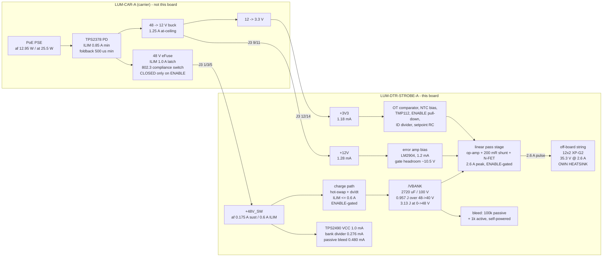

# power - rail tree and pulse energy architecture (LUM-DTR-STROBE-A)

research-power-architect, 2026-07-28. Machine-readable copy: `power.json`.

Inputs: `requirements.md`; `brief/06-connector-icd.md` s3.3/s6/s8; the five P1 fragments in
this directory. Every current below traces to a named consumer in one of those. Arithmetic
re-derived and machine-checked; the ICD's own headline figures are quoted where they differ
and the difference is explained, not silently overwritten.

---

## 0. Headline - five things that were not obvious before the arithmetic

1. **This board needs no local regulator of any kind.** Three rails in, three rails used
   directly. The only power-conversion element is the bank charge path, and it is a
   current limiter, not a voltage converter.
2. **Board dissipation is an invariant, not a design variable:**
   `P_board = P_rail x (48 - V_string)/48 + housekeeping`.
   It does **not** depend on flash rate, flash energy, bank size or bank voltage.
   **af: 2.33 W. at: 4.78 W.** The only real levers are string voltage and rail power.
3. **The `at` upgrade (D-01, "resistor change, no respin") does not close thermally on this
   board.** At 18.5 W the two linear FETs must dissipate 4.67 W between them in 69 C air.
   No arrangement of D2PAKs on copper closes that. See s6.4 - this is the biggest finding here.
4. **From a full bank, you get exactly ONE full-energy flash at 25 Hz.** Flash 2 is at 32 %.
   That is arithmetic, not a limitation to be engineered away: the 48 -> 40 V window *is* the
   whole usable range.
5. **The bank's set-point is the knob that shares heat between the two FETs.** Charging to
   48 V puts 1.88 W in the pass FET and 0.22 W in the charge FET; holding the bank at ~42 V
   puts ~1.05 W in each. Same total, same light, half the worst-case junction.

---

## 1. The rail tree



### 1.1 Rail-by-rail

| Rail | Vin | Local topology | Regulator needed? | Sustained | Peak | vs ICD ceiling |
|---|---|---|---|---|---|---|
| `+48V_SW` | J3 1/3/5, carrier eFuse | **direct** + a current-limited charge path to the bank | **No.** The charge path limits current, it does not convert voltage | **0.175 A (af)** / 0.383 A (at) | 0.6 A (charge-path ILIM) | 70 % of the 0.25 A af ceiling; 60 % of the 1.0 A fault ceiling |
| `+12V` | J3 9/11, carrier 48->12 buck | **direct**, decoupled only | **No** | **1.28 mA** | 1.28 mA | **0.17 %** of the 0.75 A af ceiling |
| `+3V3` | J3 12/14 | **direct**, decoupled only | **No** | **1.18 mA** | 1.18 mA | **0.47 %** of the 0.25 A ceiling |
| `/VBANK` | `+48V_SW` via the charge path | 2720 uF / 100 V store, 40-48 V operating | n/a | 0.175 A in | **2.6 A out** (pulse, never crosses the connector) | - |

**Zero local regulators. Zero magnetics. One current limiter.** That is the whole rail tree.

### 1.2 Per-consumer current, with the source of each number

| Rail | Consumer | Current | Where it comes from |
|---|---|---|---|
| `+48V_SW` | bank charge path (dv/dt limited) | 0.175 A af / 0.383 A at sust., **0.6 A ILIM** | `P_avail/48`; the 0.6 A ceiling from refdesign D11 (TPS2378 ILIM **min 0.85 A**, deglitch **min 500 us**) |
| `+48V_SW` | hot-swap controller VCC | **1.000 mA max** (450 uA typ) | TPS2490 datasheet SLVS503F s6.5, "Supply current (VCC), enabled" - read directly |
| `+48V_SW` | bank-sense divider 2x82k + 10k | 0.276 mA | protection-sense s5 (13.2 mW; Rth 9.43 k, inside the ICD 10 k limit) |
| `+48V_SW` | passive bleed 100 k | 0.480 mA | protection-sense s2 (23 mW = 0.27 % of budget) |
| `+48V_SW` | PROG/VREF setting divider | ~0.100 mA est. | TPS2490 VREF 4 V, I_VREF <= 1 mA; estimate, confirm at P3 |
| `/VBANK` | LED string (pulse) | **2.6 A peak** | STR-REQ-12; led-emitter s3, 12x2 XP-G2 at 1.30 A/die |
| `/VBANK` | active bleed 1 k (ENABLE low only) | 48 mA, from the bank | protection-sense s2. Costs zero budget - the rail is open when it runs |
| `+12V` | LM2904 dual op-amp Icc | **1.200 mA max** (0.7 typ) | drive-stage s2a |
| `+12V` | gate pull-down 4k7 during conduction | 0.080 mA avg (1.06 mA at 7.4 % duty) | drive-stage s2a |
| `+3V3` | LM2903 comparator Icc | 1.000 mA max | protection-sense s4 |
| `+3V3` | TMP112 telemetry | 0.010 mA | protection-sense s4 |
| `+3V3` | NTC divider 10k/10k | 0.165 mA | protection-sense s4 |
| (PWM pin) | setpoint RC divider 5k36+1k00 | 0.519 mA at 100 % duty | drive-stage s5.1 |
| (ENABLE pin) | 100 k pull-down | 0.033 mA | ICD s8.2, mandatory |
| (ID_ADC pin) | ID divider bottom leg | 0.224 mA (via the carrier's 10 k top leg) | protection-sense s5, placeholder value |

**Housekeeping total, rail-referred to the 48 V input** (12 V loads x1/0.90 for the carrier
buck, 3.3 V loads x1/0.85):

```
  +48V_SW  1.86 mA x 48 V                    =  89.1 mW
  +12V     1.28 mA x 12 V / 0.90             =  17.1 mW
  +3V3     1.95 mA x 3.3 V / 0.85            =   7.6 mW
  ------------------------------------------------------
  TOTAL                                      = 113.7 mW  = 1.34 % of the 8.5 W envelope
```

**Therefore `P_avail` for the flash chain = 8.386 W (af) / 18.386 W (at).**
At 48 V that is **175 mA (af) / 383 mA (at)** - i.e. **the 8.5 W total binds and the 0.25 A
per-rail ceiling never does** (175 mA is 70 % of it). Exactly as the ICD says.

---

## 2. The `+12V` question - decided

**Decision: bias the analogue loop from `+12V`, taken directly from J3 pins 9/11.
Not `+3V3`, not a local 48 V-derived linear.**

Three reasons, in the order that decides it:

1. **Gate headroom is the controlling constraint and it eliminates `+3V3` outright.**
   The pass FET's source sits on the shunt, 0.52 V above ground. A planar HEXFET (IRF640N
   class - refdesign D7/E5 say explicitly *not* to use a modern logic-level trench part in
   linear mode) has Vgs(th) up to 4 V and needs ~5-7 V of Vgs to pass 2.6 A. From a 3.3 V
   rail, even a rail-to-rail amplifier delivers Vgs = 3.3 - 0.52 = **2.78 V - below the
   worst-case threshold**. `+3V3` would force a logic-level trench FET, which is the part
   refdesign D6-D8 identifies as the *worst* choice for a linear pass element (higher ZTC ->
   more of the operating range is thermally unstable, Spirito). **`+3V3` is rejected on a
   coupled electrical + device-physics ground, not on convenience.**
   `+12V` gives the LM2904 a ~10.5 V output swing, matching every candidate FET's
   Vgs = 10 V Rds(on) spec.

2. **ICD s6.3's "take power on `+48V_SW`" does not bite at this current.** The guidance is
   worth 0.67 W (af) because it is about *rail-scale* loads. This is **1.28 mA = 15.4 mW**;
   the conversion penalty is **1.7 mW**, three orders below what the guidance is about, and
   0.17 % of the `+12V` af ceiling (the 1.25 A at-ceiling that busts the carrier's converter
   thermal budget is 976x this draw). The board takes **100 % of its actual power** on
   `+48V_SW`, which is what the guidance asks for.

3. **A local 48 V-derived bias is worse on every axis.** Linear-dropping 48 -> 12 V at
   1.3 mA burns 47 mW against 17 mW for the connector route (**2.7x the budget cost**); it
   adds a part inside the 48 V domain with its 0.60 mm clearance obligation; and - decisively
   - **it is dead exactly when the safety argument needs it alive.** `+48V_SW` is dead for
   hundreds of ms at every power-up (ICD s8.3) and after any eFuse latch. A `+12V`-biased
   amplifier is powered *before* 48 V arrives and *through* the whole bank-charge ramp, so
   the gate is **actively driven low** rather than only resistively held.

**Consequences that must be carried into P2:**

- The passive gate-source pull-down is still mandatory and is still the interlock of record.
  `+12V` may arrive *after* `+48V_SW` (ICD s7.3: no first-mate/last-mate control), and an
  unpowered LM2904 output is undefined. The rail choice improves the common case; it does
  not replace the passive interlock (protection-sense s3).
- Keep `+12V` local bulk **small (<= 4.7 uF)** so the amplifier dies promptly on unplug
  rather than holding the gate up after ENABLE has gone.
- **Move the STR-REQ-20 over-temperature comparator off `+3V3` and onto `+12V`.** See s7.5 -
  as drawn, the drive stage is fully functional with the daughter's `+3V3` absent, which makes
  a `+3V3`-powered trip a single-point failure of the firmware-independent protection.

---

## 3. The pulse energy budget

### 3.1 Bank energy

| | ICD 2800 uF | as-built 2720 uF (4 x 680 uF, energy-store s7) |
|---|---|---|
| 48 -> 40 V window | 0.986 J | **0.957 J** |
| 0 -> 48 V full charge | 3.226 J | **3.133 J** |
| Charge over the window | 22.40 mC | **21.76 mC** |
| Full-current flash length at 2.6 A | 8.62 ms | **8.37 ms** |

All numbers below use the **as-built 2720 uF**. The -2.9 % is inside the caps' tolerance band.

### 3.2 Rail energy per flash, including the charge-path loss - show the work

The pass element in the charge path burns `E_fet = Q x (48 - V_mean)` where `Q = C x dV` and
`V_mean = (48 + V_lo)/2`. **This is independent of the charge current profile** - constant
current, constant power, or a resistor all give the same loss, because
`E_fet = integral (48 - Vc) I dt = C integral (48 - Vc) dVc`. So:

```
  eta_charge = V_mean / 48        (that is the whole story)
```

| Case | Q | E_rail = 48 x Q | E into cap | E burnt in the charge FET | eta |
|---|---|---|---|---|---|
| **steady top-up 40 -> 48 V** | 21.760 mC | **1.044 J** | **0.957 J** | 0.087 J | **91.67 %** |
| 25 Hz af top-up 45.43 -> 48 V | 6.989 mC | 0.336 J | 0.326 J | 0.009 J | 97.34 % |
| 25 Hz at top-up 42.37 -> 48 V | 15.29 mC | 0.734 J | 0.691 J | 0.043 J | 94.15 % |
| **cold start 0 -> 48 V** | 130.56 mC | **6.267 J** | **3.133 J** | **3.133 J** | **50.00 %** |

**The ~92 % number is high precisely because the window is narrow** (mean cap voltage 44 V
against a 48 V source). This is the arithmetic that makes a linear charge path acceptable and
a switching pre-regulator not worth its parts, board area or DC-DC-hot-zone conflict
(refdesign D12). **The 50 % cold-start penalty is the same physics with a 24 V mean** and it
is unavoidable for any dissipative charge path.

### 3.3 Sustained flash rate vs per-flash energy

Two regimes, and the transition is the number that matters:

- **f <= f_full: bank-limited.** Every flash is a full 0.957 J window flash and the rail has
  spare capacity.
- **f > f_full: rail-limited.** Per-flash energy falls as `P_avail / (48 f) x V_mean`.

```
  f_full(af) = 8.386 W / 1.044 J = 8.03 Hz          (ICD s6.4 quotes 8.6 Hz)
  f_full(at) = 18.386 W / 1.044 J = 17.60 Hz        (ICD s6.4 quotes 18.8 Hz)
```

**The ICD's 8.6 / 18.8 Hz are the ideal-charge numbers**: `8.5 W / 0.986 J`. Adding the
8.33 % charge-path loss and 114 mW of housekeeping, and using the as-built 2720 uF, gives
**8.0 / 17.6 Hz - 7 % lower.** Not a contradiction of a frozen input; the ICD's figure is
the bank arithmetic, this one is the delivered arithmetic. **Design the governor to 8.0 Hz.**

| mode | f (Hz) | limit | E_bank/flash | **E_LED/flash** | V_lo | pulse width @2.6 A | duty | P_rail |
|---|---|---|---|---|---|---|---|---|
| af | 1 | bank | 0.957 J | 0.768 J | 40.00 V | 8.37 ms | 0.8 % | 1.04 W |
| af | 5 | bank | 0.957 J | 0.768 J | 40.00 V | 8.37 ms | 4.2 % | 5.22 W |
| af | **8.0** | **both** | **0.957 J** | **0.768 J** | 40.00 V | 8.37 ms | 6.7 % | **8.39 W** |
| af | 8.6 | rail | 0.899 J | 0.717 J | 40.53 V | 7.81 ms | 6.7 % | 8.39 W |
| af | 10 | rail | 0.783 J | 0.617 J | 41.58 V | 6.72 ms | 6.7 % | 8.39 W |
| af | 15 | rail | 0.534 J | 0.411 J | 43.72 V | 4.48 ms | 6.7 % | 8.39 W |
| af | 20 | rail | 0.405 J | 0.308 J | 44.79 V | 3.36 ms | 6.7 % | 8.39 W |
| **af** | **25** | **rail** | **0.326 J** | **0.247 J** | **45.43 V** | **2.69 ms** | 6.7 % | **8.39 W** |
| at | 8.6 | bank | 0.957 J | 0.768 J | 40.00 V | 8.37 ms | 7.2 % | 8.98 W |
| at | 15 | bank | 0.957 J | 0.768 J | 40.00 V | 8.37 ms | 12.6 % | 15.67 W |
| at | **17.6** | **both** | 0.957 J | 0.768 J | 40.00 V | 8.37 ms | 14.7 % | 18.39 W |
| **at** | **25** | **rail** | **0.692 J** | **0.541 J** | **42.37 V** | **5.89 ms** | 14.7 % | **18.39 W** |

Cross-check against ICD s6.4: 25 Hz af 0.34 J / droop to 45.4 V (mine: 0.326 J / 45.43 V);
25 Hz at 0.74 J / 42.1 V (mine: 0.692 J / 42.37 V). Agreement to within the 2720-vs-2800 uF
difference and the housekeeping term. **The closed figures survive contact with the arithmetic.**

**The `E_LED` column is the one that matters and the ICD does not have it.** The bank column
counts joules leaving the capacitor; only `V_string / V_mean` of those reach the LED. At
25 Hz af that is **76 %** - the other 24 % is the pass FET. Optical output per flash is
`P_avail x (V_string/48) / f` and is **independent of bank voltage**.

**Reduced amplitude** (STR-REQ-04): at k x 2.6 A the string Vf falls, so *more* of the bank
lands on the pass FET - the LED's share drops from 76 % at full amplitude to roughly 68 % at
10 % (estimated from the XP-G2 Vf curve; confirm against the final emitter). Instantaneous
FET power still falls (28.3 W -> 3.9 W), so dim flashes are inefficient but harmless.

### 3.4 Single long flashes (STR-REQ-01, 100-200 ms)

For flashes longer than ~10 ms the rail contributes materially during the flash itself:

| duration | bank | + rail during the flash | total | drive power | string current |
|---|---|---|---|---|---|
| 10 ms | 0.957 J | 0.077 J | 1.034 J | **103 W** | 2.35 A |
| 50 ms | 0.957 J | 0.384 J | 1.342 J | **26.8 W** | 0.61 A |
| 100 ms | 0.957 J | 0.769 J | 1.726 J | **17.3 W** | 0.39 A |
| 200 ms | 0.957 J | 1.537 J | 2.495 J | **12.5 W** | 0.28 A |

Confirms requirements s3.4 and open question 2: **"full output" at 150 ms is ~15 W, not
100 W.** Repetition is still rail-bound - a 200 ms / 2.495 J flash needs 2.72 J of rail energy
= 0.33 s of rail time, so **max ~3 Hz and 60 % duty.**

### 3.5 The window floor is a consequence of the string voltage, not a constant

Regulation holds while `V_bank > V_string + V_shunt + I x Rds(on) + loop margin`:

| string | floor | window | energy | vs the 40 V window |
|---|---|---|---|---|
| 38.0 V (drive-stage s0 / ICD ceiling) | 39.41 V | 48 -> 39.4 V | 1.021 J | 1.07x |
| **35.3 V (12x2 XP-G2, led-emitter s3)** | **36.71 V** | **48 -> 36.7 V** | **1.301 J** | **1.36x** |

**The ICD's 40 V floor was set for a 38 V string.** With the recommended 12x2 XP-G2 array at
35.3 V there is 3.3 V and **0.34 J of unused window** - a 36 % larger accent for zero parts
cost. It buys burst energy only; it does **not** raise the sustained rate (rail-bound) and it
does **not** reduce dissipation (see s6.1). **Flagged as a lever for the architect, not
adopted here** - it moves a number the ICD states, so it needs the human.

### 3.6 STR-REQ-05 worst case - ~30 s of continuous 25 Hz, af

| | value |
|---|---|
| Flashes | 750 |
| Energy **in** from the rail | 8.386 W x 30 s = **251.6 J** |
| Energy **out** (750 x 0.336 J rail-equivalent) | **251.6 J** - balanced, by construction |
| Bank steady-state operating voltage | **45.43 <-> 48.00 V**, sawtooth. It does **not** walk down |
| Per-flash: bank 0.326 J / LED 0.247 J / pulse 2.69 ms / duty 6.7 % | |
| Pass FET | **1.88 W** |
| Charge FET | 0.22 W |
| Shunt (200 mR) | 0.091 W (1.35 W peak, 6.7 % duty) |
| Bank ESR (43.9 mR at 120 Hz) | 0.020 W (carved out of the pass FET, not added) |
| Housekeeping | 0.114 W |
| **Board total** | **2.33 W** |
| LED string (off-board) | 6.17 W |

**Duration is not a free variable and 30 s is not the worst case - an indefinite run is, and
it is the same 2.33 W**, because the rail caps input at 8.5 W however long the drop lasts.
This is exactly what requirements s4 says. The 30 s figure is *less* severe than steady state:
the D2PAK + pour thermal time constant is order 60-120 s, so a 30 s burst reaches only
~60-80 % of the final rise before returning to the 0.114 W idle.

**The only unbounded thing in this scenario is the LED heatsink**, which is off-board and
owned by led-emitter s7.

### 3.7 Burst capability - the number the human needs

Starting from a full bank at 48 V, full-energy (0.957 J) demand at 25 Hz:

| flash | bank at start | delivered | % of full | pulse width |
|---|---|---|---|---|
| **1** | 48.00 V | 21.76 mC = 0.957 J bank / 0.768 J LED | **100 %** | 8.37 ms |
| 2 | 42.57 V | 6.99 mC = 0.289 J bank / 0.247 J LED | **32 %** | 2.69 ms |
| 3+ | 42.57 V | same | 32 % | 2.69 ms |

**Exactly one full-energy flash.** This is algebra, not a shortfall: one full flash *is* the
whole 48 -> 40 V window, and 40 ms of rail replaces only 6.99 mC of the 21.76 mC spent, so
flash 2 is already at the steady state. There is no taper to design - **the governor's job is
to decide whether flash 1 gets the whole bank or whether all flashes are equal.**

Opening the window to the true 36.7 V regulation floor (s3.5) buys **one intermediate step**:
100 % -> **73 %** -> 32 %. That is the entire benefit of the deeper window at 25 Hz.

At 8 Hz the same demand gives: 100 % -> 100 % -> ... indefinitely (that is the definition
of `f_full`).

**Put in front of the human:** a 4-bar build-up that ends on a single maximum blast is
supported. A sustained 25 Hz *machine-gun* section is supported at 32 % of full energy
(0.247 J of LED drive per flash, 2.69 ms wide, ~3200 lm-equivalent instantaneous). Both are
musically useful; the second is not "blinding".

---

## 4. Efficiency and where the watts go

At any rail-limited operating point (af, `V_string` 35.3 V, `V_shunt` 0.52 V):

| destination | share of `P_rail` | af (8.386 W) | at (18.386 W) |
|---|---|---|---|
| **LED string (off-board, useful)** | **73.5 %** | **6.17 W** | 13.52 W |
| current-sense shunt | 1.08 % | 0.091 W | 0.199 W |
| **both linear FETs together** | **25.4 %** | **2.13 W** | **4.67 W** |
| board housekeeping | (additional) | 0.114 W | 0.114 W |

With a 38 V string the FET share drops to **19.8 %** (1.75 W af / 3.83 W at). Dropping the
shunt to 50 mohm behind an INA180 (drive-stage s3/#a) recovers a further 0.8 % = 68 mW - real
but second-order next to the string-voltage lever.

---

## 5. Dissipation map, per element, three operating points

Ambient is the **sealed-box internal air: 56 C (af) / 69 C (at)** (ICD s7.6), not 25 C.
Derating applied: `P_allowed = (Tj_design - T_air) / RthJA`, `Tj_design = 125 C` (a 25 C
derate on the IRF640N's 175 C max, standard practice for a part with no linear-mode SOA
characterisation - drive-stage s1.1/R3), `RthJA = 40 C/W` for a D2PAK on 1 in^2 of copper
(drive-stage s1.2, datasheet-conditioned).

```
  D2PAK allowance:  56 C air, Tj 125 C -> 1.73 W      69 C air, Tj 125 C -> 1.40 W
                    56 C air, Tj 175 C -> 2.98 W      69 C air, Tj 175 C -> 2.65 W
```

Accounting convention: **the bank ESR row is carved OUT of the pass FET's share, not added to
it.** The bank's 0.114 V IR sag reduces the terminal voltage the pass FET sees, so it is the
same 20-44 mW counted once. Columns sum to the board total exactly.

| element | idle | af 8.6 Hz | af 25 Hz | at 8.6 Hz | **at 25 Hz** | flagged? |
|---|---|---|---|---|---|---|
| **linear pass FET** (integrated over the flash, not peak) | 0 | 1.46 W | **1.88 W** | 1.51 W | **3.54 W** | **YES** |
| **bank charge FET** (steady state) | ~0 | 0.65 W | 0.22 W | 0.75 W | **1.08 W** | **YES** |
| bank charge FET (cold-start event) | - | **8.35 W peak / 4.18 W mean / 0.75 s / 3.13 J** | | | | **YES** |
| current-sense shunt 200 mR 2512 | 0 | 0.091 W | 0.091 W | 0.097 W | 0.199 W | no (<0.5 W; 1.35 W peak) |
| passive bleed 100 k 0805 | 23 mW | 23 mW | 23 mW | 23 mW | 23 mW | no |
| active bleed 1 k 2512 (ENABLE low only) | - | **2.30 W peak / 0.73 W mean / 4.3 s / 3.13 J** | | | | **YES** |
| bank ESR (43.9 mR at 120 Hz) | 0 | 0.020 W | 0.020 W | 0.021 W | 0.044 W | no |
| bank-sense divider (2x82k + 10k) | 13.2 mW | 13.2 mW | 13.2 mW | 13.2 mW | 13.2 mW | no (6.6 mW per 0805) |
| TPS2490 (VSSOP-10, RthJA 165 C/W) | 48 mW | 48 mW | 48 mW | 48 mW | 48 mW | no (8 C rise) |
| other housekeeping | 30 mW | 30 mW | 30 mW | 30 mW | 30 mW | no |
| **BOARD TOTAL** | **0.114 W** | **2.33 W** | **2.33 W** | 2.49 W | **4.98 W** | |
| LED string (off-board) | 0 | 6.17 W | 6.17 W | 6.61 W | 13.52 W | led-emitter s7 |

Note the af column: **identical at 8.6 and 25 Hz.** That is the invariant of s6.1 - only the
split between the two FETs moves.

### 5.1 Integrating the pass FET properly (the role's specific ask)

Do **not** use the peak. Over one full-window flash the bank falls 48 -> 40 V while the string
holds 35.3 V and the shunt 0.52 V, so `Vds` falls **12.18 V -> 4.18 V**:

```
  E_fet = Q x (V_mean - V_string - V_shunt) = 21.76 mC x (44 - 35.82) = 0.178 J
  minus bank ESR (2.5 mJ)                                             = 0.175 J
  peak instantaneous = 2.6 A x 12.18 V = 31.7 W (for microseconds at flash start)
  at 8.0 Hz -> 1.40 W average.   Using the 31.7 W peak would over-state by 23x.
```

The drive-stage scout's 1.06 W is the same calculation with a 38 V string. Two corrections
move it, and they compound:

| step | pass FET | change |
|---|---|---|
| 38 V string, af, full-window (8.0 Hz), charge-path loss counted | 0.94 W | baseline |
| **string 38 -> 35.3 V** (the recommended 12x2 XP-G2 array) | **1.41 W** | **+50 %** |
| **bank held at 48 V and rate raised to 25 Hz** | **1.88 W** | **+33 %** |

**String voltage is the single most sensitive input in the thermal design, and the bank
set-point is second.** Neither was in the drive-stage scout's scope.

### 5.2 Cold start is the larger SOA event, and it is repeatable

3.133 J into the charge FET, 0 -> 48 V, in linear mode. Ramp rate is a design choice:

| charge current | ramp time | input power | vs the 8.5 W af envelope | FET peak / mean |
|---|---|---|---|---|
| **0.175 A** (= P_avail/48) | **0.75 s** | **8.35 W** | **inside** | 8.35 W -> 0 / 4.18 W |
| 0.25 A (ICD s6.2 rail ceiling) | 0.52 s | 12.00 W | **over** for 520 ms | 12.0 W / 6.0 W |
| 0.6 A (refdesign D11 ILIM ceiling) | 0.22 s | 28.80 W | **far over** for 220 ms | 28.8 W / 14.4 W |

**Recommendation: set the charge *ramp* at ~0.175 A (dv/dt control, `I = C dV/dt`) and the
*current limit* separately at <= 0.6 A as a fault backstop.** These are two different numbers
and conflating them is the classic error:

- The **0.6 A ILIM** protects against the PD's foldback (TPS2378 ILIM min 0.85 A, deglitch min
  500 us - refdesign D11/E7). It bounds a fault, e.g. a short on the bank.
- The **0.175 A ramp** keeps the whole 750 ms cold start inside the 8.5 W envelope so the
  **PSE overload timer (50-75 ms, ICD s6.2) is never started.** A 0.25 A ramp holds 12 W for
  520 ms - seven times the overload window. That is a fixture-wide brown-out risk that the
  ICD's own 0.25 A per-rail figure does not warn about, because the ICD says the *total* binds.

The TPS2490 supports exactly this shape: a **gate capacitor for dv/dt control** (constant
inrush current, FET power falling as Vout rises - refdesign D10, S5 Fig 7) plus **PROG for a
power-limit backstop** plus the sense resistor for ILIM. Do **not** use power-limiting alone as
the ramp control: with `Vds x Id = PLIM` the *input* current rises as the cap charges, so input
power grows from `PLIM` to `6 x PLIM` by the time the bank reaches 40 V. Wrong shape for a
fixed-input-power budget.

**Repeat rate is the trap.** Mean charge-FET power = 3.133 J x (ENABLE cycles/s):

```
  ENABLE re-arm every  1.33 s -> 2.35 W  (= the D2PAK steady-state limit at 56 C: cooking)
  ENABLE re-arm every  3.13 s -> 1.00 W
  ENABLE re-arm every 10 s    -> 0.31 W   <- design rule
```

**Firmware contract: `ENABLE` is a slow arm/disarm, minimum ~10 s between assertions. It is
NOT a per-flash or per-cue gate - PWM is.** A firmware author who blanks the strobe by
toggling ENABLE at cue rate destroys the charge FET *and* throws away 3.13 J each time.
Mitigating nuance: the active bleed's 2.72 s time constant means a **short** de-assert is
cheap - a 100 ms ENABLE glitch drops the bank only ~3.5 %, so the penalty is graduated, not
a cliff.

### 5.3 Bleed network

| | R | standing burn | tau | 48 -> 10 V | peak | event energy |
|---|---|---|---|---|---|---|
| passive backstop, daughter alone (unstacked) | 100 k | 23 mW (0.27 %) | 272 s | **7.1 min** | 23 mW | - |
| passive, stacked (in parallel with the carrier's 100 k - no series diode) | 50 k | 23 mW | 136 s | **3.6 min** | 46 mW | - |
| **active, ENABLE-gated** | **1 k** | 0 (rail is open) | **2.72 s** | **4.3 s** | **2.30 W** | 3.13 J |

The active bleed costs **zero budget** - when ENABLE is low the carrier's 48 V switch is
already open, so the energy comes from the bank. **2.30 W peak into a 2 W 2512 relies on the
part's continuous rating being exceeded transiently and no chip resistor JLC stocks publishes
a joule rating** (protection-sense s2). **Recommendation: split it into 2 x 470 ohm 2512 in
series** - halves the per-part peak to 1.15 W (inside a 2 W continuous rating with 1.7x
margin), doubles the working-voltage margin, and costs $0.09.

---

## 6. The three findings that change the design

### 6.1 Board dissipation is an invariant

```
  P_board  = P_rail x (48 - V_string)/48 + P_housekeeping         (af 2.33 W, at 4.78 W)
  P_FETs   = P_rail x (48 - V_string - V_shunt)/48                (af 2.13 W, at 4.67 W)
```

Independent of flash rate, per-flash energy, bank capacitance and bank voltage. Every joule
the rail delivers either reaches the LED (`V_string/48` of it) or is burnt on this board.

**Consequences:**

- **A bigger bank does not reduce dissipation** - it does not even change it. It only buys
  burst depth. (It makes the pass FET *hotter* at a given rate, because the bank stays nearer
  48 V - see s6.2.)
- **Raising `V_string` is the only first-order lever.** Every extra volt of string moves
  `P_rail/48 = 2.1 %` of the budget (af: 175 mW) from the FET to the LED. Going from 35.3 V
  to the ICD's 38 V ceiling cuts board dissipation from **2.13 W to 1.75 W (-18 %)** and adds
  the same 0.38 W to the light. This deserves a hard look at the emitter arrangement.
- **Reducing `P_rail` is the second lever** and it is what the governor already does.

### 6.2 The bank set-point shares the heat between the two FETs

The *total* is fixed; the *split* is set by the bank's mean voltage during the top-up:

```
  P_pass = P_rail x (V_mean - 35.82)/48        P_charge = P_rail x (48 - V_mean)/48
```

| bank charged to | af pass | af charge | at pass | at charge |
|---|---|---|---|---|
| 48.0 V (simple: charge to the rail) | **1.90-2.13 W** | 0-0.22 W | **4.18-4.67 W** | 0-0.49 W |
| 44.0 V (full-window operation) | 1.43 W | 0.70 W | 3.13 W | 1.53 W |
| **41.9 V (the balance point)** | **1.06 W** | **1.06 W** | 2.33 W | 2.33 W |
| 40.0 V | 0.73 W | 1.40 W | 1.60 W | 3.06 W |

*(pass-FET figures in this table include the 20-44 mW bank-ESR term that the detailed map in
s5 carves out separately - it does not change any conclusion here.)*

**Recommendation for `af`: regulate the bank to a set-point of ~42 V rather than charging to
48 V.** Both FETs then sit at ~1.05 W against a 1.73 W allowance (**1.65x margin**) instead of
one at 1.88 W against 1.73 W (**a 9 % overrun**). **Identical average light output, identical
total heat, half the worst-case junction temperature.** Raise the set-point toward 48 V only
when burst headroom is wanted (a governor decision, and the bank-voltage feedback for it is
already required by STR-REQ-18).

The `at` row is why s6.3 exists.

### 6.3 The `at` upgrade does not close thermally - the biggest finding here

D-01 says the 802.3at upgrade is "a resistor change + a PoE+ switch, no respin". **For this
daughter that is not true**, and the reason is s6.1: at 18.386 W the two linear FETs must
dissipate **4.67 W** between them in **69 C air**.

| arrangement | worst per-FET | D2PAK allowance (69 C, Tj 125 C) | verdict |
|---|---|---|---|
| charge to 48 V, 25 Hz | 3.59 W | 1.40 W | **fails 2.6x** |
| balanced split at 41.9 V | 2.33 W | 1.40 W | **fails 1.7x** |
| balanced split, 38 V string | 1.91 W | 1.40 W | **fails 1.4x** |
| balanced split, at Tj 175 C absolute max | 2.33 W | 2.65 W | passes - but 175 C is the abs max, not a design limit |

**What it would take:**

- **RthJA <= 24 C/W** (balanced split) or **<= 15.6 C/W** (unbalanced) versus the 40 C/W a
  D2PAK on 1 in^2 achieves. That is a real heatsink in still air, and the drain tab is a
  **48 V net** carrying the 0.60 mm clearance obligation on every layer (drive-stage R5).
- **or** the string at **>= 40.2 V** - above the ICD's 38 V ceiling. Not available.
- **or** the governor caps sustained rail draw at **11.0 W** (35.3 V string) / **14.2 W**
  (38 V string) of the 18.5 W available.

**Recommendation: design and build to `af` (which requirements s3.1 already directs), and
record that the `at` path costs this daughter either a heatsinked pass element or a
governor-imposed ~11-14 W cap.** The board is not unsafe in `at` - STR-REQ-20's
firmware-independent over-temperature trip is the backstop, and the thermal sensor must
therefore be on or near the **FETs**, not only on the LED (drive-stage R1 says the same thing
for the LED-short fault). It just does not deliver the extra light the upgrade promises.

**This is not a blocking issue against LUM-CAR-A** - the carrier's ICD is correct and nothing
this board needs is changing. It is a scope note against D-01 for the human. **See OPEN-1.**

### 6.4 Paralleling the pass FET is not a free fix

Two D2PAKs in parallel halve the per-device power but **linear-mode paralleling is unstable
without source ballast** (the device with the lower Vgs(th) hogs current, heats, and its
threshold falls further - the same Spirito mechanism refdesign D6 describes). Source ballast
resistors re-introduce the dropout headroom that s3.5 is trying to save. Flagged so it is not
reached for casually.

---

## 7. Sequencing and fail-safe - the four cases, walked

The ICD gives **no first-mate/last-mate control** (s7.3): 48 V may arrive before or after
3.3 V, in either order, on mate *and* on unmate.

### 7.1 Power-up: `+3V3` and `+12V` live, `+48V_SW` dead for hundreds of ms

| what happens | why it is safe |
|---|---|
| ENABLE low (carrier 10 k + daughter 100 k pull-downs, both passive) | ICD s8.1/s8.2 |
| Charge path off: TPS2490 GATE held low below its POR (~6 V) and UVLO, **and** its EN pin is GND-referenced with abs max 100 V so ENABLE drives it directly with no rail (protection-sense s3) | two independent holds |
| Pass FET off: gate-source pull-down + 2N7002 clamp, both rail-independent | protection-sense s3 |
| Bank at 0 V | nothing charged it |
| **No path energises the bank from `+12V` or `+3V3`** | see the rule below |

**HARD RULE for P2 (ICD s8.3 point 2):** no component may bridge `+12V` or `+3V3` to
`+48V_SW`, `/VBANK`, `/LED_A` or `/LED_K`. The only nets crossing the domain boundary are
(a) `ENABLE` / `PWM` into GND-referenced control inputs, and (b) the bank-sense divider tap,
which is a resistive path **out** of the 48 V domain into a high-impedance ADC - current can
only flow from 48 V to GND through it, never into the bank. **This must be an explicit
netlist review item at P4 and a check at P8**, because it is the one requirement whose
violation is invisible on the bench and only shows up as a PD compliance failure.

**Secondary:** total daughter capacitance on the `+48V_SW` side of the charge FET must stay
under ~1 uF (TVS + controller bypass only). At 1 uF it is 0.56 % of the 802.3 180 uF port
ceiling, against the carrier's own 44 uF. The 2720 uF sits **behind** the charge FET, where
the carrier's compliance switch already hides it.

### 7.2 ENABLE asserts: 48 V steps into an empty bank

1. Carrier's eFuse closes with a deliberately fast dV/dt (ICD s8.2) into <1 uF - a non-event.
2. TPS2490 VCC clears POR/UVLO, then releases GATE **through its dv/dt capacitor**: constant
   ~0.175 A into the bank, 0 -> 48 V in **0.75 s**, 3.133 J burnt in the charge FET
   (8.35 W falling to 0). The fault timer must be programmed **longer than 0.75 s** or the
   controller latches off on a normal start (TPS2490 latches, protection-sense R9).
3. The carrier's eFuse ILIM (1.0 A) sits **above** the daughter's ramp so the two soft-starts
   do not fight - as the ICD deliberately arranged (s8.2).
4. **The drive stage must be inhibited while the bank is below the regulation floor.** Below
   ~36 V the string cannot conduct, so nothing happens electrically; between 36 and 40 V a
   commanded flash would produce a truncated, dim pulse and would steal the charge current.
   **Recommendation: a bank-undervoltage lockout at ~40 V on the free second section of the
   LM2903** (protection-sense s4 notes it is spare). This also removes the "first flash of a
   phrase fades in" failure mode (refdesign E2).
5. **Worst mate order:** `ENABLE` connects *before* `+48V_SW` -> the charge path is armed when
   the rail arrives. Handled by (2) - the dv/dt ramp is the same event either way. The reverse
   order leaves the bank empty until ENABLE arrives. Both safe.
6. **`GND`-last is not a reachable failure mode**: 2.54 mm dual-row pins mate within ~0.3 mm
   of travel and there are 12 GND pins with a GND adjacent to every supply pin (ICD s3.1/s5.3).

### 7.3 ENABLE de-asserts mid-flash

1. The 2N7002 clamp pulls the pass gate to the FET source in ~us. String current stops.
2. **Harness inductance is the only stored energy that needs somewhere to go.** For 0.5-2 uH
   of internal wiring at 2.6 A: **1.7-6.8 uJ**, producing 13-52 V of `L di/dt` at a 100 ns
   turn-off. Added to a 48 V bank that is 61-100 V on the FET drain - inside the IRF640N's
   200 V rating with margin, marginal against a 100 V part.
   **Requirement: clamp the drain, and do it with a drain-source TVS or verified avalanche
   capability - NOT a freewheel diode across the string.** A freewheel path recirculates the
   harness current *through the LEDs* and produces exactly the decay tail STR-REQ-01 forbids
   (refdesign D1/D2). The energy is trivial; the topology is not.
3. Charge path stops (TPS2490 EN low). Bank holds its charge.
4. Active bleed engages -> 48 -> 10 V in 4.3 s, 3.13 J into the bleed resistor.
5. Re-arm penalty: see s5.2. Minimum ~10 s between ENABLE assertions.

### 7.4 Cable unplug mid-flash - the hazard case

All three rails vanish in arbitrary order. The bank still holds **up to 3.13 J at 48 V**, and
**the carrier fits no series diode on `+48V_SW`** (ICD s8.2), so the bank back-feeds onto the
connector's 48 V pins and onto the carrier's now-unpowered rail.

| element | what it must do | requirement this creates |
|---|---|---|
| Pass FET | turn off | The passive gate-source pull-down does it with every rail dead. The `+12V` bulk must be small (<= 4.7 uF) so a still-powered op-amp cannot hold the gate up - **s2 consequence** |
| Charge FET | turn off | TPS2490 VCC collapses -> GATE low. Also isolates the bank from the connector... **only while it is off.** Its body diode points the wrong way for a high-side N-channel, so **the bank is NOT isolated from `+48V_SW` by the charge FET.** Assume the connector pins go to bank potential |
| **Active bleed** | **turn ON with every rail dead** | **This is the requirement most easily got wrong.** An ENABLE-inverting stage powered from `+3V3` cannot invert anything when `+3V3` is gone. **The active bleed must be self-powered from the bank**: bias it up from `/VBANK` through a high-value resistor (clamped), and have the ENABLE-driven device pull it *down* to disarm. Then "everything dead" is the ON state. Standing cost when ENABLE is high: ~2-3 mW with a MOSFET-gate arrangement, ~58 mW with a base-driven BJT - **prefer the gate-driven form** |
| Passive backstop 100 k | always | The un-defeatable floor: 7.1 min to 10 V alone, 3.6 min stacked. Not fast enough on its own for service |

**With the self-powered active bleed the board is under 10 V 4.3 s after unplug, in every
case, with no rail and no firmware.** Without it, a board pulled off the stack holds a
handling hazard for 7 minutes. **Silkscreen** the stored-energy warning and the bleed time
constant per requirements s8.3 regardless.

### 7.5 The `+3V3` single-point failure (found while walking the above)

With `+12V` biasing the loop (s2), **the drive stage is fully functional with the daughter's
`+3V3` absent**: ENABLE and PWM arrive at 3.3 V CMOS levels from the *carrier*, the setpoint
RC divider runs off the PWM pin to GND, the op-amp runs off `+12V`, and the charge path's EN
is GND-referenced. **The only thing that dies is the `+3V3`-powered over-temperature
comparator** - i.e. the STR-REQ-20 firmware-independent protection, which is precisely the
element that must not have a single point of failure.

Note what is *not* affected: if the **carrier's** 3.3 V rail fails, the ESP32 dies, ENABLE's
driver goes high-Z and the carrier's 10 k pull-down de-asserts - self-safing. The exposed case
is a **daughter-local** loss of `+3V3` (both pins open, a broken track, a shorted decoupling
cap) while the carrier is healthy.

**Recommendation: bias the over-temperature comparator and its NTC reference divider from
`+12V`, the same rail as the thing they protect**, and take the ADC1 telemetry from an
independent `+3V3`-referenced leg. The LM2903 is 2-36 V and its open-collector output sinks a
12 V gate node fine. Two thermistors on the off-board module cost $0.08 and give an
independent trip path and telemetry path - which is better practice anyway, since a shorted
telemetry wire then cannot defeat the trip. **Circuit shape is the architect's call; the
power-architecture requirement is "the protection must be on a rail no less available than
the thing it protects". See OPEN-4.**

---

## 8. Layout / constraint consequences

| item | number | why |
|---|---|---|
| Pulse-loop nets (`/VBANK`, `/LED_A`, `/LED_K`, `/ISNS`) | **2.6 A** declared; RMS is only 0.71 A (af) / 1.05 A (at) / 1.21 A (opening burst) | Thermally RMS binds, but the **IR-drop target binds harder**: keep total loop copper under **30 mohm** so the drop stays under 78 mV = 1 % of the window. At 1 oz that forces ~1 mm minimum anyway, which is what 2.6 A would give. Declaring 2.6 A gets the right answer for the right-enough reason |
| Bank ESR contribution | 0.114 V at 2.6 A = **1.43 %** of the 8 V window, 2.5 mJ/flash | energy-store s7; 70x ripple margin - not a constraint, just accounted |
| `+48V_SW` input stub | **0.6 A** (the ILIM setting - it must carry fault current until the limiter acts) | refdesign D11 |
| Every 48 V-domain net | **57 V** declared -> IPC-2221B B2 51-100 V band -> **0.60 mm** outer | ICD s5.1/s5.4 |
| Charge-FET gate net | **64 V** (TPS2490 V_GATE-OUT is 12-16 V above VCC, datasheet s6.5) - the highest-voltage net on the board | Still inside the 51-100 V band, so 0.60 mm covers it. **Do not declare the TVS clamp voltage (93.6 V) as a working voltage** - IPC-2221 spacing is for steady-state working voltage, and declaring 100 V would demand 1.5 mm and fail the layout for no reason |
| Pulse-loop return | return directly beneath the outbound conductor on the adjacent layer | refdesign L1/L6: vertical coupling shrinks the loop without violating the in-plane 0.60 mm; inner-layer clearance is JLC's 0.127 mm anyway, so the vertical dimension is free |
| Connector loading | `+48V_SW` 175 mA sustained / 600 mA peak of **5.40 A** capacity (3.2 % / 11 %) | ICD s4.1 at 1.80 A/pin. **The 2.6 A pulse never crosses the connector** - it comes from the bank |

---

## 9. What this block did NOT do

Did not pick parts (P3), did not draw the schematic or choose the bleed/clamp circuit shapes
(P2), did not place anything, did not size the LED heatsink (led-emitter s7 owns it), and did
not re-open any closed decision. Where the arithmetic points at a closed number (the 40 V
window floor, the D-01 `at` upgrade), it is written up as a **lever for the human** in OPEN,
not applied.

**Sources:** ICD s3.3/s4/s5/s6/s7.6/s8; requirements s3/s4/s8; `energy-store.md` s1/s7 (bank,
ESR, ripple); `drive-stage.md` s0/s1.2/s2a/s3/s5 (FET thermal, op-amp, shunt, setpoint);
`protection-sense.md` s0/s1/s2/s3/s4/s5 (charge path, bleed, ENABLE, dividers);
`led-emitter.md` s3/s5/s7 (string voltage, efficacy, heatsink); `refdesign-pulsed-led-driver.md`
D1/D8/D10/D11/D12, E2/E7/E8/E9, L1/L4/L6 (topology, PD limits, SOA, cold start);
**TI TPS2490/TPS2491 datasheet SLVS503F rev Feb 2020 s6.1/6.3/6.4/6.5** - fetched and read
directly for supply current (450 uA typ / 1000 uA max), VCC range (9-80 V), EN abs max (100 V),
V_GATE-OUT (12-16 V) and RthJA (164.9 C/W).
