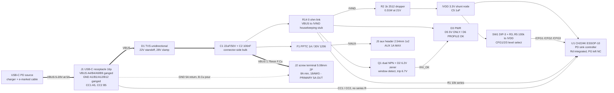

# pd-trigger - block diagram

*Amended A1 (P3 datasheet extracts landed): the 3.3 V LDO is gone, VDD is fed by
the datasheet's own dropper, and the indicators run off a housekeeping stub. See
`decisions.md` section A1 for the delta and the reasons.*

USB-C PD sink "trigger" board. One negotiated rail passes straight through from
the receptacle to a screw terminal at up to 5 A / 20 V / 100 W. Everything else
on the board is housekeeping: negotiate, select, indicate.

There is **no series element in the 5 A path** (P0 answer 2 revised by the
orchestrator - see `decisions.md` D1) and **no regulation**: the input copper IS
the output copper, one net named `VBUS` end to end.

Thick arrows are the 5 A path (F.Cu only, no layer change). Dotted is the
return (B.Cu pour). Everything else is milliamps: total housekeeping draw is
~31 mA at the 20 V profile and ~5 mA at 5 V.

## B1 - input and protection (J1, D1, C1, C2)

**J1, USB-C receptacle, 16-pin SMT power+USB2 type** (SuperSpeed pins absent by
preference - eight fewer fine-pitch pads on a 5 A board). Non-negotiable part
criteria for P3: the datasheet's current clause must read **5.00 A collectively
across A4/A9/B4/B9** (a "3.00 A collectively" part is a 3 A receptacle), and the
voltage rating must be **>= 24 V** - the GCT USB4105 class is rated 20 V DC,
which is our maximum with zero margin, while the USB4085 class is 48 V. All four
VBUS and all four GND contacts are ganged in copper at the pads. Shell tied
directly to GND (bench tool, no chassis). D+/D-, SBU1/2 left unconnected at the
receptacle.

**D1, TVS, unidirectional, on VBUS at the connector, before the bulk.** Class:
**22 V working / 23 V min breakdown / ~28 V max clamp**, e.g. the TDS2221PW
class named by Semtech SI21-03. Explicitly **not** a 24 V SMAJ/SMBJ - that class
clamps at 38-39 V, above both the 34 V guidance and the CH224's operating limit.
Low capacitance is not a consideration on VBUS. Not optional: a published CH224
trigger-board teardown with no TVS reports the chip destroyed at 20 V under load,
attributed to a cable inductive spike.

**C1 + C2, connector-side bulk: 22 uF / 50 V X5R (1210 class) + 100 nF / 50 V.**
50 V, not 25 V: X5R at 20 V DC bias on a 25 V part keeps a fraction of its
marking. Total sink bulk stays far under the PD ceiling `cSnkBulkPd` = 100 uF
(22 uF draws only ~0.7 A of charging current at the source's 30 mV/us slew limit
during a 5 V -> 20 V transition; 100 uF would draw 3 A and eat most of a
contract). Bulk sits at the **connector side** of the run.

## B2 - PD sink controller and its supply (U1, R1, R2, C5)

**U1, CH224K, ESSOP-10 (1 mm pitch, gull-wing - not leadless).** Scout lead part;
the scout's live JLC query returned C970725 at $0.389/qty10 with 12.4 k stock.
Alternate: **HUSB238A-BB001-QN16R** (QFN-16) if CH224K stock disappoints.

**The supply topology is the datasheet's own** (extract `parts/C970725.json`:
reference schematic 6.2, tables 4-2 and 8.2.3):

- **R2 = 1 kOhm from VBUS (via `/VIND`) to VDD**, with **C5 = 1 uF from VDD to
  GND**. VDD is an internally **shunt-regulated** node (3.24 / 3.30 / 3.36 V,
  sinking 0-30 mA), absolute maximum 3.6 V - *not* a regulator input. The dropper
  carries the whole bus-to-3.3 V difference and the chip shunts the excess:
  **16.7 mA / 0.279 W at 20 V, 17.7 mA / 0.313 W at 21 V**, inside the 30 mA
  shunt limit, and 1.7 mA at the 5 V profile - which is the operating point WCH's
  own reference circuit accepts, so the part's unpublished IDD must fit inside it.
- **R2 is a 1 kOhm 2512, 1 W part** (3x derating on 0.31 W). Not an 0603/0805:
  the published field failure of a CH224 trigger board was a *sizing* error -
  510 Ohm burning 0.55 W in a small package - not a topology error. Alternate if
  2512 stock disappoints: 2x 510 Ohm 1206 in series (0.157 W each).
- **R1 = 10 kOhm in series into pin 8 (VBUS sense).** A voltage-detect input with
  a **13.5 V absolute maximum** on a rail that reaches 21 V - the series resistor
  is a hard requirement, not a filter.

Wiring facts from the extract, not from memory: **CC1 = receptacle A5 -> pin 7,
CC2 = B5 -> pin 6, straight through with NO external 5.1 kOhm Rd** (the CH224K
reference schematic omits Rd where the CH224D and CH221K schematics in the same
manual show it - Rd is integrated on this part). **DP/DM off the connector and
shorted together at the chip** on net `/BC12_DIS` (PD-only operation; one open
question about this - V12). **Pin 0 is the exposed baseplate AND the ground
terminal** - and KiCad/EasyEDA footprints usually number that pad **11**, so the
symbol and footprint must be checked before wiring (V11). **PG (pin 10) is left
unconnected**, exactly as the reference schematic does - see B5.

## B3 - profile selector (SW1, R3-R5)

**SW1, 3-position SMD DIP switch (SPST x3, 2.54 mm pitch)** with **R3-R5 =
100 kOhm pull-ups to `/VDD`** and the switch contacts shorting each CFG pin to
GND. Three extract facts fix this:

- **The pull-up rail is VDD, not VBUS** (fig 7-2). CFG2/CFG3 are absolute-max
  **VDD + 0.5 V**, so they may never see the bus.
- **CH224K has no internal pull-ups on CFG2/CFG3**, so a logic 1 must be supplied
  externally - the strap resistors are mandatory, not optional.
- **100 k, not 10 k.** At the 5 V profile the whole VDD node is fed by 1.7 mA
  through R2; three 10 k pull-ups would draw 990 uA of that and starve the chip,
  while three 100 k pull-ups draw 99 uA (6 %).

Pull-UP polarity is the safety-relevant half: an open switch, an unpopulated
switch or a broken contact all resolve to `1XX` = **5 V, the safe default**.
Scout- and extract-confirmed CFG map `(CFG1,CFG2,CFG3)`: `1XX`=5 V, `000`=9 V,
`001`=12 V, `011`=15 V, `010`=20 V (the extract's own 20 V reference drawing ties
CFG1 and CFG3 to GND and CFG2 to VDD = `010`, which matches). With ON = contact
closed = logic 0, the user-facing table (which goes on the silk, `decisions.md`
D3) is:

| Profile | SW1-1 | SW1-2 | SW1-3 |
|---|---|---|---|
| 5 V  | OFF | any | any |
| 9 V  | ON  | ON  | ON  |
| 12 V | ON  | ON  | OFF |
| 15 V | ON  | OFF | OFF |
| 20 V | ON  | OFF | ON  |

Rejected alternatives: 2-pin jumpers + shunts (three loose parts to lose on a
bench), rotary hex/BCD coded switch (~7 x 7 mm, several times the cost, 16
positions mapping awkwardly onto 5 profiles).

## B4 - housekeeping stub (R14, net `/VIND`)

**There is no regulator on this board.** `/VIND` is VBUS behind a **0 ohm 0603
link (R14)**, and it feeds everything that is not the 5 A path: the VDD dropper
R2, the sense resistor R1, the window detector and the three indicator legs.

It exists for one concrete reason: `check_current` applies a net's declared
current to *every* track segment on it, so anything tapped directly off `VBUS`
must be routed at **1.75 mm**. Behind the link, `/VIND` is declared at 50 mA
(`"pdn": false`, width-only) and routes at the fab floor - **one** fat stub at the
run instead of eight, and the indicator LEDs can sit at the front edge without
dragging 1.75 mm copper across the board.

Failure mode if R14 opens: the controller loses its supply, no contract is
negotiated, the source stays at its 5 V default, and the 5 A path is untouched.
Fail-safe.

## B5 - status and fallback indication (Q1, D2, R6-R10, R12, R13, D3, D5, D6)

Three LEDs, all Vf <= 2.2 V classes (yellow-green / red / green AlGaInP) with
luminous intensity **>= 50 mcd at 5 mA**, so the dimmest operating point below is
still clearly visible.

- **D3 "PWR"** (yellow-green), `/VIND -> R10 3k3 (1206) -> D3 -> GND`. The
  mandatory power-present indicator (requirements s2), and the only LED that
  spans the whole input range: **0.76 mA at 4.4 V low line, 5.8 mA at 21 V**
  (0.11 W in R10, hence 1206).
- **D5 "5V ONLY" (red) / D6 "PROFILE OK" (green)** - the fallback discriminator
  required by P0 answer 6, built as a **voltage window on VBUS**, because the
  CH224K's PG pin is not a selected-vs-fallback discriminator.

The window: **D2, 6.2 V zener + R6 6k8** from `/VIND` into the base of **Q1A**
(dual NPN, SOT-363, BC847BS class, Vceo >= 30 V), with **R7 4k7 base-emitter
shunt** so zener knee leakage at 5.25 V cannot forward-bias it. Q1A turns on at
Vz + Vbe ~= **6.7 V**: hard off at the 5 V profile's 5.25 V ceiling, hard on at
the 9 V profile's 8.55 V floor, ~1.5 V of margin either way. Q1A's collector node
`/HV_OK` carries **R8 10 k to `/VIND`** plus the D6 leg (`/VIND -> R13 4k7 -> D6
-> /HV_OK`), and drives **Q1B** through **R9 47 k** as an inverter for the D5 leg
(`/VIND -> R12 1k5 -> D5 -> Q1B collector`). Exactly one of D5/D6 is lit.

The scheme survived the loss of the regulated rail intact, because **each window
LED only ever conducts in one voltage regime**: D5 only below the 6.7 V trip
(4.4-5.25 V, so 1.6-2.2 mA through a fixed 1k5) and D6 only above it
(8.55-21 V, so 1.4-4.0 mA through a fixed 4k7). Neither needs a stabilised
supply; only the always-on D3 sees the full 4.8:1 range.

**PG (pin 10) is left unconnected**, matching the datasheet's own reference
schematic. The extract publishes **no absolute-maximum rating for the PG pin**,
so it may not be pulled to VBUS or `/VIND`; and pulling it to `/VDD` would take
LED current out of a node whose entire budget at the 5 V profile is 1.7 mA. The
diagnostic it would have added ("PD contract present" vs "dumb 5 V source") is
not required by the brief and is not worth a third transistor plus a
VDD-referenced level shifter. `decisions.md` D4 records the trade.

| D3 PWR | D5/D6 | Meaning |
|---|---|---|
| on | D5 red | output is at 5 V: either 5 V was selected, or **the source refused the selected profile** |
| on | D6 green | output is above 5 V = **the selected 9/12/15/20 V profile was granted** |
| off | - | no VBUS |

D6 is an unambiguous "achieved" because the controller only ever has one non-5 V
request in flight: a granted request puts VBUS above the window, a refused one
leaves it at 5 V.

## B6 - output and aux tap (J2, F1, J3)

**J2, 2-pole screw terminal, 5.08 mm pitch, FIXED wire clamp, nameplate >= 8 A,
18 AWG capable** (KF128 / DG128 class; the power research's live catalog check
found the KF128-5.08-2P-AA class at 24 A / 250 V for $0.19). Deliberately not a
pluggable 2EDG plug+header pair: that inserts an extra mated contact interface
into a 5 A path for no benefit on a bench tool. Through-hole - hand-soldered
after economy PCBA, as requirements s7 already anticipates.

**F1 + J3, the aux tap.** `/VAUX` is its **own net** behind **F1, a 1.0 A hold /
1.8 A trip, 30 V, 1206 SMD PPTC** (BSMD1206-100-30V class, ~$0.10), feeding
**J3, a 1x2 2.54 mm header, one pin per net, no paralleling.** This is where the
resettable element from P0 answer 2 lives: on the aux tap its trip current is
reachable by a real source, unlike a main-path PPTC (`decisions.md` D1). Silk
reads **`AUX 1A MAX`** beside the header plus per-pin `V+` / `GND`, and J3 is
placed far from J2 so a 5 A load cannot be plugged there by muscle memory.

## Lead parts summary (MPN / part-class only - P3 owns the LCSC codes)

| Ref | Part class / MPN | Basic? | Notes |
|---|---|---|---|
| U1 | **CH224K** ESSOP-10 | Extended | extract on file: `parts/C970725.json` |
| J1 | USB-C receptacle, 16p SMT, 5 A collective on A4/A9/B4/B9, >= 24 V | Extended | reject 3 A-collective parts |
| J2 | Screw terminal 5.08 mm 2P fixed clamp, >= 8 A, 18 AWG | Extended | KF128 / DG128 class, THT |
| J3 | 2.54 mm header 1x2 | Basic | THT |
| D1 | TVS uni, 22 V working / ~28 V clamp | Extended | TDS2221PW class, NOT SMAJ24 |
| D2 | Zener 6.2 V, SOT-23 | Basic | BZX84C6V2 class |
| D3, D5, D6 | LED 0603, Vf <= 2.2 V, >= 50 mcd at 5 mA | Basic | yellow-green / red / green |
| Q1 | Dual NPN, SOT-363, Vceo >= 30 V | Basic | BC847BS / MMDT3904 class |
| SW1 | DIP switch SPST x3, 2.54 mm, SMD | Extended | |
| F1 | PPTC 1.0 A / 30 V, 1206 | Extended | BSMD1206-100-30V class |
| C1 | 22 uF / 50 V X5R 1210 | Basic | or 2x 10 uF / 50 V 1206 |
| C2 | 100 nF / 50 V 0603 | Basic | |
| C5 | 1 uF / 16 V 0603 | Basic | on /VDD, datasheet-mandated |
| R2 | **1 kOhm 2512, 1 W** | Basic | VDD dropper, 0.31 W at 21 V |
| R10 | 3.3 kOhm 1206 | Basic | PWR LED leg, 0.11 W at 21 V |
| R13 | 4.7 kOhm 0805 | Basic | green LED leg, 0.08 W at 21 V |
| R1, R3-R9, R12, R14 | 0603 thick film | Basic | 10 k, 3x 100 k, 6k8, 4k7, 10 k, 47 k, 1k5, 0 R |
