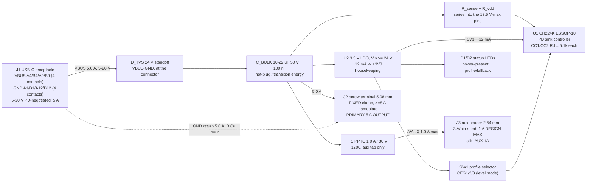

# Power architecture - pd-trigger

This board has no rail tree. It has a POWER PATH: USB-C VBUS in, the same
copper out to a screw terminal, at up to 5 A / 20 V / 100 W, plus one small
housekeeping consumer (the PD sink controller and its LEDs). Everything hard
about it is copper cross-section, contact resistance, and one question the P0
answers got wrong on the evidence: the PTC.

Headline conclusions, in order of how much they change the design:

1. **2 oz outer copper is required.** On 1 oz the pipeline's own IPC-2152
   model demands a **3.50 mm** trace for 5 A at dT 10 C. That is 14 % of the
   board's 25 mm height and it will not route on 40 x 25 mm. On 2 oz the same
   duty needs **1.75 mm**, which routes comfortably. See s4.
2. **The PTC (P0 answer 2b) should be dropped from the main path.** A PPTC
   that actually holds 5 A on a warm board is an 8 A part; every 8 A/30 V PPTC
   in the JLC catalog is a **24 mm x 25 mm radial disc** - larger than half
   this board - and its trip current (16 A) is a current no compliant PD
   source will ever deliver, so it cannot trip on any realistic fault. It is a
   large through-hole resistor that dissipates 0.13-0.75 W. See s5 for the
   full numbers and the two fallback options if a series element is mandated
   by policy rather than by physics.
3. **The controller needs a real 3.3 V housekeeping supply, not a dropper
   resistor**, because the input range is 4:1 (5-20 V). The CH224K's VDD
   absolute maximum is 3.6 V and its HV-capable pins are absolute-max 13.5 V -
   nothing on this chip may touch the 20 V rail directly. See s6.
4. **The aux 2.54 mm header must be a separate net** behind a small series
   element, not a tap off the 5 A net - otherwise the P8 current check demands
   the full 5 A width on the header stub as well. See s8.

## 1. Power path



Note what is NOT in that diagram: no series fuse or PTC in the 5 A path, no
load switch, no regulator between input and output. The output IS the input
copper. s5 defends the missing fuse; the load switch was already declined by
P0 answer 6 (indicate the fallback, do not block it).

## 2. Design current, per profile

P0 answer 1 is uniform 5 A at every profile, so there is exactly one number
to size for and it does not vary:

| Profile | V | I design | P | What actually limits it |
|---|---|---|---|---|
| 5 V | 5.0 | 5.0 A | 25 W | Source must advertise 5 V/5 A (rare; most offer 3 A) |
| 9 V | 9.0 | 5.0 A | 45 W | Source PDO |
| 12 V | 12.0 | 5.0 A | 60 W | Source PDO |
| 15 V | 15.0 | 5.0 A | 75 W | Source PDO |
| 20 V | 20.0 | 5.0 A | 100 W | Source PDO **and** an e-marked 5 A cable |

The board is built to pass 5 A whenever it is offered. It never asks for more
than the source advertises, and it has no way to exceed the source's PDO - the
CH224K requests a PDO, the source grants or refuses it. Copper, connectors and
the aux limit are all sized at 5 A regardless of profile, which is also the
conservative direction (5 A at 5 V is the same copper problem as 5 A at 20 V;
only the dielectric/creepage question scales with voltage, and at 20 V that
question is empty - see s9).

## 3. Where the current physically flows

- **In:** 4 paralleled VBUS contacts (A4, B4, A9, B9) and 4 paralleled GND
  contacts (A1, B1, A12, B12) in the USB-C receptacle. The USB Type-C spec
  applies its 5 A contact-current test to those four VBUS pins *collectively*,
  so all four must be bonded to the same copper on this board - do not route
  only one pair.
- **Across:** one wide F.Cu run (or an F.Cu pour) from the receptacle to the
  screw terminal, ~30 mm on a 40 x 25 mm outline.
- **Return:** the B.Cu GND pour. Not a trace - a plane.
- **Layer changes:** none, by directive. See s10 (the via rule makes any layer
  change on the 5 A net cost 10 vias).

## 4. IPC-2152 first pass - the copper-weight decision

Numbers below are produced by **the pipeline's own model**
(`scripts/check_current.py:required_width_mm`), i.e. these are literally the
widths `rules_gen` will write into the .kicad_dru at P5 and `check_current`
will enforce at P8, not a third-party calculator. Basis: IPC-2152 10 C chart
readings at 1 oz outer copper, converted to cross-section (so copper weight
scales the width inversely), with `dT != 10` scaled by `(10/dT)^0.44`.

Minimum trace width, mm, outer layer:

| I (A) | 1 oz dT 10 | 1 oz dT 20 | 1 oz dT 30 | 2 oz dT 10 | 2 oz dT 20 | 2 oz dT 30 |
|---|---|---|---|---|---|---|
| 0.1 | 0.050 | 0.037 | 0.031 | 0.025 | 0.018 | 0.015 |
| 1.0 | 0.500 | 0.369 | 0.308 | 0.250 | 0.184 | 0.154 |
| 2.0 | 1.100 | 0.785 | 0.640 | 0.550 | 0.392 | 0.320 |
| 3.0 | 1.800 | 1.248 | 1.010 | 0.900 | 0.624 | 0.505 |
| 4.0 | 2.650 | 1.764 | 1.427 | 1.325 | 0.882 | 0.713 |
| **5.0** | **3.500** | **2.383** | **1.871** | **1.750** | **1.191** | **0.935** |
| 6.0 | 4.500 | 3.009 | 2.395 | 2.250 | 1.505 | 1.198 |

For context, IPC-2221's older external-conductor formula gives 2.76 mm for the
same 5 A / dT 10 / 1 oz case. IPC-2152 is wider because its still-air external
data corrected IPC-2221's optimism there. The pipeline gates on the IPC-2152
number, so that is the number that matters.

### Verdict: 2 oz, dT 10 C, 1.75 mm

**2 oz IS required at this board size.** 3.50 mm of copper on a 25 mm-tall
board, dodging a USB-C receptacle (~9 x 7.3 mm), a 5.08 mm terminal block
(~10 x 10 mm), an ESSOP-10 and a selector, is not routable without turning the
entire top layer into one pour and giving up any placement freedom. 1.75 mm is
an ordinary power trace.

Could a pour carry it on 1 oz instead? Partly. `check_current` will accept a
pour that never necks below the requirement, but it *also* checks every
individual **track** segment on the net against the same 3.50 mm - so every
pad stub, every escape from the CH224K sense resistor, every branch to the aux
element would have to be 3.50 mm too. On 1 oz you are not choosing "pour
instead of trace", you are choosing "the whole 5 A net is one 3.5 mm-wide
object". That is why 2 oz wins.

Cost of the 2 oz choice, stated honestly:
- JLC supports it: `jlc_capabilities.yaml` has a `2layer_2oz` profile
  (min trace/clearance 0.1524 mm vs 0.127 mm at 1 oz). The board's finest
  feature is the ESSOP-10's 0.5 mm pitch, so the coarser 2 oz floor costs
  nothing here.
- Small per-order adder at qty 10; not a schedule or capability risk.
- **Pipeline gap:** `reference/stackups.yaml` has no 2-layer 2 oz entry (only
  `JLC2313_1.6` at 1 oz, which is `defaults: 2`). `board_init` writes the
  stackup from that file and `rules_gen` derives its capability key from the
  stackup's `copper_oz`, so unless P2 adds a 2 oz 2-layer stackup, the whole
  pipeline will silently size this board at 1 oz. **This is an action item for
  the architect, not a suggestion.** See s10.

If the architect refuses 2 oz, the only survivable 1 oz configuration is
`dt_c: 20` -> 2.383 mm, and the copper then sits ~20 C above a 40 C bench
ambient (60 C - warm to the touch on an open board). I do not recommend it,
but it is defensible and changes nothing else in this document except the
declared `dt_c` and the trace loss in s7.

Worth knowing, because it is counter-intuitive: **copper weight does not change
the I2R loss** at a fixed dT target. The IPC model sizes to a constant
cross-section, so 1 oz at 3.50 mm and 2 oz at 1.75 mm have the identical 4.89
mohm over 30 mm and dissipate the identical 0.122 W. Copper weight buys you
*board area*, not efficiency.

## 5. The PTC: what P0 answer 2 actually costs

P0 answered "resettable PTC, sized to hold at the committed current with
headroom and trip well above it". I was asked to check that with numbers.
It does not survive the check. Three facts, each independently sufficient:

### 5.1 A PPTC that holds 5 A on a real board is an 8 A part

PPTC hold current is specified at **23 C** and derates steeply with ambient.
From the Bourns MF-R series datasheet's thermal derating chart (Ihold / Itrip,
amps):

| Model | Ih 23 C | 40 C | 50 C | 60 C |
|---|---|---|---|---|
| MF-R500 | 5.00 | **4.15** | 3.85 | 3.40 |
| MF-R600 | 6.00 | **4.98** | 4.62 | 4.08 |
| MF-R700 | 7.00 | 5.81 | 5.39 | 4.76 |
| MF-R800 | 8.00 | 6.64 | 6.16 | 5.44 |

A "5 A" PPTC holds **4.15 A at 40 C** - it nuisance-trips at the design
current on any warm bench. A 6 A part holds 4.98 A at 40 C: still on the wrong
side. And the relevant ambient is not room air, it is the local board
temperature next to 5 A of copper and the part's own self-heating, so 40 C is
optimistic. **8 A hold is the honest minimum for a 5 A continuous commitment.**

### 5.2 Every 8 A / 30 V PPTC is bigger than half this board

JLC catalog, live query, all parts with Ih >= 8 A at 30 V - **every one is
radial through-hole ("Plugin"), 10.2 mm lead pitch**:

| LCSC | MPN | Ih/It | Ri min | R1 max | t-trip | Price | Stock |
|---|---|---|---|---|---|---|---|
| C369111 | JK30-800 | 8 A / 16 A | 5 mohm | 30 mohm | 18.8 s | $0.255 | 1024 |
| C469002 | RUEF800 | 8 A / 16 A | 5 mohm | 13 mohm | 18.8 s | $1.160 | 1207 |
| C970097 | R30-800 | 8 A / 16 A | 5 mohm | 20 mohm | 18.8 s | $0.311 | 325 |
| C208492 | MF-R800 | 8 A / 16 A | 5 mohm | 30 mohm | 18.8 s | $1.502 | 70 |

MF-R800 physical (datasheet dimension table): A (body width) **24.2 mm max**,
B (overall height incl. leads) **32.9 mm max**, C (lead pitch) 10.2 mm,
E (thickness) 3.0 mm - body roughly **24.2 x 25.3 x 3.0 mm**. On a 40 x 25 mm
board that is the full board height and 60 % of its length, in a through-hole
part that the economy PCBA tier will not place. Even the smaller MF-R500
(17.4 x 17.3 mm) - which cannot hold 5 A anyway - eats a quarter of the board.

There is one SMD candidate: **C48985873, LUTE 2920L600/30GR**, 6 A / 12 A at
30 V, 4-20 mohm, 7.98 x 5.44 x 1.6 mm, $0.348, 11975 in stock. It fits. But
it is a 6 A part, which by 5.1 holds ~5.0 A at 40 C - exactly the design
current, i.e. it will nuisance-trip. It is also a clone-numbered part from a
second-tier vendor whose derating data I have not verified. Not recommended
for a uniform-5 A commitment.

### 5.3 It cannot trip on any fault a compliant PD source can produce

This is the decisive one. An 8 A PPTC has **Itrip = 16 A** and a max
time-to-trip of **18.8 s at 16 A**. A USB PD source is required to implement
over-current protection and to survive a shorted output; a 20 V/5 A source
current-limits somewhere just above 5 A and then hard-resets VBUS to vSafe5V
in milliseconds. **The source folds back at ~5-6 A. The PPTC needs 16 A for
tens of seconds. The two windows do not overlap.** On a shorted screw terminal
the sequence is: source current-limits -> source hard-resets -> output dead.
The PPTC contributes nothing but its own resistance during that event.

The only fault where a series PPTC would act is energy pushed *backwards* into
the output terminal from an external supply - which is not the stated use, and
which a 40 A-rated PPTC would not survive protecting anyway.

### 5.4 What it costs to keep it

| | 8 A radial PPTC (MF-R800 class) | 6 A SMD (2920) | None |
|---|---|---|---|
| Fits 40 x 25 mm | No (24 x 25 mm body) | Yes | Yes |
| Assembly | Through-hole, hand/wave | SMT, economy tier | - |
| R at 5 A | 5 mohm new .. 30 mohm after trips | 4 .. 20 mohm | 0 |
| Dissipation at 5 A | **0.125 .. 0.75 W** | 0.10 .. 0.50 W | 0 |
| Drop at 5 A | 25 .. 150 mV | 20 .. 100 mV | 0 |
| Nuisance-trips at 5 A / 40 C | No (holds 6.64 A) | **Yes (holds ~5.0 A)** | - |
| Trips on a real fault | **No** (needs 16 A) | No (needs 12 A) | - |
| Cost | $0.26 - $1.50 | $0.35 | $0 |

Note R1max: PPTC resistance is *specified after a trip* (1 hour), and it
ratchets up over the device's life. The 0.75 W figure is not a strawman, it is
the datasheet's own end-of-life bound.

### 5.5 Recommendation

**Drop the series PPTC from the 5 A path.** Protection for this board is:
the source's mandatory OCP (which is the only thing fast enough to matter),
the TVS for transients, and copper sized with margin. That is what a bench PD
trigger legitimately is.

**Put the resettable element where it can actually act: on the aux header.**
A 1.0 A / 30 V 1206 PPTC (e.g. C5358568 BSMD1206-100-30V, Ih 1 A, It 1.8 A,
50-300 mohm, 3.6 x 1.9 x 1.4 mm, $0.099, 134 k in stock) sits on a tap whose
trip current the source *can* reach, protects 2.54 mm pins that are only rated
3 A each, and makes the "low-current aux" promise physically true instead of
just silkscreened. That honours the intent behind P0 answer 2 at 1/10th the
size and with a fault window that exists.

**If a series element in the main path is mandated by policy anyway**, take
the 8 A radial (JK30-800, C369111 - cheapest with real stock), accept the
board growing to roughly 50 x 28 mm (still inside P0 answer 5's ~20 % soft
allowance only if measured generously - flag it), accept through-hole
assembly, and add the s7 thermal entry for it. Do not take the 6 A SMD part:
a protection device that trips at the rated operating current is worse than no
protection device, because it turns a working board into an intermittent one.

**This is a request for the architect to revisit P0 answer 2 with these
numbers.** It is the one place where the P0 defaults, which were otherwise
sound, chose an element that physics will not deliver at this current.

## 6. The controller's own supply

CH224-class parts are described as "self-powered from VBUS". For the CH224K
specifically that is only half true, and the half that is false has killed
boards. From the WCH CH224 datasheet v1F:

- **Pin 1 VDD:** "Operating power input. An external 1uF decoupling capacitor
  is required. **Connected in series with a resistor to VBUS.**"
- **Pin 8 VBUS:** "Voltage detection input. It is required to be connected in
  series with a resistor to external input VBUS."
- **Absolute maximum, CH224K:** VDD **3.0 - 3.6 V**; VIOHV (the HV-tolerant
  CFG and VBUS pins) **-0.5 to 13.5 V**; VIOCC (CC1/CC2/CFG1) -0.5 to 8 V;
  total chip power 400 mW; TA -40 to +90 C.

So VDD is a **3.3 V input behind an internal clamp**, not a high-voltage LDO
input, and **no CH224K pin may be tied to a 20 V rail** - even the "high
voltage" pins stop at 13.5 V. Every connection from the power path to this chip
goes through a series resistor into an internal clamp. (Contrast CH224D, which
does have a genuine 24 V-rated VBUS pin plus GATE/DRV/ISP/ISN for an external
NMOS - a different part for a different job.)

Two patterns are therefore available. The exact resistor values and the
chip's VDD current belong to the datasheet-extract sibling; the architecture
consequence does not:

**Pattern A - dropper resistor into the internal clamp** (what the datasheet
pin description literally says). One resistor + 1 uF. The problem is this
board's 4:1 input range: one resistor must simultaneously (a) pass enough
current to run the chip at the **5 V** profile and (b) not cook at the **20 V**
profile. A published CH224 trigger board used 510 ohm; at 5 V that is 3.3 mA,
at 20 V it is 32.7 mA and **0.55 W in the resistor** - and that board's
reviewer reported the chip destroyed by electrical over-stress during a 20 V
load test. If the chip's VDD demand is ~1 mA, a ~3.3 kohm resistor spans the
range (0.5 mA at 5 V, 5 mA and 84 mW at 20 V). If it is 5 mA or more, no
single resistor works and Pattern A fails.

**Pattern B - a real 3.3 V housekeeping rail** from a small LDO with >= 24 V
input rating, feeding VDD, the CFG level references and the status LEDs.
One extra part. It is unconditionally correct across 5-20 V, and it also
solves a problem Pattern A does not touch (see below).

**Recommended: Pattern B.** Not because Pattern A cannot be made to work, but
because the LEDs force the issue. An LED fed from VOUT through one resistor
varies 4:1 in current across the profile range: size it for 2 mA at 5 V and it
draws ~8 mA at 20 V with 144 mW in the resistor; size it for 20 V and it is
invisible at 5 V. Since P0 answer 6 requires a *visible* profile/fallback
indication, the LEDs are functional, not decorative, and they need a stable
rail. One LDO fixes VDD, the CFG references and both LEDs at once.

`+3V3` budget (Pattern B), all estimates pending the datasheet extract:

| Consumer | Budget | Basis |
|---|---|---|
| U1 CH224K VDD | 5 mA | placeholder; datasheet v1F publishes no IDD table, only the 400 mW chip max. **Verify at datasheet-extract.** |
| D1 power-present LED | 3 mA | (3.3 - 2.0) / 430 ohm |
| D2 profile / fallback LED | 3 mA | same; may be driven by the PG open-drain pin (pin 10, active low) |
| CFG pull-ups / selector | 1 mA | level-config mode, CFG tied to VDD or GND through the selector |
| **Total** | **12 mA** | declared `current_a` 0.05 A (4x headroom, still a rounding-error width) |

LDO dissipation: (20 - 3.3) x 12 mA = **0.200 W** at the 20 V profile, 0.020 W
at 5 V. Under the 0.5 W flag, but in a SOT-23-5 it is the second-largest heat
source on the board - it gets a thermal entry (s7).

## 7. Dissipation at 100 W throughput

| Element | P at 5 A | Basis | Thermal entry? |
|---|---|---|---|
| USB-C receptacle, 4 VBUS contacts | 0.062 - 0.250 W | USB Type-C spec: **40 mohm max initial** per contact, +10 mohm max delta after environmental stress; 4 in parallel = 10 mohm worst case, ~2.5 mohm at a realistic 10 mohm/contact | **Yes** (combined with GND below) |
| USB-C receptacle, 4 GND contacts | 0.062 - 0.250 W | same, return side | included above |
| F.Cu run, ~30 mm at the s4 width | **0.122 W** | 2 oz = 0.285 mohm/sq at 60 C, 17.1 squares = 4.89 mohm. Identical on 1 oz at 3.50 mm (same cross-section) | No |
| B.Cu GND pour return | < 0.05 W | plane, not a trace; 1-2 mohm end to end | No |
| Screw terminal (J2), both poles | 0.05 - 0.50 W | this class of block specs contact resistance <= 20 mohm as a *test ceiling*; real clamped-wire contacts are 2-5 mohm. Wide band, honestly stated | No (but see below) |
| U2 housekeeping LDO | 0.200 W | (20 - 3.3) x 12 mA | **Yes** |
| Aux PPTC (1 A part), at 0.5 A aux load | 0.025 W | 0.5^2 x 100 mohm | No |
| *Series PPTC in main path, IF fitted* | *0.125 - 0.750 W* | *5 mohm new .. 30 mohm at R1max* | ***Yes, if fitted*** |
| **Board total, recommended architecture** | **~0.5 W typ, ~1.1 W worst** | 0.5-1.1 % of 100 W | |

Nothing here is a die-temperature problem. The two entries that earn a
`thermal` constraint do so for different reasons:

- **J1 (USB-C receptacle), 0.5 W into GND.** At the spec's 40 mohm ceiling the
  mated connector is the single largest loss on the board. This is *contact*
  heat, not die heat, so `check_thermal`'s copper-area model is being used
  slightly off-label - but the heat genuinely leaves through the pads into the
  pour, so the check ("is there enough copper around this part") asks the
  right question. 0.5 W is a deliberate worst-case bound; typical is ~0.19 W.
- **U2 (LDO), 0.2 W into GND.** In SOT-23-5 with a modest pour, the pipeline's
  own model (`theta_JA = 55 + 119 exp(-A/350)` for 1 oz / 2-layer) gives ~144
  C/W at 100 mm2 -> ~29 C rise. Comfortably inside the 40 C default, but close
  enough that it should be *checked* rather than assumed, especially if the
  architect crowds the LDO into a corner.

The screw terminal is deliberately NOT given a thermal entry: its resistance
band is dominated by how well the user tightens the screw, which no copper
check can influence. It is called out here so the architect chooses a **fixed
screw terminal (KF128 / DG128 class, direct wire clamp)** rather than a
pluggable plug+header pair (2EDG class) - the pluggable version inserts an
extra mated contact interface into a 5 A path for no benefit on a bench tool.
Catalog check: `KF128-5.08-2P-AA` (C474952) is rated **24 A / 250 V** at
5.08 mm pitch, $0.19, 28 k in stock - far above P0 answer 3's >= 8 A
requirement and it accepts 18 AWG comfortably.

## 8. Output connectors and the aux limit

**J2, screw terminal - the only full-current output.** 5.08 mm pitch, fixed
clamp, nameplate >= 8 A (24 A parts are the same price), 18 AWG capable per P0
answer 3. Both poles carry 5 A; keep the V+ pad on the same F.Cu copper as the
receptacle with no neckdown, and give the GND pad >= 10 vias into the B.Cu
pour (s10).

**J3, aux 2.54 mm header - low-current only, and made physically true.**
2.54 mm headers in the JLC catalog are rated **3 A per pin**. P0 answer 4
says low-current tap, silk-marked, no paralleled power pins. Concretely:

1. **Separate net.** The aux tap is `/VAUX`, not the 5 A net, separated by the
   1 A PPTC of s5.5 (or, minimally, a 0 ohm 1206 jumper). This is not
   cosmetic: `check_current` applies a net's declared current to *every* track
   segment on it, so an aux stub sharing the 5 A net would be required to be
   1.75 mm wide all the way onto the header pin. A separate net with its own
   1 A entry is the schema's documented pattern for exactly this.
2. **One pin per net.** V+ on one pin, GND on one pin. Do not parallel pins -
   paralleling is what would make a 5 A rating look plausible, which is
   precisely the misreading P0 answer 4 exists to prevent.
3. **Silk: `AUX 1A MAX`** adjacent to the header, plus per-pin `V+` / `GND`.
   The silk is the user-facing half of the limit; the PPTC is the half that
   works when the silk is ignored.
4. **Physical separation** from J2 so a 5 A load cannot be plugged onto the
   aux header by muscle memory.

Design cap: **1.0 A** (one third of the pin rating, and the PPTC trips at
1.8 A). Drop across the aux PPTC at 0.5 A is ~50 mV - irrelevant for probing
or accessory logic, which is what this tap is for.

## 9. Voltage / spacing (the empty question)

Max potential anywhere on this board is **20 V** (VBUS/VOUT to GND at the 20 V
PDO, ~21 V allowing PDO tolerance). `check_creepage` implements IPC-2221
Table 6-1 and only regulates net pairs **more than 30 V apart**, so at 20 V
**no clearance requirement fires** - the fab-floor 0.1524 mm clearance governs
everywhere. The `voltages` entries below are emitted as documentation of the
rail level (and so the check is exercised rather than silently absent), not
because they will produce a rule.

The 20 V level does have two non-spacing consequences worth carrying forward
to part selection:

- **MLCC voltage rating: use 50 V, not 25 V.** X7R/X5R lose most of their
  capacitance at DC bias near their rating; a 25 V part at 20 V is both
  electrically marginal and capacitively a fraction of its marking. The TVS
  clamp voltage (a 24 V-standoff part clamps in the high 30s under surge) also
  argues for 50 V.
- **TVS standoff must exceed ~21 V** so it does not conduct at the 20 V
  profile, and its clamping voltage sets what the downstream caps and the
  user's load see. Part choice belongs to the component scout; the constraint
  (standoff > 21 V, unidirectional, on VBUS at the connector) belongs here.

Bulk capacitance: keep total VBUS/VOUT bypass to **10-22 uF + 100 nF**. USB PD
allows a sink up to cSnkBulkPd (100 uF) after an explicit contract but requires
surge-current limiting beyond it, and PD sources limit their own VBUS positive
slew to vSrcSlewPos = 30 mV/us during transitions - which is what bounds the
inrush when the contract steps 5 V -> 20 V. At 22 uF that is ~0.7 A of
charging current, invisible next to a 5 A budget. This board cannot police
what the *user's load* hangs on the screw terminal; that is the load's
compliance problem, and worth one line in the board's silk or docs.

## 10. Constraints emitted, and the pipeline interactions they cause

Mirrors `power.json`. **Net names below are conventional, not final** - the
architect must re-key every entry to the P4 netlist's actual names before these
land in `constraints.json`, and must re-key or delete every `thermal` `ref`
(`check_thermal` raises a hard error, exit 2, if a named refdes has no pads on
the board).

```json
"power": [
  {"net": "VBUS",  "current_a": 5.0,  "dt_c": 10, "via_amps": 0.5},
  {"net": "/VAUX", "current_a": 1.0,  "dt_c": 10, "via_amps": 0.5, "pdn": false},
  {"net": "+3V3",  "current_a": 0.05, "dt_c": 10, "via_amps": 0.5}
],
"voltages": [
  {"net": "VBUS", "voltage": 20},
  {"net": "/VAUX", "voltage": 20},
  {"net": "+3V3", "voltage": 3.3},
  {"net": "GND", "voltage": 0}
],
"thermal": [
  {"ref": "J1", "power_w": 0.5, "net": "GND", "dt_c": 40},
  {"ref": "U2", "power_w": 0.2, "net": "GND", "dt_c": 40}
]
```

Deltas the architect applies if they override my recommendations:

- **Series PPTC kept in the main path (P0 answer 2 as written):** the 5 A net
  splits in two. Duplicate the VBUS entry as `VOUT` with identical numbers,
  and add `{"ref": "F1", "power_w": 0.75, "net": "VOUT", "dt_c": 40}`.
- **Pattern A (dropper resistor) instead of an LDO:** delete the `+3V3` power
  entry and the `U2` thermal entry; the dropper resistor becomes a ~0.1-0.2 W
  element with no copper-area story, so give it a `power_w` entry only if the
  chosen value exceeds 0.25 W (in which case reconsider Pattern B).
- **1 oz copper instead of 2 oz:** change every `dt_c` to 20. Do not leave it
  at 10, or P5 will write a 3.50 mm minimum-width rule that P7 cannot satisfy.

### Interactions the architect must plan around

1. **The 2 oz stackup does not exist yet.** `stackups.yaml` `defaults: {2:
   JLC2313_1.6}` is 1 oz. `rules_gen` takes its copper thickness from the
   capability profile keyed off the stackup's `copper_oz`, and `check_current`
   takes it from the `(stackup)` block `board_init` wrote. Both read the same
   source, so a missing 2 oz entry silently sizes the whole board at 1 oz and
   the P8 gate will then demand 3.50 mm. **Add a 2-layer 2 oz stackup entry
   (F.Cu/B.Cu thickness 0.070, copper_oz 2.0) and pass it to `board_init
   --stackup`.** `jlc_capabilities.yaml` already has the matching
   `2layer_2oz` profile, so only the stackups side is missing.
2. **One "Power" netclass, sized to the widest net.** `rules_gen.net_classes`
   creates a single `Power` class whose `track_width` is the max across all
   declared power nets (1.75 mm here) and patterns *every* power net into it.
   So `/VAUX` and `+3V3` will default-route at 1.75 mm too. Per-net DRC
   minimums are still correct (`aiee_pwr_width_<net>` is emitted per net); this
   is a routing-default annoyance, not a violation. On a 40 x 25 mm board it
   is worth a P5 hand-edit of the class or accepting fat stubs.
3. **Any via on the 5 A net costs 10 vias.** `check_current` requires
   `ceil(I / via_amps)` vias per via cluster: 5.0 / 0.5 = **10**. Hence the
   directive in s3 - **keep the entire 5 A path on F.Cu, no layer changes.**
   With zero vias on the net the check has nothing to fail. If the architect
   must cross, budget a 10-via field (or raise `via_amps`, which I do not
   recommend - 0.5 A/via is the spec's number).
4. **GND is deliberately NOT in `power`.** It carries the same 5 A return, but
   `check_current` checks *every track segment* on a declared net, and a
   2-layer board accumulates short thin GND stubs (TVS return, decoupling,
   test points) that would each become an error with no way to except them
   short of coordinate-keyed `overrides` that do not exist until P7. Instead,
   the requirement is structural and belongs in `planes`/placement: **a
   continuous B.Cu GND pour under the entire power path, unslotted, with >= 10
   vias at each of J1's and J2's GND pads.** If the architect wants the pour
   *neck* check specifically, they can add GND with `current_a: 5.0` after
   routing and hand-clear the stub violations - a deliberate, informed choice,
   not the default.
5. **`pdn: false` on `/VAUX`** because nothing decouples it by design - it is a
   width-ruled stub to a header. `VBUS` and `+3V3` both carry real bulk
   capacitance, so `check_pdn` is satisfied on both (it errors on a declared
   rail with no associated caps at all).

## 11. Assumptions

1. **CH224K VDD current = 5 mA (placeholder).** Datasheet v1F publishes no IDD
   table, only the 400 mW total-chip maximum. The `+3V3` budget and the entire
   Pattern A / Pattern B argument in s6 hinge on it. **Must be resolved by the
   datasheet-extract sibling.** If it is <= 1 mA, Pattern A becomes viable and
   the LDO is optional (the LED argument still favours the LDO).
2. **Power path length ~30 mm.** Estimated from a 40 x 25 mm outline with the
   receptacle and terminal on opposite short edges. The trace loss scales
   linearly; at 45 mm it is 0.18 W instead of 0.122 W. No conclusion moves.
3. **Bench ambient 40 C** for PPTC derating (requirements s4 assumed 0-40 C
   indoor lab). At 25 C an MF-R600 would hold ~5.6 A and the 6 A part would be
   arguable - but the local ambient beside 5 A of copper is not room air, so
   40 C is the right design point, not a pessimistic one.
4. **Two status LEDs at 3 mA each.** P0 answer 6 requires visible fallback
   indication; the exact scheme (PG pin, comparator, bicolour LED) is the
   schematic's call and does not change the rail budget materially.
5. **Contact resistances are spec ceilings, not measurements.** 40 mohm for
   USB-C is the spec's initial maximum; real connectors measure 10-20 mohm.
   The s7 dissipation table gives both ends of the band and the thermal entry
   uses the pessimistic one.
6. **Screw terminal contact resistance <= 20 mohm** is the class's typical
   published test ceiling, not a figure from a specific datasheet - the chosen
   part's own number should be checked at P3. It does not change any
   constraint, only the s7 total.

## 12. Sources

- **IPC-2152 widths**: computed with this repo's `check_current.required_width_mm`
  (`.claude/skills/ai-ee/scripts/check_current.py`) - IPC-2152 10 C chart
  interpolation at 1 oz outer, cross-section scaling for copper weight,
  `(10/dT)^0.44` temperature scaling. IPC-2221 cross-check computed from
  `I = k dT^0.44 A^0.725`, k = 0.048 external.
- **Bourns MF-R series PPTC datasheet** (radial leaded, 30 V family):
  electrical characteristics table (Ihold/Itrip/Vmax/Imax/Rmin/R1max/time-to-
  trip), product dimensions table (A/B/C/D/E per model), and the Thermal
  Derating Chart (Ihold/Itrip at -40/-20/0/23/40/50/60/70/85 C).
  https://datasheet.octopart.com/MF-R025-Bourns-datasheet-506605.pdf
- **JLCPCB / LCSC live catalog** via `scripts/parts_search.py` (2026-07-28):
  PPTC candidates at 30 V (C369111 JK30-800, C469002 RUEF800, C970097 R30-800,
  C208492 MF-R800, C48985873 2920L600/30GR, C5358568 BSMD1206-100-30V);
  terminal blocks (C474952 KF128-5.08-2P-AA, 24 A/250 V; C8445
  WJ2EDGVC-5.08-02P, 10 A); 2.54 mm headers rated 3 A/pin.
- **WCH CH224 datasheet v1F** (CH221K/CH224K/CH224D): s4.3 CH224K pin
  description (VDD "operating power input ... connected in series with a
  resistor to VBUS", 1 uF required; VBUS pin 8 voltage detection, series
  resistor required; PG pin 10 open-drain active low); s5.2 resistance and
  level configuration tables; s7.2 CH224K absolute maximum ratings (VDD
  3.0-3.6 V, VIOHV 13.5 V, VIOCC 8 V, PD 400 mW, TA -40..90 C); s6 reference
  schematics (CC1/CC2 5.1 kohm to GND, 1 uF on VDD).
  https://www.laskakit.cz/user/related_files/ch224ds1.pdf
- **CH224 trigger board field report** (510 ohm VDD dropper, added LM78L05,
  chip destroyed by over-stress during 20 V load test):
  https://www.beyondlogic.org/review-usb-c-power-delivery-trigger-board-ch224/
- **USB Type-C Cable and Connector Specification**: VBUS/GND low-level contact
  resistance 40 mohm max initial, +10 mohm max delta after environmental
  stress; the 5 A contact-current rating test applies collectively to A4, B4,
  A9, B9. https://www.usb.org/sites/default/files/USB%20Type-C%20Spec%20R2.0%20-%20August%202019.pdf
- **USB Power Delivery / USB-C Source Power Test Specification**: sources shall
  implement over-current protection; VBUS positive slew limited to
  vSrcSlewPos = 30 mV/us; sink bulk capacitance cSnkBulkPd = 100 uF max before
  surge-current limiting is required.
  https://www.usb.org/sites/default/files/USB-C%20Source%20Power%20Test%20Specification%202021%2005%2024.pdf
- **IPC-2221 Table 6-1** clearance bands as implemented in
  `scripts/check_creepage.py` (>30 V threshold; nothing on this board reaches
  it).
- Pipeline interaction claims verified by reading `rules_gen.py`
  (`power_rules`, `net_classes`, `capability_class`, `build`),
  `check_current.py` (segment/pour/via checks), `check_pdn.py`,
  `check_thermal.py` (`part_region` hard-errors on an unknown refdes),
  `board_init.py` (`--stackup`), `reference/stackups.yaml` and
  `reference/jlc_capabilities.yaml`.
