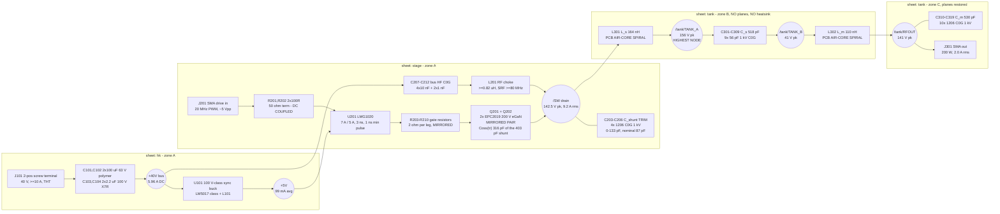

# rf-de-20m - block diagram, block notes, and the four P2 rulings

**AMENDED 2026-08-07 (P2-A) after the orchestrator read the EPC2019 datasheet
(rev (c)2021) directly. See s0 for the retraction and what changed.**

20 MHz single-ended Class E GaN power stage, 200 W into 50 ohm, 40 V bus.
100% JLCPCB PCBA, 4-layer, single-sided (top) assembly, bottom-side heatsink +
forced air, continuous duty. Power stage only.

Lead parts are named by **MPN or part-class only**. LCSC codes are P3's job.

---

## 0. AMENDMENT P2-A - retraction, and two further errors found

### 0.1 What was retracted

The P1 `research/power.json` fragment supplied **Coss(er) 156 pF** and
**Rds(on) 22 typ / 42 max mohm** for the EPC2019. **Both are retracted.** The
datasheet publishes **no Coss(er), no Coss(tr) and no Eoss anywhere**, so the
156 pF was invented, and the original RULING 2 conclusion - *"2 x Coss(er) =
312 pF lands almost exactly on the required 317 pF, so the external shunt cap
disappears"* - rested on a number with no source.

**AUTHORITATIVE EPC2019 VALUES (datasheet rev (c)2021, printed tables):**

| Parameter | typ | max | Note |
|---|---|---|---|
| Rds(on) | **36 mohm** | **50 mohm** | at 25 C; ~1.8x hot -> **65 / 90 mohm at 125 C** |
| Coss @ VGS 0, VDS 100 V | 110 pF | 150 pF | small-signal, at 100 V only |
| **Qoss @ VDS 100 V** | **18 nC** | **23 nC** | the only charge datum published |
| Qg | 1.8 nC | 2.5 nC | **lower** than the retracted 2.4/2.9 |
| Ciss / Crss | 200 / 0.7 pF | 270 / 1 pF | |
| VGS abs max | +6 / -4 V | | 1 V of headroom at 5 V drive |
| RthJC / RthJB / RthJA | 2.7 / **7.5** / 72 C/W | | unchanged - these were right |
| ID | 8.5 A cont (Ta 25 C) | 42 A pulsed | |

### 0.2 The orchestrator's fix is right in method and wrong in two numbers

**Endorsed: the charge-equivalent capacitance is the correct basis for Class E,
and `Qoss/V` is how to get it.** The reasoning is sound and worth stating,
because the wrong choice here is a common error:

- The Class E drain waveform is produced by **integrating current into charge**:
  `v(t) = V(Q(t))` where `Q(t) = integral of i dt`. The design equations solve a
  charge-balance/timing problem, not an energy problem.
- Therefore the linear capacitance that reproduces the behaviour is the one with
  the **same charge at the same voltage**: `Coss(tr) = Qoss(V)/V`.
- **Coss(er) = 2.Eoss/V^2 is the WRONG choice here.** It is the right equivalent
  for *hard-switching turn-on loss*, where the question is how much energy is
  dumped. It is systematically **lower** than Coss(tr) (this part: ~119 pF vs
  ~158 pF, a 25% error) and using it would have under-sized the shunt.
- The **small-signal 110 pF is also wrong**, and by more: it is quoted at
  VDS = 100 V, where Coss has already fallen. Consistency check: a constant
  110 pF over 0-100 V would give Qoss = 11 nC; the datasheet says 18 nC, so the
  **average capacitance over 0-100 V is 1.64x the 100 V small-signal value.**
  The two published numbers are self-consistent and confirm the nonlinearity.

**ERROR 1 - the 180 pF is evaluated over the wrong voltage range.**
`Qoss/V = 18 nC/100 V = 180 pF` is the average over **0 -> 100 V**. This board's
drain swings **0 -> 142.5 V**, and Coss keeps falling above 100 V, so the average
over the real swing is **lower**. Two independent extrapolations agree:

| Method | typ | max |
|---|---|---|
| Power-law fit `C = A.V^-m`, anchored on Coss(100 V) **and** Qoss(100 V) (m = 0.389 typ / 0.348 max) | 156.8 pF | 203.3 pF |
| Bound: assume Coss stays **flat** at its 100 V value above 100 V | 159.1 pF | 206.1 pF |

**They agree to 1.5%, so the number is solid: Coss(tr) = 158 pF typ / 205 pF max
per FET over a 0 -> 142.5 V swing.** A pair supplies **316 pF typ / 410 pF max**,
not 360 pF.

**ERROR 2 - and this is the bigger one: the required C_shunt was computed with
the wrong Sokal coefficient.** The `1/(omega.R.5.4466) = 0.1836/(omega.R)` form
is the **Q_L -> infinity** constant, which EPC's own AN021 uses. **This board runs
Q_L = 5**, and `research/refdesign-classE-stage.json` D9 already supplied the
finite-Q_L coefficients and stated explicitly that the Q_L-independent ones are
superseded. Verified against Sokal's published continuous-function fits:

| Coefficient | Sokal fit at Q_L = 5 | P1 fragment | Agreement |
|---|---|---|---|
| `P.R/Vdd^2` | **0.51663** | 0.51659 | **0.008%** |
| `C_shunt.omega.R` | **0.20935** | 0.20907 | **0.13%** |
| `C_series.omega.R` | **0.26906** | 0.63467 | **2.4x apart - the fragment is wrong** |

Two of the three cross-check to within 0.13%, which validates both the fragment
and the formulas. **The consequence is that the frozen operating point itself was
computed with Q_L -> infinity constants on a Q_L = 5 design:**

```
R_opt   = 0.51659 x Vdd^2 / P  =  4.133 ohm     (frozen brief said 4.614, using 0.5768)
C_shunt = 0.20907 / (omega.R)  =  403 pF        (frozen brief said 317, using 0.1836)
```

### 0.3 Net result: the 40 V bus is preserved and the design gains real margin

| | Frozen (Q_L->inf) | Orchestrator's fix | **P2-A (this amendment)** |
|---|---|---|---|
| Vdd | 40 V | 37.5 V | **40 V - frozen input preserved** |
| R_opt | 4.614 ohm | 4.06 ohm | **4.13 ohm** |
| C_shunt required | 317 pF | 360 pF | **403 pF** (+38-46 pF if the finite-choke term applies) |
| Coss(tr) per FET | (invented 156) | 180 pF | **158 pF typ / 205 pF max** |
| Pair supplies | 312 pF | 360 pF | **316 pF typ / 410 pF max** |
| External C0G trim | 5 pF (i.e. none) | 0 pF (i.e. none) | **87 pF typ, and 0-133 pF of range** |

**The two errors pull in opposite directions from the orchestrator's derivation
and the second one dominates**: the required shunt is 12% larger than he computed
*and* the device supplies 12% less. **Two FETs now fit at 40 V with 87 pF of
external C0G to spare, so the bus voltage does not need to change.**

**Why the external fraction matters more than "elegance".** The original ruling
treated "the external shunt capacitor disappears" as a feature. **It is a defect.**
Coss spread on this part is 110-150 pF (+36%), and **the external cap is the only
mechanism that can absorb it**: if the device supplies 100% of C_shunt, a
max-Coss part is unfixable without reworking the tank. At 87 pF external (22% of
the shunt) a max-Coss pair is absorbed by depopulating the trim bank. **Getting
the external cap back is the most valuable outcome of this amendment.**

### 0.4 Correction to my own reasoning: the "k = 2 is exactly the ZVS ceiling" argument is retracted

The original RULING 1 argued that `Coss(er) <= C_shunt` capped the die-area factor
at exactly 2.03, so k = 2 was simultaneously the ZVS ceiling and the thermal
optimum. With the corrected numbers the ceiling is **403/158 = 2.55**, so three
FETs are *not* forbidden outright - they would need R lowered to ~3.5 ohm and
Vdd to ~37 V. **k = 2 survives, but now on a quantitative loss argument instead**
(s4.1), which is the stronger ground anyway.

### 0.5 Everything else is unchanged

Two paralleled EPC2019, PCB spiral magnetics, the two-zone floorplan, the relaxed
controlled-Z output trace, 100 x 80 mm with pre-authorised growth to 120 x 80,
unipolar 0/+5 V DC-coupled drive, and no protection parts all stand.

**BOM note, recorded not acted on: EPC2019 is currently OUT OF STOCK at LCSC
(stock 0, price moved $2.17 -> $3.93).** The owner approved continuing the design
and holding the order; P10 re-verifies stock.

---

## 1. Block diagram - signal AND power flow



`GND` is the return for every block and is omitted for legibility. It is an
In1.Cu + In2.Cu + B.Cu plane stack **over the heatsink and output zones only** -
`stackup.md` s3.

---

## 2. Block notes

### B1 - DC bus entry and bulk (sheet `hk`)

40 V, **5.96 A nominal / 6.45 A worst**. Lead parts by class: a **2-position
5.08 mm screw terminal, >= 24 A / 250 V** (KF128-5.08-2P class - the only THT part
on the board), **2 x 100 uF / 63 V SMD polymer can**, and **2 x 2.2 uF / 100 V
X7R 0805** as the mid-frequency tier.

Every part on `+40V` must be rated **>= 63 V**: connecting a live bench supply into
220 uF through ~1 uH of cable inductance rings the bus to **~51 V**. More bulk
*reduces* that overshoot - do not shrink the bulk to control inrush.

X7R is correct in this tier and nowhere else. It sets no resonance here, so its
~50% DC-bias derating at 40 V costs only capacitance. The no-X7R rule belongs to
the tank.

### B2 - +5 V housekeeping (sheet `hk`)

**LM5017-class 100 V synchronous constant-on-time buck**, Vin 40 V nominal /
>= 63 V abs max, Vout 5.0 V +/-4%, Iout >= 0.3 A. COT means no compensation
network; synchronous means no catch diode.

Not an LDO: 40 -> 5 V at ~100 mA burns 3.5 W for a 0.5 W load.

**Rail budget 0.3 A against a 99 mA average, i.e. 3.0x headroom** - and the real
Qg of 1.8 nC (not the retracted 2.4 nC) *improved* this: gate charge for the pair
is **72 mA typ / 100 mA max**, plus 27 mA of LMG1020 internal current and 0.1 mA
quiescent. The rail is **low-average / high-peak**; the binding spec is loop
inductance, not capacitance - s3.

Place at the DC-input end, as far from the gate loop and the tank as zone A allows.
Switching noise sits at 0.5-2 MHz, spectrally clear of 20 MHz.

### B3 - RF drive input (sheet `stage`)

**SMD edge-launch SMA, 50 ohm** (BWSMA-KE-P001 class). Genuine SMD, not a
through-hole bulkhead jack - a THT jack solders through to the bottom face and
breaks the flat heatsink land.

Termination is **2 x 100 ohm in parallel, 0805**. ~5 Vpp square into 50 ohm is
0.125 W - over a 0603's rating, in a 100 C-class local environment.

**The input must be DC-coupled.** A ruling, not a preference. AC coupling's DC
restore pins the waveform's *average* at the bias point, so changing duty changes
both logic levels: at D = 0.4 with a 2.5 V bias the waveform sits at
+5.5 V / +0.5 V, **both above the ~1.4 V threshold, and the FETs never turn off.**
Duty is the primary Class E tuning knob - and after this amendment it is also the
**primary ZVS trim** (s4.2), which makes protecting it more important, not less.
Consequence: the generator must output **unipolar 0 to +5 V**. `IN-` ties to GND.
No buffer (owner ruling, P0 Q12).

### B4 - Gate driver (sheet `stage`)

**LMG1020YFFR**, 5 V, 7 A source / 5 A sink, 3 ns propagation, 1 ns minimum pulse,
60 MHz, 0.8 x 1.2 mm 6-ball WCSP. LCSC brands it "Tokmas", not TI - **authenticity
check on receipt.**

Bypass per TI: **100 nF 0402 X7R plus 10 nF 0201 C0G straddling the VDD ball at
< 0.5 mm, with a via-in-pad ground return.**

**Gate resistors: 2 ohm minimum per leg (TI floor), one leg per FET per polarity** -
four legs (OUTH->Q201, OUTH->Q202, OUTL->Q201, OUTL->Q202). Splitting OUTH/OUTL
preserves a fast turn-off, and **an individual resistor per FET is what damps the
differential mode between the two gate loops**; a shared resistor leaves the gates
coupled through the driver output and free to oscillate against each other.

Each leg is **2 x 4.0 ohm 0603 in parallel**. With the real Qg of 1.8 nC the pair's
total gate-loop energy is **0.36 W** (was 0.58 W on the retracted figure), so each
leg dissipates ~0.059 W and each 0603 sees **0.029 W** - comfortable even derated
at 100 C. The parallel pair also **roughly halves the leg's parasitic inductance**,
which matters more after the amendment (s3).

The refdesign fragment's "OUTH/OUTL may be shorted to a single shared resistor"
applies to a **one-FET** stage and is superseded here.

### B5 - The GaN switch: TWO EPC2019 in a mirrored pair (sheet `stage`)

**Q201 + Q202, 2 x EPC2019** (200 V; 36 mohm typ / 50 mohm max; Coss(tr) 158 pF
typ / 205 pF max over the real swing; 2.77 x 0.95 mm solder-bar die,
bottom-cooled). The full argument is s4.1; **the real datasheet makes this ruling
stronger, not weaker.**

Layout is not a detail - it is the part of the decision that cannot be retrofitted:

- **Mirror symmetry about a centre axis.** Both dies are mirror images; U201 sits
  **on** the axis; the four gate legs form two matched arms; both source bars
  return to **one common star via cluster on the axis**.
- **Gate-loop inductance <= 0.48 nH per FET, matched to +/-0.1 nH.** Tightened from
  0.84 nH by the amendment - see s3.
- **Stacked self-cancelling power loop** (EPC WP010): the F.Cu loop
  drain -> C_shunt -> source directly over an unbroken In1.Cu return of the same
  shape at the 0.2444 mm L1-L2 spacing. ~65% lower loop inductance than any
  conventional arrangement, and it is what protects the 1.40x voltage derate.
- **>= 10 x 0.3 mm copper-filled vias per FET** in and immediately around the
  source lands, into the B.Cu heatsink land through both inner planes. Filled, not
  plated-barrel-only (~2.5x worse).
- **Both dies on the same via field / same copper island**, so their board
  temperatures track. This is what makes the positive Rds(on) tempco (~1.8x from
  25 to 125 C) do its current-sharing work - and with the real 36/50 mohm spread
  that mechanism is doing more work than it was.

**C_shunt: 316 pF from the device pair + ~87 pF external.** C203-C206 are **four
1206 C0G 1 kV trim sites giving 0-133 pF in 33 pF steps**, sited **in** the power
loop (a trim cap on a stub adds inductance instead of capacitance). Nominal
populate: **3 x 33 pF = 99 pF** (target 87-133 pF pending SIM-2). This bank is now
load-bearing rather than vestigial - s0.3.

### B6 - Drain feed and bus decoupling (sheet `stage`)

**RF choke L201: L >= 0.82 uH** (the Kazimierczuk/EPC floor `omega.L/R_load >= 22`,
now evaluated at R = 4.13 ohm, which *lowers* the floor slightly to 0.72 uH -
**keep 0.82 uH**, the extra margin is free), **SRF >= 80 MHz**, **DCR <= 25 mohm**,
**I_sat >= 12 A**, **>= 8 A rms**. Metal-composite or air-core.

**Second reason to keep the choke large, new at P2-A:** Sokal's full C1 expression
carries a finite-DC-feed term `+0.6/(omega^2.L1)` - **+46 pF at 0.82 uH, +38 pF at
1.0 uH**. A smaller choke *raises* the required shunt capacitance, which is
tolerable here (it only adds external trim) but must not be left implicit. It is
carried as an uncertainty band on C_shunt: **403 pF (ideal choke) to 449 pF
(0.82 uH choke)**, and SIM-1/SIM-2 must resolve which end applies.

**Sourcing escape, pre-authorised: 2 x 0.47 uH in series** (each <= 12.5 mohm,
SRF >= 100 MHz, physically separated). **Not pre-authorised: a smaller choke** -
below the floor the ideal Class E design equations no longer hold and the network
must be re-solved as a *finite-DC-feed* Class E.

Bus HF bank: **4 x 10 nF + 2 x 1 nF, 100 V C0G, 0603, within 3 mm of the choke's
bus-side pad**, sized for |Z| < 1 ohm at 20 MHz.

**The +40 V rail is not in the RF loop.** Layout priority: (1) C_shunt/source loop,
(2) gate + VDD loop, (3) bus decoupling - a distant third.

### B7 - Series resonant tank (sheet `tank`)

**L301 = L_s = 164 nH** (was 184 nH before the R correction), an etched PCB
air-core spiral - the primary and only implementation. No LCSC part class closes
it: molded power inductors have the current but Vishay's own datasheet caps that
family at "up to 5.0 MHz" (Q 20-40 at 20 MHz = **25-50 W in one part**); genuine
high-Q RF chip inductors have the frequency but are rated **120-140 mA against
6.96 A**. Paralleling rescues neither: `Q_total = Q_each` exactly. Total magnetics
dissipation is **1666/Q watts**.

**C_s = 518 pF (+/-5%) as 9 x 56 pF / 1 kV C0G 1206** (504 pF, -2.7%; trimmed at
bring-up). Loss is tanD-limited at ~0.95 W for the whole bank *regardless of the
split*; the 9-way split is a per-part current measure (**0.77 A rms**, ~105 mW
each). The bank sees 107 Vrms / 151 V pk, so 1 kV is 6.6x margin. **No X7R.**

**C_s carries the largest single uncertainty in the tank.** The P1 fragment's
`C_series.omega.R = 0.63467` gives 1222 pF, which implies a net series reactance of
3.4 R - not a Class E network. Sokal's published fit gives **0.26906 -> 518 pF**
and a net reactance of **1.283 R**, which is right. **SIM-4 is the arbiter**;
until it runs, treat 518 pF as +/-5% and keep the bank a parallel array so it can
be trimmed by depopulation.

### B8 - L-match and RF output (sheet `tank` / zone C)

**L302 = L_m = 110 nH**, also an etched spiral, `Q_m = 3.331`. L_m carries the same
**6.96 A rms** as L_s, so it dissipates **666/Q watts** (4.4 W at Q 150, 6.7 W at
Q 100) and is the **second hottest item on the board**. It was absent from the
frozen loss list. Every thermal and layout measure applied to L_s applies to L_m.

**C_m = 530 pF (+/-3%) as ~10 x 1206 C0G 1 kV.** C_m carries **6.66 A rms**
(`sqrt(6.96^2 - 2.0^2)`) - nearly the full tank current, not the 2 A load current.
Ten parts keeps each at 0.67 A rms.

**J301: SMD edge-launch SMA, same part as J201.** 100 Vrms / 2.0 A rms at 20 MHz,
inside SMA HF limits (owner ruling, P0 Q10).

**The 50 ohm output trace is a ruling** - s4.4 / `stackup.md` s5.

### B9 - Node voltages (a correction to the frozen brief, re-solved at R = 4.13)

"Tank L/C see ~215 V peak" in the brief is the voltage **across L_s**, not a node
voltage. Re-solved at the amended operating point (I = 6.96 A rms, fundamental):

| Node | V rms | V peak | Note |
|---|---|---|---|
| `/SW` (drain) | - | **142.5** | switched waveform, 3.562 x Vdd - unchanged by the amendment |
| `/tank/TANK_A` (L_s / C_s) | 110.7 | **156** | **the highest node on the board** (was 170 at R = 4.614) |
| `/tank/TANK_B` (C_s / L_m) | 28.8 | 41 | = I x R_opt, as it must be |
| `/tank/RFOUT` | 100.0 | 141 | = sqrt(200 x 50) - set by P and the load, unchanged |
| `+40V` | - | 51 | turn-on ring |

Element-across voltages, which node arithmetic cannot express and which therefore
go into `voltage_pairs`: **across L_s 203 V pk** (this is the brief's "215 V",
re-solved), **across C_s 151 V pk**, **across L_m 135 V pk**.

`/tank/TANK_A` sitting **14 V above the drain** is ordinary series-resonant voltage
magnification at Q_L = 5, and no P1 fragment flagged it. It is declared at 180 V in
`constraints.json.voltages`.

---

## 3. The gate-loop inductance budget - AMENDED to 0.48 nH

`power.md` s8.3 specified **<= 0.3 nH** for the VDD + gate loop, derived from
"7 A with a 375 ps rise". `refdesign-classE-stage.json` D4 gives EPC's criterion
**`L_G <= 1/4 (R_G + R_source)^2 C_GS`**. The refdesign criterion wins: the 0.3 nH
figure assumes a *zero-resistance* gate loop, and TI's mandatory >= 2 ohm resistor
makes the loop resistance-limited - peak gate current is **1.6 A per FET, not 7 A**.

**The amendment tightens the number.** The retracted Qg of 2.4 nC implied
C_GS ~ 350 pF. The datasheet publishes **Ciss 200 pF and Crss 0.7 pF**, so
**C_GS ~ 199 pF**:

```
L_G <= 0.25 x (0.7 + 2.0 + 0.4)^2 x 199 pF = 0.48 nH     (was 0.84 nH)
```

**Binding spec: gate-loop inductance <= 0.48 nH per FET, matched to +/-0.1 nH
between Q201 and Q202.** The VDD bypass loop keeps its own <= 0.3 nH target - it
*is* a high-di/dt path with no series resistor.

**This is the tightest layout spec on the board.** Two 0603s in parallel contribute
~0.15-0.2 nH, leaving ~0.3 nH for vias and interconnect - achievable with
via-in-pad and a <= 2 mm gate run, but not with slack. **Stated fallback if P7
cannot meet it: raise R_G to 3 ohm, which relaxes the budget to 0.84 nH**, at a
cost of roughly +0.3 W of turn-off loss (and therefore ~+1.6 C of Tj). Take the
fallback consciously, not by drifting into it.

**Why the matching number is +/-0.1 nH, and why it is NOT a timing spec.** Skew is
benign in this topology: at turn-on the drain is at ~0 V (ZVS), so an early device
has nothing to hog; at turn-off a 100 ps skew costs ~0.04 W of extra conduction in
the later device, and the drain is held near 0 V by whichever FET is still on, so
neither sees voltage stress. **The matching requirement exists to damp the
differential mode and equalise static sharing**, not to align edges - and mirroring
delivers it for free. Do not length-match electrically: FR4 propagation is
~6.7 ps/mm, so 15 mm of length error is only 100 ps and is not the mechanism.

**Coupling from the spirals into the gate loop is a non-issue, quantified.** A
2-turn 30 mm coil carrying 6.96 A produces ~14 uT at 50 mm; induced EMF in a loop
of area A is ~1740 x A volts (A in m^2), so a 1 mm^2 gate loop sees **1.7 mV** and
even a sloppy 20 mm^2 drive-input loop sees 35 mV against a 1.4 V threshold.

---

## 4. The four rulings

### 4.1 THE THERMAL BLOCKER - RULING: two paralleled EPC2019 (REINFORCED at P2-A)

**The problem, re-run on the real datasheet.** RthJB is **7.5 C/W and is inside the
package** - no layout, via array, copper weight or heatsink touches it. The real
Rds(on) of 36 typ / 50 max mohm (65 / 90 mohm hot) is **64% higher typ and 19%
higher max** than the retracted 22/42 figures, so conduction - the term that
halves when you parallel - is a bigger share than before.

**Single FET, at the amended operating point:**

```
P_FET(nominal) = 11.17 W  ->  junction-to-board rise alone = 11.17 x 7.5 = 84 C
Tj with a HYPOTHETICAL 0 C/W heatsink = 40 + 11.17 x 10.5 = 160 C
```

**A single FET exceeds the 150 C absolute maximum with a perfect heatsink.** That
is qualitatively stronger than the pre-amendment finding ("138 C against a 125 C
target"): **there is now no heatsink, TIM, via array or copper weight that saves a
one-FET build.** At the specified 0.7 C/W it reaches **175 C nominal and 216 C at
the max-datasheet corner.**

**The pair closes** (theta_JB 3.75 C/W, theta_BS 1.5 C/W, theta_HS 0.7 C/W):

| Corner | P_FET pair | **Tj (2 FET)** | Tj (1 FET) |
|---|---|---|---|
| BEST (typ part, Tj 100 C, Q_ind 150, tuned ZVS) | 5.75 W | **78 C** | 118 C |
| **NOM** (typ part, Tj 125 C, Q_ind 100, 25 V residual) | 11.25 W | **114 C** | **175 C** |
| **MAX-DATASHEET CORNER** (max Rds *and* max Coss, nominal 10% hysteresis) | 14.56 W | **133 C** | 216 C |
| COMPOUNDED WORST (also 15% hysteresis, 30 V residual, Q_ind 80) | 20.19 W | 170 C | 260 C |

**11 C of margin at nominal and 17 C under the absolute maximum at the
max-datasheet corner.** The compounded worst case exceeds the absolute maximum -
see the mitigation below, which is free.

**Why k = 2 and not 3 - the argument is now quantitative, not a ZVS ceiling.**
The old "Coss(er) caps k at 2.03" argument is retracted (s0.4); the ceiling is
2.55. But at fixed R the loss does not keep falling, because **paralleling divides
conduction while multiplying Coss hysteresis**:

```
P_FET(N) = 5.48/N (conduction) + 2.42.N (hysteresis) + turn-off + 2.52 (ZVS residual) + gate
  N=1: 11.17 W    N=2: 11.25 W    N=3: 13.16 W (and needs R -> 3.5 ohm, Vdd -> 37 V)
```

**Total FET loss is essentially flat between one and two FETs and rises at three.**
Paralleling does not reduce dissipation here at all - **it reduces thermal
resistance**, halving theta_JB and theta_BS while the loss stays put. That is the
whole mechanism, and it is why N = 2 wins: it buys the full 2x reduction in thermal
resistance at zero loss penalty, whereas N = 3 buys 1.5x more thermal resistance
reduction at the cost of +1.9 W and a three-way gate-symmetry problem that cannot
be solved by mirroring.

**Answer to "is a single larger LCSC GaN better?"** Still no, and the reasoning
survives the amendment in modified form. Die area scales Rds ~ 1/A, Coss ~ A,
RthJB ~ 1/A, so a single 2x die is the same design point as the pair with one
package's worth of extra thermal resistance saved and one part's worth of extra
Coss hysteresis paid. **P3 may reopen it only with a part meeting all three of:
Coss(tr) <= 300 pF over a 0-142.5 V swing (i.e. Qoss <= 43 nC at 142.5 V),
Rds(on) <= 20 mohm typ, RthJB <= 4.0 C/W.**

**Answer to current-sharing and gate-ringing risk.** Unchanged and reinforced.
*Static sharing self-corrects* via the positive Rds(on) tempco, and the real 36/50
mohm spread makes the shared thermal island more important, not less. *Dynamic
sharing is far safer here than the general case because Class E is soft-switched*:
at turn-on the drain is at ~0 V so there is no discharge spike to hog, GaN has no
body-diode reverse recovery, and at turn-off the current commutates into a shunt
capacitance distributed across both dies. *The residual risk is differential-mode
gate oscillation*, mitigated by individual gate resistors, a shared symmetric
source star, and the s3 loop budget.

**THE RULING (unchanged)**

> **Lay the board out for two EPC2019 in a mirrored pair with a symmetric gate
> drive. Populate both by default. Keep four 1206 C0G trim sites on the drain
> node, and populate them (~87-133 pF) - they are no longer optional.**
>
> A two-FET layout builds fine with one FET populated (the unused arm is a ~5 mm
> stub - electrically nothing at 20 MHz, where a wavelength is 15 m in FR4).
> **A one-FET layout can never be built with two, and after the amendment a
> one-FET build is not survivable at any heatsink.**

**Cost:** +$3.93 BOM at the current LCSC price (was $2.17 - the part is out of
stock and repriced); **-1.1 pt efficiency** vs a hypothetical one-FET build that
does not thermally exist; mirror-symmetry layout discipline.

**Residual risk, stated.** With the pair, **Coss hysteresis is the dominant FET
loss term (4.83 W of 11.25 W)** and it rests on an assumed **10% of stored energy
that EPC does not publish** - the same class of gap that produced the retracted
Coss(er). At 15% the pair's nominal loss rises to ~13.7 W and Tj to ~127 C. SIM-5
measures it.

**Free mitigation for the compounded worst case - and it is the one genuinely new
piece of engineering in this amendment.** ZVS in Class E is a property of the
*network* (L_s, C_s, C_shunt, R, f), **not of Vdd**: the design equations are
linear in Vdd and the ZVS/ZdVS conditions constrain only the current waveform
shape. So **the bus voltage can be backed down at bring-up without losing ZVS**,
trading output power for junction temperature at zero rework:

| Vdd | P_out | Vds pk | P_FET (max-datasheet corner) | Tj @ 0.7 C/W |
|---|---|---|---|---|
| **40 V** | 200 W | 142 V | 14.56 W | **133 C** |
| 38 V | 180 W | 135 V | 13.43 W | 126 C |
| **36 V** | **162 W** | 128 V | 12.34 W | **119 C** |
| 34 V | 144 W | 121 V | 11.30 W | 112 C |

**If the delivered reel is at the max corner, back the bus to 36 V and accept
~160 W.** Note the corollary: **Vdd is NOT a ZVS knob** - it cannot fix a
shunt-capacitance error. That is what duty cycle and the trim bank are for.

**First bring-up step:** measure DC input power at 200 W out and thermal-image
both dies. If the pair exceeds ~14 W at 40 V, derate the bus per the table.

### 4.2 C_shunt - RULING AMENDED: 403 pF required, 316 pF from the pair, 87 pF external

**Both prior positions are superseded.** `output-network.json`'s 224 pF (from the
brief's 110 pF Coss) and the original ruling's "no external cap" (from the invented
156 pF Coss(er)) are **both withdrawn.** The basis is now:

```
Required : C_shunt = 0.20907/(omega.R) = 403 pF at R = 4.13 ohm  [Sokal, Q_L = 5]
           + 38-46 pF if Sokal's finite-DC-feed term applies -> 403-449 pF
Supplied : 2 x Coss(tr) = 2 x Qoss(142.5 V)/142.5 V = 316 pF typ / 410 pF max
External : 87 pF nominal (typ parts, ideal-choke basis); 0-133 pF of trim range
```

**Coss(tr), not Coss(er), and evaluated over the real swing** - the full reasoning
is in s0.2. In one line: the Class E drain waveform is produced by integrating
current into charge, so the equivalent capacitance is the one with the same
*charge* at the same voltage.

**C203-C206: four 1206 C0G 1 kV sites, 0-133 pF in 33 pF steps, nominal populate
3 x 33 pF.** Sited **in** the power loop.

**The trim bank is now load-bearing.** Coss spread on this part is 110-150 pF
(+36%), and the external capacitor is the only mechanism that absorbs it: a
max-Coss pair supplies 410 pF against a 403-449 pF requirement, so **the bank
simply empties.** Had the design been left at "zero external", a max-Coss part
would have been unfixable without reworking etched copper.

**The remaining ZVS knobs, in order of preference:** (1) **duty cycle** - free, on
the generator, and the correct first move; (2) **the trim bank** - populate or
depopulate; (3) **the tank copper** - rework, and the reason the spirals'
trimmability is an architectural asset; (4) **frequency** - a diagnostic only, the
requirement is 20 MHz. **Not on the list: bus voltage** (s4.1).

### 4.3 The magnetics are PCB spirals - RULING: adopted, values re-derived

**Adopted in full.** Total magnetics loss is **1666/Q watts** (11.1 W at Q 150,
16.7 W at Q 100). **Specify high-Tg FR4, TG155 or better** - the spiral copper runs
100-140 C, at or past standard FR4's Tg. An order-time option, not a BOM part.

**Re-derived values: L_s = 164 nH (was 184), L_m = 110 nH (was 115).** Note the
loss terms barely moved, because `P_Ls = 200.Q_L/Q_ind` and `P_Lm = 200.Q_m/Q_ind`
are **independent of R** - the current rises exactly as fast as the reactance falls.

**"First-class layout objects" is a pipeline instruction, not a sentiment.** Copper
that no tool knows about gets routed over, poured under and placed on top of:
**P3** - BOM line with no LCSC code, marked *PCB feature - do not place*, excluded
from `bom_cpl`; **P4** - a schematic symbol so its nets are real; **P4/P5** - a
custom footprint carrying the copper, courtyard = thermal footprint; **P6** -
placed and **locked** by explicit `place_edit`, then a hand-added four-layer
keepout over the courtyard; **P7/P8** - no other net's track or pour inside it.

**Construction spec (SPIRAL-1..6). Acceptance criteria; geometry is P5/P7's,
verification is P8's.**

| # | Requirement | Basis |
|---|---|---|
| **SPIRAL-1** | Solve each spiral **jointly** for (i) L on target +/-3%, (ii) **Q >= 120** at 20 MHz including a 1.3-1.5x proximity derate, (iii) **copper footprint area >= P_spiral / 7 mW.mm^-2**. **The lower L target is good news geometrically:** 164 nH at the same 30-34 mm OD needs a *wider* trace (~2.5-3 mm vs 1.5 mm), which is exactly what the thermal and Q requirements want. Target **>= 1430 mm^2 for L_s at Q 100**. | Area is a **thermal** term: 5-8 W over 600-1200 mm^2 in forced air (h 50-100 W/m^2K) is a 60-100 C rise. Above ~7 mW/mm^2 the copper passes 140 C. |
| **SPIRAL-2** | **RECOMMENDED, verify-later: parallel the winding on F.Cu AND B.Cu** - identical geometry both outer layers, stitched at both terminals, In1/In2 voided between. Halves conductor resistance for the same L (two coupled coils in parallel, k ~0.9). Expect **Q up 1.6-1.8x, magnetics 16.7 W -> ~10 W, ~+2 pts of board efficiency for zero BOM cost.** Single-layer F.Cu is the documented fallback and **every loss number in `power_tree.md` is quoted for that conservative case.** | Adding a second *layer* 1.6 mm away is not the same as adding copper weight - it is outside the proximity-dominated regime. |
| **SPIRAL-3** | **L_m needs >= 950 mm^2 at Q 100** - nearly as large as L_s despite being 67% of the inductance, because the binding constraint is dissipation area, not L. Do not let a reviewer shrink it. | `P_Lm = 666/Q`. |
| **SPIRAL-4** | **Inner terminal escape:** via cluster at the coil centre -> short **radial** In1+In2 bridge (>= 4 mm wide, as short as geometry allows) -> via cluster back outside the outer turn. **>= 14 vias per crossing** at the declared 0.5 A/via. A 5 x 5 mm bridge on both inner layers costs ~32 mW. **Do not use a wide inner-layer slab** - that is the eddy-current structure the zone was voided to prevent. | Both outer layers are occupied by the winding under SPIRAL-2. |
| **SPIRAL-5** | **Centre-to-centre >= 38 mm** between L301 and L302, and **P8 must compute the residual mutual coupling and fold it into the tank solve.** At ~39 mm, k ~2% (M ~3 nH), perturbing L_m by ~3%. The two spirals are **not** independent components. | Coplanar loop mutual falls as d^-3. |
| **SPIRAL-6** | **No metal - heatsink, bracket, standoff, fastener - within 15 mm in plan view of any spiral's outer edge, either face.** A conductive plate under a spiral is a shorted turn; no copper cutout prevents it. | `power.md` s6.1. |

**Trimmability is an architectural asset, and the amendment raised its value.** The
spirals can be modified at bring-up (scrape a turn, add a strap) and the cap banks
depopulated. With C_s now carrying a +/-5% coefficient uncertainty (B7) and
C_shunt a 403-449 pF band, that is what keeps both recoverable rather than a respin.

### 4.4 The two-zone floorplan - RULING: they were never in conflict

**Unchanged by the amendment.** The power loop is `drain -> C_shunt -> source` and
**ends** at the drain node; the tank **begins** there. There is exactly one
boundary and nothing straddles it, so "L2 unbroken under the power loop" and "no
plane under the spirals" apply to **disjoint regions**. The apparent conflict was
an artefact of stating both board-wide.

| Zone | x (board-local, 100 x 80 mm) | F.Cu | In1.Cu | In2.Cu | B.Cu | Heatsink |
|---|---|---|---|---|---|---|
| **A - power / heatsink** | 0 - 48 | parts + power loop | **solid GND** | **solid GND** | **GND + heatsink land** | **yes**, land [5,10,36,70] |
| **B - magnetics** | 48 - 88 | spirals + C_s bank | **none** (bridges only) | **none** (bridges only) | spiral only (SPIRAL-2) | **NEVER** |
| **C - output** | 88 - 100 | RFOUT pour + C_m + J301 | **solid GND** | **solid GND** | **GND** | no |

**Mechanical acceptance criteria on the heatsink (HS-1..3).**

- **HS-1 (TIGHTENED at P2-A).** Base-to-ambient **<= 0.7 C/W** at the design
  airflow while carrying ~21 W, **measured**, not calculated. Was <= 1.4 C/W; the
  real Rds(on) and Coss cost the difference. Solved against Tj 125 C, ambient 40 C,
  theta_BS 1.5 C/W for the pair. Roughly a 31 x 60 mm base with 30-40 mm fins in
  forced air. **A passive bolt-on will not do it.**
- **HS-2.** Contact face inside **[5, 10, 36, 70]** board-local; **never past
  x = 40 mm**, leaving **>= 14 mm** in-plane clearance to the nearest spiral edge
  (SPIRAL-6). More area grows in **-x, +/-y and fin height, never +x.**
- **HS-3.** Clear every through-hole pin. `J101` is the only THT part and sits on
  the **left edge at x < 5 mm**, outside the HS-2 rect.

**The plane keepout is not enforceable by `constraints.json` alone.**
`planes_gen` supports a pour *region* but **has no void or keepout support**
(verified by reading the script). Zone B is left unpoured **by construction**.
F.Cu and B.Cu inside a spiral courtyard are governed by nothing, so **P6 must
hand-add KiCad rule areas over both courtyards on all four layers after the
spirals are placed and locked, and P8 must verify it geometrically.**

**Coordinate trap.** `board_init` does **not** place the outline at (0,0). Every
rect here is board-local (origin = top-left, x right, y down). **After
`board_init`, read `reports/board_init.json.outline_bbox` and translate every rect
by (x0, y0)** before P6 or P7 consumes it.

---

## 5. What this board deliberately does not have

No VSWR detection, no overcurrent, no overvoltage, no thermal shutdown, no MCU, no
telemetry, no LEDs, no test headers. **Owner-acknowledged at P0 Q11.** If a
reviewer flags the missing protection, the response is *"waived,
owner-acknowledged at P0"* - not a new part.

Quantified so the waiver is informed: if ZVS is lost entirely, the switch
dissipates `0.5 x 403 pF x 142.5^2 x 20 MHz` = **82 W** (up from 64 W, because the
corrected C_shunt is larger) - about 7x nominal, destroying the pair in
milliseconds. EPC's own measured eGaN Class E amplifier shows peak drain stress
reaching **7x Vdd** once the load moves off the design point, against a 3.562x
design value on a 200 V part. **Dummy load or matched load only.**
