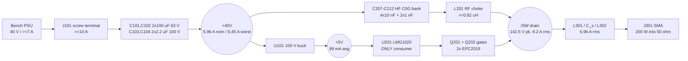

# rf-de-20m - power tree, loss budget and thermal architecture

**AMENDED 2026-08-07 (P2-A). Every number in this file has been re-derived** from
the EPC2019 datasheet (rev (c)2021) read directly, after the P1
`research/power.json` figures (Coss(er) 156 pF, Rds(on) 22/42 mohm) were retracted,
and at the corrected operating point (**R = 4.13 ohm**, from Sokal's Q_L = 5
coefficients rather than the Q_L -> infinity ones the frozen brief used).
Retraction and derivations: `blocks.md` s0.

The rail tree is trivial. **The loss budget and the thermal path are the
deliverable, and the real datasheet made both harder.**

---

## 1. Rail tree



## 2. Rail table

| Rail | Vin | Topology | Current | Dissipation | Notes |
|---|---|---|---|---|---|
| `+40V` | external bench PSU | direct | **5.96 A nom / 6.45 A worst** | n/a (bus) | Unregulated, unprotected - owner-acked P0 Q11. Copper sized **7.0 A**. Every part rated **>= 63 V** (turn-on ring to ~51 V). |
| `+5V` | `+40V` | **buck** | **99 mA avg**, 0.3 A budget | 0.13 W | Buck not LDO (an LDO burns 3.5 W for a 0.5 W load). Noise 0.5-2 MHz, spectrally clear of 20 MHz. |
| `GND` | - | - | return for both | - | In1 + In2 + B.Cu plane stack, **zones A and C only**. |

### 2.1 +5 V current - the amendment IMPROVED this rail

The real **Qg is 1.8 nC typ / 2.5 nC max**, not the retracted 2.4/2.9:

| Term | Source | typ | max |
|---|---|---|---|
| Gate charge, **both FETs** | 2 x Qg x 20 MHz | **72 mA** | 100 mA |
| LMG1020 internal operating | I_VDD,op 40 mA typ @ 30 MHz, scaled to 20 MHz | 27 mA | 27 mA |
| LMG1020 quiescent | I_VDD,Q 75 uA max | 0.1 mA | 0.1 mA |
| **Total average** | | **99 mA** | **127 mA** |
| Rail power | | **0.50 W** | 0.64 W |

**0.3 A budget holds with 3.0x headroom** (was 2.1x on the retracted Qg). Buck
requirements unchanged: Vin 40 V nominal / **>= 63 V abs max**, Vout 5.0 V +/-4%
(LMG1020 recommends 4.75-5.4 V, abs max 5.75 V, UVLO 4.33 V max rising),
Iout >= 0.3 A, LCSC-stocked.

**The rail is low-average / high-peak.** With the mandated >= 2 ohm gate resistors
the peak is **~1.6 A per FET** (5 V / 3.1 ohm), not the 7 A the driver can source
into a zero-resistance load - which is why the *gate* loop budget is 0.48 nH
(`blocks.md` s3) while the **VDD bypass loop keeps a 0.3 nH target**, being a
genuine high-di/dt path with no series resistor.

---

## 3. Per-component dissipation budget

Operating point: Vdd 40 V, **R_opt 4.13 ohm**, **C_shunt 403 pF**,
`I_dc` 5.96 A, `I_sw,rms = 1.5375 x I_dc` = **9.17 A**,
`I_sw,pk = 2.862 x I_dc` = **17.1 A**, tank rms `sqrt(200/4.13)` = **6.96 A**
(I^2 = 48.4), `w` = 1.2566e8.

Per-FET stored charge energy at 142.5 V, integrated from the datasheet's
Coss/Qoss pair: **E_oss = 1.21 uJ typ / 1.63 uJ max** (equivalent Coss(er) ~119 pF
typ - the number that was *invented* as 156 pF).

Columns: **BEST** = typ part at Tj 100 C (Rds 56 mohm), spiral Q 150, 5% hysteresis,
10 V ZVS residual. **NOM** = typ part at Tj 125 C (Rds 65 mohm), Q 100, 10%
hysteresis, 25 V residual. **MAX-CORNER** = **max-datasheet Rds AND max Coss** at
the nominal 10% hysteresis and Q 100 - the realistic bad-reel case.
**WORST** = all of that plus 15% hysteresis, 30 V residual, Q 80.

| # | Item | Formula | BEST | **NOM** | MAX-CORNER | WORST |
|---|---|---|---|---|---|---|
| 1 | Q201+Q202 conduction | `(I_sw,rms^2/2) x Rds_hot`; 56/65/90/90 mohm | 2.06 | **2.73** | 3.91 | 4.42 |
| 2 | Q201+Q202 Coss hysteresis | `2 x frac x E_oss x f`; 5/10/10/15% | 2.42 | **4.83** | 6.52 | 9.78 |
| 3 | Q turn-off overlap | ~2 ns fall (2 gates, real Qg 1.8 nC) | 0.75 | **1.05** | 1.50 | 2.25 |
| 4 | Q imperfect-ZVS residual | `0.5 x 403p x Vres^2 x f`; 10/25/25/30 V | 0.40 | **2.52** | 2.52 | 3.62 |
| 5 | Q gate (internal Rg share) | 33% of the 0.36 W pair gate-loop energy | 0.12 | **0.12** | 0.12 | 0.12 |
| | **FET PAIR subtotal** | | **5.75** | **11.25** | **14.56** | **20.19** |
| 6 | L301 L_s 164 nH spiral | `200 x Q_L/Q_ind` = **1000/Q** | 6.67 | **10.00** | 10.00 | 12.50 |
| 7 | L302 L_m 110 nH spiral | `200 x Q_m/Q_ind` = **666/Q** | 4.44 | **6.66** | 6.66 | 8.33 |
| 8 | L201 RF choke (DC) | `I_dc^2 x DCR`; 15/25/25/45 mohm | 0.47 | **0.89** | 0.92 | 1.87 |
| 9 | C_s bank 518 pF | tanD-limited, 9 x 1206 C0G | 0.64 | **0.95** | 0.95 | 1.36 |
| 10 | C_shunt external bank ~87 pF | small share of the shunt current | 0.02 | **0.05** | 0.05 | 0.10 |
| 11 | C_m bank 530 pF | 6.66 A rms, 10 x 1206 C0G | 0.56 | **0.84** | 0.84 | 1.26 |
| 12 | Bus decoupling ESR | bulk + HF bank | 0.10 | **0.20** | 0.20 | 0.40 |
| 13 | PCB copper (tank + power loop) | distributed | 1.05 | **1.90** | 1.90 | 3.15 |
| 14 | SMA connectors + joints | | 0.15 | **0.25** | 0.25 | 0.50 |
| 15 | U201 LMG1020 | 67% of the gate loop + own 27 mA | 0.38 | **0.42** | 0.42 | 0.55 |
| 16 | U101 5 V buck | `0.50 x (1/eff - 1)` | 0.09 | **0.13** | 0.13 | 0.20 |
| | **Modelled subtotal** | | **20.32** | **33.54** | **36.88** | **50.41** |
| 17 | Un-modelled +15% | FR4 dielectric loss at 20 MHz, harmonic currents in the match, parasitic resonances | 3.05 | **5.03** | 5.53 | 7.56 |
| | **TOTAL DISSIPATION** | | **23.4 W** | **38.6 W** | **42.4 W** | **58.0 W** |
| | Implied efficiency | `200/(200+P)` | 89.5% | **83.8%** | 82.5% | 77.5% |
| | Implied bus current | `(200+P)/40` | 5.58 A | **5.96 A** | 6.06 A | 6.45 A |

**Against the frozen 35-50 W / 80-85% / 5.8 A band:** NOM lands at
**38.6 W / 83.8% / 5.96 A - inside**. The amendment cost 1.1 W and 0.4 points
against the pre-amendment estimate, entirely from the real Rds(on) being 64%
higher than the retracted figure.

### 3.1 Dominant terms - and a result that reframes RULING 1

1. **Magnetics: `1666/Q` watts for L_s + L_m combined - still the largest block**
   (16.7 W at Q 100). Note `P_Ls = 200.Q_L/Q_ind` and `P_Lm = 200.Q_m/Q_ind` are
   **independent of R**, so the R correction did not move them: the tank current
   rises exactly as fast as the reactance falls. `blocks.md` SPIRAL-2 (paralleled
   F.Cu + B.Cu windings) is the cheapest lever: **16.7 W -> ~10 W, ~+2 points of
   board efficiency for zero BOM cost.** Not counted above - verify-later upside.
2. **Coss hysteresis is the dominant FET term (4.83 W of 11.25 W)** and it rests on
   an assumed **10% of stored energy that EPC does not publish** - the same class of
   gap that produced the retracted Coss(er). At 15% the pair reaches ~13.7 W and
   Tj ~127 C. **SIM-5 measures it.**
3. **Paralleling FETs does not reduce dissipation - it reduces thermal resistance.**
   At fixed R, `P_FET(N) = 5.48/N + 2.42N + turn-off + 2.52 + gate`, giving
   **11.17 W at N=1, 11.25 W at N=2, 13.16 W at N=3**. Total loss is flat between
   one and two FETs. The entire benefit of the pair is halving theta_JB and
   theta_BS at zero loss penalty - which is why N=2 wins and N=3 does not.
4. **L_m at ~6.7 W was NOT in the frozen loss list** and is the second-hottest item
   on the board.
5. **Paralleling *inductors* does not reduce loss.** `Q_total = Q_each` exactly.

### 3.2 Over 0.5 W -> `thermal` constraint entries

`Q201`, `Q202` (5.63 W each nominal, 7.28 W at the max corner), `L301` (10.0 W),
`L302` (6.7 W), `L201` (0.89 W), plus distributed copper (1.9 W, not a component).
`U201` at 0.42 W is below threshold but declared because its junction temperature
is board-temperature-driven and it sits 1-2 mm from the hottest silicon
(PsiJB 38.3 C/W against the **local** board temperature, not RthJA 133.6 C/W:
Tj = T_board + 12 C; safe while the copper under it stays below ~110 C).

The C_s and C_m **banks** sit at 0.84-0.95 W, but split 9 and 10 ways that is
0.08-0.11 W per part - a minimum-parallel-count requirement, not a per-part entry.

---

## 4. Thermal path: the FET pair

### 4.1 Assumptions

| Symbol | Value | Basis |
|---|---|---|
| Tj target | **125 C** | 25 C derate on the 150 C abs max; also the temperature at which the 65 mohm hot Rds in line 1 is valid |
| T ambient | **40 C** | requirements Q7 |
| theta_JB, per package | **7.5 C/W** | EPC2019 datasheet. **Fixed - cannot be improved by layout.** One of the few P1 numbers that survived. |
| theta_JB, pair | **3.75 C/W** | two packages in parallel |
| theta_BS, pair | **1.5 C/W ASSUMED** | two via arrays in parallel: >= 10 x 0.3 mm **copper-filled** vias per FET, bottom-copper spreading, mask-opened land with thin grease TIM. Barrel-only is ~2.5x worse. **VERIFY-LATER - not simulated.** |
| P into heatsink | **~21 W nom / ~24 W max-corner** | FET pair + choke + PCB copper + ~40% of the magnetics conducted into the board |

### 4.2 The arithmetic, and the statement that decides RULING 1

```
Tj = Tamb + theta_HS x P_sink + (theta_BS + theta_JB) x P_FET
```

**ONE FET, at the amended operating point:**

```
P_FET(nominal)   = 11.17 W
theta_JB term    = 11.17 x 7.5 = 84 C
Tj with a HYPOTHETICAL 0 C/W heatsink = 40 + 11.17 x 10.5 = 160 C
```

**A single FET exceeds the 150 C ABSOLUTE MAXIMUM with a perfect heatsink.** This
is qualitatively stronger than the pre-amendment finding (138 C against a 125 C
*target*): **no heatsink, TIM, via array or copper weight saves a one-FET build.**

**Full comparison at the specified theta_HS = 0.7 C/W:**

| Corner | P_FET (1 FET) | Tj (1 FET) | P_FET (2 FET) | **Tj (2 FET)** |
|---|---|---|---|---|
| BEST | 6.2 W | 118 C | 5.75 W | **78 C** |
| **NOM** | 11.17 W | **175 C** | 11.25 W | **114 C** |
| **MAX-CORNER** | 14.9 W | **216 C** | 14.56 W | **133 C** |
| COMPOUNDED WORST | 20.5 W | 260 C | 20.19 W | 170 C |

**11 C of margin at the design target under nominal conditions, and 17 C under the
absolute maximum at the max-datasheet corner.** The compounded worst case exceeds
the absolute maximum; the free mitigation is s4.5.

### 4.3 Required heatsink - TIGHTENED to 0.7 C/W

| Tj target | P_FET | theta_HS required | Verdict |
|---|---|---|---|
| 150 C (abs max) | 11.17 W, **1 FET** | **impossible** (negative at 0 C/W) | does not close at any heatsink |
| 125 C | 11.25 W, 2 FET | <= 1.24 C/W | closes with **zero margin** |
| **125 C with margin** | **11.25 W, 2 FET** | **<= 0.7 C/W -> Tj 114 C** | **SPECIFICATION HS-1** |
| 150 C | 14.56 W, 2 FET max-corner | <= 1.2 C/W | met by HS-1 with 17 C to spare |

**HS-1: theta_HS <= 0.7 C/W base-to-ambient at the design airflow while carrying
~21 W** - roughly a **31 x 60 mm base with 30-40 mm fins in forced air**. Was
<= 1.4 C/W before the amendment; the real Rds(on) and Coss cost the difference.
**A passive bolt-on (0.8-1.5 C/W in natural convection) will not do it.**
`blocks.md` HS-2 constrains its footprint: inside `[5, 10, 36, 70]`, never past
x = 40 mm, >= 14 mm clear of every spiral (SPIRAL-6).

Compare the single-FET requirement: **there isn't one.** Even 0 C/W gives 160 C.

### 4.4 Leverage ranking

| Lever | dTj (two-FET architecture) |
|---|---|
| Remove 1 W from the FET pair | **-5.25 C** |
| Tune ZVS on the bench (removes ~2 W of residual) | -10.5 C |
| Get typ parts instead of the max-datasheet corner | **-19 C** |
| Improve theta_BS 1.5 -> 1.0 C/W (filled vias, mask-opened land) | -5.6 C |
| Improve theta_HS 0.7 -> 0.3 C/W | -8.3 C |
| **Back the bus 40 -> 36 V** (s4.5) | **-14 C**, at 162 W instead of 200 W |
| *(already banked)* the second EPC2019 | *-61 C at NOM* |

### 4.5 Bus-voltage derating - the free mitigation, and a correction to intuition

**ZVS in Class E is a property of the NETWORK, not of Vdd.** The design equations
are linear in Vdd and the ZVS/ZdVS conditions constrain only the *shape* of the
current waveform, which is fixed by L_s, C_s, C_shunt, R and f. So the bus can be
backed down at bring-up **without losing ZVS**, trading output power for junction
temperature at zero rework:

| Vdd | P_out | Vds pk | Derate on 200 V | P_FET (max-corner) | **Tj @ 0.7 C/W** |
|---|---|---|---|---|---|
| **40 V** | 200 W | 142 V | 1.40x | 14.56 W | **133 C** |
| 38 V | 180 W | 135 V | 1.48x | 13.43 W | 126 C |
| **36 V** | **162 W** | 128 V | 1.56x | 12.34 W | **119 C** |
| 34 V | 144 W | 121 V | 1.65x | 11.30 W | 112 C |

**If the delivered reel measures at the max corner, back the bus to 36 V and accept
~160 W.** No rework, ZVS intact, and the voltage derate improves as a bonus.

**The corollary matters as much as the mitigation: Vdd is NOT a ZVS knob.** It
cannot correct a shunt-capacitance error. That is what duty cycle (free, on the
generator) and the C203-C206 trim bank are for - `blocks.md` s4.2.

---

## 5. Thermal path: the spirals

L301 must dissipate 6.7-12.5 W and L302 4.4-8.3 W, each in a single etched
structure. **No discrete SMD inductor can do this** (a 1812/2020 wirewound is
theta 30-50 C/W in forced air; 10 W is a 300-500 C rise), which is why the spiral
is the primary implementation - thermal, not BOM cost or sourcing, is the reason.

The R correction moved the inductances (184 -> 164 nH, 115 -> 110 nH) but **not the
losses**, because `P = 200.Q/Q_ind` is R-independent. Sizing check at 1 oz,
~300 mm developed length, AC/DC factor 2.5:

```
2 mm wide:  R_ac = 2.5 x 1.72e-8 x 0.3 / (2e-3 x 35e-6) = 0.184 ohm -> Q 112, P 8.9 W
4 mm wide:  (same length)                                            -> Q ~185, P 5.4 W
```

**Width buys Q roughly linearly; copper weight does not** - at 20 MHz skin depth is
14.6 um, so 1 oz (35 um) is already ~2.4 skin depths and 2 oz adds ~15%.
**The lower inductance target is geometrically helpful**: 164 nH at the same
30-34 mm OD needs a *wider* trace (~2.5-3 mm rather than 1.5 mm), which is exactly
what both Q and the thermal area want. **Do not hard-cap the outline at P5** -
area is the currency that buys efficiency here.

Surface temperature: 5-8 W over 600-1200 mm^2 in forced air (h 50-100 W/m^2K) is a
**60-100 C rise, i.e. 100-140 C copper** - at the limit of standard FR4, hence
**TG155+**. The `>= P / 7 mW.mm^-2` area rule in `blocks.md` SPIRAL-1 is this
calculation inverted.

`thermal[]` declares L301 and L302 with `dt_c: 70`. **That is design intent, not a
defect** - they are the two hottest objects on the board and they are supposed to
be.

**Burn hazard.** Two ~130 C copper structures on an unenclosed bench board, one of
them on the **bottom** face if SPIRAL-2 is adopted. Silkscreen both zones.

---

## 6. Inrush on `+40V`

```
C_bulk 220 uF, L_cable ~1 uH, R_loop ~50 mohm
Z0 = sqrt(L/C) = 0.067 ohm ; zeta = (R/2) sqrt(C/L) = 0.37
overshoot = exp(-pi.zeta/sqrt(1-zeta^2)) = 27%  ->  bus peaks at ~51 V
I2t ~ 0.2 A^2.s ; energy 0.5 C V^2 = 176 mJ
```

The current spike is **not** a problem. **The voltage overshoot is the item.**
Counter-intuitively, **more bulk reduces the overshoot** (zeta ~ sqrt(C)) while
increasing the current spike - do not shrink the bulk to control inrush.

Mitigation, **no parts added**: rate every part on `+40V` at **>= 63 V** (100 V
preferred), and ramp the bench supply up with the board connected rather than
hot-plugging onto a live supply. The second is a bring-up procedure, not a design
feature - and it is now doubly relevant, because s4.5 makes the supply voltage a
deliberate operating parameter.

---

## 7. Conductor sizing - AC, not DC ampacity

`check_current` sizes by IPC-2152 DC ampacity, the wrong criterion above ~1 MHz.
These widths come from an **AC loss budget** at an AC/DC factor of 2.5 on 1 oz
copper and are the binding numbers for P5/P7. **All tank widths grew ~12% at P2-A**
because the tank current rose from 6.58 to 6.96 A rms (I^2 up 11.7%):

| Net | Current | Loss budget | Required width |
|---|---|---|---|
| `/tank/TANK_A`, `/tank/TANK_B` | **6.96 A rms** @ 20 MHz, ~60 mm | <= 0.5 W | **~7.2 mm - a pour, not a trace** (was 6.4) |
| `/SW` drain | **9.17 A rms**, ~10 mm | <= 0.2 W | **~5.1 mm - a pour** (was 4.9) |
| `/tank/RFOUT` | 6.96 A rms at the C_m node, 2.0 A onward to J301 | <= 0.2 W | **~3-7 mm pour** (`stackup.md` s5 - also the 50 ohm ruling) |
| `+40V` DC feed | 5.96 A DC | 10 C rise, IPC-2152 valid | 2.5-3.0 mm |
| `+5V` | 99 mA avg | - | width is not the constraint; **loop inductance is** |

`constraints.json.power` declares the DC-equivalent currents so `check_current`,
`rules_gen` and `route_critical` size these nets, but **the widths above are the
requirement and they are wider than IPC-2152 asks.** Treat a green `check_current`
as a floor, not a pass.

---

## 8. Sequencing

- `+5V` derives from `+40V`, so bus-then-rail ordering is automatic. The LMG1020's
  UVLO holds its outputs low during the buck's soft-start, so both FETs stay off
  while the drains sit at 40 V DC through the choke - benign.
- External order: **connect the 50 ohm load -> apply 40 V -> apply drive ->
  operate -> remove drive -> remove 40 V.** With no protection on board, removing
  the drive is the only "off". **The risk is entirely load-side.**
- Class E reaches steady state in ~Q_L cycles (5 cycles = 250 ns). There is no RF
  soft-start and none is available: 0 -> 200 W happens in one cycle.
- **Bring-up order, added at P2-A:** start at a **reduced bus (30 V, ~113 W)**,
  confirm ZVS on the drain with a fast probe, trim duty for `dVds/dt = 0` at
  turn-on, then walk the bus up to 40 V while watching FET case temperature. The
  s4.5 table is the derating ladder if the parts measure hot.
