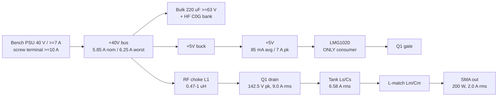

# power.md - rf-de-20m power architecture + thermal budget

P1 research fragment. Board: 20 MHz Class E GaN stage, 200 W into 50 ohm. Frozen inputs from
`requirements.md` s3 / `brief/RESEARCH-LEARNINGS.md` used as given.

**The rail tree is trivial (+40V -> +5V buck). The thermal budget is the deliverable, and it does
not close cleanly.** At the nominal loss estimate the EPC2019 junction reaches ~138 C against a
125 C design target, and no heatsink can fix it - s5.

---

## 1. Rail tree



## 2. Rail table

| Rail | Vin | Topology | Current | Dissipation | Tradeoff |
|---|---|---|---|---|---|
| `+40V` | external bench PSU | direct | 5.85 A nom, 6.25 A worst | n/a (bus) | Unregulated, unprotected - owner-acked P0. Copper sized 7.0 A. |
| `+5V` | `+40V` | **buck** | 85 mA avg, 300 mA budget | 0.11 W | Buck not LDO: an LDO burns (40-5)*0.085 = 3.0 W for a 0.42 W load. Buck noise sits at 0.5-2 MHz, spectrally clear of 20 MHz. |
| `GND` | - | - | return for both | - | L2 unbroken plane (requirements s5). |

### 2.1 +5V current, traceable to the datasheet

Every term from TI SNOSD45B (LMG1020) and the EPC2019 datasheet (2022):

| Term | Source | Value |
|---|---|---|
| Gate charge current | Qg 2.9 nC max @ Vgs 5 V x 20 MHz | 58 mA |
| Driver internal operating current | I_VDD,op 40 mA typ @ 30 MHz, 0.1 pF load, scaled to 20 MHz | 27 mA |
| Driver quiescent | I_VDD,Q 75 uA max | 0.1 mA |
| **Total average** | | **85 mA** |
| Rail power | 5 V x 85 mA | **0.42 W** |

The frozen "~0.1 A / 0.5 W" figure is **confirmed**, though for a different reason than the brief
assumed (the brief implied Qg ~ 5 nC; the datasheet says 2.4 nC typ / 2.9 nC max - the balance is
the driver's own internal current). Budget **0.3 A** as instructed: 3.5x headroom, and enough to
cover two paralleled EPC2019 (143 mA) if s5.4 is adopted.

**The +5V rail is low-average / high-peak**: 85 mA average, but 7 A peaks with a 375 ps rise. The
binding spec is loop inductance, not current or capacitance - s8.3.

Buck requirements: Vin 40 V nominal, **abs max >=63 V** (turn-on ring, s7), Vout 5.0 V +/-4%
(LMG1020 recommends 4.75-5.4 V, abs max 5.75 V, UVLO 4.33 V max rising), Iout >=0.3 A,
LCSC-stocked. Place at the DC input end, away from the tank and the gate loop.

---

## 3. Per-component dissipation budget

Three columns bracket the frozen 35-50 W band; every line is a formula on a frozen or datasheet
number. Common terms: I_dc 5.85 A; `I_sw,rms = 1.5375 x I_dc` = **9.0 A** (ideal Class E); tank
rms `sqrt(200/4.614)` = **6.58 A** (I^2 = 43.35); `w = 2*pi*20e6` = 1.257e8 rad/s.

| # | Item | Formula | BEST | NOM | WORST |
|---|---|---|---|---|---|
| 1 | Q1 conduction | 81 x Rds(on); 35 / 40 / 75 mohm | 2.84 | 3.24 | 6.08 |
| 2 | Q1 Coss hysteresis | 5/10/15 % of `0.5*Coss(er)*V^2*f` = 28.4 W | 1.42 | 2.84 | 4.26 |
| 3 | Q1 turn-off overlap | snubbed by C_shunt 317 pF, ~1 ns fall | 0.50 | 0.70 | 1.50 |
| 4 | Q1 imperfect-ZVS residual | `0.5*317p*Vres^2*20e6`; Vres 10/25/30 V | 0.32 | 1.98 | 2.85 |
| 5 | Q1 gate (internal Rg 0.4 ohm share) | 33 % of 0.29 W gate-loop energy | 0.10 | 0.10 | 0.10 |
| | **Q1 EPC2019 subtotal** | | **5.18** | **8.86** | **14.79** |
| 6 | L_s tank inductor 184 nH | `43.35 * wL/Q` = **1001/Q**; Q 150/100/80 | 6.67 | 10.01 | 12.51 |
| 7 | L_m match inductor 115 nH | `43.35 * wL/Q` = **626/Q**; same Q | 4.17 | 6.26 | 7.83 |
| 8 | L1 RF choke (DC) | `34.2 * DCR`; 15/25/45 mohm | 0.51 | 0.86 | 1.54 |
| 9 | C_s bank 447 pF | tanD-limited, 8 x 1206 C0G; per `research/output-network.json` | 0.60 | 0.90 | 1.30 |
| 10 | C_shunt external bank | 3.2 A rms (51 % of shunt current) x ESR | 0.05 | 0.10 | 0.26 |
| 11 | C_m bank 500 pF | 6.27 A rms, bank scaled from item 9 | 0.50 | 0.80 | 1.20 |
| 12 | Bus decoupling ESR | bulk + HF bank | 0.10 | 0.20 | 0.40 |
| 13 | PCB copper (tank + power loop) | distributed, see s8.4 | 1.00 | 1.80 | 3.00 |
| 14 | SMA connectors + solder joints | | 0.15 | 0.25 | 0.50 |
| 15 | U1 LMG1020 | 67 % of gate loop + own 27 mA | 0.25 | 0.32 | 0.45 |
| 16 | U2 5 V buck | `0.42*(1/eff - 1)`; eff 85/80/72 % | 0.07 | 0.11 | 0.16 |
| | **Modelled subtotal** | | **19.3** | **30.5** | **43.9** |
| 17 | Un-modelled +15 % | FR4 dielectric loss at 20 MHz, harmonic currents in the match, parasitic resonances, layout inefficiency | 2.9 | 4.6 | 6.6 |
| | **TOTAL DISSIPATION** | | **22.1 W** | **35.0 W** | **50.5 W** |
| | Implied efficiency | `200/(200+Ploss)` | 90.0 % | **85.1 %** | **79.8 %** |
| | Implied bus current | `(200+Ploss)/40` | 5.55 A | **5.88 A** | **6.26 A** |

Columns: BEST = typ-Rds part at Tj 100 C, inductor Q 150, tuned ZVS. NOM = typ-Rds at Tj 125 C,
Q 100, 25 V ZVS residual. WORST = **max-Rds part** at Tj 125 C, Q 80, 30 V residual.

**The frozen 35-50 W / 80-85 % band is reproduced bottom-up**: NOM lands on 35.0 W / 85.1 % and
5.88 A - the frozen 5.8 A bus current - and WORST on 50.5 W / 79.8 %. BEST (90 %) is an
idealisation; do not plan for it.

Cross-checked against `research/output-network.json` (sibling P1 fragment): its capacitor-bank
losses are tanD-derived from real LCSC parts and are higher than my first ESR estimate, so items
9 and 11 above adopt its numbers. It independently derives the same `Q_total = Q_unit` result in
s3.1, and its L_s spiral estimate (Q 130-150, 6.8-7.9 W) matches this model's BEST column.
**One contradiction to resolve at P2 - see s10 and OPEN item 3.**

### 3.1 Dominant terms

1. **Magnetics: `P = 1627/Q` watts total for L_s + L_m.** Q is the single biggest lever on board
   efficiency - Q 150 -> 10.8 W, Q 100 -> 16.3 W, Q 80 -> 20.3 W, Q 60 -> 27.1 W.
2. **L_m at ~6.3 W was NOT in the frozen loss list** and is the second hottest item on the board.
   Being a series element it carries the same 6.58 A rms as L_s, so its loss is `43.35*wLm/Q`.
   Every thermal measure applied to L_s must be duplicated for L_m.
3. **Paralleling inductors does not reduce loss.** N identical parts in parallel give
   `Q_total = Q_each` exactly, so total loss is fixed by Q and the required L - paralleling is a
   pure **heat-spreading** measure. This corrects "splits current AND halves ESR" in
   `brief/RESEARCH-LEARNINGS.md`: it splits current, but ESR referred to the required L is
   unchanged. Only higher Q reduces loss.

### 3.2 Over 0.5 W -> thermal constraint list

Q1 (8.9 W aggregate), L_s (10.0 W), L_m (6.3 W), L1 choke (0.86 W), plus distributed copper
(1.8 W, not a component). Everything else is under 0.5 W. The C_s and C_m **banks** sit at
0.8-0.9 W each, but split 8- and 4-ways that is 0.11-0.20 W per part - a bank-level requirement
(minimum parallel count, s8.2), not a per-part thermal entry.

---

## 4. Class E hard-switching failure mode (quantified)

If ZVS is lost entirely - detune, load pull, open or shorted output - the switch dissipates
`0.5 * C_shunt * Vds,pk^2 * f = 0.5 * 317p * 142.5^2 * 20e6` = **64 W** in the EPC2019.
That is ~7x the nominal 8.9 W and destroys the part in milliseconds. Recorded as the quantified
form of the load-sensitivity hazard already acknowledged at P0 Q11; no protection part is proposed.

---

## 5. Thermal: EPC2019 junction - the binding constraint

Datasheet (EPC2019, 2022): **RthJC 2.7 C/W, RthJB 7.5 C/W, RthJA 72 C/W** (1 sq. in., 2 oz,
single layer), Tj abs max 150 C, die 2.77 x 0.95 mm with solder bars, bottom-cooled. Its I_D
continuous rating of **8.5 A** is quoted at RthJA 18 C/W, implying a rated dissipation of ~2.9 W.

**We are asking this part for 8.9 W - about 3x that - at 9.0 A rms, above its 8.5 A continuous
rating.** That is the core problem, and it is a property of the frozen Class E operating point,
not of the layout.

### 5.1 Assumptions (stated, per the brief)

| Symbol | Value | Basis |
|---|---|---|
| Tj target | **125 C** | 25 C derate on the 150 C abs max; also the temperature at which the 40 mohm Rds(on) in line 1 is valid (self-consistent) |
| Tambient | 40 C | requirements s10 Q7 |
| theta_JB | **7.5 C/W** | EPC2019 datasheet, fixed - cannot be improved by layout |
| theta_BS (land -> heatsink base) | **3.0 C/W ASSUMED** | >=20 x 0.3 mm **copper-filled** vias in/around the source lands (2.3 C/W) + bottom-copper spreading (0.7 C/W) + soldermask-opened pad with thin grease TIM over ~40 mm2 (0.5 C/W). A plated-barrel-only via array is ~2.5x worse. **Verify-later.** |
| P into heatsink | ~18 W nom / 27 W worst | Q1 + choke + PCB copper + ~40 % of the magnetics conducted into the board; the rest leaves the top surface into the forced air |

### 5.2 The arithmetic

```
Tj = Tamb + theta_HS * P_sink + theta_BS * P_Q1 + theta_JB * P_Q1
```

At NOM (P_Q1 = 8.86 W, P_sink = 18 W):

```
theta_JB term : 8.86 * 7.5 = 66.5 C     <-- 78 % of the entire 85 C budget, unfixable
theta_BS term : 8.86 * 3.0 = 26.6 C
subtotal      : 40 + 93.1 = 133.1 C  BEFORE the heatsink contributes anything
```

**Tj exceeds the 125 C target with a hypothetical 0 C/W heatsink.** With a realistic
theta_HS = 0.3 C/W: Tj = 133.1 + 5.4 = **138 C** - under the 150 C abs max, over the design target,
with no margin. At WORST (14.79 W, max-Rds part): Tj = 40 + 14.79*10.5 + 27*0.3 = **203 C ->
destruction.** A max-Rds(on) part out of JLC's reel is enough to kill the board.

### 5.3 Required heatsink thermal resistance

Solving for theta_HS with theta_BS = 3.0 C/W:

| Tj target | P_Q1 | theta_HS required | Verdict |
|---|---|---|---|
| 125 C | 8.86 W | **impossible** (negative) | does not close |
| 125 C | 7.7 W (tuned ZVS, typ part) | **<= 0.3 C/W** | achievable, zero margin |
| 150 C (abs max) | 8.86 W | <= 0.94 C/W | easy, but running at the limit |
| 125 C | 5.4 W (two paralleled FETs, s6.4) | <= 1.5 C/W | comfortable |

**Specification: theta_HS <= 0.3 C/W at the design airflow**, base-to-ambient while carrying
18-27 W - roughly a 100 x 60 x 30 mm extruded fin stack with 25-40 CFM. A bolt-on passive sink
(0.8-1.5 C/W) is not sufficient.

### 5.4 Leverage ranking (dTj per unit of effort)

| Lever | dTj |
|---|---|
| Remove 1 W from Q1 | **-10.5 C** |
| Tune ZVS on the bench (removes ~2 W) | -21 C |
| Get a typ-Rds part instead of max-Rds | -30 C |
| Improve theta_BS 3.0 -> 1.5 C/W (filled vias, mask-opened pad) | -13 C |
| Improve theta_HS 1.0 -> 0.3 C/W | -13 C |
| Two EPC2019 in parallel | **-35 C** |

**The heatsink is not the bottleneck; theta_JB is.** Removing a watt from Q1 is 3x more effective
than any heatsink improvement.

Paralleling two EPC2019 (raised in OPEN, not adopted - parts are frozen): conduction halves to
1.6 W, theta_JB halves to 3.75 C/W per die, and Coss(er) 2 x 156 = 312 pF lands almost exactly on
the required 317 pF C_shunt, so the external shunt cap disappears. Cost: hysteresis loss doubles
(the shunt C becomes lossy GaN rather than low-loss C0G), total FET loss rises 8.9 -> ~10.8 W and
efficiency drops ~0.7 pt - but Tj falls from 138 C to **~103 C**. Gate charge doubles to 116 mA,
still inside the 0.3 A rail budget.

---

## 6. Thermal: the tank inductors

L_s must dissipate 6.7-12.5 W and L_m 4.2-7.8 W, one part each.

**No discrete SMD inductor can do this.** A 1812/2020 wirewound has theta ~30-50 C/W in forced
air; 10 W gives a 300-500 C rise. Split across 4 parallel parts (2.5 W each - and per s3.1 the
total does not fall) each part still rises 75-125 C, at or past its own rating, and the
higher-value parts paralleling requires generally have worse Q at 20 MHz.

**So the PCB air-core spiral is the primary approach, not the fallback**, and thermal - not BOM
cost or sourcing - is the reason. Sanity check:

```
2 mm wide, 1 oz, ~300 mm developed length, AC/DC resistance factor ~2.5 at 20 MHz
R_ac = 2.5 * 1.72e-8 * 0.3 / (2e-3 * 35e-6) = 0.184 ohm  -> Q = 23.12/0.184 = 126, P = 8.0 W
4 mm wide (same length)                                   -> Q ~ 208,            P = 4.8 W
```

- **Width buys Q roughly linearly; copper weight does not.** At 20 MHz, skin depth is 14.6 um, so
  1 oz (35 um) is already ~2.4 skin depths and going to 2 oz adds only ~15 %. Doubling trace width
  buys ~50 %. This is why the outline was deliberately left soft at P0 Q3 - **do not cap it.**
- Surface temperature: 5-8 W over 600-1200 mm2 of top copper with forced air (h ~50-100 W/m2K)
  gives a **60-100 C rise, i.e. 100-140 C copper.** That is at the limit of JLC's standard FR4
  (Tg 130-150 C). **Specify a high-Tg stackup (TG155 or better)** - a fab option, not a BOM part.

### 6.1 Heatsink vs spiral: a direct conflict

A PCB air-core spiral needs a plane cutout beneath it or its Q collapses into the image currents.
The bottom layer is the heatsink mounting face, and **a metal heatsink under a spiral is a shorted
turn** - it destroys Q exactly as a plane would, and no copper cutout prevents it.

**Floorplan consequence (hand to P2/P6):** split the board into a *heatsink zone* (Q1, L1, bulk
caps, driver - solid bottom copper, heatsink bolted on) and a *magnetics zone* (L_s, L_m, tank
caps - all plane layers cut away, no heatsink coverage, top-side forced air only). The heatsink
footprint must not extend under the spirals.

---

## 7. Inrush on the +40V rail

Connecting a live 40 V supply into the bulk capacitance through ~1 uH of cable inductance:

```
C_bulk 220 uF, L_cable ~1 uH, R_loop ~50 mohm
Z0 = sqrt(L/C) = 0.067 ohm ; zeta = (R/2)*sqrt(C/L) = 0.37
overshoot = exp(-pi*zeta/sqrt(1-zeta^2)) = 27 %  ->  bus peaks at ~51 V
peak current ~ 40/0.067 * damping ~ 200-400 A theoretical for tens of us,
in practice clamped by the PSU's output impedance and current limit
charge 8.8 mC, energy 0.5*C*V^2 = 176 mJ
```

Assessment: **the current spike is not a problem** - I2t is ~0.2 A2s, which a 2 mm trace and a
10 A screw terminal absorb without noticing, and 176 mJ into an aluminium electrolytic is normal
surge duty. **The voltage overshoot is the real item:** the bus transiently reaches ~51 V.
Counter-intuitively, **more bulk capacitance reduces the overshoot** (zeta scales with sqrt(C))
while increasing the current spike - so do not shrink the bulk to control inrush.

Mitigation, **no parts added**: (1) rate every part on `+40V` at **>=63 V** (100 V preferred),
specifically the bulk electrolytics and the buck's Vin abs max; (2) bring the bench supply up
with the board already connected (ramped) rather than hot-plugging onto a live supply. Item 2 is
a procedure, not a design feature - see OPEN.

---

## 8. Decoupling and conductor sizing on the +40V rail

### 8.1 The 40 V rail is NOT in the RF loop

The drain's 20 MHz current circulates in **drain -> C_shunt -> source -> GND** and
**drain -> tank -> load -> GND**. The RF choke exists to keep the bus out of both. So the layout
priority is:

1. C_shunt / source loop (sets the ringing that the 1.4x voltage derate is protecting)
2. Gate loop + VDD decoupling (s8.3)
3. 40 V bus decoupling - a distant third; bulk placement at the connector is essentially free

### 8.2 Three tiers, three places

| Tier | Parts | Location | Job |
|---|---|---|---|
| Bulk | 220 uF / >=63 V (2 x 110 uF) aluminium or polymer | at the screw terminal | Supply 5.85 A DC through the cable inductance; damp the turn-on ring (s7). **Does nothing at 20 MHz and is not asked to.** |
| Mid | 2 x 2.2 uF / 100 V X7R 0805 | between bulk and choke | Covers 100 kHz - 5 MHz where the electrolytic's ESL has taken over. **X7R is fine HERE** - it sets no resonance, so its ~50 % DC-bias derating at 40 V only costs capacitance (hence 2.2 uF to land near 1 uF). The no-X7R rule applies to the TANK, not the bus. |
| HF | 4 x 10 nF + 2 x 1 nF / 100 V **C0G** 0402/0603 | within 3 mm of the choke's bus-side pad | Absorb the 20 MHz ripple the choke passes and terminate its self-resonance. |

HF bank sizing: the choke passes `V_ac/X_L` of ripple; with L 1 uH (X_L 126 ohm) and ~60 V rms of
drain fundamental across it, that is **~0.5 A rms at 20 MHz**. For |Z| < 1 ohm at 20 MHz the bank
needs >= 8 nF; 4 x 10 nF gives 0.2 ohm, and 4 x 0.4 nH of ESL in parallel is 0.013 ohm - negligible.
Bank dissipation `0.5^2 * 5 mohm` = 1 mW.

RF choke L1 spec (it sets the ripple the bank must absorb): **L 0.47-1.0 uH** (X_L 59-126 ohm =
13-27x R_opt), **SRF >= 80 MHz**, **DCR <= 25 mohm**, **I_sat >= 12 A**, >= 8 A rms. A smaller L
is easier to source with a high SRF and costs only more HF bus capacitance (cheap) - trade that
way if sourcing is hard. Ferrite cores are mostly past their useful range at 20 MHz; prefer
metal-composite or air-core. **Flag to component-scout: hard part to find at LCSC.**

### 8.3 +5V local decoupling is an inductance spec, not a capacitance spec

The LMG1020 sources 7 A with a 375 ps rise. Series inductance in the VDD/gate loop directly slows
that edge: with 1 nH the current can only ramp at `V/L` = 5 A/ns, so reaching 7 A takes 1.4 ns and
the 1 ns switching the whole design depends on is gone.

**Requirement: total VDD + gate loop inductance <= 0.3 nH.** In practice: 100 nF X7R 0402 plus
10 nF C0G 0201 straddling the VDD ball at <0.5 mm, via-in-pad ground return, driver within
1-2 mm of the EPC2019 gate bar, and a direct copper gate return to the source bar (not through the
general GND plane). Charge sag is a non-issue by comparison: `2.9 nC / 100 nF` = 29 mV per pulse
against a 4.33 V UVLO on a 5 V rail.

### 8.4 Conductor sizing (AC, not DC ampacity)

check_current sizes by IPC-2152 DC ampacity, the wrong criterion above ~1 MHz. The widths below
come from an **AC loss budget** at an AC/DC resistance factor of 2.5 on 1 oz copper and are the
binding numbers for P5/P7:

| Net | Current | Loss budget | Required width |
|---|---|---|---|
| tank (L_s / C_s / L_m path) | 6.58 A rms @ 20 MHz, ~60 mm | <= 0.5 W | **~6.4 mm - a pour, not a trace** |
| drain / switch node | 9.0 A rms, ~10 mm | <= 0.2 W | **~4.9 mm - a pour** |
| +40V DC feed (terminal -> choke) | 5.85 A DC | 10 C rise, IPC-2152 | 2.5-3.0 mm |
| RF output to SMA | 2.0 A rms | controlled 50 ohm | set by impedance, not current |

---

## 9. Sequencing

- `+5V` derives from `+40V`, so bus-then-rail ordering is automatic. The LMG1020's UVLO (4.19 V
  typ rising) holds its outputs low during the buck's soft-start, so the FET stays off while the
  drain sits at 40 V DC through the choke - benign.
- The only ordering that matters is external: **connect the 50 ohm load -> apply 40 V -> apply
  drive -> operate -> remove drive -> remove 40 V.** With no protection on board, removing the
  drive is the only "off". Applying drive with no bus is harmless, and applying the bus with drive
  already present is also benign (UVLO gates it) - so the risk is purely load-side.
- Class E reaches steady state in ~Q_L cycles (5 cycles = 250 ns). There is no RF soft-start and
  none is available: 0 -> 200 W happens in one cycle.

---

## 10. Datasheet deltas vs the frozen brief (for P2 - flagged, not changed)

Against the EPC2019 datasheet (EPC, 2022). None change the rail tree; two change the tank.

| Item | Brief says | Datasheet says | Impact |
|---|---|---|---|
| **Coss** | 110 pF | **135 pF typ, Coss(er) 156 pF** | External C0G shunt cap should be **317 - 156 = ~161 pF**, not ~200 pF. Directly affects ZVS. **Conflicts with `output-network.json`, which picks 4 x 56 pF = 224 pF from the brief's 110 pF figure - 39 % high.** That fragment flags its own pick as a planning default pending P2 simulation, so the two are reconcilable, but **P2 must rule.** |
| Package | "1.35 mm chip-scale LGA" | **2.77 x 0.95 mm**, solder bars | Footprint and thermal via plan both change. |
| Rds(on) | 36 mohm | 22 mohm typ / **42 mohm max** @ 25 C; ~1.8x at 125 C | Max-Rds part doubles conduction loss - the s5.2 failure case. |
| Qg | implied ~5 nC | **2.4 nC typ / 2.9 nC max** @ 5 V | Rail budget unaffected (s2.1), but gate loop energy is 0.29 W not 0.5 W. |
| Qoss | 18 nC | 20 nC typ / 24 nC max @ 100 V | Minor. |
| I_D continuous | not stated | **8.5 A** @ RthJA 18 C/W (~2.9 W implied) | We run 9.0 A rms and 8.9 W. See s5. |

---

## Citations

- EPC2019 eGaN FET datasheet, Efficient Power Conversion, (c)2022 - maximum ratings, thermal
  characteristics RthJC/RthJB/RthJA, static + dynamic characteristics.
  https://epc-co.com/epc/portals/0/epc/documents/datasheets/EPC2019_datasheet.pdf
- LMG1020 datasheet SNOSD45B, Texas Instruments, Feb 2018 rev Oct 2018 - thermal information
  (YFF 6-pin), I_VDD,Q / I_VDD,op, t_rise / t_fall / t_min.
  https://www.ti.com/lit/ds/symlink/lmg1020.pdf
- Frozen operating point, tank values, efficiency band: `boards/rf-de-20m/requirements.md` s3 and
  `boards/rf-de-20m/brief/RESEARCH-LEARNINGS.md` (2026-08-07 entries).
