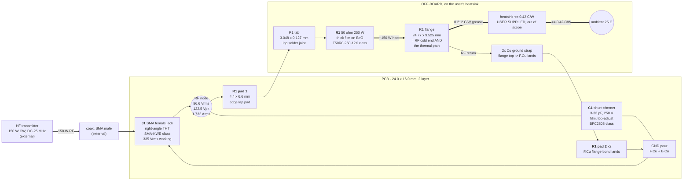

# rf-term-150w - block architecture

Single-port 50 ohm / 150 W CW RF termination head, DC - 25 MHz. Passive, 3 electrical
parts, 6 footprints total, one schematic sheet.

This file is the P2 record of HOW the 12 P1/P2 orchestrator decisions turn into geometry,
plus the arithmetic that either confirms them or (section 8) contradicts them.

---

## 0. Headline numbers

| Quantity | Value | Where derived |
|---|---|---|
| Board outline | **24.0 x 16.0 mm** (2L, JLC2313_1.6) | s3 |
| SMA pin -> R1 tab pad start | **4.7 mm** (floor is 4.42 mm, set by clearance) | s3.2 |
| Estimated residual series L, port to element | **6.9 nH = 1.09 ohm at 25 MHz** | s4 |
| Budget | 5.0 ohm (31.9 nH) design target | requirements s1 |
| Predicted RL at 25 MHz, R = 50.0 ohm | **73 dB** | s5 |
| Predicted RL at 25 MHz, R = 52.5 ohm (+5% corner) | **32.2 dB** | s5 |
| Predicted RL at 25 MHz, R = 51.0 ohm (select-on-test limit) | **39.9 dB** | s5 |
| Spec | >= 26 dB at 25 MHz | requirements crit. 2 |
| Required heatsink (excl. 0.212 C/W grease joint) | **<= 0.42 C/W** | s6 |
| Real free-air heatsink that meets it | Wakefield 392-300AB, 0.33 C/W | s6.3 |
| Derated air-cooled power, no heatsink | **~1 W** (0.8-1.2 W) | s6.4 |

---

## 1. Block diagram

Solid double arrows are power/heat; single arrows are the RF current loop. **The RF loop
closes through the two ground straps, not through the heatsink** - see s2.3, which is the
single most important structural conclusion of this pass.

## 2. Blocks

### 2.1 B1 - RF port (J1)

SMA female jack, **right-angle through-hole, 4 ground legs + centre pin**, part class
`SMA-KWE` (Lian Xin) with `BWSMA-KWE-Z001` (BAT Wireless) as the dimensional twin.
Footprint `Connector_Coaxial:SMA_BAT_Wireless_BWSMA-KWE-Z001`, verified pad-for-pad against
the SMA-KWE drawing in `parts/SMA-KWE.json`: pad 1 roundrect 2.3 x 2.3 drill 1.4 at (0,0),
four pad 2 circles 2.2 drill 1.4 at (+/-2.55, +/-2.55), F.Fab body (-3,-3)-(3,3), barrel
drawn to -11.5 mm and courtyard to -12 mm **in -Y**, i.e. at rot 0 the barrel points off
the TOP edge.

Two numbers from this footprint bind the whole board:

1. **Copper half-extent 3.65 mm** (2.55 + 1.1). With JLC's 0.30 mm min copper-to-edge, the
   centre pin can sit no closer than 3.95 mm to the mating edge. Chosen: **4.2 mm**
   (0.55 mm edge clearance).
2. **The part's own pad-to-pad gap is 0.963 mm.** Centre-pad corner arc centre
   (0.95, 0.95) r 0.2, ground pad centre (2.55, 2.55) r 1.1 ->
   `sqrt(1.6^2+1.6^2) - 0.2 - 1.1 = 0.963 mm`. The board-wide 0.80 mm HV clearance
   (IPC-2221 row A6, 101-150 V band) therefore **passes on the vendor land pattern with
   0.163 mm to spare**. This is the check that kills HV boards at P8 (LEARNINGS 2026-08-07
   [drc][kicad][fab]: "when a creepage rule is tighter than a land pattern's own pad gap,
   the PART choice is the defect"). It is clean here - record the number, do not re-derive.

Working voltage 335 Vrms vs 86.6 Vrms operating = 3.9x margin. Power rating: **ABSENT from
the datasheet** - accepted per requirements s2 on the voltage-margin argument.

### 2.2 B2 - Adjustment (C1)

Shunt trimmer capacitor from the RF node to GND at the **port (J1) end**, part class
Vishay/BCcomponents `BFC2808` film trimmer, 3-33 pF, 250 VDC, dia 7.5 mm, top-adjust.

- **Rotor to GND, stator to RF.** Requirements F1 makes the trimmer a live-part-access
  question: the operator turns it with a hand tool at 122.5 Vpeak, and tuning at full drive
  is the intended use case. Putting the ROTOR (the terminal mechanically continuous with the
  adjustment screw) on GND puts the touched metal at ground potential. **Binding on P3 pin
  mapping and P4.** If the chosen part does not distinguish rotor from stator, the fallback
  is an insulated tuning tool plus a README instruction to tune at reduced drive - state
  which one was used.
- Tuning authority, at 25 MHz into 50 ohm: a shunt C cancels a series X of
  `X = C*w*R^2` -> **3 pF = 1.18 ohm (7.5 nH), 33 pF = 12.96 ohm (82.5 nH)**. With the
  ~1.3 pF of unavoidable port-side parasitic C (s4.3) the real authority is
  **1.69 to 13.5 ohm, i.e. 10.8 to 86 nH**.
- Dissipation: at Cmax, `I = V*w*C = 86.6 * 1.5708e8 * 33e-12 = 0.449 Arms`;
  `Xc = 193 ohm`, so ESR = 0.19 ohm at tan-delta 1e-3 and 0.97 ohm at Q = 200 ->
  **39 to 195 mW**. Voltage, not power, is the gate - as requirements s3 predicted. But see
  s8 OPEN-1: the part's **-40 to +70 C** rating, not its dissipation, is the real problem.

### 2.3 B3 - Termination element (R1) and the ground return

`T50R0-250-12X` class: 50 ohm +/-5%, 250 W, thick film on BeO, DC-4 GHz, RL >= 16 dB.
**Mounts off-board on the user's heatsink** (P2 decision); only its RF tab laps onto a pad
at the board edge. Custom footprint, P3 to build:

| Pad | Function | Geometry |
|---|---|---|
| 1 | RF lap pad (F.Cu SMD) | 4.4 x 6.6 mm, long axis normal to the board edge, 0.5 mm from the edge |
| 2 (x2) | flange ground-bond lands (F.Cu SMD) | 3.5 x 2.0 mm each, centred +/-4.75 mm off the pad axis, extending outboard to +/-6.5 mm |
| - | keepout + silk | flange outline 24.77 x 9.525 mm and element 9.525 x 9.525 mm drawn on F.Fab/User.Comments OUTSIDE the board edge as a heatsink drilling template; 2x dia 3.302 mm hole centres at +/-9.21 mm |

Height stack (all heights above the heatsink mounting plane):

| Item | Height | Source |
|---|---|---|
| flange bottom (mounting plane) | 0.000 mm | datum |
| flange top | 1.575 mm | `parts/T50R0-250-12X.json` |
| **tab underside** | **2.667 mm** | datasheet, explicitly dimensioned |
| tab top | 2.794 mm | 2.667 + 0.127 |
| element top | 3.556 mm | overall height max |
| PCB bottom (on 1.0 mm shims) | 1.000 mm | P2 decision |
| PCB top copper | **2.635 mm** | 1.0 + 1.6 + 0.035 |
| **solder gap, tab to pad** | **0.032 mm** | 2.667 - 2.635 |

**Tolerance check on the 0.032 mm gap (this is the number the P2 decision rests on).**
JLC's 1.6 mm thickness tolerance is +/-10% and HASL adds 1-25 um, so the real gap runs
about -0.14 to +0.20 mm; a negative gap means the pad sits above the tab. The joint
survives this because the tab is **compliant**: 3.048 mm wide x 0.127 mm thick copper,
`I = b*t^3/12 = 5.20e-16 m^4`, free length ~3 mm, `k = 3EI/L^3 = 6.8 N/mm`. Taking up
0.2 mm of misfit costs **1.4 N** - a 140 g preload on a lap joint, negligible. **The shim
decision holds. It would NOT hold with a rigid terminal.** Record this: it is why a 0.032 mm
nominal is an honest number and not false precision.

**THE GROUND RETURN IS NOT DECIDED YET AND IT IS HALF THE LOOP.** The decisions cover the
signal tab and say nothing about how the PCB GND pour reaches the element's cold end (the
flange). Quantifying the tempting "let the bolted flange-to-heatsink joint do it" answer:

> flange contact area 2.359 cm^2, thermal grease 25 um, er ~ 5 ->
> `C = e0*er*A/d = 8.85e-12 * 5 * 2.359e-4 / 25e-6 = 418 pF`
> `Xc at 25 MHz = 15.2 ohm`

A bolted joint through grease normally has metal-to-metal asperity contact and is a short -
but on an **anodised** heatsink it is not, and then the return path is 15.2 ohm of series
capacitive reactance. That is a ~10 dB return loss, i.e. a dead board, and it depends on a
finish the user chooses. Plus the detour itself: a return via the heatsink and a mounting
screw ~20 mm away encloses a ~60 mm^2 loop, worth 15-25 nH on its own - most of the 31.9 nH
budget, spent on nothing.

**Resolution (new P2 decision, see decisions.md D5): two soldered copper ground straps
direct from the flange top face to the F.Cu lands, flanking the RF tab.** Geometry:
the element block covers the flange's central 9.525 mm, so exposed flange top starts at
**4.76 mm** either side of the tab centreline - the lands therefore reach out to +/-6.5 mm
and the straps land at +/-5.5 mm. Strap ~3 mm long x 4 mm wide, 0.3 mm shim stock, dropping
1.06 mm from the F.Cu land (2.635 mm) to the flange top (1.575 mm). Each is ~0.5 nH; the
pair, in parallel, ~0.3 nH. That is the entire point: **1.5 nH of well-defined return
instead of 15-25 nH of heatsink-dependent guesswork.**

Assembly order that makes this solderable (README, and P3's footprint notes):
1. Solder both straps to the loose flange (a 3.3 g copper flange takes a 60 W iron fine).
2. Bolt R1 to the heatsink with grease and its own 2x M3.
3. Set the PCB on its three 1.0 mm shims and bolt it down.
4. Solder the tab to pad 1 and the strap free ends to the pad-2 lands - the PCB is a small
   thermal mass, so this is an ordinary bench joint.

### 2.4 B4 - Mechanical (H1-H3)

3x M3 NPTH mounting holes, `board_only` (no BOM line, no CPL line - LEARNINGS 2026-07-29).
Total footprints = J1 + R1 + C1 + H1..H3 = **exactly 6**, at the requirements cap.

The M3 screw head is a **grounded metal object 5.5 mm across sitting on the top surface**,
so each hole carries a `5.5 + 2*0.80 = 7.1 mm` diameter keepout against RF copper. This is
the constraint that sizes the board across the RF axis, not the parts (s3.3).

Bottom-side mask openings (annular, ~6 mm OD) at all three holes give a deliberate chassis
bond to the heatsink. It is a bonus, **not** the RF return - see s2.3.

---

## 3. Board outline - 24.0 x 16.0 mm

30 x 30 mm is a HARD cap (requirements s5, crit. 10) and binds permanently at P5
`board_init`. **Chosen: 24.0 x 16.0 mm = 384 mm^2 = 43% of the cap**, 6 mm of headroom on
the long axis and 14 mm on the short one.

Board-local coordinates below: origin at the outline's top-left corner, x right, y down.
The RF axis is the vertical line **x = 9.0**; J1 mates off the **top** edge; the R1 flange
sits off-board past the **bottom** edge.

> **MANDATORY AT P5/P6 - COORDINATE TRANSLATION.** `board_init.py` does not put the outline
> at (0,0); the origin comes from the packed component bounding box. Read
> `reports/board_init.json.outline_bbox` and translate every coordinate in this file by
> (x0, y0) before P6 consumes it. (`constraints.json` deliberately carries no
> `placement.keepouts` or `planes[].region` rects, precisely so there is nothing that can
> silently go untranslated.)

### 3.1 What sets the 16.0 mm axis (along the RF path)

| Term | mm | Why |
|---|---|---|
| top edge -> J1 centre pin | 4.20 | J1 copper half-extent 3.65 + 0.55 edge clearance (JLC min 0.30) |
| J1 centre pin -> R1 pad north edge | 4.70 | **4.42 mm floor**, see s3.2. 0.27 mm added as margin |
| R1 lap pad length | 6.60 | see s3.4 |
| R1 pad -> bottom edge | 0.50 | JLC min 0.30 + margin |
| **total** | **16.00** | |

### 3.2 The 4.42 mm floor - the one number that fixes the launch length

The R1 lap pad is on the RF net at 122.5 Vpeak and must clear J1's own ground pads by
0.80 mm. Nearest ground pad centre is at (+/-2.55, +2.55) from the pin, radius 1.1. For a
lap pad of half-width 2.2 mm whose near edge is `d` from the pin:

    sqrt((d - 2.55)^2 + (2.55 - 2.20)^2) >= 1.1 + 0.80 = 1.90
    (d - 2.55)^2 >= 3.61 - 0.1225 = 3.4875   ->   d >= 4.417 mm

**This, not the board size, sets the launch length.** Shrinking the outline cannot shorten
it. Two corollaries worth recording:

- Rotating J1 by 45 deg is *worse* (the nearest ground pad moves onto the axis at 3.606 mm,
  pushing the floor to 5.5 mm). Rot 0 - RF exiting between two ground pads - is optimal.
- Relaxing the board clearance from 0.80 to the masked-trace row B4 (0.40 mm) would buy
  0.9 mm of launch and about 0.4 nH. **Not worth reopening a settled decision** for 0.06 ohm
  of reactance; the 0.80 mm board-wide rule stays.

### 3.3 What sets the 24.0 mm axis (across the RF path)

| Side | mm from the RF axis | Driver |
|---|---|---|
| C1 side (east) | 15.0 | J1 courtyard half-width 4.15 + 0.5 + **C1 body dia 7.5** + 0.5 edge = 12.65 minimum; +2.35 packing margin for P6 |
| strap/screw side (west) | 9.0 | R1 pad half-width 2.2 + **0.80 HV clearance** + M3 head radius 2.75 + 2.6 hole-to-edge = 8.35 minimum; and the strap land must reach past the element at 4.76 mm, needing >= 7.0 |

True minimum is **~21.0 x 15.0 mm**. The extra 3 x 1 mm is deliberate packing margin: the
outline is unrecoverable after P5, JLC prices any 2-layer board flat below 100 x 100 mm, and
a 384 mm^2 board is already 43% of the cap. **Buying 3 mm of P6 freedom for zero dollars and
zero picohenries is the right trade** - and it is the only place in this design where a
number is not driven to its limit, so it is called out rather than buried.

Indicative placement (P6 refines; these are hints, not gospel):

| Ref | x, y (mm) | note |
|---|---|---|
| J1 pin | 9.0, 4.2 | rot 0, barrel off the top edge |
| RF trace | x 8.45-9.55, y 5.35 -> 8.9 | 1.1 mm wide through the ground-pad gauntlet, then flare |
| R1 pad 1 | 6.8-11.2 x, 8.9-15.5 y | 4.4 x 6.6 mm |
| R1 pad 2 (west/east) | centres x 4.25 / 13.75, y 13.5-15.5 | strap lands, reach to +/-6.5 mm off axis |
| C1 body | centre ~17.4, 4.6 | dia 7.5, RF (stator) pin west, ~6 mm stub to J1 |
| H1, H2, H3 | ~(2.5, 3.5), (2.5, 10.5), (21.0, 11.5) | M3, 7.1 mm dia RF keepout each |

### 3.4 The lap pad, and a premise that the datasheet does not support

The tab protrusion is dimensioned **`.125 [3.18] Min.`** - a minimum with **no maximum**.
The drawing depicts ~9 mm. With a 0.5 mm air gap between the board edge and the flange
(mandatory: the board bottom is at 1.000 mm and the flange top at 1.575 mm, so they
interfere if they overlap in plan) and 0.5 mm of pad-to-edge clearance:

    guaranteed lap = 3.18 - 0.5 (gap) - 0.5 (edge clearance) = 2.18 mm

**The brief's "3-5 mm of overlap" is therefore not achievable at the datasheet minimum** -
it needs 0.5 + 3.0 = 3.5 mm of protrusion and only 3.18 mm is guaranteed. This is a premise
break, not a design break: 2.18 mm x 3.048 mm is 6.6 mm^2 of lap solder carrying 1.732 Arms
and essentially no mechanical load, which is a perfectly sound joint. The 6.6 mm pad exists
so that the *actual* lead (drawn ~9 mm, unspecified) can be trimmed to a comfortable
4-5 mm lap. **Incoming inspection must measure the lead** - flagged in s8 OPEN-2 and for
the README.

---

## 4. Launch geometry and the residual inductance budget

Stackup JLC2313_1.6: 1.53 mm FR4 core, er 4.5 (assumed), 1 oz outer. Microstrip solved with
IPC-2141A-style surface microstrip:

    eps_eff = (er+1)/2 + (er-1)/2 * (1 + 12h/w)^-0.5
    Z0      = (87 / sqrt(er+1.41)) * ln(5.98h / (0.8w + t))
    L'      = Z0 * sqrt(eps_eff) / c        C' = sqrt(eps_eff) / (c * Z0)

| w (mm) | w/h | eps_eff | Z0 (ohm) | L' (nH/mm) | C' (pF/mm) |
|---|---|---|---|---|---|
| 1.1 | 0.719 | 3.17 | 82.4 | 0.489 | 0.0720 |
| 2.3 (J1 pad) | 1.503 | 3.33 | 56.7 | 0.345 | 0.107 |
| 2.83 | 1.85 | 3.39 | 49.4 | **0.303** | 0.124 |
| 4.4 (lap pad) | 2.876 | 3.52 | 33.8 | 0.211 | 0.176 |

The 2.83 mm row reproduces the 0.303 nH/mm that the "~0.295 nH/mm for a 50-ohm-ish width"
figure refers to - the model is calibrated.

### 4.1 Design choice: the launch is deliberately NOT 50 ohm

At 25 MHz the whole 11.5 mm path is 0.0017 lambda. Transmission-line behaviour does not
exist here; the launch is a lumped series L with a little shunt C. **L' falls monotonically
with width, so the correct move is to make the launch as WIDE and LOW-Z as clearance allows,
not 50 ohm.** The 4.4 mm lap pad runs at Z0 = 34 ohm and 0.211 nH/mm - 30% less inductance
per mm than a "correct" 50 ohm line - and the extra shunt C it brings sits at the resistor
end where it is nearly free (s4.3). This is what makes the brief's "no controlled-impedance
service" constraint cost exactly zero.

### 4.2 The budget

Path: SMA centre pin (y = 4.2) -> trace -> lap pad -> tab -> flange edge (y = 16.5).

| # | Term | Basis | nH |
|---|---|---|---|
| A | J1 internal launch, excess over 50 ohm | ~4 mm of ~100 ohm right-angle transition; **no parasitics published** for this connector | 1.2 |
| B | J1 centre pad, 1.15 mm at 2.3 mm wide | 0.345 nH/mm | 0.40 |
| C | RF trace, 3.55 mm at 1.1 mm wide | 0.489 nH/mm; 1.1 mm is the max that keeps 0.90 mm to J1's ground pads | 1.74 |
| D | lap pad + bonded tab, 7.1 mm at 4.4 mm wide | 0.211 nH/mm; pad and tab are one conductor once soldered | 1.50 |
| E | tab across the 0.5 mm air gap + B.Cu->F.Cu via transition + 2x flange strap | loop model, return detours +/-5.5 mm; **least certain term, range 1.0-3.0** | 1.5 |
| F | inside R1: tab to element, plus the element's own residual | **bounded, not guessed** - see below | 0.6 |
| | **TOTAL** | | **6.9** |

Term F is bounded rather than estimated. The datasheet publishes RL >= 16 dB typical to
4 GHz in a matched 50 ohm system, so `|G| <= 0.158`, and for a series X on 50 ohm
`|G| = X / sqrt(4R^2 + X^2)` gives `X <= 16.0 ohm at 4 GHz`, i.e.
`L <= 16.0 / (2*pi*4e9) = 0.64 nH`. The part's own residual cannot exceed 0.64 nH. Use 0.6.

    X = w*L = 1.5708e8 * 6.9e-9 = 1.09 ohm at 25 MHz
    (0.98 ohm at 22.5 MHz, 1.19 ohm at 27.5 MHz)

vs. the 5.0 ohm design target: **4.6x inside budget**. Conservative in two ways: term C
assumes the trace stays 1.1 mm wide for its whole length when only 2.5 mm of it is inside
the ground-pad gauntlet, and term D counts the full pad length when current transfers to the
tab partway along.

### 4.3 Port-side shunt capacitance - and why the trimmer will bottom out

| Source | pF |
|---|---|
| C1 minimum | 3.00 |
| C1 stub, 6.3 mm at 1.1 mm wide (0.072 pF/mm) | 0.45 |
| RF trace, half of 3.55 mm x 0.072 pF/mm at the port end | 0.13 |
| J1 centre pad, 1.15 mm x 0.107 pF/mm | 0.12 |
| J1 internal + C1 footprint pads (estimate) | 0.60 |
| **minimum achievable port shunt C** | **4.30** |

To cancel 6.9 nH needs `C = X / (w*(R^2 + X^2)) = 1.09 / (1.5708e8 * 2501) = 2.77 pF`.
**The floor is 4.30 pF. The trimmer cannot be backed off far enough.** Excess 1.53 pF ->
`|G| ~ w*dC*Z0/2 = 6.0e-3` -> a 44 dB contribution. Harmless numerically; see s8 OPEN-3 for
what it does to acceptance criterion 5.

---

## 5. Return loss - the resistor tolerance is the whole error budget

A shunt trimmer cancels susceptance only. With C tuned to null the reactance, the port
resistance transforms to

    R_eff = R + X^2 / R          (exact: Re{1/Y} at B = X/(R^2+X^2))

which **no amount of trimming corrects** (P2 decision). At X = 1.09 ohm:

| R (ohm) | case | R_eff | \|G\| | **RL** |
|---|---|---|---|---|
| 50.0 | nominal | 50.024 | 2.4e-4 | **72.5 dB** |
| 51.0 | select-on-test upper limit (+2%) | 51.023 | 0.0101 | **39.9 dB** |
| 49.0 | select-on-test lower limit (-2%) | 49.024 | 0.0099 | **40.1 dB** |
| 52.5 | datasheet +5% corner | 52.522 | 0.0246 | **32.2 dB** |

Full network solve at the +5% corner with the trimmer at its 4.30 pF stop (i.e. not even
optimally tuned): `Z_in = 52.51 - j0.78`, `|G| = 0.02565`, **RL = 31.8 dB**. Spec is 26 dB.
**5.8 dB of margin at the worst tolerance corner with the tuning bottomed out.**

How much reactance would it take to actually fail 26 dB (`R_eff <= 55.27 ohm`)?

| R | max X | max L |
|---|---|---|
| 50.0 | 16.2 ohm | 103 nH |
| 51.0 | 14.8 ohm | 94 nH |
| 52.5 | 12.1 ohm | 77 nH |

At the +5% corner the binding cap is actually the **trimmer's own 12.96 ohm authority**, not
R_eff. Either way the estimated 6.9 nH sits **11x** inside the failure point.

**Two consequences that must reach the human:**

1. **The board meets 26 dB with the trimmer removed.** Untuned, `Z = 50 + j1.09` ->
   RL 39.3 dB at R = 50 and 31.5 dB at R = 52.5. C1 exists to satisfy A6/crit. 5-6 and to
   absorb build variation, not to make the spec.
2. **Select-on-test is what buys the margin, not the launch.** Going from the datasheet
   +/-5% to the inspected +/-2% moves RL from 32.2 to 39.9 dB - 7.7 dB, versus the ~0.02 dB
   the entire launch inductance costs. The P1 select-on-test decision is doing all the work.

Across 22.5-27.5 MHz X scales linearly with f (0.98 -> 1.19 ohm) and R_eff moves by
<0.02 ohm, so criterion 3 (>= 20 dB across the band) is met by the same margin. DC path
resistance adds ~10 mohm (J1 centre 3 mohm + outer 2 mohm + 1.3 mohm trace + joints) =
0.02% of 50 ohm, irrelevant against a +/-2% spec.

---

## 6. Thermal - verification of the orchestrator's numbers, plus real heatsinks

### 6.1 The derating curve (verified against `parts/T50R0-250-12X.json`)

Two-segment piecewise linear, one knee: **(25 C, 100%) - flat - (100 C, 100%) - linear -
(150 C, 0%)**, digitised from the PDF's vector geometry, corroborated by the datasheet's own
footnote "Rating based on <=100 degC constant flange temperature".

    slope above the knee = -250 W / 50 C = -5.0 W/C          CONFIRMED
    P_allow(T) = 250 W                       for T <= 100 C
    P_allow(T) = 750 - 5*T   [watts, T in C] for 100 <= T <= 150 C

### 6.2 The requirement at 150 W (all four orchestrator figures re-derived, all confirmed)

    150 = 750 - 5*T   ->  T_flange = 120 C                              CONFIRMED
    Rth_total = (120 - 25) / 150 = 0.6333 C/W                           CONFIRMED
    at the 100 C knee: (100 - 25) / 150 = 0.5000 C/W                    CONFIRMED
    flange area = 24.77 x 9.525 = 235.93 mm^2 = 2.3593 cm^2             CONFIRMED
    grease joint at 0.5 C.cm^2/W = 0.5 / 2.3593 = 0.2119 C/W            CONFIRMED
    heatsink alone <= 0.6333 - 0.2119 = 0.4214 C/W                      CONFIRMED

The interface eats **33% of the entire budget** on a flange this small. Stating 0.633 C/W
without saying "0.42 C/W of that is the heatsink" is misleading, exactly as the P2 decision
says. At the 100 C knee the heatsink must be **0.288 C/W**, which is a different class of
part again - quote 0.42, mention 0.288 as the "leave 100 W of headroom" option.

### 6.3 Derated air-cooled power - the formula, verified

Self-consistent solution of the curve against a heatsink: `T_f = 25 + P*Rth` and
`P = 750 - 5*T_f` give

    P = 750 - 5*(25 + P*Rth) = 625 - 5*P*Rth   ->   P = 625 / (1 + 5*Rth)

valid while `T_f >= 100 C`, i.e. `P*Rth >= 75`, i.e. **Rth >= 0.30 C/W**; below that the
flat 250 W plateau applies. **Both branches confirmed.** Sanity: Rth = 0.6333 gives
`625/4.1665 = 150.0 W`. Exact.

### 6.4 Two real, currently-purchasable heatsinks (both figures read live 2026-08-08)

`Rth_total = Rth_heatsink + 0.212` (the grease joint); `P = 625/(1 + 5*Rth_total)`.

| # | Part | Published Rth, natural convection | Rth_total | **CW power** | Flange T | Price / stock |
|---|---|---|---|---|---|---|
| 1 | **Wakefield Thermal Solutions 392-300AB** (bonded/pin-fin, 300 x 125 x 135.8 mm) | **0.33 C/W** - DigiKey field, verbatim: `"Thermal Resistance @ Natural: 0.33C/W"` (a separate row reads `"@ Forced Air Flow: 0.10C/W @ 100 LFM"`) | 0.542 | **168.5 W** | 116.3 C | $193.02 qty 1, **65 in stock**, DigiKey |
| 2 | **Fischer Elektronik SK 88 100 SA** (extrusion, 100 x 100 x 50 mm) | **1.05 C/W** - DigiKey field, verbatim: `"Thermal Resistance @ Natural: 1.05C/W"` (forced 0.33 C/W) | 1.262 | **85.5 W** | 132.9 C | $11.85 qty 1, **983 in stock**, DigiKey |
| - | no heatsink, bare flange in still air | ~102-153 C/W (computed, s6.5) | - | **0.8-1.2 W** | ~150 C | - |

The "flange T" column is the temperature at each sink's own **derated maximum**, i.e. the
point where the assembly sits exactly on the derating curve. At the **150 W design point**
the 392-300AB runs the flange at `25 + 150*0.542 = 106.3 C`, comfortably under the 120 C the
curve allows - that 13.7 C is the real margin the part buys.

URLs read: `https://www.digikey.com/en/products/detail/wakefield-thermal-solutions/392-300AB/4864908`
and `https://www.digikey.com/en/products/detail/fischer-elektronik/SK-88-100-SA/25831447`.

**Answer to "is 0.42 C/W reachable in free air": yes, but only at 300 x 125 x 136 mm and
$193.** The design point is met with margin (0.33 vs 0.42, giving 168 W of headroom against
the 150 W requirement). Two further reference points from the same search:

- Wakefield **392-180AB**, 0.43 C/W natural, $133.77, 100 in stock - fails the 0.42 bar by
  0.01 C/W and lands at **148.5 W**. That part *is*, numerically, the design point.
- Ohmite/Arcol **AH50600V05000FE** (127 x 100 x 31 mm, purpose-built resistor sink):
  1.30 C/W natural, quoted from an Ohmite-letterhead PDF that states verbatim *"the thermal
  resistance value assumes vertical orientation of the heatsink in natural convection"* ->
  Rth_total 1.512 -> **73 W**. Useful because it is the one figure in this table backed by a
  directly-read manufacturer PDF rather than a distributor field.

Caveats, stated rather than smoothed: for parts 1 and 2 the "natural convection" qualifier is
manufacturer-published via the distributor's structured field, but the fine print (delta-T
basis, fin orientation) was not readable - both manufacturers' own PDFs refused automated
fetch. RS Components lists SK 88 100 SA at **0.85 K/W** against DigiKey's 1.05 C/W;
the conflict is unresolved and 0.85 would give 99 W instead of 85 W. **Resolve against
Fischer's own profile curve before quoting a number to a customer.**

### 6.5 The no-heatsink number

Exposed area of the bare part: flange top less the element footprint 1.45 cm^2 + flange
bottom 2.36 + flange edges 1.08 + element top 0.91 + element sides 0.75 = **6.55 cm^2**.
At a combined convection+radiation coefficient of h = 10-15 W/m^2K:

    Rth = 1/(h*A) = 102 to 153 C/W   ->   P = 625/(1+5*Rth) = 1.22 to 0.81 W

**~1 W, i.e. 0.7% of 150 W, with the flange still sitting at ~150 C.** Requirements s3
predicted "a small fraction of 150 W"; the real number is under one percent. The README must
say plainly that the assembly is unusable at rated power without the external heatsink.

### 6.6 The heatsink is not in the BOM, but it dominates the cost

A4 puts the heatsink out of scope and on the user. Worth writing down anyway: the part that
makes the spec (392-300AB, $193) costs **more than the entire rest of the build**, and more
than 4x the $40 cap by itself.

---

## 7. Cost picture for checkpoint 1

| Line | Part class | Qty-5 | Source |
|---|---|---|---|
| R1 | T50R0-250-12X | $122.00 | DigiKey, 139 in stock |
| C1 | BFC280811339 | $44.42 | LCSC, 9 in stock |
| J1 | SMA-KWE | $2.81 | LCSC, 11802 in stock |
| **BOM, 3 lines / 3 placements** | | **$169.23** | |
| bare PCB, 5x 24 x 16 mm 2L | JLC standard, flat rate below 100x100 | ~$2-5 | excl. shipping/tax (A8) |
| **total vs the $40 cap** | | **~$171-174 = 4.3x over** | |
| assembly hardware (not a PCB BOM line) | 3x M3 screw + 3x 1.0 mm insulating shim + 2x M3 flange screw + 2x Cu strap shim + grease | ~$3-5 per set | s8 OPEN-4 |
| heatsink (out of scope, A4) | Wakefield 392-300AB | $193.02 each | user supplies |

Fab class: 2 layer, JLC standard FR4, HASL, no upcharge options, no controlled impedance.
Nothing on this board triggers an upcharge. Per A8 the overrun is reported, not engineered
away - the cost is a materials floor for >= 250 W RF-grade ceramic, confirmed twice by P1.

---

## 8. Open items for the human at checkpoint 1

**OPEN-1 (escalation, thermal): the chosen trimmer is out of its temperature rating.**
`BFC280811339` is a PP-film part rated **-40 to +70 C**. At 150 W CW with a 0.42 C/W sink
the heatsink base sits at `25 + 150*0.42 = 88 C` and the flange at 120 C, 0.5 mm from the
board edge. The PCB is bolted to that 88 C surface through three 1.0 mm shims.

- With **metal** shims (3x M3 steel washer, ~30 mm^2 x 1 mm, k = 15 W/mK -> 2.2 K/W each,
  0.73 K/W in parallel) the board is effectively clamped to 88 C.
- With **insulating** shims (PEEK / glass-filled nylon, k ~ 0.25 W/mK -> ~44 K/W in
  parallel) the board floats between the 88 C plate below (1 mm air gap over 384 mm^2,
  ~87 K/W) and 25 C ambient above (~260 K/W): equilibrium **~72 C**.

**Even the best case is 2 C over the part's rating.** Options, cheapest first:
(a) specify insulating shims, keep C1 at the far corner from the flange (the 24 mm width
already does this - C1 sits ~11 mm from the flange edge) and document a CW derate;
(b) have P3 re-read the BFC2808 temperature-category table - Vishay film trimmers are
sometimes +85 C in a different category, and the 70 C figure came from a P1 summary line;
(c) swap to an air-dielectric trimmer (Johanson 5602, already researched, +$272 on a build
4.3x over budget, different footprint). **Recommendation: (b) then (a).** This is a genuine
disqualification risk on a decided part and should not be settled at P3 silently.

**OPEN-2 (premise break, mechanical): "3-5 mm of tab overlap" is not datasheet-supported.**
Protrusion is `3.18 mm Min.` with no maximum; after the mandatory 0.5 mm flange gap and
0.5 mm pad-to-edge clearance the *guaranteed* lap is **2.18 mm** (s3.4). Not a design break -
2.18 x 3.048 mm of lap solder is ample for 1.732 Arms and a compliant tab - but the 6.6 mm
pad and a "measure the lead at incoming inspection, trim to 4-5 mm lap" instruction are the
mitigation, and the README must carry it.

**OPEN-3 (spec literalism): acceptance criterion 5 cannot be met at its lower endpoint.**
Criterion 5 asks the trimmer to span "at least 0 to 10 ohm" of port reactance. With
Cmin = 3 pF plus 1.3 pF of unavoidable parasitic, the achievable authority is
**1.69 to 13.5 ohm** - a 11.8 ohm span, but with a 1.69 ohm floor, not 0. No real trimmer
has Cmin = 0. Since the estimated residual is 1.09 ohm, **the trimmer will sit against its
low stop and show little downward authority**; the over-correction costs 6.0e-3 of
reflection (RL 44 dB contribution), which is invisible against the resistor tolerance.
Recommendation: report the *measured* range as a number, which is what criterion 5 actually
demands. If a demonstrable two-sided null is required, the build-time fix is to add ~15 nH
deliberately (a 6-8 mm wire loop in series with the tab) - cost at the +5% corner is
RL 32.2 -> 31.9 dB. **No board respin either way.** Flag it now so it is not discovered as a
"failure" on the bench.

**OPEN-4 (accounting): assembly hardware vs the "<= 4 BOM lines" cap.** The design needs
3x 1.0 mm shim washers, 3x M3 screws, 2x M3 flange screws, 2x copper ground-strap shims and
thermal grease. None is a PCB placement, so none appears in the KiCad BOM/CPL that
criteria 8 and 9 are counted from (PCB BOM stays at 3 lines / 3 placements, total footprints
6). They belong in a separate README assembly-hardware table. **Confirming that reading is
the human's call**; the alternative reading puts the design at 4 lines exactly, still inside
the cap.

**OPEN-5 (unverified, low risk): the ground-strap loop term.** Term E of s4.2 (1.5 nH) is a
loop estimate, not a solved geometry, and it is the least certain number in the budget. Even
at 3.0 nH the total goes 6.9 -> 8.4 nH and RL at the +5% corner moves 32.18 -> 32.14 dB.
Recorded for completeness; it does not gate anything.

**Sim candidate.** One block has a clean numeric pass window and is worth a P8 SPICE leg:
the launch one-port. Sweep `Zin = jwL + R` shunted by C over 20-30 MHz for
L = {5, 6.9, 15} nH, C = {4.3 ... 34.3} pF, R = {49, 50, 51, 52.5} and assert
`RL >= 26 dB at 25.0 MHz` and `RL >= 20 dB over 22.5-27.5 MHz`. Everything else on this
board is DC or mechanical.
