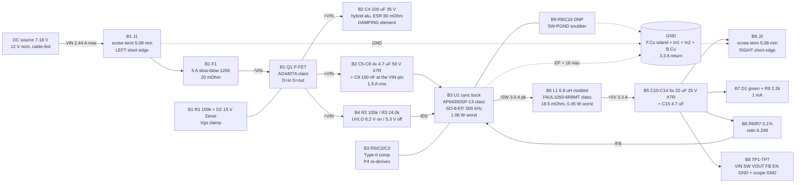

# sbuck-5v3a - block architecture

P2 architect. Merges `requirements.md` + `requirements-answers.md` (delegate =
binding) + all five `research/*` fragments into one decidable architecture.
Companions: `power_tree.md` (budgets), `stackup.md`, `sheets.md` (net names +
refdes), `constraints.json` (machine-readable), `decisions.md` (log).

Lead parts are named by **MPN / part class only**. LCSC codes are P3's job and
are deliberately absent from this package.

---

## 0. Block diagram - signal and power flow

---

## 1. B1 - input entry and reverse-polarity protection

`J1` is a 2-pin 5.08 mm THT fixed screw terminal, **DB128L-5.08-2P class**
(300 V / 16 A, 12-22 AWG) - the only family found that clears both the >= 10 A
and >= 300 V floors at once. Hand-soldered on receipt, DNP in the CPL (Q25).
`F1` is a **Bel Fuse C1T (0685T-series) 5 A slow-blow 1206 chip fuse**,
63 V DC-rated, 20 mOhm, 5.3 A^2s melting I^2t. `Q1` is a **AO4407A-class
SOIC-8 P-channel MOSFET** (-30 V, Vgs +/-25 V, 13 mOhm max at Vgs = -10 V),
drain to input / source to load - the only orientation that blocks a reversed
supply. `R1` (100k, gate to GND) plus `D2` (15 V Zener, anode at gate, cathode
at source) clamp |Vgs|.

**No gate RC.** Q1's body diode is forward-biased in the normal current
direction, so the input bulk charges through the diode and a gate RC cannot
limit inrush at all - it only delays a channel the diode has already bypassed
(`research/power.md` s6, 57 A peak for ~10 us, 1-2 orders inside any SO-8
P-FET's single-pulse SOA). A gate capacitor would also delay turn-off on a
polarity reversal while running. Omit both.

Fuse rating deviates from delegate Q7's "~4 A" - see `decisions.md` D5.

## 2. B2 - input capacitance (the hot loop and the damping element)

`C4` is a **100 uF / 35 V hybrid-polymer aluminium SMD can, KNM2100UF35V149EC0055
class**, 80 mOhm at 100 kHz, 105 C / 2000 h. Its ESR is a **damping
requirement, not a loss**: at 50-300 mOhm it keeps the hot-plug LC ring at
U1's VIN pin near 20 V; a low-ESR polymer (< 20 mOhm) removes the damping and
pushes the ring to 25.4 V, which is over the P-FET's own +/-25 V Vgs rating
and near the 28 V abs-max floor (Q6). A plain electrolytic sits the other side
of the window at 600 mOhm. This is the narrowest sourcing window on the board.

`C5-C8` are **4x 4.7 uF / 50 V X7R 1206 (1206B475K500NT class, Basic tier)**,
~14.7 uF effective at 18 V after bias derating. Four parts, not one, so the
1.50 A rms (worst at Vin = 10 V, INSIDE the range, not at 12 V) and the loop
ESL are shared four ways. `C9` is a **100 nF / 50 V X7R 0603 at the VIN pin**
and is the innermost element of the hot loop.

Every MLCC on this board is **X7R minimum**. The board surface runs 83-87 C;
X5R (85 C) is a latent failure everywhere, not just near U1.

## 3. B3 - the buck converter

`U1` is a **AP64350SP-13 class part (Diodes, SO-8-EP, 3.8-40 V in, 42 V abs
max, 3.5 A, fully integrated synchronous)** running at **500 kHz** set by
`R4` = 200k on RT (`RT[kOhm] = 100000/fsw[kHz]`). Chosen over LMR33630ADDAR and
SY8205FCC - the full argument is `decisions.md` D1, and it is decided on
Rds(on) and documentation quality, not on the current-limit floor.

Headline reasons: it is the only one of the three whose **guaranteed maximum**
Rds(on) (75 / 45 mOhm HS/LS) beats the others' **typical** values (TI 95 / 66;
Silergy 70 / 40 typ with no maximum published at all), which on a board where
the loss budget IS the thermal budget is worth 260 mW = 4.9 C of junction
temperature; its current limit is the only one with a published MINIMUM
(4.25 A) that clears the 4.0 A floor; internal 2 ms soft-start needs no cap;
and its RT pin leaves 500 kHz adjustable if the node proves noisy.

Its two real defects are both handled: the UVLO-divider pathology is removed by
retargeting the thresholds (B4 / D2), and the external compensation is a P4
design task with a vendor-published procedure (below).

`C1` is the **100 nF BST cap**; there is no VCC pin on this part, so nothing
else needs decoupling beyond `C9`.

**Compensation - BINDING P4 INSTRUCTION.** `R5`/`C2` (+ optional `C3` = 47 pF
across R6) form the Type-II network on COMP. The vendor's Table-1 row
(Rcomp 14k, Ccomp 3.3 nF) is quoted for **2x 22 uF** of output capacitance.
Our bank is 5x 22 uF - 2.5x more - so those values are a **starting point that
must be re-derived** with the datasheet's Eqs 12-20 against the real bank.
Copying them lands the crossover near 6.6 kHz, which will not recover a 3 A
load step in 100 us. Target: **fc 25-50 kHz (fsw/20 to fsw/10), phase margin
>= 45 deg**. Authorised escape if the loop cannot be closed there: drop Cout to
4x 22 uF (see B5). This is the riskiest remaining design item on the board.

## 4. B4 - EN / UVLO divider

`R2` (105k, +VIN to EN) and `R3` (24.0k, EN to GND) set **VON ~ 6.2 V rising /
VOFF ~ 5.3 V falling**, 129k total, ~93 uA at 12 V (1.1 mW). EN is a test pad
only, never user-driven (Q14).

The delegate's literal 6.5 / 6.0 V target is **rejected** and the reasons are
worth stating here because they look like arithmetic and are not:

1. AP64350's own divider equations carry a 0.924 coefficient that nearly
   cancels the numerator at a 0.5 V hysteresis gap, forcing R3 = 1.46k /
   R4 = 326 Ohm - a **7-10 mA continuous draw, 81 mW at 12 V and 181 mW at
   18 V**, which is 4-9% of the whole loss budget and 1.5-3.4 C of junction
   temperature, spent on a resistor divider. Widening the gap to 0.9 V fixes it
   completely (129k instead of 1.8k).
2. 0.5 V of hysteresis is **less than the cable drop this board causes**:
   2.44 A through 0.2 Ohm of input cable is 0.49 V. A converter that starts,
   drags its own supply below VOFF, stops, recovers and restarts is
   motorboating. 0.9 V is the fix.
3. VON = 6.5 V is **too close to the 7.0 V spec floor at the threshold's max
   corner**. VEN_H is 1.18 typ / 1.25 max (+5.9%); with 1% resistors the worst
   case VON lands at ~7.0 V, i.e. the converter could legally refuse to start
   at its own minimum rated input. 6.2 V nominal leaves >= 0.2 V.

## 5. B5 - output filter

`L1` is **FAUL1050-6R8MT class** - 6.8 uH molded alloy-composite (Alloy Sponge
Powder core, -55 to +155 C, AEC-Q200), 11.5 x 10 mm, 4.1 mm tall,
**18.5 mOhm max at 20 C -> 24.05 mOhm hot**, still under the 25 mOhm ceiling
*after* hot derating. Conservative (Max-column) Isat 12.3 A and Irms 8.0 A
derate to 10.95 A and 7.06 A at 50 C ambient - 3.1x and 2.4x over what the
circuit asks. Ferrite-wound parts are excluded outright: every one found fails
its own Itemp derated to a 50 C no-airflow ambient, including the best-DCR
candidates.

At 500 kHz / 6.8 uH the ripple is 0.858 A pk-pk (29%) at 12 V and 1.062 A
(35%) at 18 V - inside the 20-40% band and under the 1.2 A ceiling.

`C10-C14` are **5x 22 uF / 25 V X7R 1210 (TCC1210X7R226K250MT class)** =
110 uF nameplate, ~97 uF effective at 5 V. The **load step sizes this bank,
not the ripple**: 50 mV of ripple needs only 4.5 uF, while a 3 A step at the
7 V worst-case line needs 76.5 uF. 5x gives 26% margin. `C15` is a 4.7 uF /
16 V X7R 0805 at the output terminal / test point.

**Authorised reduction: 4x 22 uF (77.4 uF effective, 198 mV at the 200 mV
limit) if and only if the compensation cannot reach fc >= 25 kHz at 5x.
3x is NOT authorised** - it fails the 7 V load step at 264 mV.

## 6. B6 - feedback

`R6` / `R7` set 5.000 V from the 0.8 V reference: ratio 6.249 (e.g. 116k /
22.1k). **Both must be 0.1%** (0.5% absolute floor). This is not gold-plating:
the AP64350's reference tolerance alone (792-808 mV) already spends
-1.2% / +0.84% of the +/-2% window, i.e. 60% of the budget, before any
resistor error. 1% resistors stack +/-2% of ratio error on top and blow the
4.90-5.10 V window at the corner. Divider current 36 uA. The sense point is
**after** the output capacitors; the FB trace and both resistors sit tight to
the FB pin and away from SW and L1 (explicit vendor rule on all three
candidate datasheets).

## 7. B7 - output indicator

`D1` is a **KT-0805G class green 0805 LED** (430 mcd at 5 mA - the only
candidate with a documented low-current intensity figure) with `R8` ~ 2.2k for
~1 mA, ~5 mW total. Visibly dim but adequate; drop R8 to ~1.5k for 2 mA if
brightness matters more than the 0.03% efficiency line.

## 8. B8 - output terminal and test points

`J2` is the **same DB128L-5.08-2P class part as J1**, on the opposite short
edge. Because the two connectors are physically identical, a user swap is a
real failure mode with no active protection (Q30) - the mitigation is
silkscreen only: "VIN 7-18V" / "VOUT 5V 3A" with polarity at each terminal.

`TP1-TP7`: 1.5 mm bare SMD round pads for +VIN, /SW, +5V, /FB, /EN, GND, plus
a dedicated **low-inductance scope-ground pad ~5 mm from the +5V pad** so a
scope spring ground reaches both. No THT loops. The /SW tap is a short stub
that must NOT extend the SW pour - it counts against the 40 mm^2 SW area
budget.

## 9. B9 - DNP snubber

`R9` + `C16`, 0603 each, across SW to PGND, **footprints present, unpopulated**.
No vendor among the three publishes a snubber value; all three lean on internal
mitigation instead. Starting point if bring-up needs it: 10-33 Ohm + 470 pF-2.2
nF. This is general practice, explicitly NOT vendor-sourced. The footprint must
still be routable with low inductance while empty.

---

## 10. BOM ballpark for checkpoint 1

qty-1 LCSC prices from `research/*` (build qty is 5, which is below every price
break, so qty-1 is the build price).

| Line | Class | $ |
|---|---|---|
| U1 buck IC | AP64350SP-13 | 1.88 |
| C10-C14 Cout | 5x 22 uF 25 V X7R 1210 | 1.09 |
| C5-C8 Cin ceramic | 4x 4.7 uF 50 V X7R 1206 | 1.08 |
| L1 inductor | FAUL1050-6R8MT | 0.56 |
| F1 fuse | 0685T5000-01 | 0.51 |
| J1 + J2 | 2x DB128L-5.08-2P | 0.40 |
| Q1 P-FET | AO4407A | 0.27 |
| C4 bulk | KNM2100UF35V149EC0055 | 0.20 |
| R1-R9 (2x 0.1%) | resistors | ~0.20 |
| C1/C2/C3/C9/C15/C16 | small ceramics | ~0.10 |
| D1 LED, D2 Zener, R9 DNP | | ~0.06 |
| **BOM total** | | **~6.35 / board** |

Fab class: **4 layer, 1.6 mm, 1 oz outer / 0.5 oz inner, HASL, 50 x 40 mm,
JLC standard/economic process** - no controlled impedance, no via-in-pad, no
finer than 0.3 mm drill. Roughly $2-4/board of PCB at 5 pieces.

**Flag for the human:** no single line item exceeds the $3 threshold (largest
is U1 at $1.88) and the BOM is comfortably under the ~$12/board target, but
the delivered cost at qty 5 will likely land **$13-16/board** once JLC's PCBA
setup and per-line Extended-tier feeder fees are amortised over only five
boards. That overrun is NRE, not parts, and it disappears at qty 25+. P10
`order_quote` produces the real number.
