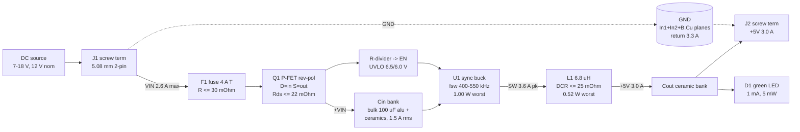

# power.md - sbuck-5v3a rail tree, loss budget, thermal case

P1 research-power-architect. Inputs: `requirements.md`, `requirements-answers.md`
(delegate answers = binding), `reference/topologies/buck.md`, `constraints_schema.md`.
Component-scout results were NOT available (parallel agents), so everything is stated
as a **requirement on a part parameter**, not a part choice. Machine-readable detail
(per-line budgets, all limits) is in `power.json`; this file is the reasoning.

The rail tree is trivial. The value is s2-s7.

---

## 1. Rail tree



| Rail | Vin | Topology | Current | Consumers | Diss (worst) |
|---|---|---|---|---|---|
| `VIN` (raw) | 7-18 V | direct (fuse + P-FET) | 2.6 A max | F1, Q1 | 0.45 W (@ 7 V) |
| `+VIN` (protected) | 7-18 V | direct | 2.6 A max | U1 2.42 A, Cin 1.5 A rms, UVLO div 150 uA | - |
| `+5V` | `+VIN` | synchronous buck | 3.0 A cont. (3.3 A ceiling) | J2 3.0 A, D1 1 mA, Cout 0.31 A rms | 1.52 W (U1+L1 @ 18 V) |
| `GND` | - | plane (In1+In2+B.Cu) | 3.3 A return | all | in the above |

Tradeoffs: **buck not LDO** - an LDO burns `(12-5)*3 = 21 W`, arithmetic not choice.
**Integrated sync not controller+FETs** - wins on area/BOM at 15 W (buck.md s1);
controller is the escape hatch only if no stocked part meets the s2 Rds_on limits.
**P-FET not series diode** - a Schottky costs `0.45*2.44 = 1.10 W`, 54% of the whole
budget. **No aux rail, no sequencing** - regulates whenever `+VIN` > UVLO.

---

## 2. Loss budget at Vin = 12 V, Iout = 3 A (the efficiency spec point)

`Pout = 15.0 W`; `>88%` terminal-to-terminal (delegate Q4) allows
`Ploss = 15.0/0.88 - 15.0 = 2.045 W`.

Design point: `fsw = 500 kHz`, `L = 6.8 uH`, `D = 5/12 = 0.4167`,
`dI = (12-5)*0.4167/(6.8u*500k) = 0.858 A pk-pk (29%)`, `Iin = 1.42 A`
(requirements.md's 88% value - conservative, actual 1.39 A),
`I_L,rms^2 = 3.0^2 + 0.858^2/12 = 9.06 A^2`. Every parameter below is the **maximum
allowed value**, already temperature-derated (Si Rds x1.4-1.5 at Tj 100 C; Cu DCR
x1.30 at 100 C, `alpha = 0.00393/K`).

| # | Contributor | Expression | Budget | **Part limit (P3 must meet)** |
|---|---|---|---|---|
| 1 | Q1 rev-pol P-FET | `Iin^2*Rds = 1.42^2 * 0.035` | 0.071 W | `Rds_on <= 22 mOhm @ Vgs=-4.5 V, 25 C` |
| 2 | F1 input fuse | `Iin^2*Rf = 2.016 * 0.030` | 0.061 W | `R_fuse <= 30 mOhm cold` (Q7) |
| 3 | U1 HS conduction | `Iout^2*D*Rhs = 9*0.4167*0.090` | 0.338 W | `Rds_HS <= 65 mOhm @ 25 C` |
| 4 | U1 LS conduction | `Iout^2*(1-D)*Rls = 9*0.5833*0.060` | 0.315 W | `Rds_LS <= 42 mOhm @ 25 C` |
| 5 | U1 switching | `0.5*Vin*Iout*(tr+tf)*fsw = 0.5*12*3*20n*500k` | 0.180 W | **`(tr+tf)*fsw <= 0.010`** (20 ns @ 500 kHz) |
| 6 | U1 gate drive | `Qg*Vin*fsw = 6n*12*500k` | 0.036 W | `Qg(HS+LS) <= 6 nC` |
| 7 | U1 Coss | `0.5*Coss*Vin^2*fsw = 0.5*100p*144*500k` | 0.004 W | `Coss <= 100 pF` |
| 8 | U1 dead-time diode | `Vf*Iout*2*td*fsw = 0.8*3*2*15n*500k` | 0.036 W | `t_dead <= 15 ns/edge` |
| 9 | U1 quiescent | `Vin*Iq = 12*1m` | 0.012 W | `Iq <= 1 mA` in PWM |
| 10 | L1 DC copper | `I_L,rms^2*DCR = 9.06 * 0.032` | 0.290 W | **`DCR <= 25 mOhm @ 20 C`** |
| 11 | L1 core | allowance @ 0.86 A pk-pk, 500 kHz | 0.150 W | `P_core <= 150 mW` at that ripple/freq |
| 12 | Cout ESR | `(dI/sqrt(12))^2*ESR = 0.0616*0.015` | 0.001 W | `ESR <= 15 mOhm` (non-binding) |
| 13 | Cin ESR | `Icin,rms^2*ESR = 1.48^2*0.009` | 0.020 W | `ESR_eff <= 9 mOhm`, **ceramic** bank |
| 14 | PCB copper | `1.42^2*7m + 9*4m + 9.06*2m + 9*1m` | 0.077 W | `R_VIN<=7, R_+5V<=4, R_SW<=2, R_GND<=1 mOhm` @ 85 C |
| 15 | Screw terminals | `(2*5m)*1.42^2 + (2*5m)*9` | 0.110 W | `<= 5 mOhm per pole`, 10 A class |
| 16 | Bias: LED+UVLO+Zener | `5m + 12^2/120k + 18*30u` | 0.010 W | LED <= 1 mA; divider >= 100 kOhm |
| | **TOTAL** | | **1.710 W** | **eff = 15/16.71 = 89.8%** |
| | **MARGIN to 2.045 W** | | **0.335 W (16%)** | do not spend it in P3 |

Model caveats: line 5 assumes linear V/I crossover, symmetric edges, `iL ~ Iout`, no
reverse recovery (sync; body diode only in dead time) - over-estimates turn-on,
under-estimates turn-off, `+/-40%` on that line. Line 6 charges from `Vin` (driver LDO
is Vin-fed); a BST-referred model would give 15 mW. Line 2 uses the cold 30 mOhm
because a 4 A time-lag element at 1.42 A (36% of rating) barely self-heats. Line 13 is
the *ceramic* bank only - the bulk aluminum's ESL means it carries almost none of the
1.5 A rms at 500 kHz (its ESR is wanted for damping, s6).

**fsw consequence.** Lines 5-9 scale with fsw, so the budget holds to `fsw <= 550 kHz`;
700 kHz is admissible only at `(tr+tf) <= 14 ns` and `Qg <= 4.3 nC`. Also
`t_on(18 V, 500 kHz) = 556 ns` -> require **`t_on,min <= 150 ns`**. Lines 3+4 (0.65 W)
effectively require a **4-6 A-class integrated buck**, not a marginal 3 A part.

---

## 3. Line extremes - which Vin is worst

Same part limits re-evaluated; fuse at 40 mOhm at 7 V (2.44 A = 61% of rating, so it
self-heats).

| Line | Vin = 7 V | Vin = 12 V | Vin = 18 V |
|---|---|---|---|
| `D = 5/Vin`, `dI pk-pk` | 0.714, 0.420 A | 0.417, 0.858 A | 0.278, 1.062 A |
| Q1 + F1 | 0.208 + 0.238 | 0.071 + 0.061 | 0.032 + 0.027 |
| U1 HS / LS conduction | 0.579 / 0.154 | 0.338 / 0.315 | 0.225 / 0.390 |
| U1 sw + gate + Coss + td + Iq | 0.170 | 0.268 | 0.386 |
| L1 DCR + core | 0.289 + 0.050 | 0.290 + 0.150 | 0.291 + 0.230 |
| Cin + Cout ESR | 0.017 | 0.021 | 0.018 |
| PCB Cu + terminals + bias | 0.105+0.150+0.010 | 0.077+0.110+0.010 | 0.070+0.099+0.010 |
| **TOTAL board loss** | **1.969 W** | **1.710 W** | **1.777 W** |
| Efficiency | 88.4% | 89.8% | 89.4% |
| **U1 alone / L1 alone** | 0.903 / 0.338 | 0.920 / 0.440 | **1.001 / 0.521** |

**Worst TOTAL dissipation: Vin = 7 V (1.969 W).** Every input-side `I^2R` term (fuse,
P-FET, terminals, VIN copper) scales as `Iin^2`, and `Iin` is 2.42 A at 7 V vs 0.93 A
at 18 V - a 6.8x multiplier - while the HS switch also conducts for `D = 0.714`.

**Worst HOT PARTS: Vin = 18 V** - U1 1.00 W (switching ~Vin, LS conduction ~`1-D`),
L1 0.52 W (core ~`dI^2`). Both cases matter; s4 shows Tj follows the *total*, so 7 V
wins even for junction temperature.

The **>88% spec is at 12 V only** and is met with 1.8 points of margin. At 7 V the same
parts give **88.4%** - it still clears, with nothing to spare. Low line is not slack.

---

## 4. Thermal case: 50 C ambient, natural convection, no heatsink

50 x 40 mm, 4-layer, 1 oz outer / 0.5 oz inner, open frame on standoffs, both faces
exposed (delegate Q16/Q17/Q21).

**The board IS the heatsink, and it is near-isothermal.** Spreading (fin) length with
In1+In2+B.Cu near-solid: `k*t = 385 * (35+17.5+17.5+35) um * 0.83 = 0.0336 W/K`;
`lambda = sqrt(k*t/2h) = 33 mm` - larger than the board half-dimension (20-25 mm). So
the whole outline participates and the correct model is whole-board, not a local patch.

**Board-to-ambient:** `A_eff = 2 faces * 2000 mm^2 * 0.85 (shadowing) = 3400 mm^2`;
`h_conv = 1.42*(dT/L)^0.25 = 1.42*(37/0.05)^0.25 = 7.4 W/m^2K`;
`h_rad = 0.9*sigma*(Ts^2+Ta^2)(Ts+Ta) = 8.2 W/m^2K` (eps 0.9, Ts 360 K, Ta 323 K);
**`R_ba = 1/(15.6 * 3.4e-3) = 19 C/W`**. Radiation is 53% of the cooling - do not paint
or box the board; delegate Q16 (open frame) is load-bearing.

**Junction ladder** `Tj = Ta + P_board*R_ba + dT_local + P_IC*(theta_JC,bot + R_via)`:

| | 7 V | 12 V | 18 V |
|---|---|---|---|
| Ambient | 50.0 | 50.0 | 50.0 |
| `P_board * 19` | +37.4 | +32.5 | +33.8 |
| board non-uniformity near U1 | +6 | +6 | +6 |
| `P_IC * (5 + 2)` junction -> plane | +6.3 | +6.4 | +7.0 |
| **Tj** | **99.7 C** | **94.9 C** | **96.8 C** |
| T_board surface | 87.4 C | 82.5 C | 83.8 C |
| T_L1 surface (`T_board + 4 + P_L*30`) | 101.6 C | 99.7 C | 103.4 C |

**Derated limit: Tj_design <= 105 C** = 125 C junction spec (the *floor* across
candidate families; most spec 150 C, which would make the margin 53 C) minus 20 C
design margin. 20 not 25 because 50 C ambient is a hard maximum and 99.7 C is already
worst-of-worst-cases (every part at its budget limit, 7 V, 3 A).

**Result: worst Tj = 99.7 C at 7 V. Closes with 5 C margin - only if s2 holds.**

**Sensitivity:** `dTj/dP_board = 19 C/W`, `dTj/dP_IC = 26 C/W`. Every extra 100 mW
*anywhere on the board* costs 1.9 C of junction. The 0.335 W efficiency margin is also
6.4 C of thermal margin. **The loss budget IS the thermal budget** - a 100 mOhm
inductor instead of 25 mOhm adds 0.68 W and 13 C.

### 4.1 Package limit (P3 selection)

Referred to the IC alone with the rest of the board's loss present:
`theta_JA,eff = (99.7-50)/0.903 = 55 C/W`.

- **on-board `theta_JA <= 55 C/W`**, of which only **16 C/W** is the IC's own local
  path (`(105-50) - 37.4 - 6 = 11.6 C` over 0.90-1.00 W). The ladder spends 7 C/W.
- **exposed-pad package with `theta_JC(bottom) <= 5 C/W` and datasheet
  `theta_JA (JESD51-7 2s2p) <= 45 C/W`.** Non-pad packages (SOT-23-6, SOIC-8,
  TSOT-23-8 without pad) are **excluded outright** - 100-200 C/W cannot pass 1 W.
- Derate the datasheet 2s2p figure ~1.25x for this board (2000 mm^2 with 0.5 oz inners
  vs JESD51-7's 76 x 114 mm with 1 oz planes).

### 4.2 Required copper area (P6 acts on this)

The brief forbids assuming the exposed pad closes it. **It does not:** 6 mm^2 of F.Cu
-> repo model `theta_JA = 45 + 95*exp(-6/235) = 138 C/W` -> `Tj = 188 C`. The planes
carry the heat.

| Layer | Requirement | Why |
|---|---|---|
| F.Cu | GND island contiguous with U1's pad, **>= 100 mm^2** (10 x 10 mm), not fragmented by SW/VIN | first spreading hop |
| In1.Cu | **solid GND, no split within 12 mm of U1** (>= 400 mm^2) | brief's uninterrupted plane under the switches; only 0.21 mm below the pad |
| In2.Cu | **GND as well** (not a power plane), >= 400 mm^2 under U1 | see below |
| B.Cu | GND pour **>= 1500 mm^2** of 2000 | second radiating face (Q26 reserves it anyway) |
| all | GND within 14.3 mm of U1 summed over layers **>= 650 mm^2** | exactly what `check_thermal` measures (`A_sat = 645`); 529 mm^2 is the bare pass |

**In2 must be GND, not a power plane:** (a) 0.5 oz needs 3.0-4.1 mm width per net (s7)
so it is useless as a power plane; (b) two solid GND inners give the brief's single
low-impedance reference with no splits; (c) it doubles inner spreading conductance,
which is what makes `lambda = 33 mm` and the whole-board model valid.

**2 oz outer copper does NOT rescue this design.** `R_ba` is set by area and h, and the
board is already isothermal at 1 oz (<5% gain). Spend the Q21 escalation only if s7's
widths cannot be routed.

### 4.3 Consequences for every other part

Board surface is **83-87 C**, not 50 C. Therefore:
- **All MLCCs X7R (125 C) minimum. X5R (85 C) is not acceptable anywhere.**
- Input bulk aluminum: **105 C / >= 2000 h**, placed at the *input* edge (coolest
  corner ~80 C). Life = `2000 * 2^((105-80)/10) = 11,300 h` (~1.3 y continuous) -
  acceptable for a bench module; flag to P3 if longer life is wanted (but see the
  ESR/damping requirement in s6, which rules out low-ESR polymer).
- L1: rated **>= 125 C**; `Isat >= 6 A at 105 C` (must beat the IC's *max* current
  limit, not the 4 A minimum spec); `Irms(40 C rise) >= 4.0 A`; prefer >= 7.3x7.3 mm
  molded/composite (`theta ~30 C/W` assumed; a 10x10 mm part gives ~22 C/W, 4 C relief).
- Q1: 0.208 W worst - below the 0.5 W constraint threshold, but give it **>= 50 mm^2**
  of drain+source copper (it sits on an 87 C board).
- F1: 0.238 W worst. Fuses run hot by design; **>= 20 mm^2 per pad**, kept off the
  U1/L1 zone.

---

## 5. Thermal via array under U1

**0.3 mm drill, 0.55 mm land, 1.0 mm pitch, filling the exposed pad; minimum 9, target
16.** Plus a ring of 8-12 stitching vias at 1.2 mm pitch in the surrounding F.Cu GND
island (outside the pad - no paste concern).

```
A_barrel = pi/4 * (0.30^2 - 0.25^2) = 0.0216 mm^2  (25 um plating)
R_1via(F.Cu -> In1, 0.21 mm prepreg) = 0.21e-3 / (385 * 2.16e-8) =  25.3 K/W
R_1via(F.Cu -> B.Cu, 1.6 mm)         = 1.60e-3 / (385 * 2.16e-8) = 192.4 K/W
array of N at 0.85 crowding efficiency: R = R_1via / (0.85*N)
   9 vias -> 3.3 K/W to In1      16 vias -> 1.9 K/W to In1
```

Cross-check: Wurth FEA array table (11x11 pad, 1.6 mm, 2-layer, via-to-bottom):
9 -> 7.3, 16 -> 5.2, 25 -> 3.8 C/W (`ai-library/pcb-verification-standards-2026`).
That is the full 1.6 mm on 2 layers; this stackup reaches In1 at 0.21 mm, so the
analytic 1.9 K/W is right here and 5.2 C/W is the conservative bound.
**The s4 ladder claims 2 C/W (16 vias).** With 9 it becomes 3.3 C/W and Tj rises 1.3 C
- still inside margin, so 9 is acceptable on a small pad (2.5 mm pad fits 3x3 at 1.0 mm
pitch; 3.4 mm fits 4x4).

Fab (P9): 0.3 mm is JLC standard-class minimum drill (Q27). Tent with soldermask on the
**bottom** side to stop wicking; do not buy filled-and-capped via-in-pad. Windowpane
U1's paste aperture (4-9 sub-apertures, ~60-70% area) so the array does not float it.

**P8 note:** `check_thermal` emits its via warning only when `dt_c/power_w < 51.1`; at
the constraint values (55/1.0) it will not fire. The 16-via array is a **P6/P7
requirement enforced by review**, not by the script. A clean `check_thermal` is not
proof the array exists.

---

## 6. Inrush at hot-plug of an 18 V supply - definite answer

`C_in = 120 uF` (100 uF aluminum + ~20 uF of DC-bias-derated ceramics), 1 m cable
(`L ~ 1 uH`), path R (cable + fuse + terminals + cap ESR) 0.10-0.30 Ohm.
`E_stored = 0.5*120u*18^2 = 19.4 mJ`; the source delivers `2E = 38.9 mJ` (half is
always dissipated in the path).

**The circuit fact that decides it:** Q1 is drain-to-input / source-to-load - the only
orientation that blocks a reversed supply - so its **body diode is forward-biased in
the normal current direction**. The bulk charges *through the body diode*; the channel
plays no part. **A gate RC therefore cannot limit inrush at all**; it only delays a
channel the diode has already bypassed.

```
diode charge phase: E = Vf*C*V = 0.8 * 120u * 18 = 1.73 mJ
I_pk <= min(V/R_path, V*sqrt(C/L)) = min(18/0.30, 197) = 57 A ; tau = RC = 36 us
P_pk = 0.8 V * 57 A = 46 W for ~10 us
die rise = 1.73 mJ / C_th(~3e-4 J/K, small MOSFET die) ~ 6 C
```
46 W for 10 us is one to two orders inside the single-pulse SOA of any SO-8/DFN P-FET.
**VERDICT: benign. Do not fit a gate RC.**

What *is* required at hot-plug, and is easy to miss:

1. **Vgs clamp - mandatory.** `|Vgs| = Vin`: 18 V steady, ~25 V on a ring. A 20 V-Vgs
   part has 10% margin steady and **none** on the ring. Fit `R_gate = 100 kOhm`
   gate-to-GND plus a **15 V Zener gate-to-source** (anode at gate); bias loss
   `(18-15)/100k * 18 = 0.54 mW`. This is what delegate P1's "confirm the Vgs rating"
   resolves to.
2. **Ringing at U1's VIN pin**, `zeta = (R/2)*sqrt(C/L)`:

   | R_path | zeta | V_peak at Cin |
   |---|---|---|
   | 0.30 Ohm (1 m 18 AWG + ESR-ful electrolytic) | 1.64 | 18.0 V (overdamped) |
   | 0.10 Ohm | 0.55 | 20.3 V |
   | 0.05 Ohm (short thick cable, all-ceramic Cin) | 0.27 | **25.4 V** |

   Hence delegate Q6's `IC abs-max >= 28 V` and input MLCC `>= 50 V` - and it makes the
   bulk cap's ESR a **damping requirement: 50-300 mOhm**. A low-ESR polymer bulk
   (<20 mOhm) would *remove* the damping and push the ring toward 25 V. Use a plain
   105 C aluminum electrolytic, and accept the s4.3 life note.
3. **Fuse survives:** `I^2t = I_pk^2*tau/2 = 57^2*36u/2 = 0.058 A^2s` (0.30 Ohm), 0.19
   A^2s at the 0.10 Ohm worst case, vs ~1.5-4 A^2s melting `I^2t` for a 4 A time-lag
   part - **>= 8x margin**, no nuisance opening.
4. Soft-start makes `Cout` invisible to the source (buck.md s3): U1 starts only after
   `+VIN` passes the 6.5 V UVLO, by which time the transient is over.

Design note: with `R_gate` alone, a polarity reversal *while running* turns Q1 off in
microseconds; a gate capacitor would hold it on for `R*C` and buys nothing on inrush -
**omit the gate capacitor**.

---

## 7. Copper sizing (IPC-2152)

Computed with the exact model `check_current` applies at P8 (IPC-2152 10 C chart at
1 oz, `i_equiv = I*(10/dT)^0.44`, cross-section scaled by layer copper).

**Use `dT = 10 C`, not 20 C.** IPC-2152's rise is above the *local board* temperature,
and s4 puts that at 83-87 C; a 20 C rise would put copper at 105 C. The 10 C widths
route fine here, so there is no reason to take the brief's upper bound.

| Net | Design current | **1 oz OUTER @ dT=10** | 1 oz outer @ dT=20 | 0.5 oz INNER @ dT=10 | route |
|---|---|---|---|---|---|
| `VIN`/`+VIN` | 2.6 A (`15/(7*0.884) = 2.42` + margin) | **1.52 mm** | 1.05 mm | 3.04 mm | 1.8 mm |
| `SW` | 3.6 A (`3.0 + dI/2` at 18 V) | **2.31 mm** | 1.56 mm | 4.62 mm | 2.5 mm |
| `+5V` | 3.3 A (3.0 A spec + 10%) | **2.06 mm** | 1.40 mm | 4.11 mm | 2.5 mm |
| `GND` return | 3.3 A | **2.06 mm** (any neck) | 1.40 mm | 4.11 mm | plane, no neck < 2.1 mm |

Signal nets (`FB`, `EN`, `BST`, test taps): 0.25 mm default.

**SW width-vs-EMI conflict, resolved:** buck.md s5 demands minimal SW copper, IPC-2152
demands 2.31 mm. Both hold because IPC constrains *width* and EMI constrains *area*:
make SW a **short wide pour** - 2.5 mm wide, <= 8 mm long, <= 40 mm^2, F.Cu only, never
inner, never near the board edge or a connector.

**0.5 oz inners cannot carry these rails** (3.0-4.6 mm per net). This independently
confirms s4.2: **In1 and In2 both solid GND, no power net on an inner layer.** All of
`VIN`/`+VIN`/`SW`/`+5V` stays on F.Cu, which single-sided assembly (Q26) makes natural.

**Vias:** at the 0.5 A/via default a transition needs 7 vias on `+5V`, 6 on `VIN`, 8 on
`SW`. **Design so there are none.** GND is plane-fed through the stitching field.

**Trace resistance targets** (budget line 14; 1 oz sheet resistance at 85 C is
`0.489 * 1.24 = 0.61 mOhm/sq`): `R_VIN <= 7 mOhm` (20 mm at 1.8 mm = 6.8), `R_+5V <= 4`
(15 mm at 2.5 mm = 3.7), `R_SW <= 2`, `R_GND <= 1`. Longer routes shrink the efficiency
margin at 19 C/W of junction temperature per watt.

---

## 8. Assumptions and limits of this analysis

- **No blocking safety question.** 3.0 A sits *on* the >3 A threshold; requirements s8
  and the delegate answers already resolved it (high-current sizing, no certification
  path). Applied conservatively: IPC-2152 at dT=10, 10 A-class terminals, 4 A fuse,
  explicit `GND` return declaration.
- `fsw = 500 kHz`, `L = 6.8 uH` are the budget's *assumed design point* (Q32 band
  400-700 kHz; buck.md s2). If P2/P3 land elsewhere, re-run lines 5-11 - the
  `(tr+tf)*fsw <= 0.010` and `dI <= 1.2 A` forms are frequency-independent and are the
  actual requirements.
- Convection/radiation are textbook flat-plate correlations, not measured: `+/-30%` on
  `R_ba = 19 C/W`. The repo `check_thermal` model independently gives 51 C/W for a
  saturated 645 mm^2 patch, which is the same physics
  (`1/(15.6 * 2*645e-6) = 50 C/W`) - the two agree, which is why the whole-board number
  is trusted here.
- Net names `VIN`/`+VIN`/`SW`/`+5V`/`GND` are this fragment's proposal; **P2 must
  reconcile `power.json` to the final netlist names before P5.**
- Not decided here (component-scout / part-sourcer own them): actual part numbers;
  exact Cin/Cout values and counts; UVLO divider values; the FB/compensation network.

Sources: `requirements.md`, `requirements-answers.md`,
`.claude/skills/ai-ee/reference/topologies/buck.md`,
`scripts/check_current.py` (IPC-2152 table + dT scaling),
`scripts/check_thermal.py` (theta_JA-vs-area model),
`C:/dev/ai-library/pcb-verification-standards-2026/findings.md` (Wurth FEA thermal-via
array; JEDEC JESD51 / TI SLOA122 provenance).
