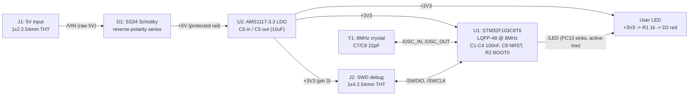

# stm32-blinky - block architecture

2-layer, target outline 35 x 30 mm (hard limit 50 x 40). 6 blocks, 18 placed
parts, single 3.3 V rail. All parts JLC Basic except the brief-specified
STM32F103C8T6 (Extended). Research phase was skipped (recorded P1 decision);
part candidates below come from standard STM32F103 minimal-application
practice and mirror the repo's proven `tests/golden/blinky2` reference where
the two boards agree. Exact LCSC codes are candidates for P3 part-sourcer to
verify stock/class.

## Diagram (signal + power flow)

GND is common throughout and returns on the B.Cu pour (planes_gen default for
2-layer); not drawn as edges. Power flows left to right: J1 -> D1 -> U2 ->
everything.

## Blocks

### Power input + reverse protection (J1, D1)
J1 = 1x2 2.54 mm male THT header, pin 1 = +5 V (/VIN), pin 2 = GND, polarity
silk-marked. External pre-regulated 5 V (assumed 4.5-5.5 V). D1 = SS34 (SMA,
40 V / 3 A Schottky, candidate LCSC C8678, Basic) in SERIES: reversed input
simply does not conduct. Chosen over a P-FET (AO3401A) because at this load
the ~0.3 V drop still closes the LDO headroom math and the diode has no
orientation/gate subtleties; see power_tree.md for the worst-case numbers and
the P-FET escalation path. THT headers assumed hand-soldered if economy THT
assembly is unavailable (requirements sec 7).

### Regulation (U2, C5, C6)
U2 = AMS1117-3.3, SOT-223 (candidate LCSC C6186, long-standing Basic part,
stated in the brief as "AMS1117-class"). C6 = 10 uF input, C5 = 10 uF output
(X5R ceramic, 0805). Output tab carries +3V3. ~55 mA design load: dissipation
~0.08 W, no thermal measures needed (power_tree.md).

### MCU core (U1, C1-C4, C9, R2)
U1 = STM32F103C8T6, LQFP-48 (candidate LCSC C8734; Extended - the one
Extended part on the board, per the requirements' explicit-part override).
Decoupling per the proven golden set: 100 nF at each VDD pair (C1 pin 48,
C2 pin 24, C3 pin 36) and VDDA (C4 pin 9); LDO's C5 doubles as bulk on this
small board. C9 = 100 nF on NRST (ST AN2586 noise immunity; reset via SWD or
power cycle - no button, per approved P0 answer). R2 = 10 k BOOT0 pulldown to
GND (run-from-flash; not a jumper - BOOT0 strapping is part of the minimal
application circuit, not an "extra"). VBAT tied to +3V3 (no battery). PB2
(BOOT1) left floating - don't-care with BOOT0 = 0; unused GPIOs get
no-connect flags at P4.

### Clock (Y1, C7, C8)
Y1 = 8 MHz crystal, HC-49S SMD, CL = 20 pF (candidate LCSC C32828, Basic;
3225 body is the alternate if P3 finds better Basic stock). C7/C8 = 22 pF
C0G load caps (matches the golden; effective CL slightly under spec pulls
frequency a few tens of ppm fast - irrelevant with no USB/RTC precision
need). /OSC_IN and /OSC_OUT are declared high_speed with GND reference in
constraints.json so the return-path check and guaranteed GND pour cover the
oscillator loop; the xtal placement group keeps C7/C8 at the crystal.

### User LED (D2, R1)
D2 = red LED 0603/0805 (Basic candidate C2286/C84256). Driven from PC13
ACTIVE-LOW: +3V3 -> R1 -> /LED_A -> D2 anode, cathode -> /LED -> PC13, MCU
sinks. PC13 is the Blue Pill firmware convention (every F103 blinky example
targets it) but is a 3 mA-limited pin that must not SOURCE current (ST
DS5319); sinking ~1.3 mA with R1 = 1 k respects the limit with margin and is
plenty for a modern indicator LED.

### SWD debug (J2)
J2 = 1x4 2.54 mm male THT header. Canonical pin order (silk-labeled), per the
requirements' listing: 1 = SWDIO, 2 = SWCLK, 3 = 3V3, 4 = GND. No NRST pin
(4-pin header per brief); connect-under-reset not available - flash via SWD
on a running/power-cycled chip. Order is a convenience only: ST-Link clones
jumper-wire each signal individually.
