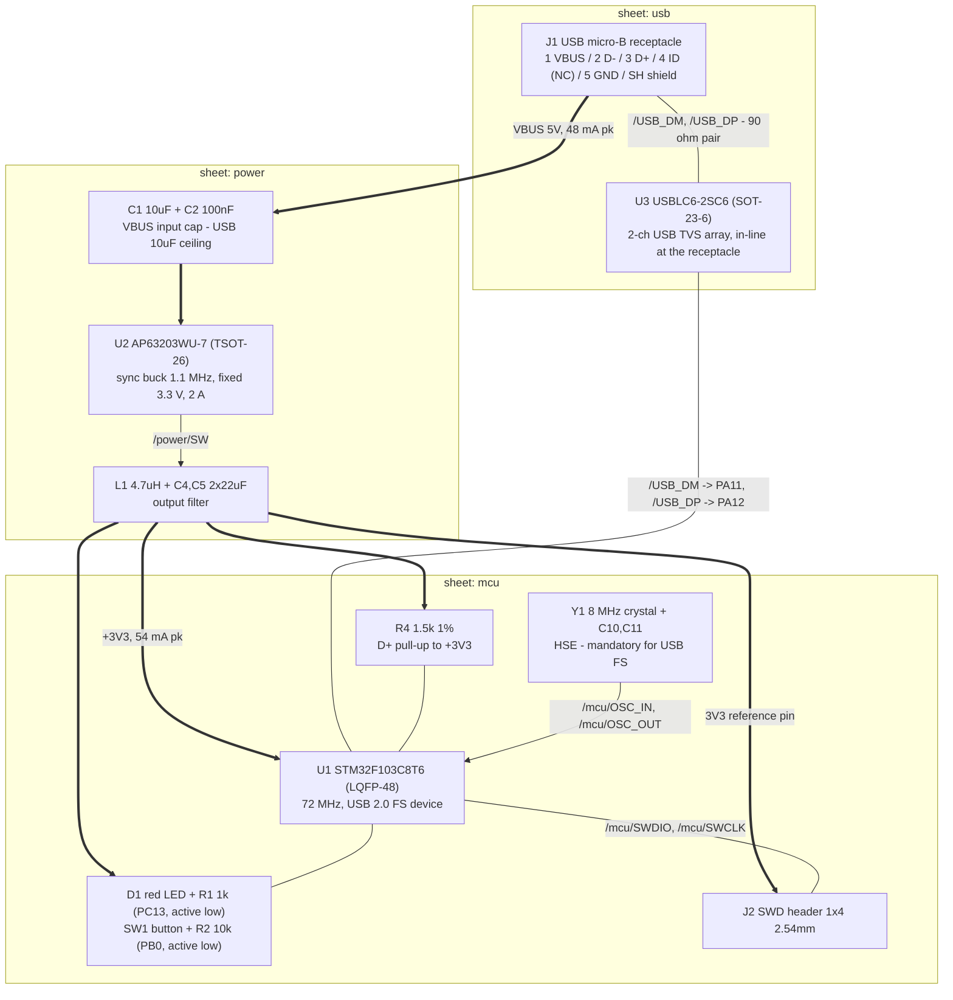

# usb-buck - block diagram

Five functional blocks on three hierarchical sheets. Signal flow is thin
arrows, power flow thick (`==>`). GND is a global plane net (In1.Cu) and is
deliberately not drawn as edges.

## USB port + ESD (sheet `usb`)

Lead part: **USB micro-B receptacle**, SMD, 5-pin + shield tabs (part class;
KiCad symbol `Connector:USB_B_Micro`, `SH` renumbered to 6 by the pipeline).
It is the board's only external power source and its only exposed signal
pair, so it also carries the ESD block: one **USBLC6-2SC6** (SOT-23-6, the
part ST's AN4879 Table 11 names for USB FS) sits in-line so `/USB_DP` and
`/USB_DM` pass THROUGH it with no stubs and its GND pin drops straight into
the In1 plane. A matched 2-channel array (not two singles) is required
because USB 2.0 7.1.6.1 caps the D+/D- capacitance mismatch at 10%. Pin 4
(ID) is left unconnected - device only, no OTG. The shell bonds directly to
GND (decision 5). No series resistors, no ferrite beads, no edge-rate caps on
the pair.

## Buck regulation (sheet `power`)

Lead part: **AP63203WU-7** (Diodes Inc., TSOT-26), named by the brief and
endorsed by the power research: synchronous, 1.1 MHz, fixed 3.3 V (3.27-3.33
V), PFM at light load, 2 A capable against a 54 mA load. Its external set is
fixed by DS41326 Table 2: `L1` 4.7 uH (the table says 3.9 uH; 4.7 uH is the
nearer standard value and the datasheet favours larger L at light load),
`C1` 10 uF input, `C4`/`C5` 2 x 22 uF output, `C3` 100 nF bootstrap, plus
`C2` 100 nF HF bypass at VIN. FB is NOT a divider node on this fixed-output
member - it ties straight to the +3V3 sense point. EN ties to VBUS. The
10 uF input cap is simultaneously the datasheet value and the USB inrush
ceiling (see power_tree.md s3) - nothing else capacitive may sit on VBUS.

## MCU core + clock (sheet `mcu`)

Lead part: **STM32F103C8T6** (LQFP-48), stated by the brief. USB FS device
firmware forces 72 MHz off the PLL, which forces an **8 MHz HSE crystal**
(`Y1`, +/-30 to +/-50 ppm, CL 20 pF class) - the F103 has no crystal-less USB
and HSI cannot clock the USB peripheral. The F103 also has NO embedded D+
pull-up, so `R4` 1.5 k 1% to +3V3 is mandatory, not optional (the 10 k seen
on Blue Pill clones fails enumeration). Decoupling follows ST's F1 scheme:
100 nF per VDD/VSS pair, one 4.7 uF bulk, and a dedicated 1 uF + 100 nF pair
on VDDA - kept (not waived as on the stm32-blinky board) because VDDA sits
directly on a 1.1 MHz switching rail and the USB transceiver needs 3.0-3.6 V
clean. BOOT0 gets a fixed 10 k pull-down; NRST gets 100 nF.

## User I/O (sheet `mcu`)

Lead parts: **red 0603 LED** + 1 k 0603 series resistor on PC13 (active low,
1.4 mA), and an **SMD tactile switch** to GND on PB0 with a 10 k pull-up
(`R2`). Red is chosen over green/blue because a 3.3 V rail leaves too little
headroom over a 2.9-3.2 V green Vf for a predictable current. PC13 sinks the
LED, which caps the current at ST's 3 mA limit for the PC13-15 backup-domain
pins - that constraint, not brightness, sets R1 = 1 k (decision 2). The
button's external pull-up gives a defined level with zero firmware, since the
F103 resets its GPIOs to floating inputs.

## Debug (sheet `mcu`)

Lead part: **1x4 2.54 mm THT pin header**, unshrouded, hand-soldered after
PCBA (the brief permits hand-solderable connectors; JLC economy assembly is
SMT-only). Pin order 1 = +3V3, 2 = SWCLK, 3 = GND, 4 = SWDIO - the ST Nucleo
CN4 debug-row order minus NRST/SWO, so an ST-Link ribbon maps 1:1. The 3V3
pin is a REFERENCE OUTPUT: powering the board from the debugger would
back-drive the buck output. Silkscreen every pin. With no BOOT0 jumper (the
brief's user button is explicitly not a boot selector), SWD is the only
programming path - accepted.

## Rough part cost

BOM ~$2.50-3.50/board, dominated by the STM32 (~$1.5-2.5). 4-layer PCB
$9.90/10 boards. See stackup.md for the full fab-class cost picture.
