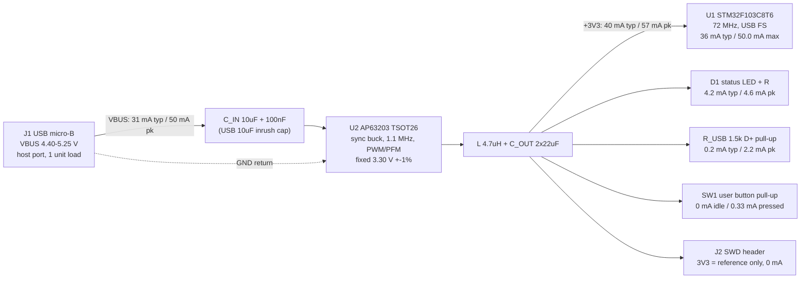

# Power architecture - usb-buck

Single-source, single-regulated-rail board. USB VBUS (5 V) in, one AP63203
synchronous buck to +3V3, everything on that rail. Peak board draw from the
host is ~50 mA - half of one USB unit load - so the board can be declared a
LOW-POWER USB function and never has to argue about the 500 mA case.

All currents below trace to a named consumer with a datasheet citation.
Sources listed at the bottom.

## 1. Rail tree



## 2. +3V3 budget (the only regulated rail)

| Consumer | Typ | Peak | Basis |
|---|---|---|---|
| U1 STM32F103C8T6, 72 MHz, code from Flash, all peripherals enabled | 36.0 mA | 50.0 mA | typ: DS5319 Rev19 Table 17 (TA 25 C, VDD 3.3 V). peak: Table 13 max, TA 85 C (50.3 mA at 105 C, out of scope) |
| D1 status LED + series R (assume red Vf ~1.9 V, 330 ohm) | 4.2 mA | 4.6 mA | Ohm: (3.30-1.9)/330; peak at rail max 3.33 V and Vf min 1.8 V |
| USB D+ 1.5 kohm pull-up to +3V3 | 0.2 mA | 2.2 mA | typ = idle J into the host's 15 kohm pull-down, 3.3/(1.5k+15k); peak = host drives D+ low, 3.3/1.5k |
| SW1 user button, 10 kohm pull-up (current only while pressed) | 0 mA | 0.33 mA | 3.3/10k. Zero if the MCU's internal pull-up (30-50 kohm) is used instead |
| BOOT0 10 kohm pull-down, NRST RC, crystal load caps, decoupling | 0 mA | 0 mA | pull-down returns to GND, not the rail; the rest is AC only. NRST internal pull-up is already inside IDD |
| ADC analog block (not used by the stated function) | 0 mA | 0 mA | DS5319 Table 17 note 2: +0.8 mA per ADC only while ADON is set |
| **Sum** | **40.4 mA** | **57.1 mA** | |
| **+30% headroom on peak** | | **74 mA** | |
| **Declared `current_a`** | | **0.10 A** | rounded up to the 1-unit-load design ceiling (see s5) |

Conservatism note: the "all peripherals enabled" column is the bound used
above. This firmware runs USB FS + two GPIOs + a timer or two, so the honest
expectation is nearer the "all peripherals disabled" column (27 mA typ /
32.8 mA max, same tables). Budgeting the enabled column costs nothing here.

72 MHz is not optional: USB FS needs a 48 MHz USB clock, which on the F103
comes from the 72 MHz PLL divided by 1.5. There is no lower-power operating
point that keeps USB alive.

## 3. VBUS budget (input rail)

| Consumer | Typ | Peak | Basis |
|---|---|---|---|
| U2 AP63203 input current | 31.4 mA | 44.3 mA @ 5.00 V / 50.4 mA @ 4.40 V | P_out = 3.3 V x I_3V3 (s2), P_in = P_out / 0.85, I_in = P_in / V_bus |
| U2 quiescent (no-load, non-switching) | 22 uA | 22 uA | DS41326 EC table, IQ |
| Anything else on VBUS | 0 | 0 | nothing else is fed from VBUS |
| **Sum (worst case = 4.40 V in)** | **31 mA** | **50 mA** | |
| **+30% headroom on peak** | | **66 mA** | |
| **Declared `current_a`** | | **0.10 A** | same 1-unit-load ceiling |

Efficiency is an ESTIMATE, not a datasheet curve. DS41326 publishes
efficiency only for VIN 12 V / 24 V, VOUT 5 V (Figures 4-5) and quotes "up to
88% at 5 mA" / "up to 80% at 1 mA" light-load figures without stating VIN.
At VIN 5 V -> VOUT 3.3 V the step-down ratio is mild (D ~ 0.66) and the part
is in PFM at these loads, so 85% is a reasonable central estimate. Sensitivity:
80% -> 47 mA VBUS peak and 47 mW in the regulator; 90% -> 42 mA and 21 mW.
Every conclusion in this document holds across that whole range.

Total input power: **0.22 W peak, 0.16 W typical** at 5 V.

## 4. Topology per rail

| Rail | Vin | Topology | Part | Why (one line) |
|---|---|---|---|---|
| VBUS | USB host port | direct (no series element) | - | Host ports are already current-limited and the connector is keyed; adding a fuse/PTC/ferrite buys nothing on a bench prototype and would only add DC drop and an LC to damp |
| +3V3 | VBUS 4.40-5.25 V | buck (sync, 1.1 MHz, PFM at light load) | AP63203WU-7 | Named in the brief; 33 mW of self-heating vs 97 mW for a linear, and 2 A of headroom the board will never use |

### The honest buck-vs-LDO call

At 57 mA peak this is a load where a buck is arguably overkill:

| | AP63203 buck | 3.3 V LDO (e.g. SOT-23-5, JLC Basic) |
|---|---|---|
| Parts | IC + 4.7uH inductor + C_IN + 2x C_OUT + 100nF BST = 6 | IC + C_IN + C_OUT = 3 |
| VBUS draw at 57 mA load | 44 mA @ 5 V | 57 mA (a linear passes the load current) |
| Regulator dissipation | 33 mW (dT_j ~3 C at 89 C/W) | 97 mW at 5.0 V in, 111 mW at 5.25 V (dT_j ~20-25 C in SOT-23-5) |
| Layout burden | 1.1 MHz switch node, tight VIN loop, ripple on +3V3 (which is also VDDA) | none |
| BOM cost | ~10x the LDO | pennies |
| Headroom | 2 A | typically 300-500 mA |

Both are compliant, both stay under one unit load, and neither has a thermal
problem. The buck's real wins here are the 13 mA of input current it saves
(23% of the input budget) and 64 mW less heat; the LDO's win is three fewer
parts and no switching noise on the rail that also feeds VDDA.

**The brief names the AP63203, so the buck stands.** If the architect wants
the simpler board, an LDO is a defensible override and nothing else in this
document changes except: rail dissipation 0.10 W (still under the 0.5 W flag),
VBUS `current_a` unchanged at 0.10 A, and the input cap discussion in s6
still applies verbatim.

## 5. USB power stance (pre- vs post-enumeration)

- Unit load = 100 mA (USB 2.0 s7.2.1). A device may draw at most one unit
  load until it has been configured; a high-power function may then go to
  five unit loads / 500 mA (s7.2.1.4).
- **This board's peak draw is ~50 mA at the connector - half a unit load.**
  So it qualifies as a low-power bus-powered function (s7.2.1.3) and never
  needs the post-enumeration allowance. Declare `bMaxPower` <= 50 (100 mA in
  the 2 mA units of the configuration descriptor, s9.6.3); 0x19 (50 mA) is
  defensible and honest.
- Practical stance on the brief's "500 mA budget": treat it as the port's
  capability, not this board's entitlement. Designing to <=100 mA means the
  board is legal on the most pessimistic port, on a bus-powered hub, and
  before enumeration - with no firmware-timed load switching.
- Worst-case rail voltage at the connector is **4.40 V** (the floor a
  low-power function must work at, s7.2.1.3/s7.2.2), not 4.75 V. That is what
  the VBUS peak current above is computed at. It is still far above the
  AP63203's 3.8 V minimum VIN and its 3.50 V typ rising UVLO, and D = 3.3/4.4
  = 0.75 gives t_on = 682 ns against an 80 ns minimum on-time - no dropout,
  no pulse-skipping risk.
- The AP63203's fixed output is 3.27-3.33 V (DS41326 EC, VFB row, CCM), well
  inside the F103's 2.0-3.6 V VDD range with margin at both ends.

## 6. Inrush and input capacitance vs the USB 10 uF limit

USB 2.0 s7.2.4.1 (Inrush Current Limiting): "The maximum load (CRPB) that can
be placed at the downstream end of a cable is 10 uF in parallel with 44 ohm.
The 10 uF capacitance represents any bypass capacitor directly connected
across the VBUS lines in the function plus any capacitive effects visible
through the regulator in the device... If more bypass capacitance is required
in the device, then the device must incorporate some form of VBUS surge
current limiting." The hub-side requirement it protects is a max VBUS droop
of 330 mV. USB-IF compliance turns this into a charge test: current above
100 mA is integrated for 100 ms after attach and the worst region must be
<= 50 uC (= 5 V x 10 uF).

Design call:

- **C_IN = one 10 uF MLCC + 100 nF at the AP63203 VIN pin. Nothing else on
  VBUS.** 10 uF nominal x 5 V = 50 uC, exactly the pass limit even crediting
  zero DC-bias derating; in reality a 10 uF X5R/X7R 0805 at 5 V bias measures
  ~6-8 uF, so real inrush charge is ~30-40 uC. DS41326 Table 2 asks for
  C1 = 10 uF, so datasheet and USB spec agree at the same number - convenient,
  but it means there is **no room left for a second bulk cap on VBUS**.
- If the architect adds anything capacitive to VBUS (an ESD/TVS array is fine
  - it is a shunt with pF-scale capacitance - but a bulk electrolytic is not),
  drop C_IN to 4.7 uF or add a soft-start/inrush limiter per s7.2.4.1.
  At 57 mA load the input RMS ripple current is only ~28 mA
  (I_out x sqrt(D(1-D))), so 4.7 uF is electrically sufficient here; the
  10 uF is datasheet-conformance margin, not a hard need.
- **The 44 uF of output capacitance does NOT count against the USB limit**,
  because the AP63203's built-in 4 ms soft-start (DS41326 EC, tSS) controls
  how fast it charges. Charging 44 uF to 3.3 V in 4 ms is 36 mA average on
  the output side, ~28 mA reflected to VBUS - added to the MCU's own startup
  current, attach current stays well under the 100 mA threshold where the
  compliance test even starts counting. The only charge the test sees is the
  VBUS cap itself.
- No inrush-limiting FET, PTC or NTC is needed on this board.

## 7. Dissipation and thermal first pass

| Part | P_d peak | Basis | Thermal constraint? |
|---|---|---|---|
| U2 AP63203 | 0.033 W | P_in - P_out = 0.222 - 0.188 W at 85% est. eff | No. dT_j = 0.033 W x 89 C/W (DS41326 theta_JA, TSOT26) = **3 C** |
| U1 STM32F103C8T6 | 0.165 W | 3.3 V x 50.0 mA max | No - 3x below the 0.5 W flag threshold |
| R_LED | 0.006 W | (3.3-1.9)^2 / 330 | No |
| L (4.7 uH, DCR < 100 mohm) | < 0.001 W | I^2R at 57 mA | No |

**Nothing on this board exceeds 0.5 W, so `thermal_constraints` is empty.**
The AP63203's 2 A derating curve is irrelevant at 3% of rated load. The
datasheet's "2 oz copper both layers" layout advice (DS41326 Layout s1-3) is
written for 2 A designs; at 33 mW a normal 1 oz JLC stackup with a GND pour
under the part is more than enough. Keep the standard practice anyway
(input cap loop tight, GND pour + vias under the IC) - it is free and it is
what keeps the 1.1 MHz switching noise local.

## 8. Sequencing, startup, and noise notes

- **No sequencing requirement.** One regulated rail, one consumer group.
  Tie EN to VIN (or leave it open - DS41326 s3: an internal 1.5 uA pull-up
  from the internal VCC guarantees auto-start). The 4 ms soft-start plus the
  F103's own POR/PDR means VDD is valid long before code runs.
- If a startup delay is ever wanted, DS41326 s3 Eq.3 gives an EN-to-GND delay
  capacitor. Not needed here.
- **USB pull-up timing:** a hard-wired 1.5 kohm on D+ makes the host see the
  connect as soon as the rail comes up, a few ms before firmware is ready.
  That is fine (the host debounces >=100 ms before reset), but routing the
  pull-up's top end to a GPIO instead buys software-controlled re-enumeration
  for the cost of one net. Schematic-level choice; no budget impact.
- **VDDA sits on +3V3** with the buck's 1.1 MHz ripple on it. The stated
  function uses no ADC, so this is a non-issue today. If analog accuracy is
  ever needed, the standard fix is a ferrite + cap making a separate +3V3A
  node - that new node would then need its own width-only constraint entry
  with `"pdn": false` (nothing decouples the stub between the ferrite and the
  pin by design). Not proposed now: no speculative parts.
- **SWD header 3V3 pin is an output/reference, not an input.** Powering the
  board from the debugger would back-drive the buck's output. Silkscreen it
  as 3V3 and do not add a diode - bench board, documented behaviour.
- No series element on VBUS, so VBUS is a single net from J1 to the buck and
  no `"pdn": false` stub entry is needed. If the architect later adds a
  series ferrite for conducted EMI (reasonable only if this board ever needs
  a formal EMC test - the AP63203's +-6% frequency spread spectrum plus a
  tight input loop is the first line of defence), the connector-side segment
  becomes exactly such a stub and gets its own width-only entry.

## 9. Regulator external components (handoff to component-scout)

From DS41326 Table 2 (Recommended Component Selections for AP63203, 3.3 V):
L = 3.9 uH, C1 = 10 uF, C2 = 2 x 22 uF, C3 = 100 nF.

| Ref | Value | Note |
|---|---|---|
| L | **4.7 uH**, Isat >= 1 A, DCR < 100 mohm | 3.9 uH is the table value; 4.7 uH is the nearer standard/JLC-Basic value and DS41326 s10 explicitly says "use a larger inductance for improved efficiency under light load". Ripple 0.22 A at VIN 5 V. Isat only needs to beat the 450 mA PFM peak-current clamp, so a 1 A part is ample |
| C_IN | 10 uF X5R/X7R, >= 16 V | See s6 - this is the USB-limited one |
| C_OUT | 2 x 22 uF X5R, >= 10 V | Datasheet value; DC-bias derating leaves ~25-30 uF effective, inside the 22-68 uF range DS41326 s12 calls sufficient |
| C_BST | 100 nF, >= 16 V, between BST and SW | Required, DS41326 s13 |
| C_HF | 100 nF at VIN | Standard HF bypass alongside C_IN |

Schematic/layout items this rail tree implies (checklist sweep):

- **FB is not a divider node on this part.** The AP63203 is the fixed 3.3 V
  member of the family; FB (pin 1) ties straight to the +3V3 output sense
  point (DS41326 Figure 21). The R1/R2 divider in Figure 20 belongs to the
  adjustable AP63200/AP63201 - do not copy it. No PG pin exists on this part.
- **EN** to VIN (or floating). See s8.
- **Abs max vs applied source:** VIN abs max 35 V DC / 40 V for 400 ms
  (DS41326) against a 5.25 V worst-case source - 6x margin. Reverse polarity
  is not a case: the micro-B connector is keyed and VBUS/GND cannot swap.
- **Output caps must be ceramic**, not tantalum/electrolytic: DS41326 s12
  wants large C and low ESR and calls 22-68 uF ceramic sufficient. The loop
  compensation is internal and assumes that.
- **Hot loop:** C_IN (+ C_HF) return path to the GND pin must be the shortest
  loop on the board, all on the top layer, with the SW-node copper kept small.
  At 1.1 MHz this matters more than the copper weight does.
- **MCU decoupling is a separate inventory** (decoupling.json at P4): the
  LQFP48 F103 needs one 100 nF per VDD/VSS pair plus a bulk cap, and VDDA
  gets its own pair per ST's power-supply-decoupling figures. Not a rail-tree
  number - flagged so it does not fall between agents.

## 10. Constraints emitted (mirrors power.json)

```json
"power": [
  {"net": "VBUS", "current_a": 0.1, "dt_c": 10, "via_amps": 0.5},
  {"net": "+3V3", "current_a": 0.1, "dt_c": 10, "via_amps": 0.5}
],
"thermal": []
```

Both nets are real decoupled rails (VBUS has C_IN + 100 nF at the buck;
+3V3 has C_OUT + per-IC decoupling), so neither takes `"pdn": false`.
GND is deliberately not listed: it is a pour on a 2-layer board, not a
width-ruled trace. 0.10 A is a rounded-up design ceiling, not a measurement -
the derivations in s2 and s3 are the real numbers (57 mA and 50 mA peak).

## 11. Assumptions this rests on

1. LED colour/current: red, ~4 mA via 330 ohm. If the architect prefers a
   1 kohm resistor (1.4 mA) the +3V3 peak drops to ~54 mA - no change to any
   constraint.
2. User button uses an external 10 kohm pull-up. Internal pull-up instead
   removes 0.33 mA.
3. 1.5 kohm D+ pull-up permanently connected (the F103 has no internal USB
   pull-up).
4. Buck efficiency 85% at 5 V -> 3.3 V, 40-57 mA - estimated, see s3. No
   published curve exists at this operating point.
5. Firmware runs the MCU at 72 MHz continuously (USB FS requires it). No
   Sleep/Stop duty cycling was credited, which is the conservative direction.

## 12. Sources

- Diodes Inc. **AP63200/AP63201/AP63203/AP63205** datasheet, DS41326 Rev 3-2:
  VIN 3.8-32 V; fixed 3.3 V (VFB 3.27/3.30/3.33 V); fSW 1.1 MHz; IQ 22 uA;
  ISHDN 1 uA; UVLO 3.50 V typ rising / 440 mV hyst / off below 3.1 V;
  EN 1.18 V rising, 1.10 V falling, 1.5 uA internal pull-up; tSS 4 ms;
  t_on min 80 ns; HS peak current limit 2.5/2.8/3.1 A; theta_JA 89 C/W,
  theta_JC 39 C/W (TSOT26); PFM below the 450 mA peak-inductor-current COMP
  clamp; Table 2 external components; s10-s13 inductor/cap/BST guidance;
  Layout s1-6.
  https://www.diodes.com/assets/Datasheets/AP63200-AP63201-AP63203-AP63205.pdf
- ST **STM32F103x8/xB** datasheet DS5319 Rev 19: Table 13 (max IDD Run mode
  from Flash: 72 MHz all peripherals enabled 50.0 mA at 85 C / 50.3 mA at
  105 C; all disabled 32.8 mA); Table 17 (typ IDD, 25 C, VDD 3.3 V: 72 MHz
  36 mA enabled / 27 mA disabled; note 2 = +0.8 mA per active ADC);
  features list VDD 2.0-3.6 V.
  https://www.st.com/resource/en/datasheet/stm32f103c8.pdf
- **USB 2.0 Specification** rev 2.0 (27 Apr 2000): s7.2.1 classes of devices
  and the 100 mA unit load; s7.2.1.3 low-power bus-powered function (<= 1
  unit load, operates down to 4.40 V); s7.2.1.4 high-power bus-powered
  function (1 unit load until configured, up to 5 after); s7.2.2 voltage drop
  budget; s7.2.4.1 inrush current limiting (10 uF || 44 ohm max downstream
  load, 330 mV max hub droop); s9.6.3 bMaxPower in 2 mA units.
  USB-IF compliance inrush method (100 ms window, current above 100 mA,
  50 uC pass limit): USB-IF Compliance Updates - Electrical.
